# 解释期望最大化

> 原文：<https://towardsdatascience.com/expectation-maximization-explained-c82f5ed438e5?source=collection_archive---------0----------------------->

马文·朗斯多夫在 [Unsplash](https://unsplash.com?utm_source=medium&utm_medium=referral) 上的照片

## 用于聚类、NLP 等的通用算法

期望最大化(EM)是 60 年代和 70 年代发展起来的经典算法，具有多种应用。它可以用作无监督聚类算法，并扩展到 NLP 应用，如[潜在狄利克雷分配](https://en.wikipedia.org/wiki/Latent_Dirichlet_allocation#Likelihood_maximization)，用于隐马尔可夫模型的[鲍姆–韦尔奇](https://en.wikipedia.org/wiki/Baum%E2%80%93Welch_algorithm)算法，以及医学成像。作为优化过程，它是梯度下降等的替代方案，主要优点在于，在许多情况下，可以分析计算更新。不仅如此，它还是一个思考优化的灵活框架。

在本文中，我们将从一个简单的聚类示例开始，然后讨论该算法的一般性。

# 无监督聚类

考虑这样一种情况，您有各种数据点，并对它们进行了一些测量。我们希望把他们分到不同的组。

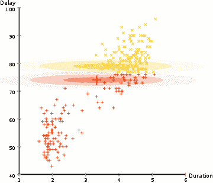

对老忠实喷发数据的期望最大化([维基百科](https://en.wikipedia.org/wiki/Expectation%E2%80%93maximization_algorithm))

在这个例子中，我们有黄石公园标志性[老忠实](https://en.wikipedia.org/wiki/Old_Faithful)间歇泉喷发的数据。对于每一次喷发，我们都测量了它的长度和自上次喷发以来的时间。我们可以假设有两种“类型”的喷发(图中的红色和黄色)，对于每种类型的喷发，结果数据由(多元)正态分布生成。顺便提一下，这被称为高斯混合模型。

与 [k 均值聚类](https://en.wikipedia.org/wiki/K-means_clustering)类似，我们从随机猜测这两个分布/聚类开始，然后通过交替两步进行迭代改进:

1.  (**期望**)概率性地将每个数据点分配给一个聚类。在这种情况下，我们计算它分别来自红色集群和黄色集群的概率。
2.  (**最大化**)根据聚类中的点(按第一步中分配的概率加权)更新每个聚类的参数(加权平均位置和方差-协方差矩阵)。

注意，与 k-means 聚类不同，我们的模型是*生成的*:它旨在告诉我们数据生成的过程。反过来，我们可以对模型进行重新采样，以生成更多(虚假)数据。

明白了吗？现在我们要用方程做一个一维的例子。

考虑具有单个测量值 x 的数据点。我们假设这些数据点由两个簇生成，每个簇遵循正态分布 N(μ，σ)。第一个集群生成数据的概率为π。

因此，我们有 5 个参数:混合概率π，以及每个聚类的平均值μ和标准差σ。我将它们统称为θ。

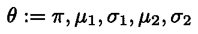

我们模型的 5 个参数，统称为θ

观察到值为 x 的数据点的概率是多少？设正态分布的概率密度函数用ϕ.表示为了让符号不那么混乱，我将使用标准差作为参数，而不是通常的方差。

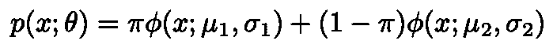

观察值为 x 的点的概率

观察我们的整个数据集的 *n* 个点的概率(可能性)是:

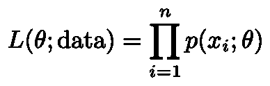

观察整个数据集的可能性

我们通常选择取这个的对数，把我们的乘积变成一个更容易管理的和，对数似然。

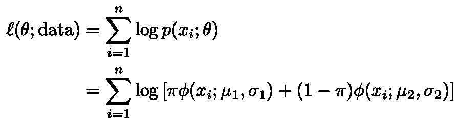

对数-观察我们数据的可能性

我们的目标是最大化这一点:我们希望我们的参数是最有可能观察到我们观察到的数据的参数(最大似然估计)。

现在的问题是，我们如何优化它？由于对数中的和，直接分析性地这样做将是棘手的。

诀窍是想象有一个**潜在变量**，我们称之为δ。它是一个二进制(0/1 值)变量，用于确定某个点是位于聚类 1 还是聚类 2 中。如果我们知道每个点的δ，计算参数的最大似然估计就很容易了。为了方便匹配第二个聚类的δ为 1 的选择，我们将π转换为点在第二个聚类中的概率。

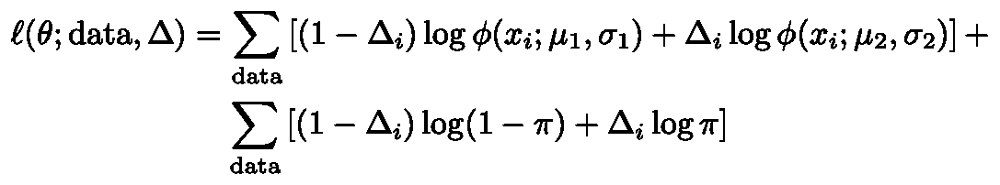

请注意，总和现在不在对数之内。此外，我们获得一个额外的总和，以说明观察到每个δ的可能性。

反过来假设我们确实观察到了δ，最大似然估计很容易形成。对于μ，取每个聚类内的样本均值；对于σ，标准差也是如此(总体公式，即最大似然估计)。对于π，第二个聚类中点的样本比例。这些是每个参数的最大似然估计量。

当然，我们没有观测到δ。对此的解决方案是期望最大化算法的核心。我们的计划是:

1.  从参数的任意初始选择开始。
2.  (**期望值**)形成δ的估计值。
3.  (**最大化**)计算最大似然估计量来更新我们的参数估计。
4.  重复步骤 2 和 3 以收敛。

同样，您可能会发现考虑 k-means 聚类很有帮助，我们也是这样做的。在 k-means 聚类中，我们将每个点分配到最近的质心(期望步长)。本质上，这是对δ的硬估计。很难，因为其中一个集群的值为 1，其他所有集群的值为 0。然后，我们将质心更新为聚类中点的平均值(最大化步骤)。这是μ的最大似然估计。在 k 均值聚类中，数据的“模型”没有标准偏差。(“模型”在吓人的引号中，因为它不是可生成的)。

在我们的例子中，我们将改为对δ进行*软*赋值。我们有时称之为*责任*(每个集群对每个观察的责任有多大)。我们将把责任标为ɣ.

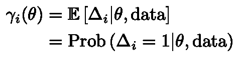

每个集群对于数据点 I 的责任ɣ

现在我们可以写下这个例子的完整算法。但在此之前，我们将快速回顾一下我们定义的符号表(有很多)。

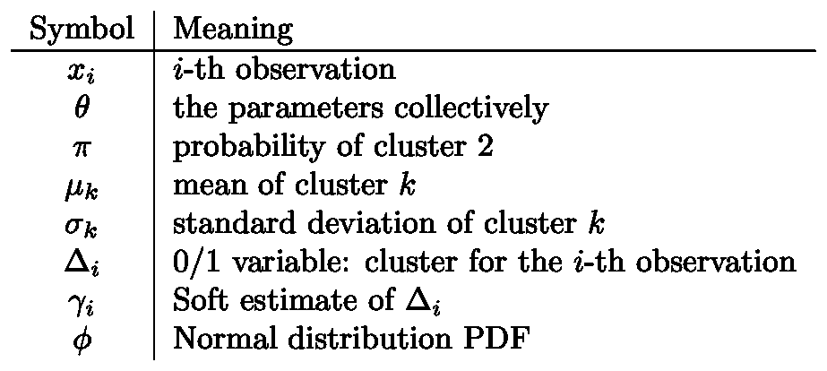

符号表

算法是这样的:

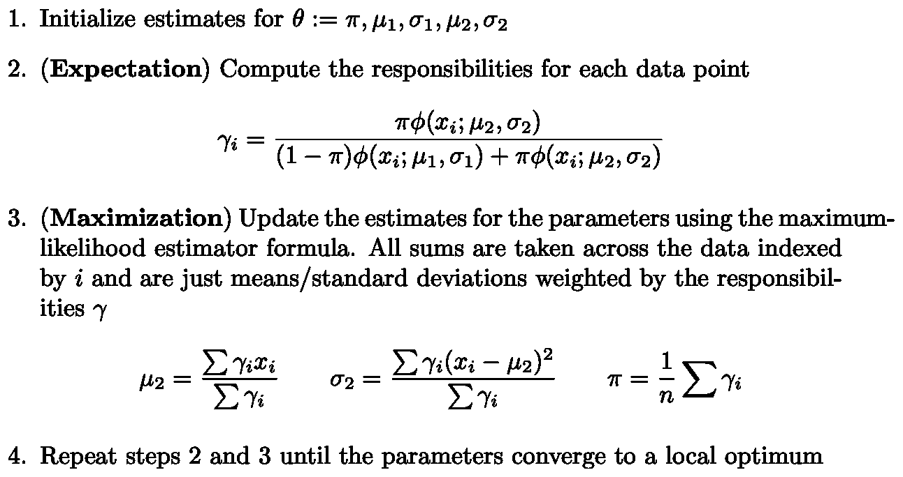

我们例子中的期望最大化算法

注意，对聚类 1 的μ和σ的估计是类似的，但是使用 1–ɣ作为权重。

现在我们已经给出了一个算法的例子，希望你已经有了感觉。我们将继续讨论一般的算法。这基本上相当于用稍微复杂一点的变量来修饰我们所做的一切。这将使我们能够解释为什么它会起作用。

# 一般期望最大化

让我们转到一般设置。设置如下:

1.  我们有某种形式的数据 X。
2.  我们假设还有未被观察到的(潜在的)数据δ，不管是什么形式。
3.  我们有一个参数为θ的模型。
4.  我们有能力计算对数似然ℓ(θ；x，δ)。具体来说，观察我们的数据的概率日志*和*指定了给定参数的潜在变量的赋值。
5.  在给定一组参数的情况下，我们还能够使用该模型来计算条件分布δ| X。我们将把这个 P(δ| X；θ).
6.  因此，我们可以计算对数似然ℓ(θ；x)。这是在给定参数的情况下观察到我们的数据的概率的对数(没有假设潜在变量的赋值)。

使用 P 来表示概率，我们现在可以使用[链式法则](https://en.wikipedia.org/wiki/Chain_rule_(probability))来写:

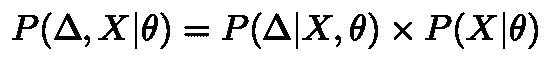

概率的链式法则

这里的符号可能很微妙。这三项都以参数θ为给定值。

1.  左边的第一项是观察数据的概率和指定的潜在变量赋值。
2.  右手边的第一项是给定观察数据的潜在变量的指定赋值的概率。
3.  最后一项是观察数据的概率。

我们可以取对数并重新排列术语。然后在第二行我们将做一个符号的改变(而且是一个令人困惑的改变)。别怪我，不是我发明的):

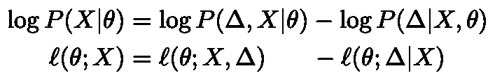

对于前两个术语，有必要回顾一下它们在我们上一个示例的上下文中是什么。第一个，ℓ(θ；x)，是我们要优化的。第二个，ℓ(θ；x，δ)是分析上容易处理的。

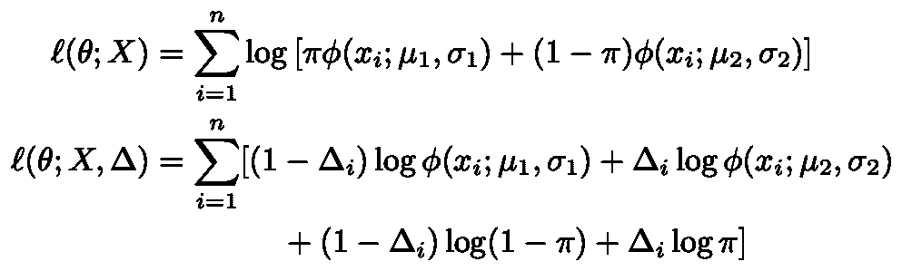

高斯混合模型示例中的似然公式

还记得我说过，给定参数θ，我们可以计算条件分布δ| X 吗？这就是事情变得疯狂的地方。

我们将引入第*组第二*组相同的参数，称之为θʹ.我有时也会用一顶帽子(扬抑符)来表示它，就像这个“ê”所戴的帽子一样。把这组参数想象成我们的*电流*估计值。我们将对公式中的θ进行优化，以提高我们的估计值。

现在，我们将获得条件分布δ| x，θʹ的对数似然性的期望，即给定数据和当前参数估计的潜在变量的分布。

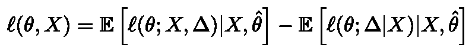

左手边的项不变，因为它不知道/不关心δ(它是一个常数)。同样，期望值超过了δ的可能值。如果你跟随我们的例子，术语ℓ(θ；x，δ)在我们取期望值后改变，所以δ被ɣ.代替

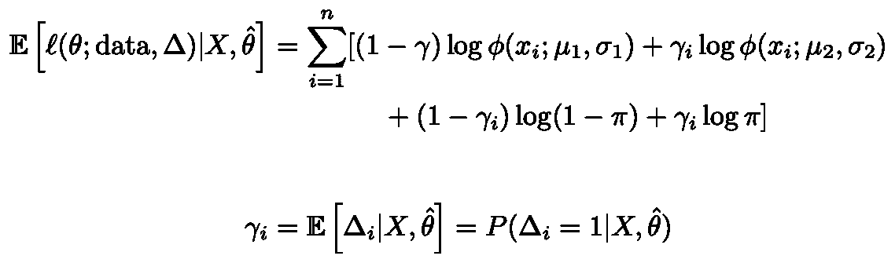

高斯混合模型例子中似然的期望。

现在，很快地，为了改善我们正在进行的记数噩梦，让我们介绍一下右手边的两个期望的简写记数法

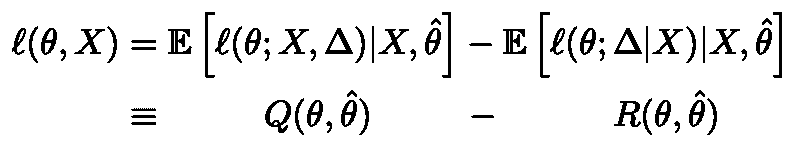

预期可能性的速记符号

该算法变成:

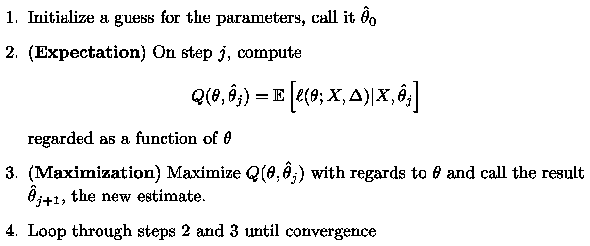

一般期望最大化算法

## 为什么有效

证明这一点的最重要的工作是考虑函数 R(θ，θʹ).这种说法是，当θ=θʹ.代替一个完整的证明，让我们想想 R 计算什么。去除对数据 X 的依赖(在我们期望的分布和似然函数之间共享)，R 示意性地变成

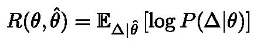

函数 R 的示意形式

换句话说，我们有两种概率分布。我们使用一个(由θʹ参数化)来生成数据δ，我们使用另一个(由θ参数化)来计算我们所看到的概率。如果δ仅代表一个数字，并且分布具有概率密度函数，我们可以写(再次，示意性地)

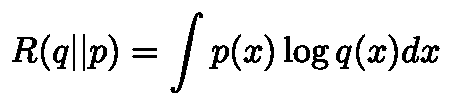

特殊情况下函数 R 的示意性形式

我以类似于 [Kullback-Leibler (KL)散度](https://en.wikipedia.org/wiki/Kullback%E2%80%93Leibler_divergence)的形式写下了这一点，这(几乎)是两个概率分布之间距离的度量。如果我们从一个常数 R(p||p)中减去 R(q||p ),我们将得到 KL 散度，它在 0 以下有界，并且当 q=p 时只有 0。换句话说，当 q=p 时，R 最大。这是关于 KL 散度的标准结果，可以用詹森不等式证明。⁴

现在唯一要做的事情是考虑更新步骤前后的可能性之间的差异:

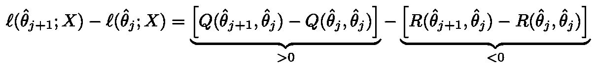

更新步骤后可能性的提高

我们选择新的参数来最大化 Q，所以第一项肯定是正的。根据上面的论证，R 通过将旧参数作为其第一个参数而最大化，因此第二项必须是负的。正减去负就是正。因此，这种可能性在每次更新时都会增加。每一步都保证让事情变得更好。

还要注意，我们不需要优化 q。我们所要做的就是找到一些方法让它变得更好，我们的更新仍然保证让事情变得更好。

# 结论

希望你现在对这个算法有一个好的感觉。从数学的角度来说，关键方程就是下面的可能性。在那之后，我们只需要对旧参数进行期望(期望步骤),并表明我们可以优化右边的第一项。正如我们以高斯混合模型为例，第二项通常更容易优化。第三个学期我们不用担心，不会搞砸什么的。

后退一点，我想强调 EM 算法的强大和有用性。首先，它代表了我们可以通过交替处理潜变量(取参数为固定已知)和处理参数(取潜变量为固定已知)来引入潜变量然后计算的思想。这是一个强有力的想法，你会在各种环境中看到。

第二，该算法天生快速，因为它不依赖于计算梯度。任何时候你可以解析地解决一个模型(比如使用线性回归)，它会更快。这让我们能够分析棘手的问题，并通过分析解决部分问题，将这种能力扩展到迭代环境中。

最后，我想指出，关于 EM 算法还有很多要说的。它推广到进行最大化步骤的其他形式和[变分贝叶斯](https://en.wikipedia.org/wiki/Variational_Bayesian_methods)技术，并且可以以不同的方式理解(例如作为[最大化-最大化](https://en.wikipedia.org/wiki/Expectation%E2%80%93maximization_algorithm#As_a_maximization%E2%80%93maximization_procedure)或者作为在统计流形上的相互对偶仿射连接(e-和 m-连接)下到子流形的交替投影)。以后会有更多的报道！

# 感谢

这种讨论很大程度上遵循了统计学习中的[要素，尽管速度更慢一些。特别感谢](https://web.stanford.edu/~hastie/ElemStatLearn/)[芳芳李](https://medium.com/u/e4cecbc19a01?source=post_page-----c82f5ed438e5--------------------------------)告知我这个奇妙的算法。

# 笔记

[1]潜在的狄利克雷分配通常适合于[变分贝叶斯](https://en.wikipedia.org/wiki/Variational_Bayesian_methods)方法，一种期望最大化的[扩展](https://en.wikipedia.org/wiki/Variational_Bayesian_methods#:~:text=Variational%20Bayes%20can%20be%20seen,distribution%20of%20the%20parameters%20and)。例如，参见 [sklearn](https://scikit-learn.org/stable/modules/generated/sklearn.decomposition.LatentDirichletAllocation.html) 实现。

[2]在这个平台上不可能键入超过θ的帽子。请给我们一些乳胶。

[3]我没有将距离放在引号中，因为我不是指 Kullback-Leibler 散度(这不是一个度量标准)，而是指 Fisher 信息度量标准(这是一个度量标准)。这两者有很深的联系；对我们来说，我们可以说当实际距离为 0 时，KL 散度为 0。

[4]对这一点的标准证明似乎是对詹森不等式的笨拙的求助。我的版本也是手工的，但是通过 KL-divergence 合并了 Jensen 的版本。