# 解释了 GMM 的期望最大化

> 原文：<https://towardsdatascience.com/expectation-maximization-for-gmms-explained-5636161577ca?source=collection_archive---------10----------------------->

## [内部 AI](https://medium.com/towards-data-science/inside-ai/home)

## 直观、实用的数学解释

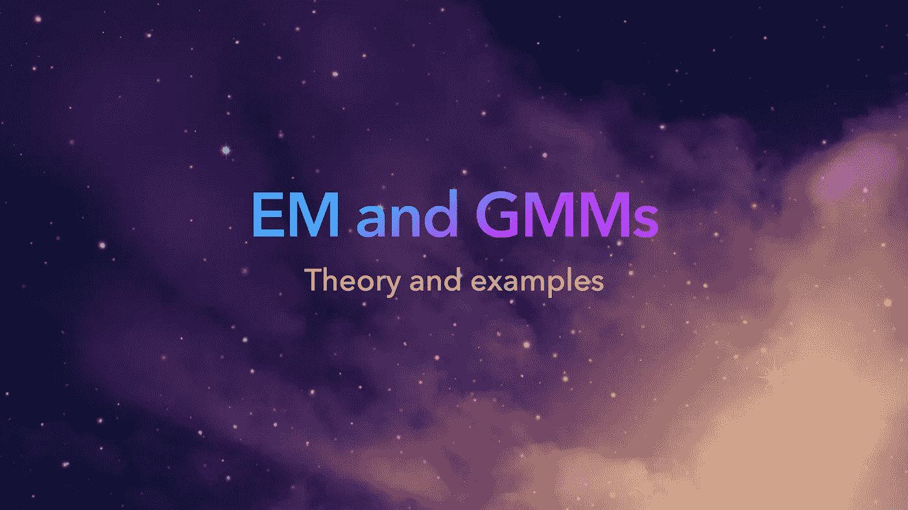

在这篇文章中，我们将以我能想到的最清晰的方式，回顾用 EM 训练高斯混合模型的过程。到本文结束时，您应该对 GMM、EM 做什么以及所有这些的应用有了更广泛的理解。

我们将讨论以下几点:

1.  什么是 GMM？我们为什么使用 GMM？
2.  训练 GMM
3.  用 EM 训练 GMM
4.  硬/维特比 EM
5.  EM 在 GMM 的应用

顺便提一下，生成这些图形并将其放入交互式 web 应用程序的所有代码都在专用的 Github 存储库中:

 [## 梅尔法比恩/EM _ GMM _ 嗯

### 说明 GMM 和 hmm 的 EM。在 GitHub 上创建一个帐户，为 maelfabien/EM_GMM_HMM 的发展做出贡献。

github.com](https://github.com/maelfabien/EM_GMM_HMM) 

# 一.什么是 GMM？我们为什么使用 GMM？

如果你对 EM 感兴趣，你可能已经知道高斯混合模型。在这一节中，我提供了一些关于我们为什么需要 GMM 的思考，以及对于某些任务，它与其他算法相比如何，所以阅读它可能仍然是有趣的。

## 1.什么是高斯混合模型？

> GMM 是 M 个高斯密度分量的加权和。

它是一个概率模型，假设数据点是由混合高斯成分生成的。GMM 的概率分布函数可以写成:

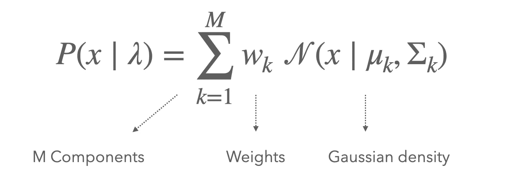

GMM 的 PDF

其中参数记为λ，X 是观测值，我们给每个高斯密度分配一个权重，使得权重总和为 1。GMM 的参数是:

*   每个分量的平均向量
*   每个分量的协方差矩阵
*   以及与每个组件相关联的权重

我们可以在 Python 中用随机参数从高斯混合模型中生成数据(您会在 Github 资源库中找到附带的代码)，并更改组件的数量。

## 2.为什么我们使用高斯混合模型？

假设您有一个包含两个要素的数据集。绘制数据集时，它可能如下所示:

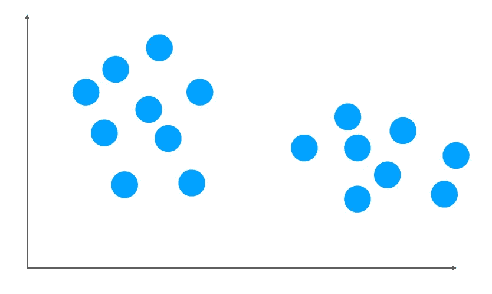

具有两个聚类的数据集

很明显，这里有两个集群。我们通常希望解决两个主要任务:

*   **聚类**这些数据点，传统上用一种聚类算法
*   **建模**基础分布并识别生成模型的参数，其可以例如用作语音处理中的输入，以评估观察值由该 GMM 生成的可能性有多大

现在让我们讨论解决这些任务的两种常见方法，并将它们与高斯混合模型进行比较:

## k-Means 聚类与 GMM 聚类

k-Means 是聚类的常用选择。我们将在本文中看到，当用特殊类型的 EM 算法求解时，k-Means 实际上是 GMMs 的一个特例。但是我们会回来的。

好了，你可能知道 k-Means 迭代地识别每个聚类的质心坐标。因此，它仅依赖于 1 个分量，即每个聚类的平均值。当两个聚类的均值重叠，但协方差矩阵不同时，可能会出现问题。我们可以说明在这个任务中，与 k-Means 相比，GMM 工作得有多好。

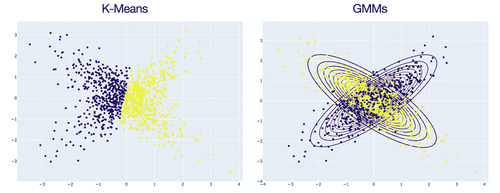

聚类的 K-Means 与 GMMs

下面总结了 K-Means 和 GMM 之间的主要区别。你可能会开始看到，如果我们考虑一个身份协方差矩阵，并在一个额外的假设下，k-均值和 GMMs 将最终成为相同的解决方案。

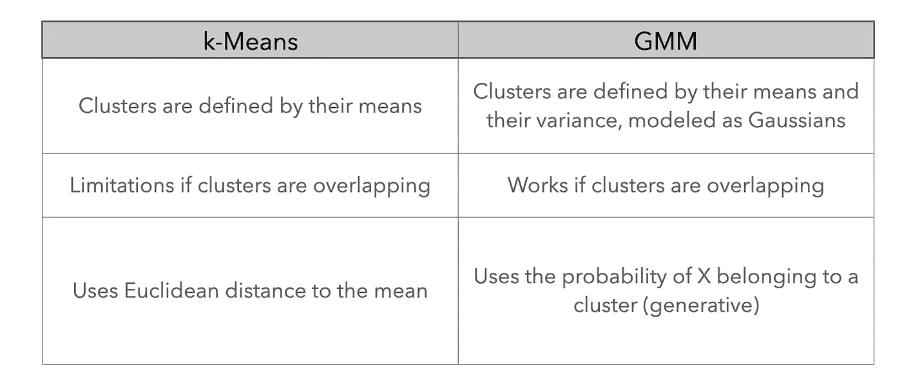

请注意，对于 k-Means 和 GMM，您需要指定所需的聚类数，这可能是一项艰巨的任务。我们会回来的。

## 使用高斯和 GMM 对分布进行建模

如果我们现在讨论第二个任务，即建模分布，高斯分布通常是一个自然的选择。然而，在我们的数据具有两个聚类的情况下，选择单个高斯模型来模拟该数据是一个问题。事实上，如果我们计算数据的平均值，我们可能会在一个绝对没有数据点的区域结束，这与平均值的最大似然估计应该给我们的结果正好相反。

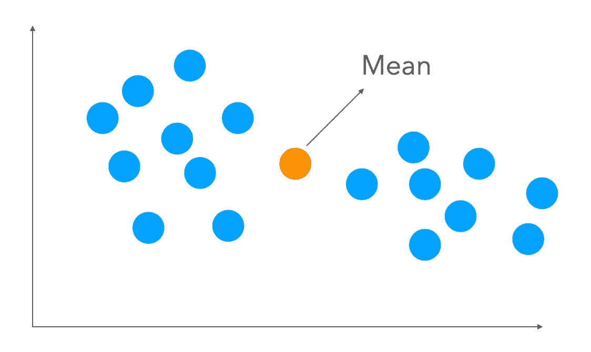

用一个高斯模型模拟这些数据

相反，使用 2 个高斯函数会更有趣，并且允许我们:

*   第一高斯分布的均值和协方差
*   第二高斯分布的均值和协方差
*   每个高斯分量的权重

# 二。训练 GMM

最终，您将需要训练一个 GMM，这意味着识别正确的参数集来描述您的 GMM。

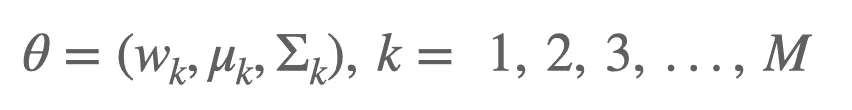

GMM 参数

但是我们如何解决 GMM 和估计这些参数呢？让我们首先解决一个高斯作为一个有用的提醒。

## 1.求单高斯的参数

为了识别单高斯的参数，我们应用了**最大似然估计** (MLE):

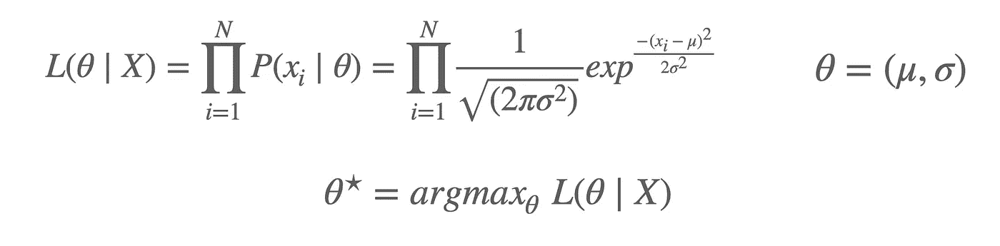

单高斯模型的最大似然估计

**L** 是给定参数的观测值序列的似然性。我们的目标是最大化这种可能性，以确定最佳参数集，使我们的观察最“可能”。为了方便起见，为了进行求和，我们通常最大化对数似然，因为:

对数似然

我们只需要将偏导数设为 0，就可以获得参数的最大似然估计:

单高斯参数的极大似然估计

## 2.求高斯混合模型的参数

当我们考虑 GMM 时，我们有几个高斯分量和与每个分量相关的权重因子。类似地，我们可以将可能性改写为:

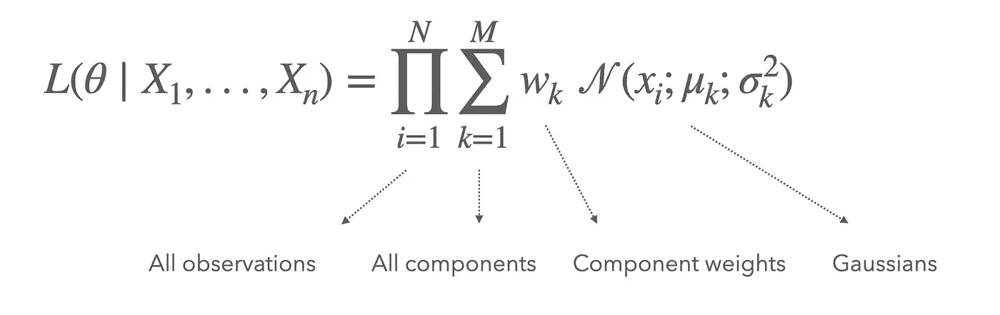

GMM 的可能性

我们可以再次采用对数似然法:

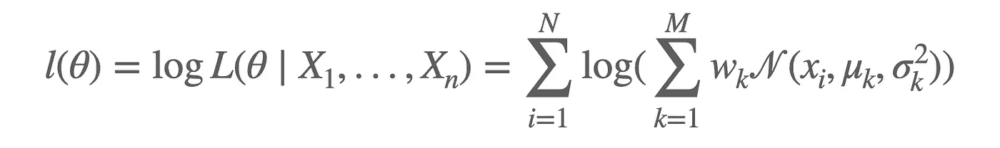

GMM 的对数可能性

看起来更难解决。如果我们把对第 k 个均值的导数设为 0 呢？

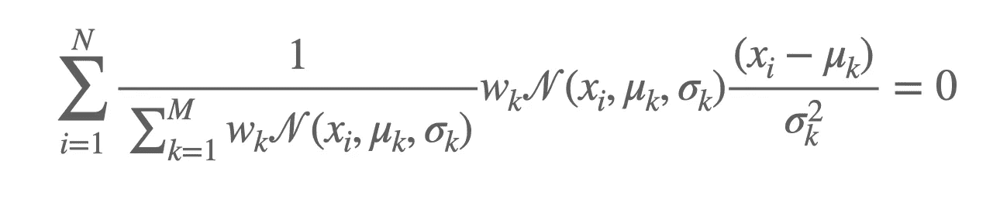

将平均导数设置为 0

这就是单高斯方法的极限。这个表达式解析**无解！这就是为什么我们需要期望最大化(EM)来克服这种无法解决的表达。这就是我们将在下一节中讨论的内容，下一节将重点讨论用 EM 训练 GMM。**

# 三。用 EM 训练 GMM

## 1.EM 简介

EM 背后的主要思想如下:

*   我们知道如何求解单高斯的参数
*   但是我们不知道如何求解高斯混合
*   那么如果我们知道每个数据点属于哪个高斯分量呢？
*   它可能会帮助我们确定每个高斯的参数！
*   如果我们首先猜测哪个点属于哪个分量，我们可以迭代地改进这个猜测，并使这个猜测收敛到最优解。

视觉上，我们首先假设我们知道每个观察值 Xi 属于哪个分量 Zi = k:

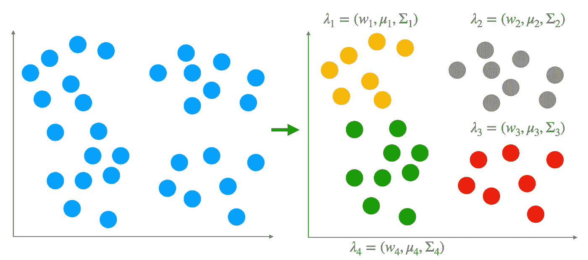

潜在变量图解

当我们假设我们知道每个观察值属于哪个分量时，我们说有一个**潜变量 Z.**

*   现在说 X 是*不完全数据*，而**完全数据**是:(X，Z)
*   节理密度为:P(X，Z |θ)= P(Z | X，θ)P(X |θ)
*   现在说可能性 L(θ| X)是*不完全的*
*   **完全可能性**现在变成:L(θ| X，Z) = P(X，Z |θ)

EM 算法由几个步骤组成:

*   我们随机初始化组件的参数，或者通过 k-Means 找到哪些值
*   **期望**步骤，在该步骤中，给定 X 和θ，我们估计 **Z** 的分布，表示为γ
*   **最大化**步骤，其中我们最大化 Z 和 X 的联合分布，以导出参数θ的最优值
*   我们迭代 E 步和 M 步，直到满足收敛标准。

在最后一步，我们已经获得了 GMM 的最佳参数(事实上，收敛性也取决于初始化)。

## 2.电子步骤

在 E 步骤中，如上所述，我们需要估计给定观测值 Xi 属于给定分量 Zk 的概率。这实际上就是我们所说的**伪后验**，表示为:

伪后验估计

从视觉上看，它可以简单地表示为估计下列量:

估计伪后验概率

然后将该值插入到所谓的**辅助功能中。**辅助功能定义为:

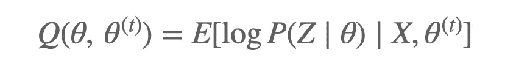

辅助功能

其中，θt 是旧参数值，θ是新参数值。

这个辅助函数的表达式可能看起来很奇怪，但它实际上可以被证明是我们通过更新参数值获得的可能性增益的下限。*不感兴趣的话可以不看这个*，但这是一种说明参数更新的似然增益 L(θ)-L(θt)有辅助函数作为下界的方式。

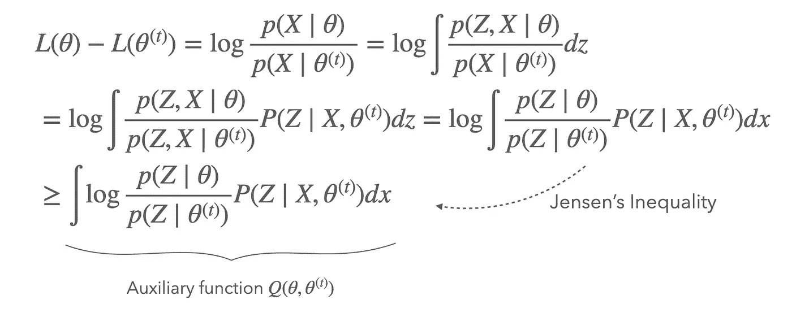

回想一下，我们不使用任何其他方法，因为它在分析上是不可解的。好吧，但是我们在哪里插入伪后验概率的估计呢？让我们扩展一下这个辅助功能:

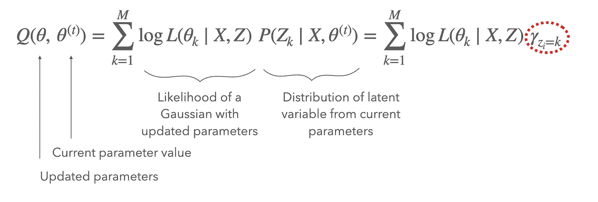

具有伪后验估计的辅助函数

这是我们插入这个值的地方。这就是 E 步的结尾。我们现在可以跳到 M 步骤，在估计辅助函数值后，我们将其最大化以确定参数的最佳值！

## 3.M 步

在最大步长(M-step)中，我们最大化 Q 值以找到最佳参数值:

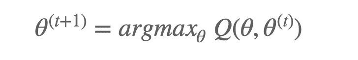

m 步

而且这个表达式可以解析求解！我们可以将权重、均值和协方差的导数设置为 0，并确定最佳值:

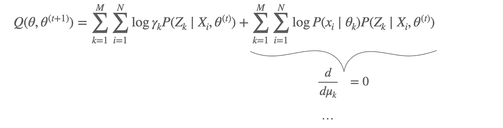

将导数设置为 0 以确定最佳参数值

**好吧，在那之前有一点数学，但如果你还在阅读，这是它变得更直观的地方**。平均参数的最佳值为:

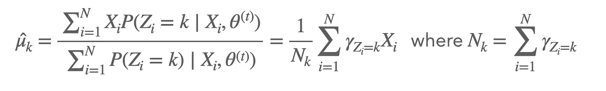

由 M 步定义的最佳平均参数值

平均值定义为数据的加权平均值，其权重显示了每个观测值属于 GMM 某个分量的可能性。视觉上，你可以这样表示:

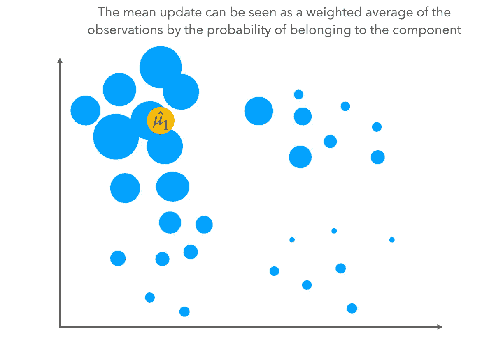

属于每个组件的概率加权平均值

直观上，越靠近第一分量的点越有可能属于这个第一分量。但不代表远离这个分量的点没有概率属于它。因此，我们计算这个加权平均值。协方差的值可以以类似的方式看到，并表示为:

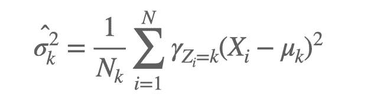

协方差更新值

最后，权重是所有点属于第一聚类的概率的总和除以点的总数:

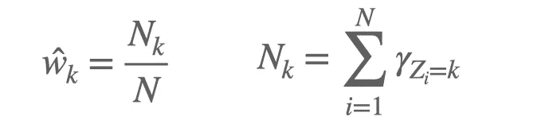

重量更新

## 4.反复的过程

我们使用这些新的参数值，并将它们再次注入到 E-step 中:

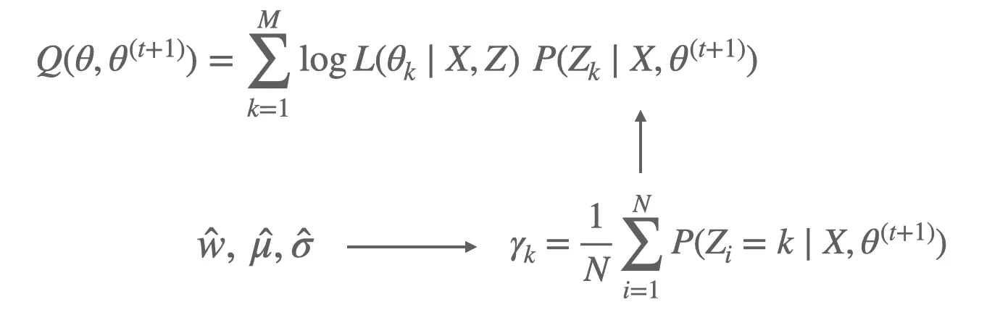

再次 e 步

参数值影响辅助函数的方式是通过伪后验估计:

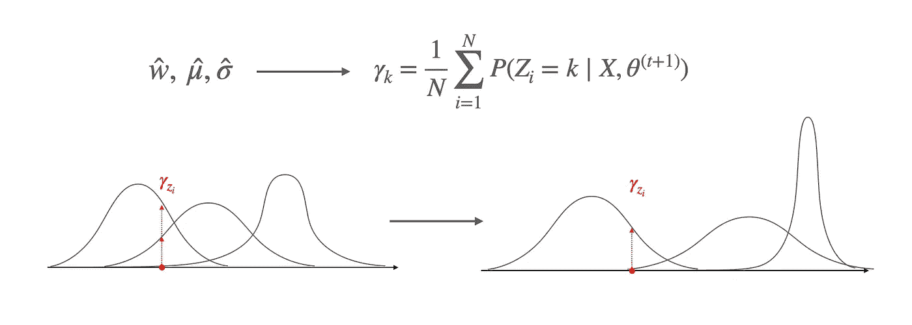

参数更新

我们计算辅助函数，并在 M 步中再次最大化它。整个 EM 算法可以示意性地表示如下:

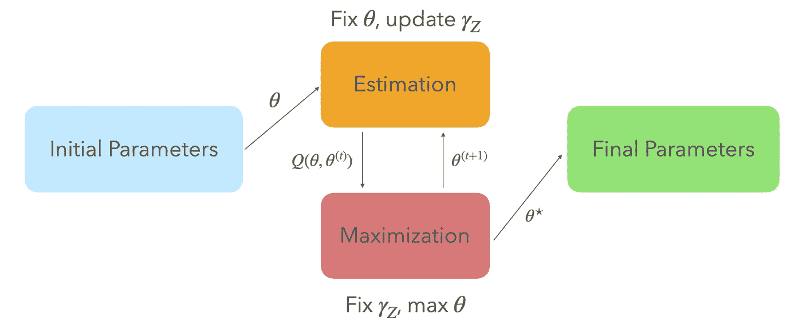

EM 迭代过程

我们可以这样描绘 GMM 的视觉训练周期:

迭代 EM 训练周期

同样，您可以在 Github 资源库中找到使用 Plotly 的动画代码。

EM 保证增加迭代次数的可能性:

EM 可能性增加

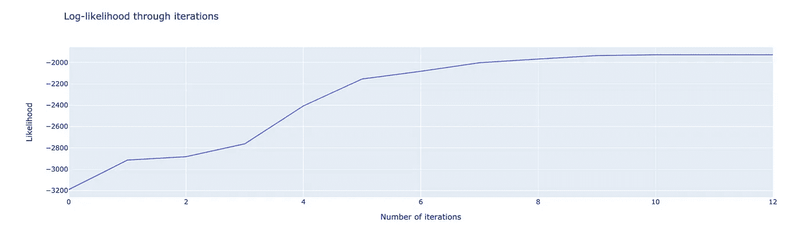

## 5.电磁极限

说吧，EM 不猥琐，但是很好看。但是，它有几个限制，我想谈谈:

*   这取决于我们在启动 E-step 之前进行的初始化
*   它只收敛到局部最优
*   运行两次不会得到相同的结果
*   高度相关的特征可能会阻止 EM 收敛
*   因为在我们的推导中，辅助函数依赖于 Jensen 不等式，它假设凸函数，因此 EM 不适用于所有的基础分布(例如，也适用于多项式)
*   我们需要确定 GMM 中组件的正确数量，这并不总是微不足道的

让我们回到最后这一点。为了选择正确的元件数量，我们必须定义一个优化标准，在元件数量上迭代，看看哪个优化了标准。有两个标准可以做到这一点:

*   艾卡克信息标准(AIC)
*   贝叶斯信息准则(BIC)

我不会涉及这方面的细节，但简单地记住，BIC 往往比 AIC 在模型复杂性(即组件数量)方面惩罚更多。这种方法通常需要很大的计算能力，但是您最终会得到这样的结果:

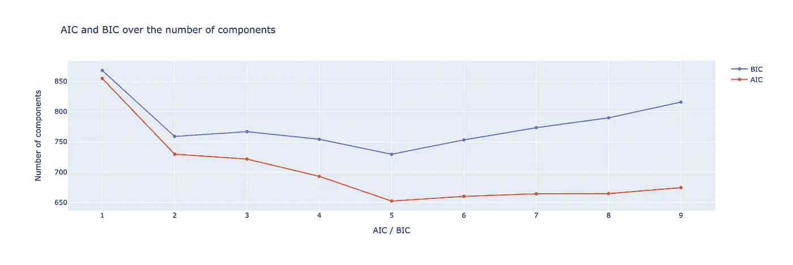

AIC 和 BIC 准则

AIC 和 BIC 需要最小化。在上面的示例中，5 是 GMM 组件的最佳数量。

# 四。硬/维特比 EM

我还想提一个特例。这是硬 EM 或维特比 EM 的情况。这与我们之前看到的有一个主要区别，顺便说一下，这被称为**全 EM 或软 EM。**

在艰难的 EM 中，我们做出**艰难的**选择。我们不考虑所有可能的 **Z** 的概率权重，而是简单地选择最有可能的 Z，然后继续前进。

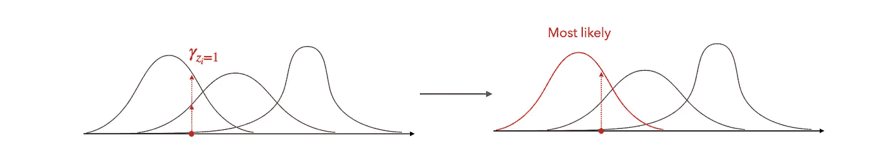

维特比 EM

我们使用硬/维特比 EM 有几个原因:

*   硬 EM 更容易实现
*   但是它没有考虑 Z 的多种可能性，如果我们对 Z 的了解有限，这就成了一个问题
*   k-Means 实际上是硬 EM 的一个特例，有一个恒等协方差矩阵

我们在上面看到的表达式中唯一会改变的是，我们必须用一个最大值代替所有分量的总和。在这篇文章中，我们已经看到了几种表达的意思。比较它们会很有趣，可以看到它们都被这个伪后验定义联系在一起:

平均值更新公式

# 动词 （verb 的缩写）EM 在 GMM 的应用

我认为以 GMM 在哪里被使用的实际概述来结束这篇(长)文章会很好。这只是一个概述，我并不认为我对 GMM 的使用有多广泛有所了解。

## 1.演讲中的 GMM

GMM 广泛用于语音中，例如性别检测，其中每种性别的一个 GMM 可以被拟合在 MFCCs 上，并且我们将样本归属于具有最高可能性的 GMM。

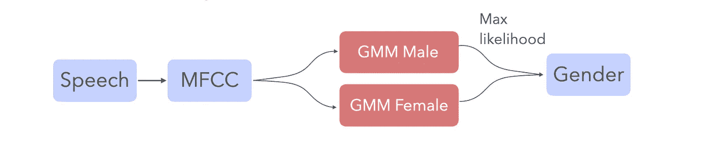

这是语音处理的众多应用之一。

## 2.计算机视觉中的 GMMs

GMM 也用于计算机视觉中的背景减法，例如，其中背景是给定的聚类，而要保留的运动物体是另一个聚类。

将 k-Means 视为 GMMs 的特例，k-Means 用于*矢量量化*。例如，这是一种用于图像的压缩方法，它防止存储每个像素的值，而只是存储聚类和由 k-Means 识别的值。更具体地说，k-Means 是可以用来执行 VQ 的方法之一。

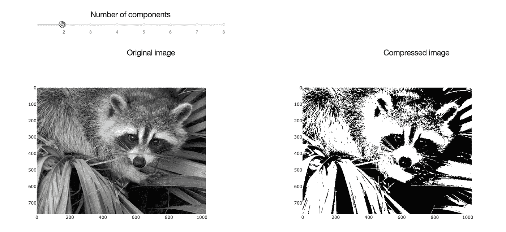

矢量量化

## 3.使聚集

更广泛地说，GMM 用于聚类，并且非常有效。GMM 满足密度属性的通用近似(参见[https://math . stack exchange . com/questions/3122532/Gaussian-mixture-model-what-a-universal-approximator-of-densities](https://math.stackexchange.com/questions/3122532/gaussian-mixture-model-what-is-a-universal-approximator-of-densities))。

# 结论

在这篇文章中，我们看到:

*   什么是 GMM，它们与 k-Means 相比如何
*   训练 GMM 意味着什么
*   为什么直接解决它在分析上是不可行的，而我们需要它们
*   EM 是什么
*   EM 的性质和限制
*   什么是硬/维特比 EM
*   GMM 的应用

我希望这篇文章对你有用。请在您的反馈中留下评论，说明哪些内容是清楚的，哪些需要更好的解释/说明。我花了一些时间将所有这些放在一起，我想参考一些我结合的优秀参考资料。

这篇文章以幻灯片的形式发表在我的个人博客上(有近 200 篇其他文章)，就在这里:【https://maelfabien.github.io/machinelearning/GMM/#

# 参考

*   单高斯的 MLE，[http://Jr Meyer . github . io/machine learning/2017/08/18/MLE . html](http://jrmeyer.github.io/machinelearning/2017/08/18/mle.html)
*   GMMs 的 MLE，[https://Stephens 999 . github . io/five minute stats/intro _ to _ em . html](https://stephens999.github.io/fiveMinuteStats/intro_to_em.html)
*   EM 算法和变体:非正式教程，*亚历克西斯·罗奇*
*   (硬)期望最大化，*大卫·麦卡勒斯特*，[https://ttic . uchicago . edu/~ dmcallester/ttic 101-07/lectures/em/em . pdf](https://ttic.uchicago.edu/~dmcallester/ttic101-07/lectures/em/em.pdf)
*   关于 EM 的简短说明，*布伦丹·奥康纳，*[https://www . cs . CMU . edu/~ Tom/10601 _ fall 2012/retentions/EM . pdf](https://www.cs.cmu.edu/~tom/10601_fall2012/recitations/em.pdf)
*   矢量量化，*大卫·福塞斯，*[http://luthuli . CS . uiuc . edu/~ daf/courses/CS-498-DAF-PS/讲座%2012%20-%20K-means，%20GMMs，%20EM.pdf](http://luthuli.cs.uiuc.edu/~daf/courses/CS-498-DAF-PS/Lecture%2012%20-%20K-means,%20GMMs,%20EM.pdf)
*   用 GMMs 进行背景减法， *D. Hari Hara Santosh，P. Venkatesh，P. Poornesh，L. Narayana Rao，N. Arun Kumar，*http://citeseerx.ist.psu.edu/viewdoc/download?doi = 10 . 1 . 1 . 649 . 8642&rep = re P1&type = pdf