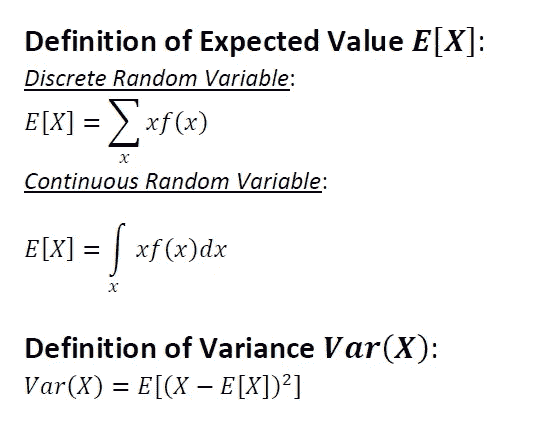
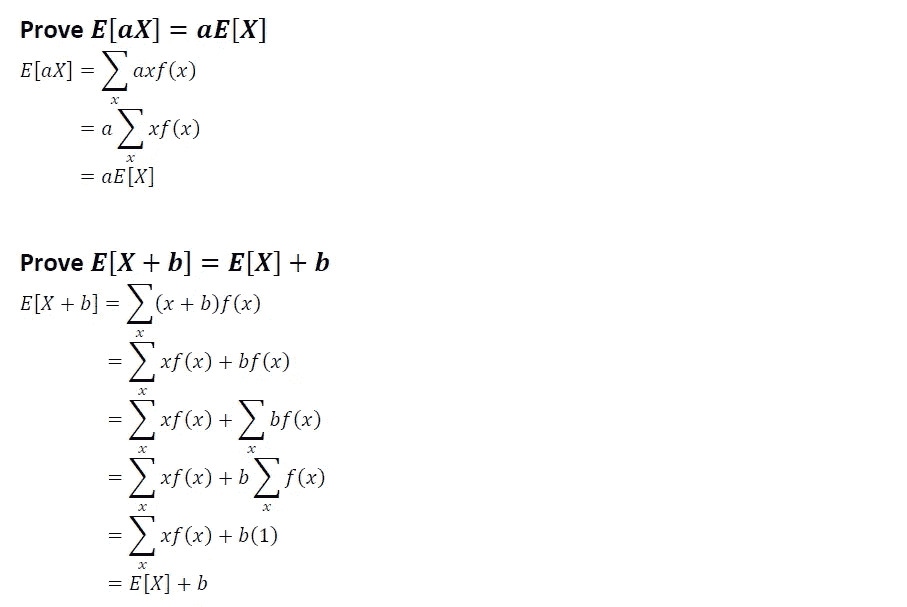
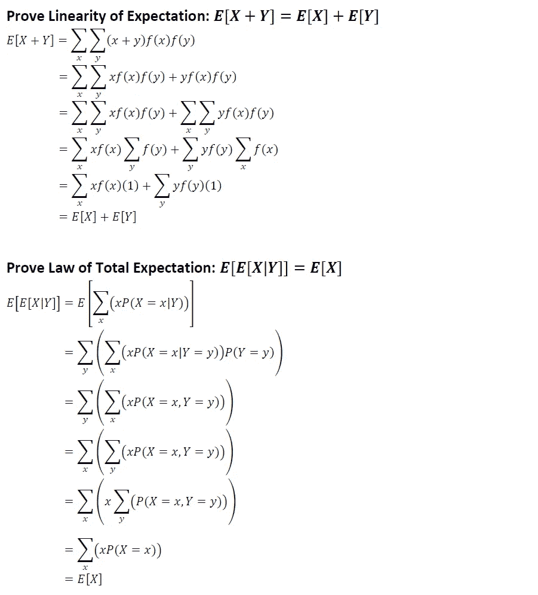
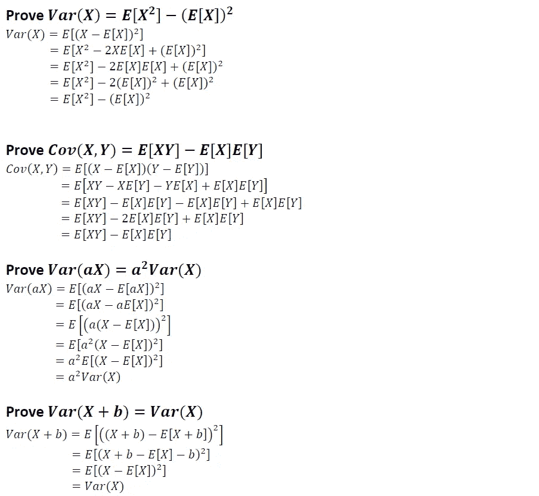
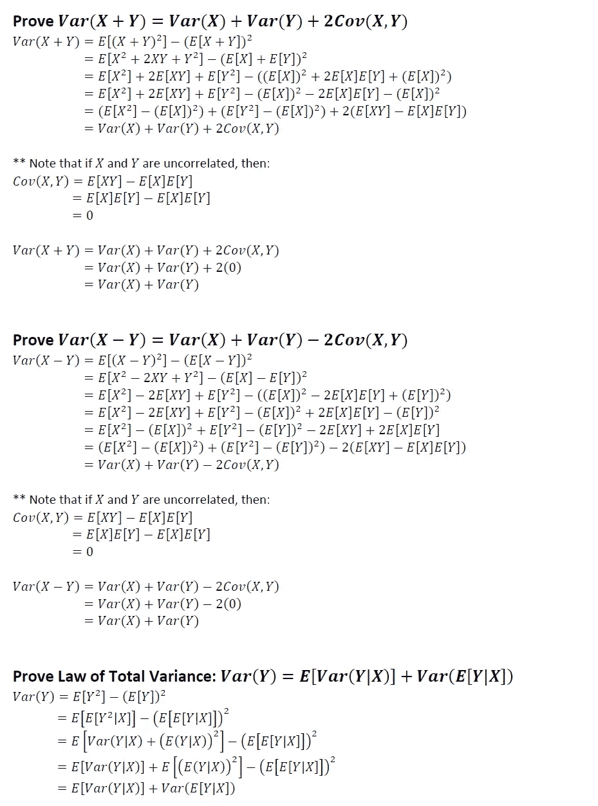
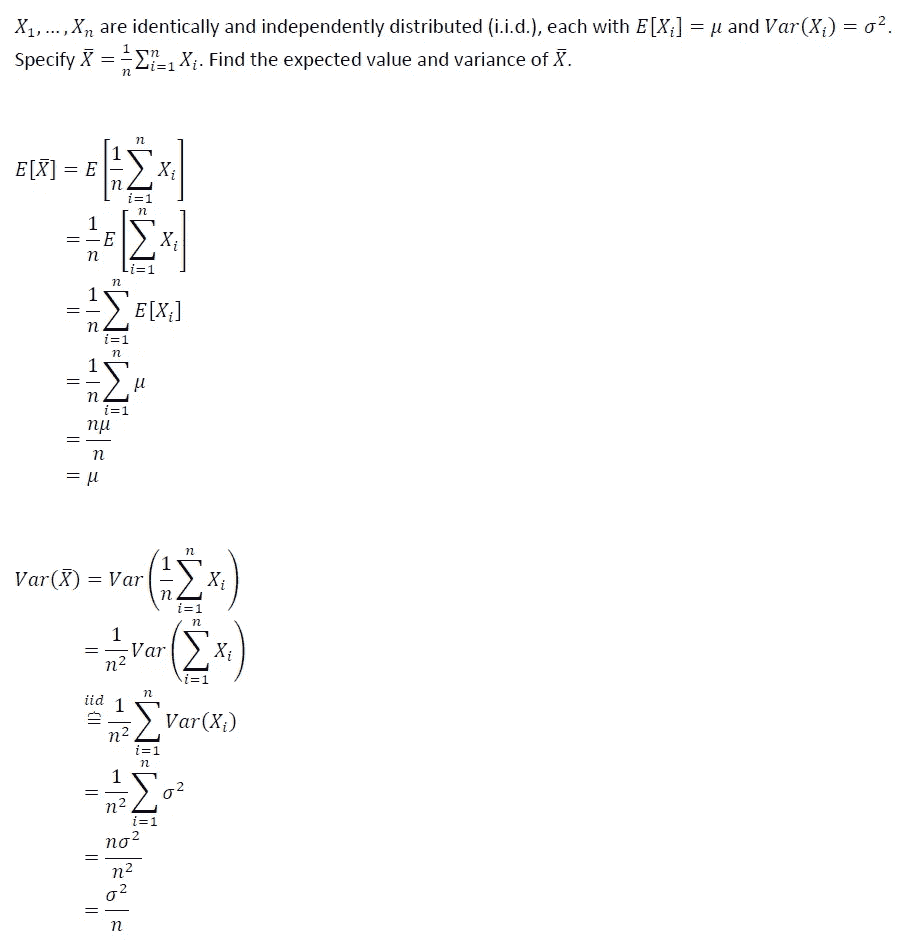

# 期望和差异关系

> 原文：<https://towardsdatascience.com/expectations-variance-relations-4d9fe224f8a0?source=collection_archive---------80----------------------->

## 基本性质及其证明

这篇文章将会简短而甜蜜。当涉及到一般的技术知识时，我非常支持对一个人正在使用的方法有坚实的基础和扎实的理解。一般来说，我不喜欢记忆任何东西，并尽可能避免这样做。相反，我专注于发展概念的坚实基础，然后我可以用数学方法推导出我可能需要的任何东西。

从数学上理解期望、方差、它们之间的关系，以及如何对它们进行分析操作，是任何人学习概率论和/或数理统计基础知识的第一步。对 Medium 的快速搜索显示，这些证据和关系(据我所知)还没有被简单地组织在一篇文章中。这些是绝对值得了解的概念。

所以让我们开始吧:

# 定义:

请注意:

1.  在下面的几个证明中，我提供了离散情况下的推导。连续情况的证明如下。
2.  大写的变量是随机变量，小写的变量是常量。

# 关系和证据:

让我们深入研究一下关系和证明！

# 应用示例:

让我们看一个非常简单的应用示例:

# 最后的想法

希望以上有见地。正如我在以前的一些文章中提到的，我认为没有足够的人花时间去做这些类型的练习。对我来说，这种基于理论的洞察力让我在实践中更容易使用方法。我个人的目标是鼓励该领域的其他人采取类似的方法。我打算在未来写一些基础作品，所以请随时在[**【LinkedIn】**](http://www.linkedin.com/in/andrew-rothman-49739630)和 [**上与我联系，并在 Medium**](https://anr248.medium.com/) 上关注我的更新！