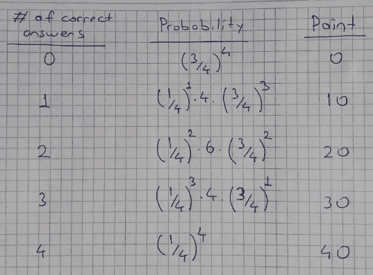

# 随机变量的期望值—简单解释

> 原文：<https://towardsdatascience.com/expected-value-of-random-variables-explained-simply-a0b02eebd9af?source=collection_archive---------3----------------------->

## 并通过例子进行了说明

随机变量的期望值是该变量所有可能值的加权平均值。这里的权重是指随机变量取特定值的概率。

胡萝卜长度的期望值是多少？这里的随机变量是胡萝卜的长度。在这篇文章中，我将解释回答这个问题的方法。

查尔斯·德鲁维奥在 [Unsplash](https://unsplash.com/s/photos/average?utm_source=unsplash&utm_medium=referral&utm_content=creditCopyText) 上拍摄的照片

在详细讲述之前，我们应该区分一下**离散型**和**连续型**随机变量。

*   离散随机变量取有限多个或可数无穷多个值。一年中的下雨天数是一个离散的随机变量。
*   连续随机变量取不可数的无穷多个值。例如，从你家到办公室的时间是一个连续的随机变量。取决于您如何测量它(分钟、秒、纳秒等等)，它需要无数个值。

# **离散随机变量的期望值**

让我们从一个非常简单的离散随机变量 X 开始，它只取值 1 和 2，概率分别为 0.4 和 0.6。

**注意**:概率总和必须为 1，因为我们考虑了这个随机变量可以取的所有值。

这个随机变量的期望值，用 E[X]表示，

如果 1 和 2 的概率相同，那么期望值就是 1.5。离散随机变量的期望值公式为:

你可能认为这个变量只取值 1 和 2，期望值怎么可能是别的值呢？考虑更广的范围。假设我们从这个随机变量中选择 10 个值。总期望值将是 16 (6 乘以 2，4 乘以 1)。

让我们做一个稍微复杂一点的例子。假设你参加了一个有 4 道选择题的测试。每道题 10 分，有 4 个选项。

你甚至没有看问题就随意选择了一个选项。你在这次测试中所得到的分数的期望值是多少？这个问题不需要任何复杂的计算就可以回答。由于有 4 个选项，所以选择正确答案的概率为 0.25。共有 4 个问题，因此您可能会正确回答 1 个问题(1 x 0.25)，这相当于 10 分。

让我们也用公式求出期望值，看看是否得到同样的结果。我们可以正确回答 0、1、2、3 或 4 个问题。因此，我们有一个取值为 0、10、20、30 和 40 的离散随机变量。我计算了下面每种情况的概率，并写下了每种情况的得分。

作者图片

作者图片

期望值是通过将点(xi)和得到该点的概率(p(xi))相乘并将它们相加来计算的。如果你真的继续计算，你会看到结果是 10。

# 连续随机变量的期望值

连续随机变量的期望值是用相同的逻辑但不同的方法计算的。由于连续随机变量可以取不可数的无穷多个值，我们不能谈论一个变量取一个特定值。我们更关注价值范围。

为了计算值范围的概率，使用概率密度函数(PDF)。PDF 是指定随机变量在特定范围内取值的概率的函数。

这里是均匀分布在 5 到 10 之间的连续随机变量的 PDF。x 轴包含所有可能的值，y 轴显示值的概率。

5 到 10 之间均匀分布的连续随机变量(图片由作者提供)

由于变量具有均匀分布，因此所有值的概率都是相同的。整个 PDF 下的面积必须等于 1。对于上面的 PDF，面积是 0.2 x(10–5)，等于 1。不是每个 PDF 都是直线。一般来说，面积是通过对 PDF 进行积分来计算的。

这个随机变量的期望值是 7.5，这在图上很容易看到。然而，最好学习公式，因为不是每个 PDF 都像上面的那样简单。

连续变量期望值的公式为:

根据该公式，期望值计算如下。

作者图片

让我们做一个稍微复杂一点的例子。考虑连续随机变量 x 的如下 PDF。

作者图片

我们将尝试从不同的角度接近期望值。变量取值为 0 的概率为 0。概率随着值的增加而不断增加，最终在值 8 时达到最高概率。

如果这是一个均匀随机变量，期望值将是 4。由于概率随着值的增加而增加，因此期望值将高于 4。

如果你把这个 PDF 想象成一个三角形的均匀金属片或者其他任何材料，期望值就是**质心的 x 坐标。**

这条线代表的 PDF 函数是 f(x) = 0.03125x。如果你计算一下，预期值是 5.33。

作者图片

期望值是统计学和概率论中一个简单却非常基本的概念。为了固化你的理解，我建议自己做几个例子。那你就可以走了！

感谢您的阅读。如果您有任何反馈，请告诉我。

*所有图片均由作者创作，除非另有说明。*