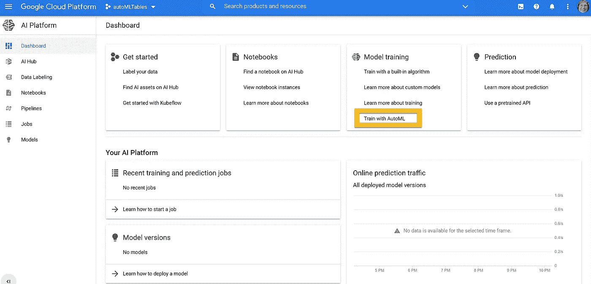
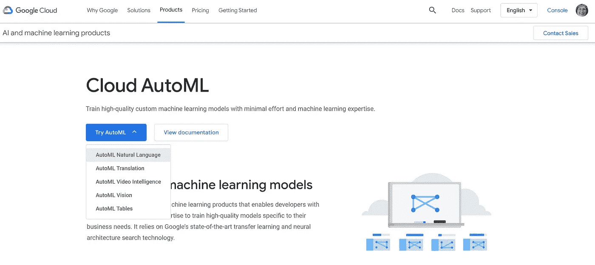
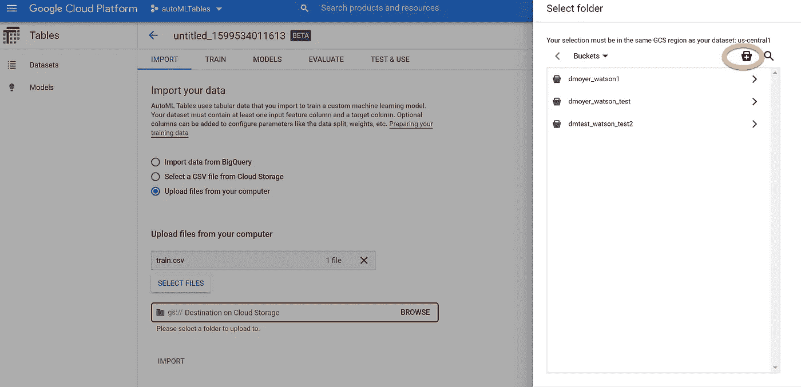
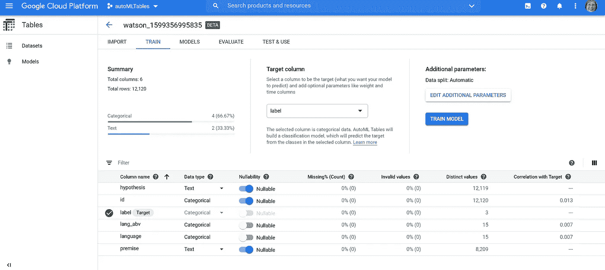
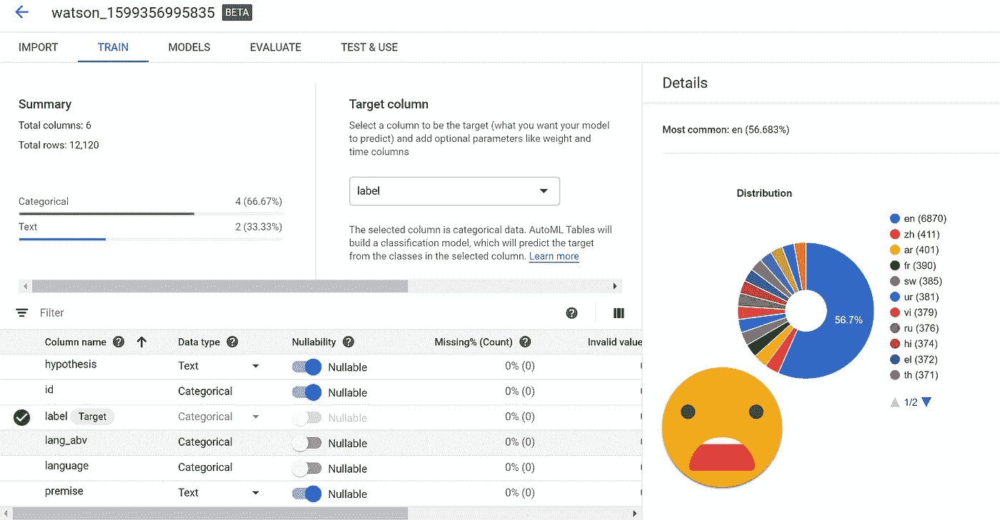
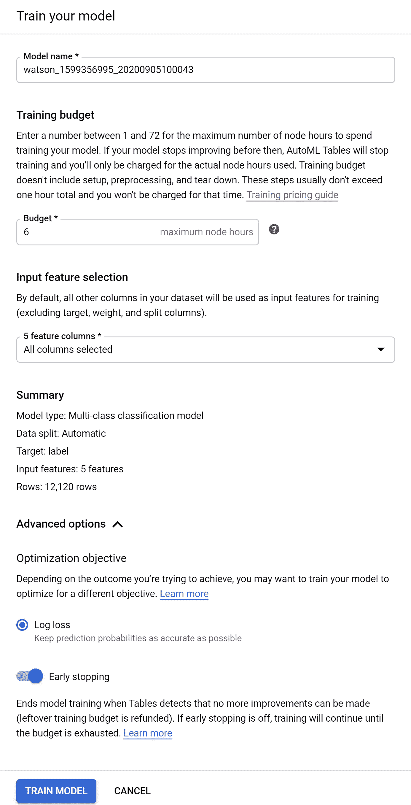
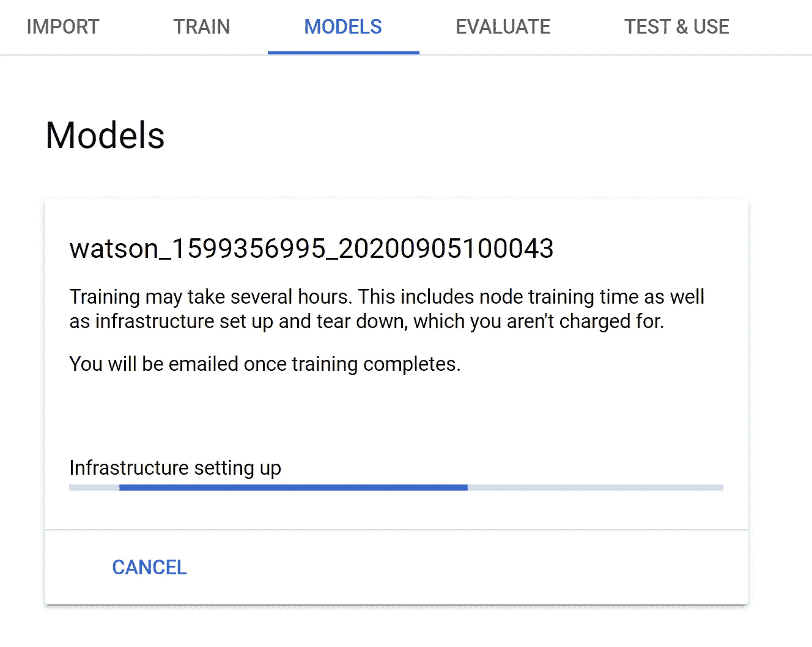
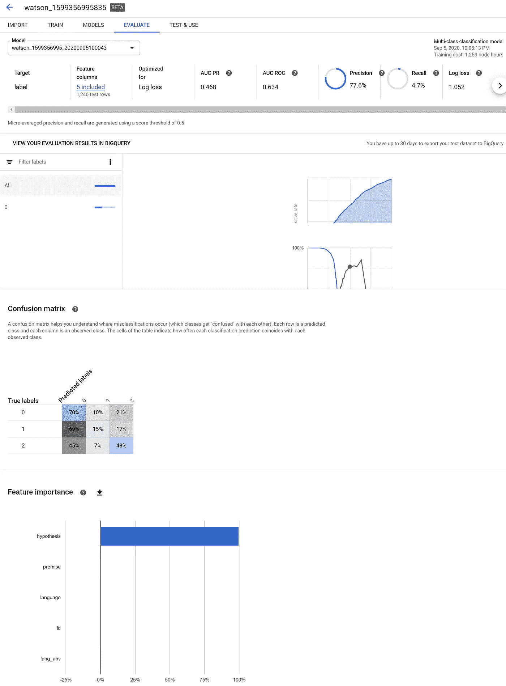
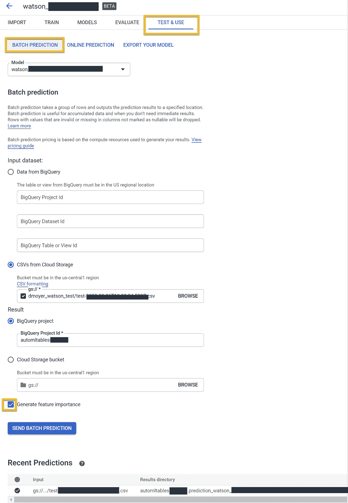

# 免费体验 Google autoML 表格

> 原文：<https://towardsdatascience.com/experience-google-automl-tables-for-free-d5648ae3d0e5?source=collection_archive---------38----------------------->

## autoML 工具用户体验回顾系列之二

图片来自 [Pixabay](https://pixabay.com/?utm_source=link-attribution&utm_medium=referral&utm_campaign=image&utm_content=1452987) 的 [Pavlofox](https://pixabay.com/users/Pavlofox-514753/?utm_source=link-attribution&utm_medium=referral&utm_campaign=image&utm_content=1452987)

欢迎阅读我的 autoML 工具用户体验评论[系列](/is-aws-sagemaker-studio-autopilot-ready-for-prime-time-dcbca718bae7)的第二篇文章。我的目标是比较几种 autoML 工具对关键信息的使用和访问。今天，我主要关注 Google autoML 工具中的一个，叫做 Tables。autoML Tables 旨在处理半结构化表格数据(典型的。csv 文件)。谷歌[宣布](https://cloud.google.com/automl-tables/docs/release-notes#April_10_2019)于 2019 年 4 月 10 日发布 autoML 表格的测试版。仍处于测试阶段，功能仍在推出，我想看看谷歌的产品。

# 为什么使用 Google autoML 表格？

我读过一些关于谷歌机器学习体验的好东西。我以前使用过谷歌云进行一些咨询工作，发现体验非常简单。我很期待看到他们的机器学习服务。我选择表格是因为它与我在本系列中使用的 Kaggle 文件类型相匹配。

正如我之前提到的，Tables 处于测试模式。因此，我查看了发布和问题页面，以确保没有任何障碍。没有屏蔽程序，尽管问题页面上的这个通知让我忍俊不禁:

> 【Microsoft Edge 和 Microsoft Internet Explorer 浏览器的用户体验可能不是最佳的。”

# 设置

与 AWS AutoPilot 相比，为 autoML 表做准备的设置更加手动。开始之前的文档非常好，但是似乎在你开始每个项目之前都需要。

*   创建新项目
*   确保您的账单已启用
*   在 Google 云平台中注册您的云存储、Cloud AutoML API、Google 云存储 JSON API、BigQuery API 应用程序
*   [安装 gcloud 命令行工具](https://cloud.google.com/sdk/downloads#interactive)。
*   安装谷歌云 SDK
*   创建服务帐户
*   设置环境变量
*   更新 IAM 角色

不要担心，一旦你完成了先决条件，体验会大大改善。

# 数据

至于 AWS SageMaker 自动驾驶仪，我用的是 Kaggle 竞赛数据集。

矛盾，我亲爱的华生。使用 TPUs 检测多语言文本中的矛盾和蕴涵。在这个入门竞赛中，我们将句子对(由一个前提和一个假设组成)分为三类——蕴涵、矛盾或中性。

6 列 x 13k+行—斯坦福 NLP [文档](https://nlp.stanford.edu/projects/snli/)

*   身份证明（identification）
*   前提
*   假设
*   朗 abv
*   语言
*   标签

# 模型培训成本

[模特培训费用](https://cloud.google.com/automl-tables/pricing?_ga=2.91784410.-1763153038.1598667843)每小时 19.32 美元。由于您不需要任何许可证，并且只需为培训计算资源付费，因此这是非常合理的。对于你的第一个模型，有一个免费试用。你可以得到 6 个免费的节点小时用于训练和批量预测。这个免费试用不包括部署模型，然后在线调用它们。六个小时足够试一试了。我的例子用了 1.2 小时。

# 开始培训

导航到谷歌人工智能。在那里你会发现一个菜单项“用 autoML 训练”

作者的菜单截图

单击表的尝试自动下拉列表。

作者下拉截图

## 加载数据

导入训练数据集很简单。也可以在此屏幕中直接创建输出数据集的存储桶。

作者数据导入截图

数据导入后，您可以访问一些基本的数据分析。

作者截图

细节有点粗糙。馅饼和油炸圈饼是用来吃的，不是用来吃的。

甜甜圈是用来吃的作者截图

## 训练您的模型

为了培训预算，我投入了 6 个小时的空闲时间。在这个屏幕上，您可以访问和调整的其他参数并不多。

作者训练截图

## 等待魔法

虽然 UI 确实提供了一些关于基础设施启动和崩溃状态的更新，但没有多少迹象表明您已经进行了多长时间。我等了大约半个小时，然后决定相信我的预算设置。我做了其他事情，直到我被通知完成。电子邮件是一个很好的功能。

基础设施建设截图由作者提供

等待中…..作者截图

## 评估培训结果

电子邮件到达后,“评估”选项卡即被填充。有一个图表显示了一些标准指标，如 AUC、精度、召回和日志丢失。我喜欢混乱矩阵是可用的。

作者训练成绩截图

除了它是一个多类分类器之外，我找不到关于模型本身的任何细节。为了了解更多信息，我导出了模型。模型的细节是什么？超参数有哪些？我喜欢的信息远远不够。

## 得分

在批处理中运行时，输出必须转到 BigQuery。

作者打分截图

这是用户体验的终点。输出文件加载到 BigQuery。我喜欢数据可用于查询或直接在 Data Studio 可视化中使用。我更喜欢在 autoML 控制台中随时可用的一些分析。

## 结论

我非常喜欢所提供的文档和技巧。它们很容易理解。电子邮件更新也很棒。

体验的不足之处在于识别最终模型本身的细节的容易程度。你最多可以下载一个 Tensorflow 模型包，在 Google Cloud 之外进行评估。

视觉效果令人失望。几乎没有分布图比一些不能用的饼图要好。由于他们仍处于测试阶段，我希望他们正在收集用户对他们需要什么功能的反馈。

总的来说，缺乏透明度可能会阻止我定期使用这个工具。不过，这是测试版…请稍后再来查看！