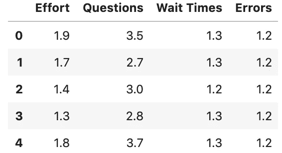
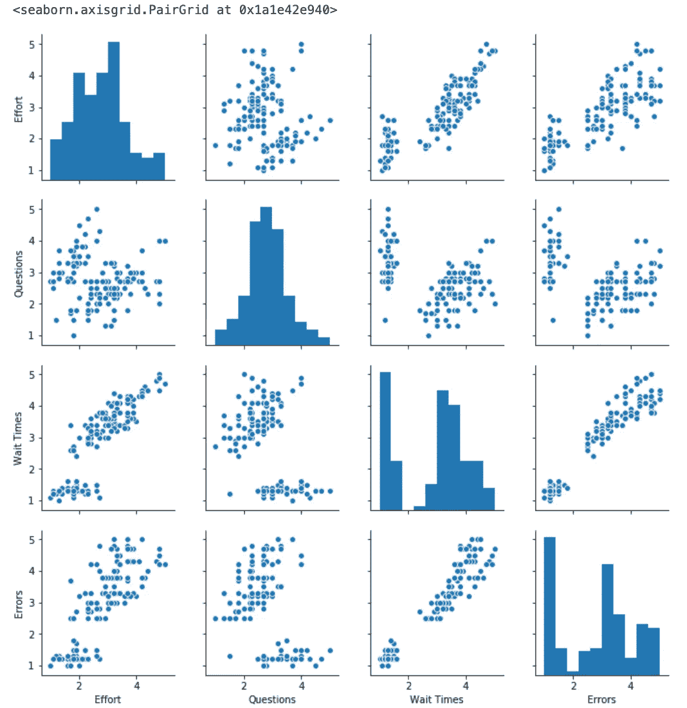
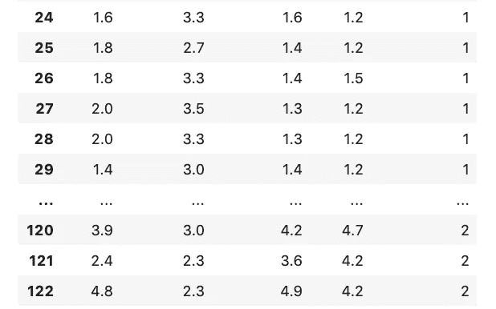
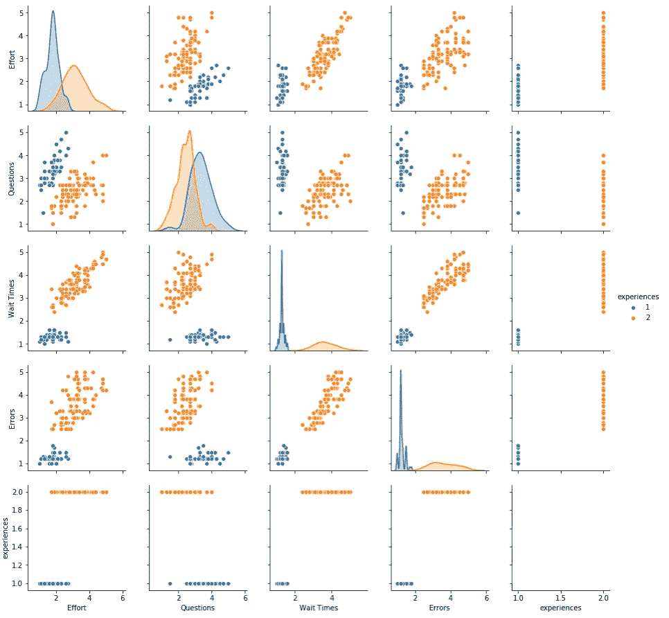

# 体验细分:通过客户旅程地图和人工智能增强将洞察力转化为行动

> 原文：<https://towardsdatascience.com/experience-segmentation-turning-insight-into-action-with-customer-journey-maps-and-ai-augmentation-8be2633e21f4?source=collection_archive---------39----------------------->

## 我们如何使用 CX 方法和数据科学为我们的客户设计和实施移情和数据驱动系统。

我坚信，要确保我的团队做出的每一个决定或产出都是通过为我们的客户创造切实的、可衡量的结果来管理的。事实上，很多时候，当我与当前或潜在的客户交谈时，他们强调咨询或概念工作的定位对他们来说是多么重要，这样有形的执行自然就会到来。

在最近的一次会议上，我们讨论了创建清晰的客户旅程图(**、【CJM】、**)的战略意义，与会的高管感叹道，CX 的咨询工作虽然在产生见解和创造焦点方面很有价值，但“**却最终落在了我办公桌底部的抽屉里。**这凸显了我的高管级客户在实施他们购买的任何 CX 咨询服务时所遇到的挫折。

诚然，许多 CX 调查工作的结果可能会产生建议或想法，这些建议或想法需要组织采取高度变革性的行动(即高度努力)，而这些行动在短期或中期内根本无法得到支持。因此，最近一个致力于改善客户体验的团队慢慢地将他们的注意力和努力转移到了其他地方，结果是一事无成。

这些调查工作的核心产品通常是闪亮且设计精美的 CJM，它能清楚地识别您客户的需求、动机、痛点以及与这些东西相关的所有接触点。这项活动本身就非常有价值，因为它迫使组织对他们的客户体验采取同理心的方法，因为他们被迫从客户的角度创造 CJM。此外，它允许组织了解传统上孤立的部门如何影响这种客户体验，并创造机会来协调它们并实现价值最大化。最后，也许是在测量方面最重要的，它允许组织了解他们的客户的“理想”或未来状态可能是什么。

虽然这些结果在各种方面都很有价值，但它们本身不会推动行动，并且通常会留下一个 CJM，而只是团队聚集在一起并针对客户的痛点和动机进行协调的人工制品。虽然有许多方法可以解决 CJM 壁画艺术降级的问题，但组织可以通过简单地创建一个测量框架并将相当简单的数据分析试点纳入业务，以少量的努力最大限度地提高利用这一核心产出的成功机会。

本文将概述一种这样的分析方法，作为这种操作化的工作示例。

我将向您展示如何通过就关键指标和这些指标的成功达成内部共识、构建您的数据和运行简单的深度学习机制来开始衡量客户旅程图。

## 关于数据收集的说明

出于本文的目的，我们将假设您有合适的基础设施来度量您的客户交互。有了大量可用的数字工具，这些反馈回路可以无缝集成到您的数字平台中。如果有必要在物理环境或两者结合的环境中收集旅行数据，投资智能设备或流程来促进这一点。

请注意，如果您没有高质量的数据，本文的整个前提就会崩溃。人们可以用市场上强大的工具轻松地收集数据，但这并不意味着流程和策略很容易设计。如果没有强大的数据检索方法，卫生和数量，这篇文章中的思想在聚类分析方法方面将变得毫无用处。但是，可以使用其他更简单的方法来确保您的 CJM 处于运行状态并不断改进。

## 区分优先顺序并理解您的数据收集

正如我们之前提到的，CJM 活动是一个很好的机会，可以让可能彼此孤立的各个部门的成员团结起来。这样做有很多好处，例如整个企业更大的#协同作用，更大的内部同理心，并有望出现关于客户旅程如何受到公司内部和外部流程影响的强有力的见解。利用这一调整和期望兴奋的时刻，抓住那些可以三倍提升客户体验的时刻。这是一个关键时刻，以确保您的团队在客户类型及其旅程、哪些指标对这些客户普遍重要以及我们如何衡量这些指标的绩效方面保持一致。

**我们可以使用多种技术来识别这些航段及其特定旅程，例如:**

*   客户/用户调查；
*   客户/用户访谈；
*   用户组/可用性研究；
*   会话重放；
*   网络分析；
*   嵌入式传感器

假设我们作为一个团队走到了一起，我们已经制定了客户细分的类型及其相应的旅程。让我们以一家大型在线零售商为例，展示我们可以经历的流程，以了解我们正在收集的数据类型，以及哪些数据需要与客户细分和相应的旅程相一致。

在我们的示例中，我们将介绍这些细分和旅程:

1.  **浏览器**:查看他们喜欢的品牌，以了解即将推出的产品类型。
2.  橱窗购物者:在他们买得起的东西之外寻找品牌，喜欢购买渴望的东西。
3.  **里里外外:**确切地知道自己想要什么，得到它，购买它，抛弃它。
4.  **退货者:**已购买，想退货。

在这一点上，我们已经就以下方面达成一致并达成共识:客户的类型及其相应的旅程，这是一种成功。但至关重要的是，我们需要在另外两个方面达成共识。

## 就指标达成共识

首先:我们可以用来衡量这些旅程的指标。在本例中，我们可以依靠通用诊断工具，该工具将在零售商的旅程中普遍使用，这些指标是:

1.  **客户努力:**客户为实现目标付出了多少努力？
2.  **难点:**给客户带来最大痛苦或情绪低落的步骤(我们可以使用 NPS 或调查反馈来计算)。
3.  **问题:**问题何时以及为什么会出现，我们是否向他们提供了这些信息，客户的问题是否容易得到回答？
4.  **等待时间:**我们的客户必须等待多长时间才能完成某些任务，这些任务对客户来说是最长、最令人沮丧的？
5.  **错误:**我们最常失败的地方是哪里，我们如何减轻这种失败？

## 就指标的绩效达成共识

作为一个团队，我们已经就这些指标达成共识，认为它们是我们诊断每个客户旅程的关键，以及它们如何与客户在旅程中的步骤(即他们的体验)相关联。这将引导我们进入第二步，也是更精细的一步，即围绕如何衡量这些指标的绩效形成公司共识。一个简单(注意:不容易)的方法是就团队的某个指标达成一致。

例如，让我们以“客户努力”为例:我们可以基于交易发生的总时间来索引该性能，如下所示:

在 1-5 的基础上(1 为最佳):

1.  0–60 秒
2.  61-120 秒
3.  121-180 秒
4.  181-240 秒
5.  241-300 秒

或者对于“问题”分析，我们可以编制索引，例如:

1.  0 个问题
2.  1 个问题
3.  2 个问题
4.  3 个问题
5.  4 个问题

我们可以让索引变得更复杂。例如，我们可以使用高级分析来测量不确定时刻和必要澄清之间的差值；然而，这个例子的目的是简单地表达一个指数是一个明确的和统一的测量某一指标的性能。至关重要的是，**团队需要在这个指标上达成共识**。

## 我们已经创建了适用于我们的客户群及其旅程的统一指标，那又如何？

现在，我们有了一种在统一基础上持续衡量我们的细分和旅程的方法。人们已经这样做了很长时间——听说过客户洞察吗？也就是说，至少我们可以开始使用我们的 CJM，因为我们现在知道客户旅程在**当前状态**下是什么样子，并且我们可以决定我们希望客户旅程在**未来状态**下是什么样子。

我们可以寻找立竿见影的效果、重大创新，或者介于两者之间。

最重要的是，我们可以开始跟踪、衡量、调整和使用我们的 CJM 作为焦点，以我们知道团队可以产生有凝聚力和影响力的努力的方式来衡量我们的内部计划。作为一个内部团队，我们在何时何地选择我们的工作可以以一种战略性的方式完成，并且有数据支持我们，我们可以以统一的方式完成这项工作，同时确保我们创建反馈循环，以迭代和维护我们的 cjm 的相关性。

## 祝贺您，您刚刚向我解释了我的客户洞察团队是做什么的…

好吧，你没有完全错。但是请记住，这个思考练习的重点是把我们的 CJM 变成不仅仅是一个提醒。我们想让它做点什么。

然而，如果你仍然不为所动，为什么我们不推出这个现在的宝库美丽的索引数据，我们可以匹配我们的每个客户群，让我们开始创建**体验细分。**

没错，我们正在深入每一个可靠的客户旅程，并试图根据他们的实际体验对他们进行细分。

我们需要什么数据来做这件事？我们已经有了——这是我们的 CJM 绩效指数数据。

好吧，但是我怎么才能解决经验分割的问题呢？每个客户和事件都有很大的不同，很难以有意义的方式将它们配对。我们将使用机器的力量，即将成为无所不知的人工智能来争论我们的数据，以一种不可思议的复杂方式，在一个快得可笑的时间内，把它分割成小块，并让它根据我们客户的经验对他们进行**聚类**。

# 这是一个我们如何使用聚类分析来开始理解和预测经验分割的例子

## 数据

让我们使用 iris 数据集，但假设我们不是处理*物种*而是根据他们与公司产品或服务的互动，处理不同的*客户体验*组。

```
from sklearn import datasets
import pandas as pd
from sklearn.preprocessing import MinMaxScaler
from sklearn.cluster import KMeans
from sklearn import metrics, neighbors, model_selection
import seaborn as sns# data
iris = datasets.load_iris()# convert to data frame
dat = pd.DataFrame(iris.data)
```

## 转换

让我们将最初的花卉测量值转换为 4 个可量化指标的 1-5 分(1 dp ),这些指标都与客户对产品/服务的体验有关。

```
# scale
scaler = MinMaxScaler(feature_range=(1,5))# fit scaler
scaler.fit(dat)# scale and round
X = pd.DataFrame(scaler.transform(dat)).round(1)# these are our metrics
X.columns = [‘Effort’, ‘Questions’, ‘Wait Times’, ‘Errors’]# view
X.head()
```

下面是结果:我们有统一的标准来衡量基于上述活动的结果！



> 从上表中我们可以看出，客户我们的大多数客户在所有指标上都有良好的体验，除了一些问题，这些问题需要全面解决。

## 探索性数据分析

我们可以运行一些简单的(如果你像我一样是个黑客的话，很容易)数据——即看看是否有任何分数的自然聚类。

```
# viz
sns.pairplot(X)
```



查看数据，我们可以看到两种清晰的客户“体验”，简单来说就是“好”和“差”

## 聚类分析

*从这些数据中，能识别出这些截然不同的经历吗？*

让我们开始吧。运行流行的“k-means”模型的无监督学习模块。

通过快速浏览上面的图，我们可以看到有两个不同的组，所以我们可以告诉我们的计算机寻找 2 个集群(' _clusters=2 ')。

然后让我们来区分这是一个好的还是一个坏的体验(集群 1 v 集群 2)。

```
# k-means algo, lets look for 2 experiences
kmeans = KMeans(n_clusters=2, random_state=0).fit(X)# save the result
result = X.copy()# label the clusters we found as experiences
result.loc[:,'experiences'] = (kmeans.labels_) + 1# view the result
result
```

以下是我们的结果样本:



我们可以看到，聚类分析很好地识别和分离了我们的聚类。从一个快速的 squiz 中，我可以看出 2 是#不好的体验，1 是#好的体验(提示:看看指标)。

## 让我们想象一下！



如你所见，有明显的群体。机器在数据中发现了“复杂”的模式，由于我们上面的数据工程，这些模式代表了好的体验或不好的体验。

这意味着它实际上可以开始**预测客户的体验是好是坏。**

**“经验分割”一词由此而来。**

# 别拐弯抹角了，让我们做些模型吧！

现在我们已经确定了我们的'*体验细分市场*，我们可以对它们训练一个#机器学习模型，这样我们就可以根据新客户与我们的产品/服务的互动对他们进行分类(最好是在他们使用产品时实时分类！！).

关键的想法是，如果我们能做到这一点，我们可能能够实时采取行动，防止客户有“坏”的体验，同时让那些将有“好”体验的客户离开。

## 目标和功能

让我们设置功能(我们的体验表)和我们的目标是什么(1)。

```
# target
y = result.experiences# features
X = result.drop("experiences", axis=1)
```

# 训练/测试分割

现在它只是你的标准 TTS 工作通过。我们只需要训练我们的模型来预测什么是好的，什么是坏的，然后根据我们的数据集进行测试。

```
# creating training / testing datasets
X_train, X_test, y_train, y_test = model_selection.train_test_split(X, y, test_size = 0.25, random_state = 42)
```

先训练模型。让我们再次找到我们的聚类分析模型，然后根据我们上面制作的两个数据集进行拟合。

```
# specifying the classifier
clr = neighbors.KNeighborsClassifier(n_neighbors = 3, weights = 'uniform')# fit the classifier
clr.fit(X_train, y_train)
```

现在我们来测试一下。

```
# predicted
y_pred = clr.predict(X_test)# accuracy
metrics.accuracy_score(y_pred, y_test)
```

我们可以通过让我们的集群用 be 预测 X 的结果(对“X_test”)来确定分数的准确性，然后通过比较“y_pred”和“y_test”的性能来实际计算准确性

这意味着，我们现在有了一个模型，可以分析我们的数据并预测客户的体验。

**如果我们可以在生产中部署并自动化这一点，我们就可以触发功能来增加良好体验或挽救糟糕体验的可能性。**

(注意:你可以有更丰富的数据来帮助你更进一步，但是为了简单起见，我们使用了上面的数据集)。

# 好吧，酷——那又怎样？

上述(简化的)执行使我们能够在数据中找到适用于不同客户群的抽象和复杂模式*实时旅程，*，我们可以将其描述为体验细分。我们已经创建了一个模型，可以找到这些模式并将“相似”的体验组合在一起，以描述我们通常忽略的一些事情——客户(在特定细分市场中)在特定时间实际经历的事情。设计师会称之为移情，营销人员会称之为个性化。我称之为机会。

例如，假设我们是一家在线零售商。

想象一下，我们已经对*【浏览器】*的行为进行了建模——某人上网，查看他们最喜欢的品牌，拥有高度的消费者知识，但最终对他们在网站上的活动量的转化率相对较低。我们可以假设客户的“等待时间”和情感体验(“痛点”)保持相当稳定。毕竟，我们可以假设他们发现他们悠闲的浏览是一种宣泄，而不是过度紧张。

他们喜欢花时间去了解他们最喜欢的品牌或某些衣服，并自己做非正式的研究，以构建他们想要的那件衣服。他们在脑海中构建“完美”的物品，并确切地知道他们在追求什么——愿意花费大量的高价物品。

作为一家公司，我们一直在监控这类行为。我们了解*客户群*。我们从宏观层面监控他们的行为，并能轻松挖掘出某一类客户在个人层面的行为(即个性化)。在这里，他们想买一件剪裁合适、颜色合适的羊绒混纺冬季大衣。我们知道，作为*客户* *细分市场*，他们是特定的长尾买家，有很多购买想法，但不容易转变。然而，当他们改变信仰时，他们会购买高价商品。获得这类顾客的注意力并不需要花费太多成本——他们是知道自己喜欢什么的老练买家——但是不管最优 UX 如何，都很难突破购买的心理障碍。

我们的聚类分析是实时运行的，具有内置的自动化功能，一直在测试和训练这个特定的细分市场。我们的模型知道它是一个'*浏览器'*，它也知道指标的分组，在正确的时机将导致好的或坏的体验。实时地，集群可以设法将客户体验保持在“好区域”(转换)，而远离“坏区域”(关闭以便改天浏览)。购买的利润很薄，但作为一家企业，在我们的 CJM 和体验细分研究和开发的推动下，我们推出了一个聊天机器人，提醒我们的客户我们的退货政策和相应的视频，显示我们的“浏览器”如此钦佩的适合和平衡。

我们在 UX 的努力与体验直接对应，不张扬也不咄咄逼人，但清晰而直接；因此，消除购买“浏览器”的障碍是常有的事。浏览器被迫完成购买，因为我们的模型已经管理并触发了关键功能或特性，这极大地提高了正确的指标。浏览器转换了，这件外套是我们以 CJM 为骨干精心管理客户体验细分的结果，并以一种允许我们执行强大的机器学习应用程序来管理客户的*体验*的方式操作它。

这种以数据为导向的 CX 方法(或任何其他设计导向过程)允许我们以一种可以有效监控、测量和增强的方式实施初始设计分析。允许内部团队或客户做出决策，验证业务案例，并(有希望地)进一步推动业务案例，以实现真正的创新。最重要的是，它让我们能够做出决策——在这个例子中是在*实时*——积极确保我们的客户拥有良好的体验，或者在每次与我们互动时避免糟糕的体验。

## 这篇文章的核心要点是:

1.  我们可以使用 cjm 来创建严格的框架，以实际监控我们当前和未来的客户状态/旅程。
2.  我们可以使用数据科学来了解细分市场之外的客户，并允许我们基于实际的*体验*来监控他们。
3.  我们可以利用经验细分来产生深刻的移情和数据驱动的见解，这些见解实际上整合到我们的反馈循环中，为我们的决策以及我们与客户的互动方式提供信息。