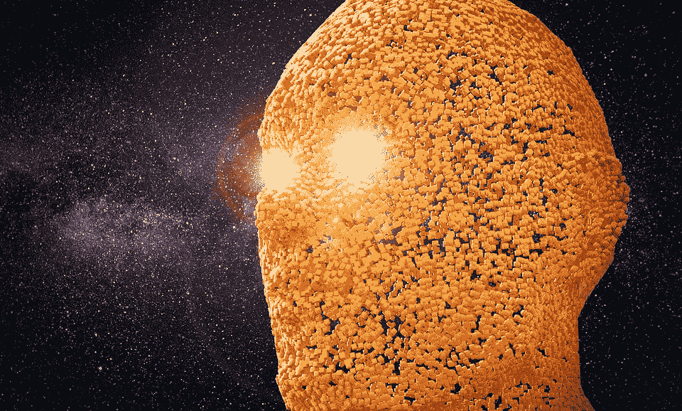
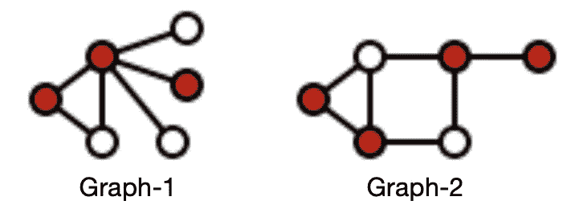
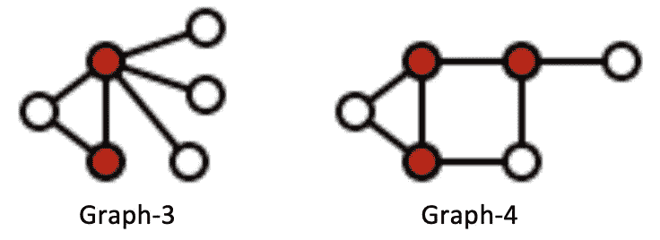
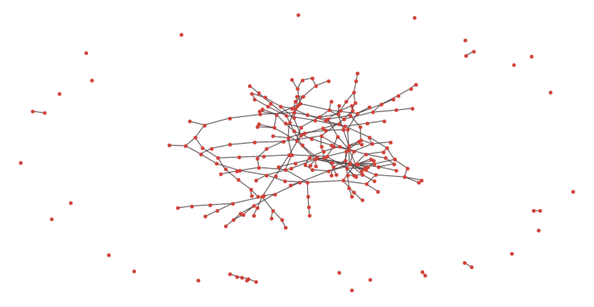

# 体验遗传算法的威力

> 原文：<https://towardsdatascience.com/experience-the-power-of-the-genetic-algorithm-4030adf0383f?source=collection_archive---------34----------------------->

## 基于遗传算法的顶点覆盖



[PixaBay](https://cdn.pixabay.com/photo/2018/03/02/10/21/head-3192830_1280.jpg) 上的图片

[遗传算法](https://en.wikipedia.org/wiki/Genetic_algorithm)是一种基于[遗传学](https://en.wikipedia.org/wiki/Genetics)和[自然选择](https://en.wikipedia.org/wiki/Natural_selection)概念的进化计算技术。它主要用于在[确定性](https://en.wikipedia.org/wiki/Deterministic_algorithm)多项式解决方案不可行的情况下，为许多优化和更棘手的问题找到一个接近最优的解决方案。

遗传算法也可以用于搜索空间，以找到正确的特征和模型参数来预测目标变量。遗传算法的另一个重要优点是除了标准优化问题之外，当目标函数是不可微的、不连续的、随机的或非线性的时，它们也是有用的。

我将以关于[遗传算法](https://en.wikipedia.org/wiki/Genetic_algorithm)和[顶点覆盖](https://en.wikipedia.org/wiki/Vertex_cover)问题的简介开始这篇博文。然后我将展示我们如何使用遗传算法来获得顶点覆盖问题的近似最优解，这远优于[近似算法](https://en.wikipedia.org/wiki/Approximation_algorithm)。通过这个博客，我也想让读者体验遗传算法的力量。该解决方案的完整源代码可以在[这里](https://github.com/samread81/Vertex-Cover-Genetic-Algorithm)找到。

# 遗传算法

遗传算法有 5 个阶段:

1.  **初始化**:初始解(第一代)随机初始化
2.  **健康评分**:这里的主要思想是，可能很难找到最佳解决方案，但是一旦我们有了一些解决方案，很容易给它附加一个良好或健康评分。
3.  **选择**:种群中最适合的成员(解)存活下来，并继续进入下一代。
4.  **交叉**:群体中最适合的成员(解)成对组合，产生新的成员(可能的解)。
5.  **突变**:新成员(可能的新方案)少量改变自己，变得更好。

一旦初始种群生成，选择、交叉和变异的循环将持续许多代，直到算法收敛或达到最大迭代。这些概念在这个博客里解释得很清楚。

[](/introduction-to-genetic-algorithms-including-example-code-e396e98d8bf3) [## 遗传算法简介—包括示例代码

### 遗传算法是一种受查尔斯·达尔文的自然进化理论启发的搜索启发式算法。这个…

towardsdatascience.com](/introduction-to-genetic-algorithms-including-example-code-e396e98d8bf3) 

# 顶点覆盖问题

[顶点覆盖](https://en.wikipedia.org/wiki/Vertex_cover)是[图](https://en.wikipedia.org/wiki/Graph_(discrete_mathematics))中顶点的子集，使得对于图的每个边(u，v ),或者‘u’或者‘v’在顶点覆盖中。这是一个典型的 [NP-hard](https://en.wikipedia.org/wiki/NP-hardness) 优化问题，有一个近似算法，但没有确定的多项式解。



图片来源[维基百科](https://en.wikipedia.org/wiki/File:Vertex-cover.svg)

图-1 的顶点覆盖为 3，与 3-red 节点一样，所有的边都被覆盖，因此对于图的每条边(u，v ),或者“u”或者“v”都在顶点覆盖中。类似地，图-2 的顶点覆盖为 4。



图片来源[维基百科](https://en.wikipedia.org/wiki/File:Minimum-vertex-cover.svg)

图-3 的顶点覆盖为 2，图-4 的顶点覆盖为 3。

顶点覆盖是一个典型的 NP-Hard 问题，没有确定的多项式时间解。我们有一个可用的近似算法，它在多项式时间内运行并给出一个次优解。近似算法的细节可以在下面的链接中找到。

[](https://www.geeksforgeeks.org/vertex-cover-problem-set-1-introduction-approximate-algorithm-2/) [## 顶点覆盖问题|集合 1(简介和近似算法)- GeeksforGeeks

### 无向图的顶点覆盖是其顶点的子集，使得对于图的每条边(u，v ),或者…

www.geeksforgeeks.org](https://www.geeksforgeeks.org/vertex-cover-problem-set-1-introduction-approximate-algorithm-2/) 

还有证据表明，近似解永远不会超过最优解 2 倍。详情可以在这里找到。

[](http://www.personal.kent.edu/~rmuhamma/Algorithms/MyAlgorithms/AproxAlgor/vertexCover.htm) [## 顶点覆盖

### 定义:无向图 G=( V，E)的顶点覆盖是 V 的子集，使得如果边(u，V)是…

www.personal.kent.edu](http://www.personal.kent.edu/~rmuhamma/Algorithms/MyAlgorithms/AproxAlgor/vertexCover.htm) 

# 生成图形数据

我生成了一个 250 节点的图表。用于生成该图的主要思想是在[0，1]范围内绘制随机数，并且仅当概率小于阈值时，才在节点“u”和“v”之间创建边。

```
#Graph Library
import networkx as nxedge_probability = .0085
adjacency_matrix = np.zeros((nodes,nodes),dtype = np.int)
edges = []
edges_cnt = 0
for i in range(nodes):
    for j in range(i):
        prob = random.random()
        if prob < edge_probability:
            adjacency_matrix[i,j] = 1
            edges.append((i,j))
            edges_cnt += 1G=nx.Graph()
G.add_nodes_from(list(range(0,nodes)))
G.add_edges_from(edges)
nx.draw(G,node_color='r', node_size=18, alpha=0.8)
```



生成了具有 250 个节点的图“G”

这个图有 256 条边。

# 求图“G”顶点覆盖的近似算法

顶点覆盖的近似算法是一种[贪婪算法](https://en.wikipedia.org/wiki/Greedy_algorithm)，它可能不会给出最优解。近似算法的工作可以解释为:

```
1) Initialize the solution-set as  {}
2) Loop through all the E (Edges).
3) For an arbitrary edge (u, v) from set of E (Edges).
   a) Add 'u' and 'v'  to solution-set if none of the vertices 'u' or 'v' present in the set already
   b) If any of the vertex 'u' or 'v' present already in the solution-set, skip the edge and move to the next one.
3) Return solution-set.
```

该解决方案的更多细节可以在这个博客中找到。

[](https://www.geeksforgeeks.org/vertex-cover-problem-set-1-introduction-approximate-algorithm-2/) [## 顶点覆盖问题|集合 1(简介和近似算法)- GeeksforGeeks

### 无向图的顶点覆盖是其顶点的子集，使得对于图的每条边(u，v ),或者…

www.geeksforgeeks.org](https://www.geeksforgeeks.org/vertex-cover-problem-set-1-introduction-approximate-algorithm-2/) 

在具有 250 个节点和 256 条边的图“G”上运行近似算法，我们得到 178 个节点的顶点覆盖。

```
#Vertex Cover Greedy Algorithm
visited = np.zeros(nodes)
cnt = 0
for e in edges:
    (u,v) = e
#     print(u,v)
    if ((visited[u]==0) & (visited[v]==0)):
        visited[u] = 1
        visited[v] = 1
        cnt+=2
print("Vertex cover consists of {} nodes".format(cnt))
```

输出:顶点覆盖由 178 个节点组成。

# 用遗传算法寻找图 G 的顶点覆盖


图片由[肯尼罗](https://unsplash.com/@kennyluoping)在 [Unsplash](https://images.unsplash.com/photo-1515419577046-3a169cab1854?ixlib=rb-1.2.1&auto=format&fit=crop&w=2250&q=80) 上拍摄

## 解决方法

使用遗传算法可能有相当多的解决顶点覆盖的方法。

一种方法是将适应度分数定义为覆盖边和所用顶点数量的函数。当一个解覆盖了所有的边时，罚分是 0，当一些边丢失时，罚分被包括。此外，实现这一目标所需的节点数量也会带来成本。这将需要仔细定义健身核心。

我不想惹上麻烦，因为适应值是覆盖边和顶点数的函数。我希望它是其中一个的功能。因此，我固定了顶点的数量，并将适应度分数定义为仅覆盖边的函数。这是如何做到的:

```
1\. Is it possible to cover all the edges with exactly 'k' number of vertices. Genetic Algorithm tries to find such solution, if possible.2\. Binary Search for the minimum value for 'k'.
```

## 初始化

我们需要发现，如果使用一些“k”个顶点，是否有可能覆盖所有的边。因此，我们用一些“k”个顶点随机初始化种群，作为顶点覆盖的一部分。

```
n = 250
#----------Hyperparameters can be tuned--------------------
pop_total = 1500   # max population allowed in the environment
pop_init = 1000    # Initial Population
max_iterate = 500  # Max Iterations or Generations allowed
#----------------------------------------------------------def chromosomes_gen(n,k,pop_init):
    lst = []
    for i in range(pop_init):
        chromosome = np.zeros(n,dtype= int)
        samples = random.sample(range(0,n), k = k)
        for j in range(k):
            chromosome[samples[j]] = 1
        lst.append(chromosome)
    return lst
```

## 健身得分

在这里，我通过使用精确的“k”个顶点的给定解决方案来检查，有多少条边丢失了。我为它增加一个惩罚/障碍计数。

```
def cost(soln,n,edges):
    obstacles = 0
    for e in edges:
        (u,v) = e
        if ((soln[u]==0) & (soln[v]==0)):
            obstacles += 1
    return obstacles
```

## 选择

有各种可能的选择方法。在这个问题中，我只是简单地将得分最高的解决方案传递给下一代，并杀死其余的。变量‘pop _ total’定义了允许传递给下一代的最大群体。

```
def selection(lst,pop_total,n,edges):
    score = []
    output_lst = []
    len_lst = len(lst)
    for i in range(len_lst):
        score.append(cost(lst[i],n,edges))
    sorted_index = np.argsort(score)
    cnt = 0
    for i in range(len_lst):
        output_lst.append(lst[sorted_index[i]])
        if((i+1) == pop_total):
            break
    lst = output_lst 
    # Return truncated-population and best score of this Generation
    return lst,score[sorted_index[0]]
```

## 交叉

在交叉中，我们将两种解决方案结合起来，希望得到更好的解决方案。在这个问题中，我采用两个解决方案，找到第一个解决方案中不存在于第二个解决方案中的顶点，类似地，采用第二个解决方案中不存在于第一个解决方案中的顶点，并交换其中的 50%。

```
#Crossover
cross_over_prob = 0.50
for i in range(len_lst):

      # First solution
      tmp = lst[i].copy()
      # Second solution
      mate_with = lst[int(random.uniform(0,len_lst))]

      tmp_unique = []
      mate_with_unique = []

      # Store all vertices of Solution-1 and Solution-2
      for j in range(n):
          if(tmp[j]==1):
              tmp_unique.append(j)
          if(mate_with[j]==1):
              mate_with_unique.append(j)#Filter vertices from Solution-1 which is in Solution-2 and shuffle
      tmp_unique = np.setdiff1d(tmp,mate_with)
      random.shuffle(tmp_unique)#Filter vertices from Solution-2 which is in Solution-1 and shuffle
      mate_with_unique = np.setdiff1d(mate_with,tmp)
      random.shuffle(mate_with_unique)#Swap 50% unique vertices from Solution2 into Solution1 ~ New Soln
      swap = math.ceil(cross_over_prob * min(len(tmp_unique),len(mate_with_unique)))
      for j in range(swap):
          tmp[mate_with_unique[j]] = 1
          tmp[tmp_unique[j]] = 0
      new_solution = tmp
```

## 变化

在这一步中，来自交叉状态的新解会稍微改变自己，或者变异，希望变得更好。在这个问题中，我执行了两种类型的突变，改变了 5%的解。我掷硬币，如果正面朝上，我进行变异 1，否则进行变异 2，两者都不同地改变 5%的解。

在变异-1 中，我从解中随机取出 5%的顶点，并用之前不在解中的其他随机 5%的顶点替换它。

在变异-2 中，我从解决方案中随机抽取 5%的顶点，并用其他 5%的顶点替换，这些顶点可以覆盖当前解决方案未能覆盖的一些边。

```
# Mutation 
mutat_prob = 0.05
zeroes = []
ones = []
for j in range(n):
    if soln[j]==1:
        ones.append(j)
    else:
        zeroes.append(j)random.shuffle(ones)
random.shuffle(zeroes)coin_toss = random.random()
if(coin_toss <= 0.5):
    # Mutation-1
    swaps = min(len(ones),len(zeroes))
    for j in range(swaps):
        coin_toss2 = random.random()
        if(coin_toss2 < mutat_prob):
            soln[ones[j]] = 0
            soln[zeroes[j]] = 1
            #Swapping logic
            dummy = ones[j]
            ones[j] = zeroes[j]
            zeroes[j] = dummy
else:    
    # Mutation-2
    mutate_lst = []
    for e in edges:
        (u,v) = e
        if((soln[u] == 0) & (soln[v] == 0)):
            coin_toss2 = random.random()
            if(coin_toss2 < mutat_prob):
                coin_toss3 = random.random()
                if(coin_toss3 <= 0.5):
                    if(u not in mutate_lst):
                        mutate_lst.append(u)
                else:
                    if(v not in mutate_lst):
                        mutate_lst.append(v) random.shuffle(mutate_lst)
    sz = min(len(ones),len(mutate_lst))

    for j in range(sz):
        soln[ones[j]] = 0
        soln[mutate_lst[j]] = 1
        #Swapping logic
        dummy = ones[j]
        ones[j] = mutate_lst[j]
        mutate_lst[j] = dummy

soln_lst.append(soln)
```

> 遗传算法的性能主要取决于交叉和变异函数的构造。这些功能需要仔细设计和调整/修改，以获得最佳性能。

## 二分搜索法找到最小的 k

我执行了一个[二分搜索法](https://en.wikipedia.org/wiki/Binary_search_algorithm)来寻找‘k’的最小值，这样‘k’个顶点的顶点覆盖覆盖了所有的图边。

```
# Environment to perform Initialisation-Selection-Crossover-Mutation
def environ(n,k,mut_prob,pop_init,pop_totl,max_iterate,edges)
    soln = chromosomes_gen(n,k,pop_init)
    for it in range(max_iterate):
        soln = cross_over_mutate(soln,n,k,mut_prob,pop_total,edges)
        soln,cost_value = selection(soln,pop_total,n,edges)
        if cost_value==0:
            break
    return cost_value,result# Binary Search function
def mfind(n,mut_prob,pop_init,pop_total,max_iterate,edges,start,end)
    result_dict = {}
    l = start
    h = end
    ans = 0
    while(l<=h):
        m = int((l+h)/2.0)
        cv,res = environ(n,m,mut_prob,pop_init,pop_total,max_iterate,edges)
        if(cv==0):
            result_dict[m] = res
            h = m-1
        else:
            l = m + 1
    return result_dict# Main-function Call
res = mfind(n,mutat_prob,pop_init,pop_total,max_iterate,edges,1,n)
```

# 结果

使用遗传算法，具有 250 个节点和 256 条边的图“G”的顶点覆盖是 104 个节点，这比近似算法的 178 个节点的解决方案小得多且更好。解决方案的完整源代码可以在[这里](https://github.com/samread81/Vertex-Cover-Genetic-Algorithm)找到。

# 结论

在这篇博文中，我们理解了遗传算法的概念及其用例和属性。然后我们用遗传算法来解决顶点覆盖问题，得到了一个比近似算法更好的解。

> 如果你有任何疑问，请联系我。我很有兴趣知道你是否有一些有趣的问题陈述或想法，遗传算法可以用于它。

***我的 Youtube 频道更多内容:***

[](https://www.youtube.com/channel/UCg0PxC9ThQrbD9nM_FU1vWA) [## 阿布舍克·蒙戈利

### 嗨，伙计们，欢迎来到频道。该频道旨在涵盖各种主题，从机器学习，数据科学…

www.youtube.com](https://www.youtube.com/channel/UCg0PxC9ThQrbD9nM_FU1vWA) 

> ***关于作者-:***
> 
> Abhishek Mungoli 是一位经验丰富的数据科学家，拥有 ML 领域的经验和计算机科学背景，跨越多个领域并具有解决问题的思维方式。擅长各种机器学习和零售业特有的优化问题。热衷于大规模实现机器学习模型，并通过博客、讲座、聚会和论文等方式分享知识。
> 
> 我的动机总是把最困难的事情简化成最简单的版本。我喜欢解决问题、数据科学、产品开发和扩展解决方案。我喜欢在闲暇时间探索新的地方和健身。关注我的 [**中**](https://medium.com/@mungoliabhishek81) 、**[**Linkedin**](https://www.linkedin.com/in/abhishek-mungoli-39048355/)**或**[**insta gram**](https://www.instagram.com/simplyspartanx/)**并查看我的[往期帖子](https://medium.com/@mungoliabhishek81)。我欢迎反馈和建设性的批评。我的一些博客-********

*   ******每个数据科学家都应该避免的 5 个错误******
*   ******[以简单&直观的方式分解时间序列](/decomposing-a-time-series-in-a-simple-and-intuitive-way-19d3213c420b?source=---------7------------------)******
*   ******[GPU 计算如何在工作中真正拯救了我？](https://medium.com/walmartlabs/how-gpu-computing-literally-saved-me-at-work-fc1dc70f48b6)******
*   ******信息论& KL 分歧[第一部分](/part-i-a-new-tool-to-your-toolkit-kl-divergence-5b887b5b420e)和[第二部分](/part-2-a-new-tool-to-your-toolkit-kl-divergence-736c134baa3d)******
*   ******[使用 Apache Spark 处理维基百科，创建热点数据集](/process-wikipedia-using-apache-spark-to-create-spicy-hot-datasets-1a59720e6e25)******
*   ******[一种基于半监督嵌入的模糊聚类](/a-semi-supervised-embedding-based-fuzzy-clustering-b2023c0fde7c)******
*   ******[比较哪种机器学习模型表现更好](/compare-which-machine-learning-model-performs-better-4912b2ed597d)******
*   ******[分析 Fitbit 数据，揭开疫情封锁期间身体模式变化的神秘面纱](/analyzing-fitbit-data-to-demystify-bodily-pattern-changes-amid-pandemic-lockdown-5b0188fec0f0)******
*   ******[神话与现实围绕关联](/myths-and-reality-around-correlation-9b359456d8e1)******
*   ******[成为面向商业的数据科学家指南](/a-guide-to-becoming-business-oriented-data-scientist-51da5c829ffa)******