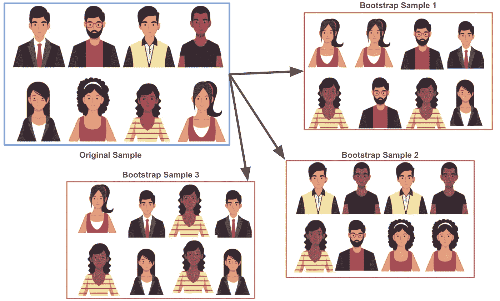

# 拔靴带

> 原文：<https://towardsdatascience.com/experimental-design-bootstrapping-5b56fc7a10f1?source=collection_archive---------73----------------------->

## 因为“观察到你的结果的概率或者一个更极端的假设是真的”是令人困惑的。

# 介绍

实验是公司决策的基础，p 值是决定选择哪个实验假设的主要方法。

*   这个新的登录页面布局比现有的登录页面更好吗？
*   这种新的推荐策略是否优于现有的推荐策略？
*   我们应该在这个新的渠道上发起新的营销活动吗？

在任何一种情况下，我们都可以通过实验来做出决定。运行实验时，步骤如下:

1.  确定您感兴趣的指标。
2.  陈述无效和替代假设。
3.  收集数据。
4.  计算置信区间或 p 值。
5.  使用区间或 p 值做出与假设相关的决策。

当使用 p 值时，利益相关者盲目地将该值与某个阈值(大多数情况下为 0.05)进行比较来做出决策。这种比较是带着一些模糊的认识进行的，当 p 值较小时，我们选择替代假设。然而，即使这种说法也从根本上反对与 p 值计算方式相关的理论。

# 例子

图 1:示例实验数据

假设我们在第一个场景中，我们想知道两个登录页面中哪一个“更好”。针对该示例的实验步骤概述如下:

1.  我们希望监控与每个页面相关的平均收入。
2.  零(H₁)和替代(H₂)假设可以表述为
    H₁:新页面的平均收入小于或等于现有页面。
    H₂:新页面的平均收入高于现有页面。
3.  我们可能会收集与每个登录页面相关的数据，这些数据包含以下信息。提供这些数据的脚本可以在 [Github 链接这里](https://github.com/jbernhard-nw/bootstrap_experiment_repo)获得，你可以在 ***图 1*** 中看到这个部分顶部的数据示例。
4.  从这些数据中，我们需要计算出假设零假设为真的情况下，观察到的平均收入差异的概率。无效假设是真实的平均差异为零。

在一门介绍性的静力学课程中，你将学习使用某种双样本 t 检验，在这种情况下你需要确定你的组的方差是相等还是不同。然后计算标准误差，您可以用它来确定 p 值。

如果您是 t-test 和 python 中搜索的新手，您可能会遇到这样的问题:您是否会使用*相关 t-test、配对 t-test、*或*独立 t-test。*那么，你如何选择？你为什么选择一个特定的测试？你怎么知道你选择了正确的测试？

这就是自举发挥作用来拯救世界的地方！但是如果您从所有可能的选择中选择了正确的测试，并且使用了 Scipy 中的内置测试，那么对应的 p 值就是 0.00008。这个解决方案的代码非常简单。困难的是知道你做了正确的选择。

科学 t 检验

5.同样，在统计介绍课程中，您现在可以将 p 值与 0.05 进行比较，并选择版本 1 和版本 2 的平均收入不同的替代方案。

然而，为了充分理解在这种情况下得出的结论，理解 p 值、I 型错误率以及这两者的组合如何推动第 5 部分中的结论是很重要的。

虽然这个解决方案的代码很简单，但是知道选择哪个解决方案以及如何解释结果可能会很混乱，特别是对于那些不经常进行假设检验的人。

# 拔靴带

为了使最后两步更容易理解，我更喜欢使用 bootstrapping 来模拟均值差异的分布。这与传统的 p 值和置信区间的思想有很好的联系。

**自举的定义是有替换的抽样。**通过对原始数据集进行替换采样，我们可以多次计算每个引导样本的平均收入差异，以了解平均差异如何从一个引导样本变化到下一个引导样本。

自助抽样——个人来自 freepik.com

我们可以使用下面显示的函数为这个数据集执行引导。在这种情况下，每个引导样本都是一个新的`DataFrame`，包含原始行的*“替换样本”*版本，直到我们创建了一个具有相同行数的新的`DataFrame`。

使用 10，000 个引导样本的默认值提供了三个列表，其中每个引导样本都有一个值:

*   版本 1 和版本 2 之间的均值差异列表。
*   版本 1 收入的方法列表。
*   第 2 版收入方式列表。

# 从引导结果中得出结论

这种从一个样本到另一个样本存在多少差异的想法使我们能够看到我们可以从包含这些值的总体中得到什么类型的样本估计。这些估计值的范围可以帮助我们理解哪些值是可能的，以及这些值是否符合零假设或替代假设。

上述函数的结果可以用下面的代码绘制出来。

这些图看起来是这样的:

绘制的自举结果

从这些图中，我们可以看到，在所有引导样本中，**版本 2** 的平均收入几乎总是高于**版本 1** 的平均收入。

此外，第一个图显示了所有 bootstrap 样本的平均差异，以及中间 95%的差异所在的界限(蓝色虚线)。因为这两个界限之间不包含零差，所以 bootstrap 区间提供了均值差不为零的重要证据。

使用来自 Scipy 的 p 值确实使我们得出了与 bootstrap 方法相同的结论。然而，从这些图中得出结论(使用 bootstrap 方法)比使用 p 值的传统方法(在我看来)更直观。