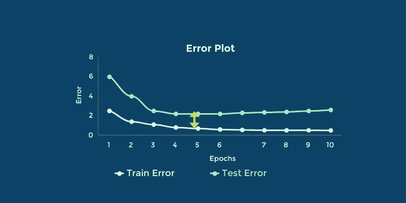
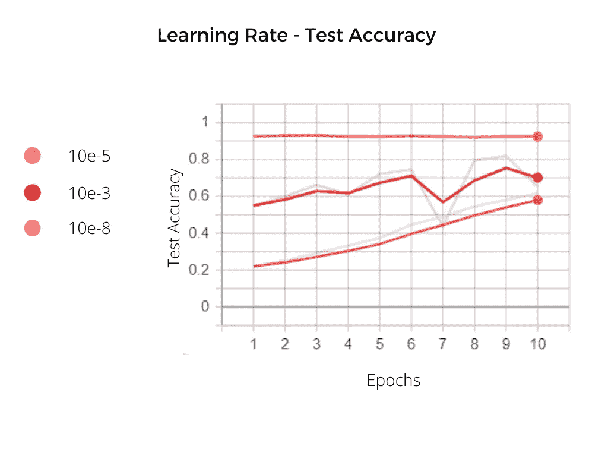
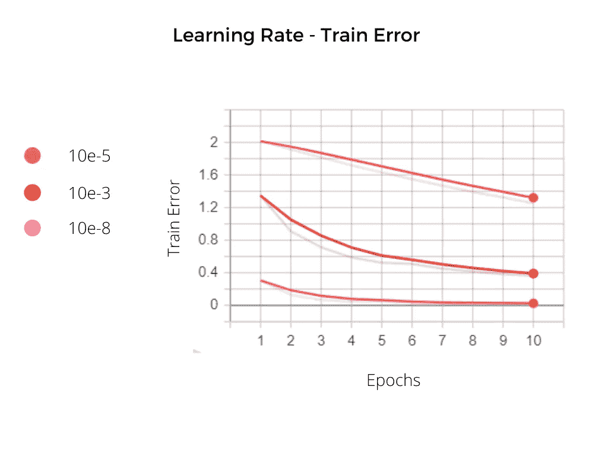
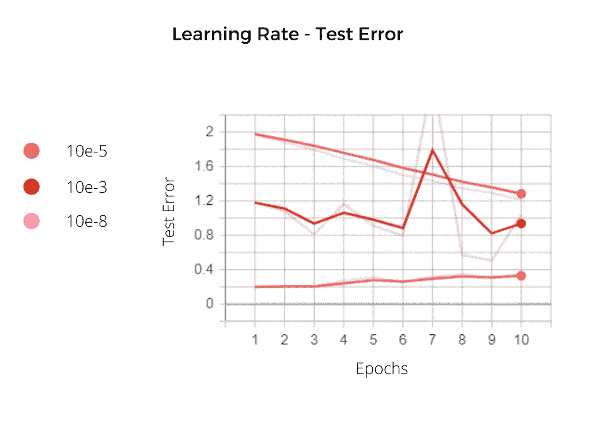
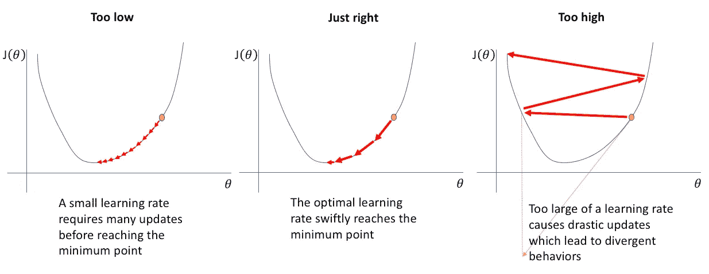
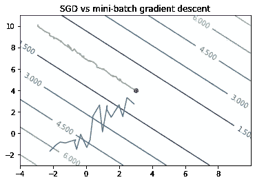
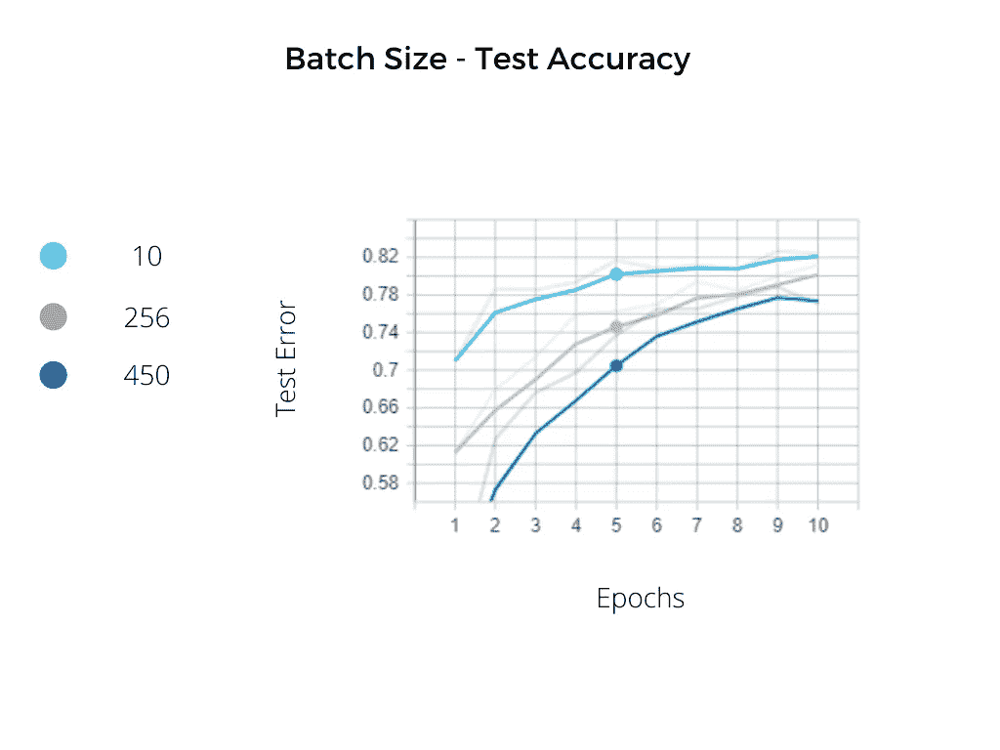
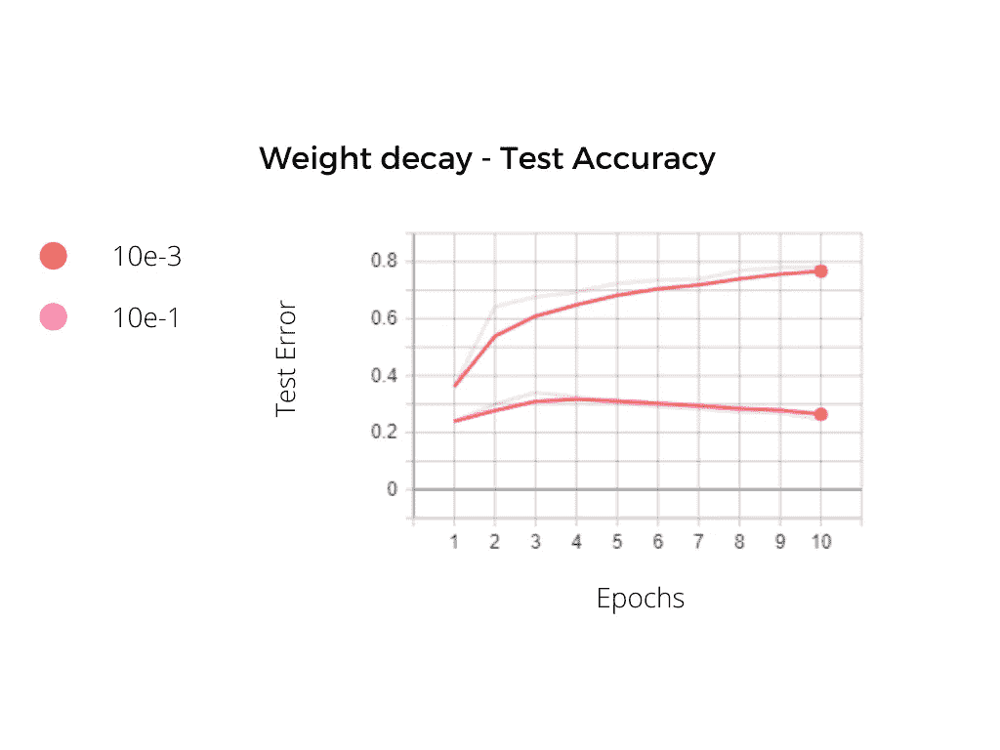

# 深度学习中超参数调整的实验——遵循的规则

> 原文：<https://towardsdatascience.com/experiments-on-hyperparameter-tuning-in-deep-learning-rules-to-follow-efe6a5bb60af?source=collection_archive---------27----------------------->

鸣谢—[https://image . free pik . com/free-photo/gear-cutting-machine _ 137573-2479 . jpg](https://image.freepik.com/free-photo/gear-cutting-machine_137573-2479.jpg)

任何深度学习模型都有一组参数和超参数。参数是模型的权重。这些是在每个反向传播步骤使用优化算法(如梯度下降)更新的。超参数是我们设定的。他们决定模型的结构和学习策略。例如，批量大小、学习速率、权重衰减系数(L2 正则化)、隐藏层的数量和宽度等等。由于深度学习在模型创建中提供的灵活性，人们必须仔细挑选这些超参数以实现最佳性能。

在这篇博客中，我们讨论

1.调整这些超参数时要遵循的一般规则。
2。在数据集上的实验结果验证了这些规则。

# 实验细节

**数据—** 实验在以下[数据集](https://www.kaggle.com/puneet6060/intel-image-classification)上进行。它包含 6 类图像——建筑物、森林、冰川、山脉、海洋、街道。每门课大约有 2300 个例子。测试集由每个类的大约 500 个例子组成。训练集和测试集都相当平衡。

资料组

code—
[https://github . com/DhruvilKarani/hyperparameter tuning/blob/master/readme . MD](https://github.com/DhruvilKarani/HyperParameterTuning/blob/master/README.md)

**硬件—**
NVIDIA 1060 6GB GPU。

**使用的型号—** 1。学习率实验— ResNet18
2。对于批量大小、内核宽度、重量衰减的实验—自定义架构(见代码)。

**观测记录—** 1。每个时期的训练和测试损失
2。每个历元的测试精度
3。每个时期的平均时间(测试集上的训练和推断)

# 超参数及其对模型训练的影响

我们以卷积神经网络(CNN)为例，将模型行为和超参数值联系起来。在这篇文章中，我们将讨论以下内容——学习速度、批量大小、内核宽度、权重衰减系数。但是在我们讨论这些通用规则之前，让我们回顾一下任何学习算法的目标。*我们的目标是减少训练误差以及训练误差和测试/验证误差之间的差距*。我们通过调整超参数来实现这一点

训练和验证误差通用图。原图。

让我们看看深度学习文献如何描述改变超参数值的预期效果

## 学习率

**深度学习**书上说—

> 如果你有时间只调整一个超参数，调整学习率

在我的实验中，这当然成立。在尝试了三种学习速率后，我发现过低或过高的值都会严重降低算法的性能。对于学习率 10^-5，我们实现了 92%的测试准确性，对于其余两个率，我们几乎没有超过 70%,所有其他超参数保持不变。

在 ResNet 上测试准确性

如果你看看误差图，会发现一些东西。例如在训练错误中—

ResNet 上的训练错误

不出所料，三者都有所下降。但是在最低的学习速率下(粉色)，第 10 个时期的损失*大于第一个时期*的红色曲线的损失。由于学习率极低，你的模型学得非常慢。此外，在高学习速率下，我们期望模型学习得更快。但是如你所见，红色曲线上的最低训练误差*仍然大于橙色曲线上的误差*(中等学习率)。现在让我们看看测试误差—

ResNet 上的测试错误

一些观察。对于最低比率，测试损失稳步下降，似乎还没有达到最低点。这意味着模型有欠拟合，可能需要更多的训练。

图片鸣谢—[https://www . Jeremy Jordan . me/content/images/2018/02/Screen-Shot-2018-02-24-at-11 . 47 . 09-am . png](https://www.jeremyjordan.me/content/images/2018/02/Screen-Shot-2018-02-24-at-11.47.09-AM.png)

红色曲线显示异常行为。有人可能会怀疑，由于高学习率，优化器无法收敛到全局最小值，并一直在误差范围内跳动。

对于中等曲线(橙色)，测试误差在第一个时期后开始缓慢增加。这是**过拟合**的经典例子。

## 批量

如果你熟悉深度学习，你一定听说过随机梯度下降(SGD)和批量梯度下降。为了重新访问，SGD 对每个数据点执行权重更新步骤。batch 在对整个训练集中数据点的梯度进行平均后执行更新。根据 [Yann LeCun](http://yann.lecun.com/exdb/publis/pdf/lecun-98b.pdf)

SGD 的优势—
1。学起来快多了
2。往往能获得更好的解决方案
3。用于跟踪更改。

批量学习的优势—
1。收敛的条件是众所周知的。
2。许多加速学习技术，如共轭梯度，在批量学习中很好理解。
3。重量动力学和收敛速度的理论分析要简单得多

使用介于两者之间的方法，小批量梯度下降法很受欢迎。不是使用整个训练集来平均梯度，而是使用一小部分数据点的梯度平均。该批次的大小是一个超参数。

举例来说，考虑下图所示的损失情况

损失景观示例。原图

上面有数字的对角线是损失等值线。x 轴和 y 轴是两个参数(比如说 *w1* 和 *w2* )。沿着等高线，损耗是恒定的。例如，对于任何位于损耗为 4.500 的线上的 *w1* 和 *w2* 对，损耗为 4.500。蓝色之字形线是 SGD 的行为方式。橙色线是您预期的小批量梯度下降的工作方式。红点代表参数的最佳值，此时损耗最小。

《深度学习》一书提供了一个很好的类比来理解为什么太大的批量效率不高。从 *n 个*样本估计的标准误差为 **σ/√ *n.*** 考虑两种情况——一种有 100 个样本，另一种有 10000 个样本。后者需要 100 倍以上的计算。但是标准误差的预期降低只有 10 倍

在我的实验中，我改变了批量大小。我获得的测试准确度看起来像—

## 内核宽度

CNN 中的卷积操作包括从特征图中提取特征的核。内核由学习到的参数组成。在二维卷积中，内核是一个 N*N 的网格，其中 N 是内核宽度。

增加或减少内核宽度各有利弊。增加核宽度会增加模型中的参数，这是增加模型容量的明显方法。很难对内存消耗进行评论，因为参数数量的增加会增加内存使用量，但特征图的输出维度会变小，从而减少内存使用量。

## 重量衰减

权重衰减是 L2 正则化的优势。它实质上惩罚了模型中较大的权重值。设置正确的强度可以提高模型的泛化能力并减少过度拟合。但是过高的值会导致严重的欠拟合。例如，我尝试了正常和极高的重量衰减值。如你所见，当这个系数设置不好时，学习能力几乎为零。

## 结论

这些实验完全证实了我们的大多数假设。像 ResNet18 这样调优不佳的复杂模型很容易比调优良好的简单架构表现更差。损耗曲线是研究超参数影响的良好起点。

为你的模型找到最好的超参数是困难的。尤其是手动操作的时候。我建议看看 HyperOpt 和 Optuna 这样的超参数优化库。这篇由 neptune.ai(一家为你的 ML 实验管理需求提供解决方案的公司)撰写的[文章](https://neptune.ai/blog/optuna-vs-hyperopt)很好地介绍了这些包。

*如果你和我一样是 ML 爱好者，那就来连线一下* [*LinkedIn*](https://www.linkedin.com/in/dhruvil-karani/) *和*[*Twitter*](https://twitter.com/dhruvil_karani)*。我非常乐意收到对这篇文章的任何评论。*