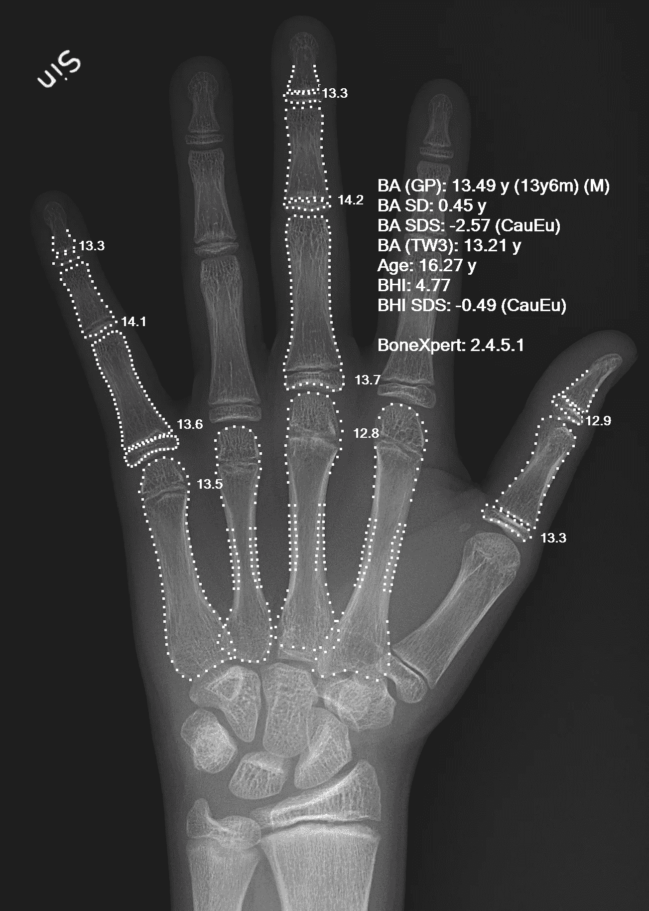

# 专家与算法:一个观点

> 原文：<https://towardsdatascience.com/experts-vs-algorithms-a-view-ea0951211f8f?source=collection_archive---------20----------------------->

## 解决问题:“专家的决定比算法的预测更好吗？”

大脑:我们用来思考的器官― 比尔斯，A·

*“我很高兴能够及时回答，我也这么做了。我说我不知道。”―* 马克·吐温

*“你的假设是你观察世界的窗口。每隔一段时间就把它们擦掉，不然光线就照不进来了。”―* 艾萨克·阿西莫夫

带骨龄计算的手部 x 光照片——迈克尔·海格斯特伦(来源:维基共享)

算法(人工智能，机器学习)的传播引发了一个有效的问题:**专家的决策比算法做出的预测更好吗？这是一个预示着人类知识和行动存在危机的问题，因为它经常被问到。**

例如，The Verge 最近的一篇报道题为:[“为什么发现癌症的人工智能需要小心处理”](https://www.theverge.com/2020/1/27/21080253/ai-cancer-diagnosis-dangers-mammography-google-paper-accuracy)(詹姆斯·文森特，2020 年 1 月 27 日)。来自该报告:“但对于医疗保健领域的许多人来说，这些研究展示的不仅仅是人工智能的前景，还有它的潜在威胁。他们说，尽管算法处理数据的能力显而易见，但护士和医生微妙的、基于判断的技能却不那么容易数字化。

但是这种观点忽略了表明其他情况的证据。有两个关键因素― ***(1)认知偏差******(2)认知超载***―在起作用。

要回答这个问题(专家 vs .算法)，我们先来看看 ***认知偏差*** 所起到的作用。

心理学家和行为经济学先驱丹尼尔·卡内曼因“将心理学研究的见解融入经济科学，尤其是关于人类在不确定情况下的判断和决策”而获得 2002 年诺贝尔经济学奖他与经济学家阿莫斯·特沃斯基的合作是众所周知的――这种合作关系导致了行为经济学的许多基础性成果，尤其是 20 世纪 70 年代“前景理论”的发展。

前景理论是对作为现代经济理论基础的经典效用理论*、*的重要更新，它是对人类估计中损失和收益不对称的行为框架，最初由*丹尼尔·伯努利*于 1738 年提出，作为对*、【圣彼得堡悖论】的著名解决方案*，并于 20 世纪 40 年代由*约翰·冯·诺依曼*和*奥斯卡·莫根施特恩*运用理性选择的公理编织成其现代形式*预期效用理论*。(虽然冯·诺依曼和摩根斯坦使用理性选择的公理构建了现代效用理论，但伯努利在 1738 年建立了效用构造作为*“道德期望”*与数学期望相对，强调了他的效用观点是一种主观构造而非数学构造。这是他的论点的关键点:一个穷人的道德期望不同于一个富人的道德期望――这使得丹尼尔·伯努利成为真正的行为经济学先驱。)

要不是卡尼曼在 1996 年英年早逝，特沃斯基几乎肯定会与他分享诺贝尔奖(卡尼曼与经济学家弗农·史密斯(Vernon Smith)分享了诺贝尔奖，后者因其在实验经济学中的开创性作用而闻名)。

在研究生院，我第一次看到他们的经典论文**“不确定性下的判断:启发式和偏见”*(特沃斯基和卡尼曼，1974)*** ，并立即被不确定性下的判断、启发式在决策中的作用以及由此产生的系统性偏见吸引住了。在这篇经典论文中，Tversky 和 Kahneman 将这些偏见归纳为三个关键的启发法:*代表性*(一个对象代表特定类型的可能程度)；*可用性*(基于脑海中出现的实例或事件对事件发生概率的主观评估)；以及*来自锚点的调整*(从初始值开始做出的主观估计，并被调整以产生最终答案，这些调整通常被证明是不充分的)。

在他的精彩著作**《思考，快与慢》(2011)** 中，丹尼尔·卡内曼解释了扎根于心理学的观念，即人类的思维是两个心理系统的混合:一个快速、直觉、自动、几乎无意识的过程*(系统 1)****和*；一个缓慢、审慎、有意识的过程，需要专注和努力*(系统 2)* 。这两个系统的相互作用使得我们的思想和行动。(注意书名中突出快和慢的思考后的逗号。)**

**卡尼曼在“直觉与公式”一节中探讨了专家与算法的问题。他强调了临床心理学家 Paul Meehl 关于专家直觉和使用公式指导的有趣发现。米尔的发现表明，简单的算法(统计预测)在几乎所有测试领域都胜过或追平了专家(临床判断)。正如卡尼曼指出的那样，对于算法来说，实现的容易程度甚至可以让一场平局成为一场胜利。这些结果*(“米尔模式”)*震惊了当时的临床机构，这是可以理解的，因为人工智能的进步现在仍在继续。**

**卡尼曼强调的著名的**阿普加评分**清楚地表明了这一点。1953 年，医学博士维珍尼亚·阿普伽发表了她对新生儿评估新方法的建议。本文的公开目的是建立一个简单明了的新生儿分类，用于比较产科实践的结果、产妇疼痛缓解的类型和复苏的结果。在考虑了几个与婴儿出生时的状况有关的客观体征后，她选择了五个可以毫无困难地进行评估并教给产房人员的体征。这些迹象是心率、呼吸努力、反射性易怒、肌肉紧张度和颜色。婴儿完全出生后 60 秒，根据是否存在，每个迹象被给予 0、1 或 2 的评级。”*(资料来源:“阿普加评分经受住了时间的考验”，芬斯特博士&伍德博士，2005)***

**简而言之，产房工作人员在出生后 1 分钟获得的这个简单分数(0-10)提供(并且仍然继续提供)新生儿的预后(如果 8-10，则为优秀；如果 3-7，则为一般；如果 0-2，则为差)。重要的是，阿普加博士选择了五个“可以毫无困难地评估和教授给产房人员”的客观体征――也就是说，它可以被非专家容易地理解。阿普加评分对降低婴儿死亡率产生了巨大的影响。根据纽约长老会/哥伦比亚大学医学中心的理查德·斯迈利博士的说法:“这个分数要求医生和护士用一种有组织的方法来观察新生儿，它帮助防止了无数婴儿的死亡。一旦医生和护士不得不分配一个分数，它就产生了一个必须采取行动来提高分数。这实质上是临床新生儿学的诞生。”*(资料来源:纽约长老会健康问题:“发生在这里:阿普加评分”)***

**先驱维珍尼亚·阿普伽博士是哥伦比亚大学内外科医学院第一位拥有正教授职位的女性医生。**

**卡尼曼对直觉与公式问题的研究表明，“每当我们可以用公式代替人类的判断时，我们至少应该考虑它。”偏见(傲慢、过度自信等)阻碍了客观性。不相关的上下文或显著性偏差影响一致性。在可预测性差的情况下，算法有可能提供客观和一致的判断。使用卡尼曼提供的框架，很容易看出，在需要系统 2 思维(缓慢思考)的领域使用系统 1 思维(快速直觉)会产生这些情况。认识到这些模式可以帮助不同领域的规划者制定策略(就像阿普加博士所做的那样)，以保持客观和一致的评估，因为情况(例如在出生后一分钟内快速评估新生儿)似乎需要直觉。**

**现在让我们通过检查 ***认知超载*** 所扮演的角色来看看专家与算法的问题。认知超载是复杂性增长和人类极限现实的结果。**

****阿图尔·加万德博士**在《纽约客》杂志*上发表的关于医疗保健的文章声名鹊起。他的第一本书**《并发症:一个外科医生对不完善科学的笔记》(2002)** ，一本他在布莱根妇女医院住院期间写的散文集，为他赢得了国家图书奖。“包含并发症的文章(其中许多最初出现在《纽约客》上)分为三个部分――易错性、神秘和不确定性――每一部分都涉及医疗实践中不同种类的缺陷或困难。因此，Gawande 探索了医学可能达不到预期的许多方式。尽管尽了最大努力，人类还是会犯错。科学知识仍然是不完整的，留下了许多没有答案和无法回答的问题。有些情况就是模棱两可，需要在面对令人抓狂的不完整信息时做出判断，而且往往没有好的解决方案。”*(资料来源:“像外科医生一样”，史蒂文·卢贝特，2003 年 5 月，康奈尔法律评论)****

**人类易犯的错误、我们不知道的事情以及在信息不完整的情况下做出判断都是任何情况的一部分。当这些在时机很重要的情况下(例如，新生儿出生后 1 分钟*或心脏病发作到达后 90 分钟*)结合在一起时，复杂性总是存在，求助于算法(和公式)可能是必要的。****

***在 2009 年，Gawande 出版了**《清单宣言:如何把事情做好》**，在那里他着眼于如何利用“受过良好训练、拥有高技能和勤奋的人”积累的来之不易但难以管理的知识，并通过提出一个“克服失败，一个建立在经验基础上并利用人们拥有的知识，但也以某种方式弥补我们不可避免的人类不足”的策略来消除可以避免的常见和持续的失败——*一个清单！****

***与阿普加的见解相呼应，加万德认为:“清单似乎可以防止这种失败。它们提醒我们最起码的必要步骤，并使它们明确。它们不仅提供了验证的可能性，还灌输了一种更高性能的纪律。”作为一个例子，Gawande 讨论了由约翰·霍普金斯医院的重症监护专家 Peter Provonost 设计的用于解决 ICU 中心静脉导管感染问题的清单如何在两年的时间内显示出此类感染的显著下降(几乎降至零)。另一个例子是一名奥地利儿童在滑入冰冷的池塘后奇迹般地康复，这表明现代医学的快速和协调的复杂性是如何创造这样的奇迹的。清单宣言有很多这样的例子，读起来很有意思。***

***清单或公式或算法可以提供一个客观和一致的途径，通过关注在时间敏感的情况下的最小必要，来消除可避免的故障，在这种情况下，不断增长的复杂性和人的易错性(以及人的极限)可能会不利地结合在一起。这种算法方法可能在某些领域不太适用(至少目前如此)，但重要的是要认识到这种方法适用的所有领域。***

*****这种对算法的观点违背了专家和学者当前的智慧。**但理论和经验为这一观点提供了充分的支持，表明为什么至少考虑算法在规划复杂操作和为复杂项目汇集专业知识中的作用是重要的。***

***在这种情况下，为什么简单的算法能如此成功？从周围的噪音中提取信号。***

*   ***认知偏差(详见 Tversky-Kahneman 论文)将焦点转移到噪声上，特别是当问题表现出高信噪比和时间敏感性时。***
*   ***根据“思考，快和慢”中解释的系统 1/系统 2 模型，尽管经常遇到这种情况(婴儿每天都出生)，但系统 1 思维(快速、联想、直觉)可能会主导系统 2 思维(缓慢、审慎、逻辑)。发生这种情况的原因有很多。结合了速度和相关公式的算法在这种情况下似乎很方便。***
*   ***相关公式:现代统计学和群体遗传学的先驱罗纳德·费雪(和他那个时代的许多杰出统计学家一样，他也是一个狂热的优生学者)，在面对统计模型的未知参数时，强调了充分统计的概念。跳过技术解释，充分统计背后的直觉是为现象的统计模型找到一个具有充分解释力的代理。例如，样本均值和方差作为总体真实均值和方差的代理。基本上，这意味着确定一组简单的相关参数或一个简单的代表性函数(即使是一个粗略的函数),以提供足够的预测能力。虽然围绕阿普加分数的神话层出不穷，但很明显，阿普加在一段时间内的观察和她在综合方面的天赋帮助她确定了出生后立即观察的相关迹象，以预测婴儿的状况和所需的护理。***
*   ***正如 Gawande 的书中充分说明的那样，认知超载只是反映了人类由于复杂性的增长和解决日常问题所需的专业知识的协调而带来的负担。Gawande 展示了三个因素――人的易错性、未知性(我们不知道的)和不确定性(部分或不完善的信息)―是如何导致判断错误的。为了避免错误，积累经验并掌握诀窍，Gawande 建议用*清单*作为灌输所需纪律的方式。***
*   ***失足跌入冰冷池塘的儿童的康复案例说明了在现代医学发展到极限的情况下，生存概率非常低的情况是如何得到扭转的。这看起来不可思议，因为期望每件事都非常及时地非常好地工作，并且准确无误地到位，没有任何误差，这是不合理的。清单在两个方面有所帮助:(1)将问题快速归类为非常规问题(识别未知问题),以及(2)为采用非标准技术的专业干预铺平道路(使用合理的判断，利用专业知识)。***
*   ***在许多领域(如建筑设计、飞机等复杂机械系统的设计)中，将系统设计到极限(根据经验建立合理的概率模型并构建适当的安全系数)是非常标准的做法，但这通常不适用于分布式过程的设计，尤其是跨越学科边界的过程。失败的影响只有在事后才能确定。只有专业项目(核项目、太空项目等)出于必要才采用这种端到端视图。算法可以廉价地探索多种可能性。即使模拟低概率事件，也能帮助规划者理解面对最坏情况时如何应对。***

***将*认知偏差*视为专家低效或不利地过滤信息，将*认知超载*视为人类在面对大量信息时的无能或限制，算法可以克服这些障碍，使决策变得客观和一致。***

***本文仅考察了在典型的不确定性和复杂性条件下，专家相对于算法的相对优势，回避了引入算法所带来的道德、社会和经济影响这一更大的问题。工业革命的教训和卡尔·马克思在其名著**《资本论】**中阐述的关于自动化轨迹的见解与这一讨论相关。但是我会把它留到下一天。***

***劳动的工具，当它采取机器的形式时，立即成为工人自己的竞争者。― 卡尔·马克思,《资本论》第一卷***

***期待您的问题、评论和反馈。***

***Suresh Babu |年 2 月 6 日|旧金山湾区***

***我对人工智能前沿的兴趣:***

*   ***作为一个作家，研究人工智能的含义、伦理、社会影响和经济学(作为一个作家)***
*   ***作为从业者，为企业和政府创造 AI 战略和应用***
*   ***作为顾问，帮助非营利组织和非政府组织评估人工智能的全球影响和效用***