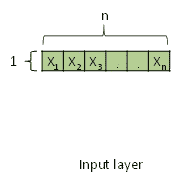
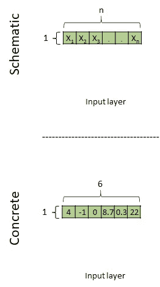
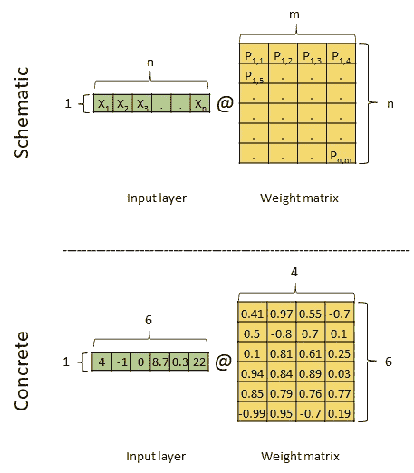
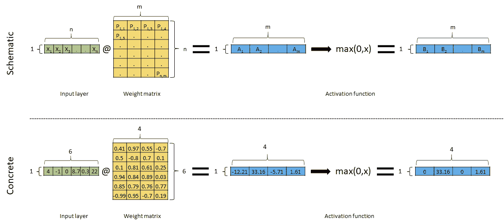
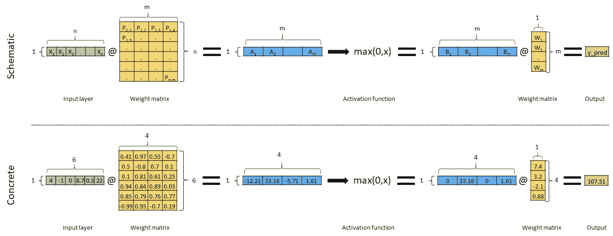

# 向你奶奶解释深度学习神经网络

> 原文：<https://towardsdatascience.com/explain-deep-learning-neural-networks-to-your-grandma-80b726bf6124?source=collection_archive---------22----------------------->

> *“除非你能向你的祖母解释，否则你不会真正理解某事”*

不知道这句话最初是从哪里来的，它有时被部分归因于阿尔伯特·爱因斯坦。

无论如何，这篇文章是我的尝试(向我自己和其他人)解释神经网络(NN)算法如何以一种简单、新手、直接和高级的方式工作，没有任何公式、方程或代码。我完全知道下面的文字可能有些不准确，但是为了避免复杂的解释和保持简单，这是很自然的，否则你的奶奶不会明白…

在我们开始之前，我想感谢由杰瑞米·霍华德和雷切尔·托马斯创立的 [fast.ai](https://www.fast.ai/) ，这是一个专注于深度学习和人工智能的非营利研究小组。我已经从他们的免费在线课程中学到了很多，而且我还在继续学习。

哦..我在最后写了这篇文章的摘要，以防你想直接看。

好吧，我假设如果你读了这篇文章，你至少对 NN 有所了解，所以我就不介绍 NN 是如何在最近几年变得流行起来的，以及它们如何帮助你解决问题了。

那么神经网络算法是如何工作的呢？

一个字:数学。

两个字:矩阵乘法。

如果你的祖母不理解这个解释，那么你可以告诉她我们从输入层开始，这是神经网络模型的输入数据。

输入图层形状为( *1，n)* ，意为 *1* 行和 *n* 列。我们也可以称之为张量，把张量想象成一个可以容纳 N 维数据的容器。向量是 1D 张量，矩阵是 2D 张量。

***一定要注意 NN*** 中张量的形状

如果我们的数据是表格形式的，那么这个输入层代表我们表格中的一行，这意味着一个具有 *n* 个特征的观测值。假设我们想用 NN 来预测房子的价格，那么 *Xs* 可以是房间数量、位置、是私人住宅还是大楼中的公寓、楼层数等。如果我们的数据是一个图像，那么输入层代表一个像素，其中*x*是该像素的波段/通道，例如，红色、贪婪和蓝色。

你猜怎么着让我们把它变得更具体，我会在示意图上加一个数字。所以现在我们有了这个:

正如你所看到的，在下面的例子中 *n* =6。顺便说一下，我刚刚做了这些数字，它们不属于特定的数据集。

接下来，我们将输入层乘以一个矩阵，这个矩阵可以称为权重矩阵。

为了使乘法有效，我们需要确保输入层中的列数等于权重矩阵中的行数。这里就是这样，输入层形状是 *(1，n)* 或 *(1，6)* ，权重矩阵形状是 *(n，m)* 或 *(6，4)* 。虽然我们不能控制权重矩阵中的行数(它必须等于输入层中的列数)，但是我们可以将权重矩阵的列数设置为我们喜欢的任何数字。这里，为了简单起见，我将权重矩阵的列数设置为 4。权重矩阵中的数字是完全随机的(NN 就是这样开始的)。示意图中的字母 *P* 也是随机选择的，因为我需要示意性地表示数字，而 *X* 已经被输入层取了。

乘法运算结果是:

结果是一个形状为 *(1，m)* 或 *(1，4)* 的张量，矩阵乘法就是这样进行的……第一个张量的列数必须与第二个张量的行数相同，结果是一个张量的行数等于第一个张量的行数，列数等于第二个张量的列数。

换句话说: *(n，m) @ (m，k) →(n，k)*

现在我们把这个结果传递给一个叫做激活函数的函数。有各种各样的激活功能，但这里我们将使用一个常见的称为 ReLU。名字真的不重要。这个函数获取我们的结果(蓝色张量)中的数字，并根据一个非常简单的规则更改里面的数字:如果值大于 0，则保留该值，如果值小于 0，则将其更改为 0。数学上是这样写的: *max(0，X)。*

请注意，形状没有改变。我们刚刚做的叫做隐藏层。你想加多少都可以。例如，如果我们想添加另一个隐藏层，我们只需重复我们之前所做的。意思是，取(最右边的)蓝色张量，乘以一个 4 行和任意列数的权重矩阵(用随机数)，然后在结果张量中将小于 0 的值改为 0，就这样。希望不要混淆，但是我在示意图中选择的蓝色张量中的字母值，只是为了让你知道数字是不同的。

一旦您添加了所有您想要的隐藏层，就该收敛到最终输出了，这意味着模型的预测或估计。为此，我们需要知道我们想要的输出是什么样的。如果是预测房价这样的回归问题，那么我们只需要一个数——shape*(1，1)* 。由此，我们知道我们要乘以的张量的形状应该是什么。如果是分类问题，我们需要一个形状为 *(m，how _ many _ categories _ we _ has)*的张量，在我们的例子中， *m = 4* 。

为了简单起见，假设我们有一个回归问题，那么:

再次注意形状，为了得到我们想要的形状 *(1，1)* 的预测，我们必须将我们的蓝色张量 *(1，4)* 乘以另一个形状为 *(m，1)* 的张量，这里的意思是 *(4，1)* 。现在我们得到了模型的预测，我们使用一个叫做损失函数的函数来比较预测值与真实值或实际值。这种比较将使我们了解我们的模型有多好。在我们对我们的模型精度进行第一次估计(通过损失函数)之后，我们(我指的是 NN 算法)改变权重矩阵中的数字(黄色的)，以便模型精度会更好。我们不断重复这个过程，直到我们有我们想要的精度。

**神经网络是如何工作的——摘要**

1)我们获取输入数据

2)我们将它乘以一个带有随机数的矩阵

3)我们改变所有值< 0 to 0, and do not change when value> 0

4)我们根据需要重复步骤 2 和 3 多次

5)我们将结果乘以最终张量以获得模型预测

6)我们使用一个函数(称为损失函数)将模型预测值与真实值进行比较，这将给出模型准确度的值

7)我们改变第 2 步和第 5 步中矩阵中的所有数字，这样精确度会好一点

8)我们重复所有步骤，直到我们对精确度满意为止

嗯，就是这样。我希望这足够清楚和简单。如果你明白了，或者至少你认为你明白了，只有一种方法可以证明。试着向你的奶奶解释，或者随便找一个奶奶(但是要征得她的完全同意😊)