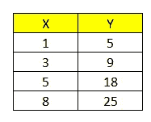

# 用手工计算解释线性回归

> 原文：<https://towardsdatascience.com/explain-linear-regression-with-manual-calculation-1622affdce6b?source=collection_archive---------15----------------------->

## 这可能很疯狂，但这将帮助你从线性回归中了解更多。

在我看来，线性回归是数据科学中最简单的话题之一。使用线性回归，您可以获得两组变量(自变量和因变量)之间的相关性。我确信许多人已经熟悉了在不同的软件或编程工具中使用线性回归。比如在 Excel 中，你可以通过数据分析求解线性回归；在 Python 中，可以使用 statmodels 或 scikit-learn 模块。但在本文中，我将通过手动计算进行多元线性回归，并解释一些常见变量背后的意义。

我们开始吧。

(PS:在本文中，线性回归的所有基本假设都是有效的，例如，同方差，关系是线性的，没有多重共线性)

以下是本次演示的数据集:

线性回归的目的是创建一个模型，以方程的线性形式显示因变量(Y)与自变量(X)之间的关系。如果只有一个独立变量，这将被称为简单线性回归。如果超过一个，那么这将被称为多元线性回归。自变量和因变量之间的关系反映在系数上。系数的数学定义是因变量相对于自变量的偏导数。通俗地说，系数就是告诉你一个自变量增加 1，而其他自变量保持不变时，因变量的变化。除了这些变量，还有一个常数叫做截距，方程中还有一个误差。截距将不受独立变量的值的影响，而误差团队捕获模型无法解释的随机误差。

下面是线性回归的一般方程:

yᵢ代表第 I 次观察的因变量；xᵢₖ代表第 I 次观测的自变量，β₀代表截距，βₙ代表 xᵢₖ的系数；最后，εᵢ代表误差团队进行第 I 次观察。在我们的例子中，只有一个独立变量。因此，等式变成了

对于ε有一些假设。第一个假设是ε的均值为 0。第二个假设是ε有一个恒定的方差，并且是不相关的。更常见的是，ε也被假设为独立同分布(也称为 iid)。

为了得到β₀和β₁的值，最主要的两种估计方法是最小二乘估计和最大似然估计。今天我只解释最小二乘估计。

## 最小平方估计

定义:

1.  b₀和 b₁代表β₀和β₁的估计值
2.  ŷ代表 y 的估计值；ŷᵢ = b₀ + b₁ xᵢ
3.  eᵢ代表实际 yᵢ和估计ŷᵢ之间的残差

最小二乘估计的目标是估计β₀和β₁，使得残差平方和(SSE)最小。在数学表述中，SSE =σ(yᵢ-ŷ)=σ(yᵢ-(b₀+b₁xᵢ)。从等式中，你会明白为什么这种方法被称为最小二乘估计。

为了估计 b₀和 b₁的值，需要偏导数，我不会详细说明。b₀和 b₁的最终方程式如下:

所以在例子中，x̄=(1+3+5+8)/4 = 4.25；ȳ = (5+9+18+25)/4 = 14.25.sₓᵧ=(1–4.25)(5–14.25)+(3–4.25)(9–14.25)+(5–4.25)(18–14.25)+(8–4.25)(25–14.25)= 79.75；sₓₓ=(1–4.25)+(3–4.25)+(5–4.25)+(8–4.25)= 26.75。因此，b₁ = 79.75/26.75 = 2.98，而 b₀= 14.25–2.98 * 4.25 = 1.58。

## 稀有

评估线性回归性能的一个常用参数是 R 平方(R)。但在解释 R 之前，有必要先先解释两个多余的项，总平方和(SST)，回归平方和(SSR)。SST、SSR 和 SSE 都显示了不同度量的变化。

SST 显示了观察到的因变量的变化；SSR 显示了回归解释的变异；SSE 显示了回归线周围的变化。通过简单的计算，可以发现 SST = SSR + SSE，aka 观察到的因变量的总变异是回归模型解释的变异和未解释的变异之和。

在示例中，SST =(5–14.25)+(9–14.25)+(18–14.25)+(25–14.25)= 242.75。SSE =(5-(1.58+1 * 2.98))+(9-(1.58+3 * 2.98))+(18-(1.58+5 * 2.98))+(25-(1.58+8 * 2.98))= 4.99。SSR = 237.76。

r 等于 SSR/SST 或 1-SSE/SST。因此，当 R 较高时，它表示回归可以捕捉观察到的因变量的大部分变化。这就是为什么我们可以说当 R 很高时回归模型表现很好。在示例中，R = 237.76/242.75 = 0.98

一旦我们计算了 R，我们就可以立即计算相关性(R)。相关值只是 r 的平方根，符号与 b₁.相同因此，本例中的相关性为 0.99。

在面试中，更常见的是被问及一个特定模型的不同变量的原理和解释。应用并不困难，因为已经有许多工具来执行计算。但是为了完全理解如何解释所获得的结果，理解背后的原理也是重要的。

我希望这篇文章能帮助你更多地了解线性回归，以及你应该如何解释回归中的一些常见变量。希望你喜欢。下次见。

我的其他文章

[如果您是 Python 新手(尤其是自学 Python 的话)，请将此加入书签](/bookmark-this-if-you-are-new-to-python-especially-if-you-self-learn-python-54c6e7b5dad8)

[我在德国亚马逊公司为期六个月的实习中做了什么，学到了什么](https://medium.com/@wyfok/what-i-have-done-and-have-learned-in-my-six-month-internship-at-amazon-in-germany-a16f02627e8)

[如何使用 SQL 进行数据分析(房产销售时间序列)](/how-to-use-sql-to-perform-data-analysis-house-property-sales-time-series-bf36cd3c2528)

[为什么 SQL 中的窗口函数如此重要，你应该马上学习它](/why-window-function-in-sql-is-so-important-that-you-should-learn-it-right-now-1274b6096a86)