# 用数学细节解释支持向量机

> 原文：<https://towardsdatascience.com/explain-support-vector-machines-in-mathematic-details-c7cc1be9f3b9?source=collection_archive---------37----------------------->

## 数学中的超平面、最大边缘、硬边缘、软边缘

支持向量机(SVM)是一种监督机器学习算法，通常用于解决二分类问题。它还可以应用于多类分类问题和回归问题。这篇文章描述了二进制线性支持向量机背后的数学原理。理解数学有助于在实践中实现和调整模型。此外，您可以从头开始构建自己的支持向量机模型，并与 Scikit-Learn 中的模型进行比较。详细内容，你可以和我的另一篇文章一起阅读这篇文章。

具体来说，本报告解释了线性支持向量机的关键概念，包括硬边界和软边界情况下的原始形式及其对偶形式；支持向量的概念、最大间隔和泛化过程。

**SVM 的核心概念**

假设我们有 n 个训练点，每个观测值 I 有 p 个特征(即 **x_i** 有 p 维)，并且在两个类 y_i=-1 或 y_i = 1 中。假设我们有两类线性可分的观测值。这意味着我们可以通过我们的特征空间画一个超平面，使得一个类的所有实例都在超平面的一边，而另一个类的所有实例都在另一边。(p 维的超平面是 p-1 维的子空间。在下面的二维例子中，超平面只是一条线。)我们将超平面定义为:

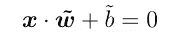

其中**w**是 p 向量，b 是实数。为了方便起见，我们要求\u w = 1，所以量**x*** \u w+\u b 是从点 **x** 到超平面的距离。

图片来自维基百科

因此，我们可以用 y = +1/-1 标记我们的类，并且超平面划分类的要求变成:

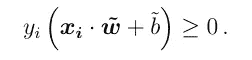

**应该如何选择最佳超平面？**

回答这个问题的方法是选择在两个类之间产生最大间隔 M 的平面，这被称为最大间隔分类器。

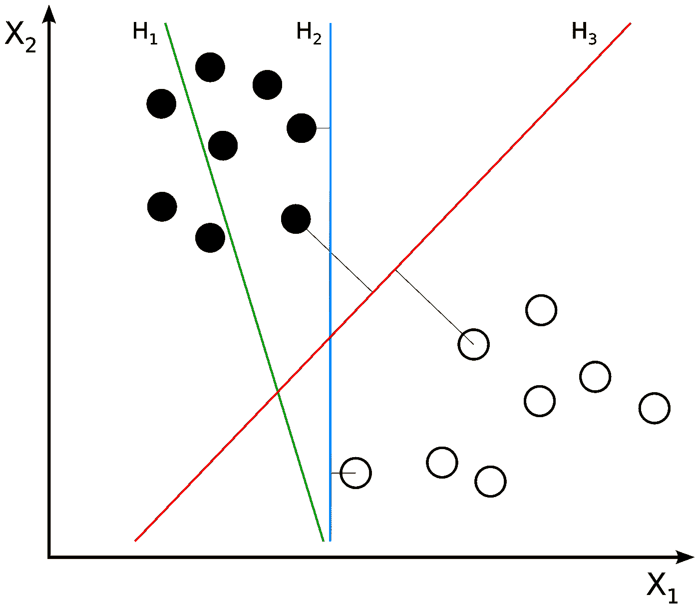

图片来自维基百科

从前面的图表中，我们可以看到 H1 并没有把这两个阶级分开；对于 H2 和 H3，我们将选择 H3，因为 H3 的利润率更高。数学上，我们选择\u b 和**\u w**来最大化 M，给定约束条件:

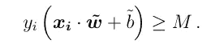

定义**w = w/M**和**b = b/M**，我们可以将其改写为:

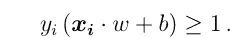

和

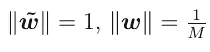

**支持向量**

支持向量是距离分离超平面最近的数据点。它们是最难分类的数据点。此外，支持向量是训练集的元素，如果被移除，其将改变划分超平面的位置。生成权重的优化算法以这样的方式进行，即只有支持向量确定权重，从而确定边界。数学上支持向量被定义为:

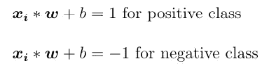

**硬利润 SVM**

硬边界 SVM 对穿过超平面的支持向量非常严格。它不允许任何支持向量被分类到错误的类别中。为了最大化超平面的间隔，硬间隔支持向量机面临优化问题:

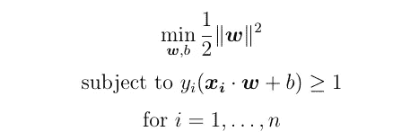

**软边际 SVM 和超参数*C***

一般来说，类不是线性可分的。这可能是因为阶级边界不是线性的，但往往没有明确的边界。为了处理这种情况，支持向量机添加了一组“松弛变量”，这些变量允许几个点偏移到甚至跨越边距，如下图所示:

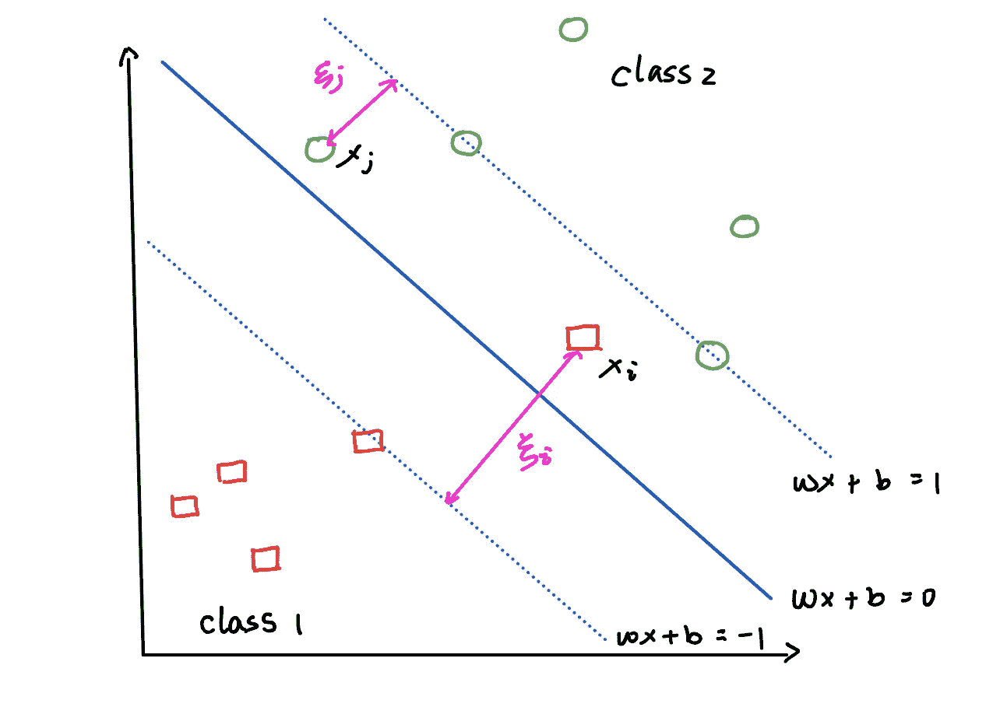

作者图片

我们希望在最大化利润宽度的同时最小化总松弛量，这被称为软利润支持向量机。这被更广泛地使用，并且目标函数变成:

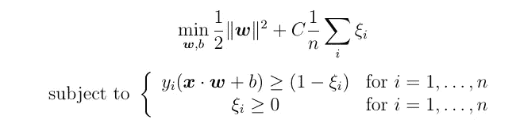

对于某些常数 ***C*** 。这个优化问题被称为原始问题。常数 ***C*** 代表时差的“成本”。当 ***C*** 小时，允许更多的点进入余量以获得更大的余量是有效的。更大的 ***C*** 将产生具有更少支持向量的边界。通过增加支持向量的数量，SVM 减少了它的方差，因为它更少地依赖于任何单独的观察。减少方差使模型更一般化。因此，**减少 *C* 将增加支持向量的数量并减少过拟合。**

使用拉格朗日乘数:

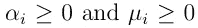

两个限制

我们可以将约束优化问题重写为原始拉格朗日函数:

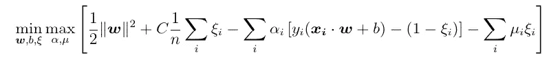

我们可以根据之前为 **w** 、 **b** 获得的关系，最大化乘数，而不是根据约束最小化 **w** 、 **b** 。这被称为对偶拉格朗日公式:

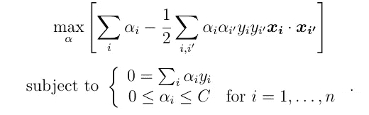

这现在是一个相当简单的二次规划问题，用序列最小化优化来解决。有很多编程工具可以用来解决优化问题。你可以使用 Matlab 中的 [CVX 工具](http://cvxr.com/cvx/)来解决这个问题。或者熟悉 python 的话，可以用 CVXOPT 包来解决。我有[在 Medium 的另一篇文章](https://medium.com/python-in-plain-english/introducing-python-package-cvxopt-implementing-svm-from-scratch-dc40dda1da1f)讨论 CVXOPT 包的使用，以及如何应用它来解决对偶公式中的 SVM。一旦我们解决了这个问题，我们就可以很容易地计算出系数:

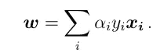

浏览支持向量机算法背后的数学知识肯定有助于理解模型的实现。它为正确的问题选择了正确的模型，并为超参数选择了正确的值。

希望这有所帮助。感谢大家的阅读！这是我所有博客帖子的列表。如果你感兴趣的话，可以去看看！

 [## 我的博客文章库

### 我快乐的地方

zzhu17.medium.com](https://zzhu17.medium.com/my-blog-posts-gallery-ac6e01fe5cc3)  [## 阅读朱(以及媒体上成千上万的其他作家)的每一个故事

### 作为一个媒体会员，你的会员费的一部分会给你阅读的作家，你可以完全接触到每一个故事…

zzhu17.medium.com](https://zzhu17.medium.com/membership)