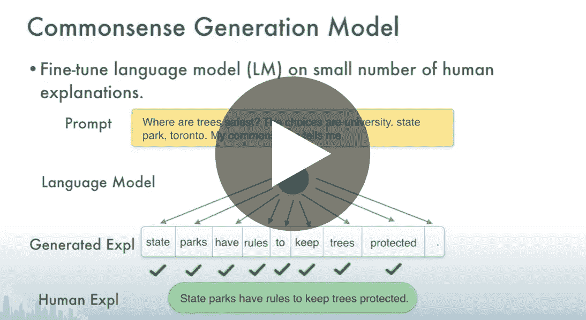

# 自己解释！利用语言模型进行常识推理

> 原文：<https://towardsdatascience.com/explain-yourself-leveraging-language-models-for-common-sense-reasoning-1c988b8b24cd?source=collection_archive---------41----------------------->

## [活动讲座](https://towardsdatascience.com/event-talks/home)

## Nazneen Rajani | TMLS2019

【https://torontomachinelearning.com/ 号

## 关于演讲者

Nazneen Fatema Rajani 是 Salesforce Research 的高级研究科学家。[领英](https://www.linkedin.com/in/nazneenrajani/)

## 关于谈话

深度学习模型在需要常识推理的任务上表现不佳，这通常需要某种形式的世界知识或对输入中不立即存在的信息进行推理。我们以自然语言序列的形式收集人类对常识推理的解释，并在一个名为常识解释(CoS-E)的新数据集中突出标注。

我们使用 CoS-E 来训练语言模型，以自动生成解释，这些解释可以在新颖的常识自动生成解释(CAGE)框架中的训练和推理期间使用。凯奇在具有挑战性的常识问答任务中提高了 10%的技术水平。我们进一步研究 DNNs 中的常识推理，使用人类和自动生成的解释，包括转移到域外任务。实证结果表明，我们可以有效地利用语言模型进行常识推理。

[自己解释！利用语言模型进行常识推理](https://youtu.be/M5hyQN2YSm8)