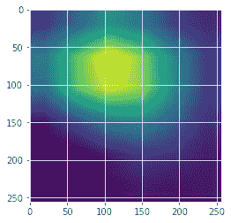

# 通过深度学习对新冠肺炎 X 射线分类器的可解释性和可见性

> 原文：<https://towardsdatascience.com/explainability-and-visibility-in-covid-19-x-ray-classifiers-with-deep-learning-c12c3247f905?source=collection_archive---------48----------------------->

关键词:深度学习，Grad-CAM，X 射线，新冠肺炎

***编者按:*** [*走向数据科学*](http://towardsdatascience.com/) *是一份以数据科学和机器学习研究为主的中型刊物。我们不是健康专家或流行病学家，本文的观点不应被解释为专业建议。想了解更多关于疫情冠状病毒的信息，可以点击* [*这里*](https://www.who.int/emergencies/diseases/novel-coronavirus-2019/situation-reports) *。*

# 目的

在复活节的周末，我接触了一些用于新冠肺炎肺的深度学习分类器。演示结果看起来很好，似乎与当时关于这个主题的一些学术研究出版物相匹配。但是真的“没事”吗？

最近我碰巧听了一个关于“机器学习中的可解释性”的在线午餐网络研讨会，演讲者在最后谈到了这个分类结果:


上图也在这篇研究论文中呈现:[“我为什么要相信你？”解释任何分类器的预测](https://arxiv.org/pdf/1602.04938.pdf)。我们可以看到，分类器实际上被训练为将背景像素(例如，雪等野生环境)作为主要输入来分类它是宠物狗还是野狼。

这唤起了我以前的兴趣，现在肯定激起了一点好奇心:

*   我们如何“研究”这些通常以“黑盒”形式出现的新冠肺炎分类器，以了解哪些像素实际上促成了“新冠肺炎肺”的结果？
*   在这种情况下，我们可以利用的最简单的方式或最简单的工具是什么？

这是旅途中另一个 10 分钟的笔记。

# 范围

幸运的是，在过去的几年里，出现了各种 CNN 衍生分类器的便利工具:

我们将使用 **Grad-CAM** 对我们之前的新冠肺炎肺分类器做一个快速演示。

**“tensor flow 2 . 2 . 0 RC+Jupyter”**Docker 用于搭载英伟达 T4 GPU 的 AWS Ubuntu 16.04 服务器上。Tensorflow 2 提供了一个简单的“**梯度带**”实现。

下面是我在 Ubuntu 服务器上启动它的快速提示:

```
docker run -itd — runtime=nvidia -v /zhong/tf/:/tf -p 8896 :8888 -p 6026 :6006 — name tf-gpu2 tensorflow/tensorflow: 2.2.0rc2-gpu-py3-jupyter
```

# 方法

你可以放心地忽略上面 Grad-CAM 研究出版物中引用的一点数学知识。

这里引用它只是为了我们对最初的提议(在第 4 页& 5) 与后来使用的 Python 代码进行持续的交叉检查，希望结果也有更好的透明度。


(1):为了获得任何类别 c 的宽度 u 和高度 v 的类别区别定位图，我们首先计算类别 c 的分数 yc(在 softmax 之前)相对于卷积层的特征图 Ak 的梯度。这些流回的梯度被全局平均汇集，以获得目标类的神经元重要性权重 ak。(2):在为目标类 c 计算 ak 之后，我们执行激活图的加权组合，并在其后跟随 ReLU。**这会产生一个与卷积特征图大小相同的粗略热图**。

# 试验

现在让我们尝试一下目前为止我们能找到的最简单的编码:

**1。导入包**

```
import tensorflow as tf;
print(tf.__version__)
```

2.2.0-rc2

```
import tensorflow as tf
import tensorflow.keras.backend as K
from tensorflow.keras.applications.inception_v3 import InceptionV3
from tensorflow.keras.preprocessing import image
from tensorflow.keras.applications.inception_v3 import preprocess_input, decode_predictions
import numpy as np
import os
import imutils
import matplotlib.pyplot as plt
import cv2
```

**2。加载我们之前训练并保存的** [**模型**](https://community.intersystems.com/post/run-some-covid-19-lung-x-ray-classification-and-ct-detection-demos)

```
new_model = tf.keras.models.load_model('saved_model/inceptionV3')
new_model.summary()
```


我们可以看到，在最终的全球平均池之前，我们模型中 4D 的最后一个 CNN 层被称为“ **mixed10** ”。

**3。计算 Grad-CAM 热图**

下面是一个简单的热图，实现了上面的 Grad-CAM 方程(1)和(2)。在本帖中有解释[。](https://medium.com/analytics-vidhya/visualizing-activation-heatmaps-using-tensorflow-5bdba018f759)

```
with tf.GradientTape() as tape:
 last_conv_layer = model.get_layer('mixed10') 
 iterate = tf.keras.models.Model([model.inputs], [model.output, last_conv_layer.output])
 model_out, last_conv_layer = iterate(testX)
 class_out = model_out[:, np.argmax(model_out[0])]
 grads = tape.gradient(class_out, last_conv_layer)
 pooled_grads = K.mean(grads, axis=(0, 1, 2))
 heatmap = tf.reduce_mean(tf.multiply(pooled_grads, last_conv_layer), axis=-1) 
```

在我们的例子中，它将生成一个(27，6，6)的 heatmap numpy 数组。然后，我们可以将它调整到原始 X 射线图像的大小，并将其覆盖在 X 射线图像的顶部——就这样。

然而，在这种情况下，我们将使用一个稍微更详细的版本，这个版本在本文中也有很好的解释。它使用 Grad-CAM 热图编写了一个函数，该热图的大小已经调整为原始 X 射线的大小:

```
# import the necessary packages
from tensorflow.keras.models import Model
import tensorflow as tf
import numpy as np
import cv2class GradCAM:
    def __init__(self, model, classIdx, layerName=None):
        self.model = model
        self.classIdx = classIdx
        self.layerName = layerName
        if self.layerName is None:
            self.layerName = self.find_target_layer()def find_target_layer(self):
        for layer in reversed(self.model.layers):
            # check to see if the layer has a 4D output
            if len(layer.output_shape) == 4:
                return layer.name
        raise ValueError("Could not find 4D layer. Cannot apply GradCAM.")def compute_heatmap(self, image, eps=1e-8):
        gradModel = Model(
            inputs=[self.model.inputs],
            outputs=[self.model.get_layer(self.layerName).output,
                self.model.output])
        # record operations for automatic differentiation
 **with tf.GradientTape() as tape:
            inputs = tf.cast(image, tf.float32)
            (convOutputs, predictions) = gradModel(inputs)
            loss = predictions[:, self.classIdx]**
 **# use automatic differentiation to compute the gradients
        grads = tape.gradient(loss, convOutputs)**
        # compute the guided gradients
        castConvOutputs = tf.cast(convOutputs > 0, "float32")
        castGrads = tf.cast(grads > 0, "float32")
        guidedGrads = castConvOutputs * castGrads * grads
        convOutputs = convOutputs[0]
        guidedGrads = guidedGrads[0]
        weights = tf.reduce_mean(guidedGrads, axis=(0, 1))
        cam = tf.reduce_sum(tf.multiply(weights, convOutputs), axis=-1)# resize the heatmap to oringnal X-Ray image size
        (w, h) = (image.shape[2], image.shape[1])
        heatmap = cv2.resize(cam.numpy(), (w, h))# normalize the heatmap
        numer = heatmap - np.min(heatmap)
        denom = (heatmap.max() - heatmap.min()) + eps
        heatmap = numer / denom
        heatmap = (heatmap * 255).astype("uint8")# return the resulting heatmap to the calling function
        return heatmap
```

**4。装一张新冠肺炎肺部 x 光片**

现在，我们加载一个从未在模型训练和验证过程中使用过的测试 X 射线。(也上传到了之前的帖子里)

```
filename = ‘./test/nejmoa2001191_f1-PA.jpeg’
orignal = cv2.imread(filename)
plt.imshow(orignal)
plt.show()
```


然后调整大小为 256 x 256，并将其规范化为像素值在 0.0 和 1.0 之间的 numpy 数组“dataXG”。

```
orig = cv2.cvtColor(orignal, cv2.COLOR_BGR2RGB)
resized = cv2.resize(orig, (256, 256))
dataXG = np.array(resized) / 255.0
dataXG = np.expand_dims(dataXG, axis=0)
```

**5。进行快速分类**

现在我们可以调用上面新加载的模型来进行快速预测

```
preds = new_model.predict(dataXG)
i = np.argmax(preds[0])
print(i, preds)
```

0 [[0.9171522 0.06534185 0.01750595]]

所以被归类为 0 型——新冠肺炎肺，概率为 0.9171522。

**6。计算 Grad-CAM 热图**

```
# Compute the heatmap based on step 3
cam = GradCAM(model=new_model, classIdx=i, layerName='mixed10') # find the last 4d shape "mixed10" in this case
heatmap = cam.compute_heatmap(dataXG)#show the calculated heatmap
plt.imshow(heatmap)
plt.show()
```



**7。在原始 x 光片上显示热图**

```
# Old fashioned way to overlay a transparent heatmap onto original image, the same as above
heatmapY = cv2.resize(heatmap, (orig.shape[1], orig.shape[0]))
heatmapY = cv2.applyColorMap(heatmapY, cv2.COLORMAP_HOT)  # COLORMAP_JET, COLORMAP_VIRIDIS, COLORMAP_HOT
imageY = cv2.addWeighted(heatmapY, 0.5, orignal, 1.0, 0)
print(heatmapY.shape, orig.shape)# draw the orignal x-ray, the heatmap, and the overlay together
output = np.hstack([orig, heatmapY, imageY])
fig, ax = plt.subplots(figsize=(20, 18))
ax.imshow(np.random.rand(1, 99), interpolation='nearest')
plt.imshow(output)
plt.show()
```

(842, 1090, 3) (842, 1090, 3)


这似乎表明我们的新冠肺炎演示分类器“相信”患者在“右气管旁条纹”周围有一点“不透明”问题？我真的不知道，除非我和真正的放射科医生核实一下。

好了，让我们再尝试一些从真实案例提交到 GitHub 存储库中的测试图片:

```
filename = ‘./test/1-s2.0-S0929664620300449-gr2_lrg-b.jpg’
```

[9.9799889 e-01 3.8319459 e-04 1.6178709 e-03]]

这似乎也是一个合理的新冠肺炎解释，表明问题更多发生在左心线区域？


让我们试试另一种随机测试 x 光:

```
filename = ‘../Covid_M/all/test/covid/radiol.2020200490.fig3.jpeg’
```

0 [[0.9317619 0.0169084 0.05132957]]

令人惊讶的是，这看起来并不完全正确，但再看看它似乎也不太离谱，对不对？它显示了两个问题区域——主要问题在左侧，一些问题在右侧，与人类放射科医师的标记有些一致？(同时希望它不是在人类标记上训练——这是另一个层次的可解释性问题)。

好了，我就说到这里，因为我不确定会有多少人对阅读这份 10 分钟的简短记录感兴趣。


好了，我就说到这里，因为我不确定是否有太多的人会对阅读 X 射线感兴趣。

# 为什么？

那么，我们为什么要为此烦恼呢？为什么我们要触及这个话题并记下来以备后用？

我个人深深体会到“可解释性”和“可解释性”的重要性，以及实现它们的任何技术方法。任何进入这个维度的微小尝试都是值得努力的，不管它们有多微小。最终，“数据公平”、“数据公正”和“数据信任”将建立在数字经济的过程透明性之上。此外，它现在开始变得可用。现在我们有[越来越多的研究和工具，](/an-overview-of-model-explainability-in-modern-machine-learning-fc0f22c8c29a)就在今天人工智能开发者的指尖。

最后但同样重要的是，具体到这个演示，我对这种工具的一个欣赏是，它甚至不需要像素级标记，它试图自动为您生成肺部病变区域，有点半自动标记。在真实作品中是有意义的。我确实记得去年我的一个放射科朋友帮助我为 U-Net 训练一次又一次地为一些骨折数据生成一些像素级标签——这种练习确实伤害了我们的眼睛。

# 然后

我现在有点走神了。得益于过去 10 多年来深度学习的快速发展，医学成像是人工智能领域中相对成熟的方向。它值得一些好时光。然而，接下来我希望我们可以在 NLP 方面做更多的尝试，如果我们有一点时间的话。

# 确认

所有的资料来源都已在需要的地方插入上述文本。如果需要，我会放入更多的参考资料。

# 免责声明:

同样，上面应该是一个快速笔记，以防如果我现在不记录它，几周后它就消失了。都是作为一个“开发者”的个人看法。内容和文本可以根据需要随时修改。以上更多的是展示想法和方法，而不是临床解释，这将需要专业的放射科医生在良好的数据数量和质量上建立黄金法则。

前贴:[10 分钟内新冠肺炎肺部 X 线分类和 CT 检测演示](https://medium.com/@zhongli_69231/covid-19-lung-x-ray-classification-and-ct-detection-demos-in-10-minutes-9a686433a45a)

下一篇文章:[将新冠肺炎模型部署到一个统一的人工智能演示平台上](https://medium.com/@zhongli_69231/deploy-covid-19-models-into-a-consolidated-ai-demo-service-stack-ac170c3293cc)

【https://community.intersystems.com】最初发表于[](https://community.intersystems.com/post/explainability-and-visibility-covid-19-x-ray-classifiers-deep-learning)**。**