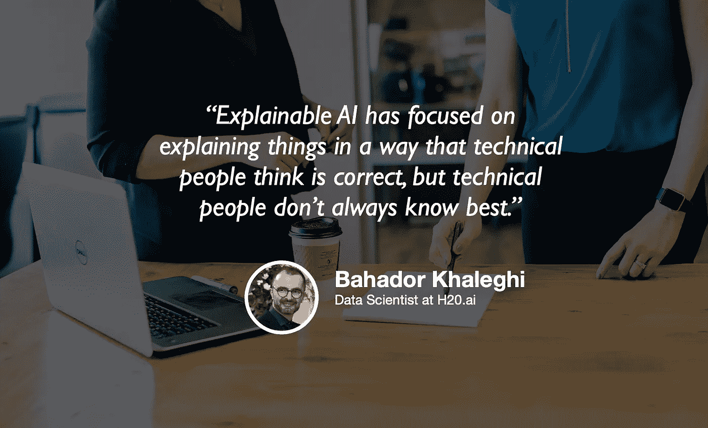

# 可解释的人工智能和人工智能的可解释性

> 原文：<https://towardsdatascience.com/explainable-ai-and-ai-interpretability-54a3d2b22052?source=collection_archive---------46----------------------->

## [苹果](https://podcasts.apple.com/ca/podcast/towards-data-science/id1470952338?mt=2) | [谷歌](https://www.google.com/podcasts?feed=aHR0cHM6Ly9hbmNob3IuZm0vcy8zNmI0ODQ0L3BvZGNhc3QvcnNz) | [SPOTIFY](https://open.spotify.com/show/63diy2DtpHzQfeNVxAPZgU) | [其他](https://anchor.fm/towardsdatascience)

## Bahador Khaleghi 在 [TDS 播客](https://towardsdatascience.com/podcast/home)

*编者按:迈向数据科学播客的“攀登数据科学阶梯”系列由 Jeremie Harris 主持。Jeremie 帮助运营一家名为*[*sharpes minds*](http://sharpestminds.com)*的数据科学导师初创公司。可以听下面的播客:*

如果我让你解释为什么你会读这篇博客，你可以用很多不同的方式来回答。

例如，你可以告诉我“这是因为我喜欢它”，或者“因为我的神经元以特定的方式激活，导致我点击了广告给我的链接”。或者你可以更进一步，把你的答案和量子物理的基本定律联系起来。

关键是，为了有效，解释需要针对一定的抽象层次。

在生活中确实如此，但在机器学习中也是如此，可解释的人工智能作为一种确保模型正常工作的方式，以对我们有意义的方式，受到了越来越多的关注。理解可解释性以及如何利用它变得越来越重要，这就是为什么我想与 H20.ai 的数据科学家 Bahador Khaleghi 交谈，他的技术重点是机器学习中的可解释性和可解释性。

我们的谈话涵盖了很多领域，但这里有一些我最喜欢的要点:

*   明确如何分解数据科学生命周期非常重要。尽管在数据探索和预处理之间，或者在特征工程和建模之间并不总是有明确的界限，但是将分析数据的过程分成定义明确的块会使您的工作更加模块化，并使协作更加容易。
*   最近，无论是行业还是监管机构，对可解释人工智能的兴趣都有了巨大的提升。这主要是因为我们使用的模型越来越复杂，因此其行为越来越难以解释。鉴于我们现在依赖机器学习来实现许多任务关键型应用，如无人驾驶汽车、贷款审批甚至医疗程序，可解释性将变得更加重要，作为确保模型不会表现出危险或意外行为的一种方式。
*   不太可能被输入中的微小变化所迷惑的模型被称为“稳健的”，事实证明，可解释的模型往往也更稳健。在某种程度上，这有点直观:对你的预测有一个连贯的解释意味着你的推理是合理的，而合理的推理不太可能被一点点噪音打乱。
*   autoML 的出现使得可解释性变得更加重要，因为 autoML 本质上把整个数据管道变成了一个黑盒(而不仅仅是机器学习模型)。当您使用 autoML 时，您甚至没有明确地决定如何设计或选择您的功能，您将不会对您的模型的决策过程有太多的可见性，这就为问题和病态敞开了大门。

你可以[在 Twitter 上关注巴哈多](https://medium.com/@bahador.khaleghi)，在 Medium 上阅读他的一些帖子[这里](https://medium.com/@bahador.khaleghi/why-enterprise-machine-learning-is-struggling-and-how-automl-can-help-8ac03023bf01)和[这里](https://medium.com/@bahador.khaleghi/a-critical-overview-of-automl-solutions-cb37ab0eb59e)。

你可以在推特上关注我。

## 订阅《走向数据科学》的[月刊](https://medium.com/towards-data-science/newsletters/monthly-edition)，直接在你的邮箱✨中接收我们最好的文章、视频和播客