# 可解释的人工智能:shapely 值在营销分析中的应用

> 原文：<https://towardsdatascience.com/explainable-ai-application-of-shapely-values-in-marketing-analytics-57b716fc9d1f?source=collection_archive---------8----------------------->

## 直觉的介绍性指南，以及用 Python 实现营销分析的 SHAP

照片由 [Artyom Kim](https://unsplash.com/@nezelenoe?utm_source=medium&utm_medium=referral) 在 [Unsplash](https://unsplash.com?utm_source=medium&utm_medium=referral) 上拍摄

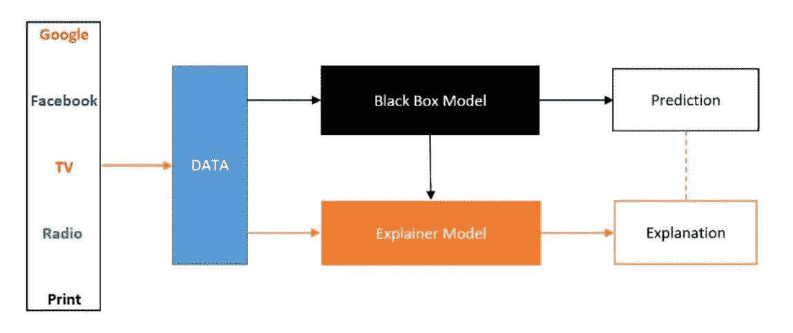

**XAI:可解释的 AI** 。来源:作者图片

最近，我偶然发现了一份白皮书，其中谈到了人工智能在营销分析中的最新应用。具体讲了 XAI(可解释 AI)在营销组合建模[【白皮书】](https://www.h2o.ai/blog/the-benefits-of-budget-allocation-with-ai-driven-marketing-mix-models/)中的应用。这引起了我的注意，我开始探索三件事:XAI，营销分析的现状，以及 XAI 在营销分析中的潜在应用。在浏览了所有可用资源后，我意识到 XAI 在重塑营销分析方面有着巨大的潜力。

在本文中，首先我们将讨论与营销分析现状相关的具体挑战及其解决方案。其次，我们将尝试开发一个关于 XAI 的直觉，最后，我们将在一些公开可用的营销数据集上实现 XAI。

## 与营销分析现状相关的挑战及其可能的解决方案:

存在许多挑战，但与营销分析现状相关的三个重大挑战与**所用模型(GLMs:广义线性模型)的准确性、渠道属性以及市场反应中固有的非线性相关**。鉴于这些挑战，我们将讨论 XAI 如何解决与 GLMs、渠道归属相关的问题，以及与非线性相关的其他问题。作为介绍，我们将在本节非常简要地讨论一些挑战及其解决方案；然而，随着本文的深入，我们将详细讨论每一件事。

1.  **GLMs**

**现有挑战:**广义线性模型(GLMs)被广泛用于整个行业的营销组合建模。GLM 的附加性质有助于我们很容易地确定营销渠道对销售收入的贡献。与 GLMs 相比，现代算法要精确得多，但这些算法更像是黑盒模型，缺乏可解释性。因此，工业上广泛使用 GLM 的唯一原因是因为它易于解释。

**可能的解决方案:** XAI 为我们提供了一种解释任何黑箱模型的极好方法，因此它为我们使用高度精确的集合模型代替 GLMs 打开了大门。因此，现在在高精度集合模型的帮助下，我们不仅在精度上而且在可解释性上胜过 GLMs。

**2。频道归属**

**现有挑战:**这是营销人员最大的痛点之一。由于渠道之间存在相互作用，因此几乎不可能公平地将收益分配给不同的渠道。

**可能的解决方案:**来自合作博弈理论的匀称的价值观来拯救这里。*Shapley 值是一种将总增量收益公平分配给游戏中合作玩家的方法。*在我们的案例中，营销渠道是玩家相互合作以增加收入等指标；我们的目标是将增加的收入公平地分配给营销渠道。谷歌分析也在其数据驱动的归因方法中使用 shapely 值。[【来源】](https://support.google.com/analytics/answer/3191594?hl=en)

**3。不同营销渠道的互动**

**现有挑战:**有一些渠道，作为独立渠道，并不是重要的贡献者；然而，与其他渠道相结合可以发挥重要作用。因此，对于营销人员来说，了解互动渠道的不同组合是很重要的。随着通道数量的增加，相互作用的数量显著增加，并且在 GLMs 中包括所有这样的相互作用项变得非常麻烦。

**可能的解决方案:**为了应对这一挑战，我们将再次使用 shapely 值，但方式不同。我们将使用 [SHAP](https://shap.readthedocs.io/en/latest/) 算法来研究大规模渠道的相互作用。【 *SHAP 算法是机器学习中 shapely 值的实现，用来解释和诠释任何黑盒 ML 模型。因为，在我们的例子中，我们将用高度精确的基于树的集合模型代替 GLMs，因此我们将使用 SHAP 来解释和说明我们的模型中的通道相互作用。*

**4。正面影响阈值**

**现有挑战:**例如，在电视广告方面，较低的支出可能不会产生任何收入；然而，在一定的最低消费后，电视广告开始显示其积极的影响。另一方面，数字渠道的市场反应函数通常是陡峭的，这意味着您在数字渠道上增加的支出越多，在达到饱和点之前，您看到的对您收入的影响就越大。*由于市场固有的动态非线性性质，使用线性模型获得正面影响阈值变得非常具有挑战性。*

**可能的解决方案:**我们可以使用非线性的、基于树的集成模型以及解释器模型，而不是使用线性模型。从 explainer 模型中，我们将获得 shapely 值(每个渠道单独的贡献)，然后我们可以绘制这些 shapely 值，以获得每个渠道的积极影响阈值。下图显示了电视正面影响阈值的一个例子。

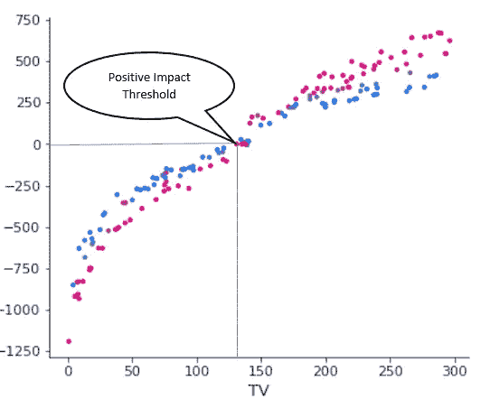

**显示电视广告正面影响阈值的图表:Y 轴是电视广告带来的增量收入(Shapely Value)。x 轴显示电视广告支出。**来源:作者图片

**5。每个渠道的最佳支出**

**现有挑战:**最佳支出取决于不同渠道的营销响应函数，通常这些营销响应函数本质上是非线性的。例如，如果我们不断增加在某个渠道上的支出，那么在某次支出后，增加的积极影响开始减少。增量影响开始饱和然后最终下降的点，就是我们在该渠道上实现最佳支出的点。

**可能的解决方案:**同样，解决方案与第 3 点相同，基于 shapely 值。然而，唯一的区别是，这里我们必须得到一个点，从这个点开始，我们的图变得渐近，或者在某些情况下开始下降。

鉴于所有这些挑战和解决方案，你可能很想知道与匀称的价值观相关的 5 个问题的答案:

1.  **为什么我们一直在使用 GLMs？**
2.  **什么是匀称的价值观？**
3.  **shapely 值如何用于归因？**
4.  **对于复杂的机器学习模型是如何实现的？**
5.  如何解释它，以获得可操作的见解？

接下来，本文将尝试回答上述问题。

# 目录

1.  为什么选择营销分析中的 GLMs？
2.  得体的价值观
3.  匀称的价值观:直觉与实例
4.  使用 Shapely 值的机器学习可解释性
5.  SHAP:营销分析中的一个用例
6.  结束注释
7.  更多阅读和参考资料

# 为什么选择营销分析中的 GLMs？

为了理解这一点，让我们将机器学习模型分为两类:一类是简单模型，另一类是复杂模型。简单模型是那些非常容易解释/说明并且准确性低的模型；然而，复杂的模型本质上是黑箱，几乎不可能解释，而且精确度非常高。

简单模型的例子是线性回归模型和决策树。线性模型很容易解释，例如:借助模型方程中特征权重的大小和符号，我们可以了解特征对输出的影响。在决策树的情况下，我们可以通过分裂(基于基尼系数、信息增益或熵)从根节点向下移动到叶节点，并解析树以容易地理解/解释模型。虽然这些模型是高度可解释的，但是这些模型有几个问题:线性模型不准确，因为它们不能解释特征的非线性行为，而决策树也不准确，并且有过拟合的问题。

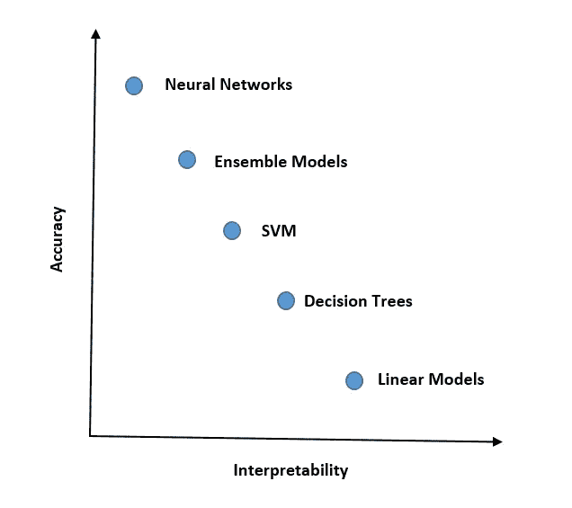

随着模型复杂性和准确性的增加，模型的可解释性降低。来源:作者图片

与决策树相比，随机森林具有高准确性和非常低的方差/过拟合，但是随机森林具有非常大量的树，这些树不能以如此大的数量来解释。因此，这种模型的可解释性是一个大问题。

**如果我有精确的模型，那我为什么要用不太精确的呢？**

首先，我们应该理解正确解释模型输出的能力是非常重要的。它有助于建立利益相关者的信任。我们只是不能对我们的利益相关者说，我们应该实施某个模型，因为它非常准确，具有良好的 AUC/ ROC 数，或者具有非常低的均方误差。利益相关者总是对知道一个模型如何做决策感兴趣。

其次，模型中每个特征的可解释性在营销分析中起着非常重要的作用。我们应该知道所有重要特性影响模型结果的方向和程度。这可以通过 GLMs 容易地实现；然而，在复杂模型的情况下，我们确实获得了特征的相对重要性值，但是这些值不是很有帮助，因为它没有告诉我们关于对模型输出的影响的大小和方向的任何事情。

因此，在营销分析中，线性模型因其易于解释而受到青睐，即使不如复杂模型准确。

为了解决复杂模型的可解释性，有一些技术(LIME、Shapely 等)可以用来创建解释模型，这是一个简单的线性模型，可以非常容易地解释复杂模型。我们将在本文中讨论的方法使用合作博弈论中的 shapely 值来创建解释模型。

> 这里要注意的有趣的事情是，当这些复杂模型与解释模型相结合时，它们不仅在准确性上(很明显)而且在可解释性/可解释性上都优于 GLMs。

接下来，我们将试图通过它的定义和一个例子来发展一种关于匀称的价值观的直觉。然后，我们将继续使用一个非常简单的数据集来实现它的机器学习。

# 得体的价值观

*沙普利值*是由诺贝尔经济学奖获得者罗伊德·S·沙普利开发的，作为一种在团队成员中公平分配团队产出的方法。

我们将讨论 shapely value 的定义，但为了更好地理解这个概念，我建议你先跳到示例部分(Shapely Values:直觉和示例)，然后再回到定义部分。

## 定义

> 形式上，联盟博弈被定义为:给定一个联盟博弈 **G(N，ν)** ，其中 **N** 是博弈中玩家的集合， **ν** 是一个函数(一个特征函数)，当这个特征函数作为 **ν(S)应用于每个子集 S 时，它给每个子集 **S** 分配一个实数。**我们也称ν(S)为*联盟* **的价值。**

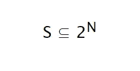

如果有 2 个玩家(A，B)，那么将有 4 个子集{Null，A，B，AB}。因此，对于子集 AB，我们有ν(AB)作为 A 和 b 的联合值。

> ν(S)描述了 S 的成员通过合作可以获得的总期望收益。
> 
> Shapley 值是将总收益分配给参与者的一种方式，假设他们都合作。根据 Shapley 值，给定一个联盟博弈 G(N，ν),玩家**I**得到的金额为

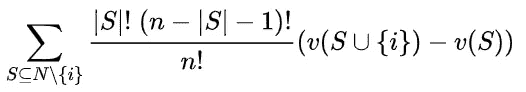

这里， **n** 是 N 个玩家的总数，‘**N \ { I }**’表示不包括玩家‘I’的玩家集合。因此，这里的“S”包括可以从“N \ { 1 }”中的玩家中得到的所有子集。对于每个 S，' **|S|'** 表示每个子集中玩家的数量。

对于 S 中的每个子集，' **|S|！'**表示排列的数目，可以从 S 中的玩家中创建。 **(n-|S|-1)** 表示除玩家 I 之外的剩余玩家的数目。 **(n-|S|-1)！**’代表除了玩家 I 之外的剩余玩家可以形成的排列总数

对于 S 中的每个子集， **|S|的乘积！**和 **(n-|S|-1)！**代表 S 和 S 之外的玩家可以形成的排列总数，使用这个乘法是因为对于这些(|S|！*(n-|S|-1)！)组合数参与人‘I’的边际贡献保持不变。

*注意:公式考虑了排列，因为玩家的顺序在这里起着重要的作用。这里的事件不是独立的；因此，shapely 值计算考虑了所有可能的排列，然后最终取平均值来计算每个玩家的贡献。*

喏， **n！**显示游戏中所有玩家的所有组合所能形成的排列总数，它用于计算可能形成联盟的不同排列的平均贡献。

**这个公式乍一看似乎有点令人生畏，但是一旦我们借助一个例子来理解它，它就会变得非常容易理解。在下一节中，我们将通过一个示例计算来培养直觉。**

*注意:特性函数应满足某些最低属性:*

1.  *单调性:如果联盟中玩家数量增加，收益应该不会减少。*
2.  *超可加性:ν(S ∪ T) ≥ ν(S)+ν(T)，若ν(s∪t)=∅；这意味着大联盟的收益最高。*

# 匀称的价值观:直觉与实例

为了进一步简化和更好地理解 shapely 价值观，我们举一个非常简单的例子，一个虚构的新零售店，它只通过电视广告、平面广告和广播广告进行营销。这些营销媒介的结合有助于零售店获得顾客并产生收入。

零售店的老板观察到这些营销媒体的组合为商店带来了更高的收入，但是*问题在于通过每种营销媒体获得的收入份额的归属*。这些信息非常重要，因为拥有者可以利用这些信息优化营销预算。

这个问题(或游戏)可以借助 shapely 价值观来解决。为了推进这个过程，让我们看看“表 A”的内容，并在上面的 shapely 值的定义和游戏的实际数据之间画出一些平行关系。

“表 A”中的第一列显示了联盟( **S，如上面定义**中所表示的)，其可以使用游戏的参与者(参与者是电视、广播、印刷品)来形成，包括空集(其中没有参与者)。第二列显示对应于第一列中每个联盟的符号。第三列( **ν(S)或定义**中的“联盟价值”)显示了与第一列中给出的每个子集/联盟相对应的收入。

换句话说，当只显示电视广告时，商店获得 3000 美元的收入，当只显示广播广告时，收入为 1000 美元，类似地，当只显示印刷广告时，收入为 1000 美元。然而，当广播或印刷与电视结合时，收入是其个人贡献总和的两倍，当三者结合时，收入为 10，000 美元。

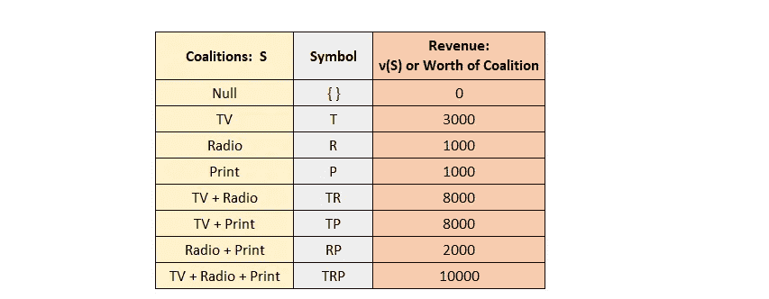

**表 A:显示了联盟和联盟的价值。**来源:作者图片

我们将使用“表 A”中给出的信息，并使用这些值得出每台电视、收音机和印刷品的 shapely 值(平均边际贡献)。

下表 B 显示了电视、广播和印刷品的 shapely 值的计算。

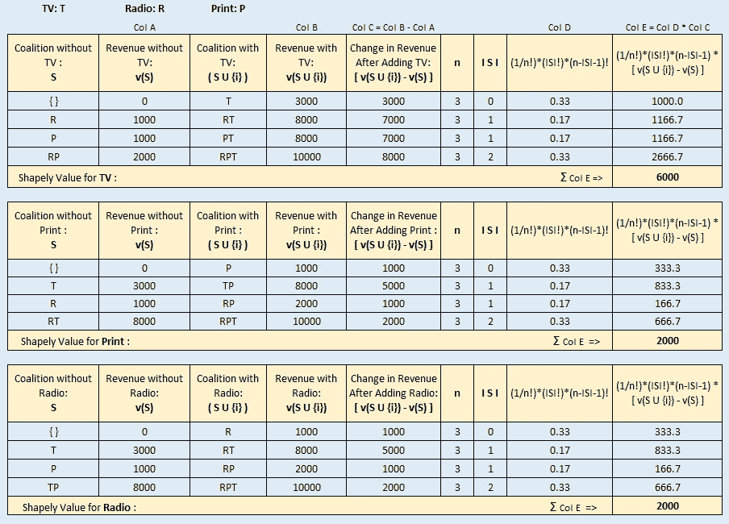

**表 B:显示每种营销媒体的平均边际贡献或匀称价值的计算**。来源:作者图片

让我们看看“表 B”中给出的电视 shapely 值的计算方法。第一栏显示不包括电视的联盟。所以有 **2** 这样的组合包括一个空集 **{}** 。第二列显示没有电视的收入，即 **v(S)** 或没有电视的联盟对子集的价值。

第三列示出了包括电视和在表格中表示为'**S ∨{ I }**'的联盟。第四列显示包括电视在内的联盟收入或价值。第五列显示添加电视后的收入变化或电视的边际贡献，表示为“**v(S ∨{ I })-v(S)**”。第六列显示玩家总数( **n** )。

第七列显示了每个子集 **S** 中的**玩家数量。第八列是对于 S 中子集的边际贡献的出现的可能排列总数**以及进一步除以 **n！对该贡献进行平均。最后一栏是电视机的平均边际贡献总和(6000 美元)。******

类似地，也计算了印刷品(2000 美元)和广播(2000 美元)的平均边际贡献或合理价值。我希望表 A 和表 B 以及它们的计算有助于发展对匀称的价值观的基本理解和直觉。

对 shapely 值的基本理解和直觉很重要，因为本文的下一部分是关于使用 shapely 值的机器学习可解释性。我们将讨论并了解这些匀称的值如何被用于机器学习，特别是在媒体混合建模中。

***注 1:*** *定义联盟的特征功能或“价值”是一个关键步骤，应极其谨慎。在现实世界中，它的定义严重依赖于数据收集的方法。如果您有兴趣阅读在线广告活动归因模型中如何定义特征函数，请参考本文***。**

****注 2:*** *Shapely 值保证解中的唯一性。Shapley 值是唯一满足属性* ***效率*******对称性*******哑元*** *和***的归属方法，这些属性合起来可以认为是一个公平支付的定义。* [*【出处】*](https://christophm.github.io/interpretable-ml-book/shapley.html)****

***效率:所有玩家的 Shapley 值之和等于大联盟的值，这样所有的收益都在玩家之间分配。***

**对称:如果两个玩家对所有可能的联盟贡献相等，那么他们的贡献应该是相同的。**

**哑元:如果玩家 I 没有给任何联盟增加价值，那么玩家 I 将获得零的有形价值，或者换句话说，获得零奖励。**

***可加性:设‘a’是来自游戏‘x’的 shapely 值，‘b’是来自游戏‘y’的 shapely 值。那么游戏‘x+y’的 shapely 值就是‘a+b’。***

***关于公理的更多细节，* [*参见本书的这一节。*](https://christophm.github.io/interpretable-ml-book/shapley.html)**

# **使用 Shapely 值的机器学习可解释性**

**现在，既然我们对 shapely 值有了基本的了解，那么接下来我们应该讨论如何在机器学习解释中使用 shapely 值，然后我们将讨论它在营销分析中的效用。**

**让我们看看合作/联盟博弈论中的 shapely 值计算和它在机器学习中的使用之间的并行性。**

> ***在机器学习模型的情况下，用作生成机器学习模型的数据的特征值的每个实例充当团队成员，并且机器学习模型的预测充当输出或回报。***

**为了更直观地理解它，让我们假设我们已经训练了一个机器学习模型，以根据在不同营销渠道上的花费来预测收入。在数据集中，我们有一个数据实例，其中电视等营销渠道的支出为 2000 美元，广播支出为 500 美元，印刷支出为 800 美元。该数据实例的收入预测值为 10 万美元；然而，来自所有数据实例的收入的平均预测值是$80k(基础值)。*鉴于这种情况，我们想了解并解释电视、广播和印刷品是如何造成基础价值(8 万美元)和预测价值(10 万美元)之间的差异的*。因此，在本例中，电视、广播和印刷品的实例值(支出)充当玩家，任何实例的预测收入充当产出或回报。在这种情况下，每个频道的归属收入可能类似于电视的归属收入为 1 万美元，而广播的归属收入为 6000 美元，印刷品的归属收入为 4000 美元。因此，每个营销渠道的这些归属值有助于我们了解不同营销渠道的支出如何影响我们的增量收入。**

> **在上面的例子中，有两件事情是并行发生的:首先，我们使用了一些机器学习算法进行预测，其次，我们使用 shapely 值来理解数据行/实例的特征行为。因此，对于最准确的预测，我们可以使用任何黑盒复杂模型，同时我们可以使用非常简单的可解释/可解释的 shapely 值来解释特征行为。这种结合解决了复杂模型的可解释性/可解释性的主要问题。**

**现在，我们对 shapely 值如何适应复杂模型的可解释性有了更高层次的理解。因此，现在是时候更深入地研究和理解 shapely 值的算法实现了。**

## **得体的附加解释(SHAP)**

> **SHAP(SHapley Additive explaints)是一种解释任何机器学习模型输出的博弈论方法。它将最优信用分配与使用博弈论及其相关扩展的经典 Shapley 值的本地解释联系起来。[【来源】](https://shap.readthedocs.io/en/latest/)**

**SHAP 是一个解释者模型，它有优化的功能，可以借助 shapely 值来解释任何黑盒模型。为了理解 SHAP，我们首先需要知道解释者模型的概念，然后我们将看到这个解释者模型如何适应任何黑盒模型的可解释性。**

## **解释者模型**

**对于复杂的黑盒模型(如集成模型或深度学习模型)，我们使用不同的模型来解释复杂的模型。这样的模型被称为**解释者模型**，它是原始模型的一个可解释的近似。解释者模型是一个简单的线性加性归因模型，作用于二元变量。**

**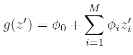**

****讲解器型号****

**这里，g(z′)是一个解释函数。∅o 是基础值，它代表所有输入关闭时的模型输出。∅i 是要素 I 的 shapely 值。z’要么为零(要素不存在时)，要么为一(要素存在时)。m 是简化输入特征的数量。**

**我们还应该注意到，g(z′)的值与原始模型 f(x)的输出相匹配，它也被称为**局部精度**。局部精度也是一个方法获得唯一解所需的三个属性之一。另外两个属性是**缺失和一致性**。这三个属性保证了博弈论中 Shapley 值的唯一性，因为它们适用于机器学习模型预测的局部解释。要了解更多关于这些属性的信息，请阅读[这篇文章。](https://papers.nips.cc/paper/7062-a-unified-approach-to-interpreting-model-predictions.pdf)**

**为简单起见，让我们假设我们有一个数据集，其中有 3 个特征电视、广播、印刷作为预测变量，收入作为目标变量。我们有 100 行/实例的数据，对于每一行/实例，我们将计算 g(z′)。**

**对于特征变量(电视、收音机、印刷品)的任何数据实例“j”:**

**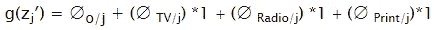**

**g(z′)等于特征值实例的模型预测值。对于电视、广播、印刷品，z’的值是 1，因为它们有一些实例值。如果有这样一个例子，电视花费了$x_tv，广播花费了$x_radio，但是印刷品没有花费，那么在这种情况下我们的 g(z′)将如下。**

**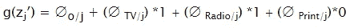**

**由于解释器模型在实例或行级别的特征数据上工作，因此它也被称为预测的**局部解释**。这个解释模型以 shapely 值的形式直接测量局部特征重要性(*也称为* ***SHAP 值*** *用于局部特征归属*)。当我们组合每个预测的局部解释时，我们得到了全局解释的全局模型结构。**

**我们将讨论局部和全局解释，当我们以 python 为例讨论 SHAP 库的用法时，这将变得更加清晰。**

****这个解释器模型如何与黑盒模型一起工作？****

**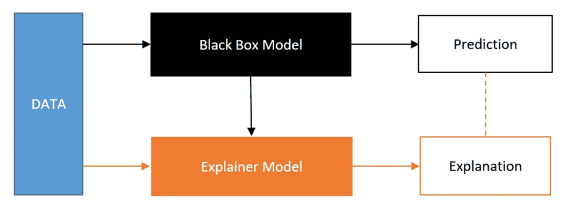**

****流程图显示解释器模型将数据和预测值作为输入，并基于 shapely 值创建解释。**资料来源——瑞典 PyCon:用拉维·辛格的 SHAP 解释 ML 模型**

**这个流程图让我们很好地了解了解释器模型如何与黑盒模型协同工作。**

**利用数据，我们训练黑盒模型，然后将训练好模型与数据一起传递给解释器模型。**

**该黑盒模型然后被用作预测函数，并且连同特征值一起，该函数被用于计算每个特征的特征重要性(SHAP 值)。SHAP 值是使用下述公式计算的，该公式与 shapely 值计算公式非常相似。**

**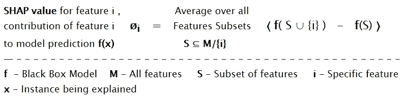**

****计算特征 I 的 SHAP 值的公式，例如 x。**来源:ML 解释能力的 SHAP 值- Adi Watzman**

**我们现在正在计算∅i，它是特征 I 在预测中的贡献，它分三步计算，如下所示。**

1.  **首先，我们创建没有特征 i (表示为 **S** )的所有特征的*子集，然后针对 S 中的每个子集，计算具有( **f(S U {i})** )和没有( **f(S)** )特征 I 的预测值***
2.  **其次，我们减去两个预测( **f(S U {i})-f(S)** )，以获得该特征对于每个子集的边际贡献。**
3.  **最后，我们**取上一步计算的所有边际贡献的平均值**来得到特征 I 对预测的贡献。**

**上述 SHAP 值的计算与合作游戏的 shapely 值的计算非常相似。这里唯一的区别是特征函数被黑盒模型代替，这里我们计算的是特征 I 对预测的贡献，而不是对游戏的贡献。**

**一旦我们获得了所有特征实例的所有 SHAP 值，那么这些 SHAP 值将用于解释模型的局部和全局。**

**要获得关于 SHAP 价值观的详细信息，请阅读《SHAP 价值观》作者斯科特·M·伦德伯格的论文。**

**在下一节中，我们将看到如何局部和全局地解释模型，以获得可操作的见解。**

# **SHAP 价值观:营销分析中的一个用例**

**了解了 SHAP 值后，现在让我们看看如何将它应用到一些营销数据集中。**

**我们的数据集包括电视广告支出、广播广告支出、报纸广告支出等特征，我们的目标变量是每周产生的销售收入。**

**我们可以假设这些数据是从营销组合的时间序列数据中创建的横截面数据。尽管这些数据与真实世界的营销组合数据集相差甚远，但即使如此，它也将为我们提供一个很好的想法，即当我们使用它进行营销组合建模时，SHAP 值如何帮助我们获得可操作的见解。**

## **导入库并读取数据集。**

**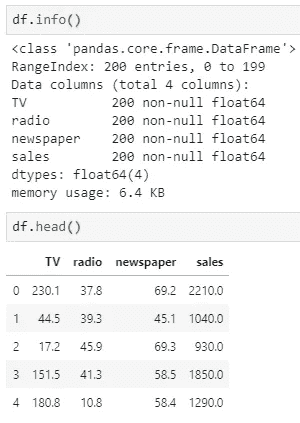**

**这个数据集可以在 [Kaggle 上找到。](https://www.kaggle.com/sazid28/advertising.csv)我对该数据集所做的唯一更改是将“销售”列乘以 100。以便它看起来更接近产生销售收入。**

**我没有关于这个数据集的太多细节，我只是用它来展示 SHAP 值在营销数据集中的应用。**

## **创建训练测试分割，拟合随机森林回归方程，预测并检查误差。**

## ****创建解释器模型，然后从 shapely 值创建一个数据框架****

**有几种方法可以让我们使用 python 中的 **shap 库**创建解释器模型。我们有形状。 **KernelExplainer** ，它是模型不可知的，可以用来解释任何机器学习模型。我们也有 shap。 **TreeExplainer** ，针对基于树的机器学习模型进行了优化。在我们的例子中，我们使用随机森林算法，这是一个基于树的模型，所以我们将使用 TreeExplainer。**

**让我们仔细看看 SHAP 价值数据框架。**

**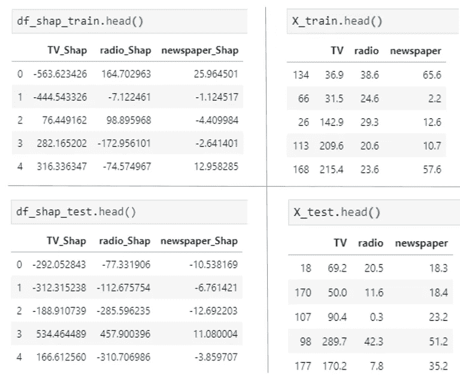**

**我们可以从上面的数据帧中清楚地看到，对应于测试或训练数据帧中的每个特征值，我们在测试和训练数据集的 shap 数据帧(df_shap_train，df_shap_test)中有一个 shap 值。因此，我们可以看到，对于每个要素的每个数据实例，我们都有一个 SHAP 值。**

## **检查基础值**

**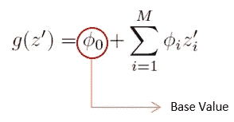**

**来源:作者图片**

**当我们在上面讨论解释者模型时，我们已经讨论了基本值。这个∅o 是基础值。**

***注意:TreeExplainer 的基值是训练数据集上模型输出的平均值。* [*【源* *】*](http://24.	https://github.com/slundberg/shap/issues/352)**

**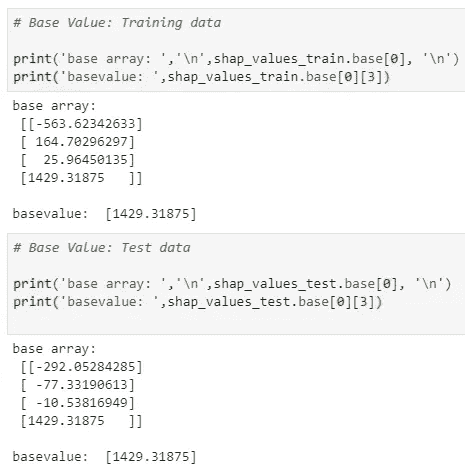**

****基本值****

**方法“base”为我们提供了每个数据实例的数组列表。每个数组的前 3 个元素包含要素的 SHAP 值，第 4 个值是基值。在我们的例子中，基础值是 1429.31875。**

****基础值+ SHAP 值=预测值****

**让我们比较(基础值+ SHAP 值)和预测值的值。**

**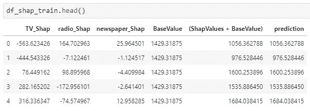**

**从该数据框中，我们可以很容易地看到，每个实例的要素的基础值+ SHAP 值等于预测值。**

****

****我们在讨论解释者模型的时候讨论过这个关系。因此，对于数据帧的每一行，我们可以看到这种关系是如何成立的。****

## **模型解释**

****汇总图****

**汇总图旨在从全局层面解释模型。汇总图有两种类型:第一种显示所有要素的所有 SHAP 值，第二种显示所有要素的聚合值(绝对 SHAP 值的平均值)。我们会看到这些情节，然后讨论如何解读。**

**训练数据的汇总图:**

**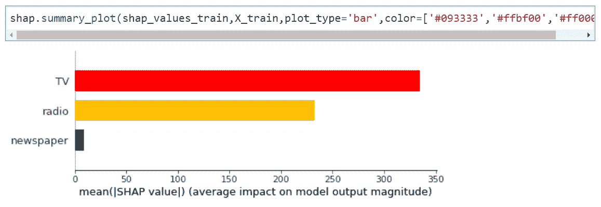**

****显示特征平均绝对 SHAP 值的汇总图****

**上图显示了对应于每个要素的 SHAP 值的汇总视图。它显示了特性的重要性。上面的情节是不言自明的，我不认为它需要任何详细的解释；但是，下面的情节解读起来很有趣。**

**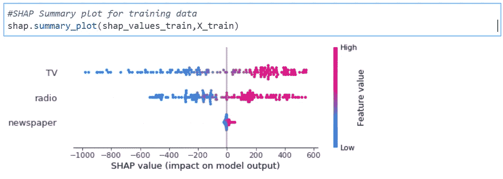**

****显示每个特征的所有 SHAP 值的汇总图****

**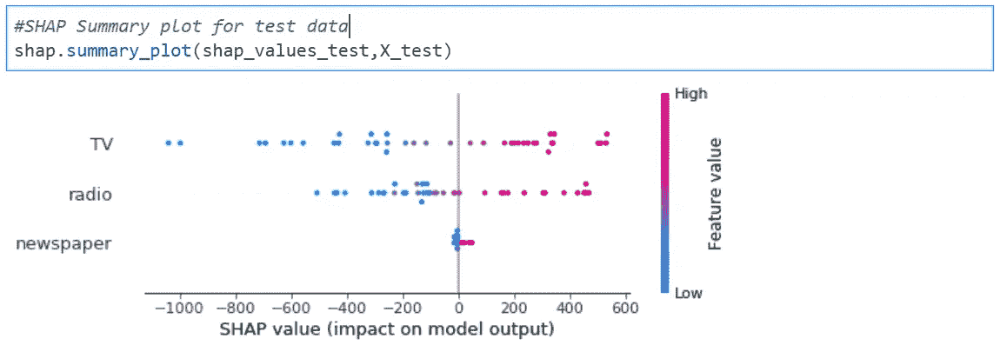**

****显示每个特征的所有 SHAP 值的汇总图****

****显示所有 SHAP 值的汇总图的组成部分:**在 **Y 轴上**我们可以看到电视、广播、报纸。 **X 轴**显示 SHAP 值的范围。每个特征对应的**个体点**就是训练数据集中所有实例的 SHAP 值。右侧的**垂直色阶**显示特征值是偏高还是偏低。此外，要注意的是，**特征以特征的聚合**平均绝对 SHAP 值**的降序排列。****

****释义:****

****哪个功能的影响最大？**由于 TV 具有最高的平均绝对 SHAP 值，因此它对模型输出的影响最大。在我们的例子中，模型输出是销售收入。因此，**电视对销售收入的影响最大。同样，我们也可以说收音机和报纸。因为收音机一直排在第二位，所以它对销售收入的影响第二大。****

****营销渠道的支出对销售收入有何影响？**要回答这个问题，看一下分配给每个特征实例的 SHAP 值的颜色。对于电视来说，剧情右手边(正面)的大部分点都是红色的。这意味着**更高的电视广告支出会带来更高的 SHAP 价值**或增量销售收入。曲线图还显示，对于较低的电视广告支出(蓝色)，我们有负的 SHAP 值。负 SHAP 值表明我们在电视广告上的低支出甚至不能产生与其在该渠道上的支出相等的销售收入。同样，我们可以解释其他渠道的影响。**报纸对销售收入的影响不显著**，这一点从汇总图中可以明显看出。**

****依赖图(无交互作用):****

****我的电视广告和广播广告支出的市场反应如何？**要回答这个问题，我们可以画出单个特征与其 SHAP 值之间的关系图。**

**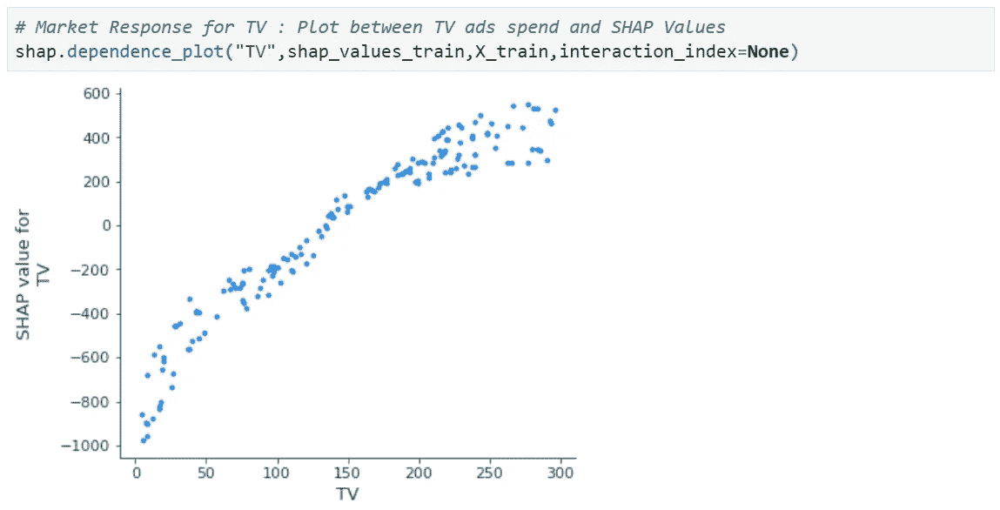**

**广告支出和 SHAP 价值之间的关系是市场对广告支出反应的一个很好的指标。从上面的图中可以明显看出，随着我们增加电视广告支出，我们的 SHAP 价值增加，在特定的电视广告支出后，它开始变得停滞不前。**

**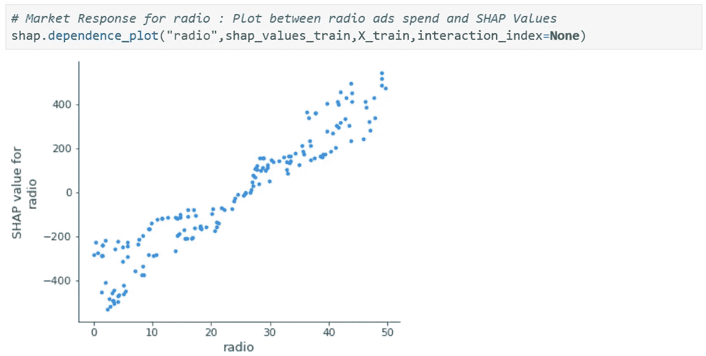**

**同样，我们可以为广播广告绘制图表，观察到随着广播广告支出的增加，SHAP 值也在增加。因为我们的计划中没有任何停滞点，所以我们需要继续增加广播广告的支出，直到我们到达任何停滞点。**

****电视广告的正面影响阈值是多少？**为了回答这个问题，我们将使用电视广告和 SHAP 值之间相同的相关性图，并查看 Y 轴上 SHAP 值为零的地方。对应于该点，我们将在 X 轴上得到一个点，该点是电视广告支出的阈值，从该点开始，电视广告开始对销售收入产生积极影响。**

**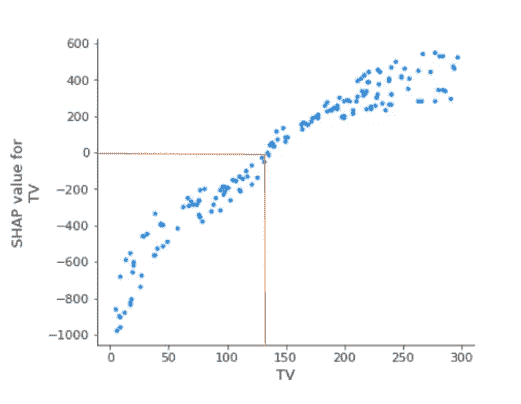**

****电视广告的正面影响阈值。**来源:作者图片**

**类似地，我们可以计算收音机的阈值。**

**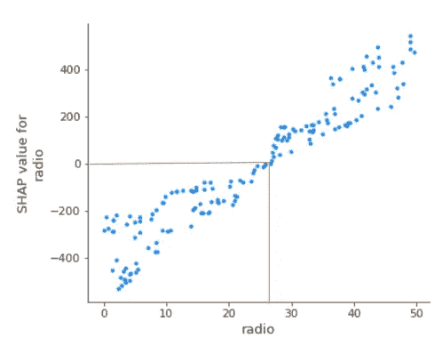**

****广播广告的正面影响阈值**。来源:作者图片**

## ****交互概要图:****

**这个图非常重要，它在一个视图中给出了不同频道之间的交互。**

**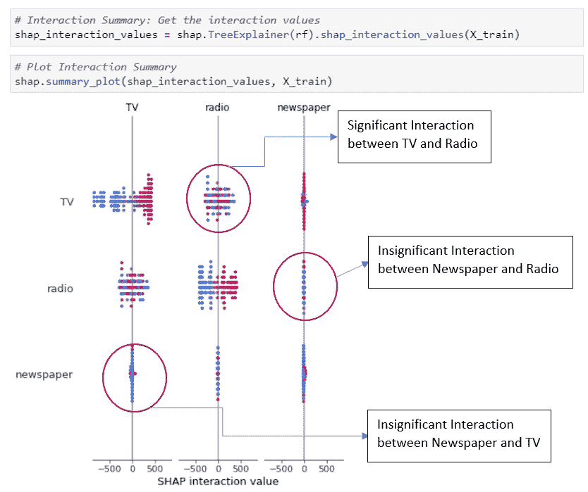**

****互动总结**。来源:作者图片**

**上面的图显示了交互总结。我们可以看到对角线外的相互作用。我已经用红圈标出了可能的相互作用。我们在这里能看到的唯一重要的互动是电视广告和广播广告之间的互动。**

**既然我们现在知道电视广告和广播广告之间的互动是显著的，那么另一个问题应该是了解它们互动的本质。**

****依赖图(有交互作用):****

****电视和广播之间互动的本质是什么？**为了回答这个问题，我们将再次绘制一个依赖图，但这一次是通过交互作用。这是最有趣的情节之一，也有点难以理解。我们先把这个画出来，然后一步一步地去解读它。**

**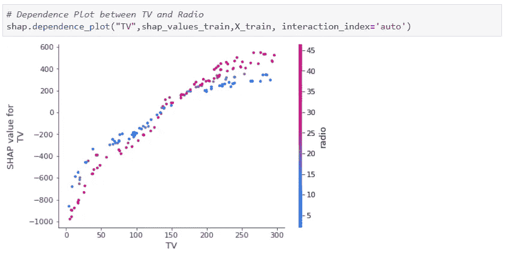**

**每个点代表对应于特定电视广告支出实例的 SHAP 值。y 轴是 SHAP 价值观，X 轴是电视广告支出。颜色基于每个实例的广播广告支出。**

**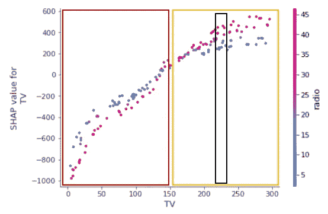**

****对于低于 150 英镑和高于 150 英镑的电视广告支出，电视和广播的互动性质正好相反。**来源:作者图片**

**为了理解这个情节，让我们看看 150 到 300 之间的电视广告花费窗口。在电视广告花费窗口中，SHAP 值范围从较高到较低的 SHAP 值(0 到 600)。在该窗口中，我们假设电视广告支出约为 220 美元(显示为带黑边的矩形框)，对于该特定支出，我们有不同的 SHAP 值，但较高的 SHAP 值也与较高的广播支出相关联。这意味着该窗口的广播广告支出和电视广告支出之间存在积极的互动关系(电视广告支出为 150-300 英镑)。**

**另一方面，在 0 到 150 的电视广告花费之间的电视广告花费窗口中存在负交互作用。**

**到目前为止，我们已经完成了对 SHAP 价值观的全球解读，但现在我们将看到对 SHAP 价值观的一些本地解读。可以使用力图进行局部解释。**

****局部解释力图:****

**局部解释是指实例级别的解释。我们的实例级别是周的粒度。因此，如果我们想解释营销渠道对特定一周的影响，那么我们应该使用这个图。**

****

****为数据实例强制绘图****

**在上图中，我们可以看到蓝色条和红色条显示了电视、广播和报纸的 SHAP 值。条形的长度代表 SHAP 值的大小。条形的颜色显示 SHAP 值的方向(正或负)。正的 SHAP 值为红色，负的为蓝色。预测值以黑色粗体显示。基准值也已经在线图上标出。每个渠道的实例价值或广告花费价值也会显示出来。我们可以将这些值与上一节中计算的值进行比较，如下所示。**

**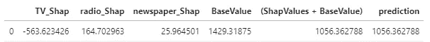**

**TV SHAP 值是负的，并且条的长度在负方向上最长，显示-563.6 值。广播和报纸是积极的，但非常小，震级分别为 164.7 和 25.96。由于电视、广播和报纸的 SHAP 值之和为负，所以一旦将其加到基值上，我们就得到了预测值，在这种情况下，预测值低于基值。总之，本周业绩不佳的主要原因是电视广告支出低。**

**因此，到目前为止，我们已经看到了如何在 SHAP 的帮助下，有效地解释任何黑盒模型。还有许多其他变量，如价格、地区、季节性、趋势、广告库存、市场饱和度等；这可以通过一些特征工程包含在营销数据中。即使有这些额外的变量和更多，我们现在可以使用最准确的模型和 SHAP 来整体地解释它们，并获得大规模的可操作的见解。**

# **结束注释**

**在这篇文章中，我们主要关注属性和媒体混合建模；然而，XAI 在营销和客户分析的其他领域也有巨大的应用，如流失预测、客户保持和决策支持。例如，在客户流失预测的情况下，XAI(本文中讨论的本地解释)可以帮助我们解释特定客户流失的原因或特定客户流失概率高的原因。根据这一解释，我们可以为特定客户量身定制保留策略。此外，XAI 还通过比较业务领域知识和模型行为来帮助我们调试模型。因此，总而言之，XAI 有可能成为分析行业的游戏规则改变者。**

**最后，我希望在读完这篇文章后，你对合作博弈理论中的价值以及它在营销分析中的高层次应用有一点了解。**

**请随时发表评论，提出修改建议，并在评论区分享您的观点。**

# **进一步阅读和参考**

1.  **[https://www.nature.com/articles/s42256-019-0138-9.epdf](https://www.nature.com/articles/s42256-019-0138-9.epdf)**
2.  **[https://papers . nips . cc/paper/7062-a-unified-approach-to-interpretation-model-predictions . pdf](https://papers.nips.cc/paper/7062-a-unified-approach-to-interpreting-model-predictions.pdf)**
3.  **[归因模型和合作博弈理论](https://econpapers.repec.org/paper/urvwpaper/2072_2f290758.htm)**
4.  **[https://github.com/slundberg/shap](https://github.com/slundberg/shap)**
5.  **[https://www . H2O . ai/blog/the-benefits-of-budget-allocation-with-ai-driven-marketing-mix-models/](https://www.h2o.ai/blog/the-benefits-of-budget-allocation-with-ai-driven-marketing-mix-models/)**
6.  **[用于科学和医学的可解释人工智能](https://youtu.be/B-c8tIgchu0)**
7.  **https://edden-gerber.github.io/shapley-part-1/**
8.  **[https://christophm . github . io/interpretable-ml-book/Shapley . html](https://christophm.github.io/interpretable-ml-book/shapley.html)**
9.  **[https://shap . readthe docs . io/en/latest/examples . html # tree-explainer](https://shap.readthedocs.io/en/latest/examples.html#tree-explainer)**
10.  **[https://github.com/slundberg/shap/issues/352](https://github.com/slundberg/shap/issues/352)* ***
11.  **[PyData Tel Aviv Meetup:ML 可解释性的 SHAP 值— Adi Watzman](https://youtu.be/0yXtdkIL3Xk)**
12.  **[瑞典 PyCon:理解 ML 黑箱:使用 SHAP 解释 ML 模型](https://youtu.be/Wl9L592ycc4)**
13.  **[https://medium . com/@ Gabriel Tseng/interpreting-complex-models-with-shap-values-1c 187 db 6 EC 83](https://medium.com/@gabrieltseng/interpreting-complex-models-with-shap-values-1c187db6ec83)**
14.  **[https://towards data science . com/explain-your-model-with-the-shap-values-BC 36 AAC 4 de 3d](/explain-your-model-with-the-shap-values-bc36aac4de3d)**