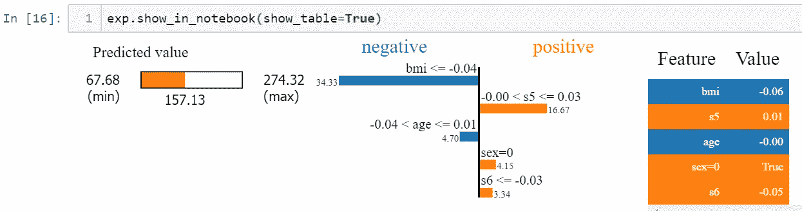

# 可解释的人工智能:机器学习模型的可解释性

> 原文：<https://towardsdatascience.com/explainable-ai-interpretability-of-machine-learning-models-412840d58f40?source=collection_archive---------28----------------------->

## 使用石灰的模型可解释性

## 你能信任你的机器学习模型吗？


安迪·凯利在 [Unsplash](https://unsplash.com?utm_source=medium&utm_medium=referral) 上的照片

W 我们为什么要盲目信任机器学习模型？如果我们能够更好地了解模型预测并改进我们的决策，这不是很好吗？随着莱姆和 SHAP 等可解释的人工智能技术的出现，这不再是一个挑战。如今，机器学习模型无处不在，比以往任何时候都更成为我们生活的一部分。这些模型本质上通常是一个黑箱，我们很难评估模型的行为。从内置对话代理的智能扬声器到个性化推荐系统，我们每天都在使用它们，但我们了解它们为什么以某种方式运行吗？鉴于他们能够影响我们的决定，我们应该能够信任他们，这是至关重要的。可解释的人工智能系统帮助我们理解这些模型的内部工作原理。

**那么，什么是可解释的人工智能呢？**

可解释的人工智能可以总结为理解 ML 模型预测的过程。中心思想是使模型尽可能具有可解释性，这在本质上有助于测试其可靠性和特征的因果关系。概括地说，可解释性有两个方面:

1.  可解释性(为什么会这样？)
2.  透明度(它是如何工作的？)

通常，可解释的人工智能系统提供对模型输入特征的评估，并识别作为模型驱动力的特征。它给了我们一种控制感，因为我们可以决定是否可以依赖这些模型的预测。例如，如果流感识别模型考虑了体温和咳嗽等比其他症状更重要的特征，我们可能会更信任它。

既然你有了可解释系统的概念，我们如何解释模型预测呢？

做那件事有不同的方法。酸橙就是其中之一。让我们挤压它。

> LIME 代表:
> **L** ocal:在被解释的预测的邻域内局部近似，
> **I**interpretable:产生的解释是人类可读的，
> **M** 模型不可知的:适用于任何模型，如 SVM、神经网络等**E**x 解释:提供模型预测的解释。(模型行为的局部线性解释)


[梁杰森](https://unsplash.com/@ninjason?utm_source=medium&utm_medium=referral)在 [Unsplash](https://unsplash.com?utm_source=medium&utm_medium=referral) 上的照片

Lime 可用于获得对模型预测的更多见解，如解释模型为何针对单个观察做出特定决策。在不同型号之间进行选择时，它也非常有用。Lime 背后的中心思想是，它通过干扰不同的特征在被解释的实例附近进行局部解释，而不是在整个模型级别产生解释。这是通过在局部分散的、由噪声引起的数据集上拟合稀疏模型来实现的。这有助于将非线性问题转化为线性问题。然后将模型中系数最大的指标变量作为得分的驱动因素返回。

## 装置

你可以简单地 pip 安装它或者克隆 Github [repo](https://github.com/marcotcr/lime) :

```
pip install limepip install . (Git version)
```

## 履行

我们将使用 Lime 来解释 sci-kit learn 中内置的糖尿病数据集上的随机森林回归模型的预测。这篇文章假设你已经掌握了一些 Python 和机器学习的知识。为了简单起见，我们不会涵盖我们通常在模型构建管道中遵循的所有步骤，如可视化和预处理。对于模型构建位，你可以在这里克隆回购[。](https://github.com/ShashvatGuptaDS/ExplainableAI)

所以，让我们切入正题，看看如何用石灰来解释某个实例。

理解 Lime 预测中的模型行为主要包括两个步骤:

*   **初始化一个解释器**
*   **调用*解释 _ 实例***

解释模型预测的第一步是创建一个解释器。我们可以使用 Lime 表格解释器，它是用于表格数据的主要解释器。Lime 使用局部性缩放和生成新数据，并计算统计数据，如数字数据的平均值和分类数据的频率，因此我们需要将训练数据作为参数传递。

石灰解释器

在第二步中，我们只需要为需要解释的实例调用 explain_instance。如果您希望了解不同的实例，可以使用不同的' *i'* 。

最后，我们可以使用 explainer 来显示 Jupyter 笔记本中特定预测的解释。



解释实例的 Lime 输出(图片由作者提供)

当我们使模型变得复杂时，它的可解释性会降低，反之亦然。一个建议是注意模型复杂性和可解释性之间的权衡。

您可以选择将您的解释保存为 HTML 文件，这样更易于共享。

```
exp.save_to_file(“explanation.html”)
```

## 可供选择的事物

*   Eli 5——模型可解释性的另一个库。我用它来处理文本数据，效果很好。你可以在这里阅读更多关于 Eli5 [的内容。](https://eli5.readthedocs.io/en/latest/tutorials/)
*   SHAP——Shapley Additive Explanations 顾名思义，告诉您它是如何以相加的方式获得实例的分数的。SHAP 不仅有适用于任何模型的通用解释器，还有适用于基于树的模型的树解释器。理论上保证一致性，比石灰慢。此外，探索所有可能的特征组合的计算需求在 SHAP 呈指数增长。

# 结论

Lime 提供了人类可读的解释，并且是分析每个特征的贡献的快速方法，因此有助于更好地了解机器学习模型行为。一旦我们理解了模型以某种方式预测的原因，我们就可以与模型建立信任，这对于与机器学习的交互来说是至关重要的。在这篇文章中，我们使用了一个随机森林回归模型来解释它对一个特定实例的预测。

有趣的是，Lime 还支持图像、文本数据和分类问题的解释器。您可以在更复杂的模型(如 Xgboost & LightGBM)中进一步探索 Lime 解释，并比较预测。点击这里阅读更多关于酸橙[的内容。此外，这里有一个有趣的](https://arxiv.org/pdf/1602.04938.pdf)[阅读](https://analyticsindiamag.com/8-explainable-ai-frameworks-driving-a-new-paradigm-for-transparency-in-ai/)关于人工智能透明度和可解释性的不同工具。

我很想在下面的评论中听到你对石灰、机器学习和可解释的人工智能的想法。如果你觉得这很有用，并且知道任何你认为会从中受益的人，请随时发送给他们。