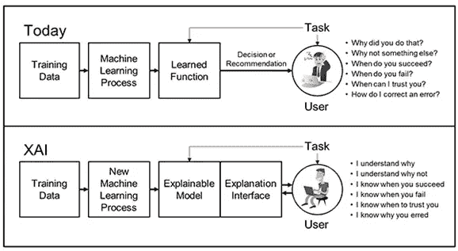
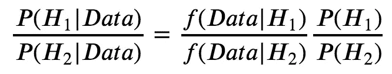
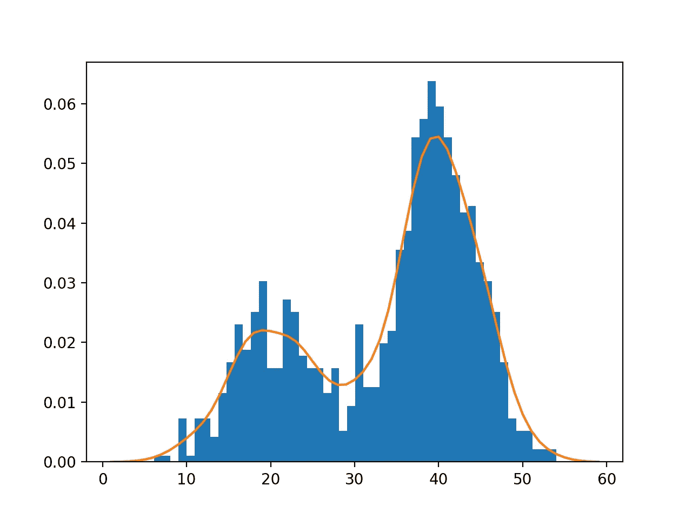

# 可解释人工智能:健康数据用例

> 原文：<https://towardsdatascience.com/explainable-ai-use-case-1-bc2abd7b197a?source=collection_archive---------54----------------------->



图片来源:Research @ Infosys Labs (Infosys 博客)

*免责声明:为了更好地理解这篇文章的背景，阅读我之前关于可解释人工智能的文章*[](https://medium.com/swlh/explainable-ai-where-supervised-learning-can-falter-edf2b562845a)**会很有帮助。如果您以前用 Python 编写过逻辑回归代码，这也会很有帮助，因为我在代码中提到过它。**

*在我之前关于可解释人工智能的文章中，我提到过高级监督学习算法，如逻辑回归和神经网络(及其变体，如卷积神经网络和递归神经网络)，很难解释。特别是神经网络，深度学习的一部分，可以产生惊人的准确性，但是程序员和用户对算法如何产生分类知之甚少。部分原因是神经网络和逻辑回归努力创建与其预测的直接关系，但这是有代价的:*可解释性*。*

*我之前提到过，理解分类问题的另一种方式是使用贝叶斯定理来推断我们的两个假设——H1(类别标签 1)和 H2(类别标签 0)。作为参考，下面是等式:*

**

*两个假设的贝叶斯推断*

*在今天的用例中，我将把这个推理框架应用于加州大学欧文分校的机器学习知识库中的肝细胞癌数据集。该数据集包括在马德里大学接受治疗的 165 名患者，以及每个患者的近 50 个个体特征/测量值。类别标签表明患者是否从癌症中存活(1)或是否不幸不能存活(0)。*

*我们开始吧！首先，我们需要导入相关的包。随着代码的进展，我们将导入更多的库。由于数据集和代码较长，这是[我的 GitHub repo，完整代码](https://github.com/galaxyenby/bayesian-inference/blob/master/Carcinoma%20Prediction%20with%20Generative%20Modeling.ipynb)。我将在这里张贴片段。*

```
*# First, we read in the file and import packages
import numpy as np
import pandas as pd
from sklearn.linear_model import LogisticRegression
import matplotlib.pyplot as plt
import seaborn as sns
from sklearn.metrics import confusion_matrix as cmatrix hcc_data = pd.read_csv('/Users/rabeya/Carcinoma_Classification_data/hcc.csv')*
```

*加载到 HCC 数据集中。*

*接下来，在我们加载数据后，我们使用 Miriam Santos 在 HCC 数据集上的原始论文中的算法，利用“HEOM-distance”填充所有标有“？”的缺失值。这种“HEOM-distance”算法采用每个患者记录，并根据与其“最接近”的患者记录来填充缺失值；正如你所猜测的，“近”的概念是基于超远距离的。因为这个算法有很多行，所以我把你引向我的 Github repo。填充的数据集被命名为 *new_df* 。*

*一旦我填充完缺失的值，我需要平衡标签。标签不平衡是机器学习中的一个大问题，由于收集中的偏差或缺失值，标签 1 与标签 2 的记录比率可能不是 50%:50%。事实上，在 HCC 数据集中，患者生命记录与患者死亡记录的比率是 62%:38%，因此我们需要平衡这些记录。一种方法被称为“人工过采样”，我们为更小的类人工创建新的数据记录，这些记录与原始记录接近。这种过采样方法叫做“SMOTE”，代码如下。*

```
***from** **imblearn.over_sampling** **import** SMOTE
sme = SMOTE(random_state=10)

*#features*
features = new_df.columns
*# transform the dataset*
X_matrix = new_df[features[:-1]].values
y_matrix = new_df[features[-1]].values
X_trans, y_trans = sme.fit_resample(X_matrix, y_matrix)transformed_df = pd.DataFrame(X_trans, columns=features[:-1])
transformed_df['Class'] = y_trans*
```

*现在我们已经转换了数据集并平衡了类(有 102 个病人-生命和病人-死亡样本)，我们准备好构建我们的生成分类器了！(我们的平衡 HCC 数据集在接下来的部分中被称为*转换 _df* 。)*

*在创建任何模型之前，我们减少了数据集中的要素数量。最初的一个有 49 个单独的特征/对于每个病人，那是太多要考虑的了！因此，相反，我们使用统计学中所谓的 [*互信息*](https://scikit-learn.org/stable/modules/generated/sklearn.feature_selection.mutual_info_classif.html#r50b872b699c4-1) 将它削减到“最佳”10 个特征。*

*首先，我将逻辑回归作为测试模型案例应用于训练和测试数据。我将训练集和测试集分成:65%给训练集，35%给测试集。这不是标准的，但是我这样做了，因为我们的整个集合只有 200 条记录，所以必须节约使用数据。*

```
***from** **sklearn.feature_selection** **import** SelectKBest
**from** **sklearn.feature_selection** **import** mutual_info_classifK = 10
selector = SelectKBest(mutual_info_classif, k=K)
X = transformed_df.iloc[:, :-1]
y = transformed_df.iloc[:, -1]
X_reduced = selector.fit_transform(X,y)*# use logistic regression as a test case model*
logreg = LogisticRegression(C=1.5, max_iter=1000, solver='lbfgs')
logreg.fit(X_train, y_train)*
```

*对看不见的数据使用逻辑回归，预测准确度是:真阳性-36%；真阴性——30%；假阳性——22%；假阴性——12%。逻辑回归在预测如此小的数据集方面做得不太好，22%的 FPR 用于未来预测是危险的，因为五分之一的未来新 HCC 患者将被*预测*存活，而他们的*实际*存活机会将很低。这种糟糕的预测能力并不令人惊讶，因为我们只给出了大约 130 条记录供模型训练。*

*这里有许多解决方案:1)收集更多的数据并将其转储，但 HCC 的数据来之不易。2)使用更多的参数/权重，例如用于小数据的神经网络模型。但是正如我们之前讨论的，神经网络很难解释。我采取的解决方案是完全改变预测的视角，并使用生成模型来代替。正如我提到的，生成模型可以帮助我们计算*可能的*数据在属于不同类别的假设下如何指向，这种*概率视角*对于小数据尤其有用。*

**

*密度估计模型。图片来源:[machinelearningmastery.com](https://machinelearningmastery.com/probability-density-estimation/)*

*最后，我们可以创建我们的生成模型。第一种类型称为 [*高斯混合模型*](https://www.youtube.com/watch?v=W0XECm4-3LI) (GMM)，其中一堆单独的高斯模型(称为“组件”)被捆绑在一起，以创建一个大的生成模型。我们根据患者是死于癌症还是幸存来分离我们的训练数据，然后拟合模型。为了适应模型，我们不能只选择一个#的组件。相反，我训练了 64 个模型(计算机可以比你想象的更快地执行这个操作)，并使用*期望最大化* (EM)算法优化了这些模型。EM 算法已有几十年的历史，但经常用于寻找高斯混合。*

**

*高斯混合(EM)在工作。图片来源:[维基百科](https://en.wikipedia.org/wiki/Expectation%E2%80%93maximization_algorithm)*

*然后，我根据一种叫做 [*阿凯克信息标准* (AIC)](https://en.wikipedia.org/wiki/Akaike_information_criterion) 的统计方法，挑选出了最佳数字 22 和 21。它基本上比较了密度模型的精确程度和复杂程度，并试图在模型过拟合和欠拟合之间寻找平衡。*

```
***from** **sklearn.mixture** **import** GaussianMixture **as** GMM
M = 64
*# so M models to train*
n_components = np.arange(2, M, 1)

life_models = [GMM(n, covariance_type='full', random_state=5) **for** n **in** n_components]death_models = [GMM(n, covariance_type='full', random_state=7) **for** n **in** n_components]life_aics = [model.fit(X_train_life).aic(X_train_life) **for** model **in** life_models]death_aics = [model.fit(X_train_death).aic(X_train_death) **for** model **in** death_models]gmm_life = GMM(22, covariance_type='tied',tol=1e-4, random_state=5)
gmm_life.fit(X_train_life)gmm_death = GMM(21, covariance_type='tied',tol=1e-4, random_state=7)
gmm_death.fit(X_train_death)*
```

*对看不见的数据使用高斯混合模型的准确度是:35%真阴性、12%假阳性、15%假阴性和 37%真阳性。与逻辑回归相比，假阳性率有了多大的提高！我们实际上可以通过使用类固醇上的高斯混合模型的变体在假阳性率上做得更好: [*核密度估计* (KDE)](https://www.youtube.com/watch?v=W0XECm4-3LI) 。这听起来肯定像是人工智能科幻小说中的东西，但它的工作原理是一样的！*

```
***from** **sklearn.neighbors** **import** KernelDensitykde_life = KernelDensity(bandwidth=0.1).fit(X_train_life)
kde_death = KernelDensity(bandwidth=0.1).fit(X_train_death)

log_density_life = kde_life.score_samples(X_test)
log_density_death = kde_death.score_samples(X_test)*
```

*当我们对看不见的数据使用 KDE 方法时，我们的预测精度是:44%真阴性，8%假阳性，2%假阴性和 46%真阳性。只在 130 张唱片上接受过训练的 KDE 在预测能力上做得非常出色。(顺便说一句，GMM 和 KDE 需要记住的是，让密度模型过度适应训练数据。我将在以后的文章中探讨这个问题。)*

*好的，这一切都很好，但是我们如何*解释*密度模型呢？可解释性很重要。好吧，如果来自测试集的一个新的数据点病人 Y 进来，机器可以这样解释它的预测:“因为类别标签(1 =生存，0 =死亡)是平衡的，我的先验比率等于 1。因此，我的决定只基于我根据之前的 130 条训练记录计算出的密度似然模型。根据我的生存可能性模型，如果我假设 Y 属于 1 类，它的对数可能性是 p1。根据我的死亡可能性模型，如果我假设 Y 属于 0 类，它的对数可能性是 p2。因为我计算出，比如说，(p1-p2) > 0，这意味着病人 Y 的数据记录被生成的概率——假设它属于类 1——大于类 0。因此，我根据他们的 10 个‘最佳’计算特征对癌症存活患者 Y 进行分类。”这是代码的实际样子:*

```
*delta = np.subtract(log_density_life, log_density_death)
# this is the difference in likelihoods under the hypothesis  assumptions (H1: label=1, H2: label=0)kde_predictions = np.asarray([1 **if** x > 0 **else** 0 **for** x **in** delta])*
```

*当然，机器不能和我们说话，但我相信这就是我们如何理解机器学习模型的决策。看看这比使用神经网络或逻辑回归更有解释力？*

*但不仅仅如此。假设我们有一个更大的像这样的不平衡的数据集。我们可以在贝叶斯推理公式的*先验比*中考虑生存和死亡标签的比例。如果我们计算 sam 似然密度模型，并发现对新测试点的预测是错误的，我们可以*潜在地* *修改模型*。要么我们可以修改我们的类标签的先验概率，要么我们可以修改似然模型。怎么会？通过在*可能性模型本身上使用贝叶斯框架。例如，这可以用概率编程语言如 PYMC3 来动态完成。**

*我希望这些用于医疗保健数据的结果提供了一种途径，不仅可以将密度估计用于聚类客户模式，还可以像我们在这个项目中所做的那样，将它们用于预测能力。我将指出，实验者没有考虑的一个特征是种族/民族。我可以理解，因为数据集是在西班牙收集的，所以种族会相当单一。但是在数据收集中忽略种族，不批判性地思考其他因素，如社会经济阶层和获得医疗保健的机会，是一件非常冒险和危险的事情。但是希望我能找到更多的 HCC 数据集(或类似的),这些数据集也考虑了这些因素。*

*一会儿见！:)*