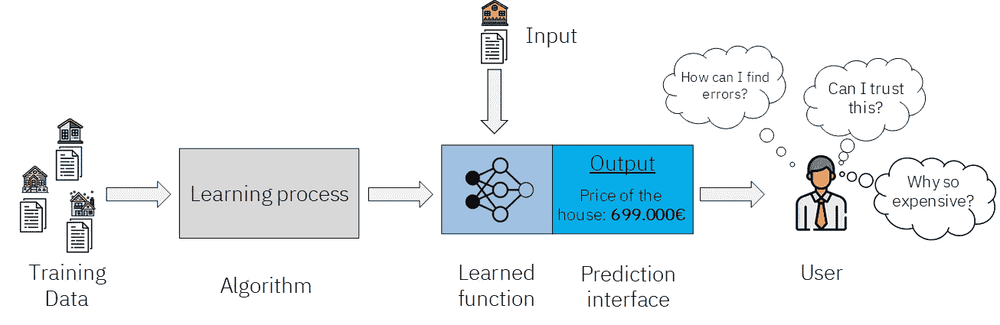
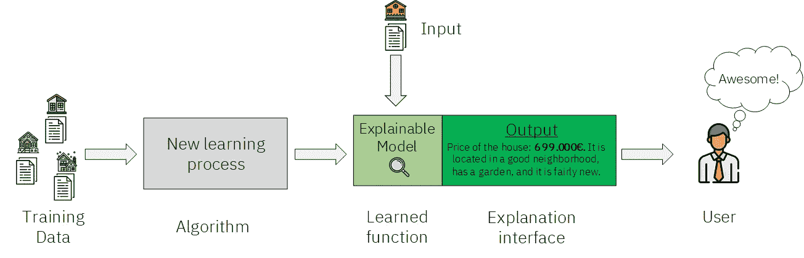
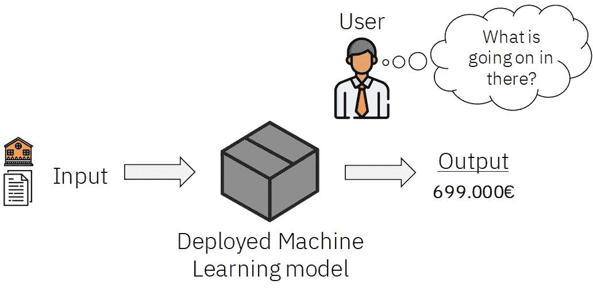
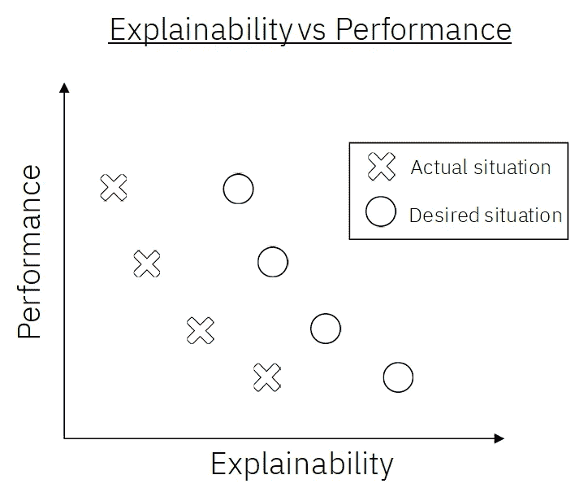
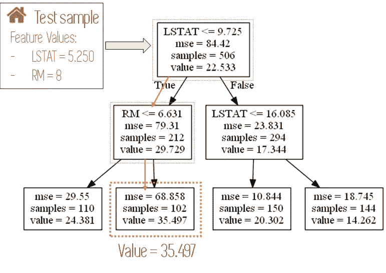
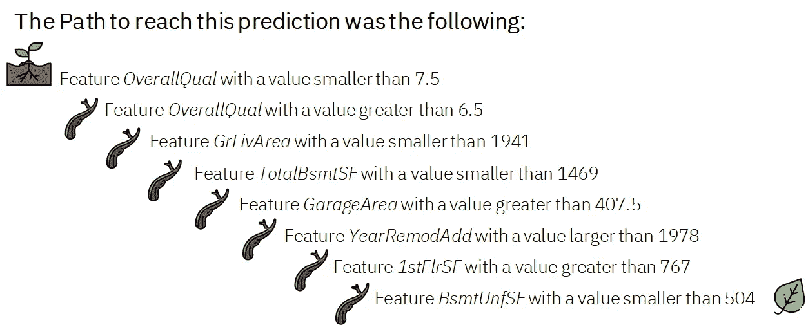
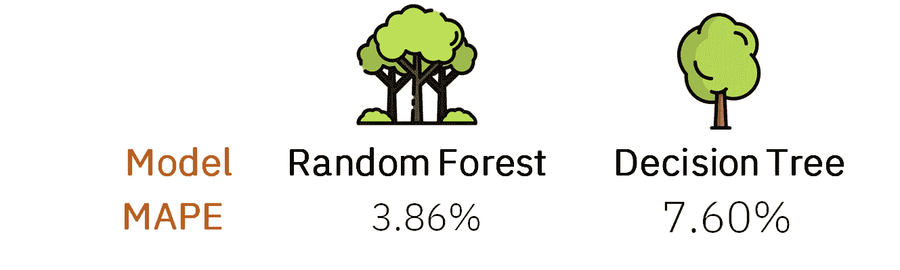
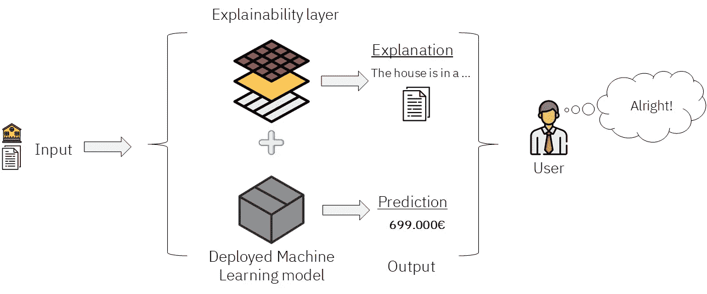
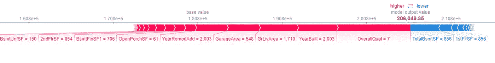

# 可解释的人工智能

> 原文：<https://towardsdatascience.com/explainable-artificial-intelligence-14944563cc79?source=collection_archive---------8----------------------->

## 发现机器学习和人工智能的最大趋势之一


图片来自 [Unsplash](https://unsplash.com/photos/Jx9TYoTKCKo)

***可讲解 AI*** *是机器学习领域最热门的话题之一。机器学习模型通常被认为是不可能解释的黑盒。最终，这些模型被需要信任它们、理解它们所犯的错误以及它们的预测背后的推理的人类所使用。在这篇文章中，我们将探索什么是可解释的人工智能，为什么它很重要，并看看我们如何使用真实数据实现它的一些例子。*

*在我们开始之前，这里有一些额外的资源可以让你的机器学习生涯突飞猛进*

```
*Awesome Machine Learning Resources:**- For* ***learning resources*** *go to* [***How to Learn Machine Learning***](https://howtolearnmachinelearning.com/books/machine-learning-books/)*! 
- For* ***professional******resources*** *(jobs, events, skill tests) go to* [***AIgents.co — A career community for Data Scientists & Machine Learning Engineers***](https://aigents.co/)***.***
```

[](https://z-ai.medium.com/subscribe) [## 订阅我的专属列表！

### 订阅我的专属列表！获得所有你喜欢的新鲜文章<3! By signing up, you will create a Medium…

z-ai.medium.com](https://z-ai.medium.com/subscribe) 

*好了，让我们开始吧*😋

# 那么，什么是可解释的人工智能？

机器学习工作流的当前结构，从培训到在生产环境中的部署，大致如下:



图 1: ML 工作流程。(自制图片。来自[平面图标](https://www.flaticon.com/)的图标)

**这个图像的解释如下:**我们通过特定的学习过程，使用一些数据来训练一个模型。这个学习过程会产生一个已学习的函数，然后可以输入该函数，并在特定的界面中输出预测，这是最终用户看到的并与之交互的内容。

在前面的例子中，我们使用住房数据来训练一个模型，它最终是一个人工神经网络，但也可以是任何其他东西:从决策树，到 SVM 或 boosting 模型。

在学习了这个函数之后，我们可以给它输入新的输入，在我们的例子中是新房子，它返回关于输入房子价格的预测。最后，一个**用户**，在这个例子中是一个真实的公司的所有者，看到输出并做出决定或开始某些行动。

正如我们从用户的疑虑中看到的，这里的问题是**预测没有正当理由**。

在部署任何机器学习模型之前，我们或多或少会意识到它的错误(因为这是我们的学习过程试图减少的)，但这只能给我们损失规模中的某个数字，或者量化数据中的标签和部署之前预测的标签之间的某个数字距离。我们能相信这个错误高于一切吗？

我们的模型可以有很低的误差，仍然有一定的偏差，或者时不时做出耐人寻味的预测。从商业角度来看，理解这些奇怪的预测可能是一个好主意，因为它们可能会告诉我们一些我们不知道的事情。它们也可能意味着模型有问题，需要更换。

即使预测没有实际问题，我们也希望**理解为什么模型会说出它所说的话。**你可以在测试数据上得到很好的结果，并得到相当准确的预测，但有时这还不够。

所有这些之前的问题是让可解释的人工智能如此受欢迎的原因。我们将通过查看它在前面的例子中的位置来了解它是什么。



图 2:可解释的人工智能融入到工作流程中。(自制图片。来自[平面图标](https://www.flaticon.com/)的图标

**让我们看看这里发生了什么**。这一次，我们使用了一个新的不同的学习过程来学习一个与可解释模型相关的函数。这意味着这个函数不仅能给我们一个预测，还能解释为什么它会做出这个预测。新的解释界面显示了额外的信息，可以让我们的用户对为什么做出这样的预测有所了解。在本文的后面，我们将通过一些真实的例子来看看这是如何实现的。

# 为什么可解释的人工智能如此重要？

当我们用我们应用变换的大量参数训练 ai 时，我们最终将预处理和模型构建的整个过程变成了非常难以解释的**黑盒模型**。也许构建模型的数据科学家或机器学习工程师知道数据经历的转换和操作，但对于最终用户来说，这些完全是神奇的。



图 3:被视为黑盒的机器学习模型。(自制图片。来自[平面图标](https://www.flaticon.com/)的图标)

他只是给模型一个输入，然后得到一个他应该相信的预测。在不知道引擎盖下发生了什么，也没有任何进一步解释的情况下，这可能吗？

自从人工智能的主流采用之路开始以来，用**黑盒方法**训练机器学习模型是没问题的——只要它们给我们带来好的结果，如果我们无法解释它们也没关系。现在，焦点正慢慢转向这些模型的透明性和可解释性。**我们想知道他们为什么会得出他们输出的预测**。这种转变的到来有多种原因:

1.  理解当机器学习模型做出预测时会发生什么可以帮助**加速这些系统的广泛采用**。新技术总是需要时间变得成熟，但如果它们被理解了，肯定会有所帮助。
2.  它让用户变得越来越适应这项技术，并去除了似乎包围着人工智能的神奇面纱。让**用户信任他们正在使用的系统**是最重要的。
3.  对于保险或银行等行业，有时会有公司层面甚至**的法律限制**，这使得这些公司使用的模型必须是可解释的。
4.  在其他一些**关键领域**、**比如医学**，人工智能可以产生如此巨大的影响，并令人惊讶地改善我们的生活质量，最基本的是，所使用的模型可以毫无疑问地被信任。拥有一个有时会输出奇怪预测的网飞推荐系统可能不会产生很大的影响，但在医疗诊断的情况下，不寻常的预测可能是致命的。提供比预测本身更多的信息允许用户决定他们是否信任预测。
5.  可解释的模型可以帮助他们的用户更好地利用这种模型给出的输出，使他们在商业/研究或决策中有更大的影响力。我们应该永远记住，像任何其他技术一样，人工智能的目标是提高我们的生活质量，因此我们从中获得的好处越多越好。

原因肯定不止这 5 个；可解释的人工智能的主题是广泛而多样的，但在看到为什么拥有可解释的机器学习模型是如此令人向往之后，**让我们看看通常会发生什么。**

一般来说，正常的心态是上面提到的那种——我们想要结果，所以我们的机器学习模型必须有很好的性能。一些机器学习模型通常比其他模型表现更好，同时也具有不同的可解释性。

随机森林模型通常优于决策树，但前者比后者更难解释。下图显示了这种趋势:**随着绩效的提高，可解释性趋于降低。**我们想要的是从 X 到 O，也就是说，在不太损害模型性能的情况下增加可解释性。



图 4:不同机器学习模型的可解释性与性能。实际和期望的情况。(自制图片)

最后，让我们来看一些例子，看看我们如何构建一个可解释的人工智能系统，以及我们将从中获得的信息。

# 可解释人工智能的例子

如前所述，机器学习模型的可解释性是其固有的。虽然人工神经网络很难解释，但[决策树](/decision-trees-explained-3ec41632ceb6)允许简单的解释。然而，神经网络要强大得多。

如果我们想要实现可解释的人工智能，我们可以做几件事:

1.  **使用一个可解释的模型**，比如决策树。
2.  **在一个更难解释的模型上增加一层可解释性**，就像一个随机森林。

让我们看一个使用住房数据集的例子，继续上面例子的主题。数据集将如下:
[房价:来自 Kaggle 的高级回归技术数据集。](https://www.kaggle.com/c/house-prices-advanced-regression-techniques/data)

其描述如下:

> 有 79 个解释变量描述了(几乎)爱荷华州埃姆斯住宅的每个方面，这个比赛挑战你预测每个家庭的最终价格。

由于这篇文章的目标是详细说明如何应用可解释的人工智能，**这些数据已经大大简化了**，我们只保留了数字变量，进行了非常简单的预处理步骤，模型使用了默认的超参数，没有进一步优化。

## 1)使用决策树

正如我们之前提到的，**决策树是最容易解释机器学习模型的一种**。实现这一点的方法非常简单，如果我们知道决策树是如何构建的，那就更好理解了:通过递归将数据分割成越来越小的组，这些组最终到达我们的 leave 节点。

如果你不确定决策树是如何工作的，你可以在这里了解它们[。](/decision-trees-explained-3ec41632ceb6)

当使用决策树进行预测时，从根节点开始，直到到达离开节点，(并经过必要的中间节点)，在每个节点评估数据的某个变量，我们的数据样本根据它为该变量提供的值向左或向右移动。

下图描述了一个这样的例子，在一些住房数据上构建的树只使用了两个变量。首先，它查看变量 *LSTAT* 的值，然后查看 *RM，*的值，以在最终的 leave 节点中结束。



图 5:输入数据样本如何通过只有两个特征的决策树的例子。(自制数字)

***注:*** *这是为另一个项目构建的随机树，不是为我们的实际数据。*

我们如何用树来解释一个预测？简单，我们只需**跟随样本在树中的路径**，这使得样本最终到达叶子节点。

对于我们的实际数据集，我们构建了深度为 8 的决策树，并为其提供了一个预测。**它通过树的路径，直到它到达其对应的离开节点**(在那里进行预测)**是下面的**:



图 6:随机输入测试数据的决策树路径

类似这样的事情是数据科学家可以从决策树模型中得到的，以及预测本身，在本例中是 ***212542$*** 。

现在，如果我们知道每个变量的含义，并且我们**与一个领域专家**合作，我们就可以创造出更强大的东西，因为从这些信息中可能可以提取更深刻的见解。

从前面的路径中，我们可以看到这是一个高质量的房子(在*总质量*变量的 6.5 和 7.5 之间)，地下室、地面和第一层的尺寸限制(从地下室- *TotalBsmtSF* ，第一层- *1stFlrSF* ，地面面积-*GrLivArea*)并且它还有一个大车库，它在 1978 年后被改造(从

*有了所有这些知识，领域专家可以为每个变量构建一个文本，并将它们连接在一起，就像这样:*

**“高品质建筑，地面居住面积小于 1941 平方英尺，地下室小于 1469 平方英尺，车库大于 407 平方英尺，一楼大于 767 平方英尺。1978 年后，它也被改造过。因此，其预测价格为 212542 美元。*”*

*从广义上讲，这将是支持价格数字预测的原因。关于进一步的信息，这些变量的实际值以及其他值可以包括在文本中。*

*有了所有这些信息**，我们可以给用户两件事**:首先，使用路径，我们可以给他一个模型给出的预测背后的一般**推理。此外，可以精心制作一个比上面更复杂的解释，因为在上面的例子中，我们只是列出了从变量及其值中获得的原始信息，然而，可以构建一个涉及业务推理的连贯和更精细的文本。***

*想象一个例子，我们有前面的路径，还有像邮政编码这样的变量。我们可以编写一个类似于的文本:*

*"*高质量的改建房屋，位于一个好社区，有车库和三层楼，这些房屋的售价略高于正常市场价格。因此，预测价格为 212542 美元"**

*使用这种方法，我们还可以包括不在决策树路径中但我们认为在单独文本中相关的其他变量的值，例如供暖类型、空调可用性和电气系统。*

***酷吧？**最后，让我们来看一个更复杂的解释方法。*

## *2)增加了一层可解释性:Shapley 值*

*然而，决策树有一个关键的弱点:**它们在可解释性上获得的东西在预测能力上失去了。它们是简单的模型，通常不会得到最好的结果。***

*如果我们使用相同的数据训练一个随机森林模型，并比较误差(*表示绝对概率误差*或 MAPE)，我们会看到以下结果:*

**

*图 7:两种模型的 MAPE 比较。(自制图像，图标来自 [Flaticon](https://www.flaticon.com/free-icon/tree_616707?term=Tree&page=1&position=26) )*

***决策树的误差几乎是随机森林模型的两倍**。通过比较两个模型的预测价格和房屋的实际价格，我们也可以看到这一点:决策树预测价格为 *212542$* ，我们的随机森林预测价格为 *206049$* ，房屋的实际价格为 *208500$* 。随机森林比孤独的树做得更好。*

*那么，我们如何解释一个更复杂的模型，比如随机森林？我们所做的是使用我们的复杂模型进行预测，然后在其上添加一层可解释性，如下图所示:*

**

*图 8:在黑盒模型上添加一个可解释性层(自制的图，来自 [Flaticon](https://www.flaticon.com/free-icon/layers_2181445?term=Layer&page=1&position=21) 的图标)*

*从相同的输入中，我们使用一个复杂的模型生成一个准确的预测，并使用可解释层或可解释层生成一个好的解释。**这一层是什么？这可能是各种各样的事情:我们可以使用决策树，就像前面的例子一样来生成解释，然而，这将是最简单的事情，我们正在寻找更强大和准确的东西。***

*在这个例子中，我们将使用 **Shapley 值。** Shapley 值来自博弈论，我不会过多讨论它们是如何计算的。基本上，他们所做的是反映每个参与者(在我们的机器学习案例中的特征)在特定合作游戏中的贡献的重要性(在我们的机器学习案例中进行预测)。*

*我们可以为特征集中的所有变量计算这些值，并为每个预测获取与该特定预测最相关的特征。*

***在 Python 中， *SHAP* 库**允许我们轻松计算特定输入的更复杂版本的 Shapley 值。为此，我们只需使用我们用来训练模型的相同训练数据来训练 Shapley 解释器，并指定我们使用哪种模型，在我们的情况下是随机森林。让我们看看解释器对我们用于决策树的相同观察的输出:*

**

*图 Shapley 值的输出*

*我们如何解读这个数字？非常容易。这些变量与具有特定大小和两种颜色之一的条形相关联:粉色或蓝色。在这两种颜色相遇的地方，我们可以通过随机森林模型看到房子的预测价格( *206049$* 如前所述)。最接近粉色和蓝色交汇处的变量是对特定预测影响最大的变量。*

*粉红色的变量及其相应的值有助于提高房价，而蓝色的变量及其相应的值有助于降低房价。正如我们在这里看到的，对房价上涨贡献最大的**变量/值串联**是值为 7 的*总体相等*变量。*

*在这种情况下，房子的质量和建造年份(2003 年)是房子最相关的积极特征。地下室和一楼面积的小值是最相关的负面特征。所有这些变量及其值共同证明了预测的正确性。*

*可以以纯文本的形式提取这些信息，并且可以采取一些方法来进行清晰的解释，就像在决策树示例中一样，但是这一次使用了一个更准确和复杂的模型，因为树中的解释受到我们获得的叶子节点和它们中结束的路径的限制。*

****注:*** *在这两种情况下(决策树和 Shapley 值)，解释都是针对数据的一个单独的寄存器。我们没有使用像模型的整体特征重要性这样的东西，这也为我们的模型如何表现提供了非常有价值的见解，但这是模型特定的，并没有下降到个体预测水平。**

*还有其他增加可解释性层的技术，如 ***排列重要性或石灰，*** ，但它们不会在这篇文章中讨论，因为我认为我们的目标是强调可解释人工智能的重要性，详细说明它是什么，并展示一些例子，这已经完成了。*

*[](https://z-ai.medium.com/subscribe) [## 订阅我的专属列表！

### 订阅我的专属列表！获取你喜欢的所有新鲜文章<3! By signing up, you will create a Medium…

z-ai.medium.com](https://z-ai.medium.com/subscribe) 

# Conclusion

*我们已经看到了什么是可解释的人工智能，为什么它如此重要，并且看到了我们可以实现更接近我们正在寻找的东西的两种方法。*

如果你想要这篇文章的任何部分的代码，请随时留下评论，我会发给你。

就这些，我希望你喜欢这个帖子。请随时在 Twitter 上关注我。还有，你可以在这里 看看我关于数据科学、统计学、机器学习的帖子[**。好好读！**](https://medium.com/@jaimezornoza)

有关机器学习和数据科学的更多资源，请查看以下资源库: [**如何学习机器学习**](https://howtolearnmachinelearning.com/books/machine-learning-books/) ！有关职业资源(工作、事件、技能测试)，请访问 AIgents.co[**——一个数据科学家&机器学习工程师**](https://aigents.co/) 的职业社区。

干杯！*