# 可解释的、数据高效的文本分类

> 原文：<https://towardsdatascience.com/explainable-data-efficient-text-classification-888cc7a1af05?source=collection_archive---------29----------------------->

## 以正确的方式改善 ULMFiT

**在这篇文章中你可以找到:**

*   介绍迁移学习的核心思想、历史和应用，
*   对自然语言处理的近期发展的回顾，包括 [ULMFiT](https://www.aclweb.org/anthology/P18-1031.pdf) 算法(利用基于递归神经网络的预训练语言模型)，
*   **一种新颖的网络架构——对** [**ULMFiT**](https://www.aclweb.org/anthology/P18-1031.pdf) **的修改——能够实现更准确的文本分类，尤其是在小数据集上训练的情况下；**在几个场景中评估其性能；它在[自动网络欺凌检测](http://2019.poleval.pl/index.php/tasks/task6)比赛中获得第三名(pole val 2019 Task 6–1)
*   一种训练极轻量级组的方法(<100KB) classifiers meant to process documents from similar domains, as well as a way to deploy them efficiently,
*   **注意力可视化的交互式演示，不仅显示文本的哪些部分对分类器重要，还显示它如何理解它们。**

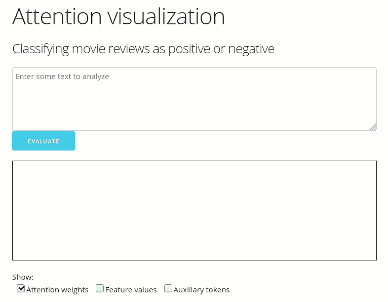

**行动中的注意力可视化——阅读下面的工作原理，** [**自己试试**](http://ulmfit.purecode.pl)

## **目录:**

[**实用深度学习关键——迁移学习**](#6df3)
- [计算机视觉](#d6d6)
- [自然语言处理(NLP)](#f223)
-[-](#a3bf)
-[现状](#fa0e)
[**拟定架构**](#31e1)
- [ULMFiT —重述](#48c2)
- [分支注意—拟定分类器头](#21fa)
[**实验及结果**](#c366)
- [IMDB 样本](#9dbb)
--

# 实用深度学习的关键——迁移学习

## 在计算机视觉中

将深度神经网络应用于非结构化数据，最常见的是图像，可以产生令人印象深刻的结果。撇开学术论文和原型不谈，[大众汽车通过分析视频反馈实时了解周围环境](https://www.tesmanian.com/blogs/tesmanian-blog/flashing-arrow-signal-light-from-the-tesla-s-fsd-preview-hints-completion-is-near)。在某些地区，[汽车完全自主驾驶](https://techcrunch.com/2019/11/01/hailing-a-driverless-ride-in-a-waymo/)。在这些情况下，以及许多其他情况下，深度学习被用于将图像的单个像素的原始数据转换为对场景的某种理解。

图 1:实时对象检测的开源示例:神经网络返回所有检测到的对象的边界框和类。来源: [YOLO v3](https://pjreddie.com/darknet/yolo/) 物体探测

虽然理解图像是人类的天性，但对计算机来说却绝非易事。教一台机器如何看待世界需要大量的计算和大量的数据，有点类似于人类看待世界的方式。实际上，这也需要花费大量的时间和金钱。上面的例子？它使用超过 1400 万张人工注释的图像进行训练( [ImageNet](http://www.image-net.org/) ，然后是 [COCO](http://cocodataset.org) )。然而，在各种各样的领域都有许多实际的应用——无数的工业领域，许多被非政府组织使用——例如通过照片来识别鲸鱼个体或者使用卫星图像来探测森林砍伐。

在没有庞大数据集和预算的情况下使用深度学习的关键？重新规划已经训练好的模型及其包含的知识；更正式的说法:迁移学习。计算机视觉经历了一场革命，在 2010 年代中期，使用 ImageNet 上预先训练好的模型用于各种应用成为了标准做法[。](/transfer-learning-from-pre-trained-models-f2393f124751)

预训练任务很简单:对于每幅图像，通过选择(20，000+)预定义类别中的一个来决定其中的主要对象。为了解决这个问题，神经网络学习如何从原始像素数据中提取有意义的图像表示。首先，卷积层学会检测简单的特征，例如边缘和拐角。下一层使用这些信息来识别更复杂的形状——当观察鸟类图像时，可能是翅膀和喙。最终层可以识别特定类型的对象，例如各种类型的鸟、汽车或飞机。

我们可以使用预先训练的网络来计算图像的表示，并训练我们的模型使用这些表示。或者，我们可以删除预训练网络的最后几层，用新的、随机初始化的层来替换它们，并训练整个网络来执行手头的任务。这样就有可能使用只有几千或几百张标记图像的数据集快速构建原型系统。例如，400 个训练样本足以[在视网膜的 OCT 图像](https://www.robertoreif.com/blog/2018/6/26/classification-of-retinal-cross-sectional-optical-coherence-tomography-images)中出现的 4 类疾病分类中实现 85%的准确性——这是一种与原始网络训练的动物和车辆图片非常不同的图像。通过一些额外的努力，例如对于分类任务，可以进一步降低数据要求。更极端地说，在看不到图像的任何例子的情况下将图像分类也是可能的(零镜头学习，例如[设计](https://static.googleusercontent.com/media/research.google.com/en//pubs/archive/41473.pdf))。

## 在自然语言处理中

自然语言的自动处理是一个具有挑战性的问题。在这个领域中执行各种任务的系统已经存在了几十年，但是直到最近它们还主要是基于规则的。这些系统可以很好地执行(例如:[以 97.2%的准确率将问题分为 50 类](https://www.aclweb.org/anthology/C16-1116/))，并且它们的行为可以很容易地被理解和调试。不幸的是，因为它们是基于人工开发的规则和知识库系统，所以它们的开发是劳动密集型的。随着预期功能的增加，它们的复杂性会大大增加，因此它们通常只适用于定义明确、范围狭窄的任务。此外，打字错误或语法错误可能会干扰它们的运行。

开发统计的、数据驱动的 NLP 系统的动机是明确的。在许多情况下，收集与手头任务相关的数据集比开发一套庞大的规则更容易。这意味着更低的成本和更短的系统开发时间。此外，随着时间的推移，随着收集的数据越来越多，它为系统提供了更好的性能。此外，许多文本数据可以免费获得——以书籍、在线出版物等形式。——可以说包含了人类的大部分知识。直接利用它作为知识库，可以构建新的、非常强大的系统。

建立一个能够完全理解自然语言的系统是一个极其困难的、尚未解决的问题。解决语言歧义通常需要语境、习语知识、发现讽刺，甚至常识和人类“常识”(见[威诺格拉图式](https://en.wikipedia.org/wiki/Winograd_Schema_Challenge)挑战)。尽管如此，这个问题还是很值得研究的——因为它有直接的应用价值，也有可能更接近理解一般智力。

NLP 中的第一个统计方法开始时要简单得多。他们将文本文档表示为它们所包含的单词数(这种表示称为单词包)。这种方法的改进建议使用频率而不是计数，并且频率通常与给定单词的常见程度相关( [TF-IDF](https://en.wikipedia.org/wiki/Tf%E2%80%93idf) )。这些方法完全不考虑词序，所以只使用一小部分可用信息。使用 n-grams 个单词的序列)代替单个单词，进行类似的进一步处理，是一种合并词序信息的可行方法。不幸的是，使用高 n 值是不可行的，因为可能的单词组合的数量随着 n 呈指数增长。

上述基于计数的表示在很长一段时间内一直是最先进的统计解决方案的基础。由于其简单性和计算效率，对于某些应用来说，它们仍然是重要的基线。例如，对于主题分类和情感分析，尝试基于词袋或双字母特征的朴素贝叶斯或 SVM 分类器，[可能是一个好主意](https://nlp.stanford.edu/pubs/sidaw12_simple_sentiment.pdf)(在下面描述的完整 IMDB 任务的情况下，它实现了 90–91%的准确率，相比之下，ULMFiT 的准确率为 95%，但速度要快几个数量级)。

第一波变化发生在 2013 年，随着 [Word2Vec](https://en.wikipedia.org/wiki/Word2vec) 的出现。这一类别的模型为其词汇表中的每个单词生成一个数字表示(称为“单词向量”，或“嵌入”)。它们是作为浅层神经网络构建的，根据来自大量免费文本的短序列进行训练。每个单词的表示都基于其通常的上下文，并且已经捕获了大量的语言语义。众所周知，[词语之间的类比对应于其向量之间的算术关系](https://kawine.github.io/blog/nlp/2019/06/21/word-analogies.html)，例如`king — man + woman ~= queen`。

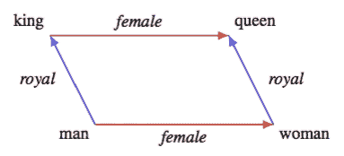

图 2:单词嵌入空间中的语义关系。标有“女王”、“女人”、“男人”和“国王”的点的坐标是单词向量/嵌入。来源:[走向理解线性词语类比](https://www.aclweb.org/anthology/P19-1315/)，[博文](https://kawine.github.io/blog/nlp/2019/06/21/word-analogies.html)

词汇表中的每个单词都被表示为一个固定长度的向量(例如 300 个数字)——嵌入空间中一个点的坐标集。由于词汇表的大小(唯一单词的数量)通常高几个数量级，所以表示是分布式的——单词和概念由特定的坐标组合表示，而不是向量的单个元素。

作为一个完整系统的一部分，单词嵌入将用于对文档中的每个单词进行编码，产生一个可变长度的向量序列(长度对应于单词的数量)。开发了许多使用这些表示的算法——从平均所有的单词向量并根据结果训练 SVM 分类器，到通过递归或卷积网络传递序列。

单词嵌入有一个中心问题。当用于对文档中的单词进行编码时，它们会单独对每个单词进行编码——忽略上下文。代表*根*的向量在下式中是相同的:

*   一棵树的根
*   二的平方*根号*

对于 NLP 的大多数实际应用来说，具有一个以上可能含义的单词是一个问题。对于某些应用，例如情感分析，也必须解决句法歧义。这可以从简单的问题(一个短语被否定了吗？)变得非常复杂，有时甚至是不可能的(这个短语是讽刺性的吗？).

让我们考虑一个实际的情况。我们希望建立一个系统，通过将关于品牌的推文分类为正面或负面，来评估公众对品牌的情绪，然后计算正面的分数。我们需要训练数据——我们可能会下载一些关于各种品牌的相关推文，然后手动给它们贴上标签(或者众包这项任务)。

如果我们使用单词嵌入并将编码文本输入神经网络，我们将能够训练它执行分类任务——区分积极信息和消极信息。但是因为单词嵌入并不捕捉上下文，只是单个的单词，我们的网络必须同时学习语言的整个结构，甚至更高层次的概念，如讽刺或挖苦！所有这些都是基于我们珍贵的，人工标注的数据。这显然是低效的。

## 语境化的词汇表征

为了帮助神经网络“理解”语言的结构，研究人员开发了几种网络架构和训练算法，它们计算单词的上下文化表示。与基于单词嵌入的方法相比，关键的区别是:这种对上下文的理解是在来自给定语言(或多种语言)的未标记的、可自由获得的文本上训练的。数据通常来自维基百科、T2、公共领域的书籍，或者只是从互联网上搜集。

在 2018-2019 年，他们开始了一场类似于几年前计算机视觉的“革命”。深度神经网络通常用于计算丰富的、上下文化的文本表示——与上下文无关的单词向量相反。这些表示然后可以被另一个神经网络使用(例如 [ELMO](https://arxiv.org/pdf/1802.05365.pdf) )。更常见的是，预训练网络的最后一层被一组不同的层取代，这些层是为手头的任务设计的(通常称为*下游任务*)。新层的权重被随机初始化，并使用标记的数据进行训练以执行下游任务。这个过程要容易得多，因为最难的部分——语言理解——已经大部分完成了。

最初的训练，旨在训练网络对文本的“理解”，是基于未标记的数据。标签——模型要预测的东西——是从数据本身自动生成的。使用这种标签的训练通常被称为无监督的预训练。

## 目前的技术水平

最常见的**无监督预培训方法**有:

*   **屏蔽语言建模** —从剩余的上下文中预测一些删除的单词(例如 [BERT](https://arxiv.org/abs/1810.04805)
*   **语言建模**——给定前一个单词预测下一个单词(例如 [GPT-2](https://blog.openai.com/better-language-models/) 、[乌尔姆菲特](https://www.aclweb.org/anthology/P18-1031.pdf)
*   **替换标记检测** —最近的，但非常有前景的策略，其中一些单词被由单独的辅助语言模型生成的单词替换，预训练任务是识别它们(例如 [ELECTRA](https://ai.googleblog.com/2020/03/more-efficient-nlp-model-pre-training.html)

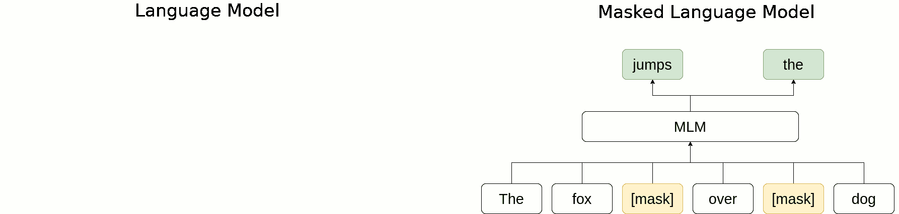

图 3:两个最受欢迎的培训前目标

**标记化**——将文本分割成基本的块——的方法也各不相同。最简单但次优的策略是在每次遇到空格字符时将它们分开。**在某些情况下使用基于单词的**标记化，但通常包括特定于每种语言的规则(例如，将“不”分为“做”和“不”)。**子词标记化**(例如 [SentencePiece](https://github.com/google/sentencepiece) )可能是最常见的——它是基于特定字符序列的频率从数据中导出的，通常将空白视为另一个字符。同样值得注意的是，**字符级语言模型**有时也会在实践中使用(例如 [FLAIR](https://www.aclweb.org/anthology/C18-1139/) )。

两组**网络架构**主导着这个领域:

1.  [**变形金刚网络**](https://arxiv.org/pdf/1706.03762.pdf)**——基于[自我关注机制](/illustrated-self-attention-2d627e33b20a)
    变形金刚网络最著名的例子包括谷歌的[伯特](https://arxiv.org/abs/1810.04805) (+其众多变种)和 OpenAI 的 [GPT-2](https://blog.openai.com/better-language-models/) 。他们帮助在许多(如果不是大多数)NLP 问题中实现了最先进的结果。训练非常容易并行化，当解释一个令牌时，他们可以在被解释的令牌之前和之后使用这两个令牌。
    注意机制有许多变种，这里概括了；它们通常将来自输入的不同部分的信息聚合为这些部分的加权平均值，由各种可训练模块计算权重。

    要找到许多架构的实现、预训练模型、教程等等，请参见[拥抱脸变形金刚](https://github.com/huggingface/transformers)。**
2.  ****递归网络**(以及递归+其他架构的混合体)。
    [乌尔姆菲特](https://www.aclweb.org/anthology/P18-1031.pdf)或许是这个群体中最受欢迎的，其他值得一提的还有[多菲特](https://www.aclweb.org/anthology/D19-1572.pdf)、[沙-RNN](https://arxiv.org/abs/1911.11423) 以及最近开源的[莫格里菲耶 LSTM](https://arxiv.org/pdf/1909.01792.pdf) 。
    虽然训练更难并行化，但正是因为这个原因，模型往往更小，训练更有效——没有办法通过增加问题的计算来加速训练。上面提到的所有递归网络都可以在具有单个 GPU 的台式计算机上从头开始训练。他们应该相对快速地为下游任务进行微调。如果标记数据很少，它们也往往表现得更好(参见 [MultiFiT](https://www.aclweb.org/anthology/D19-1572.pdf) )。与基于 Transformer 的模型相比，另一个优势是:它们可以处理任意长的输入，而 Transformer 只能处理它们被设计和训练的长度的数据块(有一些技巧可以用来一部分一部分地处理更长的文档并汇总结果)。

    [Fast.ai](https://github.com/fastai/) 包含一个 [ULMFiT](https://www.aclweb.org/anthology/P18-1031.pdf) 的实现，以及一个预先训练好的英语语言模型。多功能库包含其他几种语言的预训练模型，如果需要另一种语言，还有预训练脚本。**

# **提议的架构**

**本文描述了一种用于处理文本文档的分类模型的新型网络架构——对 [ULMFiT](https://www.aclweb.org/anthology/P18-1031.pdf) 的修改。使用该论文的命名法，提出了不同的*分类头*。**

## **ul fit—概述**

**从头开始训练一个 [ULMFiT](https://www.aclweb.org/anthology/P18-1031.pdf) 型号包括 3 个步骤:**

1.  ****语言模型预训练** —在大型通用文本语料库(例如维基百科)上训练语言模型**
2.  ****语言模型微调** —对来自分类任务领域的文本继续训练语言模型(想要对推文进行分类？在同一种语言的大量推文上训练)**
3.  ****分类器微调** —语言模型的最后一层被替换为*分类器头*(如下所述)。剩下的预训练部分称为*编码器。*
    首先，只训练分类器头的随机初始化参数。之后，编码器的各层逐渐开始优化，从最后到第一。**

**[ULMFiT](https://www.aclweb.org/anthology/P18-1031.pdf) 论文中使用的网络架构如下所示。它包含:**

*   **可训练嵌入层，**
*   **3 个递归层( [LSTM](https://colah.github.io/posts/2015-08-Understanding-LSTMs/) 增加了许多正则化方法: [AWD-LSTM](https://arxiv.org/pdf/1708.02182.pdf) )，**
*   **分类器头(将可变长度序列聚合成固定长度的表示，并计算分类决策)**

**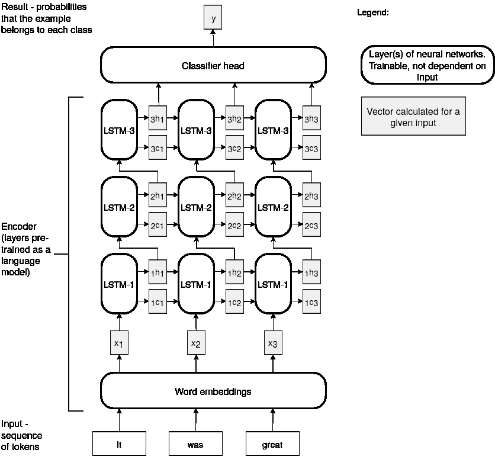**

**图 4: ULMFiT 分类——处理一个示例输入序列**

****分类器头**执行*串联池*，然后将其结果通过一个完全连接的层和输出层。**

****串联轮询**是 3 个元素的简单串联:**

*   **average-pooling——沿序列维度对元素进行平均(对代表每个单词的向量进行平均)，**
*   **max-pooling —沿序列维度的元素最大值，**
*   **编码器的最后一个输出向量。**

## **转移注意力——建议的分类器头**

**所描述的体系结构旨在直接解决使用平均池和/或最大池来聚集由递归语言模型生成的文本表示的两个主要问题。**

1.  **按位置统计(平均池和最大池)对序列中的所有标记进行同等加权，即使通常只有一部分与分类任务相关。在电影评论中进行情感分析的情况下——评论者可能会写一部伟大电影中讲述的悲伤、悲惨的故事。虽然大部分文本可能有负面情绪，但我们只想专注于描述电影的部分，而不是其情节的内容。**
2.  **只有当感兴趣的文本特征与表示空间的坐标系的轴对齐时，平均池和最大池才有语义意义。对于情感分析，我们希望看到一个神经元(表示空间的一维)准确表达文本中的积极或消极情感，而不是其他。虽然对于像情感这样的简单概念来说，它[可能近似为真](https://openai.com/blog/unsupervised-sentiment-neuron/)，但对于更复杂的特征来说，它不太可能成立，甚至是近似成立。如果条件不成立，对长序列(数百或数千个令牌)求平均值很可能会破坏存储的信息。**

**因此，分类器头包含两个“分支”，每个分支回答一个问题:**

*   **ATT 分公司:“哪些部分是相关的”，我们应该注意什么**？****
*   **AGG branch:"我们想要 **agg** regate 的特性是什么？"**

**两者都被实现为简单的、完全连接的神经网络。层的数量和大小是额外的超参数，其选择在“结果”一节中讨论。网络独立地应用于每个序列元素。ATT 分支返回的值(每个序列元素的标量(eⱼ))然后通过 Softmax 函数传递，以获得加权平均值的正确权重(aⱼ)。AGG 返回的向量的加权平均值( **bⱼ** )成为序列 **(C)** 的最终表示。**

**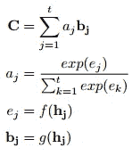**

**分支注意力结构方程。非线性函数 f 和 g 由神经网络 ATT 和 AGG 实现。粗体向量。**

**“分支注意力”分类器头部示意图:**

**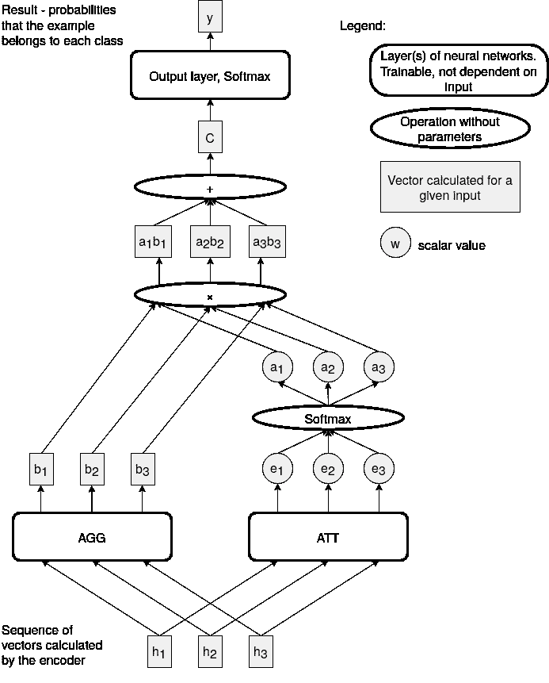**

**图 5:分支注意力分类器头**

**注意:如果 AGG 分支被跳过，并且 ATT 只有输出层，那么整个聚合减少到[点积关注](/attention-and-its-different-forms-7fc3674d14dc)，只有一个可训练的查询。它不会产生特别好的结果，这将在下一节中讨论。**

# **实验和结果**

**大多数实验都是使用流行的情感分类数据集 IMDB T1 进行的。它包含 5 万条影评，由 imdb.com 网站[的用户撰写。如果用户对电影的评分为 7 分或以上，它们将被标记为正面，4 分或以下，它们将被标记为负面。等级是平衡的，每部电影正面和负面的评论数量相等。每部电影评论不超过 30 条。文件长度差异很大——许多相对较短，但有 2%超过 1000 字。同样值得注意的是，这些标签有些“嘈杂”，例如，有些正面评论被标记为负面。](https://www.imdb.com)**

## **IMDB 示例**

**为了模拟小数据集的情况，同时在体系结构之间进行具有统计意义的比较，实验以如下方式进行:在 IMDB 训练数据集的 1000 个元素样本上训练模型，并在整个测试集上进行评估。对于每个架构和超参数集，这重复了 20 次。与训练相关的超参数和单个漏失乘数(由[乌尔姆菲特](https://www.aclweb.org/anthology/P18-1031.pdf)作者推荐)分别针对分支注意力和串联池头部进行了调整。**

**下面，将所提出的架构(分支注意力)的结果与基线(串联池)进行比较。作为最小消融研究，提供了两种额外的变体:**

*   **移除了 AGG 分支(并且用来自 ATT 分支的权重对编码器输出进行平均)，**
*   **ATT 分支被移除，并且 AGG 提取的特征被统一加权。**

**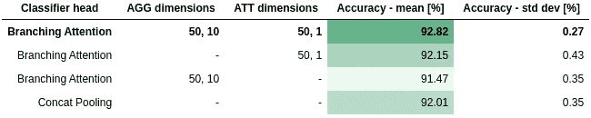**

**表 1:不同分类器头的分类性能，平均来自 20 个 1000 元素数据集的训练。优化整个网络的参数(逐步解冻)**

**虽然这绝不是突破性的，但上述结果似乎令人鼓舞。在不改变编码器(该模型最重要的部分)的情况下，错误分类的样本数量减少了 10%以上。所提出的架构似乎更好地利用了编码器的文本表示。**

****在上述最佳配置中，分支注意力头的参数**比原始 [ULMFiT](https://www.aclweb.org/anthology/P18-1031.pdf) 架构少 30%。在其他配置中，性能稍差，参数数量最多减少 85%。**

**值得注意的是，移除分支注意力头的任何一个分支都会导致表现的显著下降——甚至低于基线水平。虽然为了简洁起见没有在这里显示，但是减少任一分支的深度(到一个层)也会导致性能小幅但持续下降。结果支持使用具有两个分支的完整网络架构，如前所述。**

**单个实验运行的准确度分数的分布如下所示，为箱线图。它旨在可视化每个配置的结果差异，这些差异是由不同的训练数据集采样和不同的随机初始化产生的。**

**值得注意的是:所有四个体系结构中存在的单个负异常值(表示为点)来自于对训练数据集的相同样本的训练——可能质量较差。很可能，如果每次都用相同的数据集重复训练(只改变随机种子)，每个配置的精确度的方差将会低得多。然而，使用不同的数据集样本是为了确保任何结论都更具普遍性，而不是特定于特定的数据集。**总体来说，均值精度的提高不能合理解释为随机噪声。****

## **仅头部训练**

**使用带有可训练集合的分类器头，而不是固定的，我们还能得到什么好处？我们可能根本不需要修改编码器的参数。根据 [ULMFiT](https://www.aclweb.org/anthology/P18-1031.pdf) 的说法，我们应该首先优化分类器头部，然后逐渐将编码器的层添加到优化器的范围内——这种方法在上一节中有所描述。然而，专门训练分类器的头部具有重要的实际好处，这将在下一节中讨论。下表总结了通过这种方式获得的结果——仅优化了分级机机头的参数。**

**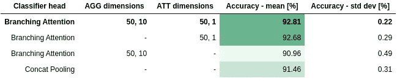**

**表 2:不同分类器头的分类性能，平均来自 20 个 1000 元素数据集的训练。仅优化分类器头部的参数**

**有点令人惊讶的是，**对于完全分支注意力的头部，结果一点也没有恶化。以这种方式训练分类器可能是一种可行、实用的方法**，尤其是对于相对较小的数据集**。**正如预期的那样，提议的架构和 Concat 池之间的差距已经增大。**

**没有 AGG 分支的变体的性能高于预期，优于整个网络优化时的性能(上一节)。这可能表明优化整个网络时的训练过程可以改进，但这种尝试并不成功。**

## **纯头部训练的好处**

**为什么当只训练分类器头时，所提出的架构比基线执行得更好是重要的？以这种方式构建系统有几个实际优势。训练速度更快，需要的内存更少。一个不太明显的好处在于，被训练的模型所特有的参数数量很少。**

**新的用例出现在许多分类器对同一领域的文本进行操作的场景中，例如给定语言的“tweets”或“news articles”。培训、存储和运行新模型变得非常便宜:**

*   **训练不到一分钟(在现代 GPU 上)**
*   **存储的分类器头占用约 100kB 的磁盘空间(大概数字，某些配置会更少)**
*   **在推理时，所有模型的文档可以一起批处理，并在同一个 GPU/TPU 上有效编码；特定型号的推理部分很小，可以在 CPU 上快速运行。**

**能在哪里有用？有许多可能的情况，例如:**

*   ****AutoML 平台** —一个不熟悉 ML 的用户提供一个带标签的数据集，并期望一个 API 给一个执行分类的模型。**
*   ****推荐系统**—[冷启动问题](https://www.yuspify.com/blog/cold-start-problem-recommender-systems/)的“产品”一半。例如，当一篇新文章发布在 Medium 上时，没有人与之互动。传统的(协同过滤)算法基于具有相似品味的人的意见来推荐东西。这种方法不适用于新内容。我们可以根据一组活跃用户过去的活动，为他们训练“鼓掌预测”(评级预测)模型。然后，我们可以在任何人有机会阅读新文章之前，对它们进行人工评级。**
*   ****个性化**，有足够的数据可用。基于内容推荐社交媒体帖子，而不是其他人与它的互动，标签等。以 Twitter 为例，虽然根据所有用户的偏好模型运行所有新推文是不可行的，但可以使用这样的偏好模型作为当前系统之上的最终过滤层。**

## **注意力可视化**

**通过分析神经网络中的注意力权重，我们可以更好地理解它——我们可以看到输入的哪些部分与手头的任务相关。有趣的可视化技术已经在[机器翻译](https://arxiv.org/pdf/1409.0473.pdf)和[图像字幕生成](https://arxiv.org/pdf/1502.03044.pdf)中得到演示。**

**有了分支注意力，在某些情况下，我们可以更进一步。如果分类问题是二进制的，我们可以通过将 AGG 分支的最后(或唯一)维度设置为 1 来获得相当好的结果。实际上，对于每个输入令牌，我们将获得单个标量值，最终的决策将是这些值的加权平均值(经过简单的转换)。在情感分析的情况下，**我们可以在处理每个标记之后显示“本地”情感，以及文档特定部分的重要性分数**。**

**请看下面的例子，并查看 [**互动演示**](https://ulmfit.purecode.pl) **。**在演示中，可以同时显示权重和情绪(如示例所示)，也可以只显示权重或情绪。也可以在不同的文本上测试模型。**

****

**图 6:示例电影回顾——注意力可视化**

****每个标记后面颜色的不透明度**表示与其相关的注意力权重。**色调**表示为该标记计算的特征(情感)的值，**考虑其左上下文**，以红到绿的比例。**

**一些观察结果:**

*   ****该模型在大多数情况下正确识别情感，**并“关注”相关部分(尽管“故事中开始出现漏洞”未被识别为相关)。**
*   ****否定**，即使放在离其对象几个字以外的地方，**也被正确解读**(“我不认为这是一部好电影”)。**
*   **大的权重分配给句号字符。正如“什么不起作用”一节中所述，对这一事实的几种可能的解释进行了探讨。剩下的，工作假设:当遇到句号时，模型已经处理了一个完整的语句，后续的单词不太可能改变它的含义。**模型在处理完句号后，通过编码器的状态学习访问整个句子的内容。****

## **完整的 IMDB，其他数据集**

**为了验证所提出的架构是在总体上表现良好，还是仅针对特定的数据集类型和大小表现良好，进行了几个其他实验。**

****完整的 IMDB 数据集****

**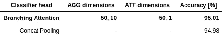**

**表 3:完整 IMDB 数据集上的分类性能**

**当在完整的 IMDB 数据集上训练时，在其默认的训练/测试分割中，结果大约等于基于 Concat 池的分类器的结果(尽管分支注意力似乎对训练相关的超参数的选择不太敏感)。直观上，大型训练数据集可能包含足够的信息来修改编码器，其输出将通过平均池和最大池进行有意义的聚合。**

****完整的 IMDB 数据集，仅头部训练****

****

**表 4:完整 IMDB 数据集上的分类性能，仅优化分类器头**

**当在完整的 IMDB 数据集上进行训练，但仅优化分类器头部时，分支注意力的表现明显好于基线。正如所料，它的性能比整个网络优化时更差。尽管如此，这种方法在某些情况下还是有用的，正如“纯头部训练的好处”一节中所讨论的。**

****自动网络欺凌检测— PolEval 2019 任务 6****

**使用一个[旧版本的代码](https://github.com/tpietruszka/ulmfit_experiments)，一个基于分支注意力的系统进入了 [PolEval 2019](http://2019.poleval.pl/) 竞赛——任务 6。它的目标是准备一个系统来评估哪些用波兰语写的推文可能包含网络欺凌内容。提供了大约 10，000 条示例推文的人群标签训练集。这是非常不平衡的——绝大多数例子不包含网络欺凌。**

**该系统使用了一种子词标记化机制——[sentence piece](https://github.com/google/sentencepiece)——来处理 Twitter 上常见的拼写错误。这种标记化通常对波兰语有利，因为它是一种融合语言。它丰富的前置和后置修复大大增加了独特单词的数量，这是传统的基于单词的标记化方法的一个问题。该语言模型在波兰语维基百科上进行训练，然后在一个大型的未标记的波兰语推特数据集上进行微调。**

****在竞赛中，该系统获得了第三名** ( [proceedings](http://2019.poleval.pl/files/poleval2019.pdf) ，第 106 页)，落后于一个[ulm fit](https://www.aclweb.org/anthology/P18-1031.pdf)——类似于一个更大的、改进的语言模型的系统(类似于并由 [MultiFiT](https://github.com/n-waves/multifit) 的合著者)。然而，它的排名仅在基于 BERT 的系统之前。**

**分支注意力和串联池的性能随后以与“IMDB 样本”实验相同的方式进行了比较**，并在 IMDB 数据集**上调整了超参数。两个模型都被训练了 20 次，每次都在训练数据集的不同子样本上进行，并且具有不同的随机初始化。为了直接比较模型的性能并避免设置检测阈值的问题，选择了平均精度度量。**

**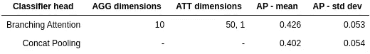**

**表 5:网络欺凌检测任务的平均精度，20 次重复，1000 个元素的训练数据集样本**

**在完全不同的环境中——不同的语言、标记化策略、不同的(更复杂的)任务、**没有进一步的超参数优化，分支注意力提供了适度但明显的性能改善**。可以认为这是对所提议的体系结构的成功测试。**

****问题分类— SemEval-2019 任务 8A****

**使用[事实核查问题](https://github.com/tsvm/factcheck-cqa)数据集对该方法的结果进行了另一次验证。该数据集摘自“卡塔尔生活”——一个社区问答论坛。每个文档(主题中的第一篇文章)由类别、主题行和文章内容组成。这些字段用分隔符连接在一起。任务:给每个问题分配一个类别:“事实”、“观点/建议”或“社会”。**

**在与上述相同的**实验设置中，使用相同的超参数，获得的结果为:****

**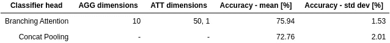**

**表 5:问题分类任务的准确性，20 次重复，1000 个元素的训练数据集样本**

****再一次，使用分支注意力的网络表现明显更好**——尽管两个网络共享相同的预训练编码器。**

## **什么没有起作用，可能的改进**

**为提高网络性能，进行了几次尝试:**

1.  ****双向编码器**。编码器的输出与第二个编码器的输出连接在一起，第二个编码器被训练来反向处理文本。它为文档提供了更丰富的表示，每一点都以文档的整体内容为条件。GPU 内存需求增加了大约 2 倍，但性能并没有明显提高。然而，由于内存限制，其他参数必须更改，这可能会降低性能。利用具有更多内存(理想情况下为 16GB 以上)的 GPU 的进一步实验可能会改变这一结论。前向和后向语言模型的联合训练可以改善结果，并且节省一些内存——通过在嵌入/softmax 层中的权重共享。
    ul mfit 的作者报道了类似的结果。然而，值得注意的是，分支注意力聚合应该能够更好地利用附加信息——对于每个序列元素，计算相关特征，然后对它们进行平均。总的来说，虽然最初的结果是负面的，但这个想法似乎仍然值得进一步研究。**
2.  ****使用较早的编码器层。**在 [ELMO](https://arxiv.org/pdf/1802.05365.pdf) 之后，编码器前几层的输出被用作分类器头的附加输入(图 4 中的 LSTM-1 和 LSTM-2)。**它没有改善结果**，但是——根据最初的作者——最佳层或层的组合可能会因任务而异。**
3.  ****使用最后一个令牌的表示。**其中一个假设，即模型为什么学习给句号字符分配高权重，是:它寻找文档的结尾。最后一个标记的表示取决于整个文档，所以假设它包含所有相关信息。然而，以各种方式直接结合最后一个记号的表示**并没有改善分类结果。****
4.  ****运用 LSTM 的“细胞”价值观。**对于输入序列的每个元素，LSTM 层产生两个向量:“单元”状态值 **c** 和输出/隐藏值 **h** 。虽然 **c** 值旨在更长时间地存储信息，但输出值是作为 **c** 的门控版本产生的，并且输出门由本地上下文参数化。正常情况下，只有 **h** 值被传递到下一层(参见[图 4](#3be9) )。
    另一个为什么句号字符的表示可能被赋予更大权重的想法是:在语言模型设置中，它们被用来预测新句子的第一个单词。要做到这一点，他们必须访问更多的文档上下文，这可能会导致输出门更加开放。
    这一假设激发了在分类器头部直接使用非门控 **c** 值的想法。然而，**分类结果并没有改善**(计算效率降低，因为优化的 cuDNN 实现无法使用)。
    在对几个示例中的相应的 **c** 和 **h** 向量进行更仔细的检查后， **h** 值不像 **c** 的门控版本(在某种意义上近似于硬二进制门控)。似乎选通操作只是提供了一个额外的、可训练的非线性变换，有点类似于大小为 1 的卷积。进一步分析 LSTM 网络的输出门发生了什么，以及它如何与正在处理的文本的语法相对应，这本身似乎是一个有趣的话题，但超出了本文的范围。**

# **结论**

*   **在几项任务中，提出的解决方案优于原始的 [ULMFiT](https://www.aclweb.org/anthology/P18-1031.pdf) 架构，或者表现同样出色。**
*   **基于“分支注意力”的分类器头在相对小的数据集的情况下具有优势，并且如果只是分类器头被优化。**
*   **如果标记的训练数据稀少和/或需要许多分类器在相似的文档上操作，则在预训练的语言模型之上仅优化分类器头可能是可行的策略。在后一种情况下，如果只是分类器头的参数不同，则可能实现更高效的部署，并且需要更少的磁盘空间。**
*   **分支注意力架构的所有变体都为分类器增加了某种程度的可解释性。我们不仅可以发现哪些部分被认为是重要的，而且在某种程度上还可以发现它们是如何被理解的(见[演示](https://ulmfit.purecode.pl/))。**
*   **在其推荐的配置中，与基线相比，建议的架构具有更少的参数，并且需要更少的计算。由于其性能似乎大多优于或等于基线，因此可将其视为使用原始 [ULMFiT](https://www.aclweb.org/anthology/P18-1031.pdf) 配置的分类器的替代产品。**

**提供了重现本文结果所需的[代码](https://github.com/tpietruszka/ulmfit_attention)和微调后的语言模型。**