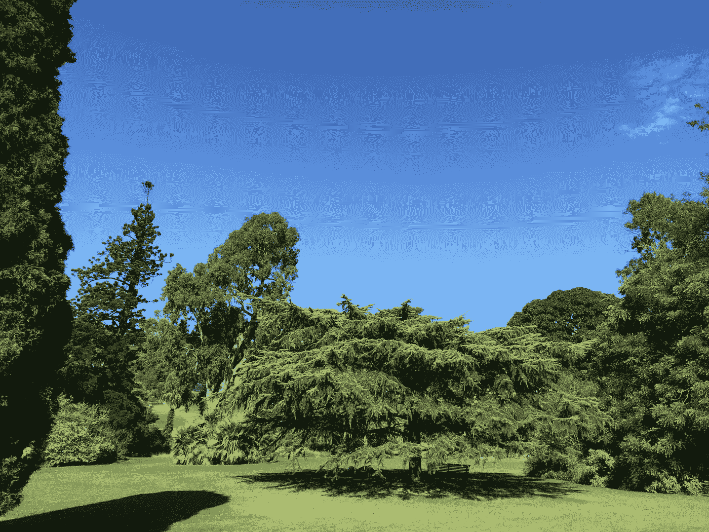

# 乳腺癌预测中的可解释深度学习

> 原文：<https://towardsdatascience.com/explainable-deep-learning-in-breast-cancer-prediction-ae36c638d2a4?source=collection_archive---------16----------------------->

## 了解医疗保健中的卷积神经网络预测结果



高级机器学习模型(例如随机森林、深度学习模型等。)通常被认为是不可解释的[1][2]。如[1][2][3][4]中所述，这些模型在很大程度上仍然是黑盒，如果医生计划根据预测结果采取措施治疗疾病(如癌症)，那么理解其医疗保健预测结果背后的原因对于评估信任度非常重要。在[2]中，我使用了威斯康星州乳腺癌诊断(WBCD)表格数据集来介绍如何使用局部可解释模型不可知解释(LIME)方法来解释随机森林模型在乳腺癌诊断中的预测结果。

在本文中，我使用 Kaggle 乳腺癌组织学图像(BCHI)数据集[5]来演示如何使用 LIME 来解释用于浸润性导管癌(IDC)乳腺癌诊断的 2D [卷积神经网络(ConvNet)](https://en.wikipedia.org/wiki/Convolutional_neural_network) 的图像预测结果。

# 1.准备乳腺癌组织学图像数据集

BCHI 数据集[5]可以从 [Kaggle](https://www.kaggle.com/kernels/scriptcontent/2064134/data) 下载。如[5]中所述，数据集由 5，547 个 50x50 像素的 H & E 染色乳腺组织病理学样本的 RGB 数字图像组成。这些图像被标记为 IDC 或非 IDC。有 2，788 个 IDC 图像和 2，759 个非 IDC 图像。这些图像已经被转换成 Numpy 数组，并存储在文件 *X.npy* 中。类似地，相应的标签以 Numpy 数组格式存储在文件 *Y.npy* 中。

## 1.1 加载数据

将 *X.npy* 和 *Y.npy* 文件下载到本地计算机后，它们可以作为 Numpy 数组加载到内存中，如下所示:

```
X = np.load('./data/X.npy') # images
Y = np.load('./data/Y.npy') # labels (0 = Non IDC, 1 = IDC)
```

以下是其中两个数据样本，左边的图像标记为 0(非 IDC)，右边的图像标记为 1 (IDC)。


**图一。两个样本:左边的标为 0(非 IDC)，右边的标为 1 (IDC)。**

## 1.2 混洗数据

在原始数据集文件中，所有标记为 0(非 IDC)的数据样本都放在标记为 1 (IDC)的数据样本之前。为了避免人为的数据模式，数据集被随机打乱如下:

```
indices = np.arange(Y.shape[0])
np.random.shuffle(indices)
indices = list(indices)
X = X[indices]
Y = Y[indices]
```

## 1.3 转换数据集

IDC 图像中的像素值在[0，255]的范围内，而当输入数据的值在[0，1]或[-1，1]的范围内时，典型的深度学习模型工作得最好。下面的类 *Scale* 是将 IDC 图像的像素值转换到[0，1]的范围内。

```
class Scale(BaseEstimator, TransformerMixin):
    def __init__(self):
        pass 

    def fit(self, X, y):
        return self

    def transform(self, X): 
        X1 = X.copy()
        X1 = X1 / 255.0
        return X1
```

## 1.4 划分数据集用于模型训练和测试

数据集分为三部分，80%用于模型训练和验证(1，000 用于验证，其余 80%用于训练)，20%用于模型测试。

```
X_train_raw, X_test_raw, y_train_raw, y_test_raw = train_test_split(X, Y, test_size=0.2)X_train = X_train_raw.copy()
X_val   = X_train[:1000]
X_train = X_train[1000:]
X_test  = X_test_raw.copy()y_train = y_train_raw.copy()
y_val   = y_train[:1000]
y_train = y_train[1000:]
y_test  = y_test_raw.copy()
```

# 2.训练 2D ConvNet 模型

BCHI 数据集[5]由图像组成，因此选择 2D ConvNet 模型进行 IDC 预测。

## 2.1 创建 2D 通信网

与[5]类似，下面的函数 *getKerasCNNModel* ()为 IDC 图像分类创建 2D ConvNet。

```
def getKerasCNNModel():
    batch_size = BATCH_SIZE
    epochs = EPOCH_SIZE  
    img_rows, img_cols = X_train.shape[1], X_train.shape[2]
    input_shape = (img_rows, img_cols, 3) 
    model = Sequential()
    model.add(Conv2D(16, kernel_size=(3,3), activation='relu', input_shape=input_shape))
    model.add(MaxPooling2D(pool_size=(2, 2)))  
    model.add(Dropout(0.25)) 
    model.add(Conv2D(32, (3,3),  activation='relu')) 
    model.add(MaxPooling2D(pool_size=(2, 2)))  
    model.add(Dropout(0.25)) 
    model.add(Flatten())
    model.add(Dense(128, activation='relu'))  
    model.add(Dropout(0.5)) 
    model.add(Dense(1, activation='sigmoid'))

    model.compile(loss= keras.losses.binary_crossentropy, 
                  optimizer=keras.optimizers.rmsprop(), 
                  metrics=['accuracy'])

    return model
```

## 2.2 创建管道组件

类 *KerasCNN* 是将 2D ConvNet 模型包装成一个 sklearn 管道组件，这样它就可以与其他数据预处理组件如 *Scale* 组合成一个管道。

```
class KerasCNN(BaseEstimator, TransformerMixin):
    def __init__(self, X_val=None, y_val=None):
        self._model      = getKerasCNNModel()
        self._batch_size = BATCH_SIZE
        self._epochs     = EPOCH_SIZE
        self._X_val      = X_val / 255.0
        self._y_val      = y_val

    def fit(self, X, y):  
        self.history = self._model.fit(X, y,
                        batch_size=self._batch_size,
                        verbose=1,
                        epochs=self._epochs,
                        validation_data=(self._X_val, self._y_val))
        return self

    def transform(self, X): 
        return X def predict_proba(self, X):
        y_pred = self._model.predict(X) 
        return y_pred  

    def evaluate(self, X, y):
        return self._model.evaluate(X,y)
```

# 3.解释模型预测结果

如前所述，我在本文中使用 LIME 来解释 ConvNet 模型预测结果。

## 3.1 设置管道

与[1][2]类似，我制作了一个管道来包装 ConvNet 模型，以便与 LIME API 集成。

```
from sklearn.pipeline import Pipelinesimple_cnn_pipeline = Pipeline([
    ('scale', Scale()),
    ('CNN', KerasCNN(X_val=X_val, y_val=y_val))
    ])
```

## 3.2 训练 ConvNet 模型

ConvNet 模型的训练如下，以便它可以被 LIME 调用，用于以后的模型预测。

```
simple_cnn_pipeline.fit(X_train, y_train)
```

## 3.3 选择石灰解释器

如[1][2]所述，LIME 方法支持不同类型的机器学习模型解释器，用于不同类型的数据集，如图像、文本、表格数据等。本文选择了 LIME image 解释器，因为数据集由图像组成。

2D 图像分割算法[*quick shift*](https://scikit-image.org/docs/stable/auto_examples/segmentation/plot_segmentations.html)*用于生成石灰超像素(即片段)[1]。*

```
*from lime import lime_image
from lime.wrappers.scikit_image import SegmentationAlgorithmexplainer = lime_image.LimeImageExplainer() segmenter = SegmentationAlgorithm(‘quickshift’, kernel_size=1, max_dist=200, ratio=0.2)*
```

## *3.4 解释模型预测*

*一旦训练了 ConvNet 模型，给定一个新的 IDC 图像，就可以调用 LIME 图像解释器的 *explain_instance* ()方法来生成模型预测的解释。*

*图像预测的说明由模板图像和相应的掩模图像组成。这些图像可用于以不同方式解释 ConvNet 模型预测结果。*

**

***图二。将解释上述两个样本的预测。ConvNet 模型预测左图像为负(IDC: 0)，右图像为正(IDC: 0)。***

***说明 1:正 IDC 的预测(IDC: 1)***

*图 3 显示了用于解释通过石灰的模型预测的正 IDC 图像。*

**

***图 3。IDC_1_sample:待解释的正 IDC 样本的预测***

*下面的代码是为图 3 中的图像 *IDC_1_sample (IDC: 1)生成模型预测的解释对象*explain _ 1*。**

*在本说明中，白色用于指示支持模型预测的图像部分( *IDC: 1)* 。*

```
*explanation_1 = explainer.explain_instance(IDC_1_sample, 
                classifier_fn = simple_cnn_pipeline.predict_proba, 
                top_labels=2, 
                hide_color=0, 
                num_samples=10000,
                segmentation_fn=segmenter)*
```

*一旦得到模型预测的解释，就可以调用它的方法 *get_image_and_mask* ()来得到模板图像和对应的掩膜图像(超像素):*

```
*from skimage.segmentation import mark_boundariestemp, mask = explanation_1.get_image_and_mask(explanation_1.top_labels[0], 
                                            positive_only=True, 
                                            num_features=20, 
                                            hide_rest=True)
plt.imshow(mark_boundaries(temp, mask))*
```

*图 4 以灰色显示了给定 IDC 图像的隐藏部分。图像的白色部分表示给定 IDC 图像中支持正 IDC 模型预测的区域。*

**

***图 4:通过隐藏原始图像细节来解释图 3 中的正 IDC 的模型预测。白色表示支持模型预测的区域。灰色部分不支持或与模型预测无关。***

*下面的代码以黄色显示 IDC 图像区域的边界，支持正 IDC 的模型预测(见图 5)。*

```
*temp, mask = explanation_1.get_image_and_mask(explanation_1.top_labels[0], 
                                            positive_only=True, 
                                            num_features=20, 
                                            hide_rest=False)
plt.imshow(mark_boundaries(temp, mask))*
```

**

***图 5:用原始图像细节解释图 3 中的正 IDC 的模型预测。黄色表示图 4 中支持模型预测的白色区域的边界。灰色区域要么不支持，要么与预测无关。***

***说明 2:非 IDC (IDC: 0)的预测***

*图 6 示出了用于解释经由石灰的模型预测的非 IDC 图像。*

**

***图六。IDC_0_sample:要解释的负 IDC 样本的预测***

*下面的代码是为图 6 中的图像 *IDC_0_sample 生成模型预测的解释对象*explain _ 2*。*在本说明中，白色用于表示支持非 IDC 的模型预测的图像部分。*

```
*explanation_2 = explainer.explain_instance(IDC_0_sample, 
                                         classifier_fn = simple_cnn_pipeline.predict_proba, 
                                         top_labels=2, 
                                         hide_color=0, 
                                         num_samples=10000,
                                         segmentation_fn=segmenter
                                        )*
```

*一旦获得了模型预测的解释，就可以调用其方法 *get_image_and_mask* ()来获得模板图像和对应的掩膜图像(超像素):*

```
*temp, mask = explanation_2.get_image_and_mask(explanation_2.top_labels[0], 
                                            positive_only=True, 
                                            num_features=20, 
                                            hide_rest=True)
plt.imshow(mark_boundaries(temp, mask))*
```

*图 7 以灰色显示了非 IDC 图像的隐藏区域。图像的白色部分表示给定非 IDC 图像中支持非 IDC 模型预测的区域。*

**

***图 7:通过隐藏原始图像细节对图 6 的负 IDC (IDC: 0)的模型预测的解释。白色表示支持模型预测的区域。灰色部分不支持或与模型预测无关。***

*下面的代码以黄色显示 IDC 图像区域的边界，支持非 IDC 的模型预测(参见图 8)。*

```
*temp, mask = explanation_2.get_image_and_mask(explanation_2.top_labels[0], 
                                            positive_only=True, 
                                            num_features=20, 
                                            hide_rest=False)
plt.imshow(mark_boundaries(temp, mask))*
```

**

***图 8。用原始图像细节解释图 6 的非 IDC(IDC:0)的模型预测。黄色表示图 7 中支持模型预测的白色区域的边界。灰色区域要么不支持，要么与预测无关。***

# *结论*

*在本文中，我使用 Kaggle BCHI 数据集[5]来展示如何使用石灰图像解释器[3]来解释 IDC 乳腺癌诊断中 2D [康文内特](https://en.wikipedia.org/wiki/Convolutional_neural_network)模型的 IDC 图像预测结果。通过将超像素/特征的数量(即方法 *get_image_and_mask* ())中的 num_features 参数)设置为 20，提供了对 IDC 和非 IDC 的模型预测的解释。*

*我观察到解释结果对超级像素/特征的数量的选择很敏感。需要领域知识来调整该参数，以实现适当的模型预测解释。输入数据(在这种情况下是图像)的质量对于合理的结果也非常重要。增加更多的样本可以提高精确度。*

*Github [6]中提供了一个 Jupyter 笔记本，其中包含了本文中使用的所有源代码。*

# *参考*

*[1] M. T. Ribeiro，S. Singh，C. Guestrin，[“我为什么要相信你？”解释任何分类器的预测](https://arxiv.org/pdf/1602.04938.pdf)*

*[2] Y. Huang，[面向医疗保健的可解释机器学习](/explainable-machine-learning-for-healthcare-7e408f8e5130)*

*[3] [关于图像分类的石灰教程](https://github.com/marcotcr/lime/blob/master/doc/notebooks/Tutorial%20-%20Image%20Classification%20Keras.ipynb)*

*[4] [可解释的机器学习，使黑盒模型可解释的指南](https://christophm.github.io/interpretable-ml-book/)*

*[5] [预测乳腺癌组织学图像中的 IDC](https://www.kaggle.com/paultimothymooney/predicting-idc-in-breast-cancer-histology-images/data)*

*[6] Y .黄，[朱庇特笔记本](https://github.com/yuhuang3/machine-learning/tree/master/lime/image_explainer)*

*披露声明:2020 年。本文中表达的观点仅代表作者的观点，不代表阿贡国家实验室的观点。*