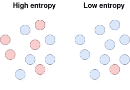
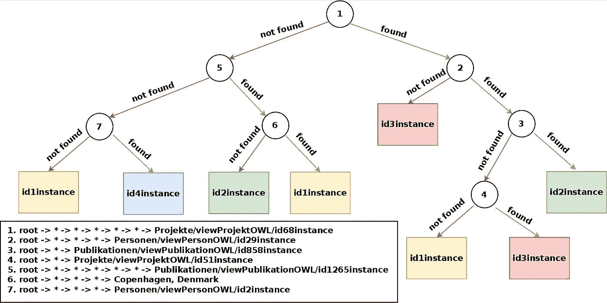

# 知识图中可解释、高效和准确的节点分类

> 原文：<https://towardsdatascience.com/explainable-efficient-and-accurate-node-classification-in-knowledge-graphs-a5d3ba02c245?source=collection_archive---------24----------------------->

## 用 MINDWALC 挖掘区别性行走

## 1.用(知识)图表示更丰富的数据

图形是一种数据结构，可用于表示无处不在的现象，如社交网络、化学分子和推荐系统。它们的优势之一在于，它们显式地对单个单元(即节点)之间的关系(即边)进行建模，这为数据增加了额外的维度。我们可以用 Cora 引用网络来说明这种数据的丰富。这是一个数据集，包含了几百篇论文的单词包表示以及这些论文之间的引用关系。如果我们应用降维(t-SNE)来创建单词袋表示的 2D 图，我们可以看到(相似研究主题的)聚类出现，但它们重叠。如果我们生成一个嵌入图网络，考虑到引用信息，我们可以看到聚类被更好地分离。

左图:每篇论文的单词袋表示的 t-SNE 嵌入。右:图网络产生的嵌入，考虑了论文之间的引用。来源:Velickovic 等人的“Deep Graph Infomax”。

知识图是一种特殊类型的图。它们是多关系的(即不同类型的关系有不同的边)和有向的(即关系有主体和客体)。幸运的是，我们可以将知识图转换为正则有向图，这便于进一步的分析。

将多关系有向知识图转换为正则有向图。

## 2.(知识)图中的节点分类

图形越来越多地被用于各种机器学习任务。例如，可以在社交网络中向用户推荐新朋友，预测一个人在协作网络中的角色，或者在生物交互图中对蛋白质的角色进行分类。在这篇文章中，我们将重点关注**节点分类**的任务:我们在一个图中获得了一组标记节点，需要创建一个模型来预测未标记节点的类别。

在本帖中，我们将使用一个运行示例，目标是将研究人员分类到正确的机构中。下面我描绘了 5 名研究人员。他们的颜色与他们的机构相对应。我们可以检索这些节点的邻居来扩展我们的图。可以看出，图表的大小增长很快。经过 2 次迭代的扩展，我们不再能直观地看到我们的图形。

通过检索节点的邻居来扩展我们的图。经过 2 次迭代后，很难将图形可视化。

## 3.遍历和通配符

我们的目标是挖掘对某一类非常有区别的行走(或图中的路径)。我们可以按如下方式记录一次行走:

一个 n 跳行走的例子。

如果它有向“v0”的方向，则可以在“根”的邻域中找到这个行走**。从那里,“v0”和“v1”之间必须存在有向边，如此类推，直到我们到达“vn”。如果突然我们不能再穿过一条边到达下一跳，我们就说找不到**了。****

此外，我们在遍历中引入了通配符(" * ")。这个通配符的语义是任何顶点都可以在那个位置匹配:

在我们的行走中引入通配符。

现在，如果它具有到节点的有向边，该节点具有到 v1 的有向边，则可以在根的邻域中找到该行走。中间节点上的标签无关紧要。

## 4.MINDWALC:有效挖掘歧视性行走

[MINDWALC](http://github.com/IBCNServices/MINDWALC)(**M**ining**In**expertable，**D**is criminative**Wal**ks for**C**classification of Nodes In a Knowledge Graph)是一种允许高效地挖掘特定格式的遍历的技术。一次 l 跳的遍历必须由 l-1 个通配符组成，最后跟一个顶点:

如果 x 可以在 l 次跳跃中到达，则可以在根的邻域中找到这种行走。由于这种走查的格式，我们可以引入一个数据结构，该数据结构将允许测试是否可以在**恒定时间**内在一个邻域中找到这样的走查。数据结构是一个**集合列表**。列表中索引 I 上的每个集合包含可以在恰好 I 跳中到达的节点。下面显示了如何构建该数据结构的代码片段:

构建一个数据结构，允许在恒定时间内测试行走的存在

MINDWALC 的目标是找到能最大限度获取信息的行走方式。信息增益可以被定义为由数据划分导致的熵的减少。熵是对不确定性的一种度量，如下所示:

熵是不确定性的度量。不确定性越多，熵就越高。

由于我们可以在恒定时间内测试这些特定行走的存在，我们可以对所有可能的**(深度，顶点)候选**进行强力搜索。深度定义了我们遍历中的跳数(因此我们将使用深度为 1 的通配符)，顶点是我们最后一跳的标签。

MINDWALC 允许快速计算所有可能行走的信息增益。

## 5.将挖掘算法与分类技术相结合

我们的挖掘算法可以与几种分类技术相结合。首先，我们可以递归地应用该算法，以便归纳出一个**决策树**。最终的模型是完全可解释的，因为我们可以很容易地将整个树可视化，或者在我们的决策树中突出显示所采用的路径以形成预测。在这篇文章中，我们将通过检查和讨论一个归纳决策树来进一步证明这一点。第二，我们可以归纳出多个决策树，每个决策树都有训练实体和可能的子结构的子样本，以便形成一个**森林**。这种集成技术通常导致更好的预测性能，但代价是较低的可解释性和较长的训练时间。最后，我们可以通过对数据执行一次遍历来分离建模和挖掘，以挖掘信息丰富的行走集合。然后，这些遍历可以用于创建高维二进制特征向量(**特征变换**)，这些向量可以被传递给任何分类算法。

## 6.可解释的和最先进的分类结果

我们使用四个基准数据集将我们的技术与两个黑盒替代方案进行了比较。黑盒替代品是 [RDF2Vec](https://madoc.bib.uni-mannheim.de/41307/1/Ristoski_RDF2Vec.pdf) 和 [R-GCN](https://arxiv.org/pdf/1703.06103.pdf) 。下表列出了四个基准数据集的属性:

我们研究中使用的四个基准数据集的属性。AIFB 数据集对应于本文中使用的运行示例。

对于每个数据集，我们运行了 10 次。在测试集上获得的平均准确度分数及其相应的标准偏差总结如下:

两种黑盒方案和我们的算法的分类精度。

这些结果清楚地表明，对于 KGs 中的节点分类，所有三种提出的技术至少与当前最先进的技术相竞争。最后，我们检查了在 AIFB 数据集上归纳的决策树，这是我们对不同研究人员进行分类的运行示例:

在 AIFB 数据集上诱导的决策树。

在根节点中，我们找到了行走*root->*->*->*->*->*->viewProjektOWL/id68 instance*。当这个遍历可以在一个实例的附近找到时，它就不再属于研究机构 *id4instance* ，因为这个叶子没有出现在右边的子树中。此外，通过在我们的遍历中使用通配符，这种类型的遍历已经展示了具有固定深度的附加值。事实上，从一个实例到一个类型为*项目*的实体，只需要两次跳跃(例如*root->*->viewProjektOWL/id68 instance*)就可以结束，但是这导致的信息增益比需要六次跳跃时少得多。当检查原始 KG 时，似乎只有两个人直接参与了*项目**id68 实例*，或者换句话说，只有两跳的路径可以匹配。另一方面，这两个人似乎与他们所属的其他研究人员一起写了相当多的论文。因此，首先从某个人(根)跳转到他或她的一篇论文，并通过*作者*谓词从那里转到前面提到的两个人中的一个，可以找到来自从属关系*ID3 实例*的 45 个人、来自*id2 实例*的 3 个人和来自*id1 实例*的 2 个人。从根开始的右边子树中的剩余节点信息较少，因为这些节点试图将来自两个附属关系 *id2instance* 和 *id1instance* 的 5 个人与其他 45 个人分开。

## 7.结论

这篇关于 MINDWALC 的博文到此结束。MINDWALC 是一种算法，它允许在知识图的节点分类的上下文中挖掘特定类型的行走，这些行走对于某些类(组)是有信息的。此外，我们表明，这种算法是一个很好的预测模型的基础，当结合使用在这项工作中提出的三种不同技术之一。在四个 KG 基准数据集上的实验表明，我们提出的方法优于当前最先进的技术，同时，与这些技术相比，是完全可解释的。这对于关键领域的应用非常重要。

## 参考

1.  Velič ković，Petar 等人，《深度图 infomax》 *arXiv 预印本 arXiv:1809.10341* (2018)。
2.  用图卷积网络建模关系数据。*欧洲语义网大会*。施普林格，查姆，2018。
3.  《RDF2Vec: RDF 图嵌入及其应用》*语义网*10.4(2019):721–752。
4.  引导一棵有区别路径的决策树来分类知识图中的实体。 *SEPDA2019，第四届语义驱动的数据挖掘与分析国际研讨会*。2019.
5.  https://github.com/IBCNServices/MINDWALC