# 可解释的 MNIST 分类:对一个网络的剖析

> 原文：<https://towardsdatascience.com/explainable-mnist-classification-dissection-of-a-convnet-f32910d52842?source=collection_archive---------45----------------------->

## 解释在 MNIST 图像分类中一个 ConvNet 的决定。

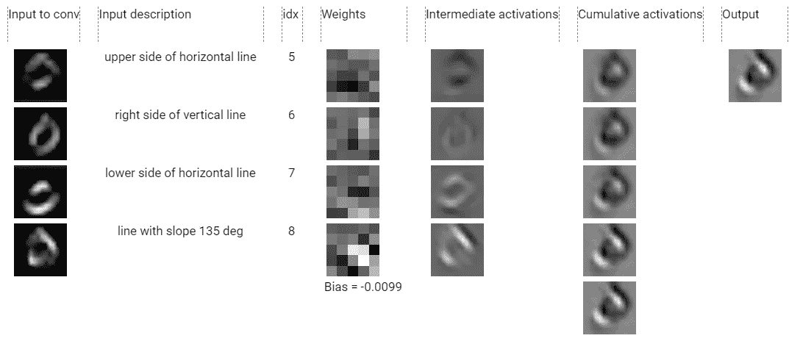

神经网络怎么把图像分类的这么好？尽管在准确性方面取得了很大进展，但我们还无法解释神经网络的内部工作方式。

卷积神经网络(ConvNet)只是简单数学函数的组合——构建块(BB)。这些论坛本身更容易理解，我们可以通过仔细查看它们的参数(权重)和观察它们如何转换输入来了解它们在做什么。

由于每个 BB(大部分)都可以自己解释，而 ConvNet 只是这些 BB 的组合，我们应该能够组合 BBs 的所有小解释，并建立对 ConvNet 如何工作的整个机制的理解，对吗？

这是我想探究的问题。举个简单的例子，我想了解在 MNIST 训练过的 ConvNet 如何对数字图像进行分类，并受训练过的 ConvNet 的启发，**基于更简单的 BBs** 手工构建一个 ConvNet(没有训练),它将模仿原始 ConvNet 的 BBs，但它们会更受约束，因此有望更容易解释。

我从*剖析一个在 MNIST 上训练的 ConvNet* 开始(我称之为 SimpleConvNet ),我发现其中一个**卷积层可以完全省略**,因为它只是复制了前一个卷积层的输出。我还发现了 BBs 的双重性，即 BBs 既被用来检测模式，又被用来检测那些模式的位置。在理解了 SimpleConvNet 的 BBs 之后，我开始用手*构建一个 ConvNet*(我将称之为 HandNet)包含更多约束(因此比使用 backprop 更容易调整)的 BBs。我发现手工制作的 ConvNet 性能要差得多，但经过微调后，它的精度与 SimpleConvNet 不相上下。HandNet 相对于 SimpleConvNet 的优势在于，理解和解释其内部工作方式要容易得多。

在本文中，我将详细解释 SimpleConvNet 的剖析。在第 2 部分中，我将展示我如何使用更多的受限 BBs 来构建 HandNet。

> 如果您想跟随代码，调整代码，或者对您的网络进行类似的剖析，本文有一个 [Colab 笔记本](https://colab.research.google.com/drive/1GqynTl2NhVPMUk3LCOQ91yXGsLf1UmJj?usp=sharing)。

这是文章其余部分的大纲

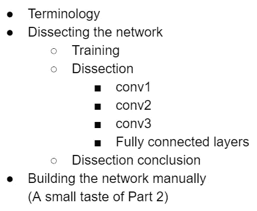

## 术语

首先，我将在本文的其余部分使用一些术语:

我用 [PyTorch 符号](https://pytorch.org/docs/master/generated/torch.nn.Conv2d.html#torch.nn.Conv2d)表示卷积层:输入是形状的( *N* 、 *C* in、 *H* 、 *W* )。输出的形状为( *N* 、 *C* out、 *H* out、 *W* out)。卷积将被说成有 Cin ***内层*** 通道和 Cout ***外层*** 通道。

我将在整篇文章中使用基于 [1 的索引](https://xlinux.nist.gov/dads/HTML/oneBasedIndexing.html),因为它使图表更容易理解。

# 剖析网络

## 培养

我首先用一个相当简单的架构训练了一个 ConvNet，如下所示。

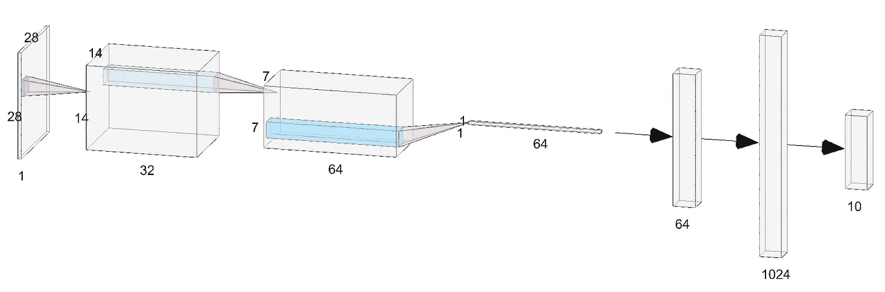

(con v1+relu+max pool)→(con v2+relu+max pool)→(con v3+relu+max pool)→扁平化→ fc4 → fc5 → log_softmax。使用此[工具](http://alexlenail.me/NN-SVG/AlexNet.html)生成的图像。

我主要对剖析卷积层感兴趣，因为全连接层非常简单，因为它们只是实现了线性组合。以卷积为例，我们看到 conv2 权重(形状为[64，32，5，5])将由 64x32=2048 个大小为 5x5 的网格组成。手动标注的网格数量相当大，所以我决定缩小网络的规模。

我反复修剪了 conv 的外通道(见**术语**部分关于*外通道*的解释)。基于下述标准的层:

*   那些活化变异小的。
*   看起来像噪声的那些(与看起来像模式检测器(如 Gabor 滤波器)的那些相对)。

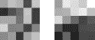

conv1 中看起来像噪声的网格示例(左)与模式检测器示例(右)

*   具有“普通”超刺激的外部通道(超刺激在[曲线检测器](https://distill.pub/2020/circuits/curve-detectors/)的[特征可视化](https://distill.pub/2020/circuits/curve-detectors/#feature-visualization)部分有描述)。

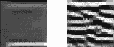

简单超级刺激(左)与具有清晰模式的超级刺激(右)的示例

*   外部通道不会选择性地响应来自 MNIST 的输入或策划的合成输入。

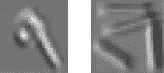

选择性反应的例子。左图:MNIST 数字——conv。选择性地响应数字 9 的对角线部分。右图:策划合成输入——conv。选择性地响应垂直线。

***我修剪了整个外部通道，而不仅仅是一些内部通道，因为在给定的外部通道中只移除一些内部通道会使卷积运算不规则并且有点难看😬。

在每一次剪枝迭代后，ConvNet 的精度略有下降，但重新训练网络很快恢复到剪枝前的精度，这表明许多权重是无用的。修剪去除了无用的权重，这些权重本质上是噪声，并且它使分类的本质更接近表面。希望只有少量的路径用于分类，其余的都是噪音。

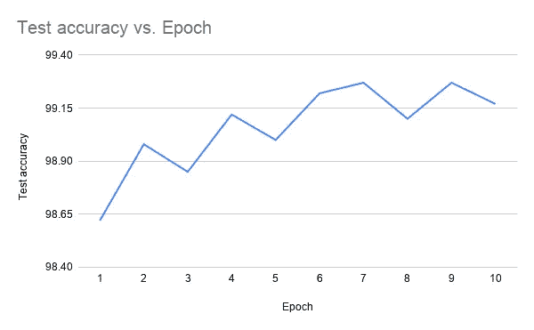

在每一次修剪迭代后重新训练 ConvNet 会恢复修剪前的精度

最终架构(7 次修剪迭代后)如下所示。正如你所看到的，每一层的深度都明显减少了。

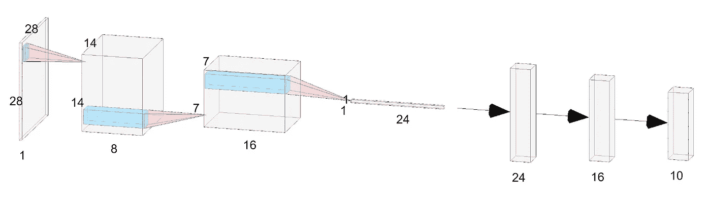

修剪后的最终架构。使用此[工具](http://alexlenail.me/NN-SVG/AlexNet.html)生成的图像。

我们有 3 个 conv 层，接着是扁平化，然后是 2 个全连接(fc)层。(con v1+relu+max pool)→(con v2+relu+max pool)→(con v3+relu+max pool)→扁平化→ fc4 → fc5 → log_softmax

# 解剖

## Conv1

让我们先来看看形状为[8，1，5，5] (8 个外通道，1 个内通道，5×5 网格)的 conv1 的权重:

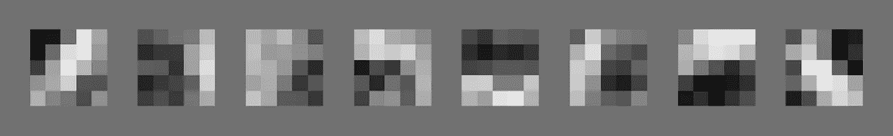

以及它们对 MNIST 随机输入的激活:

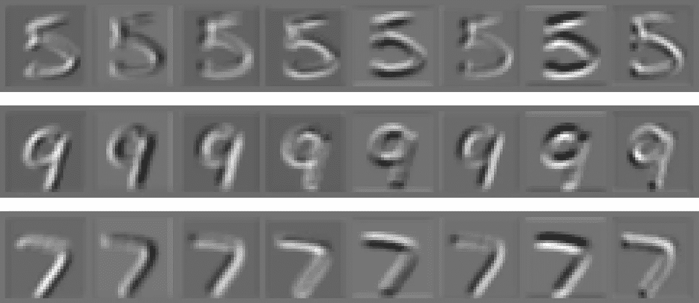

以及它们在合成输入上的激活(在图中，我用一条线代表每个方向:水平、垂直和 2 条对角线):

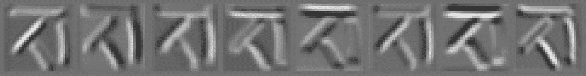

上面的 3 幅图像强烈表明，conv1 中的第一个滤波器检测斜率= 45°的线(从权重可以看出，该模式类似于斜率= 45°的线)。用于角度的坐标框架如下所示:

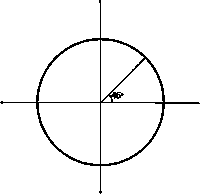

类似地，第二和第三滤波器检测垂直线。不过两者的区别在于第二个滤镜检测的是垂直线的左侧，第三个滤镜检测的是右侧。如果我们对所有过滤器都做这个练习，我们可以从过滤器的索引(从 1 开始)到它检测的模式得到以下映射:

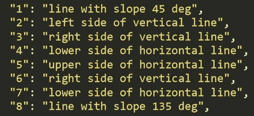

conv1 滤波器说明—从滤波器索引到其检测模式的映射

我们可以看到一些模式是重复的:索引=3 和 6 的过滤器检测相同的“垂直线的右侧”，索引= 4 和 7 的过滤器检测相同的“水平线的下侧”。还要注意，这些过滤器作为一个集合似乎跨越了线方向的整个空间，尽管是一个非常离散的方向(增量为 45 度)。(由以下角度组成的空间:[0，45，90，135])

请记住，conv2 不会直接看到 conv1 的输出。中间有 ReLU 和 MaxPool。因此，当 conv2 发现时，负值和大部分低正值将从 conv1 的输出中消失。

# Conv2

Conv2 形状为[16，8，5，5] (16 个外通道，8 个内通道，5x5 网格)。现在，我们不能只看 conv2 的权重，因为这需要可视化 16*8=128 个大小为 5x5 的滤波器，这有点太多了。此外，conv2 外部通道(有关*外部通道*的定义，请参见“术语”部分)不仅仅是滤波器与图像的卷积(conv1 就是这种情况)，而是这种卷积的线性组合(因为与 conv1 不同，conv2 内部通道不等于 1)，这使得仅通过查看 128 个滤波器很难想象 conv2 的机制。因此，现在，我们将跳过直接可视化权重。相反，让我们开始为 conv2 的每个外部通道(共有 16 个)可视化超级模拟(参见[特征可视化](https://distill.pub/2020/circuits/curve-detectors/#feature-visualization)了解*超级模拟*的定义)。

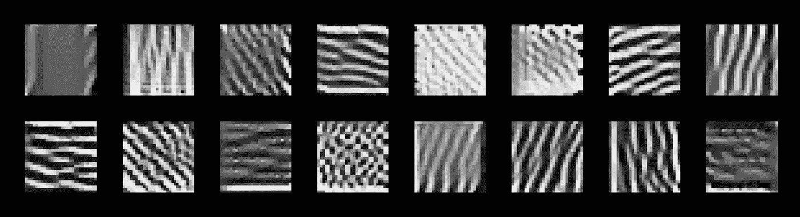

conv2 外部通道的超级模拟

superstimuli 可以提示 conv2 的每个外部通道试图检测的内容。例如，它表示索引=3 的外部通道(我们称之为 conv2_3)正在检测斜率=135 的对角模式。

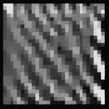

conv2_3 的超刺激

来自 MNIST 的随机输入激活 conv2 外部通道；

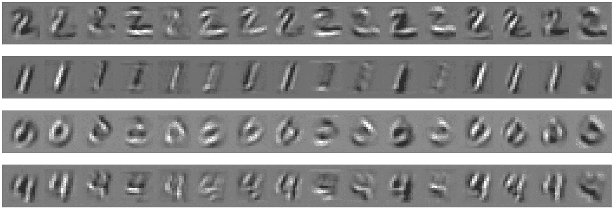

让我们看看 conv2_3 的激活情况。我们已经从它的超刺激中看到，它试图检测斜率= 135°的对角线模式。上面的激活似乎证实了这个假设——只有斜率=135 的数字 0 的对角线部分被这个外部通道突出显示:

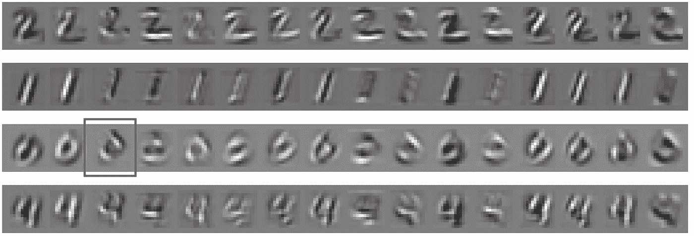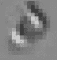

让我们更仔细地看看 conv2_3 是如何实现的:

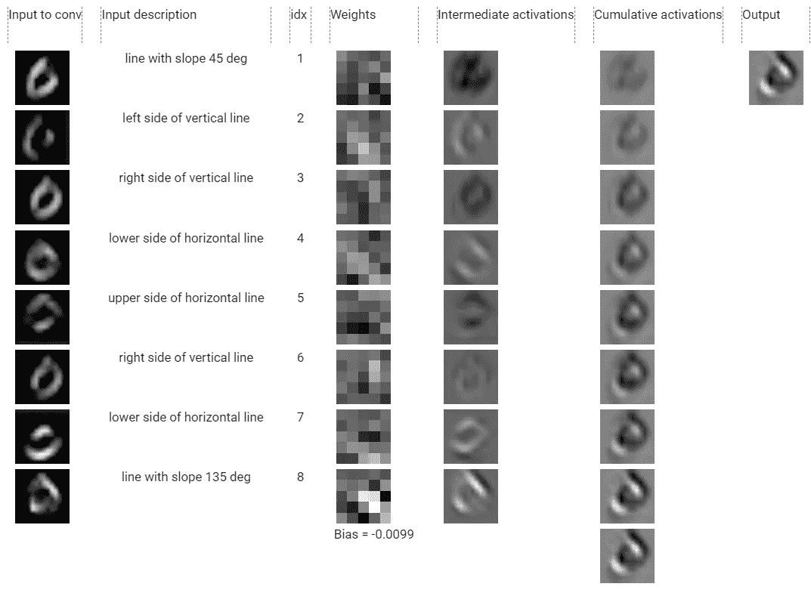

conv2_3 的切割激活

让我解释一下这个庞大的图表。

*   第一列:conv2 的总输入(即 max pool(relu(con v1 的输出))。我们将用 **x_j.** 来表示该列中的行 *j*
*   第二列:我们在上一节中发现的 conv1 的每个外部通道的描述。这个专栏应该描述第一个专栏(尽管它并不完美)。
*   第三列:conv2_3 内部通道的索引(从 1 开始)。
*   第四列:conv2_2 的每个内部通道的权重。我们将用 **w_j.** 来表示该列中的 *j*
*   第五列:该列第*行 j* 是 x_j 与 w_j 的卷积，即**a _ j**= x _ j∫w _ j。( *a* 为激活)
*   第六列:该列第*行 j* 是所有 *a_j* 的累加，即***c _ j***=σa _ k 从 k=1 到 k=j* (c 为累加)。而最后一行是*c _ 8 = Bias+σa _ k 从 k=1 到 k=8* (bias 从第四列最后一行开始)。*
*   *第七列是 conv2_3 的输出。只是复制了第六列的最后一行。我们将把它表示为 **y** 。本质上，conv2_3 只是对其内部通道的各个卷积求和(*x _ j∫w _ j)**

****为了便于比较，每列内的色标都进行了重新标准化。(因此，第五列和第六列的第一行实际上具有相同的值，但它们看起来不同，因为对它们应用了不同的颜色标准化)。*

*让我们开始分析每一行。*

*   **a _ 1 = x _ 1∫w _ 1*没有传达任何意义，通过查看conv2_3 的总输出，即 *y* ，，看起来 *a_1* 对 *y* 没有任何影响。这很有可能是由于 *a_1* 被其他 a *_j* 的淹没，所以我们忽略这一行。*
*   **w_2* 好像检测到斜率=135 的线*。通过查看*a2*我们看到这是真的，但是*a2*非常弱，因此我们看不到*a2*对总产量 *y* 的贡献。我们也将忽略这一行。**
*   *通过查看 *a_3* ，似乎索引=3 的行正好否定其输入 *x_3* ，即“垂直线的右侧”。它通过在其权重网格(第 4 列，第 3 行)的中心附近有一条强负垂直线来实现这种否定。所以我们将 *a_3* 的描述表示为 *neg(“垂直线右侧”)。**
*   **a_4* 是对 *y* 的第一次重大贡献。你可以看到从*C4*开始，它下面的所有东西都有两个亮点，它们出现在 *y* (斜率=135 的数字 0 的部分)*。w_4* 只寻找斜率为 135 的线，这与其输入 *x_4，*重叠，因此斜率为 135 的线在 *a_4 中高亮显示。*所以我们只是在 *a_4* 中看到更多的“坡度为 135 度的线”。*

**** ( *x_4* 的描述是*“*水平线的下侧”但是在这个特定的图像中，conv1_4 似乎检测对角线——你永远无法用神经网络\_(ツ)_/ 100%确定。实际上，如果您仔细观察 conv1_4 的权重(如下所示)，它有一个非常模糊的提示，即它正在检测斜率为 135 的线(下图中突出显示)。我把这些类型的模式称为 conv 的次要功能。过滤器*。我将主要省略这些，只关注主要的，因为它们通常比次要的更强。但我们必须时刻牢记，除了 conv，可能还有第二种，甚至更多的模式。过滤器检测)。**

*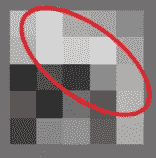*

*conv1_4 的辅助功能*

*我们已经完成了 conv2_3 的一半。我将复制 conv2_3 解剖图，以便您可以少滚动一点:)*

**

*conv2_3 的切割激活*

*   *第 5 行: *w_5* 通过在 *w_5* 网格中有一条与 *x_5* (即“水平线的上侧”)匹配的强负水平线来否定 *x_5* 。我们将 *a_5* 的描述称为 *neg(“水平线的上侧”)。**
*   **w_6* 看起来像是检测竖线，但是不明确。*a6*看起来也不是很强，因此它对 *y* 没有显著贡献，因此我们也将忽略这一行。*
*   **w_7* 有一条水平亮线，因此很可能检测到再次与其输入 *x_7* (“水平线的下侧”)匹配的水平线。净贡献 *a_7* 是复制的 *x_7* ，但与其他*a _ j**相比，此贡献较弱，这可以从第 5 列中其褪色的颜色看出。因此，我们将该行标记为弱行(“水平线的下侧”)。**
*   **最后一行是迄今为止最重要的贡献，您可以从剖析的激活列中看到。它对净输出 *y* 的影响最大。*A8*的大小比其他*A8*的大得多，因为*w8*的大小(和对比度)比其他*w8*的大得多。从*w8*的网格中可以看到(如下所示)，它在负值和正值之间具有非常高的对比度(周围有非常亮和非常暗的斑点)，因此它有非常强的趋势更重要的是， *w_8* 试图检测的模式与其输入匹配(再次！) *x_8* 即“坡度为 135 度的线”。这只是加强了由 *x_8* 检测到的模式，并且我们在 *a_8 中看到对斜率为 135 的线的非常强的选择性。***

*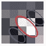*

*w_8。正值用红色圈出，负值用蓝色圈出。正负数值的排列形成一条斜率=135 *的线。因此，该滤波器强烈响应斜率=135 *的线*。**

*我们已经分析完了每一行。现在让我们把它们放在一起。*

*   *我们忽略了第 1、2 和 6 行*
*   *第 3 行是 *neg("垂直线右侧")**
*   *第 4 行是“斜率为 135 度线”*
*   *第 5 行是负数(“水平线的上边”)*
*   *第 7 行弱(“水平线的下侧”)*
*   *而第 8 排是**强**(“坡度为 135 度的线”)*

**y* 变成 y = 0 + 0 + *neg("垂直线右侧")+* "坡度 135 度的线"+ neg("水平线上侧")+ 0 +弱("水平线下侧")+ **强**("坡度 135 度的线")+偏*

*其中 0 表示行 1、2 和 6 的贡献可以忽略。让我们简化一下:*

> *y = *neg("垂直线的右边")+* neg("水平线的上边")+ weak("水平线的下边")+ **strong** ("斜率为 135 度的线")*

*其中来自第 4 行的贡献被归入第 8 行的贡献，我们忽略偏差，因为它只是将所有值移动了某个常数。如果我们看一下 *y**

*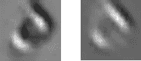*

*左:y，右:A8*

*我们看到每行都有一些贡献，但它们的大小都不同。到目前为止，*A8*的相对大小是最强的，所以它最终支配了对 *y* 的其他贡献。并且 ***y* 最终看起来很像 *a_8* 。ReLU 和 MaxPool 应用于 conv2 后，** *y* 和 *a_8* 会更加相似。所有负值在 ReLU 之后都会消失，所以我们不会看到 *y* 中的黑点。*

*从剖析 conv2_3 中我们发现了什么？两件事:*

1.  ***许多内部通道试图复制它们的输入**，即 *w_j* 的模式通常与 *x_j* 的模式相似。当 *w_j* 检测到的模式与 *x_j* 的描述非常匹配时，我们在第 4、5、7 和 8 行看到了这种情况。*
2.  ***对总产量的强贡献只有一个**。基本上所有其他行都是噪音，我们可以只处理最后一行。*

*conv2_3 只是一个例子。我们可以分析 conv2 在不同输入上的其他外部通道，您可以在 [Colab 笔记本](https://colab.research.google.com/drive/1GqynTl2NhVPMUk3LCOQ91yXGsLf1UmJj?usp=sharing)中完成。在解剖了其中一些之后，我发现这些 *2 的发现在其他 conv2 外部通道中也基本成立。*例如，参见 conv2_6 和 conv2_9 的 Colab 中检测水平线的解剖；以及检测垂直线的 conv2_13。*

*关于 conv2，我们一般能得出什么结论？基于这两个发现，只有一个来自内部通道的强贡献，并且该贡献模仿 conv1 的输出之一(因为内部通道复制其输入)。这意味着 conv2 的外部通道大部分时间的功能只是放大 conv1 的一个输出，conv2 的总输出最终只是一串放大的 conv1 输出。*

*我们可以完全省略 conv2 吗？我认为是的，因为 conv2 并没有在 conv1 的基础上增加任何新的东西。当然，有一个额外的冗余层可能是有益的，也许 conv2 层可以检测到我们无法从上面的分析中推断出的某些高频模式，但我认为对于像 MNIST 分类这样简单的任务来说，没有必要。*

# *Conv3*

*现在，我们将剖析最终的卷积层。让我们比较一下 conv3 和 conv2 的权重分布。下图左侧是 conv2 权重的随机样本，右侧是 conv3 权重的随机样本。*

*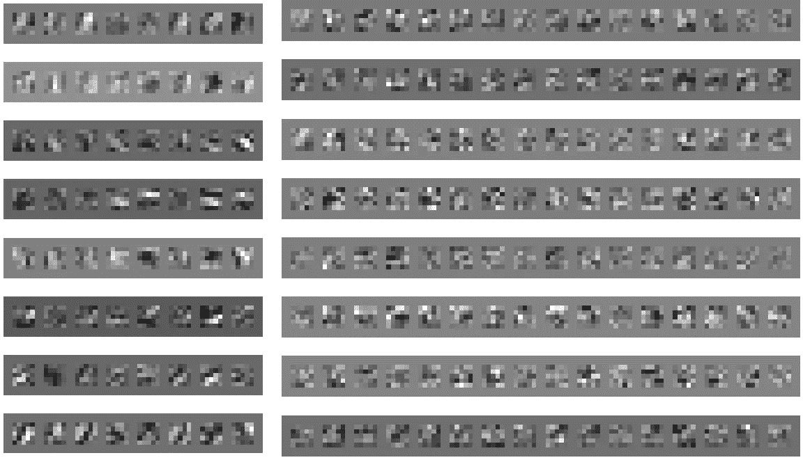*

*左:conv2 砝码，右:conv3 砝码*

*如果你仔细观察权重，你可以看到 conv2 有很多权重(网格)，形成类似 [Gabor 滤波器](https://en.wikipedia.org/wiki/Gabor_filter)的模式。其中一些如下所示*

*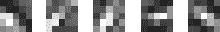*

*然而，conv3 的这类滤波器相对较少。相反，conv3 的大多数网格都有**“像素爆发”**，在灰色网格值中有一两个非常亮或非常暗的像素。这些过滤器类似于椒盐噪声。下面是一些例子*

*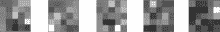*

*这种像素突发滤波器的目的是什么？理论上，当卷积的输入在相同位置具有类似突发时，在网格中的特定位置具有小突发的滤波器应该最大程度地激活。这可能意味着 **conv3 像素突发滤波器在网格内的特定位置寻找来自 conv2 的激活。***

*爆发的位置可以用[ *α，d]* 来描述，其中 *α* 是角度(下方时钟指针的方向) *d* 是距中心的距离。此外，我们可以使用+或-符号来表示脉冲是正的还是负的。例如，上面的第二个过滤器查找 7:30 的激活。使用上面描述的符号，上面的过滤器寻找+[7:30，2√2]，这意味着它在角度=7:30 点和距离 2√2 处寻找正激活。*

*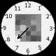*

*conv3 输入(7x7)几乎与 conv3 权重滤波器(5x5)大小相同(conv3 输出大小为 3x3)，这一事实支持了我们关于突发用于选择激活位置的假设。让我来解释一下。*

*在最常见的卷积情况下，卷积运算的输入维数比滤波器的维数大得多。例如，输入可能是 28x28，过滤器可能是 5x5。在这种情况下，滤波器只看到输入的一小部分，并且滤波器充当[等变](https://youtu.be/rTawFwUvnLE?t=1446)模式检测器。然而，对于我们的 conv3，输入大小(7x7)与滤波器大小(5x5)几乎相同。因此，滤波器具有几乎 100%的感受野，当您将滤波器覆盖在输入上，并考虑滤波器将对该输入做什么时，滤波器会在滤波器具有高值的位置寻找激活，这有点道理。*

*因此，当输入尺寸近似等于滤波器尺寸时，滤波器的功能从**模式检测**变为**位置检测**。这就是我们 SimpleConvNet 中卷积滤波器的双重性(**)——卷积用于检测模式及其位置。***

****此外，请注意 conv3 之后有 ReLU 和 MaxPool (3x3 ),之后 MaxPool (1x1)的输出被传递到完全连接的层。因此，conv3 输出的重要之处在于 3x3 网格内的最大值。最大值和其他负值的位置被忽略。虽然在执行加法*c _ j =σx _ k∫w _ k*的中间步骤中，最大值和负值的位置很重要。*

*为了对 conv3 滤波器的位置选择性而非模式选择性进行某种确认，我们来看看几个合成输入的激活情况。*

*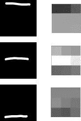*

*各种合成输入上的 conv3_21 输出*

*左边是合成输入，右边是 conv3 的第 21 个外部通道的输出。相同的图案(水平线)呈现在相同外部通道的不同位置。外部通道对水平线的响应不一致。这个外部通道的激活取决于图案的位置。当水平线在图像中间时，激活度最高。另一方面，conv3 的第 6 个外部通道检测图像顶部的水平线:*

*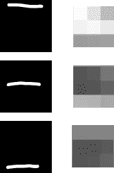*

*各种合成输入上的 conv3_6 输出*

*我们现在将重点关注 conv3_6。一些支持证据表明 conv3_6 在图像顶部寻找水平线:*

*   *下图显示了 MNIST 最大程度激活 conv3_6(应用 ReLU 和 MaxPool 后)的前 20 个输入。*

*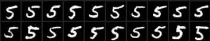*

*最大程度激活 conv3_6 的前 20 个输入*

*   *下面也是来自 MNIST 的随机输入和它们相应的 conv3_6 激活。数字 9、6 和 5 的激活很强。但是对数字 7 的激活不是很强。我们将在后面看到，conv3_6 不仅在顶部寻找水平线，而且 conv3_6 还是其他检测器的组合。其中，有一些抑制其激活的“反模式”。数字 7 的对角线部分可能是抑制因素之一。当我们分析 conv3_6 如何处理数字 7 时，我们将对此进行验证。*

*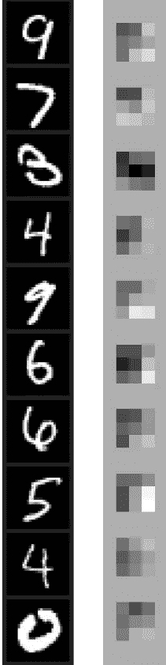*

*   *conv3_6 的超级模拟如下所示。这不是 100%的结论，但至少有一个轻微的暗示，它正在寻找图片顶部的水平线*

*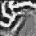*

*conv3_6 超级刺激*

*现在我们已经看到了一些证据，表明 conv3_6 在图像顶部寻找水平线，让我们分析一下外部通道是如何实现这种位置选择性的。我们将首先剖析数字 5，因为这是 MNIST 数据集中最大程度激活 conv3_6 的数字。下面是输入和分解的 conv3_6。*

*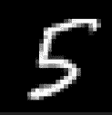**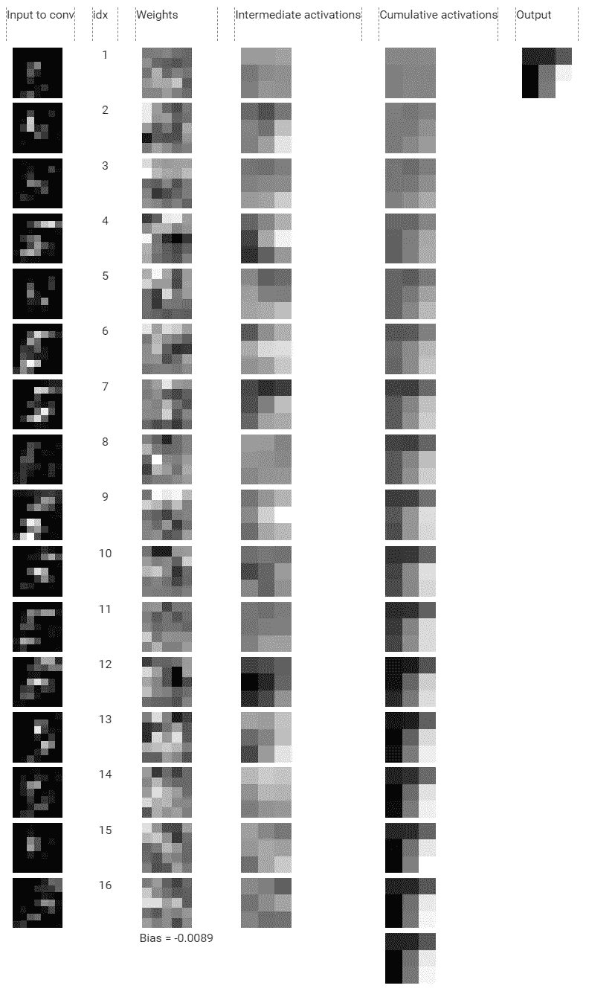*

*我们将查看每一行的权重(使用索引作为标识符),并使用前面定义的时钟符号*

*   *索引 1 是不明确的，所以我们将跳过它。*
*   *指数 2 寻找+[10，2√2]和-[8，√5]的模式。它的输入看起来像是数字 5 的垂直部分，所以这个内部通道喜欢 10 点钟方向的垂直线，但不喜欢 8 点钟方向的垂直线。*
*   *索引 3 的输入有点模糊，所以我们将跳过这一个。*
*   *指数 4 是对总产出的最大贡献之一。它有+[1，√5]，+[9，2]和-[3，1]。它的输入是水平线检测器的输出，所以索引 4 喜欢 1 点和 9 点位置的水平线，不喜欢 3 点位置的水平线。**我认为这解释了 conv3_6 如何检测顶部**的水平线:1 点钟位置的水平线激励这个内部通道，9 点钟和 3 点钟位置的水平线分别激励和抑制激活，从而相互抵消。请注意，索引 7 与索引 4 有些相似之处。*
*   *对于其他行，您可以遵循这个分析，因此我将跳过无聊的行，专注于最强的贡献。*
*   *指数 9 在 12 点钟方向有一个巨大而明亮的斑点。它的输入也是水平线，所以我们看到顶部水平线的**大贡献。***
*   *指数 12 在中心附近有一个巨大的黑色斑点。它的输入也是水平线，因此我们看到来自中间水平线的**大*负*贡献**。*

*总的来说，顶部的水平线有很大的贡献，中间的水平线有很大的不喜欢，不同位置的其他图案有一些小的贡献。*

*让我们快速地对数字 7 做同样的剖析。*

*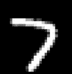**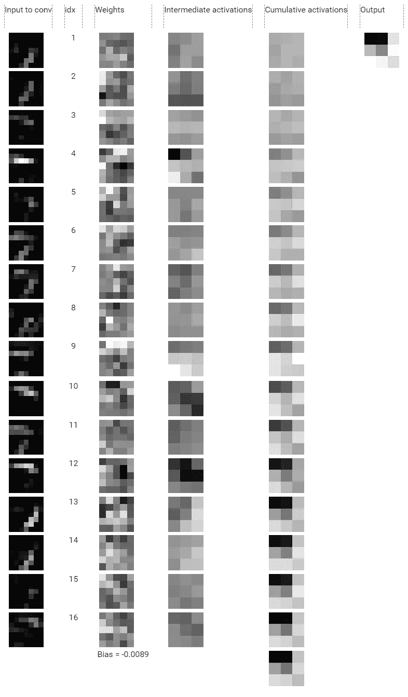*

*上图中的亮点:*

*   *索引 4 和 9 通过检测顶部水平位置再次起作用。*
*   *指数 12 不喜欢靠近中心的水平部分，但在这个特定的图像中，这是一个错误的不喜欢，因为更靠近顶部的数字 7 的水平部分最终与权重中的负斑点重叠。*
*   *索引 13 对数字 7 的对角线部分有一点贡献——它喜欢中心的对角线，不喜欢 1 点和 9 点位置的对角线。*

> *我希望上面的 2 个剖析至少在某种程度上让您相信 conv3_6 更喜欢图像顶部的水平线，它通过在检测水平线的输入顶部叠加“像素突发”样式的过滤器(突发靠近网格顶部)来实现这种选择性。*

**conv3 结论:*解剖了很多 conv3 外通道，我学到了什么？一个 conv3 外部滤波器不仅仅代表某个位置的一种模式，而是不同位置选择的组合，不一定是同一模式。例如，conv3_i 可以在+[12，2]，-[6，2]处寻找水平方向的组合；以及在中心具有 45°斜率的线和在+[3，2]处的垂直线。*

*我们在上面对 conv3_6 的两次剖析中也看到了这一点——除了顶部水平线的主要贡献之外，还有其他贡献，如 10 点钟方向的垂直线。conv3_6 总结了所有这些贡献。**所以 conv3_6 是对各种模式的各种位置选择性的混合。***

*我们已经学完了卷积层，现在我们来看看全连接(fc)层。*

# *完全连接的层*

*我们的 SimpleConvNet 在 conv3 之后有两个完全连接的层:fc4 和 fc5。*

*我们看到每个 conv3 神经元在不同位置检测不同模式的组合。我们希望 fc4 和 fc5 层以某种方式使用这些信息对图像进行分类。他们可能会组合这些特性，或者将每个组合分解成更有用的特性。*

*FC 层非常简单，只是一个矩阵乘法，但是很难理解。本质上，一个 FC 层只接受一个向量并产生另一个向量，其中输出向量中的条目是输入向量中条目的线性组合。此操作的二次方复杂性正好压倒了理解一个 FC 层的内部工作的任何尝试。*

*鉴于 FC 层包含太多参数，我没有尝试进一步分析它们。我的直觉是，conv3 层输出已经很好地将高维空间中的图像划分为不同的类别。FC 层只是扩大了类别之间的界限，这样就更容易对图像进行分类。*

*考虑 FC 层的另一种方式是，它们只是从 conv3 转换位置选择性的基础。也就是说，它们将位置选择性的交织组合转换为“标准”基础，其中有用的要素位于正交轴上。*

*如果我们在 FC 和 conv3 层上使用 PCA 和 t-SNE 等可视化技术，您可以看到 conv3 层确实已经很好地将数据集分成了不同的类，FC 层进一步改善了这种分离。以下是 PCA 和 t-SNE (3D)投影的屏幕截图:*

*   *原始 28x28 输入图像。*

*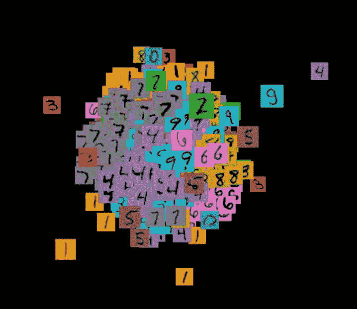*

*原始投入预测*

*   *1x1x24 conv3 输出。*

*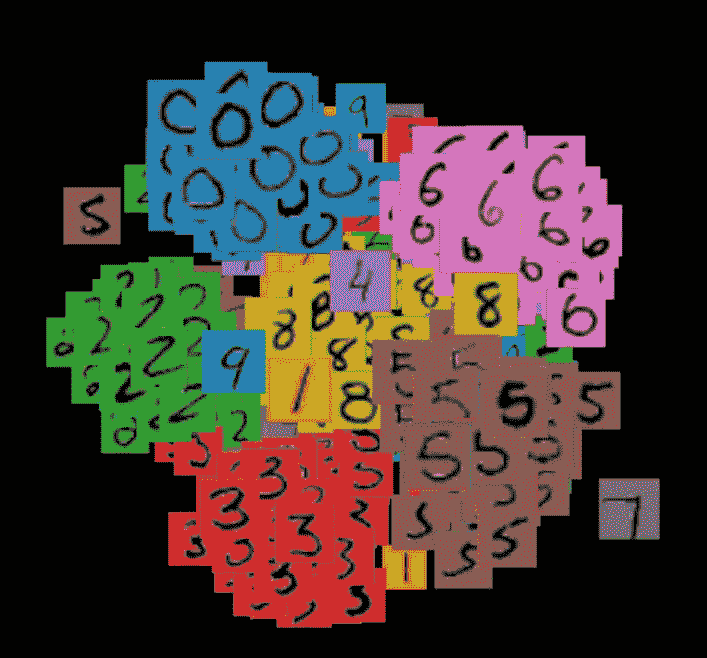*

*conv3 预测*

*   *1x1x16 fc4 输出*

*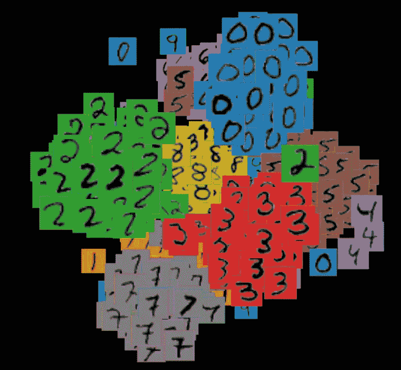*

*fc4 预测*

*   *以及 1x1x10 fc5 输出，这是网络的最后一层(在 softmax 之前)。*

*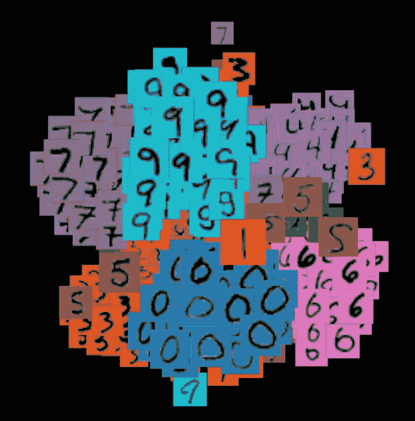*

*fc5 预测*

*你可以在 [Colab 笔记本](https://colab.research.google.com/drive/1GqynTl2NhVPMUk3LCOQ91yXGsLf1UmJj?usp=sharing)中找到投影的互动 3D 版本。*

# *解剖结论*

*我们看到 conv1 只是实现了一个非常简单的模式(线)检测器。它只检测不同角度的线条。Conv2 试图放大 conv1 的输出，因此它实际上没有增加任何新内容，我们可以忽略它。Conv3 为 conv1 检测到的模式选择位置。这是通过使用权重过滤器的双重性相当优雅地实现的。在 conv3 之后，我们能够在图像的不同位置检测不同角度的线条。但是这些检测并没有分开，也就是说，我们没有一个神经元(来自 conv3)只检测图像顶部的水平线，相反，它们是交织在一起的——con v3 的每个神经元都检测这种位置选择性的混合。*

*全连接(FC)层的工作是解开和/或组合这些混合物，以便将纠缠的混合物转换成用于分类的有用特征(如顶部、中间和底部的水平+10 点和 4 点的垂直组成数字 5)。FC 层可能使用某些组合/纠缠之间的相关性来对数字进行分类。*

*我相信我们 SimpleConvNet 的**黑盒性质**(无法解释决策)来自于 conv3 中位置选择的纠缠。如果我们能够解开位置选择性(就像 FC 层那样，但它们本身并不太容易理解)，我们将会得到一个完全可以解释的网络。我在[第二部分](https://medium.com/@nazar.ilamanov/explainable-mnist-classification-part-2-building-a-convnet-by-hand-2b273596a40f?source=friends_link&sk=a1052a506455dc671f206c611d88e3fb)的目标是**从零开始建立这样一个完全可解释的网络**。*

*从某种意义上来说，conv3 在向量不佳的地方选择了错误的基(它们是交织在一起的)，我们的工作是通过选择我们感兴趣的方向变得正交的基向量来使 conv3 变得可解释，以便位置选择性变得完全交织在一起——孤立而不是位置选择性的混合。有没有一个矩阵可以将 conv3 原始输出转换成一个很好的基？这是一个我还没有探索过的问题。*

# *手动构建网络*

*我们将在[第二部分](https://medium.com/@nazar.ilamanov/explainable-mnist-classification-part-2-building-a-convnet-by-hand-2b273596a40f?source=friends_link&sk=a1052a506455dc671f206c611d88e3fb)中建立手动检测 MNIST 数字的网络。在这里，我将简要概述第 2 部分的内容。*

## *第 2 部分的一点小味道。*

*我们制作了一个手工分类器。我们可以省略 conv2，因此我们只需在手工分类器中用 conv3 构成 conv1。为了使这里的讨论与解剖讨论保持一致，我将继续使用相同的卷积数。也就是说，conv3 会直接跟在 conv1 后面(我不把 conv3 重命名为 conv2)。*

***更受约束的积木**。我们用非常有限的版本模拟 conv1 和 conv3，这将使解释它们的决策变得容易。**它们实际上可以自动化**——不需要人工检查！受约束的版本将是权重的参数化栅格，即在栅格上绘制的参数化曲线。*

*例如，下图显示了具有各种斜率和西格玛参数的参数线。我们使用这些网格作为 conv1 层的权重。当我们训练 conv1 时，我们只允许调整 slope 和 sigma 等参数，而不是在通常的训练中对整个网格进行自由形式的调整。这样我们就可以**使用参数自动解释**con v1 的决策。*

*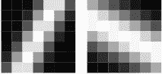*

*用作 conv1 权重的参数线。左:斜率=1.5，西格玛=0.3。右图:斜率=-0.5，西格玛=0.6*

*我们使用“参数突发”作为 conv3 的权重，con v3 也用几个参数进行参数化。训练时只允许调整参数。*

*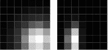*

*参数突发用作 conv3 的权重。左:mean_x=0.6，mean=-0.7，sigma_x=0.7，sigma_y=0.7。右:mean_x=-0.4，mean_y-0.7，sigma_x=0.3，sigma_y=0.7。*

*使用这些权重的约束版本，我们首先构建一组 conv1 检测器，用于检测我选择的各种线。然后，我们在 conv1 之上构建 conv3 层，用于检测 conv1 模式的位置。然后，我们将 conv3 输出组合成一个数字。例如，要检测数字 5:*

*   *使用参数线为水平线和垂直线构建 conv1 检测器。*
*   *使用参数突发为图像顶部、图像中部、图像底部、图像 10 点钟位置和图像 4 点钟位置构建 conv3 检测器。*
*   *将 conv1 检测器输入 conv3 检测器，并按如下方式合并结果*

*数字 5 =顶部(横线)+中部(横线)+底部(横线)+ 10 点(竖线)+ 4 点(竖线)。*

*这只是第 2 部分的一个预览。我正在撰写第 2 部分，敬请关注。如果您想在第 2 部分准备就绪时得到通知，您可以[提供您的电子邮件](https://medium.com/@nazar.ilamanov/explainable-mnist-classification-part-2-building-a-convnet-by-hand-2b273596a40f?source=friends_link&sk=a1052a506455dc671f206c611d88e3fb)。*

# *试试吧！*

*如果你想重现文章中的人物，这里有一个[笔记本](https://colab.research.google.com/drive/1GqynTl2NhVPMUk3LCOQ91yXGsLf1UmJj?usp=sharing)。您还可以调整代码或对您的网络进行类似的剖析。*