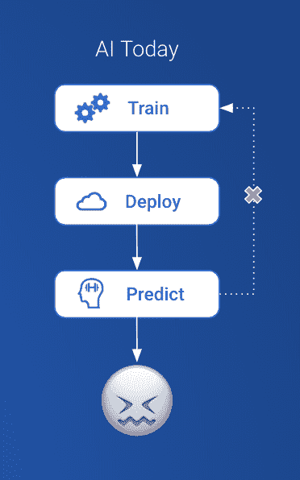
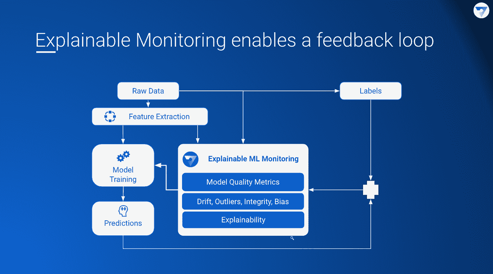
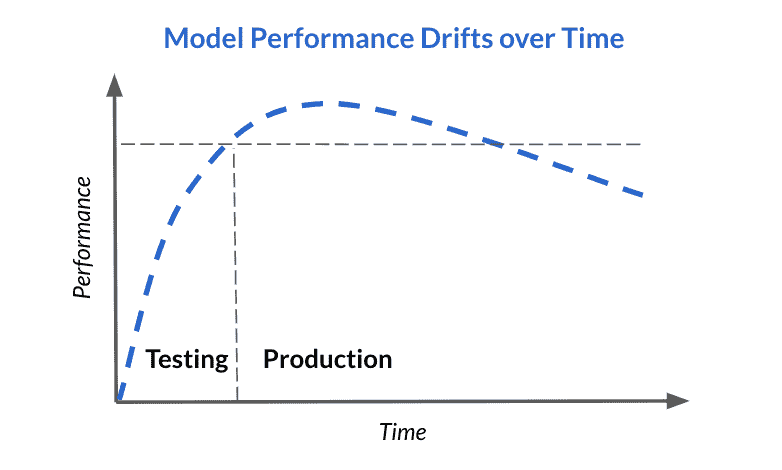
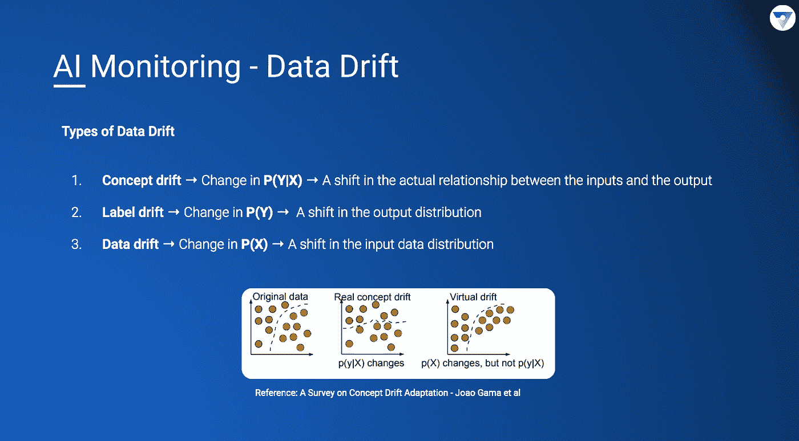
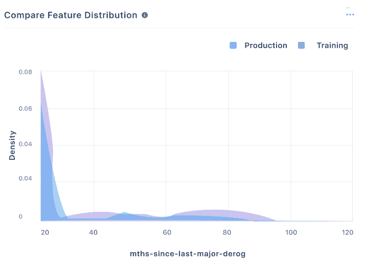
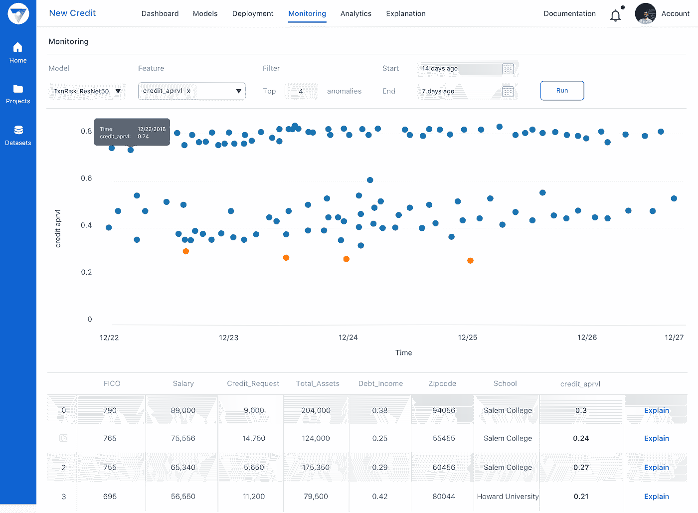
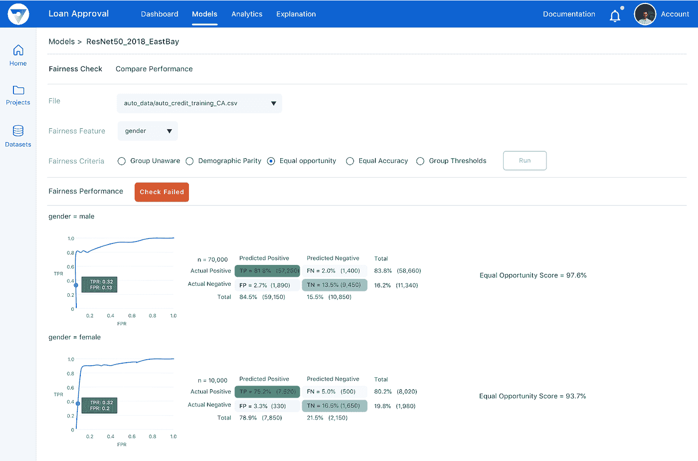

# 可解释的监控:停止盲目飞行，监控你的 AI

> 原文：<https://towardsdatascience.com/explainable-monitoring-stop-flying-blind-and-monitor-your-ai-4e27898f1b9?source=collection_archive---------47----------------------->

## *数据科学团队发现可解释的监控对于管理他们的人工智能至关重要*

*照片由*[布鲁斯·沃林顿](https://unsplash.com/@brucebmax) *上* [*下*](https://unsplash.com/s/photos/people?utm_source=unsplash&utm_medium=referral&utm_content=creditCopyText)

我们生活在一个前所未有的时代，短短几周时间，全球许多人和企业的生活发生了翻天覆地的变化。随着新冠肺炎在全球展开翅膀，夺走生命，我们看到失业率和小企业破产率创下新高。

***那么，这种低迷如何影响一个*** [***正在使用 AI 的企业***](https://www.americanbanker.com/opinion/ai-models-could-struggle-to-handle-the-market-downturn) ***？***

如今，AI 越来越多地被各行各业的公司应用，但 AI 并不是最容易操作的技术。大多数生产人工智能系统是随着时间的推移有机积累的专有、开源和基于云的技术的拼凑物。然而，在过去的几年里，出现了基于 GUI 的人工智能工具和开源库，以帮助不太倾向于内部构建、成功训练和部署人工智能模型的企业。

随着这些工具的出现，公司已经意识到培训和部署人工智能只是第一步- **然后他们必须监控和管理他们部署的模型，以确保无风险和可靠的业务成果**。随着更高性能的黑盒模型的兴起，治理这些模型的需求变得更加必要，也更具挑战性。越来越多的公司认识到:

***“训练和部署 ML 模型是相对快速和廉价的，但是随着时间的推移维护、监控和治理它们是困难和昂贵的。”***

事实上，由于部署后输入数据的变化，模型的性能会随着时间的推移而降低，因此模型需要持续监控，以确保它们在生产中的保真度。虽然许多现有的监控技术提供了实时问题可见性，但它们通常不足以识别复杂人工智能系统中问题的根本原因。

# 缺乏反馈回路

大多数组织在发现生产 ML 系统的问题时已经太晚了，损害已经造成。在某些情况下，生产问题可能持续存在而未被发现，直到由 ML 系统驱动的最终业务指标下降。

今天的大部分人工智能是不受监控的(图片由作者提供)

企业可以通过监控领先指标(包括预测和特征漂移以及输入数据错误)来提前发现潜在问题，而不是依赖下游业务指标作为上游模型性能问题的指标。跟踪这些领先指标并能够识别意外变化，使 ML Ops 团队能够实时进行调查，而不是在事后进行调查。但是仅仅跟踪正确的度量标准只能解决一半的问题。一旦检测到转移，应尽快进行调查或根本原因分析。为了确保快速准确的根本原因分析，**人工智能可解释性**可用于帮助确定问题的根本原因以及应采取的行动过程(例如，根据新数据重新训练模型，修复数据管道)。

***结合起来，跟踪模型性能问题的领先指标，利用 AI 可解释性帮助从业者理解问题背后的“为什么”，构成了一种新的范式，称为可解释的 ML 监控。***

一个可解释的监控系统的架构(图片由作者提供)

# 传统监控解决方案中的差距

今天，有两种主要的方法来监控生产软件:

*   DevOps 使用服务或基础架构监控来获得广泛的运营可见性和服务运行状况。
*   业务所有者通过遥测技术监控业务指标，以跟踪业务运行状况。

不幸的是，这些方法不适合 ML 系统，ML 系统的性能与传统软件系统的性能不同，具有不确定性，取决于各种因素，如季节性、新用户行为趋势以及通常非常高维的上游数据系统。例如，当新的假日季节到来时，一个功能完善的广告模型可能需要更新。类似地，一个在美国被训练用来显示内容推荐的模型，对于国际注册用户来说可能不太好。

AI 的出现带来了对模型性能监控的需求(图片由作者提供)

# 模型监控的独特挑战

**1。模型衰减。**与其他软件不同，ML 模型的性能会随着时间而衰减。对正确模型结果的监控，当可用时，提供即时的业务影响变更通知。能够监控模型衰退将帮助我们知道是否是时候刷新模型了。

模型性能随时间漂移(图片由作者提供)

**2。数据漂移。**尽管 ML 模型是用特定数据(如年龄 20-60 岁)训练的，但它们在生产中可能会遇到不同的数据(如年龄 60-80 岁)，因此会做出次优预测。

漂移的类型(图片由作者提供)

**3。数据完整性。**业务数据是动态的，其构成也在不断变化。这可能会对 ML 模型产生不利的性能影响，尤其是对于自动化数据管道。在已部署的人工智能系统中，数据不一致常常会被忽视。

特征分布截图(图片由作者提供)

**4。离群值。**部署的 ML 模型可能会遇到远离训练分布的数据。这些异常值会导致难以全局调试的孤立的性能问题。实时查明这些问题有助于立即解决问题。检测异常值是一个具有挑战性的问题，因为有多种技术可以应用，并且多年来已经得到了很好的研究。它在 ML 模型性能的环境中变得更具挑战性，因为我们需要将异常值作为跨大量变量的多变量分析问题进行研究，并查看其对模型行为的影响，即确定它是否会导致模型行为异常。

模型监控截图(图片由作者提供)

**5。******。**即使在监测数据变化后，尽管进行了模型验证，但其对保护组的真实影响可能会发生变化，即 ML 模型在部署后可能会出现偏差。第一道防线可能是在训练过程中丢弃受保护的属性(例如，种族、性别等)，但是由于与受保护的属性高度相关的其他特征，模型也可能表现出偏差。我们需要的是围绕公平性的模型的连续跟踪，其中这些度量是动态和实时计算的。偏见的定义(机会均等、结果均等等)可能因组织和问题的不同而不同，因为公平没有统一的定义。因此，我们应该能够支持一个可插拔的策略，并持续执行它来检测任何潜在的偏见问题。如果检测到偏差，深入分析原因以确定模型是否需要更换或是否存在数据管道问题非常重要。**

****

**车型评测截图(图片由作者提供)**

# **什么是可解释的监控？**

**强大的人工智能监控系统需要与服务基础设施的模型集成，以防范上述 5 种运营挑战。它允许用户轻松查看实时监控的输出，以发现 KPI 和其他问题，或者对警报采取行动。调查已标记的操作性 ML 问题通常需要付出大量努力。ML 模型的黑盒性质使得 ML 开发人员很难理解和调试它们。**

**一个可解释的 ML 监控系统扩展了传统监控，提供了具有可操作步骤的深度模型洞察。通过监控，用户可以了解问题驱动因素、根本原因，并分析模型以防止问题重复出现。这有助于节省大量时间。**

**我们认为这样的系统应该展示 3 个关键特性:**

****综合**。一个可解释的 ML 监控系统应该覆盖模型性能和性能指标本身的所有主要指标。除了统计上的全面，一个理想的可解释的 ML 监控系统为技术(模型开发者，ML Ops)和非技术(分析师，企业所有者)利益相关者提供直观的用户界面。**

****可插拔**。团队应该能够将监控系统与现有数据和人工智能基础设施以及最常见的开源 ML 框架(Scikit-Learn、PyTorch、Tensorflow、Spark 等)相集成，以快速看到可操作的结果。**

****可操作的**。用户应该能够获得生产问题背后的可操作的见解。带有更深入分析的实时解释对于快速揭示模型行为的“为什么”和“如何”至关重要。获得大量警报会产生噪音，因此系统允许用户进行必要的控制，以便只为需要采取行动的班次配置警报，这一点非常重要。**

**与人工智能相关的金融风险是巨大的。信任是赌注的一部分，失去比得到更容易。我们已经看到像新冠肺炎这样的黑天鹅事件会给企业带来什么。如果你的人工智能产品不受监控，你可能会向你的客户传达错误的决策。可见性，因此，将是极其重要的！**

**这就是为什么我们决定开始[提琴手。AI](http://www.fiddler.ai) 并提供了我们认为可以帮助弥合差距的系统。欢迎发送电子邮件至 [info@fiddler.ai](mailto:info@fiddler.ai) ，了解更多信息。**

***原载于 2020 年 4 月 13 日*[*https://blog . fiddler . ai*](https://blog.fiddler.ai/2020/04/explainable-monitoring-stop-flying-blind-and-monitor-your-ai/)*。***