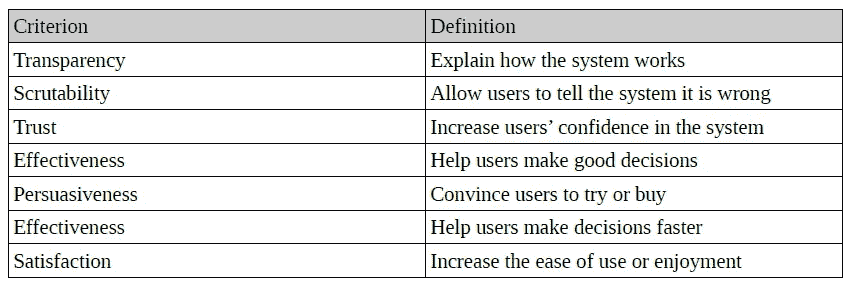
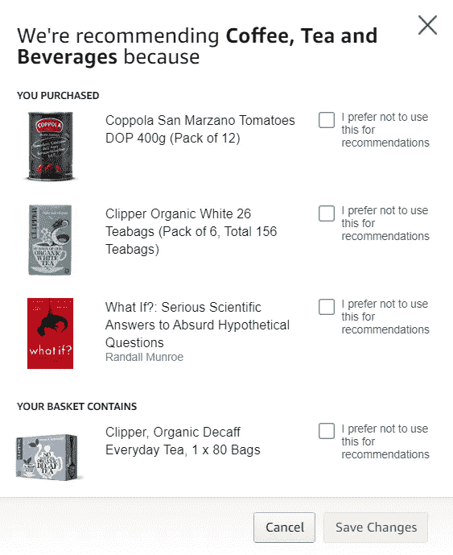

# 可解释的建议——为什么打开黑匣子很重要

> 原文：<https://towardsdatascience.com/explainable-recommendations-why-opening-black-boxes-matters-bd5754af63a2?source=collection_archive---------29----------------------->

## 可解释推荐系统介绍

无论是线上还是线下的市场，都充满了你可以购买的商品。扎里亚·赖特在 [Unsplash](https://unsplash.com?utm_source=medium&utm_medium=referral) 上的照片

*这篇文章是我关于可解释建议系列文章的第一部分，基于我的* [*BSc 论文*](https://github.com/villekuosmanen/SHProject/raw/master/dissertation.pdf) *。* [*第二部分*](/how-i-implemented-explainable-movie-recommendations-using-python-7aa42a0af023) *展示了一个可解释的电影推荐系统的实现，而* [*第三部分*](/what-is-the-radical-content-problem-and-does-your-recommender-system-suffer-from-it-7fe017f9a8b1) *讨论了事后可解释性在数据科学中的应用。*

推荐系统帮助用户发现新的项目，并且它们已经在包括视频流、电子商务和社交媒体的各种应用中得到了越来越多的使用。推荐系统可以使用多种技术来构建，但是在这里我将集中讨论使用潜在因素模型(LFM)的协同过滤。协同过滤方法基于用户先前的评级产生推荐，其理论是，如果用户 *A* 和 *B* 过去喜欢相似的项目，那么 *A* 很可能也会喜欢被*B*【1】【2】高度评级的其他项目。解释 LFM 如何工作超出了这篇博文的范围，但简单地说，它们将已知评分的稀疏矩阵分解为一组具有维度 *d* 的常见用户和项目因素。然后，这些因素可以被视为具有 *d* 维的向量，允许我们通过计算它们的向量的点积来预测用户 *u* 将给予项目 *i* 的评分。

LFM 可以由各种矩阵分解模型产生，例如 SVD。由于这些因素是从数字用户评级中学习的，而不参考项目本身，它们不直接映射到任何可解释的因素或类别——因此 LFM 被称为不可解释的**黑盒**模型。无法解释的模型是一个问题，原因有很多，也许最重要的原因是缺乏信任。如果系统不能告诉它的用户为什么做出一个特定的决定，为什么用户要相信这个决定呢？除了信任之外，表 1 显示了之前为可解释性确定的七个解释标准[4]。在医疗行业等领域，证明模型所做决策的合理性尤为重要，因为不正确的决策可能会带来灾难性的后果。虽然推荐系统通常用于不太严肃的应用，如在线商店和社交网络，但让推荐具有可解释性仍然很重要，因为已经证明用户更喜欢他们认为透明的推荐[5]。

***表 1:*** *评价推荐系统可解释性的七个标准。改编自表 15.1，Tintarev，n .，& Masthoff，J. (2011)。设计和评估推荐系统的解释。《推荐系统手册》(第 479-510 页)。马萨诸塞州波士顿斯普林格。*

对可解释建议的研究主要集中在两种方法上，嵌入式和事后解释[6]。在嵌入式方法中，解释生成与推荐模型本身集成在一起，而在事后方法中，不可解释的推荐在由原始模型通过白盒解释生成器生成后变得可解释。嵌入式方法的一个例子是显式矩阵分解(EMF ),其中 LMF 中的因素不是自动学习的，而是从文本用户评论中收集的。该系统为用户对每个项目特征的关心程度以及该特征对每个项目的描述程度构建矩阵。然后可以使用这些矩阵构建 LFM。通过简单地检查哪些因素项目和用户得分最高，该系统容易被解释和说明，同时在预测准确性方面保持良好的性能。[7]

事后解释器可以通过从推荐模型的输入和输出中提取逻辑关联规则来构建。提取的规则具有{X => Y}的形式，其中 X 是用户体验偏好的项目，Y 是推荐。问题中的关联规则可以用文字表达为“因为你喜欢 X，所以我们推荐 Y”。通过将两个模型产生的推荐标记为“可解释的推荐”，关联规则与黑盒模型相结合[8]。

嵌入式解释自然倾向于具有良好的可解释性，因为解释和推荐模型是不分离的。与事后方法不同，嵌入式解释不是模型不可知的，需要特定类型的模型(如 LFM)或领域(如学术研究论文或文本评论)才能发挥作用，因此灵活性较低。

可以用定量和定性的方法对这些解释进行评估。定量方法评估系统的客观的、可测量的特征，例如生成解释所花费的时间、可解释的建议的准确性以及可解释的建议的份额。最后一个指标被称为**模型保真度**，它被认为是某些事后解释的关键指标之一[8]。还应该对这些解释进行定性评估。这通常是通过使用一个或多个解释标准(表 1)作为度量标准[4]的用户研究或 A/B 测试来完成的。例如，如果解释的目标是增加用户对系统的信任，用户研究可以比较一组看到解释的用户是否比只看到建议的控制组对系统更信任。

亚马逊在他们的系统中使用了多种解释。首先，一些推荐被标上一个句子，描述它是如何被发现的，例如“购买了这个商品的顾客也购买了…”。亚马逊还为用户引入了一项功能，可以影响一项购买对他们推荐的影响程度，或者是否应该完全过滤掉。这种解释提高了系统的可检查性，并且可以用于过滤掉作为礼物购买的物品。用户还可以看到他们之前的哪些购买或评级影响了推荐。[9]

Amazon.com 解释了为什么向作者推荐类别“咖啡、茶和饮料”,包含作者在过去购买的物品。该小部件还允许排除一个项目(例如，如果它是一个礼物或者用户不喜欢它)，从而提高系统的可检查性。

脸书有一个解释功能，告诉用户为什么他们会看到一个帖子，以及为什么帖子会以原来的方式排序。用户还可以看到为什么向他们显示广告的详细信息，包括广告制作者如何与他们的个人数据进行交互的时间表。通过发布这一功能，脸书希望增加其产品的透明度，并帮助用户控制自己的新闻，即提高产品的可审核性。[10]此外，中国电子商务平台京东使用特征-观点对的词云作为解释，作为显式矩阵分解研究的一部分，这是一种基于内容的解释。研究人员发现，看到新解释的用户的点击率(CTR)明显高于那些收到一般“人们也看过……”解释或根本没有解释的用户。[7]

虽然可解释的建议在过去几年的研究中受到越来越多的关注，但很少有解决方案被部署到工业生产中。本系列的下一部分将介绍我使用两个事后解释器实现的一个可解释的电影推荐系统，包括离线评估和通过用户研究的评估，以及如何将解释部署到实际系统中的讨论。

以下参考资料与这篇文章的内容直接相关。我的论文中列出了整个项目的完整参考书目。

[1]:y .科伦和 r .贝尔(2015)。协同过滤的进展。在*推荐系统手册*(第 77–118 页)中。马萨诸塞州波士顿斯普林格。

[2]:里奇，f .，罗卡奇，l .，&沙皮拉，B. (2011)。推荐系统介绍手册。在*推荐系统手册*(第 1–35 页)。马萨诸塞州波士顿斯普林格。

[3]:y .科伦、r .贝尔和 c .沃林斯基(2009 年)。推荐系统中的矩阵分解技术。*电脑*，(8)，30–37。

[4]:廷塔列夫，n .，&马斯托夫，J. (2011)。设计和评估推荐系统的解释。在*推荐系统手册*(第 479–510 页)中。马萨诸塞州波士顿斯普林格。

[5]: Sinha，r .，Swearingen，k .:透明度在推荐系统中的作用。摘自:计算系统中人的因素会议，第 830–831 页(2002 年)

[6]:王，x，陈，y，杨，j，吴，l，吴，z .，&谢，x(2018，11 月)。用于可解释推荐的强化学习框架。在 *2018 IEEE 数据挖掘国际会议(ICDM)* (第 587–596 页)。IEEE。

[7]:张，杨，赖，高，张，米，张，杨，刘，杨，马等(2014 年 7 月)。基于短语级情感分析的可解释推荐的显式因素模型。《第 37 届国际 ACM SIGIR 信息检索研究与发展会议论文集》(第 83-92 页)。ACM。

[8]:皮克，g .，&王，J. (2018 年 7 月)。推荐系统潜在因素模型的事后可解释性。《第 24 届 ACM SIGKDD 知识发现和数据挖掘国际会议论文集》(第 2060–2069 页)。ACM。

[9]:Amazon.com。(2010).完善你的推荐。检索 2019 年 10 月 2 日，来自[https://www . Amazon . com/gp/help/customer/display . html/ref = HP _ 16465201 _ FAQ _ recommendations？nodeId=13316081](https://www.amazon.com/gp/help/customer/display.html/ref=hp_16465201_FAQ_recommendations?nodeId=13316081) 。

[10]: Sethuraman，R. (2019 年 3 月 31 日)。为什么我会看到这个？我们有一个答案给你。检索于 2019 年 10 月 2 日，发自 https://newsroom.fb.com/news/2019/03/why-am-i-seeing-this/。