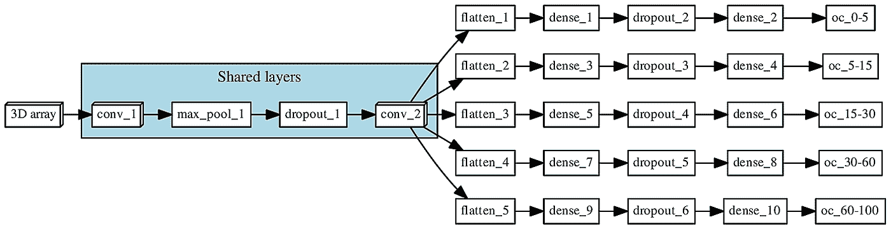
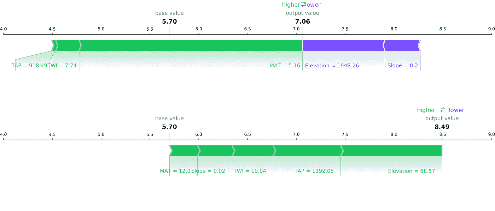
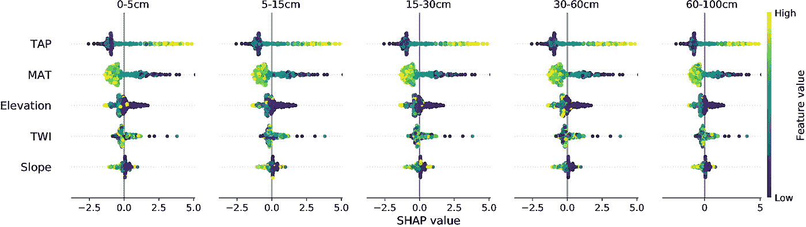
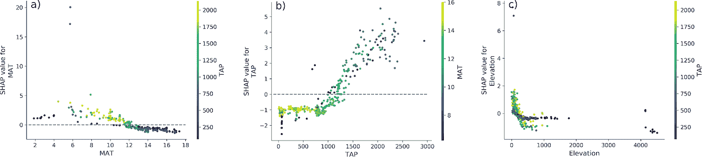
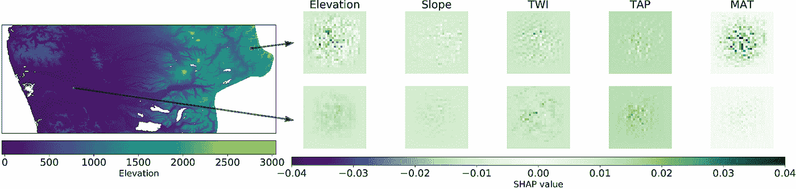
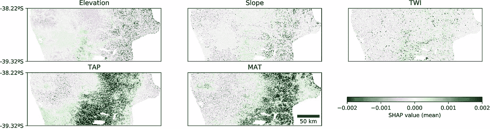

# 用 SHAP 解释 CNN 生成的土壤地图

> 原文：<https://towardsdatascience.com/explaining-a-cnn-generated-soil-map-with-shap-f1ec08a041eb?source=collection_archive---------28----------------------->

这是我致力于深度学习在土壤科学中的应用的系列文章的第四篇。这是一个正在进行的系列，到目前为止还包括:

 [## 深度学习和土壤科学-第 1 部分

### 预测土壤性质的土壤光谱。根据光谱图预测多种土壤特性的多任务卷积神经网络。

towardsdatascience.com](/deep-learning-and-soil-science-part-1-8c0669b18097)  [## 深度学习和土壤科学—第二部分

### 使用上下文空间信息的数字土壤制图。从点信息生成土壤图的多任务 CNN。

towardsdatascience.com](/deep-learning-and-soil-science-part-2-129e0cb4be94)  [## 深度学习和土壤科学—第 3 部分

### 土壤光谱学与迁移学习。将大陆土壤光谱模式“本地化”到国家范围。

towardsdatascience.com](/deep-learning-and-soil-science-part-3-c793407e4997) 

在我之前的一篇文章中，我解释了如何使用空间模型来生成地图。我还介绍了使用多任务卷积神经网络(CNN)来更好地表示土壤形成过程的复杂性。CNN 使用点状土壤观测周围的像素窗口作为输入，而不是截取其位置的单个像素，以结合空间背景。此外，由于其多任务设计，该模型能够同时预测多种土壤属性，并考虑到它们之间的相互作用。与更传统的 ML 模型(立体树模型)相比，这两个新特征的引入产生了大约 30%的误差减少。

你可能知道深度学习如何在许多领域表现出优异的性能，但与此同时，它们也引起了人们对其可解释性和潜在偏见的担忧，特别是因为这些类型的算法开始被应用于在具有高度人类影响的领域中辅助决策。

为了解决可解释性问题，在这篇文章中，我展示了我最新研究的一些结果，在这些研究中，我应用 SHAP 解释了一个用于数字土壤制图的多重谈话 CNN。主要目的是证实模型捕捉了目标土壤特性和用于训练模型的协变量之间的合理关系。

# 博弈论与 SHAP 价值观

从博弈论的角度来看，建模可以被视为一个合作游戏，其中预测者(代理或参与者)战略性地相互作用，以实现预测输出的目标。因此，每个代理都会收到与其贡献成比例的支付。

SHAP 是一种逼近每个预测因子的边际贡献的方法。关于如何估计这些值的详细信息，您可以阅读我的出版物 Lundberg 和 Lee (2017)的[原始论文](http://papers.nips.cc/paper/7062-a-unified-approach-to-interpreting-model-predictions)，或[这篇文章](/shap-explained-the-way-i-wish-someone-explained-it-to-me-ab81cc69ef30)中的直观解释[塞缪尔·马赞蒂](https://medium.com/u/e16f3bb86e03?source=post_page-----f1ec08a041eb--------------------------------)。

为了进行分析，我使用了 Scott Lundberg 的 [shap](https://github.com/slundberg/shap) python 库，他是该方法的创造者之一。

# 模型描述

讨论中的模式是一个多任务 CNN，被训练来同时预测智利五个深度间隔(0-5、5-15、15-30、30-60 和 60-100 厘米)的土壤有机碳(SOC)含量。为了训练 CNN，我使用了形状为(29，29，5)的 3D 阵列，代表每个观察点周围的 29x29 像素窗口，用于解释 SOC 的空间分布的五个协变量。这个简单模型中包含的五个协变量是:海拔、坡度、地形湿度指数(TWI)、长期年平均温度(MAT)和年总降水量(TAP)。

**图 1** 。多任务网络的结构。“共享层”表示所有深度范围共享的层。每个分支(每个深度范围一个)首先将信息展平为 1D 阵列，随后是一系列 2 个全连接层和大小=1 的全连接层，这对应于最终预测。

# 结果

## 本地和全球解释

如果你熟悉 SHAP，你可能见过下面的一些图。首先，我们可以通过每个协变量的贡献获得局部解释(单个预测)。在下图中，我们可以看到两种不同观测的力图:顶部面板对应于海拔和坡度具有负作用(它们促进侵蚀)的山区。底部面板对应于相反情况的山谷。两个观测都位于智利南部，与中部和最北部地区相比，那里更冷更湿的条件促进了有机碳的积累，因此温度和降水的贡献是积极的。

**图二。**两个不同样本的力图。图中显示了正(绿色)和负(紫色)的总贡献，它们使 SOC 含量偏离了预期的基本 SOC 值(整个数据集的预测平均值)。

考虑到协变量对所有样本的贡献，使用 SHAP 也可以获得模型的全局解释。下图显示了每个协变量的相对重要性，其中气候对地形相关协变量的影响更大(SHAP 值范围更广)。这是一个国家 SOC 模型，智利有很强的南北气候梯度，所以 TAP 和 MAT 的影响最大也就不足为奇了。在更局部的层面上，地形开始发挥重要作用。下图显示的另一件事是，有机碳与降水量呈正相关，与温度呈负相关，这也是一种预期行为。

**图 3。**CNN 模型的每个协变量和土壤深度区间的 SHAP 值。TAP:年总降水量；MAT:年平均温度；地形湿度指数。

## 相互作用

还可以进一步检查特定协变量的影响，并评估模型是否捕捉到了它们之间的相互作用。例如，温度的积极贡献在 4 至 8℃之间达到峰值，而负面贡献在 12℃以上。鉴于该国的气候条件，MAT 贡献的减少与降水量的减少相关，这在高温地区(图 4a)更为突出，那里的碳输入量低。降水量的贡献(图 4b)显示了一个确定的趋势，在⁻大约 1000mm 年时，基本上是恒定的负响应，在⁻大约 1400mm 年时开始增加，变成正响应。该模型还捕捉到了有机碳含量和海拔之间的反比关系(图 4c ),鉴于该国的地形，较高的值通常与较陡的地形相关。一般来说，这种影响在 TAP 高于 400 毫米/年⁻的地区会加剧。

对于温度和降水，其贡献变为正值的阈值(分别约为 12°c 和 1400 毫米/年⁻)与该国境内的一个重要区域(南纬 38°左右)相一致，在该区域，砖红壤(“火山”土壤)变得更加普遍，土壤水分状况从干旱变为湿润(变得更加湿润)，与有机碳含量的急剧增加相关。就似乎改变了海拔(大约 400 毫米/年⁻)贡献行为的 TAP 阈值而言，它大致对应于该国干旱和半干旱地区之间的过渡(变得更加湿润)，在这种情况下，水的侵蚀过程开始变得更加重要。

**图 4。**SHAP 值和所选协变量之间的相关性图。a)SHAP 值和年平均温度(MAT)之间，显示与年总降水量(TAP 色标)；b)SHAP 值和年总降水量之间的关系，显示与年平均温度的相互作用(色标)；以及 c)SHAP 值和海拔之间的关系，显示了与年总降水量(色标)的相互作用。

## 空间解释

因为我们讨论的是一个包含每个样本周围环境的空间模型，所以我们也可以从空间上评估贡献。下图显示了与图 2 相同的两个位置，但这次分解了每个像素的贡献。解释是一样的，但理论上，我们应该能够识别更有影响力的景观的具体特征。

**图五。**两个不同样本(来自图 2 的相同样本)中每个协变量的 SHAP 值的空间分布。

也许对我来说最有趣的输出(我主要使用地图)是可以聚集本地空间贡献来显示更一般的空间解释并进一步证实之前的解释。下图显示了 SHAP 值的地图，其中可以区分靠近海岸的山谷，与周围区域相比，该山谷具有较低的坡度和坡度以及较高的 MAT。与预期的平均输出相比，这些条件对模型输出有负面影响。当然，即使这些趋势在有机碳过程方面有意义，它们也可能与人类活动(农业)的影响相互作用，这在该模型中没有考虑。

**图六。**CNN 模型中每个协变量的 SHAP 值的空间分布。每个像素的值是该像素被用作上下文的所有实例的平均值(对于 29×29 的上下文窗口高达 841 次)。TAP:年总降水量；MAT:年平均温度；地形湿度指数。

# 最后的话

这项研究的结果表明，有可能在数字土壤制图中建立可解释的深度学习模型，通常被视为黑盒的复杂模型可以使用 SHAP 值进行检查。这不仅对于证实模型被适当地训练以及它捕获目标属性和预测器之间的合理关系是必要的，而且它也是导致知识发现的过程的基本部分。

# 引用

关于这项工作的更多细节可以在相应的论文中找到。

帕达里安，j .麦克布拉特尼，A. B .和米纳斯尼，B. 2020。数字土壤制图卷积神经网络的博弈论解读，土壤讨论，[https://doi.org/10.5194/soil-2020-17.](https://doi.org/10.5194/soil-2020-17.)

**注 04/04/2020:** 该文件尚未被接受，正在接受公众审查和讨论。欢迎您参与这一过程。

# 参考

*   Lundberg，S.M .和 Lee，S.I .，2017 年。解释模型预测的统一方法。在:神经信息处理系统进展 30 *。*第 4765-4774 页。