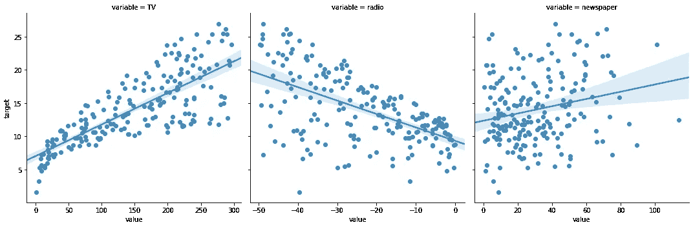
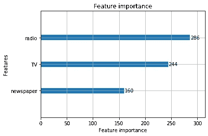
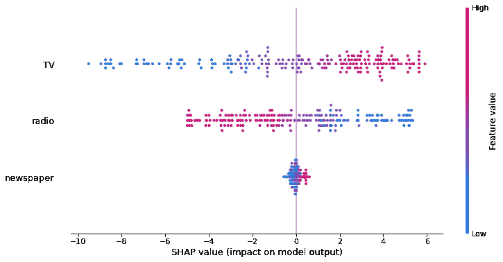
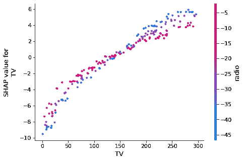
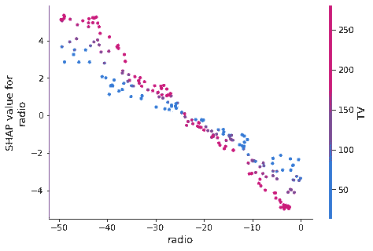
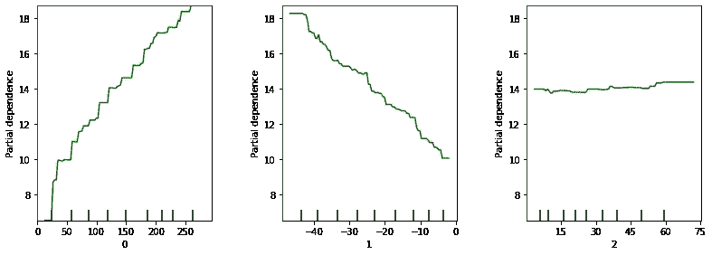
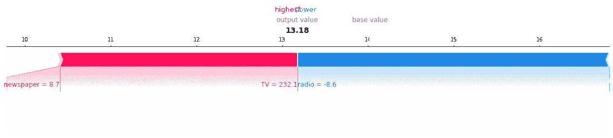

# 解释“黑箱”ML 模型——SHAP 的实际应用

> 原文：<https://towardsdatascience.com/explaining-blackbox-ml-models-practical-application-of-shap-f05f986863cf?source=collection_archive---------44----------------------->


在真实数据集上训练“黑盒”GBM 模型，并使其可以用 SHAP 解释。

# 动机

GBM 模型已经作为强大的模型经受了战斗的考验，但是由于缺乏可解释性而被玷污了。通常，数据科学家会查看可变重要性图，但这不足以解释模型是如何工作的。为了最大化模型用户的采用，使用 SHAP 值来回答常见的可解释性问题，并建立对模型的信任。

在这篇文章中，我们将在一个简单的数据集上训练一个 GBM 模型，你将学习如何解释这个模型是如何工作的。这里的目标不是解释数学是如何工作的，而是向非技术用户解释输入变量如何与输出变量相关，以及如何进行预测。

我们正在使用的数据集是由 [ISLR](http://faculty.marshall.usc.edu/gareth-james/ISL/) 提供的广告数据集，你可以获得在 [d6t GitHub](http://tiny.cc/d6t-blog-20200426-shapley) 上使用的代码。

# 首先，构建高效的数据科学工作流

正如在[数据科学家犯的 10 大编码错误](/top-10-coding-mistakes-made-by-data-scientists-bb5bc82faaee)中所解释的，为了创建高效的数据科学工作流，我们将使用文件管理器 [d6tpipe](https://github.com/d6t/d6tpipe) 和工作流管理器 [d6tflow](https://github.com/d6t/d6tflow) 。

```
api = d6tpipe.APIClient()
pipe = d6tpipe.Pipe(api, 'intro-stat-learning')
pipe.pull()
```

预处理工作流:

```
**class** **TaskProcessRawData**(d6tflow.tasks.TaskPqPandas): **def** run(self):
        df = pd.read_csv(pipe.dirpath/'Advertising.csv', usecols=[1,2,3,4])
        self.save(df)@d6tflow.requires(TaskProcessRawData)
**class** **TaskFeatures**(d6tflow.tasks.TaskPqPandas):

    **def** run(self):
        df = self.inputLoad()
        df['target']=df['Sales']
        df['radio']=-df['radio'] *# force negative relationship*
        df['tv_radio']=df['TV']*df['radio'] *# interaction effect*
        self.save(df) 
```

# 第二，不要在对模型应该做什么没有直觉的情况下建立模型

正如在[数据科学家犯下的十大统计错误](/top-10-statistics-mistakes-made-by-data-scientists-2d58ccf12ab1)中所解释的，你想要对模型应该如何工作形成一种经济直觉。

广告数据集显示销售是电视、广播和报纸广告支出的函数。通过观察散点图，我们可以看出电视和广播是有效的营销渠道，因为销售与这些渠道的支出密切相关。但是注意，广播有负面影响，而电视有正面影响(NB 我们强行与广播建立了负面关系)。报纸似乎只有很小的影响。

```
sns.lmplot(x="value", y="target", col="variable", data=dfp)
```



# 现在训练一个“黑盒”ML 模型

GBM 模型已经作为强大的模型经受了战斗的考验，但由于缺乏可解释性而受到了污染。让我们训练模型，看看我们如何解释它。我们将使用 [LightGBM](https://lightgbm.readthedocs.io/en/latest/) 。

```
m_lgbm = lightgbm.LGBMRegressor()
m_lgbm.fit(df_trainX,df_trainY)
```

# 为什么可变重要性图不起作用

顾名思义，变量重要性图告诉您输入和输出变量之间的关系强度。但是要信任一个模型，用户通常想知道更多:影响是积极的/消极的，线性的/非线性的？是否有成功/失败的时候？他们想看看这个模型是否符合他们的经济直觉。

在我们的例子中，重要性图并没有显示报纸消费与我们确定的负相关。这将使模型用户感到困惑，他们不会相信仅基于该图的模型。

```
lightgbm.plot_importance(m_lgbm)
```



# 与 SHAP 一起解释模型

[SHAP](https://github.com/slundberg/shap) 让你可以看到每个输入对输出变量的方向性影响，这给了模型用户关于模型如何工作的重要直觉。

如您所见，该模型确实显示了电视支出越高，销售额越高；广播支出越高，销售额越低。这符合我们的直觉，让模型用户相信你的模型做了正确的事情。

```
explainer = shap.TreeExplainer(m_lgbm, df_trainX)
shap_values = explainer.shap_values(df_trainX)shap.summary_plot(shap_values, df_trainX)
```



您还可以研究散点图中的“拟合”值，以更详细地显示输入和输出变量之间的关系。这对于更复杂的关系和理解交互效应是有用的。

在这种情况下，关系是线性的，电视和广播之间存在交互作用(您可以通过运行 OLS 并包含`tv_radio`变量来确认)。

```
**for** col **in** cfg_col_X:
    shap.dependence_plot(col, shap_values, df_trainX)
```



# 部分依赖情节呢？

那些也有用。优点是它们的输出与实际的目标变量具有相同的规模。这与 Shapley 值不同，Shapley 值显示了相对于平均预测的边际影响。

```
plot_partial_dependence(m_lgbm, df_trainX)
```



# 解释最新的预测

这是实践中经常遇到的另一个问题:您已经训练了模型，并使用最新数据进行了预测。模型用户不仅想知道预测值，还想知道为什么模型会做出这样的预测。SHAP 可以解释单个预测，也可以解释每个输入变量如何影响整体预测。

这里我们可以看到最新的预测值是【13.18】。电视提高了这一预测，而广播则降低了这一预测。报纸几乎没有影响。这符合我们的预期。

```
shap.force_plot(explainer.expected_value, shap_values[-1,:], df_trainX.iloc[-1,:])
```



# 从哪里了解更多信息？

了解 SHAP

*   [https://github.com/slundberg/shap](https://github.com/slundberg/shap)
*   [https://christophm . github . io/interpretable-ml-book/shap . html](https://christophm.github.io/interpretable-ml-book/shap.html)

构建高效的数据科学工作流

*   [https://towards data science . com/how-to-use-air flow-style-DAGs-for-high-effective-data-science-workflows-b 52053 deddd 32](/how-to-use-airflow-style-dags-for-highly-effective-data-science-workflows-b52053dedd32)
*   [https://github.com/d6t/d6tflow-template](https://github.com/d6t/d6tflow-template)

利用 Databolt 加速数据科学

*   https://github.com/d6t/d6t-python
*   【https://www.databolt.tech/ 