# 解释 DBSCAN 集群

> 原文：<https://towardsdatascience.com/explaining-dbscan-clustering-18eaf5c83b31?source=collection_archive---------2----------------------->

## 使用 DBSCAN 识别员工子组


图片由 [Ishan @seefromthesky](https://unsplash.com/@seefromthesky?utm_source=medium&utm_medium=referral) 在 [Unsplash](https://unsplash.com?utm_source=medium&utm_medium=referral) 上拍摄

**带噪声应用的基于密度的空间聚类(DBSCAN)** 是一种无监督聚类 ML 算法。无监督的，因为它不使用预先标记的目标来聚类数据点。聚类是指试图将相似的数据点分组到人工组或聚类中。它是 KMeans 和层次聚类等流行聚类算法的替代方法。

在我们的示例中，我们将检查由 15，000 名员工组成的人力资源数据集。该数据集包含员工工作特征，如工作满意度、绩效得分、工作量、任职年限、事故、晋升次数。

在我的上一篇文章中，我们研究了 KMeans 聚类算法，我强烈建议您阅读([链接](/explaining-k-means-clustering-5298dc47bad6))。您将能够了解 KMeans 如何对数据进行聚类。

## KMeans vs DBSCAN

KMeans 特别容易受到离群值的影响。当算法迭代通过质心时，在达到稳定和收敛之前，离群值对质心的移动方式有显著影响。此外，KMeans 在准确聚类数据方面存在问题，因为聚类的大小和密度不同。K-Means 只能应用球形聚类，如果数据不是球形的，其准确性会受到影响。最后但同样重要的是，KMeans 要求我们首先选择我们希望找到的集群的数量。下面是 KMeans 和 DBSCAN 如何分别对同一个数据集进行聚类的示例。

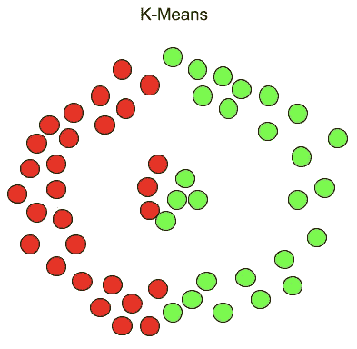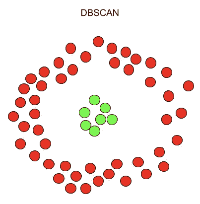

另一方面，DBSCAN 不需要我们指定集群的数量，避免了离群值，并且可以很好地处理任意形状和大小的集群。它没有质心，聚类是通过将相邻点连接在一起的过程形成的。

# DBSCAN 是如何施展魔法的？

首先，让我们定义**ε**和**最小点，**应用 DBSCAN 算法时的两个必需参数，以及一些附加术语。

1.  **ε(ɛ):**邻居的最大半径。如果数据点的相互距离小于或等于指定的ε，则它们将是有效的邻居。换句话说，它是 DBSCAN 用来确定两个点是否相似并属于同一个点的距离。较大的ε将产生较宽的聚类(包含更多的数据点),而较小的ε将构建较小的聚类。一般来说，我们更喜欢较小的值，因为我们只希望数据点之间的距离在ε范围内。太小，你将开始把有效的集群分成越来越小的集群。太大的话，您会将有效的集群聚合成 2 到 3 个大规模集群，几乎没有业务洞察力。
2.  **最小点(minPts):** 一个邻域半径内的最小个数据点(即ε),以将该邻域视为一个聚类。请记住，初始点包含在 minPts 中。较低的 minPts 有助于该算法构建更多具有更多噪声或离群值的聚类。较高的 minPts 将确保更健壮的集群，但是如果它太大，较小的集群将被并入较大的集群。

> 如果“最小点”= 4，在ε距离内的任何 4 个或更多的点将被认为是一个群集。

## 附加术语

**核心点:**核心数据点在其ε距离内至少有 minPts 个数的数据点。

> 我一直认为 DBSCAN 需要第三个名为“core_min”的参数，它将决定一个邻域点簇被认为是有效簇之前核心点的最小数量。

**边界点:**边界数据点在郊区，因为它们在附近(即 w/in 核心点的ε距离)但小于所需的 minPts。

**离群点:**这些点不是邻域的一部分(即大于ε距离)并且不是边界点。这些点位于低密度区域。

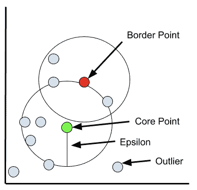

首先，选择在其ε半径内至少有 minPts 的随机点。然后，评估核心点邻域内的每个点，以确定其附近是否有ε距离内的 min pts(min pts 包括点本身)。如果该点满足 minPts 标准，则它成为另一个核心点，并且集群扩展。如果一个点不满足 minPts 标准，它就成为边界点。随着过程的继续，一个链开始发展，因为核心点“a”是“b”的邻居，而“b”是“c”的邻居，等等。聚类是完整的，因为它被边界点包围，因为在ε距离内没有更多的点。选择新的随机点，并且重复该过程以识别下一个聚类。

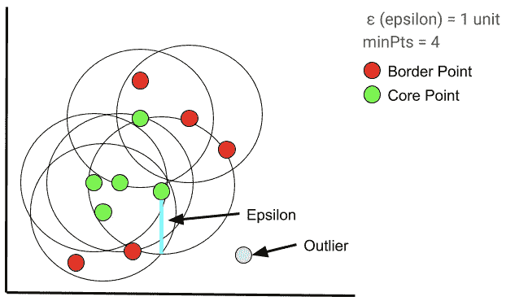

## 如何确定最佳ε值

用于估计最佳ε值的一种方法是使用最近邻距离。如果您还记得，最近邻是一种受监督的 ML 聚类算法，它根据新数据点与其他“已知”数据点的距离对其进行聚类。我们在标记的训练数据上训练 KNN 模型，以确定哪些数据点属于哪个聚类。然后，当我们将该模型应用于新数据时，该算法会根据到已训练聚类的距离来确定新数据点属于哪个聚类。我们必须先验地确定“k”参数，该参数指定在将新数据点分配给聚类之前，模型将考虑多少个最近或最近的相邻点。

为了确定最佳ε值，我们计算每个点与其最近邻点之间的平均距离。然后，我们绘制一个 k 距离图，并选择图表“肘部”处的ε值。在 y 轴上，我们绘制了数据集中所有数据点的平均距离，在 x 轴上绘制了这些数据点。

如果ε选得太小，大部分数据将不会被聚类，而高ε值的聚类将合并，并且大多数数据点将在同一聚类中。一般来说，ε值越小越好，根据经验，只有一小部分点应该在彼此的距离之内。

## 如何确定最优 minPts

通常，我们应该将 minPts 设置为大于或等于数据集的维数。也就是说，我们经常看到人们将特性的数量乘以 2 来确定它们的 minPts 值。

很像用于确定最佳ε值的“肘方法”, minPts 试探法并非 100%正确。

## DBSCAN 集群评估

**剪影法:**该技术衡量聚类之间的可分性。首先，找出每个点和一个聚类中所有其他点之间的平均距离。然后它测量每个点与其他簇中每个点之间的距离。我们减去两个平均值，然后除以较大的平均值。

我们最终想要一个高(即。最接近 1)的分数，其将指示存在小的群内平均距离(紧密的群)和大的群间平均距离(充分分离的群)。

**视觉聚类解释:**一旦你获得了你的聚类，解释每个聚类是非常重要的。这通常是通过将原始数据集与聚类合并并可视化每个聚类来完成的。每个聚类越清晰和明显越好。我们将在下面回顾这个过程。

## DBSCAN 的优点

*   不需要我们预先确定像 KMeans 这样的集群的数量
*   像冠军一样处理异常值
*   可以将高密度数据分成小簇
*   可以聚集非线性关系(查找任意形状)

## DBSCAN 的缺点

*   努力在不同密度的数据中识别聚类
*   会受到高维数据的困扰
*   对ε和最小点参数非常敏感

# 我们群集吧！

```
import numpy as np
import pandas as pd
import matplotlib.pyplot as plt
import seaborn as sns
import plotly.offline as pyo
pyo.init_notebook_mode()
import plotly.graph_objs as go
from plotly import tools
from plotly.subplots import make_subplots
import plotly.offline as py
import plotly.express as px
from sklearn.cluster import DBSCAN
from sklearn.neighbors import NearestNeighbors
from sklearn.metrics import silhouette_score
from sklearn.preprocessing import StandardScaler
from sklearn.decomposition import PCAplt.style.use('fivethirtyeight')
from warnings import filterwarnings
filterwarnings('ignore') with open('HR_data.csv') as f:
    df =  pd.read_csv(f, usecols=['satisfaction_level', 'last_evaluation', 'number_project',
       'average_montly_hours', 'time_spend_company', 'Work_accident',
       'promotion_last_5years'])
f.close()
```

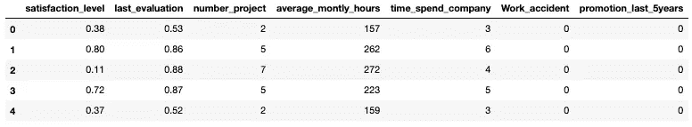

# 1.标准化

由于数据集中的要素比例不同，我们需要对整个数据集进行标准化。换句话说，数据集中的每个要素都有其数据的唯一量值和范围。满意度增加一分并不等于上次评估增加一分，反之亦然。由于 DBSCAN 利用点之间的距离(欧几里德距离)来确定相似性，因此未缩放的数据会产生问题。如果一个要素的数据具有较高的可变性，则距离计算将更容易受到该要素的影响。通过缩放我们的特征，我们将所有的特征对齐到平均值为 0，标准偏差为 1。

```
scaler = StandardScaler()
scaler.fit(df)
X_scale = scaler.transform(df)df_scale = pd.DataFrame(X_scale, columns=df.columns)
df_scale.head()
```

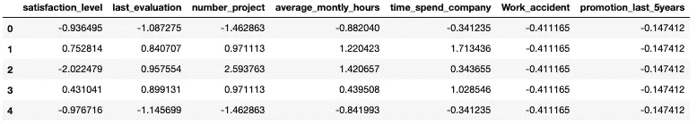

# 2.特征约简

一些算法(如 KMeans)发现，如果数据集具有太多的特征(即高维度)。高维不一定意味着成百上千的特征。即使 10 个特征也可能产生精度问题。

特征或维度减少背后的理论是将原始特征集转换成较少的人工导出的特征，这些特征仍然保持原始特征中包含的大部分信息。

最流行的特征减少技术之一是主成分分析或 PCA。主成分分析将原始数据集缩减为特定数量的特征，称为主成分。我们必须选择我们希望看到的主成分的数量。我们在我关于 KMeans 集群的文章中讨论了特性缩减，我强烈建议您看一下( [LINK](/explaining-k-means-clustering-5298dc47bad6) )。

首先，我们需要确定适当数量的主成分。似乎 3 个主成分解释了大约 75%的方差。

```
pca = PCA(n_components=7)
pca.fit(df_scale)
variance = pca.explained_variance_ratio_ var=np.cumsum(np.round(variance, 3)*100)
plt.figure(figsize=(12,6))
plt.ylabel('% Variance Explained')
plt.xlabel('# of Features')
plt.title('PCA Analysis')
plt.ylim(0,100.5)plt.plot(var)
```

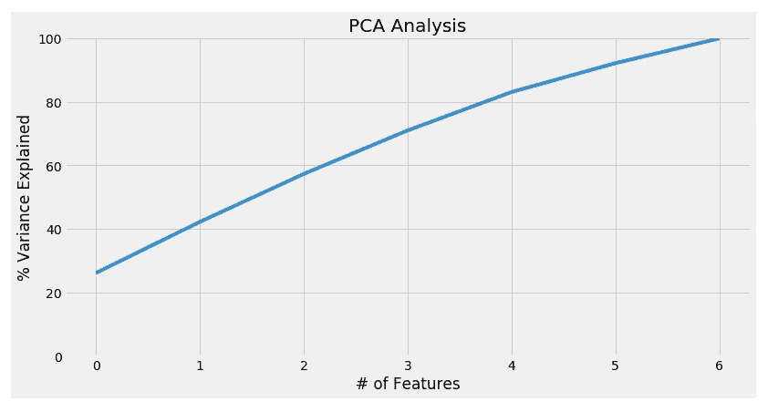

现在我们知道了保持特定方差百分比所需的主成分数，让我们对原始数据集应用一个三成分 PCA。请注意，第一个主成分占原始数据集方差的 26%。在本文的剩余部分，我们将使用“pca_df”数据帧。

```
pca = PCA(n_components=3)
pca.fit(df_scale)
pca_scale = pca.transform(df_scale)pca_df = pd.DataFrame(pca_scale, columns=['pc1', 'pc2', 'pc3'])
print(pca.explained_variance_ratio_)
```

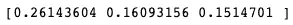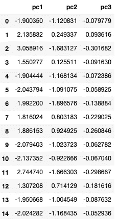

在 3D 空间中绘制我们的数据，我们可以看到 DBSCAN 的一些潜在问题。如果您还记得 DBSCAN 的一个主要缺点，那就是它无法准确地对不同密度的数据进行聚类，从下图中，我们可以看到两个密度非常不同的独立聚类。在应用 DBSCAN 算法时，我们可能能够在数据点的较低聚类中找到聚类，但是在较高聚类中的许多数据点可能被归类为异常值/噪声。这当然完全取决于我们对ε和最小点值的选择。

```
Scene = dict(xaxis = dict(title  = 'PC1'),yaxis = dict(title  = 'PC2'),zaxis = dict(title  = 'PC3'))trace = go.Scatter3d(x=pca_df.iloc[:,0], y=pca_df.iloc[:,1], z=pca_df.iloc[:,2], mode='markers',marker=dict(colorscale='Greys', opacity=0.3, size = 10, ))
layout = go.Layout(margin=dict(l=0,r=0),scene = Scene, height = 1000,width = 1000)
data = [trace]
fig = go.Figure(data = data, layout = layout)
fig.show()
```

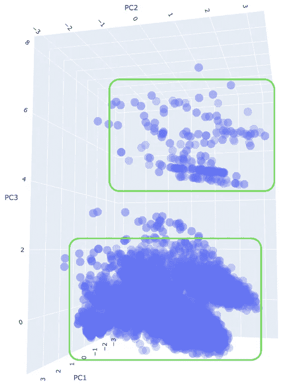

# 3.DBSCAN 聚类

**方法 1**

在我们应用聚类算法之前，我们必须使用上面讨论的“肘方法”来确定适当的 epsilon 级别。看起来最佳的ε值大约是 0.2。最后，由于我们的数据有 3 个主要成分，我们将把最低分标准设为 6。

```
plt.figure(figsize=(10,5))
nn = NearestNeighbors(n_neighbors=5).fit(pca_df)
distances, idx = nn.kneighbors(pca_df)
distances = np.sort(distances, axis=0)
distances = distances[:,1]
plt.plot(distances)
plt.show()
```

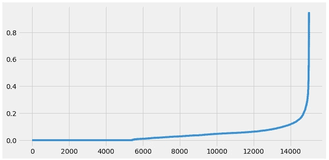

将ε设置为 0.2 并将 min_samples 设置为 6 导致了 53 个聚类，轮廓得分为-0.521，以及超过 1500 个数据点被认为是异常值/噪声。在一些研究领域中，53 个聚类可能被认为是信息丰富的，但我们有一个 15，000 名员工的数据集。从业务的角度来看，我们需要一个可管理的集群数量(即 3-5 个)，可以用来更好地了解工作场所。此外，轮廓得分为-0.521 表示数据点的聚类不正确。

查看下面的 3D 图，我们可以看到一个包含大部分数据点的聚类。出现了一个较小但重要的集群，但剩下 52 个更小的集群。从业务角度来看，这些集群并不能提供很多信息，因为大多数员工只属于两个集群。组织希望看到几个大的集群，以便确定它们的有效性，但是也能够针对集群的员工参与一些组织活动(即培训增加、薪酬变动等。).

```
db = DBSCAN(eps=0.2, min_samples=6).fit(pca_df)
labels = db.labels_# Number of clusters in labels, ignoring noise if present.
n_clusters_ = len(set(labels)) - (1 if -1 in labels else 0)
n_noise_ = list(labels).count(-1)print('Estimated number of clusters: %d' % n_clusters_)
print('Estimated number of noise points: %d' % n_noise_)
print("Silhouette Coefficient: %0.3f" % metrics.silhouette_score(pca_df, labels))
```

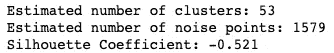

```
Scene = dict(xaxis = dict(title  = 'PC1'),yaxis = dict(title  = 'PC2'),zaxis = dict(title  = 'PC3'))labels = db.labels_trace = go.Scatter3d(x=pca_df.iloc[:,0], y=pca_df.iloc[:,1], z=pca_df.iloc[:,2], mode='markers',marker=dict(color = labels, colorscale='Viridis', size = 10, line = dict(color = 'gray',width = 5)))
layout = go.Layout(scene = Scene, height = 1000,width = 1000)
data = [trace]
fig = go.Figure(data = data, layout = layout)fig.update_layout(title='DBSCAN clusters (53) Derived from PCA', font=dict(size=12,))
fig.show()
```

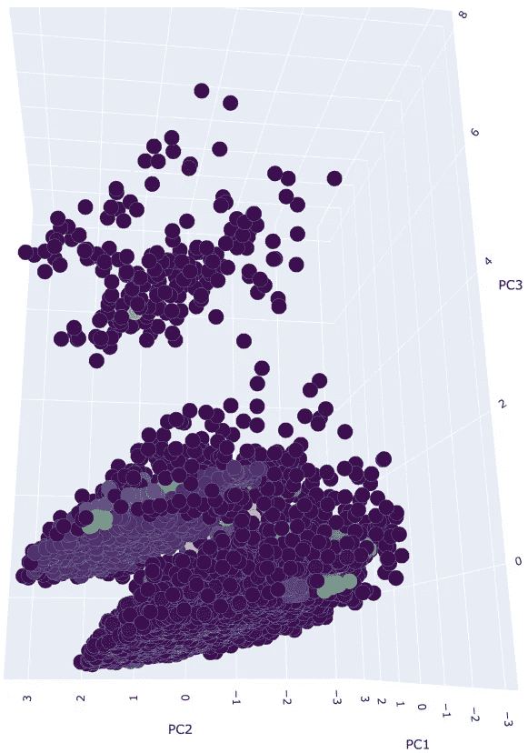

**接近 2 号**

我们不使用“肘方法”和最小值试探法，而是采用迭代方法来微调我们的 DBSCAN 模型。当我们将 DBSCAN 算法应用于数据时，我们将遍历一系列ε和最小点值。

在我们的示例中，我们将以 0.1 的间隔迭代范围为 0.5 至 1.5 的ε值，以及范围为 2 至 7 的最小点值。for 循环将使用这组值运行 DBSCAN 算法，并为每次迭代生成聚类数和轮廓分数。请记住，您需要根据您的数据调整您的参数。您可能会在一组参数上运行此代码，并发现产生的最佳轮廓分数为 0.30。您可能希望增加ε值，以便将更多的点包含到一个簇中。

```
pca_eps_values = np.arange(0.2,1.5,0.1) 
pca_min_samples = np.arange(2,5) 
pca_dbscan_params = list(product(pca_eps_values, pca_min_samples))pca_no_of_clusters = []
pca_sil_score = []
pca_epsvalues = []
pca_min_samp = []for p in pca_dbscan_params:
    pca_dbscan_cluster = DBSCAN(eps=p[0], min_samples=p[1]).fit(pca_df)
    pca_epsvalues.append(p[0])
    pca_min_samp.append(p[1])pca_no_of_clusters.append(
len(np.unique(pca_dbscan_cluster.labels_)))
    pca_sil_score.append(silhouette_score(pca_df, pca_dbscan_cluster.labels_))pca_eps_min = list(zip(pca_no_of_clusters, pca_sil_score, pca_epsvalues, pca_min_samp))pca_eps_min_df = pd.DataFrame(pca_eps_min, columns=['no_of_clusters', 'silhouette_score', 'epsilon_values', 'minimum_points'])pca_ep_min_df
```

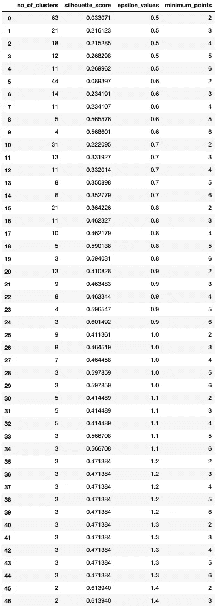

我们可以看到，通过迭代我们的ε和最小值，我们已经获得了大量的聚类和轮廓分数。ε得分在 0.9 和 1.1 之间开始产生可管理数量的聚类。将 epsilon 增加到 1.2 及以上会创建太少的集群，没有太多的商业意义。此外，这些簇中的一些可能只是噪声(即-1)我们一会儿就会谈到。

同样重要的是要理解，增加ε会减少聚类的数量，但是每个聚类也会开始包含更多的异常值/噪声数据点。存在一定程度的收益递减。

为了简单起见，让我们选择 7 个集群，并检查集群分布情况。(ε:1.0 & min pts:4)。

指出运行这一串代码时肯定会遇到的一个常见错误也很重要。有时当你设置好你的参数(即 eps_values 和 min_samples)太宽，for 循环最终将得到仅产生一个聚类的 eps_values 和 min_samples 的组合。但是，Silhouette_score 函数要求至少定义两个分类。您需要限制您的参数来避免这个问题。

在上面的例子中，如果我们将 epsilon 参数范围设置为 0.2 到 2.5，则最有可能产生一个聚类并最终导致错误。

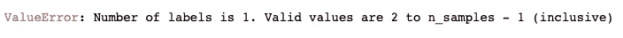

您可能会问自己“我们不是应该获得 7 个集群吗？”。答案是“是”,如果我们查看唯一的标签/聚类，我们会看到每个数据点有 7 个标签。根据 Sklearn 文档，标签“-1”相当于一个“嘈杂”的数据点，它没有被聚类到 6 个高密度集群中的任何一个。我们自然不希望将“-1”的任何标签视为一个集群，因此，它们被从计算中移除。

```
db = DBSCAN(eps=1.0, min_samples=4).fit(pca_df)
labels = db.labels_# Number of clusters in labels, ignoring noise if present.
n_clusters_ = len(set(labels)) - (1 if -1 in labels else 0)
n_noise_ = list(labels).count(-1)print('Estimated number of clusters: %d' % n_clusters_)
print('Estimated number of noise points: %d' % n_noise_)
print("Silhouette Coefficient: %0.3f" % silhouette_score(pca_df, labels))
```

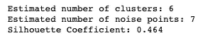

```
set(labels)
```

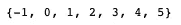

查看六个 DBSCAN 衍生的集群的 3D 图，看起来接近图顶部的密度较低的集群尽管密度较低，但并没有对 DBSCAN 造成太大的问题。如果您还记得，DBSCAN 很难正确地对各种密度的数据进行聚类。顶部星团和大得多的底部星团之间的距离很可能大于我们的ε值 1.0。

也就是说，数据集包含额外的高密度聚类，但我们的ε和最小值太大。底部聚类包含至少两个高密度聚类，然而，由于底部聚类的强密度，降低ε和最小点值将简单地创建许多更小的聚类。这也是 DBSCAN 的主要缺点。我一直认为 DBSCAN 需要第三个参数“min_core”，它将决定一个簇被认为是有效簇之前的最小核心点数。

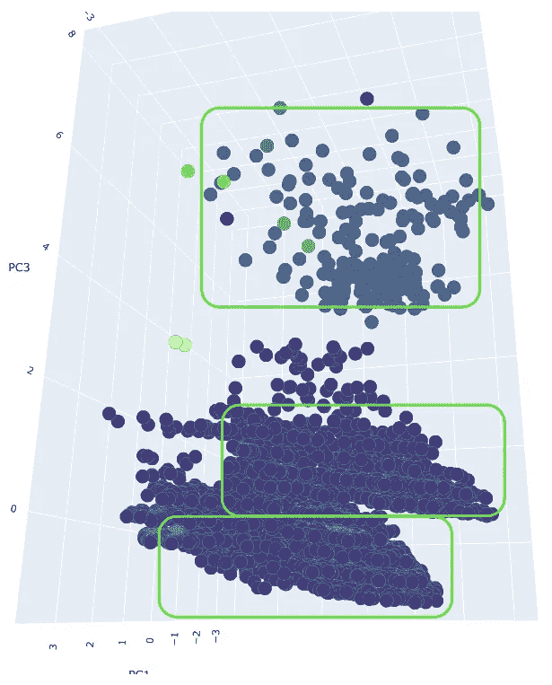

```
Scene = dict(xaxis = dict(title  = 'PC1'),yaxis = dict(title  = 'PC2'),zaxis = dict(title  = 'PC3'))# model.labels_ is nothing but the predicted clusters i.e y_clusters
labels = db.labels_trace = go.Scatter3d(x=pca_df.iloc[:,0], y=pca_df.iloc[:,1], z=pca_df.iloc[:,2], mode='markers',marker=dict(color = labels, colorscale='Viridis', size = 10, line = dict(color = 'gray',width = 5)))
layout = go.Layout(scene = Scene, height = 1000,width = 1000)
data = [trace]
fig = go.Figure(data = data, layout = layout)fig.update_layout(title="'DBSCAN Clusters (6) Derived from PCA'", font=dict(size=12,))
fig.show()
```

在我们开始之前，让我们快速统计一下每个集群中的员工数量。看起来第 0 类包含了大部分的数据点，这些数据点提供的信息并不多。事实上，如果我们使用ε值为 0.5 且最小点数为 5 来运行该算法，将会产生 63 个分类，分类 0 仍将包含 99%的雇员人口。

```
np.unique(labels, return_counts=True)
```

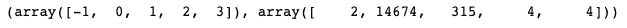

# 摘要

DBSCAN 是一种密度聚类算法，常用于非线性或非球形数据集。ε和最小点是两个必需的参数。ε是需要被认为足够“相似”以开始聚类的附近数据点内的半径。最后，最小点是需要在半径内的最小数量的数据点(即ε)才能被认为是一个集群。

在我们的示例中，我们试图根据 15，000 名员工的工作特征对他们的数据集进行聚类。我们首先对数据集进行标准化，以缩放特征。接下来，我们应用主成分分析，以便将维度/特征的数量减少到 3 个主成分。使用“肘法”，我们估计ε值为 0.2，最小点值为 6。使用这些参数，我们能够获得 53 个聚类、1，500 个异常值和-0.52 的轮廓得分。不用说，结果并不乐观。

接下来，我们尝试了一种迭代方法来微调ε和最小点参数。我们决定ε值为 1.0，最小点数值为 4。该算法返回 6 个有效聚类(一对一聚类)，只有 7 个异常值，以及 0.46 的可观轮廓分数。但是，在绘制派生的分类时，发现第一个分类包含 99%的雇员。再次从业务的角度来看，我们希望我们的集群分布更加均匀，以便为我们提供关于员工的良好见解。

似乎 DBSCAN 不是这个特定数据集的最佳聚类算法。

这个相同的数据集使用 KMeans 进行聚类，并产生更加平等和明确的聚类([链接](/explaining-k-means-clustering-5298dc47bad6))。