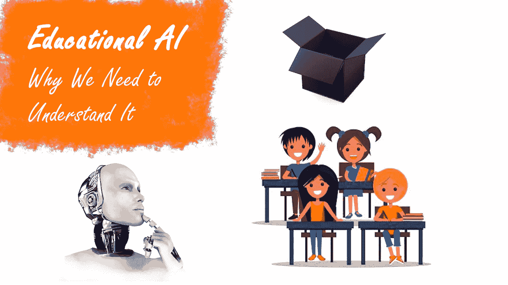
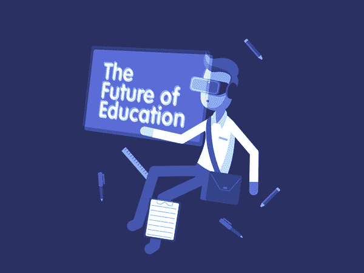
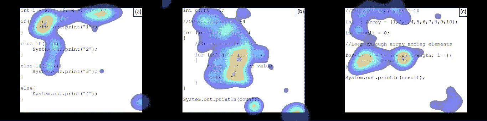

# 人工智能的可解释性(以及它对教育人工智能的意义)

> 原文：<https://towardsdatascience.com/explaining-educational-ai-c5f175850f0b?source=collection_archive---------39----------------------->

## “**可解释性**”——自从宣布人工智能以来，这个词已经出现在许多与技术相关的新闻报道中，对普通用户来说更有意义。我会回到为什么这很重要。

前几天我读了一篇关于我们如何信任他人的研究论文，这给我留下了一个有趣的想法。这篇论文(你可以在这里找到)的结论是，人们更信任不考虑后果就合作的人。

本质上，这意味着当人们盲目信任他人时，我们更容易信任他们。这是有道理的，谁会希望他们的朋友在伸出援手之前权衡利弊，或者一个商业伙伴考虑把你排除在外的得失呢？没有人。

## 但现在想想这如何转化为人工智能。

人工智能正是这么做的，它计算。它接收信息，并根据这些信息做出最佳决策。这项研究表明，当一个人这样做的时候，我们不会那么信任他们……那么我们为什么要信任完全这样做的人工智能呢？

简短的回答是:我们没有。

这项研究本质上告诉我们，我们自己被编程为不相信任何人或任何事来衡量它的选择，而不是本能地站在我们一边。但是 AI 没有本能。它拥有不能做任何事情的算法 ***但是*** 权衡它的选择。

## 所以我们就不能相信 AI？

我们可以。人工智能有巨大的潜力，如果我们正确使用它，它可以让我们在很多事情上做得更好。在过去，我谈过一点信息技术在教育中的潜在用途；[在课堂上](https://bit.ly/aiSchools)或去[高校协助讲师](https://bit.ly/digitalTeachingAssistants)。然而，这两个建议都需要对所使用的人工智能或技术有一定程度的信任。

所以，我相信你们中有些人会想"*为什么这是一个问题？我们已经在生活中使用人工智能，即使它不是完全可信的，*“还有一些人在想”*我不信任人工智能，你在说什么？*“这两个观点都很有道理，但都需要一点视角的转变。

由 [Andrei Elekes](https://medium.com/@aele54) 好心提供的 Gif

当然，我们可能已经在使用人工智能，就像可口可乐公司使用人工智能来规划其自动售货机的最佳位置，但这是不同的。我们可能会相信人工智能会做出这样的决定，或者我们可能会接受我们不需要相信它，因为它只是一台自动售货机。这和[允许机器决定你孩子的教育没有任何相似之处](https://bit.ly/aiSchools)。

我最近看到的另一个有趣的研究是专门针对完全初学者的[编程教学/学习](https://bit.ly/beaconsPaper)。它专注于在不同的代码片段中寻找所谓的“信标”。当我们谈论计算机科学教育时，信标指的是可以帮助读者轻松识别其功能的特定代码行。

这篇研究是关于在向新学生介绍编程时突出正确方向的重要性。

用于确定信标的热图(摘自上面链接的论文)

这真的很有趣，因为将这项研究与人工智能相结合可以为学生定制一些课程。如果人工智能可以确定哪些线应该作为信标加以强调，它可能会彻底改变计算机科学的教学方式，并使该领域可以面向一大批学习风格不同的学生，这些学生可能与计算机科学中使用的传统教学方法不兼容。

## 听起来很神奇，对吧？

也许吧。但是，如果人工智能开始向学生展示错误的信标，会发生什么？如果结果证明它对一些学生强调什么做出了错误的决定呢？然后，学生们努力学习，并强调他们课程中错误的部分来练习。

## 所以…我们到底该不该相信 AI？

这不是一个容易回答的问题。我能给出的最好答案是肯定的，但有一些警告。至少这只是我的看法，但请听我说完。

我们可以用人工智能做令人惊奇的事情，但我们需要小心使用它。我们应该专注于确保我们理解人工智能的决策过程，然后才允许它负责像教育这样的大事情。所以这又回到了可解释性。

如果我们想要信任一个 AI，我们首先应该了解它是如何思考的。如果我们可以信任它如何做决定，那么也许我们可以信任它所做的决定，即使我们无法跟随它在特定决定上的“思维过程”。

## 我们能做些什么来实现这一点？

在个人层面上，我们都应该努力学习人工智能是如何工作的。这不仅仅局限于在 IT 行业工作或者觉得自己擅长数学或计算机的人；这适用于每个人。有一个很棒的(免费！赫尔辛基大学关于人工智能的在线课程，我强烈推荐给任何从零开始或者有一点经验的人。

你永远不知道，当你在学习可以做什么的时候，你可能会得到一点灵感。如果你这样做了，试试[甲骨文的云试验](https://bit.ly/OCI_Trial)吧。

人工智能无处不在，未来几年它只会变得更大。我们应该拥抱变化，但我们永远不应该忘记[关注它](https://bit.ly/ryanAiEthics)。这是新的一年，新的十年；为什么不把这当成你了解这个迷人领域的机会呢？你永远不知道，它可能会在几年后教你的孩子！