# 解释 K 均值聚类

> 原文：<https://towardsdatascience.com/explaining-k-means-clustering-5298dc47bad6?source=collection_archive---------1----------------------->

## 比较主成分分析和 t-SNE 降维技术在聚类识别雇员子群时的作用


埃里克·穆尔在 [Unsplash](https://unsplash.com?utm_source=medium&utm_medium=referral) 上拍摄的照片

今天的数据有各种形状和大小。NLP 数据包含书面文字，时序数据跟踪随时间推移的顺序数据移动(即股票)，允许计算机通过例子学习的结构化数据，以及允许计算机应用结构的未分类数据。无论你拥有哪一个数据集，你都可以确定有一个算法可以破解它的秘密。在本文中，我们想要介绍一个名为 KMeans 的聚类算法，它试图发现隐藏在数据集中的隐藏子群。此外，我们将检查降维对从 KMeans 获得的聚类质量有什么影响。

在我们的示例中，我们将检查由 15，000 名员工组成的人力资源数据集。该数据集包含员工工作特征，如工作满意度、绩效得分、工作量、任职年限、事故、晋升次数。我们将应用知识手段来发现相似的员工群体。

## 聚类与分类有何不同？

分类问题会有我们试图预测的目标标签。著名的数据集如 Titanic 和 Iris 都是分类的首选，因为它们都有我们试图预测的目标(即幸存下来的还有物种)。此外，分类任务要求我们将数据分为训练和测试，其中分类器根据训练数据进行训练，然后通过测试数据集来衡量其性能。

在处理聚类问题时，我们希望使用算法来发现数据中有意义的组。也许我们正试图发现客户群或识别数据中的异常。无论哪种方式，该算法在很少人为干预的情况下发现了这些群体，因为我们没有目标标签可以预测。

也就是说，我们可以通过首先识别组/聚类，然后构建监督模型来预测聚类成员，从而将非监督聚类算法与监督算法结合起来。

## K-Means 是怎么施展魔法的？

在其核心，KMeans 试图将数据组织到指定数量的集群中。 ***不幸的是，由我们来决定我们希望找到的集群的数量*** ，但恐怕我们没有工具来协助这个过程。KMeans 的目标是识别 ***相似的*** ***数据点*** 并将它们聚类在一起，同时尝试 ***尽可能远离每个聚类*** 。它的“相似性”计算是通过两点之间的欧几里德距离或普通直线来确定的( [Wiki](https://en.wikipedia.org/wiki/Euclidean_distance) )。欧几里德距离越短，点越相似。

首先，用户(即。您或我)确定 KMeans 需要查找的聚类数。聚类的数量不能超过数据集中要素的数量。接下来，KMeans 将为每个质心选择一个随机点。质心的数量等于所选簇的数量。质心是围绕其构建每个聚类的点。

第二，计算每个点和每个质心之间的欧几里德距离。每个点最初将根据欧几里德距离被分配给最近的质心/聚类。每个数据点可以属于一个聚类或质心。然后，该算法对每个聚类的欧几里德距离(每个点和质心之间)进行平均，并且该点成为新的质心。这个平均聚类内欧几里得距离并分配新质心的过程重复进行，直到聚类质心不再移动。下面的动画显示了这个过程，如果需要，刷新页面。

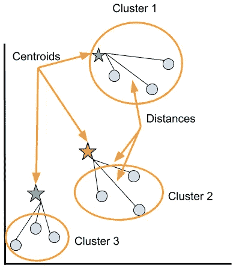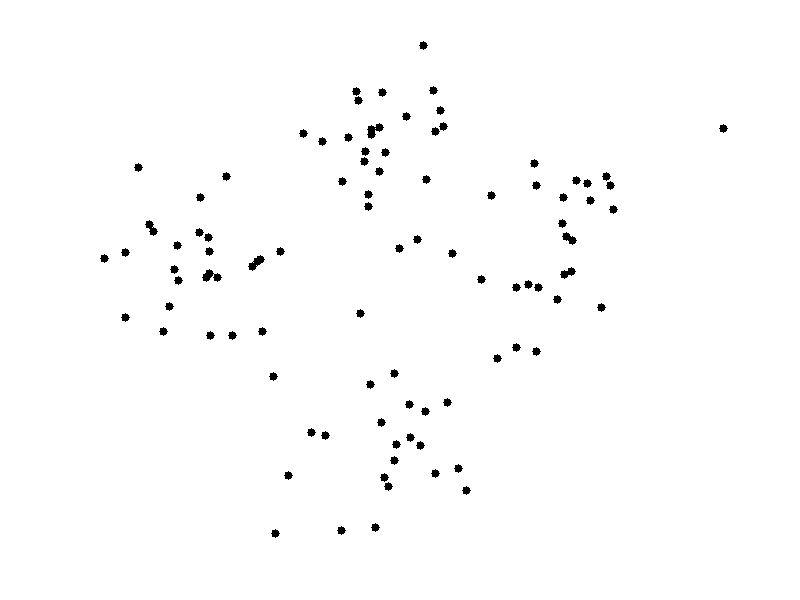

[http://shabal.in/visuals/kmeans/6.html](http://shabal.in/visuals/kmeans/6.html)

## 选择初始质心

我们需要知道 KMeans 如何选择初始质心，以及这会产生什么问题。如果没有我们的干预，KMeans 将随机选择初始质心，这最终会在相同的数据上产生不同的聚类。从下面的图中，我们可以看到在两种不同的情况下运行 KMeans 算法会产生不同的初始质心。在第一次和第二次运行 KMeans 之间，相同的数据点被分配给不同的聚类。

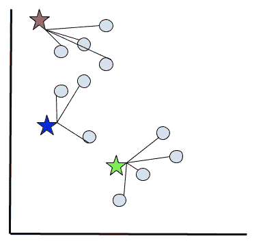

第一次初始化

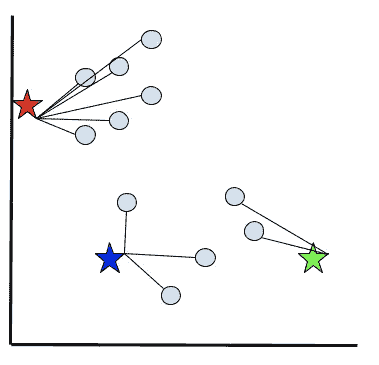

第二次初始化

不要害怕，Sklearn 是我们的后盾！Sklearn KMeans 库有一些参数，比如“n_int”和“max_iter ”,可以缓解这个问题。“n_int”参数决定了 KMeans 随机选择不同质心的次数。“Max_iter”决定了将运行多少次迭代。迭代是寻找距离、取平均距离和移动质心的过程。

> 如果我们将参数设置为 n_int=25，max_iter=200，则 Means 将随机选择 25 个初始质心，并运行每个质心多达 200 次迭代。这 25 个质心中最好的将成为最终的聚类。

Sklearn 还有一个“int”参数，它将随机选择第一个质心，并定位所有离第一个质心最远的数据点。然后，第二个质心被分配在那些远点附近，因为它们不太可能属于第一个质心。Sklearn 默认选择“int=kmeans++”，这应用了上述逻辑。


## 如何确定聚类数？

> “您提到了需要选择集群的数量……。？我们如何做到这一点？”

**领域知识**:通常我们在收集数据集的领域拥有一定水平的知识和经验。这种专业知识可以让我们设定我们认为存在于一般人群中的聚类数。

**假设检验**:设定一个特定的聚类数也可以作为我们可能有的某个假设的检验。例如，在分析营销数据时，我们有一种预感，有 3 个客户群非常可能、可能和不可能购买我们的产品。

**数据是预先标记的**:有时候我们分析的数据带有预先标记的目标。这些数据集通常用于有监督的 ML 问题，但这并不意味着我们不能对数据进行聚类。预先标记的数据是唯一的，因为您需要从初始分析中移除目标，然后使用它们来验证模型对数据的聚类效果。

**肘方法**:这是一种非常流行的迭代统计技术，通过对一系列聚类值实际运行 K-Means 算法来确定最佳聚类数。对于 KMeans 的每次迭代，肘形法计算每个点到其指定质心的距离平方和。每次迭代都要经过不同数量的集群。结果是一个折线图，显示每个聚类的平方距离之和。我们希望选择折线图肘部的聚类数或最小距离平方和(即。惯性)。距离平方和越小，意味着每个分类中的数据分组越紧密。

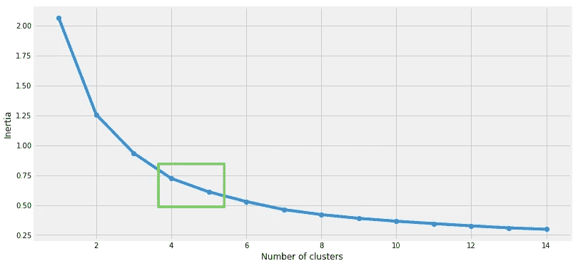

## 缩放:标准化

KMeans 对比例非常敏感，要求所有要素的比例相同。KMeans 会将更多的权重或重点放在方差较大的特征上，这些特征会对最终的聚类形状产生更大的影响。例如，让我们考虑一个汽车信息数据集，如重量(lbs)和马力(hp)。如果所有汽车之间的重量差异较大，平均欧几里得距离将会受到重量的更大影响。最终，重量比马力更能影响每个集群的成员。

## 高维度

诸如 KMeans 之类的聚类算法很难准确地聚类高维数据(即功能太多)。我们的数据集不一定是高维的，因为它包含 7 个要素，但即使是这个数量也会给 KMeans 带来问题。我建议你探索一下[维度的诅咒](https://en.wikipedia.org/wiki/Curse_of_dimensionality)以获得更多细节。正如我们前面看到的，许多聚类算法使用距离公式(即欧几里德距离)来确定聚类成员资格。当我们的聚类算法有太多的维度时，成对的点将开始有非常相似的距离，我们将不能获得有意义的聚类。

在这个例子中，我们将在运行 K-Means 聚类算法之前比较 PCA 和 t-SNE 数据简化技术。让我们花几分钟来解释 PCA 和 t-SNE。

## 主成分分析

主成分分析(PCA)是一种经典的方法，我们可以用它将高维数据降低到低维空间。换句话说，我们根本无法精确地可视化高维数据集，因为我们无法可视化 3 个要素以上的任何内容(1 个要素=1D，2 个要素= 2D，3 个要素=3D 绘图)。PCA 背后的主要目的是将具有 3 个以上特征(高维)的数据集转换成典型的 2D 或 3D 图，供我们这些虚弱的人使用。这就是低维空间的含义。PCA 背后的美妙之处在于，尽管减少到低维空间，我们仍然保留了原始高维数据集的大部分(+90%)方差或信息。来自我们原始特征的信息或差异被“挤压”到 PCA 所称的主成分(PC)中。第一台 PC 将包含原始特征的大部分信息。第二台电脑将包含第二大信息量，第三台电脑包含第三大信息量，依此类推。PC 是不相关的(即正交的)，这意味着它们都包含独特的信息片段。我们通常可以“挤压”大多数(即 80–90 %)的信息或包含在原始特征中的变化分解成几个主要成分。我们在分析中使用这些主要成分，而不是使用原始特征。这样，我们可以仅用 2 或 3 个主成分而不是 50 个特征进行分析，同时仍然保持原始特征的 80–90%的信息。

让我们来看看 PCA 是如何变魔术的一些细节。为了使解释变得简单一点，让我们看看如何减少具有两个特征的数据集(即 2D)在一个主成分(1D)。也就是说，将 50 个特征缩减为 3 或 4 个主成分使用了相同的方法。

我们有一张体重和身高的 2D 图。换句话说，我们有一个 7 人的数据集，并绘制了他们的身高与体重的关系。

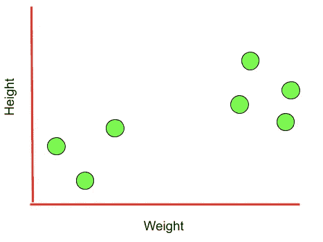

首先，PCA 需要通过测量每个点到 y 轴(身高)和 x 轴(体重)的距离来确定数据的中心。然后计算两个轴的平均距离(即身高和体重)并使用这些平均值将数据居中。

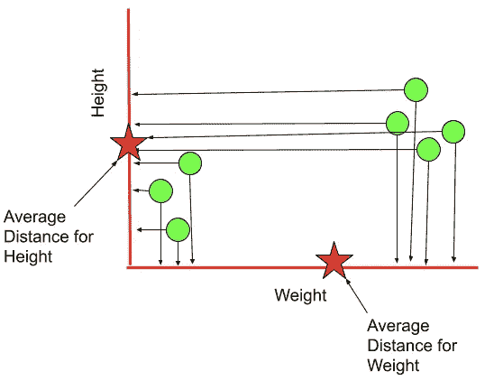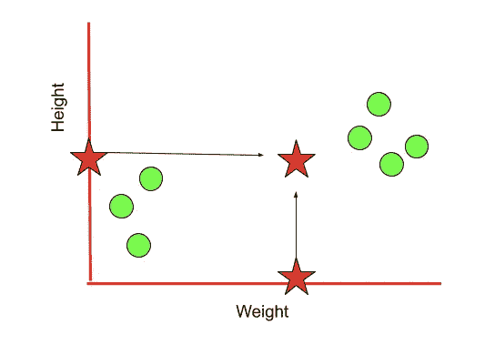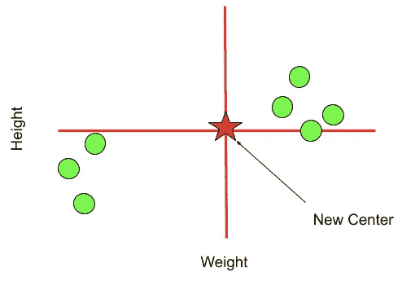

然后 PCA 将绘制第一主成分(PC1)或最佳拟合线，其最大化体重和身高之间的方差或信息量。 ***它通过最大化投影到最佳拟合线上的点到原点的距离来确定最佳拟合线(即下面蓝光)。*** 它对每个绿点都这样做，然后它对每个距离进行平方，去掉负值，并对所有值求和。最佳拟合线或 PC1 将具有从原点到所有点的投影点的最大距离平方和。

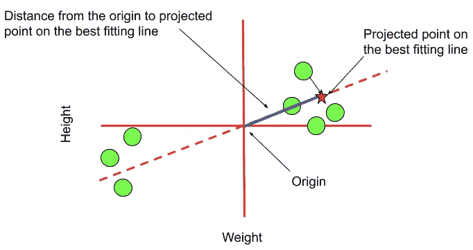

现在，我们只需将轴旋转到 PC1 现在是 x 轴的位置，我们就完成了。

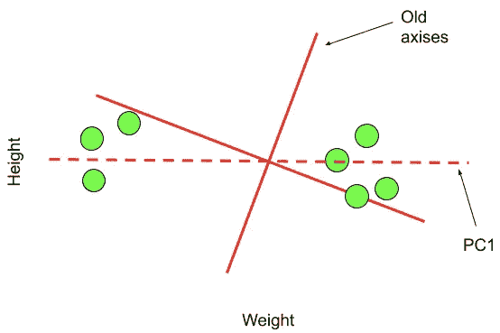

如果我们想要将 3 个特征减少到两个主要成分，我们将简单地在 2D 空间中放置一条与我们的最佳拟合线垂直的线(y 轴)。为什么是垂直线？因为每个主分量与所有其他特征正交或不相关。如果我们想要找到第三个主分量，我们将简单地找到另一条到 PC1 和 PC2 的正交线，但是这次是在 3D 空间中。

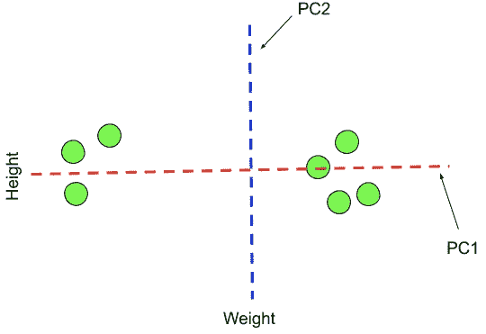

从下面的柱状图可以看出，我们最初是从一个包含 5 个要素的数据集开始的。记住主成分的数量总是等于特征的数量。然而，我们可以看到，前 2 个主成分占原始 5 个特征中包含的方差或信息的 90%。这就是我们如何确定主成分的最佳数量。重要的是要记住 PCA 经常用于可视化非常高维的数据(即数以千计的特征)，因此，您将最常看到 2 或 3 个主成分的 PCA。


## t 分布随机邻居嵌入(t-SNE)

就像 PCA 一样，t-SNE 提取高维数据，并将其简化为低维图形(通常为二维)。这也是一个很好的降维技术。与主成分分析不同，t-SNE 可以降低非线性关系的维数。换句话说，如果我们的数据具有这种“瑞士滚”非线性分布，其中 X 或 Y 的变化与其他变量的恒定变化不一致。PCA 不能够准确地将这些数据提取到主成分中。这是因为 PCA 试图通过分布绘制最佳拟合线。在这种情况下，T-SNE 将是一个更好的解决方案，因为它根据点之间的距离计算相似性度量，而不是试图最大化方差。

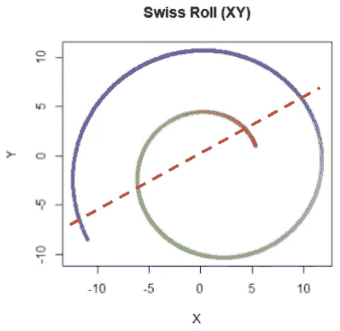

让我们来看看 t-SNE 是如何将高维数据空间转换成低维空间的。它通过观察距离(想想欧几里德距离)来看局部或附近点之间的相似性。彼此相邻的点被认为是相似的。然后，t-SNE 将每对点的相似性距离转换成每对点的概率。如果在高维空间中两个点彼此靠近，它们将具有高概率值，反之亦然。这样，选择一组点的概率与它们的相似性成比例。

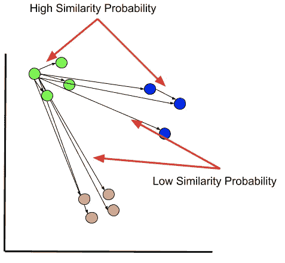

假设的高维空间

然后将每个点随机地*投影到低维空间中。对于这个例子，我们在 1 维空间中绘图，但是我们也可以在 2 维或 3 维空间中绘图。为什么是 2d 还是 3d？因为那些是我们(人类)唯一能想象的维度。记住 t-SNE 首先是一个可视化工具，其次是一个降维工具。*

**

*随机投影到一维空间*

*最后，t-SNE 在低维空间中计算相似性概率得分，以便将这些点聚集在一起。结果是我们下面看到的一维图。*

*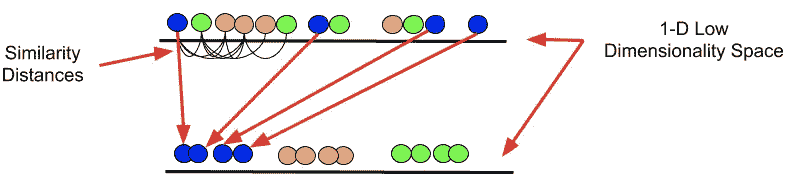*

*关于 t-SNE，我们需要讨论的最后一件事是“困惑”，这是运行算法时需要的参数。“困惑”决定了一个空间有多宽或多紧 t-SNE 捕捉到了点与点之间的相似之处。如果你的困惑是低的(也许 2)，t-SNE 将只使用两个相似的点，并产生一个有许多分散集群的情节。然而，当我们将困惑度增加到 10 时，SNE 霸王龙会将 10 个相邻点视为相似，并将它们聚集在一起，从而形成更大的点群。有一个收益递减点，在这个点上，困惑会变得太大，我们会得到一个有一两个分散集群的地块。在这一点上，t-SNE 错误地认为不一定相关的点属于一个集群。根据最初发表的论文([链接](http://www.jmlr.org/papers/volume9/vandermaaten08a/vandermaaten08a.pdf))，我们通常将困惑度设置在 5 到 50 之间。*

*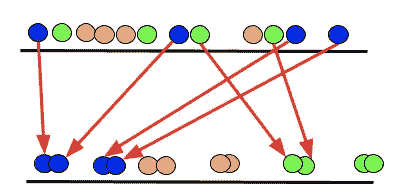*

*困惑太低*

*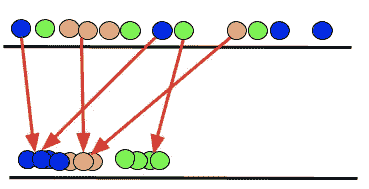*

*困惑太高*

*t-SNE 的主要限制之一是它的高计算成本。如果你有一个非常大的特征集，最好先用主成分分析将特征数量减少到几个主成分，然后用 t-SNE 进一步将数据减少到 2 或 3 个聚类。*

> *L 让我们回到克迈斯……..*

## *k 均值聚类评估*

*当使用无监督的 ML 算法时，我们经常不能将我们的结果与已知的真实标签进行比较。换句话说，我们没有测试集来衡量我们模型的性能。也就是说，我们仍然需要了解 K-Means 如何成功地对我们的数据进行聚类。通过查看肘形图和我们选择的聚类数，我们已经知道数据在我们的聚类中包含的紧密程度。*

***剪影法:**该技术衡量聚类之间的可分性。首先，找出每个点和一个聚类中所有其他点之间的平均距离。然后它测量每个点与其他簇中每个点之间的距离。我们减去两个平均值，然后除以较大的平均值。*

*我们最终想要一个高(即。最接近 1)的分数，其将指示存在小的群内平均距离(紧密的群)和大的群间平均距离(充分分离的群)。*

***视觉聚类解释:**一旦你获得了你的聚类，解释每个聚类是非常重要的。这通常是通过将原始数据集与聚类合并并可视化每个聚类来完成的。每个聚类越清晰和明显越好。我们将在下面回顾这个过程。*

# *我们群集吧！*

*下面是分析计划:*

1.  *使数据标准化*
2.  *对原始数据集应用 KMeans*
3.  *通过主成分分析的特征约简*
4.  *将 KMeans 应用于 PCA 主成分分析*
5.  *基于 t-SNE 的特征约简*
6.  *将 KMeans 应用于 t-SNE 聚类*
7.  *比较主成分分析和 t-SNE 均值聚类*

```
*import pandas as pd
import numpy as np
import matplotlib.pyplot as plt
from mpl_toolkits.mplot3d import Axes3D
import seaborn as sns
import plotly.offline as pyo
pyo.init_notebook_mode()
import plotly.graph_objs as go
from plotly import tools
from plotly.subplots import make_subplots
import plotly.offline as py
import plotly.express as pxfrom sklearn.cluster import KMeans
from sklearn.preprocessing import StandardScaler
from sklearn.decomposition import PCA
from sklearn.manifold import TSNE
from sklearn.metrics import silhouette_score%matplotlib inline
from warnings import filterwarnings
filterwarnings('ignore')with open('HR_data.csv') as f:
    df =  pd.read_csv(f, usecols=['satisfaction_level', 'last_evaluation', 'number_project',
       'average_montly_hours', 'time_spend_company', 'Work_accident','promotion_last_5years'])
f.close()df.head()*
```

*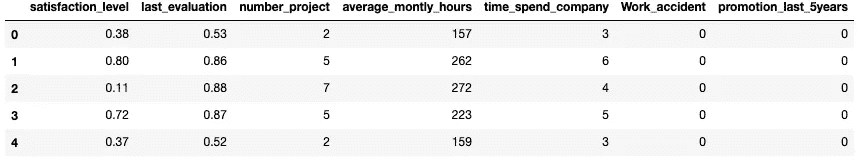*

*这是一个相对干净的数据集，没有任何缺失值或异常值。我们看不到任何需要编码的混合型特征、奇数值或罕见标签。要素也具有较低的多重共线性。让我们继续扩展我们的数据集。*

# *1.标准化*

*如上所述，数据的标准化最终将使所有特征达到相同的尺度，并使平均值为零，标准偏差为 1。*

```
*scaler = StandardScaler()
scaler.fit(df)
X_scale = scaler.transform(df)df_scale = pd.DataFrame(X_scale, columns=df.columns)
df_scale.head()*
```

*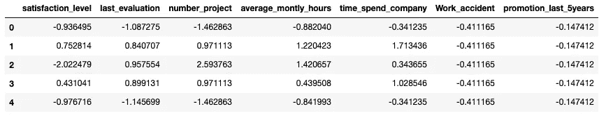*

# *2.原始数据集上的 KMeans*

*让我们利用肘方法来确定 KMeans 应该获得的最佳集群数。看起来 4 或 5 个集群是最好的，为了简单起见，我们选择 4 个。*

```
*sse = []
k_list = range(1, 15)for k in k_list:
    km = KMeans(n_clusters=k)
    km.fit(df_scale)
    sse.append([k, km.inertia_])

oca_results_scale = pd.DataFrame({'Cluster': range(1,15), 'SSE': sse})
plt.figure(figsize=(12,6))
plt.plot(pd.DataFrame(sse)[0], pd.DataFrame(sse)[1], marker='o')
plt.title('Optimal Number of Clusters using Elbow Method (Scaled Data)')
plt.xlabel('Number of clusters')
plt.ylabel('Inertia')*
```

*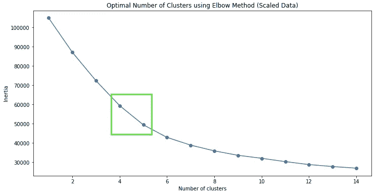*

*让我们对请求 4 个集群的原始数据集应用 KMeans。我们取得了 0.25 的剪影分数，这是低端。*

```
*df_scale2 = df_scale.copy()kmeans_scale = KMeans(n_clusters=4, n_init=100, max_iter=400, init='k-means++', random_state=42).fit(df_scale2)print('KMeans Scaled Silhouette Score: {}'.format(silhouette_score(df_scale2, kmeans_scale.labels_, metric='euclidean')))labels_scale = kmeans_scale.labels_
clusters_scale = pd.concat([df_scale2, pd.DataFrame({'cluster_scaled':labels_scale})], axis=1)*
```

*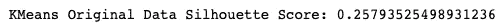*

*使用 PCA 将数据集减少为 3 个主要成分，我们可以将 KMeans 衍生的聚类绘制成 2D 和 3D 图像。PCA 可视化倾向于围绕一个中心点聚集聚类，这使得解释困难，但是我们可以看到聚类 1 和 3 与聚类 0 和 2 相比具有一些不同的结构。然而，当我们将集群绘制到 3D 空间中时，我们可以清楚地区分所有 4 个集群。*

```
*pca2 = PCA(n_components=3).fit(df_scale2)
pca2d = pca2.transform(df_scale2)plt.figure(figsize = (10,10))
sns.scatterplot(pca2d[:,0], pca2d[:,1], 
                hue=labels_scale, 
                palette='Set1',
                s=100, alpha=0.2).set_title('KMeans Clusters (4) Derived from Original Dataset', fontsize=15)plt.legend()
plt.ylabel('PC2')
plt.xlabel('PC1')
plt.show()*
```

*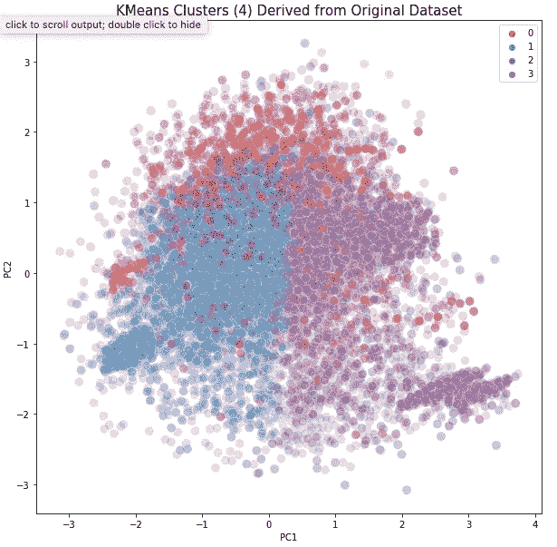*

```
*Scene = dict(xaxis = dict(title  = 'PC1'),yaxis = dict(title  = 'PC2'),zaxis = dict(title  = 'PC3'))labels = labels_scaletrace = go.Scatter3d(x=pca2d[:,0], y=pca2d[:,1], z=pca2d[:,2], mode='markers',marker=dict(color = labels, colorscale='Viridis', size = 10, line = dict(color = 'gray',width = 5)))layout = go.Layout(margin=dict(l=0,r=0),scene = Scene, height = 1000,width = 1000)data = [trace]fig = go.Figure(data = data, layout = layout)
fig.show()*
```

*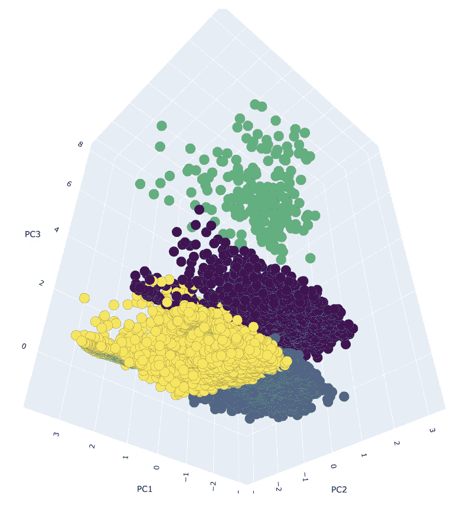*

# *3.通过主成分分析的特征约简*

*首先，让我们确定我们需要的主成分的最佳数量是多少。通过检查每个主成分包含的方差，我们可以看到前 3 个主成分解释了大约 70%的方差。最后，我们再次应用主成分分析，将我们的数据集减少到 3 个主成分。*

```
*#n_components=7 because we have 7 features in the dataset
pca = PCA(n_components=7)
pca.fit(df_scale)
variance = pca.explained_variance_ratio_var = np.cumsum(np.round(variance, 3)*100)
plt.figure(figsize=(12,6))
plt.ylabel('% Variance Explained')
plt.xlabel('# of Features')
plt.title('PCA Analysis')
plt.ylim(0,100.5)plt.plot(var)*
```

*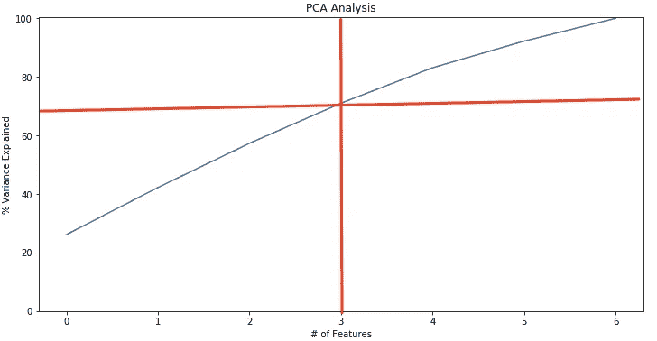*

```
*pca = PCA(n_components=3)
pca_scale = pca.fit_transform(df_scale)pca_df_scale = pd.DataFrame(pca_scale, columns=['pc1','pc2','pc3'])print(pca.explained_variance_ratio_)*
```

*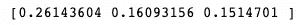*

*每台电脑解释的差异百分比*

# *4.将 k 均值应用于 PCA 主成分分析*

*现在，我们已经将 7 个要素的原始数据集减少到只有 3 个主成分，让我们应用 KMeans 算法。我们再次需要确定集群的最佳数量，而 4 似乎是正确的选择。重要的是要记住，我们现在使用 3 个主成分而不是最初的 7 个特征来确定最佳聚类数。*

```
*sse = []
k_list = range(1, 15)for k in k_list:
    km = KMeans(n_clusters=k)
    km.fit(pca_df_scale)
    sse.append([k, km.inertia_])

pca_results_scale = pd.DataFrame({'Cluster': range(1,15), 'SSE': sse})
plt.figure(figsize=(12,6))
plt.plot(pd.DataFrame(sse)[0], pd.DataFrame(sse)[1], marker='o')
plt.title('Optimal Number of Clusters using Elbow Method (PCA_Scaled Data)')
plt.xlabel('Number of clusters')
plt.ylabel('Inertia')*
```

*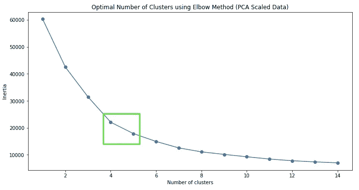*

*现在我们准备将 KMeans 应用于 PCA 主成分。我们可以看到，通过传递 KMeans 低维数据集，我们能够将轮廓得分从 0.25 提高到 0.36。查看 2D 和 3D 散点图，我们可以看到聚类之间的区别有了显著改善。*

```
*kmeans_pca_scale = KMeans(n_clusters=4, n_init=100, max_iter=400, init='k-means++', random_state=42).fit(pca_df_scale)
print('KMeans PCA Scaled Silhouette Score: {}'.format(silhouette_score(pca_df_scale, kmeans_pca_scale.labels_, metric='euclidean')))labels_pca_scale = kmeans_pca_scale.labels_
clusters_pca_scale = pd.concat([pca_df_scale, pd.DataFrame({'pca_clusters':labels_pca_scale})], axis=1)*
```

*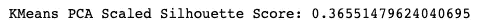*

```
*plt.figure(figsize = (10,10))sns.scatterplot(clusters_pca_scale.iloc[:,0],clusters_pca_scale.iloc[:,1], hue=labels_pca_scale, palette='Set1', s=100, alpha=0.2).set_title('KMeans Clusters (4) Derived from PCA', fontsize=15)plt.legend()
plt.show()*
```

***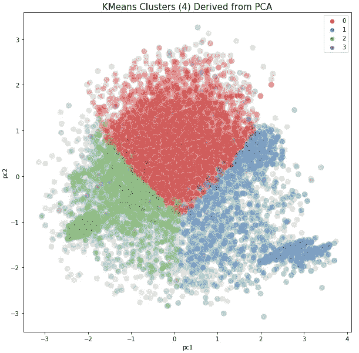**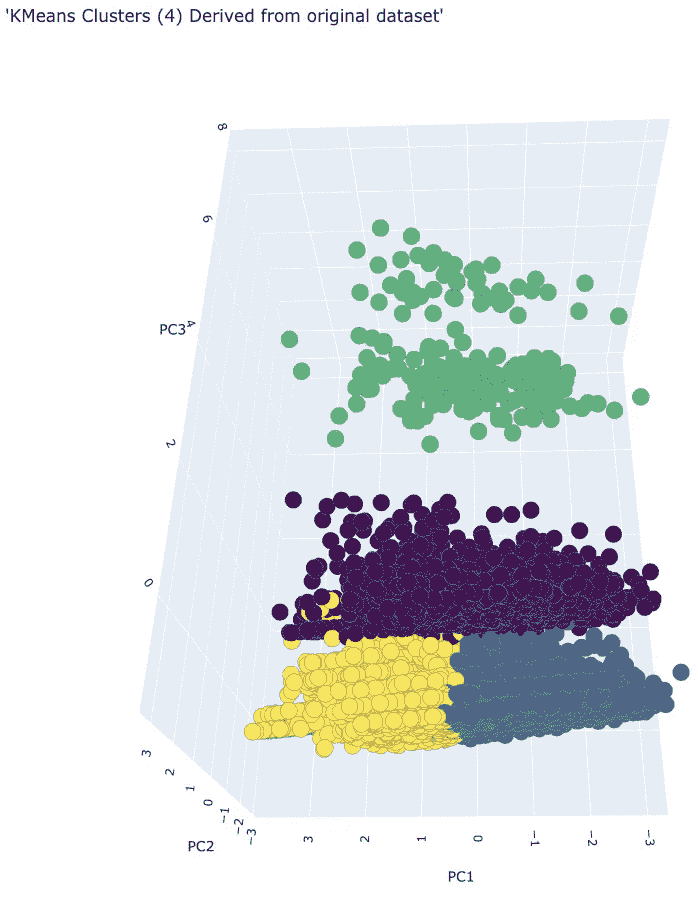**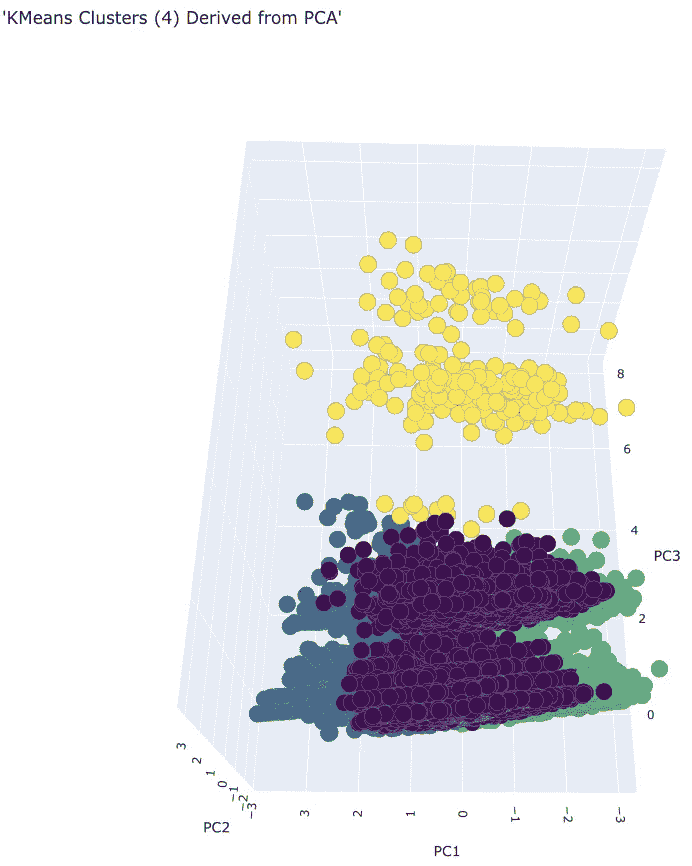*

# *5.基于 t-SNE 的特征约简*

*当我们将维数减少到 3 个主成分时，我们可以看到 KMeans 对数据进行聚类的能力有了明显的提高。在本节中，我们将再次使用 t-SNE 缩减我们的数据，并将 KMeans 的结果与 PCA KMeans 的结果进行比较。我们将减少到 3 个 t-SNE 组件。请记住，t-SNE 是一个计算量很大的算法。使用' n_iter '参数可以减少计算时间。此外，您在下面看到的代码是“困惑”参数多次迭代的结果。任何超过 80 的困惑倾向于将我们的数据聚集成一个大的分散的集群。*

```
*tsne = TSNE(n_components=3, verbose=1, perplexity=80, n_iter=5000, learning_rate=200)
tsne_scale_results = tsne.fit_transform(df_scale)tsne_df_scale = pd.DataFrame(tsne_scale_results, columns=['tsne1', 'tsne2', 'tsne3'])plt.figure(figsize = (10,10))
plt.scatter(tsne_df_scale.iloc[:,0],tsne_df_scale.iloc[:,1],alpha=0.25, facecolor='lightslategray')
plt.xlabel('tsne1')
plt.ylabel('tsne2')
plt.show()*
```

*下面是将我们的原始数据集缩减为绘制在 2D 空间中的 3 个 t-SNE 分量的结果。*

*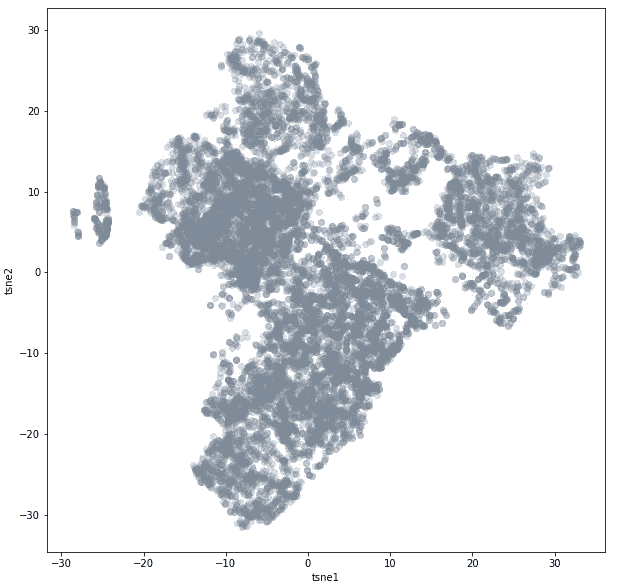*

# *6.将 KMeans 应用于 t-SNE 聚类*

*对于我们的 KMeans 分析来说，4 似乎又是一个神奇的聚类数。*

```
*sse = []
k_list = range(1, 15)for k in k_list:
    km = KMeans(n_clusters=k)
    km.fit(tsne_df_scale)
    sse.append([k, km.inertia_])

tsne_results_scale = pd.DataFrame({'Cluster': range(1,15), 'SSE': sse})
plt.figure(figsize=(12,6))
plt.plot(pd.DataFrame(sse)[0], pd.DataFrame(sse)[1], marker='o')
plt.title('Optimal Number of Clusters using Elbow Method (tSNE_Scaled Data)')
plt.xlabel('Number of clusters')
plt.ylabel('Inertia')*
```

*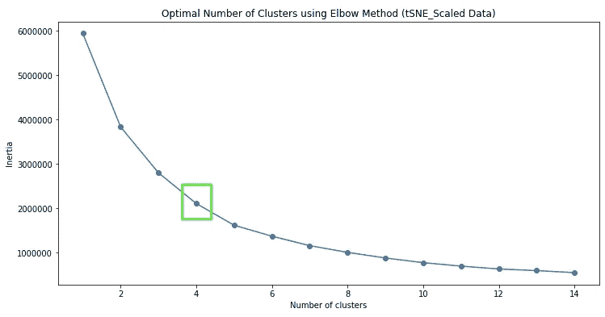*

*将 KMeans 应用于我们的 3 t-SNE 衍生组件，我们能够获得 0.39 的轮廓得分。如果您还记得从 KMeans 获得的 PCA 的 3 个主成分的轮廓分数是 0.36。一个相对较小的改进，但仍然是一个进步。*

```
*kmeans_tsne_scale = KMeans(n_clusters=4, n_init=100, max_iter=400, init='k-means++', random_state=42).fit(tsne_df_scale)print('KMeans tSNE Scaled Silhouette Score: {}'.format(silhouette_score(tsne_df_scale, kmeans_tsne_scale.labels_, metric='euclidean')))labels_tsne_scale = kmeans_tsne_scale.labels_
clusters_tsne_scale = pd.concat([tsne_df_scale, pd.DataFrame({'tsne_clusters':labels_tsne_scale})], axis=1)*
```

*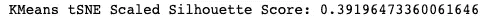*

*对 SNE 霸王龙的解释可能有点违反直觉，因为 SNE 霸王龙星团的密度(即低维空间)与原始(高维空间)数据集中的数据关系不成比例。换句话说，我们可以从 k 均值聚类中获得高质量的密集聚类，但 t-SNE 可能会将它们显示为非常宽的聚类，甚至显示为多个聚类，尤其是当困惑度太低时。在阅读 t-SNE 图时，密度、聚类大小、聚类数量(在同一个 k 均值聚类下)和形状真的没有什么意义。对于同一个 KMeans 聚类，我们可以有非常广泛、密集甚至多个聚类(尤其是当困惑度太低时)，但这与聚类的质量无关。相反，SNE 霸王龙的主要优势是每个克曼星团的距离和位置。彼此靠近的集群将彼此更加相关。然而，这并不意味着彼此远离的集群在比例上是不同的。最后，我们希望看到使用 t-SNE 显示的 k 均值聚类之间的某种程度的分离。*

```
*plt.figure(figsize = (15,15))
sns.scatterplot(clusters_tsne_scale.iloc[:,0],clusters_tsne_scale.iloc[:,1],hue=labels_tsne_scale, palette='Set1', s=100, alpha=0.6).set_title('Cluster Vis tSNE Scaled Data', fontsize=15)plt.legend()
plt.show()*
```

*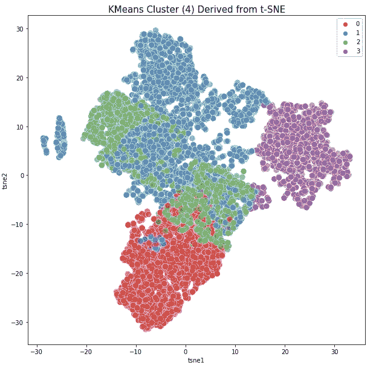*

```
*Scene = dict(xaxis = dict(title  = 'tsne1'),yaxis = dict(title  = 'tsne2'),zaxis = dict(title  = 'tsne3'))labels = labels_tsne_scaletrace = go.Scatter3d(x=clusters_tsne_scale.iloc[:,0], y=clusters_tsne_scale.iloc[:,1], z=clusters_tsne_scale.iloc[:,2], mode='markers',marker=dict(color = labels, colorscale='Viridis', size = 10, line = dict(color = 'yellow',width = 5)))layout = go.Layout(margin=dict(l=0,r=0),scene = Scene, height = 1000,width = 1000)data = [trace]fig = go.Figure(data = data, layout = layout)
fig.show()*
```

*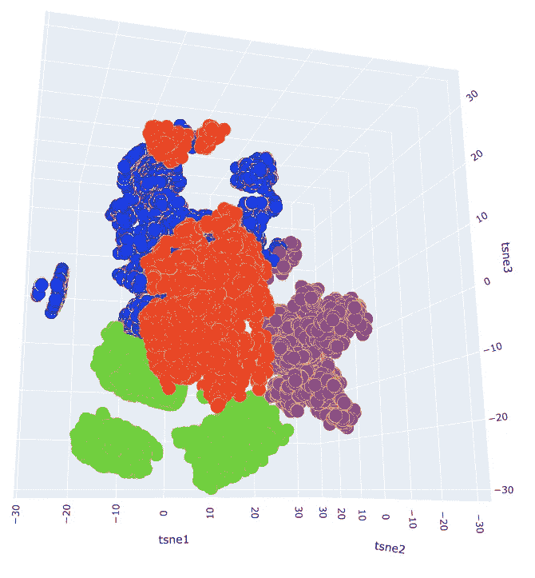*

# *7.比较 PCA 和 t-SNE 衍生的 k 均值聚类*

*盯着 PCA/t-SNE 图并比较评估指标(如轮廓得分)将为我们提供从 KMeans 导出的聚类的技术视角。如果我们想从业务的角度理解集群，我们需要对照原始特性检查集群。换句话说，什么类型的雇员组成了我们从 KMeans 获得的集群。这种分析不仅有助于指导业务和潜在的持续分析，还能让我们深入了解集群的质量。*

*让我们首先将 KMeans 集群与原始的未缩放特征合并。我们将创建两个独立的数据框。一个用于 PCA 导出 k 均值聚类，一个用于 t-SNE k 均值聚类。*

```
*cluster_tsne_profile = pd.merge(df, clusters_tsne_scale['tsne_clusters'], left_index=True, right_index=True )cluster_pca_profile = pd.merge(df, clusters_pca_scale['pca_clusters'], left_index=True, right_index=True )*
```

*让我们通过基于每个单独的特征来比较聚类，从聚类的单变量回顾开始。*

```
*for c in cluster_pca_profile:
    grid = sns.FacetGrid(cluster_pca_profile, col='pca_clusters')
    grid.map(plt.hist, c)*
```

*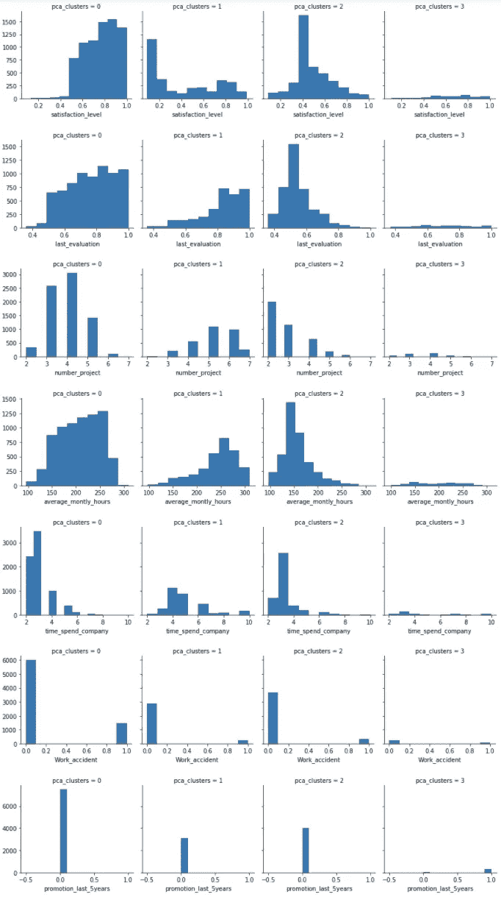*

```
*for c in cluster_tsne_profile:
    grid = sns.FacetGrid(cluster_tsne_profile, col='tsne_clusters')
    grid.map(plt.hist, c)*
```

*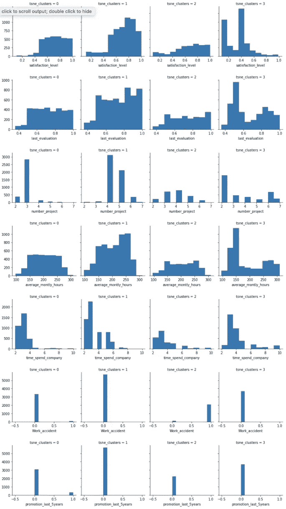*

## *满意度 X 上次评估*

*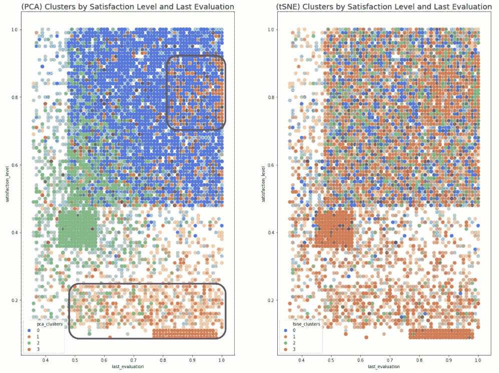*

*当我们从双变量的角度来研究集群时，真正的乐趣就开始了。当我们检查员工满意度和最后的评估分数时，我们可以看到从我们的主成分得到的 KMeans 聚类更加明确。我们将把我们对满意度和绩效之间的二元关系的检验集中在从 PCA 得到的聚类上。*

*聚类 0 代表最大数量的员工(7488)，他们平均对工作相对满意，表现得分范围很广。因为这个集群代表了将近 50%的人口，所以我们看到如此大范围的满意度和绩效分数也就不足为奇了。还有一个规模较小但很明显的非常满意的高绩效员工群体。*

*集群 1 代表了劳动力的关键部分，因为这些是非常高绩效的员工，但不幸的是，员工满意度极低。事实上，集群 1 代表了 20%的劳动力，这只会增加情况的严重性。不满意的员工面临更大的自愿离职风险。他们的高分不仅表明了他们的熟练程度，也表明了他们潜在的机构知识。失去这些员工会导致组织知识和绩效的显著下降。看到组织级别(即经理、董事、执行董事)。失去大部分高级管理人员是一个重大问题。*

*第 2 组似乎代表了满意度较低的低绩效员工。同样，不满意的员工面临更高的自愿离职风险，由于他们的低绩效评估，我们可能会将这些员工视为“建设性离职”。换句话说，这些员工的自愿离职实际上可能对组织是一件好事。我们必须从两个不同的角度来看待这些结果。首先，这些雇员占总人口的 25%以上。如果这些员工中有很大一部分辞职，组织可能很难拥有足够的员工来成功履行其职能。其次，如此大比例的人不满意和表现不佳充分说明了组织的招聘、管理和培训功能。这些员工可能是组织计划不完善的结果。如果公司能更深入地探究是什么让这些员工不满意和表现不佳，那将会给自己带来巨大的好处。*

*最后，聚类 3 仅包含 2%的人口，并且没有可辨别的分布。我们需要一个更大的数据集来充分发掘这些员工。*

```
*plt.figure(figsize=(15,10))
fig , (ax1, ax2) = plt.subplots(1,2, figsize=(20,15))
sns.scatterplot(data=cluster_pca_profile, x='last_evaluation', y='satisfaction_level', 
                hue='pca_clusters', s=85, alpha=0.4, palette='bright', ax=ax1).set_title(
    '(PCA) Clusters by satisfaction level and last_evaluation',fontsize=18)sns.scatterplot(data=cluster_tsne_profile, x='last_evaluation', y='satisfaction_level', 
                hue='tsne_clusters', s=85, alpha=0.4, palette='bright', ax=ax2).set_title('(tSNE) Clusters by satisfaction level and last evaluation', fontsize=18)*
```

**

## *满意度 X 平均每月小时数*

*非常有趣的是，满意度和绩效得分之间的二元关系几乎等同于满意度和每月平均工作时间。同样，从 PCA 得到的 k 均值聚类明显更加明显，让我们将注意力集中在 PCA 特征上。*

*看起来，PCA 集群 0 中的员工不仅表现出色，而且平均每月工作时间也很长。总的来说，这些结果是有希望的，因为大多数员工总体上是快乐的，表现令人钦佩，并且工作时间很长。*

*集群 1 员工再次不满意，平均每月工作时间最长。如果你还记得的话，这些人也是非常优秀的员工。这些长时间的工作很可能会对他们的整体工作满意度产生影响。请记住，第 1 类员工中有一个人数较少但正在崛起的群体，他们总体上感到满意，表现非常好。在我们的数据集中可能不止有 4 个聚类。*

*集群 2 的员工不仅表现不佳，而且平均月工作时间也最低。请记住，这个数据集可能有点失真，因为一个月工作 160 小时被视为全职。*

*最后，聚类 3 再次没有出现在图中。*

```
*plt.figure(figsize=(15,10))
fig , (ax1, ax2) = plt.subplots(1,2, figsize=(20,15))
sns.scatterplot(data=cluster_pca_profile, x='average_montly_hours', y='satisfaction_level', 
                hue='pca_clusters',s=85, alpha=0.4, palette='bright', ax=ax1).set_title(
    '(PCA) Clusters by Satisfaction Level and Average Monthly Hours',fontsize=18)sns.scatterplot(data=cluster_tsne_profile, x='average_montly_hours', y='satisfaction_level', 
                hue='tsne_clusters', s=85, alpha=0.4, palette='bright', ax=ax2).set_title(
    '(tSNE) Clusters by Satisfaction Level and Average Monthly Hours', fontsize=18)*
```

*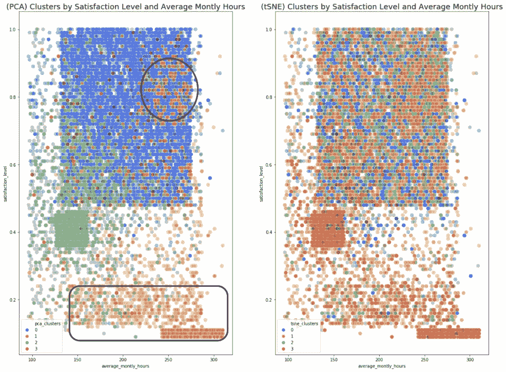*

## *满意度 X 花在公司的时间(任期)*

*当我们继续我们的二元图时，我们比较了满意度和在公司或任期内花费的时间。不足为奇的是，PCA 主成分的 k 均值聚类要明显得多。t-SNE 图与 PCA 图的形状相似，但其聚类更加分散。通过查看 PCA 图，我们发现了一个关于 0 类或绝大多数(50%)员工的重要发现。群组 0 中的员工主要在公司工作了 2 到 4 年。这是一个相当常见的统计数据，因为随着任期的增加，延长任期(即 5 年以上)的员工数量将会减少。此外，他们的总体高满意度表明平均任期可能会增加，因为满意的员工不太可能辞职。*

*分类 1 有点难以描述，因为它的数据点分散在两个不同的分类中。总的来说，他们的任期在 4 到 6 年之间变化不大，然而，他们的满意度却相反。有一个集群是高工作满意度和一个更大的集群与非常低的工作满意度。看起来集群 1 可能包含两个不同的雇员组。那些对工作很开心又很不满意的人。也就是说，尽管他们的满意度不同，但他们的工作表现、平均每月工作时间和任期都更高。看起来第一组要么快乐要么不快乐，都是非常努力和忠诚的员工。*

*聚类 2 遵循与上述图相同的模式。他们不仅对工作不满意，而且平均任期也是最低的。然而，重要的是要记住这些员工占组织的 26%。失去这些员工中的很大一部分会产生问题。最后，不满意的员工不太可能参与组织公民行为，如利他主义、尽责、乐于助人，而更有可能参与反生产的工作行为，这可能会产生有毒的文化。从任期、公司级别、离职率、地点和工作类型等方面剖析这些员工将非常有助于诊断问题和制定行动计划。*

*最后，第三组仍然过于分散，无法为我们提供任何有用的信息。根本没有足够的员工来识别任何有用的模式。*

```
*plt.figure(figsize=(15,10))
fig = plt.subplots(1,2, figsize=(20,15))
ax1 = sns.catplot(data=cluster_pca_profile, x='time_spend_company', y='satisfaction_level', 
                hue='pca_clusters', jitter=0.47, s=7, alpha=0.5, height=8, aspect=1.5, palette='bright')
ax2 = sns.catplot(data=cluster_tsne_profile, x='time_spend_company', y='satisfaction_level', 
                hue='tsne_clusters', jitter=0.47, s=7, alpha=0.5, height=8, aspect=1.5, palette='bright')
ax1.fig.suptitle('(PCA) Clusters by satisfaction level and time_spend_company', fontsize=16)
ax2.fig.suptitle('(t-SNE) Clusters by satisfaction level and time_spend_company', fontsize=16)
plt.close(1)
plt.close(2)*
```

*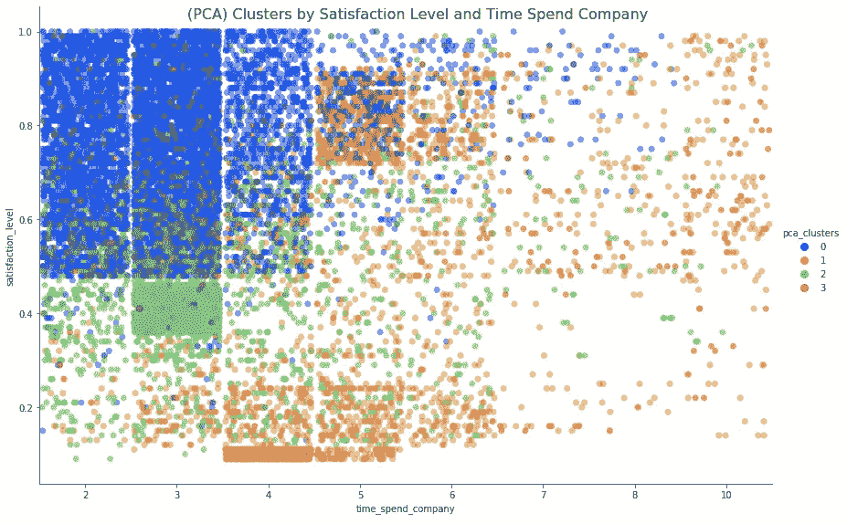**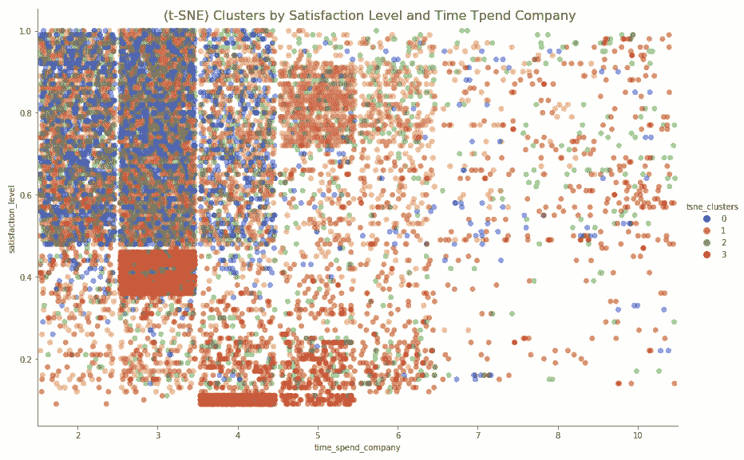*

## *满意度 X 项目数量*

*然而，五氯苯甲醚衍生的聚类再次优于 SNE 霸王龙，只是略微领先。集群 0 继续遵循类似的趋势，总体上快乐的员工有平均数量的项目。没什么可过分兴奋或担心的。这可能为组织的员工指出理想的项目数量。*

*集群 1 的员工也在跟随他们的趋势，我们在之前的图表中已经看到了这一点。看到项目数量时，非常不满意正在极其努力地工作的员工。如果你还记得的话，这个小组在这个月也工作了很长时间。我们再一次看到一个较小但明显的满意的员工团队在平均数量的项目上工作。这与我们在满意度 X 任期、平均每月工作时间和上次评估分数中看到的趋势相同。肯定还有另一群非常满意和努力工作的员工。在招聘方面更深入地了解这些员工(即来源、招聘人员)、管理实践、薪酬，可能会导致对成功的招聘和雇用实践的洞察。这些见解也可能有助于组织了解如何转化表现不佳的员工。*

*集群 2 也在跟随它的趋势。不太满意的员工在很少的项目上工作。这种趋势在所有满意的双变量关系中都可以看到。*

*第三组太小，无法看出任何明显的趋势。*

```
*plt.figure(figsize=(15,10))
fig = plt.subplots(1,2, figsize=(20,15))
ax1 = sns.catplot(data=cluster_pca_profile, x='number_project', y='satisfaction_level', 
                hue='pca_clusters', jitter=0.47, s=7, alpha=0.5, height=8, aspect=1.5, palette='bright')
ax2 = sns.catplot(data=cluster_tsne_profile, x='number_project', y='satisfaction_level', 
                hue='tsne_clusters', jitter=0.47, s=7,alpha=0.5, height=8, aspect=1.5, palette='bright')
ax1.fig.suptitle('(PCA) Clusters by Satisfaction Level and Number of Projects', fontsize=16)
ax2.fig.suptitle('(t-SNE) Clusters by Satisfaction Level and Number of Projects', fontsize=16)
plt.close(1)
plt.close(2)*
```

*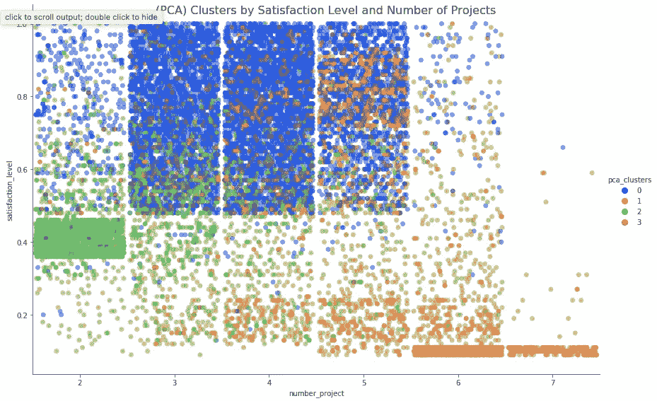**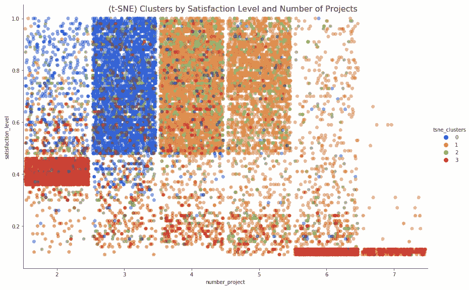*

# *8.摘要*

*我们当然可以继续检查每个聚类和我们的特征之间的二元关系，但我们看到了一个明确的趋势。以下是我们敦促您检查的其余关系图。*

*本文的目的是检验不同降维技术(即主成分分析和 t-SNE)将对 KMeans 产生的聚类质量产生影响。我们检查了一个相对干净的人力资源数据集，包括超过 15，000 名员工及其工作特征。从最初的 7 个特征，我们设法将数据集减少到 3 个主要成分和 3 个 t-SNE 成分。我们的轮廓分数范围从 0.25(未缩减数据集)到 0.36(主成分分析)和 0.39 (t-SNE)。通过目测，PCA 和 t-SNE 衍生的 KMeans 聚类与未简化的原始 7 个特征相比，在数据聚类方面做得更好。直到我们开始比较主成分分析和 t-SNE 均值聚类在员工工作特征方面的差异，我们才发现了显著的差异。PCA 方法提取的聚类似乎产生更清晰和明确的聚类。*

*从商业的角度来看，如果没有对 PCA KMeans 聚类进行总结，我们会对读者造成伤害。*

***聚类 0:** 该聚类包含数据集中的大多数员工(50%)。这个集群主要包含普通员工。他们的工作满意度保持在一个平均水平，他们的月工作时间有一个很大的范围，但没有延伸到极限。他们的表现也是如此，因为他们大多保持着令人满意的成绩。这些员工参与的项目数量平均也在 3 到 5 个之间。我们看到的这些员工的唯一异常值是他们在公司相对年轻的任期(2-4 年)。这些结果并不罕见，因为即使是拥有足够员工的组织也会在许多因素上遵循高斯分布。随着样本量的增加，我们在统计上将有更高的概率选择位于分布中间的员工，离群值对分布的拉动将越来越小(即回归到平均值)。很容易理解为什么 KMeans 创建了这个员工集群。*

***集群 1:** 有时，这群员工有一定的双重性或并列性。一方面，我们看到了一群非常不满意的员工，他们取得了绝对惊人的绩效分数，工作时间非常长，管理着大量的项目，任期超过平均水平，并且零事故发生。换句话说，对组织不满的非常努力和有价值的员工。如果这些员工开始流动，公司将在生产力和知识方面遭受重大损失。*

*另一方面，我们看到了一个较小但明显的非常满意的员工群体，他们有着惊人的绩效分数、高于平均水平的项目数量、每月工作时间和任期。无论如何，公司有幸拥有模范员工。满意度无疑是分裂因素，因为当我们将团队的表现与任期甚至项目数量进行比较时，这两个独特的团队往往会合并。*

*看起来还有其他员工没有被 KMeans 识别出来。对于 KMeans 算法来说，也许 5 个甚至 6 个聚类可能是更好的标准。*

***聚类 2:** 虽然这个聚类没有像聚类 0 那样被很好地定义，但是我们能够在数据中看到一个明确的趋势。平均而言，这些员工对公司并不十分满意。他们的表现通常处于较低水平。他们在最少的项目上每月工作最少的时间。他们的任期平均在 3 年左右。*

***集群 3:** 最后，集群 3 的员工约占数据集的 2%，这使得几乎不可能在数据中识别出任何可辨别的趋势。*

```
*plt.figure(figsize=(15,10))
fig = plt.subplots(1,2, figsize=(20,15))
ax1 = sns.catplot(data=cluster_pca_profile, x='Work_accident', y='satisfaction_level', 
                hue='pca_clusters', jitter=0.47, s=7, alpha=0.3, height=8, aspect=1.5, palette='bright')
ax2 = sns.catplot(data=cluster_tsne_profile, x='Work_accident', y='satisfaction_level', 
                hue='tsne_clusters', jitter=0.47, s=7, alpha=0.3, height=8, aspect=1.5, palette='bright')
ax1.fig.suptitle('(PCA) Clusters by Satisfaction Level and Work Accident', fontsize=16)
ax2.fig.suptitle('(t-SNE) Clusters by Satisfaction Level and Work Accident', fontsize=16)
plt.close(1)
plt.close(2)*
```

*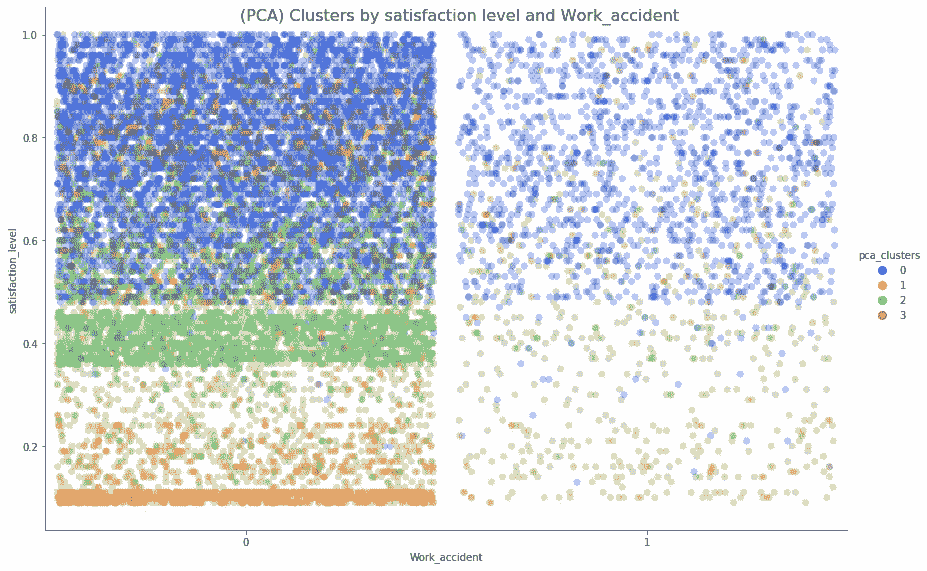**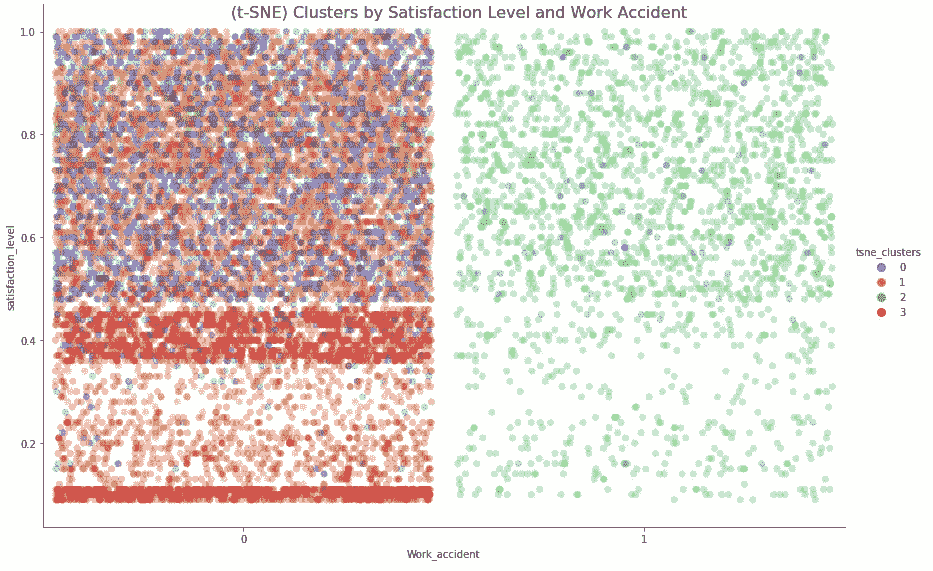*

```
*plt.figure(figsize=(15,10))
fig = plt.subplots(1,2, figsize=(20,15))
ax1 = sns.catplot(data=cluster_pca_profile, x='number_project', y='last_evaluation', 
                hue='pca_clusters', jitter=0.47, s=7, alpha=0.4, height=8, aspect=1.5, palette='bright')
ax2 = sns.catplot(data=cluster_tsne_profile, x='number_project', y='last_evaluation', 
                hue='tsne_clusters', jitter=0.47, s=7, alpha=0.4, height=8, aspect=1.5, palette='bright')
ax1.fig.suptitle('(PCA) Clusters by Last Evaluation and Number Projects', fontsize=16)
ax2.fig.suptitle('(t-SNE) Clusters by Last Evaluation and Number Projects', fontsize=16)
plt.close(1)
plt.close(2)*
```

*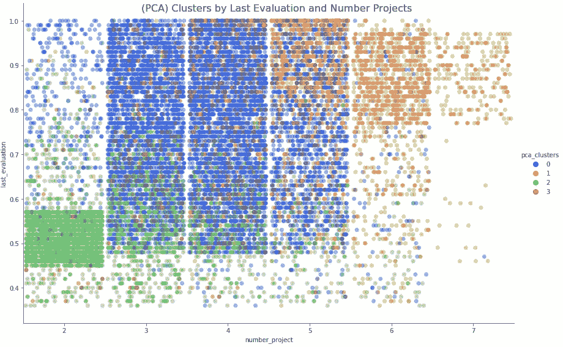**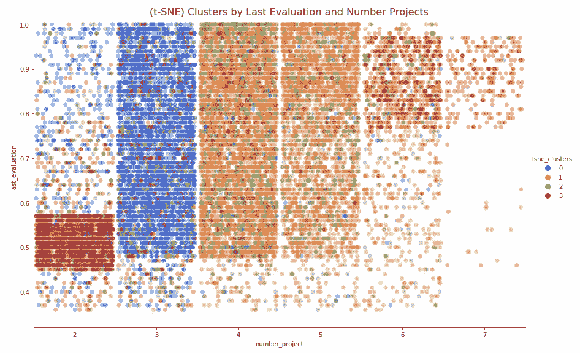*

```
*plt.figure(figsize=(15,10))
fig , (ax1, ax2) = plt.subplots(1,2, figsize=(20,15))
sns.scatterplot(data=cluster_pca_profile, x='average_montly_hours', y='last_evaluation', 
                hue='pca_clusters', s=85, alpha=0.3, palette='bright', ax=ax1).set_title(
    '(PCA) Clusters by Last Evaluation and Average Montly Hours',fontsize=18)sns.scatterplot(data=cluster_tsne_profile, x='average_montly_hours', y='last_evaluation', 
                hue='tsne_clusters', s=85, alpha=0.3, palette='bright', ax=ax2).set_title(
    '(tSNE) Clusters by Last Evaluation and Average Montly Hours', fontsize=18)*
```

*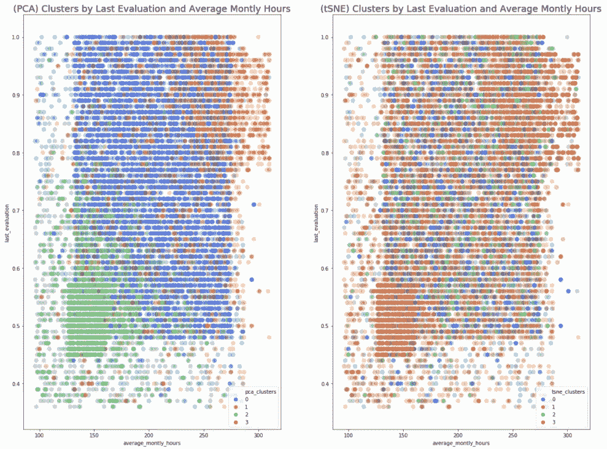*

```
*plt.figure(figsize=(15,10))
fig = plt.subplots(1,2, figsize=(20,15))
ax1 = sns.catplot(data=cluster_pca_profile, x='time_spend_company', y='last_evaluation', 
                hue='pca_clusters', jitter=0.47, s=7, alpha=0.5, height=8, aspect=1.5, palette='bright')
ax2 = sns.catplot(data=cluster_tsne_profile, x='time_spend_company', y='last_evaluation', 
                hue='tsne_clusters', jitter=0.47, s=7, alpha=0.5, height=8, aspect=1.5, palette='bright')
ax1.fig.suptitle('(PCA) Clusters by Last Evaluation and Time Spend Company', fontsize=16)
ax2.fig.suptitle('(t-SNE) Clusters by  Last Evaluation and Time Spend Company', fontsize=16)
plt.close(1)
plt.close(2)*
```

*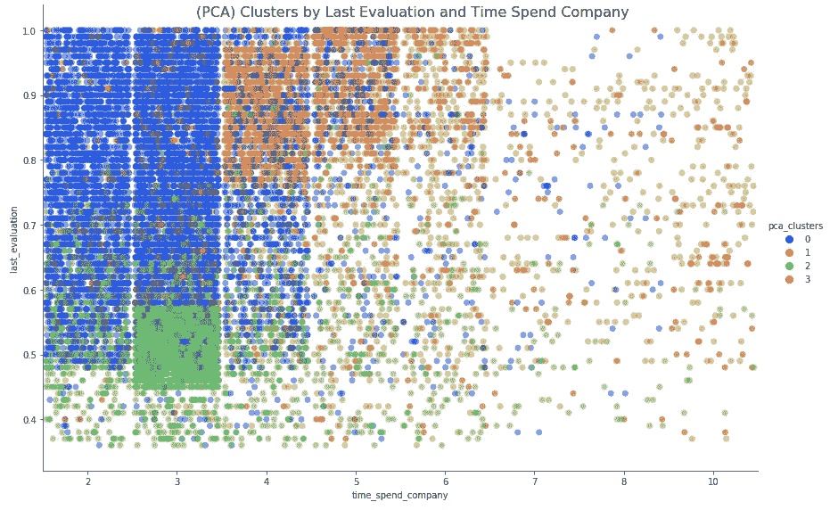**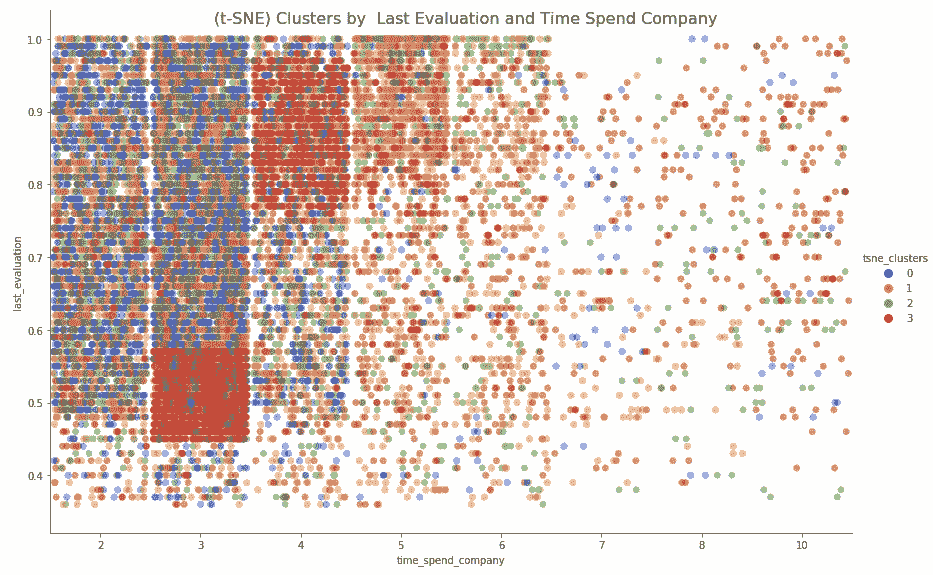*

```
*plt.figure(figsize=(15,10))
fig = plt.subplots(1,2, figsize=(20,15))
ax1 = sns.catplot(data=cluster_pca_profile, x='Work_accident', y='last_evaluation', 
                hue='pca_clusters', jitter=0.47, s=7, alpha=0.4, height=8, aspect=1.5, palette='bright')
ax2 = sns.catplot(data=cluster_tsne_profile, x='Work_accident', y='last_evaluation', 
                hue='tsne_clusters', jitter=0.47, s=7, alpha=0.4, height=8, aspect=1.5, palette='bright')
ax1.fig.suptitle('(PCA) Clusters by Last Evaluation and Work Accident', fontsize=16)
ax2.fig.suptitle('(t-SNE) Clusters by Last Evaluation and Work Accident', fontsize=16)
plt.close(1)
plt.close(2)*
```

*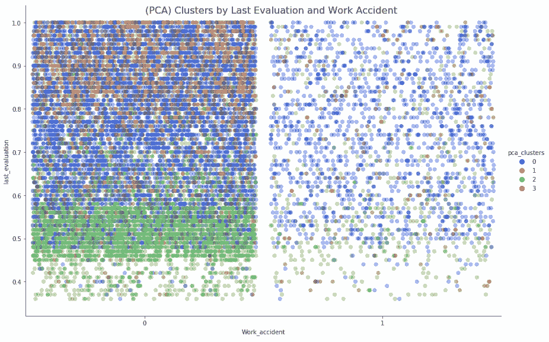**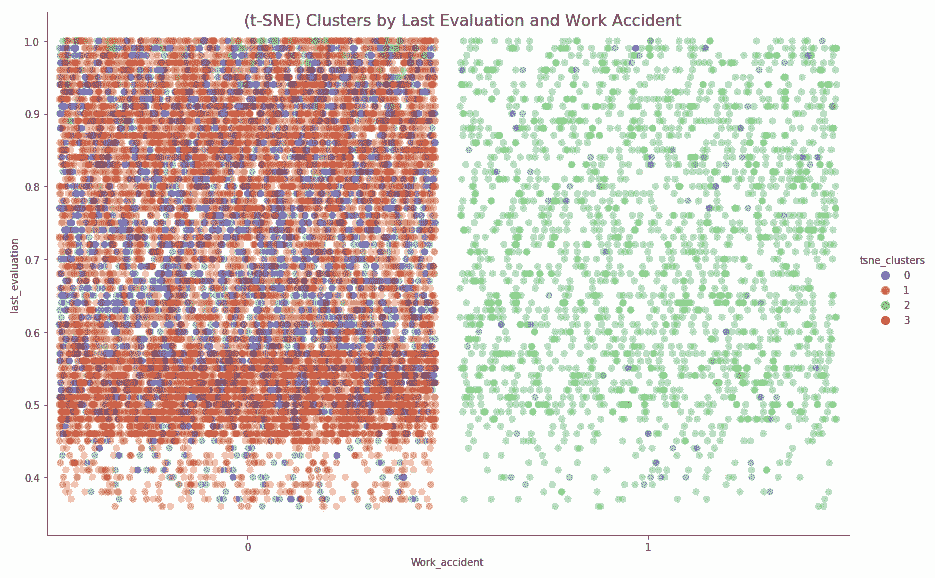*

```
*plt.figure(figsize=(15,10))
fig = plt.subplots(1,2, figsize=(20,15))
ax1 = sns.catplot(data=cluster_pca_profile, x='number_project', y='average_montly_hours', 
                hue='pca_clusters', jitter=0.47, s=7, alpha=0.5, height=8, aspect=1.5, palette='bright')
ax2 = sns.catplot(data=cluster_tsne_profile, x='number_project', y='average_montly_hours', 
                hue='tsne_clusters', jitter=0.47, s=7,  alpha=0.5, height=8, aspect=1.5, palette='bright')
ax1.fig.suptitle('(PCA) Clusters by Number Project and Average Montly Hours', fontsize=16)
ax2.fig.suptitle('(t-SNE) Clusters by Number Project and Average Montly Hours', fontsize=16)
plt.close(1)
plt.close(2)*
```

***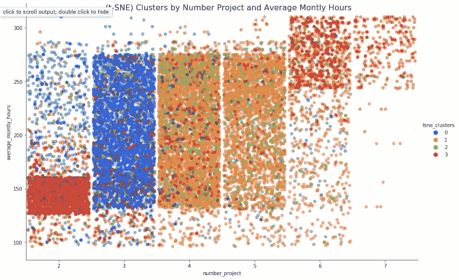*

```
*plt.figure(figsize=(15,10))
fig = plt.subplots(1,2, figsize=(20,15))
ax1 = sns.catplot(data=cluster_pca_profile, x='number_project', y='time_spend_company',
                hue='pca_clusters', jitter=0.4, s=30, alpha=0.2, height=8, aspect=1.5, palette='bright')
ax2 = sns.catplot(data=cluster_tsne_profile, x='number_project', y='time_spend_company', 
                hue='tsne_clusters', jitter=0.4, s=30, alpha=0.2, height=8, aspect=1.5, palette='bright')
ax1.fig.suptitle('(PCA) Clusters by Number Project and Time Spend Company', fontsize=16)
ax2.fig.suptitle('(t-SNE) Clusters by Number Project and Time Spend Company', fontsize=16)
plt.close(1)
plt.close(2)*
```

*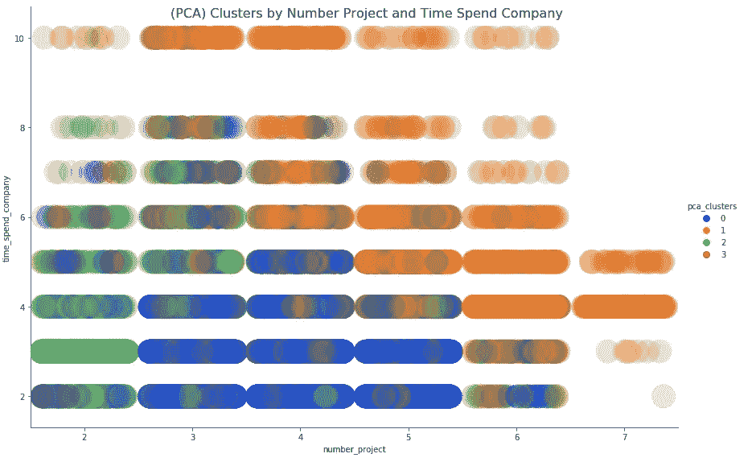**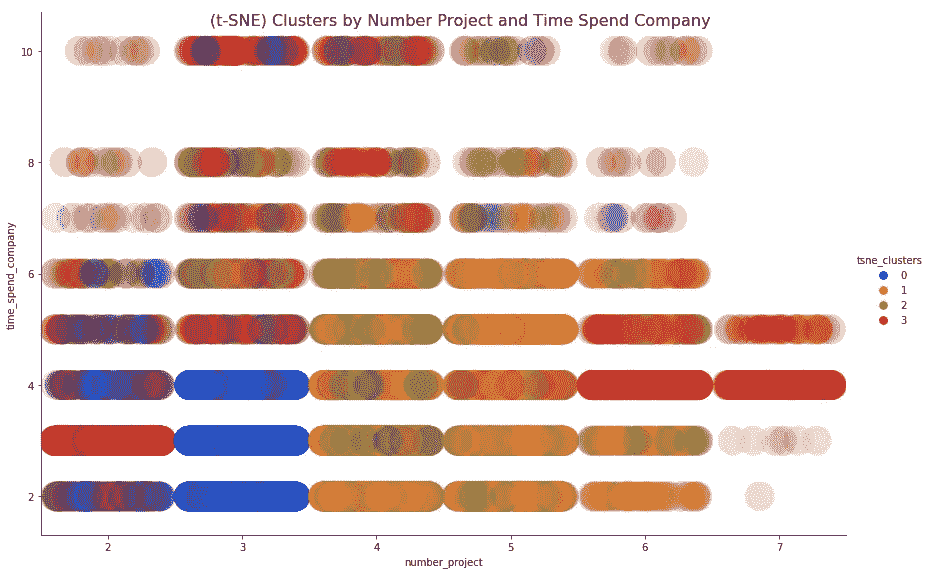*

```
*plt.figure(figsize=(15,10))
fig = plt.subplots(1,2, figsize=(20,15))
ax1 = sns.catplot(data=cluster_pca_profile, x='Work_accident', y='number_project',
                hue='pca_clusters', jitter=0.45, s=30, alpha=0.2, height=8, aspect=1.5, palette='bright')
ax2 = sns.catplot(data=cluster_tsne_profile, x='Work_accident', y='number_project', 
                hue='tsne_clusters', jitter=0.45, s=30, alpha=0.2, height=8, aspect=1.5, palette='bright')
ax1.fig.suptitle('(PCA) Clusters by Number Project and Work Accident', fontsize=16)
ax2.fig.suptitle('(t-SNE) Clusters by Number Project and Work Accident', fontsize=16)
plt.close(1)
plt.close(2)*
```

*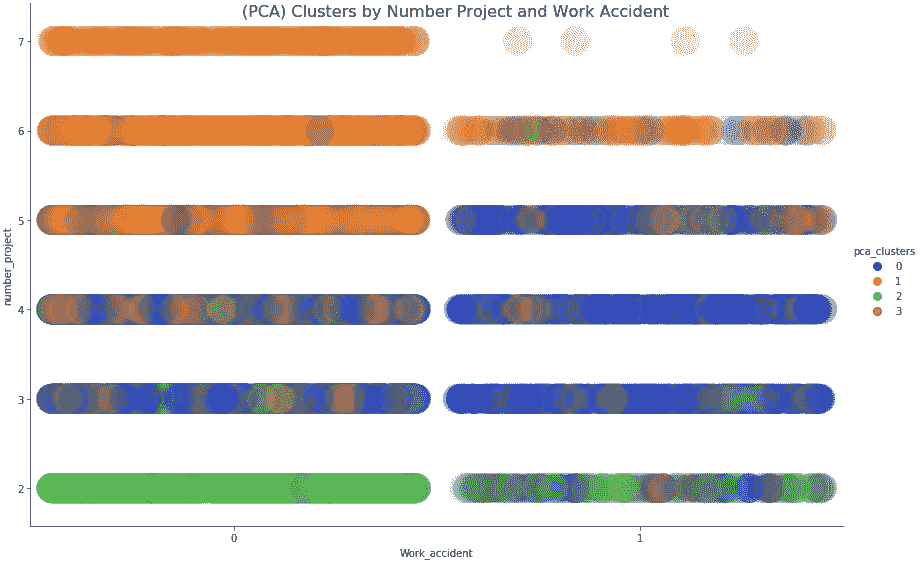**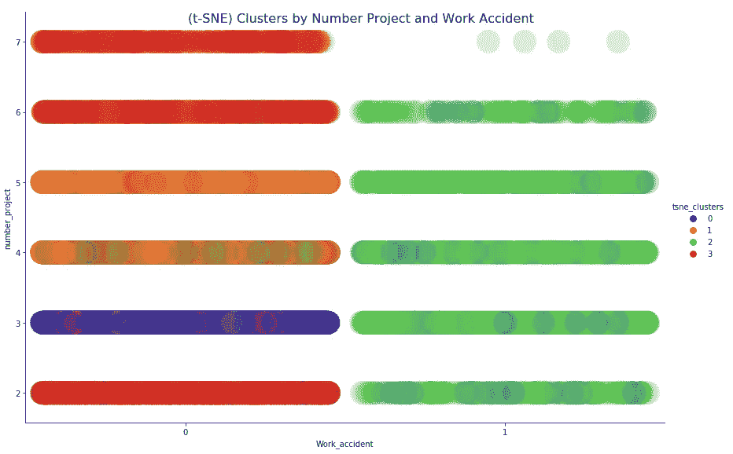*

```
*plt.figure(figsize=(15,10))
fig = plt.subplots(1,2, figsize=(20,15))
ax1 = sns.catplot(data=cluster_pca_profile, x='time_spend_company', y='average_montly_hours', 
                hue='pca_clusters', jitter=0.47, s=7, alpha=0.4, height=8, aspect=1.5, palette='bright')
ax2 = sns.catplot(data=cluster_tsne_profile, x='time_spend_company', y='average_montly_hours', 
                hue='tsne_clusters', jitter=0.47, s=7, alpha=0.4, height=8, aspect=1.5, palette='bright')
ax1.fig.suptitle('(PCA) Clusters by Time Spend Company and Average Monthly Hours', fontsize=16)
ax2.fig.suptitle('(t-SNE) Clusters by  Time Spend Company and Average Monthly Hours', fontsize=16)
plt.close(1)
plt.close(2)*
```

*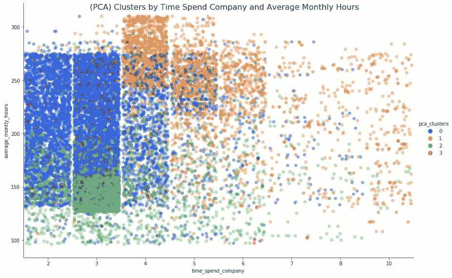**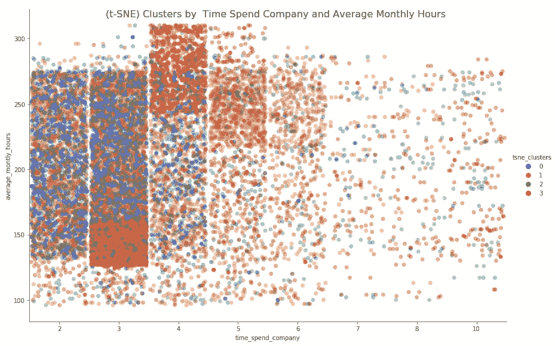*

```
*plt.figure(figsize=(15,10))
fig = plt.subplots(1,2, figsize=(20,15))
ax1 = sns.catplot(data=cluster_pca_profile, x='Work_accident', y='average_montly_hours', 
                hue='pca_clusters', jitter=0.47, s=7, alpha=0.4, height=8, aspect=1.5, palette='bright')
ax2 = sns.catplot(data=cluster_tsne_profile, x='Work_accident', y='average_montly_hours', 
                hue='tsne_clusters', jitter=0.47, s=7, alpha=0.4, height=8, aspect=1.5, palette='bright')
ax1.fig.suptitle('(PCA) Clusters by Work Accident and Average Monthly Hours', fontsize=16)
ax2.fig.suptitle('(t-SNE) Clusters by Work Accident and Average Monthly Hours', fontsize=16)
plt.close(1)
plt.close(2)*
```

*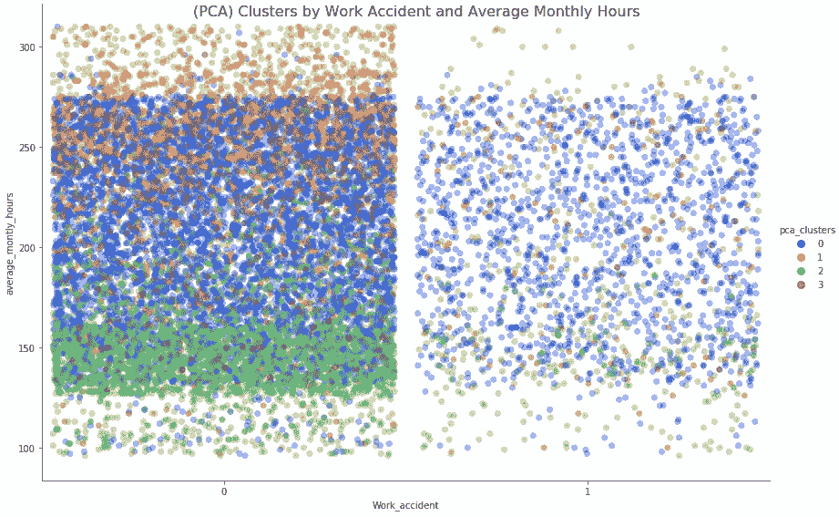**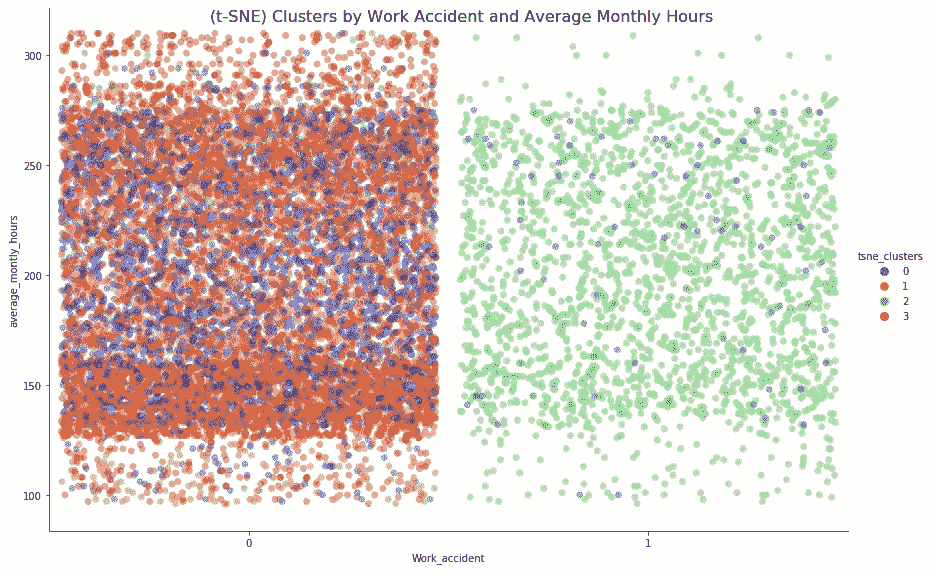*

```
*plt.figure(figsize=(15,10))
fig = plt.subplots(1,2, figsize=(20,15))
ax1 = sns.catplot(data=cluster_pca_profile, x='Work_accident', y='time_spend_company', 
                hue='pca_clusters', jitter=0.45, s=40, alpha=0.2, height=8, aspect=1.5, palette='bright')
ax2 = sns.catplot(data=cluster_tsne_profile, x='Work_accident', y='time_spend_company', 
                hue='tsne_clusters', jitter=0.45, s=40, alpha=0.2, height=8, aspect=1.5, palette='bright')
ax1.fig.suptitle('(PCA) Clusters by Work Accident and Time Spend Company', fontsize=16)
ax2.fig.suptitle('(t-SNE) Clusters by Work Accident and Time Spend Company', fontsize=16)
plt.close(1)
plt.close(2)*
```

*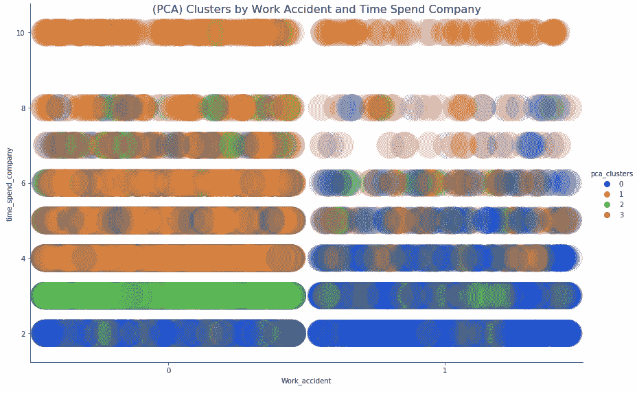**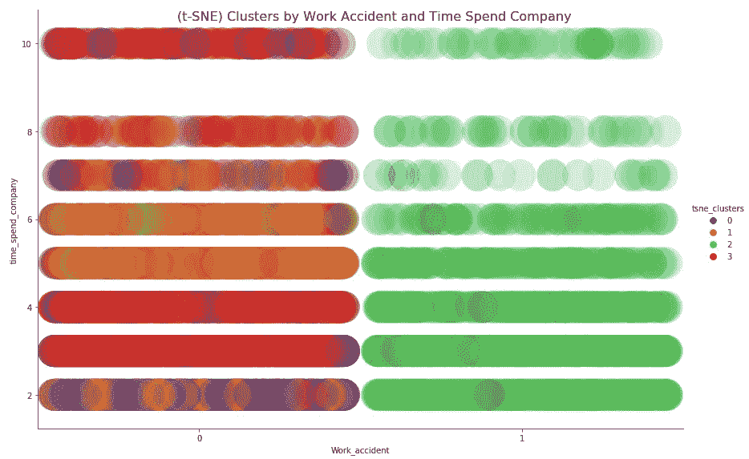*