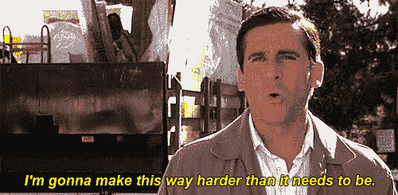
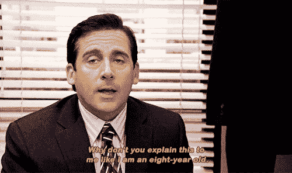
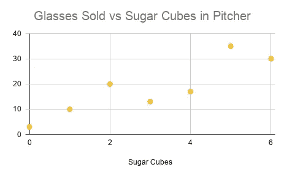
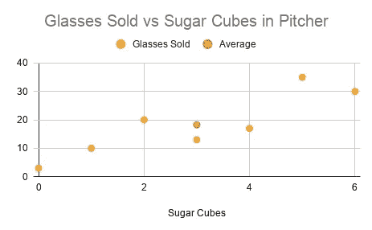
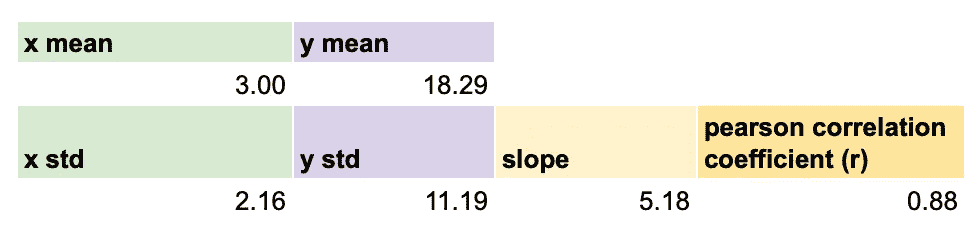
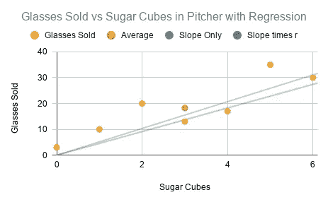
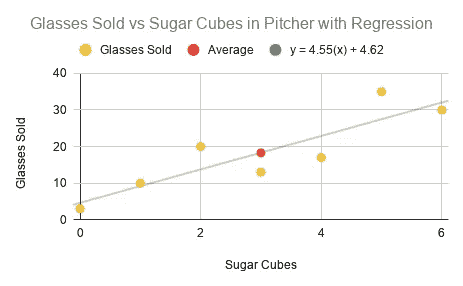

# 向迈克尔·斯科特解释线性回归

> 原文：<https://towardsdatascience.com/explaining-linear-regression-to-michael-scott-973ed050493c?source=collection_archive---------53----------------------->

如果我能在办公室的一个场景中总结出统计学对我的意义，那就是这个:

来源: [Wiffle Gif](https://wifflegif.com/tags/8519-steve-carell-gifs?page=16)

公式、希腊符号、复杂名称之间(均方根对数误差，有人吗？！)，我发现核心概念变得难以理解或学习起来令人生畏。这篇文章的目标是让你直观地了解**线性回归如何工作**、**如何解释一个回归公式、**和**r 用来表示**什么。我的目标是不要像迈克尔那样，而要像奥斯卡那样，在这集有趣又有启发性的节目中，他教迈克尔什么是预算盈余。

来源: [Tumblr](https://www.tumblr.com/search/surplus%20surplus%20surplus)

# **什么是线性回归，我们如何计算回归公式？**

以奥斯卡为例，我将提出一个场景，我们正在经营一个柠檬水摊位，并希望找到最完美的配方来最大限度地提高销售额。假设我们要研究的第一个变量是甜度(每罐方糖)，我们想了解它是否是售出杯子数量的良好预测指标。

我们收集了一罐柠檬水中的方糖数量以及从该罐中售出的玻璃杯数量的观察数据。来源:作者。

乍一看，甜度和售出的玻璃杯之间似乎存在正线性关系，越甜的柠檬水通常售出的玻璃杯越多。然而，我们无法评估甜度对销售量的预测效果，也无法预测加入超过 6 块方糖后售出的玻璃杯数量。这就是线性回归(有时称为普通最小二乘回归)的用武之地。

线性回归通过可用的数据点绘制最佳拟合直线，最佳拟合定义为最小化每个点和直线之间的距离总和。然后，我们可以使用这条线，根据添加的方糖数量来预测未来的销售，并了解销售数量的变化有多少可以归因于甜味。

线性回归的通用公式是 **y = mx + b，**其中 y 是 y 轴上的高度，m 是直线的斜率，x 是 x 轴上的位置，b 是直线与 y 轴相交的点。回归线的一个好的起始坐标是(x 平均值，y 平均值)。

趋势线的起始坐标是(3，18)-平均值 x 和平均值 y。该线从这里开始，因为该线的其余部分是通过绘制远离平均值的标准偏差来创建的。来源:作者。

接下来，我们找到穿过平均值的直线的斜率。这可以通过将 y 的标准偏差除以 x 的标准偏差 **(std y / std x)** 来实现，在我们的示例中，这给出了 5.18。

观测数据的汇总统计。来源:作者。

标准差告诉我们所有点和样本平均值之间的平均距离，所以用 y 标准值除以 x 标准值，就可以知道 x 轴上每变化一个单位，y 轴上平均可以变化多少个单位。此时，我们有一个工作版本的斜率(5.18)，但如果我们将它乘以相关系数(5.18 x 0.88 = 4.55)，它会更好地拟合这些点。这是因为 5.18 的斜率假设甜度和销售量之间存在完美的线性关系，但我们已经可以通过散点图看出这种关系并不遵循完美的直线。将斜率乘以关系的强度将使斜率更接近数据点。

我用蓝色的原始斜率(假设完全线性关系)和绿色的乘以相关系数的斜率绘制了回归线。两条趋势线都相当不错，但是你可以看到绿线更接近黄色的观察数据点。来源:作者。

希望你没有放弃这个柠檬水摊，决定只在 Instagram 上卖 Fit Tea，因为我保证我们快完成了。当我们第一次开始计算斜率时，你会记得我们的第一个点是(3，18)红色的。但是，我们创建的回归线都不经过这条线。那是因为我们还需要计算直线(b)的截距，这样会移动整条直线。

我们可以通过将已知的坐标(3，18)代入回归公式，求解 b。

18.29 = 4.55(3) + b

18.29 = 13.67 + b

b = 4.62

来源:作者。

这就是我们得到的——柠檬水甜度和售出杯数之间的线性回归，手工计算！(好吧——Google sheets，但在一个有 R 和 scikit-learn 的世界里，这还不如手工操作。)

# 解释回归公式

现在我们已经计算了公式，我们可以继续这个公式对我们的柠檬水摊位的影响。斜率(m)可以解释为**x 每变化 1 个单位，y 就有 m 个变化**。在我们的例子中，这意味着一罐柠檬水中多加一块方糖会多卖出 4.55 杯，多加两块方糖会多卖出 9.1 杯，依此类推。对于一块方糖来说，这是一个不错的投资回报！

y 截距(b)可以解释为当 x 等于 0 时 y 等于什么**。在我们的例子中，这意味着即使柠檬水中没有糖，我们也能卖出 4.62 杯柠檬水(也许有人在烤鲑鱼，在紧要关头需要柠檬汁？)**

**从我们的柠檬水摊例子中，你可能已经知道解释回归公式有一些限制。即使一个公式在数学上行得通，你也需要考虑你试图预测的真实世界的背景。糖可能与柠檬水的销量成正相关，直到它达到某一点，之后它会迅速下降，因为柠檬水变得太甜了。**

****

**这张 GIF 有些令人不安，但这就是人们对你的柠檬水的感觉，如果你只根据线性回归来决定放多少糖# truthhacks # LizzosLinearRegression Source:[Giphy](https://giphy.com/gifs/animation-coffee-morning-aQa4eahcGXoFG)**

**还有一点需要考虑的是，你可以把负的 x 值代入公式，得到对 y 的预测，但是在现实世界中，没有负方糖这种东西。**

# **用 r 评估模型性能**

**在这一点上，基于散点图可视化，我们对模型的表现有了一个大致的概念。但是，如果我们想要量化性能并与其他模型进行比较，我们可以使用 r 值。r 有时被称为决定系数。**

**r 测量 y 中方差的百分比，可以通过 x 上的回归来解释，并且可以通过平方皮尔逊相关系数来获得。在我们的例子中，0.88 = 0.77，这意味着售出的柠檬水的 77%的差异可以单独归因于甜味！**

**在我们的例子中，我们只模拟了一个因变量(柠檬水甜度)的影响。然而，在具有多个变量的更复杂的模型中，一次添加一个变量并测量 r 的变化是理解每个变量在预测因变量中的重要性的好方法。**

# **结论和附加资源**

**我希望你觉得这篇文章有趣又有启发性——至少，你喜欢我的 gif！我知道网上有很多线性回归教程，但我注意到其中很多都专注于在 Python / R 中实现回归，或者如何简单地应用公式。我觉得缺乏对这个概念的直观理解，想写一篇文章让你更好地理解*为什么*这个公式有效。**

**如果你还在寻找额外的材料来更好地理解这个概念，我建议看看汗学院关于[二元数值数据](https://www.khanacademy.org/math/statistics-probability/describing-relationships-quantitative-data)的整个系列。它比我的文章更深入，甚至有练习题供您浏览。**

**快乐学习！**

****

**奥斯卡出局。来源:[期限](https://tenor.com/view/the-office-kevin-malone-oscar-martinez-darryl-philbin-dancing-gif-14385738)**