# 解释公平的衡量标准

> 原文：<https://towardsdatascience.com/explaining-measures-of-fairness-f0e419d4e0d7?source=collection_archive---------27----------------------->

Scott Lundberg/Corgarashu-Adobe Stock

## [公平和偏见](https://towardsdatascience.com/tagged/fairness-and-bias)

## 通过将现代可解释的人工智能方法应用于公平测量，避免机器学习中公平度量的黑盒使用。

这篇实践文章将可解释的人工智能与公平性度量联系起来，并展示了现代可解释性方法如何增强量化公平性度量的有用性。通过使用 [SHAP](http://github.com/slundberg/shap) (一个流行的可解释的人工智能工具)，我们可以分解公平的衡量标准，并为模型的每个输入特征之间的任何观察到的差异分配责任。解释这些量化的公平度量可以减少依赖它们作为不透明的公平标准的趋势，相反，促进它们作为理解模型行为如何在群体之间不同的工具的明智使用。

量化的公平度量标准试图给机器学习中的公平定义带来数学上的精确性[【1】](https://books.google.com/books/about/The_Ethical_Algorithm.html?id=QmmtDwAAQBAJ&source=kp_book_description)。然而，公平的定义深深植根于人类的伦理原则，等等价值判断，这些价值判断通常关键取决于使用机器学习模型的背景。这种对价值判断的实际依赖在量化公平测量的数学中表现为有时相互不相容的公平定义之间的一组权衡[【2】](https://arxiv.org/abs/1609.05807)。由于公平性依赖于上下文相关的价值判断，将量化的公平性指标视为不透明的公平性黑盒度量是危险的[ [3](https://arxiv.org/abs/1808.00023) ]，因为这样做可能会模糊这些重要的价值判断选择。

# 如何用 SHAP 来解释模型公平性的度量

本文不是关于如何选择模型公平性的“正确”度量，而是关于解释您正在使用的任何度量。哪个公平指标最合适取决于你的具体情况，例如适用什么法律，机器学习模型的输出如何影响人们，以及你对各种结果和权衡的价值。在这里，我们将使用经典的[人口均等](https://fairmlbook.org/classification.html)指标，因为它很简单，并且与不同影响的法律概念密切相关。人口统计奇偶校验表明，机器学习模型的输出在两个或更多个群体之间应该是相等的。人口统计学上的奇偶差异是两组样本之间模型结果差异的度量。

*由于 SHAP 将模型输出分解为与原始模型输出具有相同单位的要素属性，因此我们可以首先使用 SHAP 将模型输出分解为每个输入要素，然后使用每个输入要素的 SHAP 值分别计算该要素的人口统计奇偶差异(或任何其他公平性度量)。*因为 SHAP 值的总和等于模型的输出，所以 SHAP 值的人口统计奇偶差异的总和也等于整个模型的人口统计奇偶差异的总和。

# 在各种模拟场景中，SHAP 公平的解释是什么样的

为了帮助我们探索解释量化公平指标的潜在效用，我们考虑一个基于信用核保的简单模拟场景。在我们的模拟中，有四个驱动贷款违约风险的潜在因素:收入稳定性、收入金额、支出约束和一致性。这些潜在的因素没有被观察到，但它们不同程度地影响着四个不同的可观察到的特征:工作经历、报告的收入、信用查询和逾期付款。使用这种模拟，我们生成随机样本，然后训练一个非线性 [XGBoost](https://xgboost.ai/) 分类器来预测违约概率(查看本文的[笔记本版本](https://github.com/slundberg/shap/blob/master/notebooks/overviews/Explaining%20quantitative%20measures%20of%20fairness.ipynb)获取相关的 Python 代码)。同样的过程也适用于 SHAP 支持的任何其他模型类型，只要记住对更复杂的必然模型的解释隐藏了更多的模型细节。

通过在完全指定的模拟中引入性别特定的报告错误，我们可以观察到这些错误引起的偏差如何导致男女之间的人口统计均等差异。在我们的模拟案例中，真实的标签(如果有人将拖欠贷款)在统计上与性别无关。因此，发现男性和女性之间的任何差异意味着一个或两个群体由于特征测量误差、标签误差或模型误差而被错误地建模。如果您预测的真实标签(可能不同于您可以访问的训练标签)在统计上不独立于您正在考虑的敏感特征，那么即使是没有错误的完美模型也无法通过人口统计奇偶校验。在这些情况下，公平性解释可以帮助您确定哪些人口统计差异来源是有效的，因此应该保留在模型中，哪些来源是无效的，应该移除。

## **场景 A:无报告错误**

我们的第一个实验是一个简单的基线检查，我们避免引入任何性别特定的报告错误。虽然我们可以使用任何模型输出来衡量人口统计的均等性，但我们使用来自二元 XGBoost 分类器的连续对数优势分数。正如预期的那样，这一基线实验的结果是男性和女性的信用评分之间没有显著的人口统计学差异。我们可以通过将女性和男性的平均信用评分之间的差异绘制成条形图，并注意到零接近误差范围(注意，负值意味着女性的平均预测风险低于男性，正值意味着女性的平均预测风险高于男性):

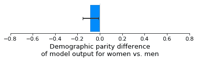

现在，我们可以使用 SHAP 在模型的每个输入要素中分解模型输出，然后计算归因于每个要素的组件的人口统计奇偶差异。如上所述，由于 SHAP 值总和等于模型的输出，因此每个要素的 SHAP 值的人口统计奇偶差异总和等于整个模型的人口统计奇偶差异。这意味着下面的条形之和等于上面的条形(我们的基线情景模型的人口奇偶差异)。

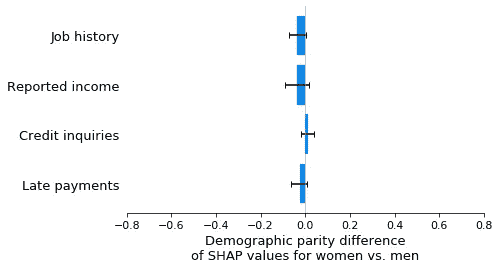

## 情景 B:对妇女收入的低报偏见

在我们的基线场景中，我们设计了一个模拟，其中性别对模型使用的任何特征或标签都没有影响。在方案 B 中，我们在模拟中引入了女性收入的低报偏差。这里的重点不是真实世界中女性收入被低报有多现实，而是我们如何识别性别偏见的引入并理解其来源。通过绘制女性和男性之间平均模型输出(违约风险)的差异，我们可以看到，收入少报偏差已经产生了显著的人口统计均等差异，女性现在比男性有更高的违约风险:

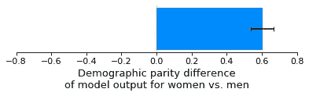

如果这是一个真实的应用程序，这种人口统计奇偶差异可能会触发对模型的深入分析，以确定是什么导致了差异。虽然这一调查具有挑战性，仅给出一个单一的人口统计学差异值，但给出基于 SHAP 的每个要素的人口统计学差异分解就容易多了。使用 SHAP，我们可以看到有一个来自报告的收入特征的重大偏见，这增加了女性比男性不成比例的风险。这使我们能够快速识别哪个特征具有导致我们的模型违反人口统计均等性的报告偏差:

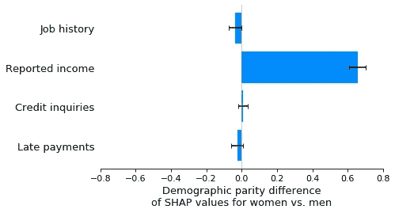

在这一点上，重要的是要注意我们的假设是如何影响 SHAP 公平解释的。在我们的模拟场景中，我们知道女性实际上与男性具有相同的收入特征，因此当我们看到报告的收入特征对女性的偏差低于男性时，我们知道这是来自报告的收入特征中的测量误差偏差。解决这个问题的最佳方法是找出如何消除该特征的测量误差。这样做可以创建一个更准确的模型，而且人口差异也更小。然而，如果我们假设女性实际上比男性挣得少(因此这不仅仅是一个报告错误)，那么我们就不能“修正”报告的收入特征。相反，我们必须仔细考虑如何最好地解释两个受保护群体之间违约风险的实际差异。仅仅使用 SHAP 公平解释是不可能确定这两种情况中哪一种正在发生的，因为在这两种情况下，报告的收入特征将导致男女预测风险之间观察到的差异。

## 情景 C:对妇女逾期付款的低报偏见

为了验证 SHAP 人口统计均等解释能够正确地检测差异，无论效果的方向或来源特征如何，我们重复了之前的实验，但是我们引入了妇女迟付率的低报偏差，而不是收入的低报偏差。这导致了模型输出的显著人口统计学平价差异，现在女性的平均违约风险低于男性:

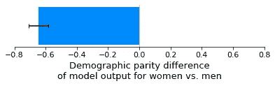

正如我们所希望的那样，SHAP 的解释正确地强调了延迟支付的特征是该模型的人口均等差异的原因，以及影响的方向:

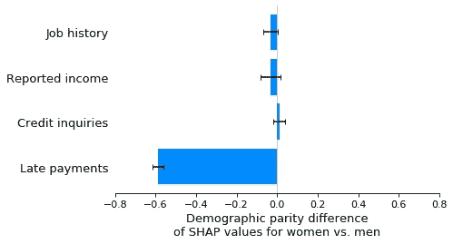

## 情景 D:女性违约率的低报偏差

上面的实验集中在为特定的输入特征引入报告错误。接下来，我们考虑当我们通过对女性违约率的低报偏差在培训标签上引入报告错误时会发生什么(这意味着女性的违约率比男性低)。有趣的是，对于我们的模拟场景，这在模型的输出中没有导致显著的人口统计奇偶差异:

在 SHAP 的解释中，我们也看不到任何人口均等差异的证据:

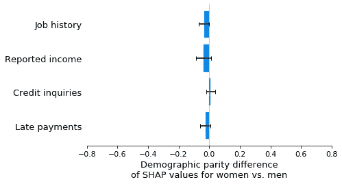

## 场景 E:女性违约率的低报偏差，取 2

起初，当我们引入女性违约率的低报偏差时，可能会令人惊讶地发现，人口统计学上的均等差异并没有产生。但这是因为我们的模拟中的四个特征都没有与性别显著相关，所以它们都不能有效地用于模拟我们引入训练标签的偏见。如果我们现在为模型提供一个与性别相关的新特征(品牌 X 购买分数)，那么我们会看到人口统计奇偶差异出现，因为该特征被模型用来捕获训练标签中的性别特定偏差:

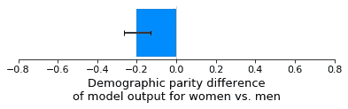

当我们解释与 SHAP 的人口统计平价差异时，我们看到，正如预期的那样，品牌 X 购买分数特征驱动了差异。在这种情况下，这不是因为我们在如何测量品牌 X 购买分数特征方面存在偏差，而是因为我们在训练标签中存在偏差，该偏差被任何与性别充分相关的输入特征捕获(因此可以作为性别的代理):

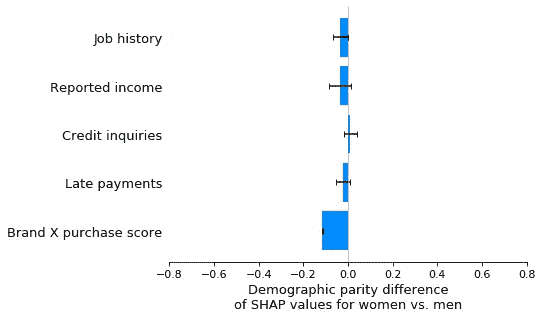

## 场景 F:梳理多重漏报偏见

当报告偏差的原因只有一个时，那么模型输出的经典人口统计奇偶检验和人口统计奇偶检验的 SHAP 解释都捕捉到了相同的偏差效应(尽管 SHAP 解释通常具有更大的统计意义，因为它隔离了导致偏差的特征)。但是，当一个数据集中出现偏差的原因有多种时，会发生什么呢？在这个实验中，我们引入了两个这样的偏见，一个是对女性违约率的低报，另一个是对女性工作经历的低报。这些偏差往往会在全球平均值中相互抵消，因此对模型输出的人口统计均等测试显示没有可测量的差异:

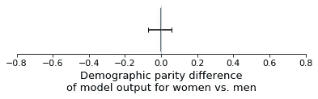

然而，如果我们看看 SHAP 对人口均等差异的解释，我们会清楚地看到两种(抵消)偏见:

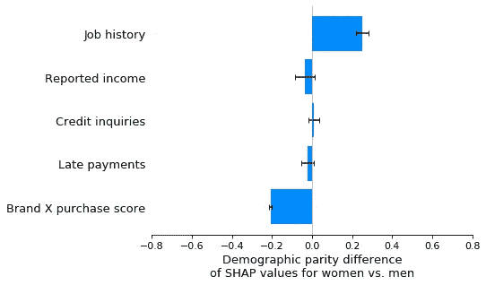

确定多种潜在的抵消偏差影响可能很重要，因为虽然平均而言，对男性或女性没有不同的影响，但对个人有不同的影响。例如，在这个模拟中，没有在品牌 X 购物的女性将得到比她们应该得到的更低的信用分数，因为在工作历史报告中存在偏见。

# 引入受保护的特征如何有助于区分标签偏差和特征偏差

在情景 F 中，我们能够区分出两种不同形式的偏差，一种来自工作经历的少报，另一种来自违约率的少报。然而，来自违约率低报的偏差并不归因于违约率标签，而是归因于碰巧与性别相关的品牌 X 购买分数特征。这仍然给我们留下了一些关于人口统计奇偶差异的真实来源的不确定性，因为归因于输入要素的任何差异都可能是由于该要素的问题，或者是由于训练标注的问题。

事实证明，在这种情况下，我们可以通过将性别作为一个变量直接引入模型来帮助区分标签偏见和特征偏见。引入性别作为输入特征的目的是使标注偏差完全落在性别特征上，而不影响特征偏差。因此，我们可以通过比较上面的场景 F 和下面的新场景 G 来区分标签偏差和特征偏差。当然，这造成了比以前更大的人口统计均等差异，但这没什么，因为我们的目标不是减轻偏见，而是理解偏见:

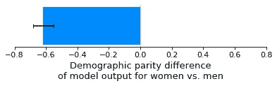

SHAP 对方案 G 的解释表明，方案 F 中曾经与品牌 X 购买分数特征相关联的所有人口统计均等差异现在已经移动到性别特征，而方案 F 中与工作经历特征相关联的任何人口统计均等差异都没有移动。这可以解释为情景 F 中归因于品牌 X 购买分数的所有差异都是由于标签偏见，而情景 F 中归因于工作经历的所有差异都是由于特征偏见。

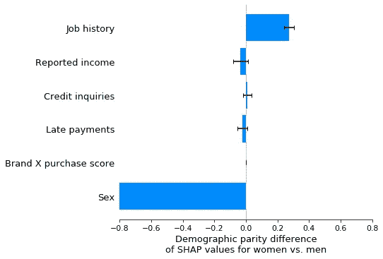

注意，将受保护特征引入模型以将标签偏差与特征偏差分开的技巧依赖于将几乎所有标签偏差置于受保护特征上的模型训练过程。这适用于默认的 XGBoost 模型，但如果您在 XGBoost 中打开按列子采样，则不会发生这种情况，因为这将强制在与受保护要素相关的要素之间共享偏差(对于岭回归补偿线性模型也会发生类似的信用扩散效应)。

# 结论

公平是一个复杂的话题，干净的数学答案几乎总是带有警告，并取决于假设或价值判断。这意味着，尤其重要的是，不要仅仅将公平指标作为黑盒使用，而是要寻求理解这些指标是如何计算的，以及您的模型和训练数据的哪些方面正在影响您观察到的任何差异。使用 SHAP 分解量化的公平性度量可以减少它们的不透明性。我希望这里展示的公平性解释能够帮助您更好地处理公平性评估中固有的潜在问题，从而帮助您在现实环境中使用公平性度量时减少意外后果的风险。