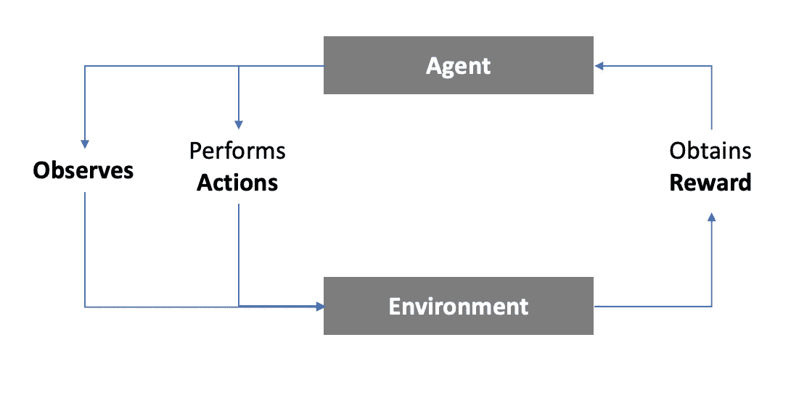
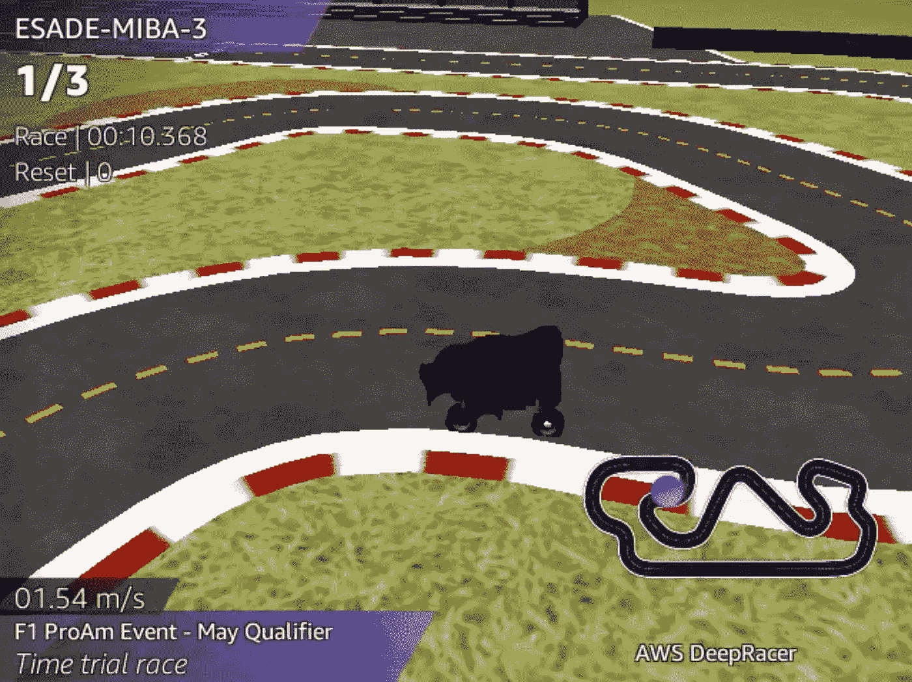
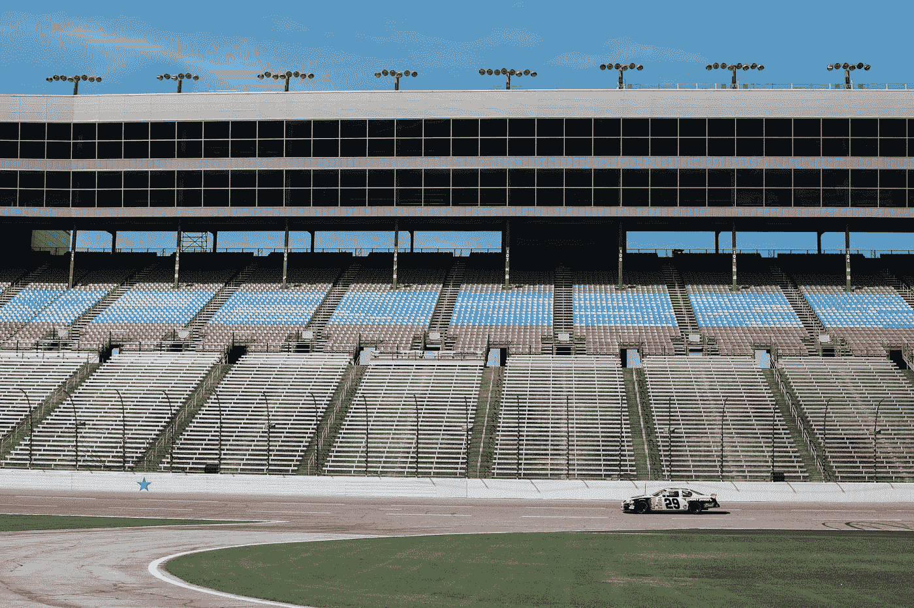
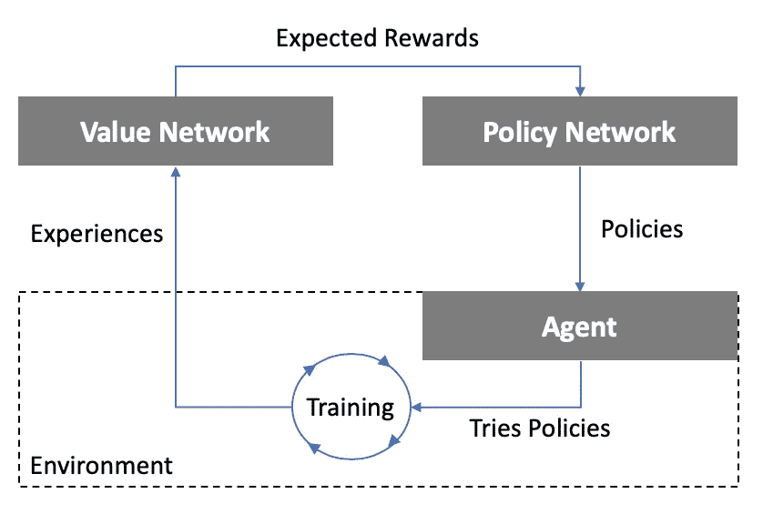

# 基于 AWS DeepRacer 为初学者讲解强化学习

> 原文：<https://towardsdatascience.com/explaining-reinforcement-learning-for-beginners-based-on-aws-deepracer-efcefff65a9b?source=collection_archive---------38----------------------->

## 高级别**解释**强化学习如何在自主赛车中与神经网络一起工作

由[雅罗米尔·卡万](https://unsplash.com/@jerrykavan?utm_source=medium&utm_medium=referral)在 [Unsplash](https://unsplash.com?utm_source=medium&utm_medium=referral) 上拍摄

在本文中，我们将讨论以下主题:

## 1.什么是强化学习？

## 2.什么是 DeepRacer？

## 3.强化学习在 DeepRacer 中的应用

## 4.为什么我们需要强化学习？

## 5.强化学习算法的一部分

## 6.解释学习过程

# 1.什么是强化学习？

强化学习的基础(作者图片)

**强化学习**是一种通过经验学习的机器学习算法。这个算法告诉代理在一个封闭的环境中应该采取哪一组动作来完成一个任务。之后，代理人会因为这些行为获得可量化的奖励。此奖励是一个数字分数，用于衡量这些行动相对于总体目标的调整程度。粗略地说，代理人在算法的指导下，反复尝试不同的动作集，试图使收到的总回报最大化。在每组试验之后，该算法“学习”哪些动作比其他动作更有效，并根据这些发现调整其下一次试验。这个过程持续分配的时间或试验次数。因此，该算法将能够告诉代理采取哪些行动，以获得更高的奖励。

如果这听起来像一个游戏，你没有错；强化学习遵循同样的原则！这就是为什么它被成功地用于玩游戏，如围棋和国际象棋，或视频游戏，如超级马里奥，或星际争霸，击败职业选手。其他应用包括算法交易、机器人或动态定价。

例如，想象我们决定使用强化学习来玩超级马里奥。代理(马里奥图标)观察环境(玩家可以在屏幕上看到的关卡的一部分)并执行动作(前进、后退或跳跃)。每次试炼后，它会收到一份奖励，奖励是根据它在关卡中的进度而定。

# 2.什么是 DeepRacer？

DeepRacer 赛车参加 2020 年 5 月资格赛(图片由作者提供)

让我们看看 AWS DeepRacer 中是如何引入强化学习原理的。亚马逊网络服务(AWS) DeepRacer 是一辆自动驾驶的赛车，它在云中的数字模拟器中接受强化学习训练。强化学习“教”汽车(也就是代理)如何在赛车道上驾驶。代理的目标是在尽可能快的时间内完成多圈。这个简短的背景将是后面几章的基础。如果您需要进一步的信息，您可以访问[这里](https://docs.aws.amazon.com/deepracer/latest/developerguide/deepracer-how-it-works-reinforcement-learning-algorithm.html)。

# 3.强化学习在 DeepRacer 中的应用

由[凯特琳·威尔森](https://unsplash.com/@lillynwilson?utm_source=medium&utm_medium=referral)在 [Unsplash](https://unsplash.com?utm_source=medium&utm_medium=referral) 上拍摄

DeepRacer 使用两个神经网络应用了一种特定的强化学习方法。这个算法帮助**代理**(汽车)在每次试验中选择最佳行动。在强化学习中，每次试验都被称为一个情节。从形式上来说，一个**情节**是特定状态下的动作组合。把**动作**想象成汽车做出的决定。**状态**是赛车在赛道内的位置。一旦赛车离开划定的赛道或跑完一圈，每集就结束了。

在 DeepRacer 电路中，它的(x，y)坐标描述了数百万种可能的汽车状态。每个动作都是将代理从一种状态移动到另一种状态的原因。在我们的例子中，一个动作是转向角和油门的组合。

强化学习算法执行一些计算(我们将在后面解释)，并告诉汽车采取特定的行动(例如，以 0.5 米/秒的速度行驶，向左转向 30 度)。汽车执行这个动作几毫秒，然后到达另一个状态。在这个新状态中，代理执行另一个计算并决定一个动作。这个过程反复发生，直到汽车完成这一集。

该算法基于**奖励函数**决定采取哪些行动。这个奖励函数对代理在每个动作中的表现进行评级，就像学生在测试中被评级一样。我们必须设置奖励函数，它引导代理人实现期望的目标。在我们的例子中，我们希望赛车完成赛道(目标#1)并快速完成(目标#2)。

奖励函数使用**参数**来反映这些目标，这些参数是每个状态中可测量的因素。一个简单的奖励函数可以包括进度(轨迹完成的百分比)和速度参数。这样，汽车离终点线越近(目标 1)，越快(目标 2)，奖励越高。在 DeepRacer 中，算法从虚拟环境中接收这些和其他参数(例如，转向或距离赛道中心的距离)。该算法在告诉汽车采取何种行动之前测量这些参数，反映了与环境的互动。然后，这些参数的值将被有选择地放置在一个奖励函数中，该函数将返回一个数字，对代理的行为进行评级。根据我们的目标，我们必须选择将哪些参数添加到奖励函数中，以及它们将对奖励的大小产生什么影响。

# 4.为什么我们需要强化学习？

学习过最优化问题的人应该对最大化奖励函数很熟悉。对于一些优化问题，你可以得到一组全局的行动，在给定的一组约束条件下，最大化代理人可以得到的奖励。但是在 DeepRacer 的情况下，我们没有标准的优化问题，因为有几乎无限数量的动作和状态的组合。这就是为什么不可能通过执行所有可能的组合并查看哪一个是最好的来强行得出最佳答案。

在某种程度上，强化学习是关于教代理如何执行最佳的“猜测”应该采取什么行动，这可能会给出很高的回报。通常，我们从强化学习算法中所能获得的最多的是局部奖励最大值。由于我们无法有效地尝试所有组合，因此我们无法得出这是代理可以获得的全球最高奖励的结论。

# 5.强化学习算法的一部分

强化学习算法的部分内容(图片由作者提供)

当我们谈到强化学习时，有几种不同的算法。在本文中，我们将重点讨论强化学习的神经网络应用。该算法结合了两个神经网络来学习采取哪些行动:T2 政策网络 T3 和 T4 价值网络 T5。如果你不明白什么是神经网络，那么我强烈推荐观看来自 [3Blue1Brown](https://www.youtube.com/watch?v=aircAruvnKk&t=2s) 的视频，尽管它们对于理解接下来的内容并不必要。

**价值网络**的目标是基于之前的试验产生“猜测”。在这种情况下，一个“猜测”是在一个特定的行动后得到的预期奖励。想象一下，汽车可以采取三种可能的行动。然后，这个网络根据过去的经验，估计采取这些行动的预期回报。理解价值网络如何做到这一点超出了本文的范围。为简单起见，我们将**动作空间**定义为汽车在给定状态**下可能采取的所有动作的组合。**例如，假设汽车处于状态(S39)，动作空间为 3。那么，价值网络的一个输出可以是:(A1，A2，A3) = **(10，100，5)。**

**政策网络**将价值网络产生的“猜测”转化为行动。它将使用采取每项行动的预期回报，并应用一种叫做**政策梯度**的方法，将它们转化为概率。这些概率是给定状态下动作的分布。采取行动的预期回报越高，可能性就越大。我们将这些概率称为**策略。**回到我们之前在 S39 中的例子，策略可以是:(A1，A2，A3) = **(0.2，0.7，0。1).** A2 的概率更高，因为采取 A2 的预期回报比其余行动更高。

# 6.解释学习过程

安妮·斯普拉特在 [Unsplash](https://unsplash.com?utm_source=medium&utm_medium=referral) 上拍摄的照片

学习的过程包括两个阶段:**探索阶段**和**调整阶段**，依次重复几次。

在**探索阶段，**策略网络将使用价值网络提供的“猜测”来评估给定状态下的策略。使用这些相同的猜测，它将运行 x 量的试验(例如，10.000 次)，进行不同的动作组合，并在每集之后接收奖励。在每个状态中，代理可能执行一个动作或另一个动作，遵循由策略设置的概率分布。

再回到我们以前的例子:(A1，A2，A3) = **(0.2，0.7，0。1)** 中的 S39 **。**在所有情节中，代理到达 S39，其中 20%做出 A1 决定，70% A2 决定，10% A3 决定。注意，策略网络将永远不会输出某些动作(例如(A1，A2，A3) = (0，1，0))，而是输出一个概率，以允许代理探索回路并尝试每一个动作，即使模型预测低的预期回报。这是因为这些预期回报只不过是基于经验的“猜测”，因此可能是错误的。

请注意，在第一个探索阶段，价值网络将没有经验，并将对所有行动给予相同的预期回报。然后政策网络会把这些预期回报转化为等概率。在每个状态中，汽车将以相等的概率执行任何动作，并移动到另一个状态。因为这是第一次探索，没有积累经验，大多数剧集都以脱离轨道和相对较低的回报而告终。

在这个探索阶段结束后，将开始**调整阶段**。价值网络将汇编和汇总从这些试验中获得的所有回报，并调整在给定状态下执行每个特定行动的预期回报。这些新的“猜测”将反馈给政策网络，并改变采取特定行动的可能性。这将增加给予较高回报的行动的概率，同时减少导致较差回报的行动的概率。然后，代理将开始探索和调整阶段的第二次迭代。这个过程可以重复几次。

**技术提示:**概率增加/减少的大小将取决于:(a)在那些经历中预期的回报和获得的回报之间的差异，以及(b)政策梯度。**策略梯度**是强化学习的基础部分。策略网络创建一个**代理函数**，它近似依赖于策略变化的奖励函数的行为。简而言之，它估计了政策变化对预期回报的影响。然后算法计算策略，使期望回报最大化。为了做到这一点，我们计算这个替代函数的梯度，它将表明在调整阶段旧政策变化的方向和大小。在 DeepRacer 的情况下，策略梯度应用了一种叫做[近似策略优化(PPO)](https://openai.com/blog/openai-baselines-ppo/) 的方法。这种方法与其他方法的不同之处在于它的简单性和易于实现。此外，PPO 设置了一个上限，以避免基于几个事件的重大政策调整。关于 PPO 如何详细工作的更多信息，你可以阅读 Jonathan Hui 的这篇文章。

主要思想是，一旦我们这样做几次，我们将增加导致更高回报的行动的概率。然后，随着探索和调整阶段的每一次迭代，该算法通过采取导致更好回报的行动来不断提高其回报。**因此，经过几个小时的训练，我们的赛车完成了一个快速圈速！**

如果你想了解更多关于自动驾驶赛车和 DeepRacer 的内容，你可以看看这个[高级指南](/an-advanced-guide-to-aws-deepracer-2b462c37eea)，我的团队成员，丹尼尔建造。他收集了我们从参加 AWS-Formula 1 赛事中获得的所有见解，实现了前 1%的排名。

> 最后，我要感谢[娜塔莉亚·科查金娜](https://www.linkedin.com/in/natalia-korchagina/)和[丹尼尔·冈萨雷斯](https://www.linkedin.com/in/dg4/)帮助我创作了这篇文章，还要感谢我们的教授[乔迪·宁](https://www.linkedin.com/in/jnin/)和[阿尔贝托·卢比奥](https://www.linkedin.com/in/arubiomunoz/)校对了这篇文章。最后，感谢 ESADE 商学院允许像这样的内容创作成为我们商业分析硕士课程的一部分。