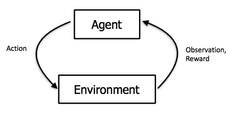

# 向你的隔壁邻居解释强化学习

> 原文：<https://towardsdatascience.com/explaining-reinforcement-learning-to-your-next-door-neighbor-256d2e279f8a?source=collection_archive---------69----------------------->

## 强化学习的直观介绍

强化学习是机器学习的一个非常有趣的子领域。而其他 ML 技术依赖于静态输入输出对来学习隐藏的规则，然后将这些规则应用于看不见的数据以获得可能的结果。强化学习算法往往会随着时间的推移自动学习最佳决策。

RL 技术广泛用于解决难题和开发能够在数百种不同的游戏中击败人类的智能代理。除此之外，RL 还有多种实际应用，例如

1.  *机器人技术:工业自动化*
2.  *开发学生培训系统*
3.  *RL 基础* [*神经架构搜索*](https://en.wikipedia.org/wiki/Neural_architecture_search) *(NAS)*

让我们了解一下 RL 是如何工作的—

## = >为了帮助您了解内容:-

1.  如果我们有其他 ML 技术，为什么还要使用 RL？
2.  *什么是强化学习？*
3.  *强化学习的并发症。*
4.  *结论*

# 1.如果我们有其他 ML 技术，为什么要使用 RL？

机器学习技术，如监督学习、非监督学习，从给定的潜在历史数据中学习，然后被部署来产生关于看不见的(未来)数据的结果。这种模型的好坏取决于给定的训练数据的质量。当/如果一些新的看不见的(训练集中不存在的新的各种数据)例子出现时，这些模型会突然失效。

基于强化学习的算法能够解决这样的问题。RL 模型以这样的方式设计，即它们学习数据随时间的变化并保持高性能。让我们了解更多关于 RL 的知识—

# 2.什么是强化学习？

基于 RL 的算法学习随着时间自动做出最佳决策。它从过去的错误中学习，并试图在未来的每个时间点做出最佳决策。这种从经验中学习的方法与人类学习和成长的方式非常相似。这个想法让 RL 更接近人工智能的目的。让我们深入了解 RL 的更多细节——

希望大家能回忆起以前的喂蛇游戏，如果没有，那么下面的视频一定会提醒你——

[https://gfycat.com/wildunevenhackee](https://gfycat.com/wildunevenhackee)

现在让我们写下五个神奇的词，整个 RL 将围绕这五个词展开—

**答*。*代理**

**b. *环境***

**c *。动作***

**d. *观察***

**e. *奖励***

让我们来理解这五个与喂蛇游戏有关的术语。

## 代理和环境

每一个 RL 问题都可以分解成两个主要的模块— 1 .代理 2 .环境。代理是可以做一些事情(一组明确定义的事情)的东西，我们的 RL 算法的目标是教会这个代理以某种方式做那些事情，以实现特定的目标(由求解器定义)。除了代理，其他的都叫环境。代理在环境中执行所有的活动，并在每个步骤中不断改变环境的状态。

## 例子:关于蛇的游戏

在这里——蛇是媒介，整个绿色游乐场和诱饵/食物是环境。这条蛇可以做事情，它可以走直线，左转，右转。求解者可以定义一个目标，比如“吃尽可能多的诱饵”或“吃 100 个诱饵”。现在，我们训练有素的工作 RL 算法应该指导这条蛇采取适当的行动，以便实现求解器的目标。

[https://it next . io/reinforcement-learning-with-q-tables-5f 11168862 c8](https://itnext.io/reinforcement-learning-with-q-tables-5f11168862c8)

## 行动、观察和奖励

正如所讨论的，RL 代理做某些事情，并且可以在每一步改变环境的状态。这些东西的一个明确定义的集合被称为给定代理的动作空间。在每一步，代理从动作空间中选择一个动作(随机地——如果没有实现 RL 算法)并执行它。

这种行为可能以某种方式改变环境，而这种由行为引起的环境变化被称为观察。每一个行动步骤都与一些奖励(即一个标量值——2、5、100……任何东西)和观察。奖励是由问题解决者定义的，这样更多的奖励会使代理更接近目标。

总结:-在每一步，代理将执行一个动作并获得一些奖励，并记录观察结果。这里——我们的 RL 算法的主要目标是帮助代理在每一步选择最佳行动，以便每次都能获得良好的回报，并最终完成目标。

(从过去的行动中)收集的观察和奖励有助于 RL 算法理解环境并为代理决定下一个最佳行动。大多数情况下，使用某种监督学习算法来决定最佳移动。通常，来自游戏的观察是环境的屏幕截图，因此深度学习算法(卷积神经网络)被非常频繁地使用。

## 例子:关于蛇的游戏

在我们的喂蛇游戏中，RL 算法应该在每一步给蛇指令(直走，左转，右转)。这些命令应该帮助蛇吃足够的诱饵，这样我们的目标就完成了。RL 模型需要记住一点——蛇在完成目标前不能死，否则——*游戏 over*r .一旦我们的游戏结束， ***插曲*** 完成，我们需要重新开始。

## 插曲

只是 RL 词汇表中用来定义任务结束的另一个术语。如果你的插曲在完成目标之前结束，那么你的 RL 算法需要更多的调整/训练/增强。

> 强化学习太酷了！
> 
> 为什么我们不在所有的 ML 问题中应用 RL？

我想现在每个人都很清楚 RL 是怎么运作的了。这个概念看起来非常简单和直观，但是在实现这样的算法时，我们遇到的障碍确实很少。让我们更多地了解它们——

# 3.RL 的并发症

下面列出了一些使基于 RL 的模型开发变得复杂的事情——

假设我们的代理不断犯错，却没有获得任何奖励。现在，对这种错误的观察是没有结果的，可能不会向代理人显示如何进一步赢得奖励。代理可能会在这种情况下遭受损失，而 RL 可能无法解决这种情况。

**二。**假设你正在编写一个 RL 算法来下 ***棋并获胜。现在，国际象棋是一种不同的挑战性游戏，你的棋步在开始时可能没有意义，但深入下去可能会有很大的不同。在这样的问题中，你无法决定每一步的回报。这里不能写奖励函数。奖励只有一个——赢得游戏，只有在游戏结束时你才能得到它。这使得 RL 代理很难在每一步选择最佳行动。***

在进入第三个复杂问题之前，让我先介绍两个更重要的术语——

## 探索/开发的故事

想象一下，你最近搬到了一个新的城市，你的房子周围有数以千计的晚餐地点。每天晚上，你都有一个选择，比如——我今天应该探索一个新的地方吗？还是吃弗雷迪好吃的鸡翅？现在你已经知道弗雷迪餐厅很不错，再去那里吃一次也未尝不可。但是如果你不去探索新的餐馆，你将永远不会发现更有趣的地方，甚至是最好的地方。这也是有代价的——在找到一个好地方之前，你可能需要去很多不好的地方，而且你可能真的找不到一个好地方。这种情况在现实生活中可能会非常频繁地出现。比如——换工作，换智能手机品牌……等等。

## 三。强化学习中的探索/利用困境

RL 代理也面临这样的情况，探索是必要的，因为一个好的奖励可能在未探索的地方等着，并且利用已经研究过的行为(通过观察)是必要的，否则你的代理就像随机一样好。求解器总是需要在这两者之间找到一个平衡，以便设计一个高效的 RL 代理。

# 4.结论

是的，这些并发症一直存在，现在仍然存在。但由于研究人员的固执，基于 RL 的算法已经随着时间的推移取得了巨大的进步。强化学习作为一个研究领域正变得越来越有趣和活跃。是时候找到一些相关的业务问题，并开始使用基于 RL 的算法有效地解决它们了。

*参考文献:*

1.  *了解自:拉潘，M. (2018)。深度强化学习实践。英国伯明翰:Packt 出版公司。*
2.  【GIF 来自:[*https://gfycat.com/wildunevenhackee*](https://gfycat.com/wildunevenhackee)
3.  *图片来自:*[*https://it next . io/reinforcement-learning-with-q-tables-5f 11168862 c8*](https://itnext.io/reinforcement-learning-with-q-tables-5f11168862c8)

***感谢阅读！请分享您的反馈/意见。***