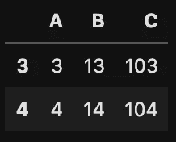
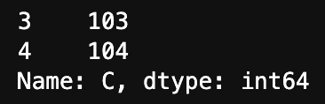
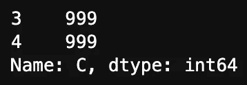
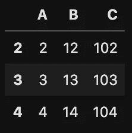
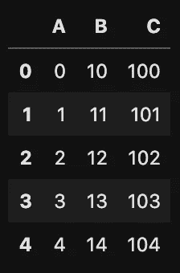

# 解释熊猫中带有复制警告的设置

> 原文：<https://towardsdatascience.com/explaining-the-settingwithcopywarning-in-pandas-ebc19d799d25?source=collection_archive---------7----------------------->


照片由 [NeONBRAND](https://unsplash.com/@neonbrand?utm_source=unsplash&utm_medium=referral&utm_content=creditCopyText) 在 [Unsplash](https://unsplash.com/?utm_source=unsplash&utm_medium=referral&utm_content=creditCopyText) 上拍摄

## 如果你想知道是什么导致了`SettingwithCopyWarning`，这就是你要找的地方！

不管你和`pandas`共事多久，是一天还是一年，迟早你都有可能遇到臭名昭著的`SettingWithCopyWarning`。在本文中，我将解释是什么导致了这个问题，以及如何正确地解决这个问题。

# 警告不是错误

在我深入研究技术细节之前，我想强调一下`SettingWithCopyWarning`是——顾名思义——一个警告，而不是一个错误。所以我们正在执行的代码很可能不会中断并产生最终结果。然而，最终的结果可能不是我们真正想要的。

我想强调这种区别的原因是，当我们看到代码实际上成功返回结果时，我们可能会忽略警告。事实上，结果可能是正确的！最佳实践是格外小心，并真正理解基本原理。通过这种方式，我们通常可以节省大量时间来识别一个不明显的 bug，这是我们一开始就可以避免的。

# 视图与副本

与`SettingWithCopyWarning`相关的关键概念是视图和副本。`pandas`中的一些操作(和`numpy`一样)将返回原始数据的视图，而其他的副本。

简单地说，**视图**是链接到原始源的原始对象(`DataFrame`或`Series`)的子集，而**副本**是一个全新的对象。一般来说，当我们对副本进行的操作完成后，副本就会被丢弃。这种区别的结果是，当我们修改视图时，我们也修改了原始对象。副本不会发生这种情况，因为它们没有连接到原始对象。

描述了区别之后，`SettingWithCopyWarning`实际上是让我们知道我们写的代码可能做了一件事，而实际上我们想做的是另一件事。我将用一个真实的例子来说明这一点。想象一下有一个大的`DataFrame`。对于某些分析，您过滤(切分)了`DataFrame`，使其只包含完整数据的子集，例如，来自某个国家的用户。然后，您可能想要修改提取的`DataFrame`中的一些值，假设一个特性的最大值为 100。这是您可能遇到臭名昭著的警告的典型情况——您只想修改提取的帧，而最终却修改了源数据。你可以很容易地想象这不是你想做的事情，并可能导致以后的潜在问题。

**注意**:要了解一个框架是否是副本的视图，可以使用一个`pandas.DataFrame`的内部`_is_view`和`_is_copy`方法。第一个函数返回一个布尔值，而第二个函数要么是原来的`DataFrame`的`weakref`，要么是`None`。

# 警告的常见事件

在这一节中，我回顾了实践中发生`SettingWithCopyWarning`时最常见的情况。我将使用一个小的定制`DataFrame`来举例说明这些情况，因为这对于理解逻辑来说已经足够了。

为了准备数据，我运行以下代码:

运行代码打印出小的`DataFrame`:


为了清楚地理解正在发生的事情，对于下面的每一种情况，我们将从头开始—运行`get_data`函数的结果。

作为将来的参考，本文是使用`pandas`版本 1.0.3 编写的。

## 1.链式分配

为了解释链式赋值的概念，我们将依次讨论构造块。赋值操作(也称为**设置操作**)简单地设置一个对象的值。我们可以通过创建一个列表来说明这一点:

```
x_list = [1, 2, 3, 4, 5]
```

尽管第一个例子是基于列表的，但是同样的原则也适用于数组、`Series`和`DataFrames`(我们马上就会看到)。第二种类型的操作称为 **get 操作**，用于访问和返回对象的值。**索引**是一种 *get* 操作，我们可以通过运行返回的`x_list[0:3]`来索引列表

```
[1, 2, 3]
```

最后一个构建块叫做**链接**，本质上是指链接多个索引操作，比如`x_list[0:3][1]`，返回 2。

已经描述了所有的单个部分，通过**链接赋值**我们指的是链接和赋值的组合。是时候提及我们的玩具`DataFrame`了。首先，我们对`DataFrame`进行切片，以显示`B`特性值大于 12 的观察值。

```
X = get_data()
X[X['B'] > 12]
```



只有 2 行符合该标准。让我们用 999 替换`C`特性的值。

```
X[X['B'] > 12]['C'] = 999
X[X['B'] > 12]['C']
```

运行上面的行会导致臭名昭著的警告:

```
SettingWithCopyWarning: 
A value is trying to be set on a copy of a slice from a DataFrame.
Try using .loc[row_indexer,col_indexer] = value instead
```

在生成的输出中，我们看到这些值没有被替换！



我们看到警告是因为我们链接了两个索引操作。这些连锁操作在后台独立执行。第一部分是 *get* 操作，它返回一个包含所有`B`值大于 12 的行的`DataFrame`。第二部分是*设置*的操作，并且是对新建的`DataFrame`进行由*获取*的操作。所以我们不是在修改原来的`DataFrame`！

当我们在一行中使用两个方括号时，这是非常明显的，然而，通过使用`loc`、`iloc`或访问列的点方法也会发生同样的情况。例如，运行`X.loc[X[‘B’] > 12][‘C’] = 999`会给出同样不正确的结果。

为了正确替换`DataFrame`中的值，我们需要以如下方式使用`loc`:

```
X.loc[X['B'] > 12, 'C'] = 999
X[X['B'] > 12]['C']
```



我们可以看到原来的`DataFrame`中的值被成功替换。

## 2.隐藏链接

隐藏链接可能是一个很难调试的问题，因为问题到底出在哪里通常不是很明显。我们将复习一个例子。首先，让我们加载数据，并使用前面案例中的知识，创建一个`DataFrame`，它是原始数据的子集。我们过滤掉所有具有大于 101 的`C`特性值的行。



经常发生的是，我们探索并进一步处理新的`DataFrame`。让我们想象运行几行代码来进一步检查`temp`对象，比如`pandas.DataFrame`的`shape`、`describe`、`plot`方法。

我们实际上没有在这里打印输出，因为这不是重要的部分。现在，再运行几行代码后，让我们用 999 替换第一行`temp`中`C`特性的值:

```
temp.loc[2, 'C'] = 999
```

在这样做的时候，我们遇到了我们的老朋友:

```
SettingWithCopyWarning: 
A value is trying to be set on a copy of a slice from a DataFrame.
Try using .loc[row_indexer,col_indexer] = value instead
```

让我们检查原始的和提取的`DataFrames`中`C`的值:

```
print(f"New DataFrame: {temp.loc[2, 'C']}")
print(f"Original DataFrame: {X.loc[2, 'C']}")# New DataFrame: 999
# Original DataFrame: 102
```

所以我们真的发生了？警告的原因在于，链式索引可能出现在两行中，而不仅仅出现在一行中。当我们创建新的`DataFrame`时，我们使用了 *get* 操作的输出。这可能是原件`DataFrame`的副本，也可能不是。在我们检查之前无法知道。引用关于链式索引的`pandas`文档:

> 除了简单的情况之外，很难预测它[链式索引]将返回一个视图还是一个副本(这取决于数组的内存布局，对此 pandas 不能保证)，…

所以当我们索引`temp`来分配新值时，我们实际上使用了链式索引。因此，我们可能在修改`temp`的同时也修改了`X`。

棘手的部分是，在实际的代码库中，负责隐藏链式分配的两行代码可能被几十行代码分开，这使得识别潜在问题相当困难。

为了解决这个问题，我们可以通过使用`copy`方法直接指示`pandas`创建原始`DataFrame`的副本。下面，我们使用这种方法来避免隐藏链接:

我们看到运行代码生成了正确的输出。

## 3.一个假阴性的例子

最后，我们回顾一下[3]中提到的假阴性(`pandas`没有通知我们`SettingWithCopyWarning`，而它实际上应该通知我们)。当我们在对`DataFrame`的多个列进行切片时使用链式索引时，就会发生这种情况。我们来看两个简单的案例。

```
X = get_data()
X.loc[X['A'] > 2, ['A', 'B']]['A'] = 999
X
```

和

```
X = get_data()
X[['A', 'B', 'C']]['A'] = 999
X
```

两者都产生了下面的结果，但没有真正显示出`SettingWithCopyWarning`。



从上面的图片中我们可以看到，这些值并没有按照我们想要的那样被修改。由于在索引操作中包含多个列，因此没有显示警告。我们可以很容易地验证在单个列的情况下不会发生这种情况——运行`X[[‘C’]][‘C’] = 999`
会产生警告并且不会修改`X`。

# 关于警告来源的更深层次的背景

我们可以说`pandas`从`numpy`继承了视图和副本的概念。在引擎盖下，`pandas`使用`numpy`进行高效的数据存储和操作。在`numpy`中，视图和副本遵循一组特定的规则，并以可预测的方式返回(更多信息见【5】)。那么为什么`pandas`不是这样呢？问题在于`numpy`数组被限制为单一数据类型。正如我们所知，`pandas`的情况并非如此。

实际上，在多数据类型`DataFrame`上的索引( *get* 操作)将总是返回一个帧的副本。对单一类型框架的相同操作几乎总是返回基于单一`numpy`数组的视图，这是解决问题的最有效方式。然而，正如我们在文档的引用中已经看到的，返回视图依赖于对象的内存布局，不幸的是不能保证。

综上所述，`pandas`尽最大努力将其通用的索引方法(由于这种方法，它非常流行，并且基本上是用 Python 进行数据科学研究的先决条件)和使用底层`numpy`数组的效率结合起来。这导致了一些小麻烦，然而，这种权衡绝对是值得的，并且通过正确理解`pandas`在引擎盖下如何工作，这些问题可以被克服。

# 结论

在这篇文章中，我解释了 pandas 中副本和视图之间的区别，以及它们与臭名昭著的`SettingWithCopyWarning`之间的关系。主要的想法缩小到知道什么是链式索引以及如何成功地避免它。一般规则是:

*   如果要改变原来的`DataFrame`，使用单赋值。
*   如果您想要制作一个`DataFrame`的副本，请使用`copy`方法显式地这样做。

遵循这两条规则可以节省您调试一些奇怪情况的大量时间，尤其是在冗长的代码库中。

同样值得一提的是，`SettingWithCopyWarning`仅在我们使用 *set* 操作(赋值)时发生。然而，最好也避免对 *get* 操作进行链式索引。这是因为链式操作通常比较慢，如果您后来决定将 *set* 操作添加到代码中，可能会导致问题。

您可以在我的 [GitHub](https://github.com/erykml/medium_articles/blob/master/Data%20Wrangling/SettingwithCopyWarning_explained.ipynb) 上找到本文使用的代码。一如既往，我们欢迎任何建设性的反馈。你可以在推特上或者评论里联系我。

# 参考

[1][https://pandas . pydata . org/pandas-docs/stable/user _ guide/indexing . html](https://pandas.pydata.org/pandas-docs/stable/user_guide/indexing.html)

[2][https://pandas . pydata . org/pandas-docs/stable/user _ guide/indexing . html # return-a-view-vs-a-copy](https://pandas.pydata.org/pandas-docs/stable/user_guide/indexing.html#returning-a-view-versus-a-copy)

[https://github.com/pandas-dev/pandas/issues/9767](https://github.com/pandas-dev/pandas/issues/9767)

[4][https://www . practical data science . org/html/views _ and _ copies _ in _ pandas . html](https://www.practicaldatascience.org/html/views_and_copies_in_pandas.html)

[5][https://scipy-cookbook . readthedocs . io/items/viewsvscopies . html](https://scipy-cookbook.readthedocs.io/items/ViewsVsCopies.html)