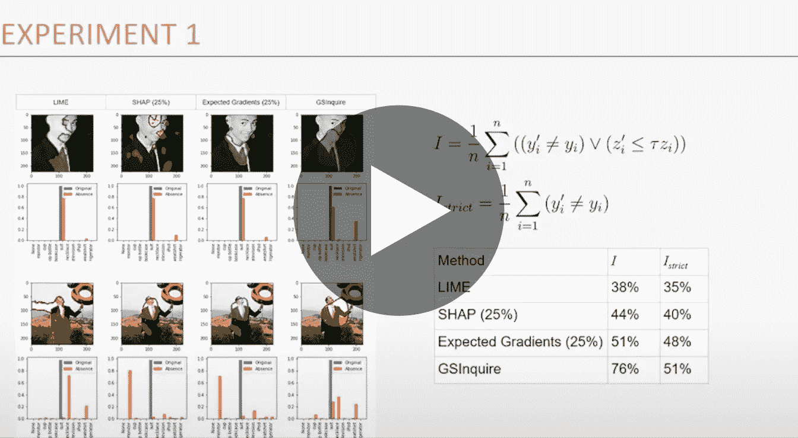

# 有影响力的解释

> 原文：<https://towardsdatascience.com/explaining-with-impact-38935eccc7fe?source=collection_archive---------58----------------------->

## [活动讲座](https://towardsdatascience.com/event-talks/home)

## 谢尔登·费尔南德斯和迈克尔·圣·朱尔斯| TMLS2019c

[在多伦多机器学习峰会上的演讲](https://torontomachinelearning.com/)

## 关于扬声器:

DarwinAI 首席执行官 Sheldon Fernandez 是一位经验丰富的高管，也是技术和企业社区中备受尊敬的思想领袖。在他的职业生涯中，他将人工智能等新兴技术应用于企业客户的实际场景中。谢尔登也是一位有成就的作家和演说家。他在许多场合的许多会议上发表过演讲，包括湾区著名的智库 Singularity University，并撰写了许多主题的技术书籍和文章，包括人工智能和计算创造力。

— Michael St. Jules 是 DarwinAI 的高级研究开发人员，自 2018 年初以来一直在该公司工作。他于 2014 年和 2016 年分别获得卡尔顿大学和渥太华大学数学专业的 BMath 和 M.Sc 学位，主要研究数学分析、逻辑和计算机科学，硕士论文和出版物为量子密码学。然后他在滑铁卢大学的计算数学 MMath 中重点研究了机器学习和深度学习，于 2017 年毕业，并在加入 DarwinAI 之前担任 Alexander Wong 博士的研究助理。

## 关于演讲:

围绕人工智能的普遍进展引发了人们对可解释的人工智能(XAI)的浓厚兴趣，其目标是产生由机器学习算法做出的可解释的决策。鉴于深度神经网络的复杂性和“黑箱”性质，特别感兴趣的是对深度神经网络如何做出决策的解释。

鉴于该领域的起步阶段，对可解释方法的性能评估的探索有限，大多数评估集中在对当前方法的主观和视觉解释上。在本次演讲中，演讲者介绍了两种量化性能指标，用于通过一种新颖的决策影响分析来量化深度神经网络上可解释性方法的性能:

1.  影响得分，评估具有强烈信心降低影响或决策改变影响的关键因素的百分比；和
2.  影响范围，评估输入中受到不利影响的因素的百分比范围。我们进一步考虑使用这种方法与众多最新的可解释性方法进行综合分析。

[带着冲击力讲解](https://youtu.be/yKMq_1m486I)

## 订阅我们的[月刊](https://medium.com/towards-data-science/newsletters/monthly-edition),直接在你的邮箱✉️中接收我们最好的文章、视频和播客