# 解释性建模和统计因果推理教程

> 原文：<https://towardsdatascience.com/explanatory-modeling-f1f890d11ac2?source=collection_archive---------27----------------------->

## 通过对新冠肺炎死亡危险因素的案例研究


来源:[马库斯·斯皮斯克](https://unsplash.com/@markusspiske)

## 介绍

也许最近的疫情和相关的封锁的一个积极的副作用是，我们可以实现被搁置的项目。有一段时间，我想写一篇关于统计模型解释的文章，我需要的只是时间、动机和数据。这个 [Kaggle 数据集](https://www.kaggle.com/sudalairajkumar/novel-corona-virus-2019-dataset)由 2019 年 12 月至 2020 年 3 月期间在武汉市采样的 1085 例新冠肺炎病例组成，它是首批发布的包含患者级别记录的数据集之一。[这篇 TDS 文章](/r-tutorial-analyzing-covid-19-data-12670cd664d6)很好地概述了数据及其字段。拥有患者级别的记录意味着有足够的粒度来得出关于一个人的个人属性如何与暴露于新冠肺炎病毒的死亡风险相关的医学见解。

本解释性建模指南要求对以下主题有中级理解:

*   [概率论](/probability-concepts-explained-probability-distributions-introduction-part-3-4a5db81858dc)和分布
*   [统计估计](/probability-concepts-explained-maximum-likelihood-estimation-c7b4342fdbb1)和推断
*   机器学习概念，如[逻辑回归](/introduction-to-logistic-regression-66248243c148)和[装袋](https://www.stat.berkeley.edu/~breiman/bagging.pdf)
*   计算统计学概念，如[自助重采样](/an-introduction-to-the-bootstrap-method-58bcb51b4d60)
*   R 编程语言

死亡率风险分析需要一个带有死亡事件记录的响应变量。因此，我们将尝试将这种反应表达为预测变量的函数，这些变量与新冠肺炎对人类健康的影响直接或间接相关。解释模型的目的是*解释*而不是*预测*死亡的结果，其中*解释*的目的是应用统计推断以便:

*   识别对死亡事件有统计显著影响的预测变量
*   估计重要预测因素的影响程度
*   量化我们估计的不确定性

换句话说，我们感兴趣的是一个用于推理而不是预测的模型，或者更准确地说，一个更倾向于*因果推理*而不是*预测推理的模型。*理解两个之间的[差异至关重要，因为它决定了我们选择](https://www.stat.berkeley.edu/~aldous/157/Papers/shmueli.pdf)[建模方法](https://www.datascienceblog.net/post/commentary/inference-vs-prediction/)的基本原理。解释性分析需要一个不太灵活(高偏差)但更加[可解释的模型](http://faculty.marshall.usc.edu/gareth-james/ISL/)，它使用概率推理来近似一个假设的数据生成过程。在执行了模型选择过程之后，得到的“最佳”模型可以包括对响应具有显著影响的预测器，尽管不一定提高预测准确度。

从表面上看，一个不错的模型选择是*二项式 logit 模型*，通常称为二元逻辑回归。考虑到模型选择后缺乏用于[推理的工具](https://www.cambridge.org/core/books/computer-age-statistical-inference/inference-after-model-selection/B6BEB2EA184FAC92CEAC529FE75B7691)以及我们验证因果假设的意图，我们将使用领域知识来精选假设对死亡事件有直接或间接影响的独立变量；然后，我们将通过将我们的数据拟合到我们的模型假设的数据生成过程中来量化它们的影响。本文的目的是实现一个解释性建模的管道，它展示了如何使用一个小而稀疏的数据集来获得关于新冠肺炎的医学见解。为此，我有选择地将理论概念与 R 编程语言中的代码片段结合起来。为了达到理想的结果，采取以下步骤:

*   广义线性模型的定义
*   数据插补与数据删除
*   渐近准则下的模型选择
*   基于 bootstrap 推理的模型验证
*   模型解释

本作品中使用的代码库可以在[这里](https://github.com/dimitrics/kaggle-covid19)找到。

让我们从加载必要的库和数据开始。

```
*# Load required libraries:*
library(mice)
library(VIM)
library(jtools)
library(ggplot2)
library(gridExtra)
options(repr.plot.width = 14, repr.plot.height = 8)*# Load COVID-19 data:*
dat0 = read.csv('./data/COVID19_line_list_data.csv', 
                header = T, sep = ',')
print(names(dat0))
```

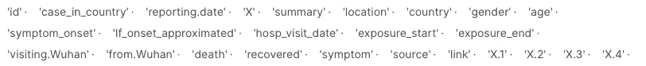

在预测建模场景中，我们可以在这一点上选择我们想要的任何数量的变量，然后让模型选择算法来决定我们应该考虑哪些变量。然而，在解释性建模场景中，算法模型选择之后的推断并不是一个可行的选项。一个激烈的变量选择过程预计会偏向系数 p 值，并剥夺我们使用模型的渐近性质。有各种方法来克服这种现象，但是，为了解释因果关系，我们必须依靠领域知识来隔离我们认为有影响的变量。例如，一个显而易见的变量选择是与患者的年龄、性别、原籍国、症状开始日期、住院日期以及他/她是否是武汉本地人相关的变量。诸如“*症状*”、“*康复*”、“*医院 _ 就诊 _ 日期*”和“*暴露 _ 开始*”等变量看似相关，但实在太稀疏，没有任何用处。

```
dat1 = dat0[c("location", "country", "gender", "age", "reporting.date", "symptom_onset", "hosp_visit_date", "visiting.Wuhan", "from.Wuhan", "death", "recovered", "symptom")]
print(head(dat1, 5))
```

隔离最相关的预测值后，我们的新数据集应该如下所示:

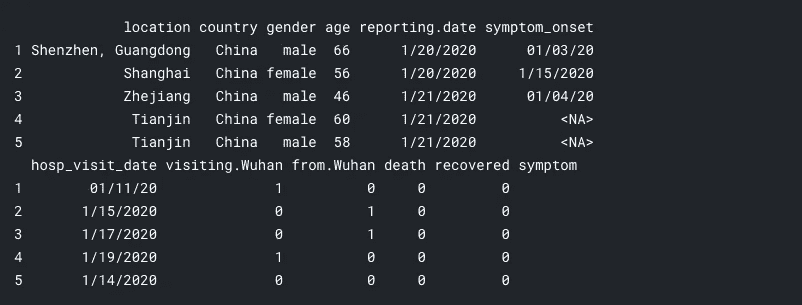

```
*# Binarize response:*
dat1$y = 0
dat1$y[dat1$death==1] = 1   
dat1$y = as.factor(dat1$y)
```

我们有一个代表死亡事件的二元响应变量，我们准备更深入地研究建模过程。

## 模型假设

在不打算进入太多细节的情况下，我认为为了理解模型可解释性是如何获得的，经历一些基本步骤是很重要的。

回想一下，在二项式 logit 模型中，响应变量是遵循二项式或伯努利分布的随机向量:

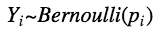

其中*P*(*Y =*1)*= P*，对于所有观测值 *i=* 1 *，…，N.*

这是与线性回归的一个重要区别，在线性回归中，随机因素来自协变量，而不是响应。我们的模型做出了其他几个假设，分析的第一步应该是确保我们的场景满足这些假设。

关于响应分布的第一个假设已经确定，但是可以扩展为假设其期望值*E*[*Y =*1】*= NP*，对于所有的 *i* 、可以与协变量的线性组合相关联:

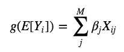

这相当于:

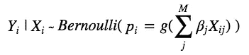

对于观测值 *i* =1、…、 *N* ，解释变量 *j* =1、…、 *M* ，链接函数 *g* 。其次，假设解释变量 *X* 相互独立，不相关。第三，观测值也被假定为相互独立和不相关的。一些进一步的假设与最大似然估计对数据大小的限制有关。众所周知，当参数的数量增加超过一定限度时，最大似然估计往往会过度拟合，但幸运的是，我们的数据并没有接近那个危险区域。

一个更普遍的假设是，我们的数据是随机抽样的结果。这在预测的情况下尤其重要，因为响应变量(样本类别平衡)的分布对截距项的估计有直接影响，因此也对模型预测有直接影响。好的一面是，斜率系数不受影响。换句话说，逻辑回归中的非代表性类别平衡对预测有直接影响，但对解释没有影响。因为我们的目标是后者，所以我们可以不做平衡样本假设。

## 定义 GLM

我们现在可以将我们的模型定义为二项式 GLM。回想一下，任何 GLM 都由三个部分定义:

*   随机成分
*   系统的组成部分
*   链接功能

假设随机变量 *Y* 将新冠肺炎案例的二元结果映射为伯努利试验，使得:

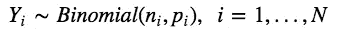

其中 *p* 是观察到单个患者死亡结果 *P* ( *Y* =1)的概率， *N* 是具有 *Y* 观察值的患者数量， *n* 是每个患者的试验次数(在我们的例子中， *n* =1，对于所有 *n* )。这是我们的随机成分。

设 *η* 为 *Y* ，*E*[*Y*]=*η*的期望值，假设存在一个函数 *g* (。)使得 *g* ( *η* )是协变量的线性组合:

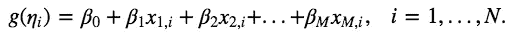

对于 *X* = *x* ，对于所有的 *j* ，上式的 RHS 就是我们的系统分量。

我们选择 *g* (。)= *logit* (。)作为反函数的环节，*逻辑*(。)，可以把我们模型的输出挤在[0，1]区间内，这也恰好是*E*[*Y*]=*η= p*，for *n* =1 的期望范围。因此，通过将*η*=*NP*=*p*插入我们的链接函数 *g* (。)，我们得到:

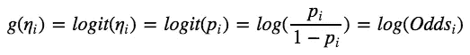

从中我们得出模型的最终结构:

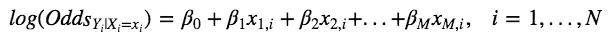

为了简单起见，我们省略了索引:


随机分量现在可以改写为:

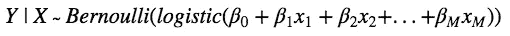

注意:最后一个表达式解释了为什么逻辑回归是字面上的*回归*和而不是分类。

## 数据准备

这一步包括检查数据集中的方差和稀疏性，以及生成新的预测值。定义了 GLM 并检查了其假设后，我们可以继续检查数据中的类别平衡:

```
table(dat1$y)
```


该数据集与我们对新冠肺炎死亡率的先验知识一致，这使我们的分析进入了罕见事件检测的领域。利用新冠肺炎的领域知识，我们可以立即考虑将'*年龄*'和'*性别*'作为相关的预测因子，但我们也可以尝试创建新的预测因子。从第一次症状出现到患者住院的时间可能会提供一些信息。我们可以很容易地通过计算住院日期和症状发作日期之间的天数来创建这个预测值。

```
*# Cast 'Date' types:*
dat1$hosp_visit_date = as.character(dat1$hosp_visit_date)
dat1$symptom_onset = as.character(dat1$symptom_onset)
dat1$hosp_visit_date = as.Date(dat1$hosp_visit_date, format="%m/%d/%y")
dat1$symptom_onset = as.Date(dat1$symptom_onset, format="%m/%d/%y")
dat1$from.Wuhan = as.factor(dat1$from.Wuhan)*# Create 'days before hospitalization' variable:*
dat1$days_before_hosp = as.numeric(as.Date(dat1$hosp_visit_date, format="%m/%d/%y") - as.Date(dat1$symptom_onset, format="%m/%d/%y"))
dat1$days_before_hosp[dat1$days_before_hosp < 0] = NA
```

因此，在稍后的模型选择过程中，可以将计算症状发作和住院之间天数的变量添加到我们的模型中。数据的当前状态似乎包括相当多的缺失值(显示为' *NA* ')，因此可视化稀疏性前景将是有见地的。

```
# Plot missing values:
aggr(dat1, col = c('green','red'), numbers = TRUE, sortVars = TRUE, 
     labels = names(dat1), cex.axis = .5, gap = 2, 
     ylab = c("Proportion in variable","Proportion in dataset"))
```

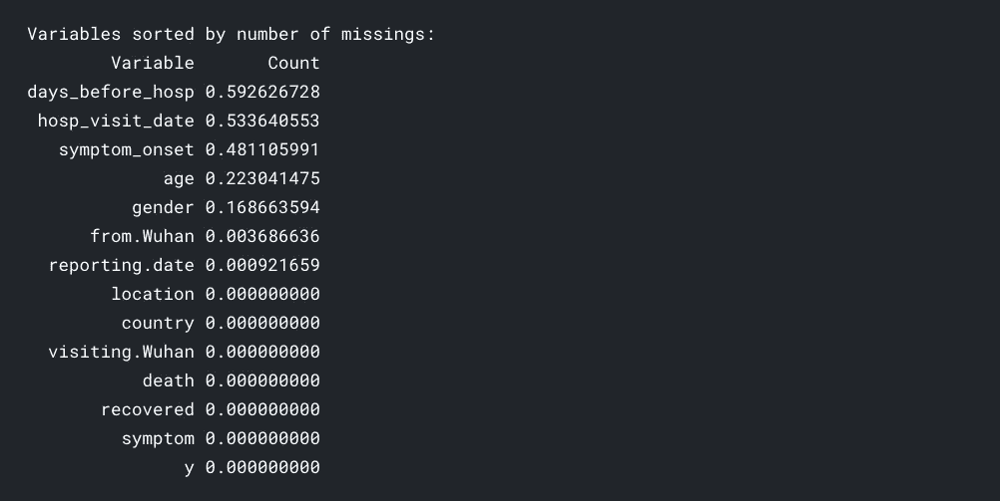

每列缺失值的比例

上表显示了每个变量中缺失值的比例。下面的柱状图展示了同样的观点(左图)。

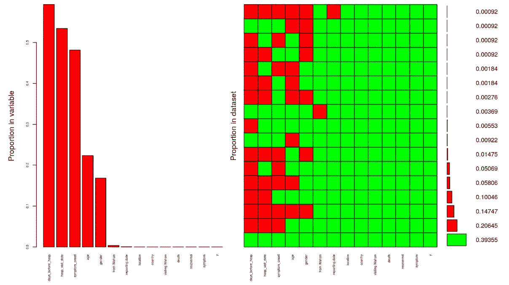

缺失的数据环境

右侧的网格显示了单个预测的缺失值占数据集中所有值的比例。例如，矩阵的最后一行，全绿色，告诉我们 39%的数据集案例在所有变量中都没有缺失值。前一行告诉我们，前三个变量(出现的顺序)中缺少 20%的事例，前一行显示前五个变量中缺少 15%的值，依此类推。

很明显，有很多缺失的数据，而且它们分散在各处，所以在剔除和插补之间的选择并不明显。在试图回答这个问题之前，我们应该尝试使用少量但大量的预测因子来拟合基线模型。我们希望在接近原始数据集的数据集上拟合一个模型，但我们将执行缺失值移除，而不是插补。具有稀疏性或低方差的变量(例如'*国家*'、'*医院 _ 访问 _ 日期*'、'*症状 _ 发作*')应该被排除，并且为了最小化数据移除，包含在基线模型中的变量应该具有尽可能少的缺失值。

## 模型 0(基线模型)

模型选择过程将包括拟合几个候选模型，直到我们找到最接近“真实”模型的一个。在每次比较时，将根据特定的渐近标准(待解释)对候选模型进行评估。

我们将从一个非常简单的模型开始，该模型根据变量'*年龄*和'*性别*'回归死亡率。

将死亡率风险表示为年龄和性别的函数，这使得我们可以将等式[1]中的 GLM 改写为:

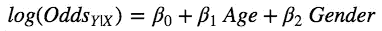

```
# Loading custom functions used in the analysis:
source('../input/glmlib/myglm-lib.r') #modify path as required
```

我们使用 R 的标准' *glm* '函数拟合模型，并借助' *jtools* '软件包和一些自定义函数检查拟合优度。我们使用包' *jtools* '中的' *summ* '函数来获得模型诊断的良好摘要。应该注意的是，R 的内置' *glm* '函数默认情况下会删除所有带有' *NA'* 值的行，所以我们在摘要中被告知，在我们总共 1082 个观察值中，只有 825 个用于训练。我们还看到关于拟合优度统计和标准的报告，如 [AIC、BIC](https://onlinelibrary.wiley.com/doi/pdf/10.1002/9781118856406.app5) 、偏差，它们可用于特定条件下的模型选择。

```
#---------------------------------------------
# Model 0: gender + age
#---------------------------------------------# Train model:
gfit0 = glm(y~gender+age, data = dat1, binomial)# Summarize and inspect:
summ(gfit0, confint = TRUE, pvals = TRUE, digits = 3)
```

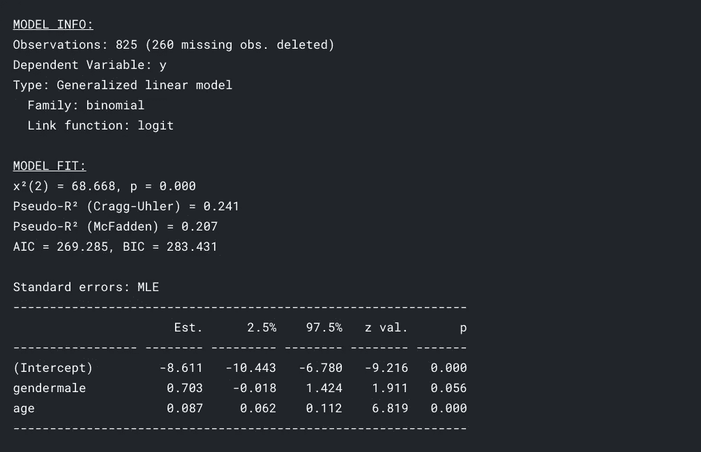

让我们为这个输出提供一些背景。

回想一下，偏差是普通最小二乘回归中残差平方和的推广，因此它将当前模型与*饱和* *模型*的距离表示为它们各自对数似然 *l* (。).因此，当前模型的(缩放)偏差由下式获得:

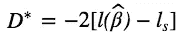

其遵循渐近分布:

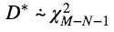

自然，偏差总是正的，与拟合优度成反比，用 *D =* 0 表示完美拟合。零偏差 *D0* 是仅截距(零)模型的偏差——最差的可能模型:

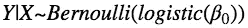

—通过设置获得:

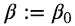

代入上面的公式。 *Ds* 是饱和模型的偏差——可能的最佳模型——对于 *n* 样本量具有 *n* 个参数的模型，其似然等于 1，偏差等于 0。

偏差可以用来评估任何两个模型是否相等。这可以通过测试较大模型的所有额外系数都等于零的零假设来实现。对于任何给定的嵌套模型对 *m1* 和 *m2* ，可以通过统计进行比较:

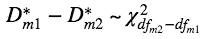

换句话说，对于两个相等的嵌套模型，它们相应偏差的差应该遵循一个 *χ* 分布，其中 *k* 自由度等于它们相应自由度的差。因此，这意味着我们也可以测试任意模型在统计上是否等于零模型(非常差的拟合)或饱和模型(非常好的拟合)。这些比较的代码如下所示:

```
# Comparing current model to the null model (LTR):
pval_m0 = 1 - pchisq(gfit0$null.deviance - gfit0$deviance, gfit0$df.null - gfit0$df.residual)
round(pval_m0, 3)
```

上述比较检验了零假设:

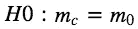

即当前模型是否等于仅拦截模型。自然，我们希望这个空值被拒绝，以使当前模型不被认为是无用的，因此我们期望 p 值低于可接受的决策阈值(通常为 0.05)。

```
# Comparing current model to the saturated model (Deviance test):
pval_ms = 1 - pchisq(gfit0$deviance, df = gfit0$df.residual)
round(pval_ms, 3)
```

这里，我们测试空值:

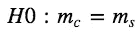

即当前模型在统计上是否等于饱和模型。未能拒绝零是期望的结果，尽管它不能作为零接受的证据。

我们可以通过观察它们的 p 值来评估模型系数的统计显著性。这些天有很多关于 p 值可靠性的讨论，所以我认为应该解释一下这些 p 值是如何获得的，它们真正的含义是什么。回想一下，GLM 的推论是渐近的，拟合系数的真实分布是未知的。MLE 的渐近性质为我们提供了模型系数的高斯分布:

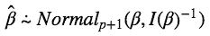

其中 *I* ( *β* )表示费希尔信息矩阵。求解 RHS 中的*常态* (0，1)，我们导出 *j* =0，…， *M* 的 Wald 统计量:

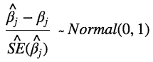

我们用它来计算置信区间和应用假设检验(就像我们在线性回归中使用 t 统计一样)。因此，我们可以利用下式计算系数的 100(1*α*)%置信区间:

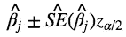

自然，我们也可以使用系数的渐近分布，通过检验零假设来进行关于其显著性的正式假设检验:

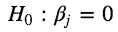

该方法使用 Wald 统计量，通常被称为 Wald 检验。

麦克法登的伪 *R* 是对解释变量的度量，定义为:

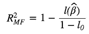

其中，当前模型的对数似然比 1 减去仅截距模型的对数似然比。该等式改编自线性回归 1*SSE*/*SST*中的 *R* 公式，但是，对伪 *R* 的解释是模型与最佳拟合的接近度，而不是模型解释的方差百分比。这里的一个经验法则是，0.2-0.4 之间的值通常表示“好”适合(范围从好到非常好)。

在经历了拟合优度的一些方面之后，我们意识到我们的基线模型客观上并没有那么差。我们得到了总体拟合的显著 p 值以及我们的一个系数(使用 Fisherian 95%置信水平)，并且我们得到了 0.20 的相当不错的伪*R*。此外，我们可以使用软件包' *jtools* '中的函数' *plot_summs* '来绘制模型系数的渐近分布，并通过注意*β2*(*性别*的系数)的尾部如何包含零值且不拒绝空值来可视化 Wald 测试的结果:

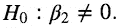

```
# Asymptotic distribution of model coefficients (model 0)
plot_summs(gfit0, scale = TRUE, plot.distributions = TRUE)
```

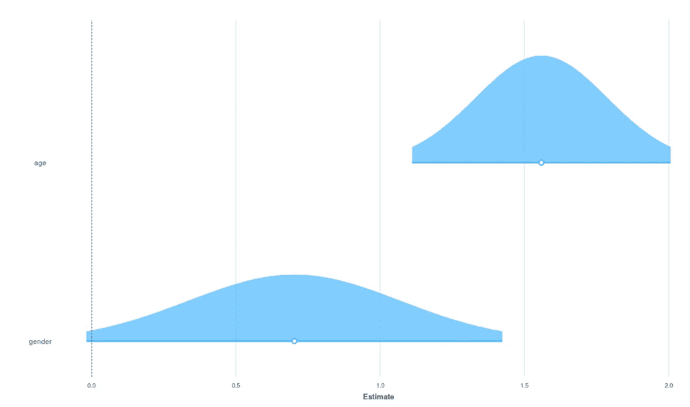

基线模型系数的渐近分布

上面的密度图可以帮助我们理解渐近推断是如何工作的。渐近置信区间和 p 值是通过估计该理论密度图上的积分来计算的，并且在适当的条件下，渐近推断的输出应该与任何客观非渐近方法的输出相匹配，例如(frequentist)蒙特卡罗、bootstrap 或平坦先验贝叶斯估计。

使用该模型的预测能力来可视化年龄对男性和女性死亡风险的影响将是有趣的。死亡率风险和年龄之间函数关系的重建如下所示:

```
# Mortality risk as a function of Age: 
x1 = data.frame(gender="male", age=1:90)
plot(predict(gfit0, x1, type = "response"), 
    type = 'l', xlab = "Age", ylab = "Mortality risk")
x2 = data.frame(gender="female", age=1:90)
lines(predict(gfit0, x2, type = "response"), col="red")
```

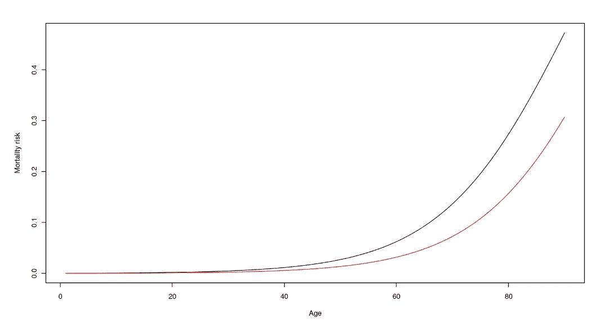

作为年龄函数的预测死亡风险(黑色:男性，红色:女性)

这个模型可以作为基线，所以我们可以从这里开始构建。显而易见的下一步是在模型中加入更多的预测因子，看看拟合度是否会提高。如前所述，该数据集的瓶颈在于我们有太多的缺失值分散在我们的预测器中。如果我们继续添加变量并删除缺少值的行，我们的数据集注定会危险地减少。例如，我们在基线中使用的变量'*年龄*和'*性别*'，已经花费了我们 260 次观察。变量' *days_before_hosp* '直观上是一个有趣的预测因子，但如果我们将它添加到基线模型中并应用逐行移除，我们数据集中的观察总数将减少到其原始大小的一半。从变量'*也是如此。武汉*’，表示被抽样的个体是否是武汉本地人(稍后将详细介绍该预测因子的含义)。因此，如果我们排除数据集中至少有一个缺失值的所有行，我们将得到一个更小但完整的数据集。另一方面，如果相信插补算法来“猜测”我们所有的缺失值，我们最终会发现我们的大部分数据是模拟观察的结果。鉴于目前的事态，如果我们要用更多的解释变量来丰富基线模型，我们面临两种选择:

*   *数据删除*:如果我们假设我们的数据是“随机缺失”(MAR)或“完全随机缺失”(MCAR)，那么应该考虑删除案例。然而，如果这个假设是错误的，那么我们就有可能在最终的精简数据集里引入偏差。
*   *数据插补*:假设数据“非随机缺失”(MNAR)，有多种插补方法可供选择。

这两种方法都不一定是错误的，我们也没有办法事先知道哪种方法最适合我们的情况，除非我们清楚地了解为什么数据会丢失。由于我们在这种情况下没有这种先验知识，明智的做法是使用两种方法，并生成简化数据集和估算数据集；然后将安装在前者上的模型与安装在后者上的模型进行比较。这种比较不是直截了当的，因为使用不同的数据集(就行输入而言)会导致模型无法通过基于可能性的标准进行比较，如 AIC/BIC、偏差和麦克法登的伪 *R* 。更好方法的选择将取决于“随机缺失”假设的验证。如果数据删除的结果与数据插补的结果相似，我们可以有把握地假设缺失的数据实际上是“随机缺失的”，在这种情况下，我们将倾向于插补的数据而不是减少的数据。

## 模型 1(估算数据集)

如前所述，可以添加到基线模式的两个有趣的变量是:

*   *'days_before_hosp* ':从首次出现新冠肺炎症状到患者随后住院(之前创建)之间的天数
*   *‘从。武汉*':表示患者是否来自武汉的因素。同样，后一个变量对死亡率有显著影响有点违背直觉，但在这个过程中会有一个合理的解释。

应该注意的是，我们有意避免自动化这个选择过程，以尽量减少模型比较。这种做法的目的是避免陷入逐步选择的领域，逐步选择是一种广泛使用的技术，如今被明智地视为一种[统计学罪过](https://link.springer.com/article/10.1186/s40537-018-0143-6)。

我们的下一个候选模型将具有以下嵌套形式:

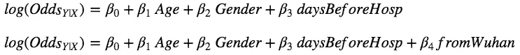

此时，我们必须创建估算数据集。根据数据中缺失值的性质、数量和分布，有大量的插补方法可供选择。在温和的“随机缺失”假设下，我们决定我们场景的最佳方法是通过链式方程的*多重插补，通常称为 [MICE 算法](https://www.ncbi.nlm.nih.gov/pmc/articles/PMC3074241/)。使用“mice”库，我们可以模拟所有缺失数据的值，如下所示:*

```
# Create imputed dataset using 'mice':
dat1_obj <- mice(dat1[c("gender", "age", "days_before_hosp", "from.Wuhan", "country")], m=5, maxit = 50, method = 'pmm', seed = 400)
dat1_imp = complete(dat1_obj)
dat1_imp$y = dat1$y
```

现在我们在' *dat1_imp* '中有了估算数据集。接下来，我们将在新估算的数据集上重新调整基线模型和两个新的候选模型，并总结它们的诊断结果。我们正在重新调整我们的基线模型，因为多重插补还填充了之前由' *glm* '函数自动删除的关于*性别*和*年龄*的缺失数据。我们并不期望这会对基线模型的诊断造成巨大的变化，但为了使所有模型相互之间具有可比性，有必要将其重新调整到与新的候选模型完全相同的数据集。

```
# Train models on imputed data:
gfit1a = glm(y~gender+age, data = dat1_imp, binomial)
gfit1b = glm(y~gender+age+days_before_hosp, data = dat1_imp, binomial)
gfit1c = glm(y~gender+age+days_before_hosp+from.Wuhan, data = dat1_imp, binomial)# Compare fits:
export_summs(gfit1a, gfit1b, gfit1c, scale = F, error_format = "[{conf.low}, {conf.high}]", digits = 3, model.names = c("model 1a", "model 1b", "model 1c"))
plot_summs(gfit1a, gfit1b, gfit1c, scale = TRUE, plot.distributions = F, inner_ci_level = .95, model.names = c("model 1a", "model 1b", "model 1c"))
```

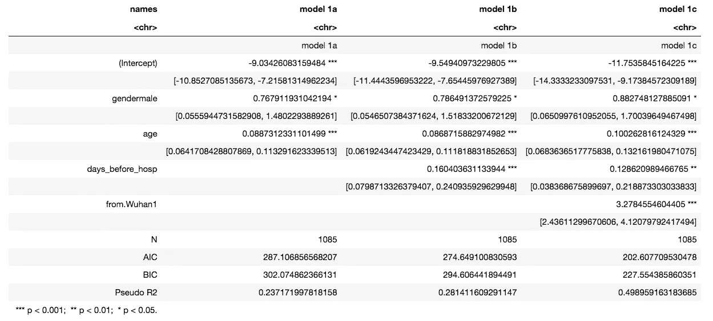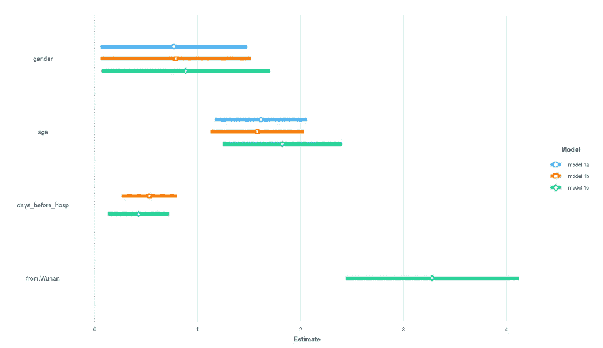

比较数据插补后模型系数的渐近分布(基线，住院前天数，来自武汉)

因此，现在我们有三个嵌套模型适用于相同的输入情况，我们可以使用基于可能性的标准直接进行比较。正如预期的那样，在所有方面都有明显的改善，因为我们看到 AIC 和 BIC 值都显著下降，而伪 *R* 在第三个模型中几乎翻了一番。可以有把握地得出结论，带有两个新变量的模型是我们应该关注的。

95%置信区间图可以被认为是系数渐近分布的“全景”视图，它允许我们评估估计的一致性。两个置信区间是否重叠让我们知道两个模型之间相同系数的估计值是否显著不同。这有助于我们检测多重共线性的存在，这可能是由于向模型中添加了新的变量而导致的。

在这一点上，有人可能想知道，使用基于可能性的度量来比较模型的最佳方式是什么。根据经验，Akaike 信息标准(AIC) [已被描述为](https://www.jstor.org/stable/2984877?seq=1)留一交叉验证的渐近等价物，因此它是用于预测目的的更好指标。另一方面，贝叶斯信息标准(BIC)已经被[在之前引用](https://www.jstor.org/stable/41058949)作为在一组候选模型中找到*真*模型的更好标准，这是我们为了*解释*的目的所需要的。请注意，“真实模型”是具有正确的函数形式和正确的回归变量集的模型，这些回归变量可以最好地解释响应，但它不一定是进行预测的最佳模型(解释响应所需的一些变量可能会影响估计的精度，而不会增加预测值)。考虑到这一点，我们将把 BIC 作为选择车型的标准。

我们继续将相同的候选模型拟合到已经经历了数据移除的数据集。

## 模型 2(精简数据集)

缩减的数据集将通过列表式删除来创建，即移除具有一个或多个缺失值的输入案例(观测值)。我们使用以下代码创建以下内容:

```
# Create reduced dataset for model 2:
# (filter out rows with NA values)
not_na_mask = !is.na(dat1$y) & !is.na(dat1$days_before_hosp) & !is.na(dat1$age) & !is.na(dat1$gender) & dat1$days_before_hosp >= 0
dat2 = dat1[not_na_mask, ]
table(dat2$y)
```


我们可以看到观察总数减少了 40%。现在让我们看看拟合模型的诊断结果会是什么样子。

```
#------------------------------------------------------------------
# Model 2: gender + age + time to hospitalization (on reduced 
# dataset)
#------------------------------------------------------------------# Train model:
gfit2a = glm(y~gender+age, data = dat2, binomial)
gfit2b = glm(y~gender+age+days_before_hosp, data = dat2, binomial)
gfit2c = glm(y~gender+age+days_before_hosp+from.Wuhan, data = dat2, binomial)# Merge model summaries:
export_summs(gfit2a, gfit2b, gfit2c, scale = F, error_format = "[{conf.low}, {conf.high}]", digits = 3,  model.names = c("model 2a", "model 2b", "model 2c"))# Compare asymptotic distributions of coefficients:
plot_summs(gfit2a, gfit2b, gfit2c, scale = TRUE, plot.distributions = F, inner_ci_level = .95, model.names = c("model 2a", "model 2b", "model 2c"))
```

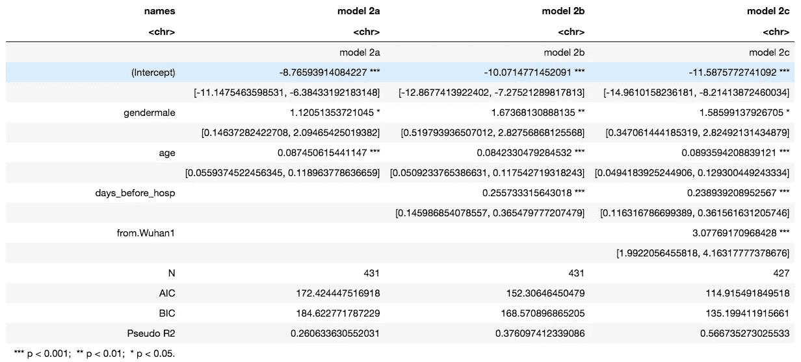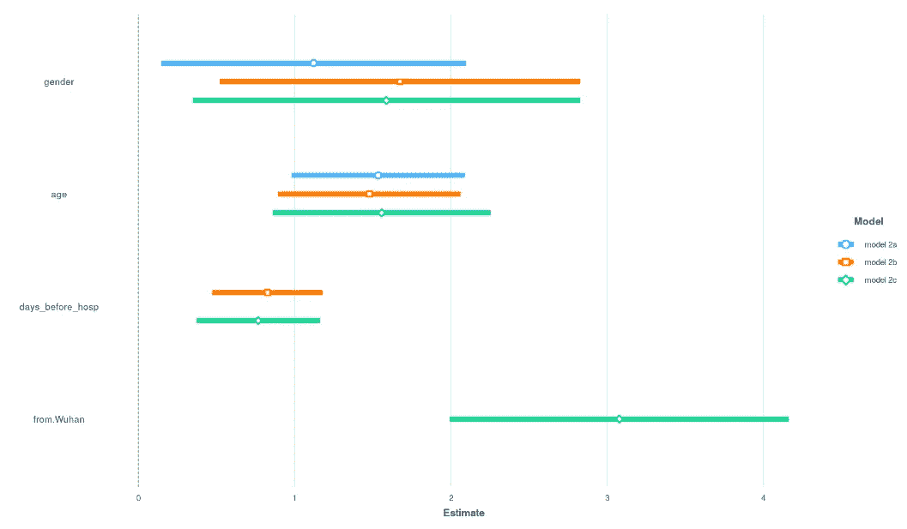

比较数据删除后模型系数的渐近分布(基线，住院前天数，来自武汉)

考虑到我们如何将数据集缩减到原来的一半，这个模型的拟合度出奇的好。渐近分布的比较表明，在缩减数据集上拟合的三个模型的诊断与在估算数据集上拟合的诊断一样稳定。这是一个积极的结果，表明缺失数据实际上是如假设的那样随机缺失的，并且插补算法在填充缺失值方面做得很好。在下一节中，我们将进一步加强这一假设，比较两个数据集的最佳候选模型(就 BIC 而言)。

## 比较估算数据集和缩减数据集

```
# Merge summaries of two models (imputed vs. reduced)
export_summs(gfit1c, gfit2c, scale = TRUE, error_format = "[{conf.low}, {conf.high}]", digits = 3, model.names = c("model 1c", "model 2c"))# Compare asymptotic distributions of coefficients:
p1 = plot_summs(gfit1c, gfit2c, scale = TRUE, plot.distributions = T, model.names = c("model 1c", "model 2c"))
p2 = plot_summs(gfit1c, gfit2c, scale = TRUE, plot.distributions = F, inner_ci_level = .95, model.names = c("model 1c", "model 2c"))
grid.arrange(p1, p2, ncol=2)
```

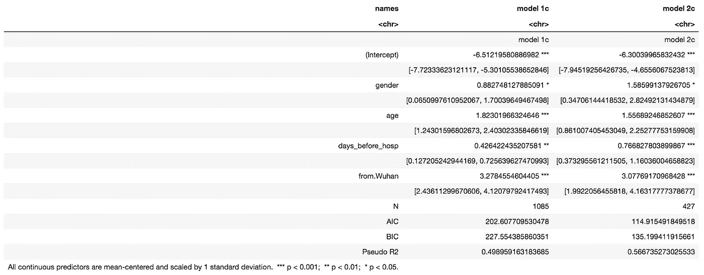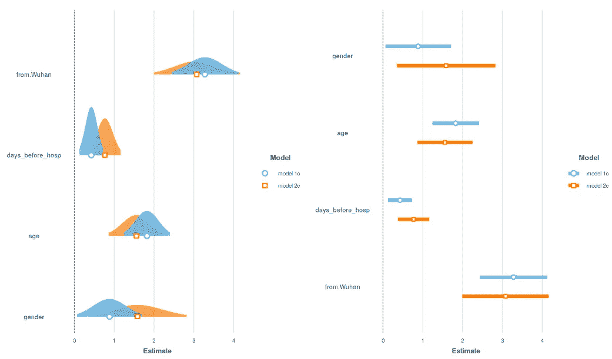

比较模型系数的渐近分布(缩减数据集模型与估算数据集模型)

正如已经提到的，基于可能性的分数在不同数据集上拟合的模型之间是不可直接比较的，尽管如此，根据我们的经验法则，可以有把握地说 0.56 的麦克法登分数本身就表明非常好的拟合。将估算数据集模型系数的渐近分布绘制在简化模型系数的渐近分布旁边是一种比较标准误差并确认两种方法之间没有根本变化的好方法。所有预测因子的估计系数在两种方法中都被发现是显著的，所以我们很高兴地观察到他们的推断保持一致。*性别*系数的点估计值在拟合简化数据的模型中较高，但其置信区间与拟合估算模型的置信区间重叠，因此两个估计值之间的推断没有显著差异。

到目前为止，我们有足够的证据相信我们的缺失数据实际上是“随机缺失”(MAR)，即一个值缺失的概率只取决于观察值，而不取决于未观察值。如果 MAR 假设成立，那么 MICE 在产生正确表示“真实”缺失数据的模拟观察方面做得很好。因此，MICE 估算数据集上的模型与缩减(列表式删除)数据集上的模型一致，因此，可以安全地假设两个数据集都是人口的代表性随机子样本。理论上，我们可以使用两个数据集中的任何一个进行下一步的分析，但是出于信息增益的原因，我们将使用估算数据集。

解决了估算数据集后，我们可以进入模型选择的最后阶段，这需要创建和添加新的预测值。我们注意到，变量‘T2’的加入是从。武汉对模型的拟合通过减少 BIC 而显著提高，伪 *R* 增加约. 20。在这一点上，我们不清楚为什么一个表明一个人是否出生在武汉的变量会与死亡率有任何关系，更不用说有如此大的影响了。让我们通过测试武汉本地人与非本地人的人均死亡人数来进一步了解这一因素。

## 武汉本地人死亡率

武汉人和非武汉人的死亡率似乎有显著差异。如果我们相信我们的数据，这种反直觉的洞察力就不应该被忽视，但是这种差异背后的原因是什么呢？一个不幸但现实的假设是，来武汉出差或旅游的人平均收入高于本地人。我们可以通过比较武汉本地人和非本地人的死亡率来挑战这一假设。这可以通过简单的双样本*𝑧*-比例测试来实现，并可视化为柱状图。

```
#-------------------------------------------------------------------
#Inspecting proportion of mortality rate in Wuhan natives:
#-------------------------------------------------------------------
# Create dataframe:
tmp = data.frame(rbind(
  table(dat1_imp$y[dat1_imp$from.Wuhan==1]),
  table(dat1_imp$y[dat1_imp$from.Wuhan==0])
))
names(tmp) = c("total", "deaths")
tmp$death_rate = round(tmp$deaths/tmp$total, 3)
tmp$from_wuhan = as.factor(c(1,0))# Compare proportions (deaths per cases between groups):
se1 = sqrt(tmp$death_rate[1]*(1-tmp$death_rate[1])/tmp$total[1])  
# Standard errors of proportions:
se2 = sqrt(tmp$death_rate[2]*(1-tmp$death_rate[2])/tmp$total[2])
tmp$prop_se = round(c(se1, se2), 4)
print(tmp)
print(prop.test(x = tmp$deaths, n = tmp$total, alternative = "greater"))# Barplot of proportions:
ggplot(tmp, aes( y=death_rate, x=from_wuhan)) + 
 geom_bar(position="dodge", stat="identity", width=0.4, 
 color="black", fill="cyan", alpha=.2) + 
 geom_errorbar(aes(ymin=death_rate - prop_se, ymax=death_rate +
 prop_se), width=.1, position=position_dodge(.9))
```

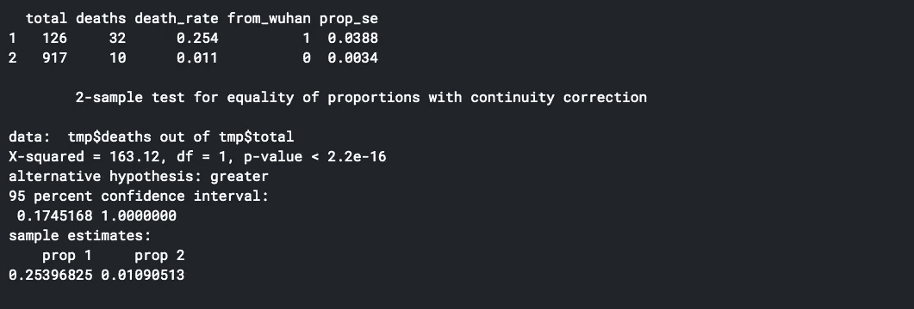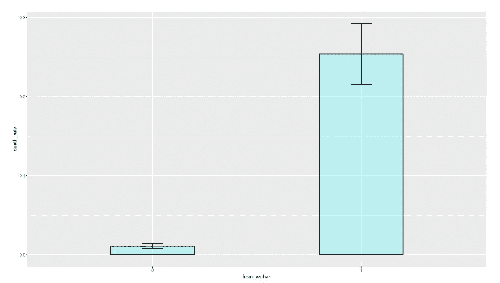

显然，武汉本地人和非本地人之间的平均死亡率有显著差异。让我们探索不同协变量的相同测试，例如两组之间住院前的平均天数:

```
# Compare average number of days gone by before hospitalization 
# between both groups:
d1 = dat1_imp$days_before_hosp[dat1_imp$from.Wuhan==1]
d2 = dat1_imp$days_before_hosp[dat1_imp$from.Wuhan==0]
sem1 = t.test(d1)$stderr
sem2 = t.test(d1)$stderr
tmp$avg_days = c(mean(d1), mean(d2))
tmp$mean_se = c(sem1, sem2)
print(tmp)
t.test(d1, d2, alternative = "greater")# Barplot:
b1 = ggplot(tmp, aes( y=avg_days, x=from_wuhan, fill=from_wuhan)) + 
  geom_bar(position="dodge", stat="identity", width = .4, alpha=1) + 
  geom_errorbar(aes(ymin=avg_days - mean_se, ymax=avg_days + mean_se), width=.1, position=position_dodge(.9)) # Boxplot:
df = data.frame(days = c(d1, d2), from_wuhan = as.factor(c(numeric(length(d1))+1, numeric(length(d2)) )) )
b2 = ggplot(df, aes( y=days, x=from_wuhan, fill=from_wuhan)) + 
  geom_boxplot(outlier.colour="black", outlier.shape=16, 
  outlier.size=2, notch=T) +
  stat_summary(fun=mean, geom="point", shape=23, size=4) 
grid.arrange(b1, b2, ncol=2)
```

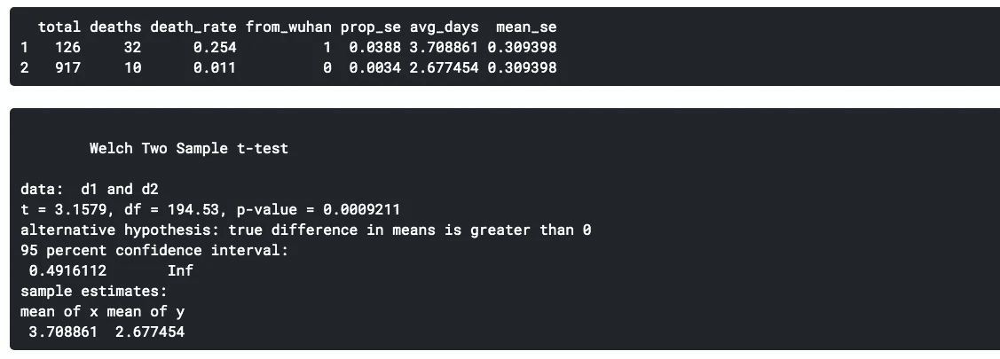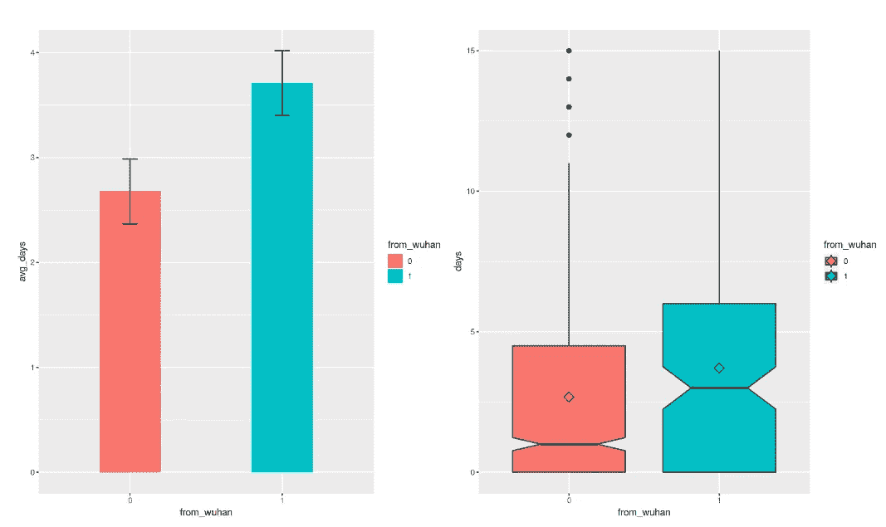

武汉市本地人与非本地人平均住院天数的比较

正如所怀疑的，在这个测试中也有一个显著的不同。他们的平均值之间的距离可能很小(3.70 对 2.68)，但他们的差异在统计上是显著的，这进一步加强了我们关于因子'*'与'之间潜在联系的假设。武汉*’和个人的社会经济地位。至此我们可以推测，变量‘T4’来自何处。武汉作为另一个潜在变量的混杂因素。换句话说，可能有另一个携带所有社会经济信息的预测器。武汉百变。一个合乎逻辑的假设是，这个潜在的预测因素是“*国家*”，理由是某人的种族与其社会经济地位以及是否是武汉本地人直接相关。我们已经确定不能将' *country* '添加到模型中，因为它的方差很低，但是我们可以' *from。假设武汉是其代理人。必须有另一个比' *from 更细粒度的潜在变量。‘武汉*’与当时的‘国家*’相关联。**

我们将引入一个国家层面的宏观经济变量，如 GDP (PPP)，它表示一个国家的人均国内生产总值(按购买力平价计算)。如果各组(来自武汉，而不是来自武汉)之间的每个国家的平均 GDP 值存在显著差异，那么我们关于患者的财富与死亡率相关联的最初假设将进一步加强。最终，这个变量也会提高我们模型的拟合度。

让我们为 GDP 创建一个数据向量，其中元素的顺序对应于国家名称的顺序(按' *levels(dat$country)* '列出):

```
# Adding GDP (PPP):
dat = dat1_imp
dat$gdp = 0

gdp_per_country = c(2182, 16091, 54799, 55171, 51991, 50904, 5004, 
                    52144, 20984, 29207, 14800, 49548, 48640, 55306, 
                    66527, 9027, 17832, 40337, 41582, 46827, 67891, 
                    15599, 34567, 3550, 10094, 30820, 105689, 46452, 
                    43007, 14509, 55989, 67558, 57214, 21361, 70441, 
                    48169, 67426, 8677)
for(i in 1:length(gdp_per_country)){
  country = levels(dat$country)[i]
  country_inds = dat$country == country
  dat$gdp[country_inds] = gdp_per_country[i]
}
```

名为“ *gdp* 的新列现在是估算数据的一部分。让我们看看当我们把这个变量引入模型时会发生什么。

## 模型 3(包含 GDP 的模型)

因此，GDP 模型将具有以下形式:

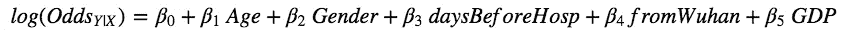

```
#----------------------------------------------------------------
# Model 4: Adding GDP (PPP)
#----------------------------------------------------------------# Fit model with GDP:
gfit1d = glm(y~gender+age+days_before_hosp+from.Wuhan+gdp, data = dat, binomial)# Compare models with GDP with and without GDP:# Merge model summaries:
export_summs(gfit1c, gfit1d, scale = F, error_format = "[{conf.low}, {conf.high}]", model.names = c("without GDP", "with GDP"))# Compare asymtotic distributions:
f1 = plot_summs(gfit1c, gfit1d, scale = TRUE, plot.distributions = TRUE, model.names = c("without GDP", "with GDP"))
f2 = plot_summs(gfit1c, gfit2c, scale = TRUE, plot.distributions = F, inner_ci_level = .95, model.names = c("without GDP", "with GDP"))
grid.arrange(f1, f2, ncol=2)# Final model summary:
summ(gfit1d, scale = F, plot.distributions = TRUE, inner_ci_level = .9, digits = 3)
gfit = gfit1d   #rename final model
```

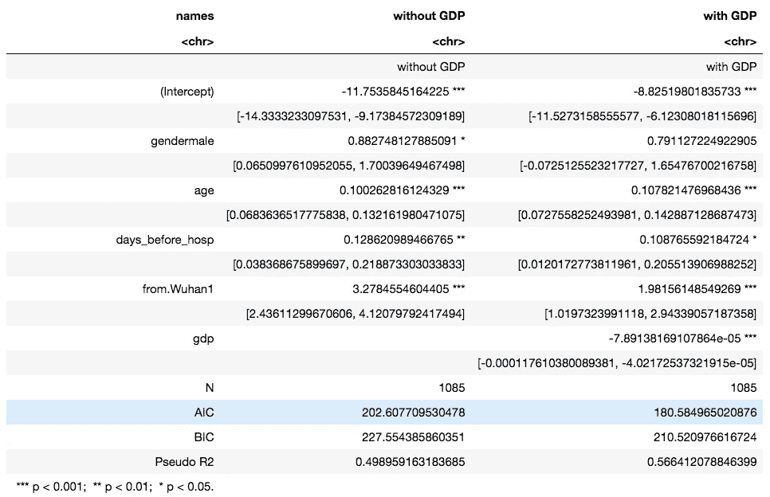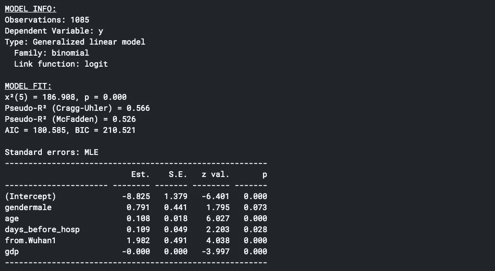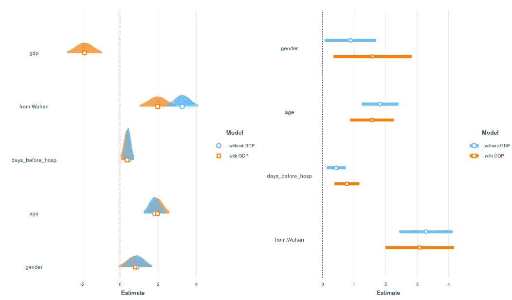

比较模型系数的渐近分布(有国内生产总值与无国内生产总值)

正如我们推测的那样，将 GDP 加入到我们的模型中进一步提高了拟合度，如 BIC 的显著降低和伪 T2 R 的增加所示。它的系数可能很小(可能是由于‘T4’from 的存在)。武汉【我们模型中的 )但它的影响仍然是显著的。我们可以进一步比较每个群体的平均 GDP(武汉本地人与非本地人)，以评估他们的差异是否显著:

```
# Mean GDP per group (from Wuhan):
d3 = dat$gdp[dat$from.Wuhan==1]
d4 = dat$gdp[dat$from.Wuhan==0]
t.test(d3, d4)
sem3 = t.test(d3)$stderr
sem4 = t.test(d4)$stderr
tmp$avg_gdp = c(mean(d3), mean(d4))
tmp$mean_se_gdp = c(sem3, sem4)# Barplot:
f3 = ggplot(tmp, aes( y=avg_gdp, x=from_wuhan, fill=from_wuhan)) + geom_bar(position="dodge", stat="identity", width = .5) + geom_errorbar(aes(ymin=avg_gdp-mean_se_gdp, ymax=avg_gdp+mean_se_gdp), width=.1, position=position_dodge(.9)) # Boxplot:
df = data.frame(days = c(d1, d2), gdp = c(d3, d4), from_wuhan = as.factor(c(numeric(length(d1))+1, numeric(length(d2)) )) )
f4 = ggplot(df, aes( y=gdp, x=from_wuhan, fill=from_wuhan)) + 
  geom_boxplot(outlier.colour="black", outlier.shape=16, 
  outlier.size=2, notch=FALSE) + 
  stat_summary(fun=mean, geom="point", shape=23, size=4)
grid.arrange(f3, f4, ncol=2)
```

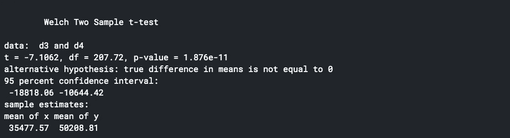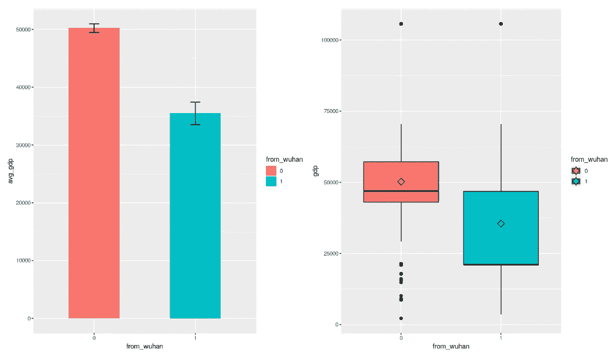

武汉本地人与非本地人人均 GDP /国家比较

我们的假设检验证实，来自武汉的死亡患者的平均 GDP (PPP)与来自非武汉的死亡患者的平均 GDP (PPP)显著不同。这进一步证实了我们模型的系数 p 值。

到目前为止，我们已经确认估算数据集是“最佳”数据集，并且具有预测值'*年龄*'、*性别*'、*天 _ 之前 _ 住院日*'、*的模型来自。武汉*’，*GDP*’，是最接近“真实”模型的一个。作为建模过程的最后一步，我们将使用计算推断来评估系数稳定性和样本的同质性。

## 自助系数稳定性

到目前为止，我们已经经历了一个保守的模型选择过程，这导致了一个我们认为接近真实模型的模型。验证过程的最后一步是通过自举程序测试模型系数的稳定性。如果我们的系数被发现是“稳定的”,那么我们的样本可以被认为是同质的，我们的估计是可靠的。这里使用两个标准来评估系数的稳定性:

*   计算/袋装系数估计的统计显著性(即当经验分布*不*包含零时评估)
*   计算/袋装估计值与渐近估计值的接近程度(即当渐近和计算平均值*之间的差异分布*包含零时进行评估)

请注意，在这种情况下，引导聚合(打包)和重采样的目的与随机森林的目的并不完全相同。我们将使用带替换的随机子采样来训练多个模型，但我们的目标是为模型系数而不是模型预测创建袋装估计和自举置信区间。Bagging 将用于产生模型参数(袋装系数)的点估计，而经验自助分布和那些袋装估计的相关自助置信区间将允许我们评估估计的模型稳定性。在其最简单的形式中，这种评估包括检验袋装估计等于渐近估计的假设，这归结为比较同一参数的渐近分布和 bootstrap 分布。实现这一点的一种方法是测试袋装估计和渐近估计之差等于零的零值。如果我们可以证明渐近估计可能与计算(bootstrap)估计没有不同，我们可以有把握地假设我们已经收敛到“真实”系数。

我们使用自定义函数' *bagged_glm* '来获得模型参数的 bootstrap 分布。' *alpha* 参数用于模型汇总统计，' *class_balancing* 标志以 50%对欠采样类进行重新采样(未使用)，' *bag_pct* '参数确定训练包的大小，标志' *ocv* '激活出坏交叉验证(相当于随机森林的出包错误)。

```
*#-------------------------------------------------*
*# Coefficient stability (final model):*
*#-------------------------------------------------*
bagged_results = bagged_glm(dat = dat, gfit = gfit, alpha = 0.05, class_balancing = F, bag_pct = 0.80, ocv = T)
coef_bags_df = bagged_results$coef_bags_df
```

让我们来看看计算推理的结果:

```
*# Bootstrap means of transformed coefficients:*
cat(
    "\n Bootstrap means of back-transformed coefficients:\n",
    "Intercept: ", mean(coef_bags_df$`(Intercept)`), 
    "Gender: ", mean(coef_bags_df$gendermale),    
    "Age: ", mean(coef_bags_df$age),     
    "Days before hospitalization: ", 
     mean(coef_bags_df$days_before_hosp),
    "From Wuhan: ", mean(coef_bags_df$from.Wuhan1),
    "\n"
)
*# Compare with asymptotic values: (merge with table above)*
coefficients(gfit)
confint(gfit)
```

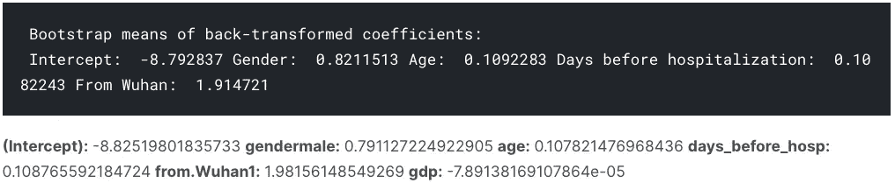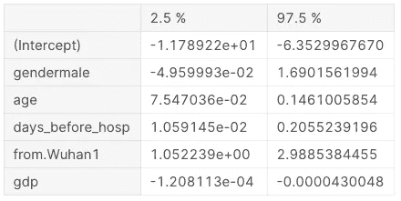

```
*# Test null distribution directly: H0: m2-m1 = 0* 
par(mfcol=c(3,2))
for(i in 1:length(bagged_results$coef_bags_df)){
  d = bagged_results$coef_bags_df[[i]] - coefficients(gfit)[i]
  qtt = quantile(d, c(.975, .025))  
  att = t.test(d)
  hist(d, col="lightblue", main = names(coefficients(gfit)[i]), 
  breaks = 30)
  abline(v = 0, col="blue", lwd=3, lty=2)
  abline(v = qtt[1], col="red", lwd=3, lty=2)
  abline(v = qtt[2], col="red", lwd=3, lty=2)
}
dev.off()
```

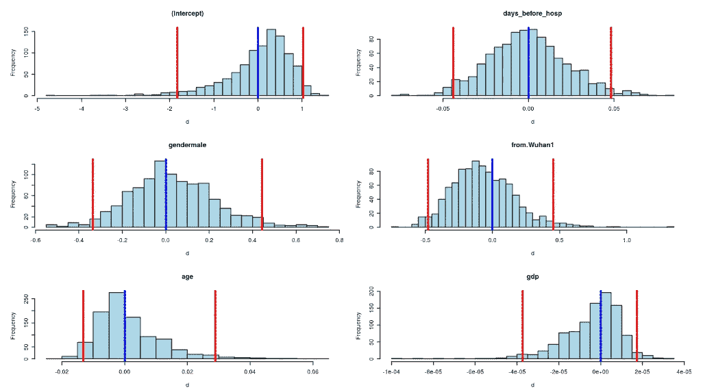

检验模型系数的渐近分布和计算分布之间的差异

正如我们在上面的直方图中看到的，袋装估计值 *μ* 2 - *μ* 1 *之间的差值 *d* 的分布在自举置信区间(红线)内包含零(蓝线)。因此，零假设:*

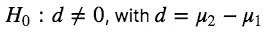

在 95%的显著性水平上未被拒绝。尽管未能拒绝零假设并不意味着接受零假设，但这一发现与我们之前的所有发现相结合，应该足以假设我们的估计是可靠的，并允许我们继续进行模型解释。

## 模型解释

作为分析中期待已久的步骤，我们终于可以继续解释我们模型的系数了。回想一下，任何二项式 logit 模型(等式[1])都可以表示为:

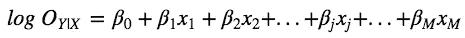

求解 *β0* 产量:

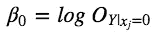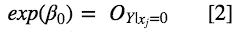

求解 *βj* 产量:

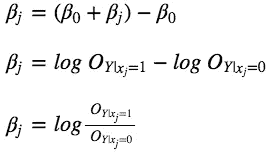

最后:

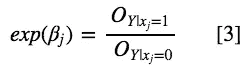

表达式[2]中的 *β0* 的值可以被解释为当所有连续回归变量为 0 且分类回归变量处于其基础水平时，响应的概率为 1。在我们的场景中，我们可以说“*住院前天数、患者年龄和 GDP 为零时的平均死亡概率，并且患者不是武汉本地人*”。显然，患者年龄和 GDP 等于 0 是一种无意义的解释，但是，如前所述，我们对该分析中的 *β0* 的直接解释不感兴趣(否则我们可以使用截距校正技术)。我们对表达式[3]中的 *βj* 的解释很感兴趣，如果 *x* 连续，它可以被一般地解释为回归变量 *j* 每增加一个单位，或者如果 *x* 是绝对的，它可以被解释为从基础水平到当前水平的转变；其他条件不变。为了使这种解释有意义，我们必须使它适应我们的场景，并简单地把 *βj* 看作:

*死亡率概率的百分比变化*，

对于与回归量 *j* 相对应的任何变化，其他都是相同的。我们可以将这种解释应用于最终模型的系数:

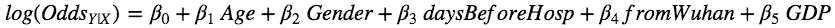

因此，让我们总结一下原始形式和转换形式的模型系数:

```
glm.transform(gfit, alpha = .10, logodds_str = "exp(beta)%", ci = T, stdout = F)
```

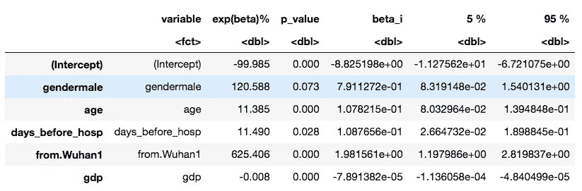

```
glm.plot(gfit, alpha = 0.10, logodds_str = "exp(beta)%", stdout = F)
```

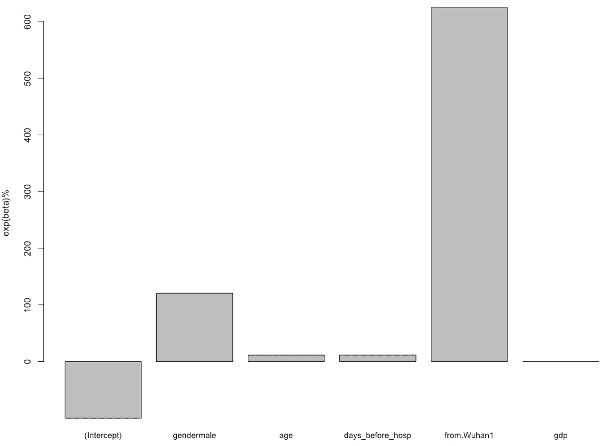

对死亡风险的可变影响的大小

我们可以将转换后的系数作为一个因子，并将 *Y* 的几率解释为比 *X* 的几率高几倍，或者我们可以使用百分比变化形式，并说 *Y* 的概率按照所解释的 *X、*的每一次变化而变化一定的比例。就个人而言，我认为后一种解释更直观，下面我们可以看到它在 90%置信水平下对我们模型的每个系数的应用:

*   [*]—*exp*(*β1*):
    ***年龄*** 每增加一岁，新冠肺炎患者的死亡风险大约增加 11%。(CI: 8.36%-14.97%)
    表达这一观点的一种更直观的方式是将转换后的系数乘以因子 10，并得出年龄增加 10 岁的几率增加 114%。因此，我们可以说:
    ***年龄每增加 10 岁，新冠肺炎的死亡风险几乎翻倍。****
*   *[*]—*exp*(*β2*):
    ***新冠肺炎死亡风险男性比女性高 120%***。(置信区间:8.67%-367%)**
*   **[***days before hosp***]—*exp*(*β3*):
    ***新冠肺炎患者在他/她出现第一个症状*** 的第一天之后，患者不住院的每一天，死亡风险都会增加 12%。(置信区间:2.7%-20.9%)**
*   **[ ***来自武汉***]—*exp*(*β4*):
    ***武汉本地人的新冠肺炎死亡风险大约高 6 倍*** 。(置信区间:231%-1577%)**
*   **[***GDP***]—*exp*(*β5*):
    新冠肺炎的死亡风险间接受到患者原籍国 GDP (PPP)的影响。虽然这种影响太弱，无法量化，但结合武汉的'*'，它 ***很可能暗示了患者的生存机会与其个人财富*** 之间的依赖关系。***