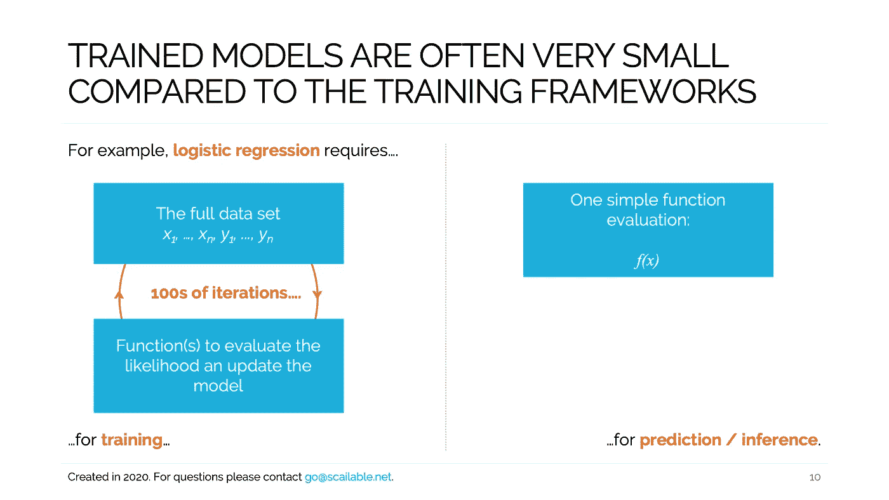
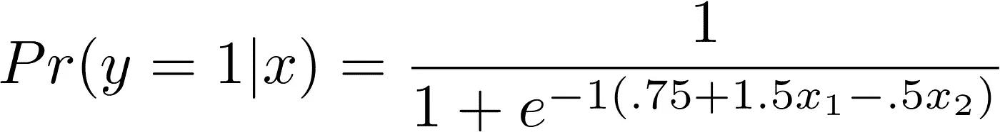

# 利用模型训练和预测之间的差异。

> 原文：<https://towardsdatascience.com/exploiting-the-differences-between-model-training-and-prediction-40f087e52923?source=collection_archive---------39----------------------->



## 减少内存占用，提高部署模型的速度和可移植性。

> 这篇文章的代码可以在这里找到[。](https://github.com/scailable/sclbl-tutorials/tree/master/sclbl-train-vs-deploy)

最近几个月，我们已经帮助许多公司在各种环境中部署他们的 AI / ML 模型。我们为医疗保健领域的模型部署做出了贡献，在过去的几个月里，我们已经帮助几家公司将经过训练的模型迁移到不同类型的物联网设备上。特别是在后一种情况下，要求通常很严格:计算周期的数量和可用内存通常都是有限的。

在这篇文章中，我澄清了我们如何确保使用标准 ML 库训练的模型，如 [PyTorch](https://pytorch.org) 、 [Scikit-learn](https://scikit-learn.org/stable/) 和 [Tensorflow](https://www.tensorflow.org) 可以在各种边缘设备上有效地部署*。为了使事情变得具体，我们将检查一个简单的逻辑回归模型的训练和部署。然而，我们在这里讨论的大部分直接转移到更复杂的模型。*

# *模特培训*

*为了说明模型训练和部署之间的区别，让我们从模拟一些数据开始。下面的代码根据下面的简单模型生成 1000 个观察值:*

**

*(一个简单的逻辑回归模型用作本例的 DGP)*

```
*import numpy as np
np.random.seed(66)  # Set seed for replication# Simulate Data Generating Process
n = 1000  # 1000 observations
x1 = np.random.uniform(-2,2,n)  # x_1 & x_2 between -2 and 2
x2 = np.random.uniform(-2,2,n)
p = 1 / (1 + np.exp( -1*(.75 + 1.5*x1 - .5*x2) ))  # Implement DGPy = np.random.binomial(1, p, n)  # Draw outcomes# Create dataset and print first few lines:
data = np.column_stack((x1,x2,y))
print(data[:10])*
```

*生成数据后，我们可以专注于拟合模型。我们简单地使用`sklearn`的`LogisticRegression()`函数来实现:*

```
*from sklearn.linear_model import LogisticRegression
mod = LogisticRegression().fit(data[:,[0,1]], np.ravel(data[:,[2]]))*
```

## *近距离观察*

*在这一点上，有必要暂停一下，简要地考虑一下引擎盖下正在发生的事情。逻辑回归模型，就像许多其他有趣的 ML 模型一样，被反复训练*。为了训练这个模型，`sklearn`(或者任何其他提供类似功能的包)必须实现几个功能:**

1.  **某种分数函数表示模型的适合度。这可能是一个误差函数，或最大似然函数。**
2.  **从一次迭代到下一次迭代更新拟合模型参数的函数。**

**训练过程将有效地重复使用这两个函数:最初，模型的参数是随机实例化的。接下来，检查模型的分数。如果分数被认为是不够的(通常是因为它与前一次迭代相比有所改进)，则更新模型参数并重复该过程。**

**即使对于这个简单的模型，`sklearn`也需要多次遍历数据集。下面的代码给出了迭代次数(对于这个种子选择是 7 次):**

```
**# Print the number of iterations
print(f'The number of iterations is: {mod.n_iter_}.')**
```

**因此，**为了训练一个模型**，我们需要访问数据，几个效用函数，并且我们需要多次迭代/遍历数据集。一般来说，这种训练过程在计算上要求很高，这解释了为什么对于复杂的模型，我们求助于并行计算和 GPU 或 NPU 加速来在合理的时间内完成它。然而，幸运的是，当训练模型时，我们使用的各种 ML 库抽象掉了这样做所需的相当复杂的逻辑。**

# **生成预测**

**将这与从已经拟合的模型中生成*预测*进行比较(通常称为*推论*，但我发现后一个术语令人困惑，因为它在统计学中的用法不同，所以我坚持使用预测)。在拟合模型时，在这种情况下，实际上我们需要生成预测的只是逻辑回归函数(与我们在上面的示例中用于生成数据的数学函数相同)和拟合模型的三个参数。这些很容易检索:**

```
**b = np.concatenate((mod.intercept_, mod.coef_.flatten()))
print(b)**
```

**并且参数最终与我们用于数据生成的值相对接近:`[0.84576563 1.39541631 -0.47393112]`。**

**此外，在大多数部署情况下，我们通常只使用一个输入来评估模型:在本例中，是一个长度为 2 的数字向量。所以真的，如果我们想要部署一个模型，我们不需要拟合函数，我们不需要数据，我们不需要迭代。**为了生成预测**，我们只需要简单有效地实现相关的数学函数。**

# **利用训练和预测之间的差异进行(边缘)部署**

**“那又怎么样？”你可能会问。当现代模型训练工具抽象掉所有这些细节时，为什么还要关心训练和预测中涉及的本质细节呢？嗯，因为当你希望你的模型被有效地*部署的时候，例如当你需要它们在小型设备上快速运行的时候，你最好利用上面描述的差异。***

**为了便于讨论，请对比以下两种模型部署方法(即，将训练好的模型投入生产，以便您可以使用其预测):**

1.  ****sklearn 作为 REST 服务的 docker 容器部署:**这种方法简单且常用:我们启动一个 Docker 映像，其中包含 python 堆栈和用于训练的工具:在上面的示例逻辑回归模型中，`sklearn`。接下来，我们创建一个 REST 端点，它使用拟合模型的`mod.predict()`函数来生成结果。**
2.  ****可伸缩 WebAssembly 部署:**最近，但一点也不困难的是将 fitted 模型转换为 WebAssembly(使用类似于[可伸缩](https://www.scailable.net)提供的服务)，并部署。WASM 二进制只包含在最小 WebAssembly 运行时预测所需的逻辑。(自动生成的)二进制文件将只包含必要的逻辑函数(在这种情况下)和估计的参数。二进制文件可能部署在服务器上(因此类似地通过 REST 调用使用)，但是，使用[各种可用的运行时](https://github.com/scailable/sclbl-webnode)，它也可以运行在几乎任何边缘设备上。**

**显然，第一个部署过程接近数据科学家的“我们所知道的”。直接使用我们熟悉的工具工作是很好的。在许多方面，它是可行的:我们可以通过调用 REST 端点来生成预测。第二种解决方案与我们的标准实践相去甚远，并且对于模型训练毫无用处(也就是说，没有“用于训练模型的 WebAssembly 包……”，如果那句话有任何意义的话)。但是，我们仍然认为应该优先选择它:第二种设置利用了训练和预测之间的差异，在几个方面使模型部署更好:**

*   ****内存占用:**上面两个选项中的第一个将需要*至少* 75Mb 的容器(让容器变得那么小[需要大量的工程设计](https://jilongliao.com/2018/08/09/Reduce-Docker-Image-Size/)，更常见的是容器的大小接近 1Gb)。在这种情况下，存储的模型本身很小(~2Kb)，因此容器包含了部署的最大内存块(注意，对于大型神经网络来说，这可能不是真的)。相反，WebAssembly 运行时可以减少到小于 64 **Kb** 。无可否认，WebAssembly 二进制文件本身比存储的`sklearn`模型大(~50kb)，但是它现在包含了生成预测所需的全部内容*。因此，第一个部署选项至少需要 75Mb，而第二个部署选项需要不到. 1Mb。***
*   ****速度:**与高效的 WebAssembly 部署相比，消耗运行在 Docker 容器中的 REST 端点(它启动了训练所需的所有东西)在执行时间方面并不占优势。[这里](https://www.scailable.net/demo/bench/)是各种模型的一些速度比较，但是，不用说，利用训练和预测之间的差异，仅仅将预测的基本需求投入生产，会将这些预测生成的速度提高一个数量级。**

**因此，内存占用更少，执行速度更快。这很好，有几个原因:一个原因是，我们可能希望为[巴黎协定](https://unfccc.int/process-and-meetings/the-paris-agreement/the-paris-agreement)做出贡献，从而有效地部署模型，而不会在每次生成预测时浪费能量。但是，小的占用空间和快速的执行也很有吸引力，因为这正是我们在将模型投入生产时所需要的:祝您在 [ESP32 MCU 板](https://en.wikipedia.org/wiki/ESP32)上部署 Docker 容器好运。有了 WebAssembly，这简直是小菜一碟。**

# **放弃**

***值得注意的是我自己的参与:我是 Jheronimus 数据科学院* [*的数据科学教授，也是*](https://www.jads.nl)[*Scailable*](https://www.scailable.net)*的联合创始人之一。因此，毫无疑问，我对 Scailable 有既得利益；我有兴趣让它成长，这样我们就可以最终将人工智能投入生产并兑现它的承诺。这里表达的观点是我自己的。***