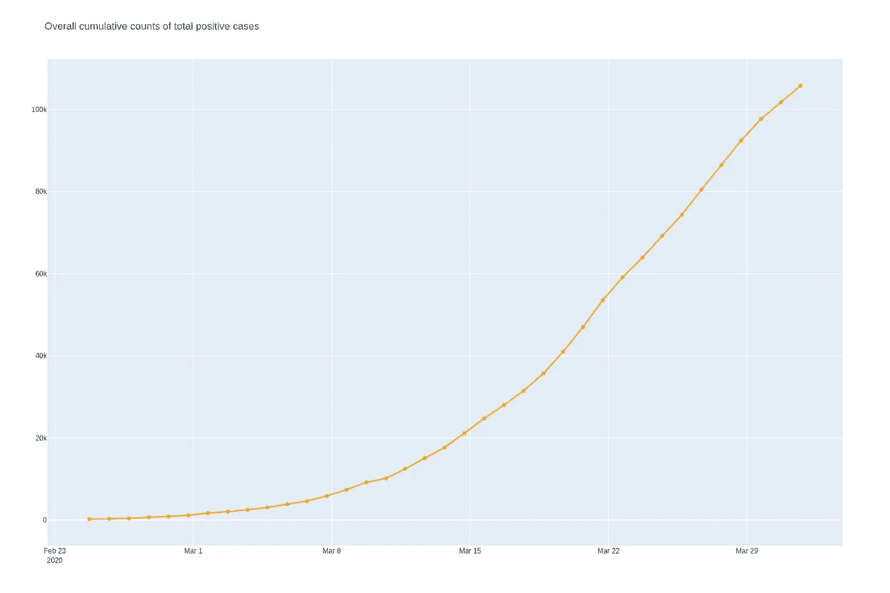
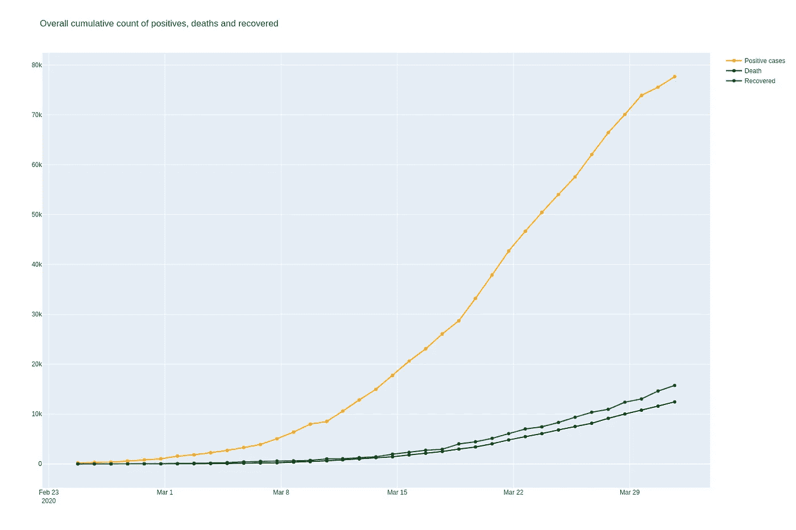
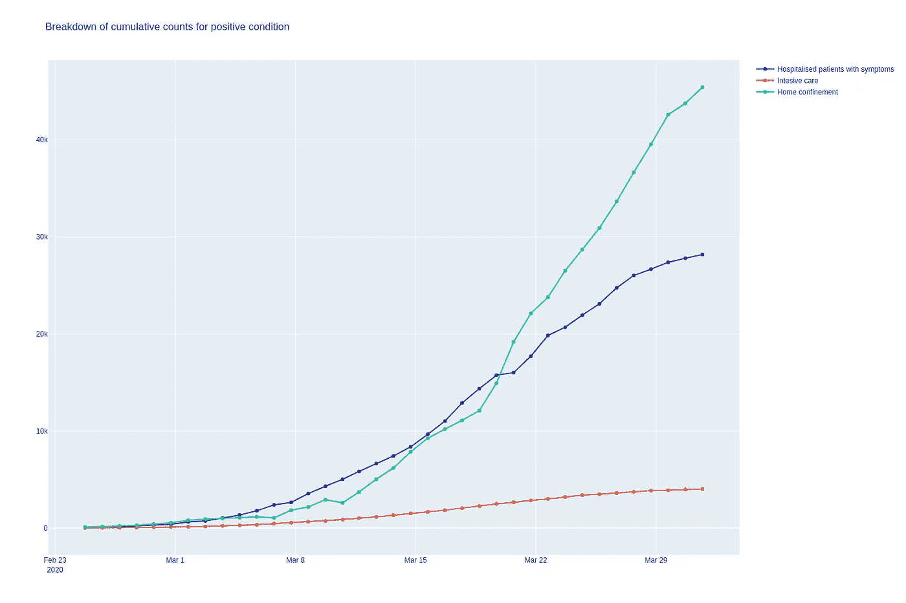
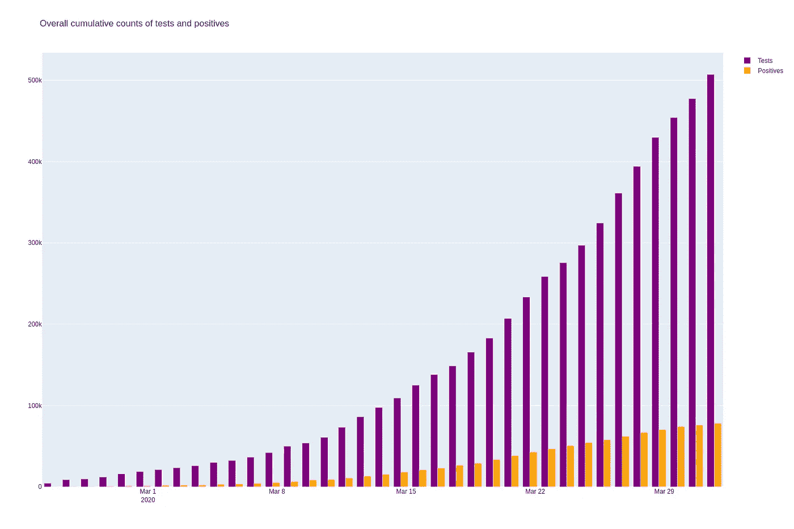
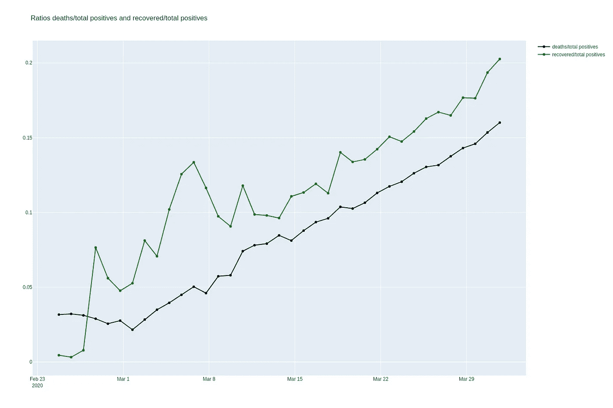
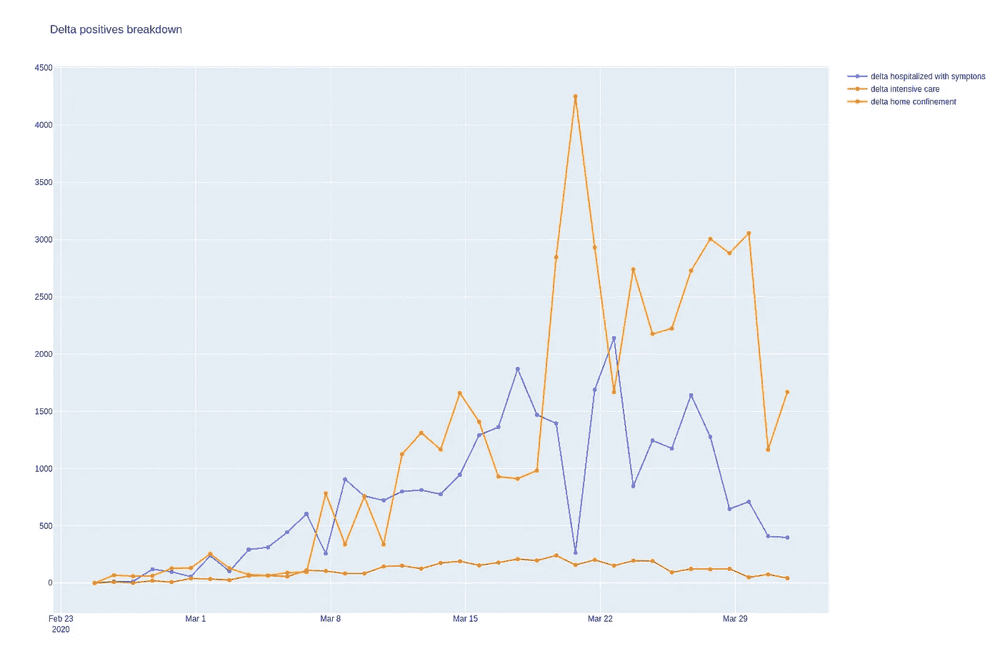
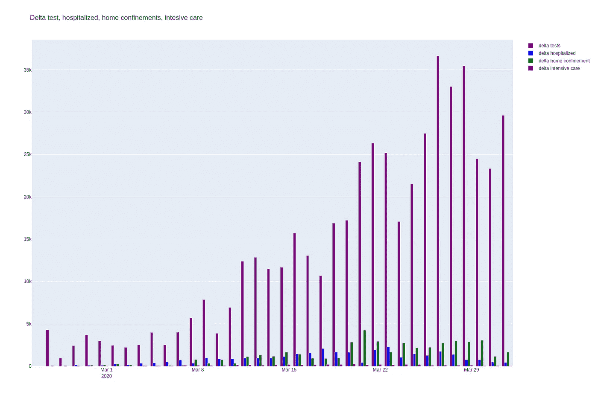
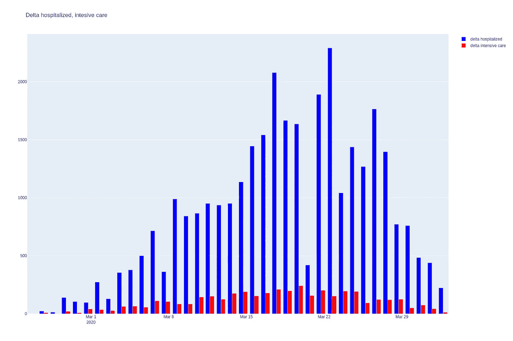
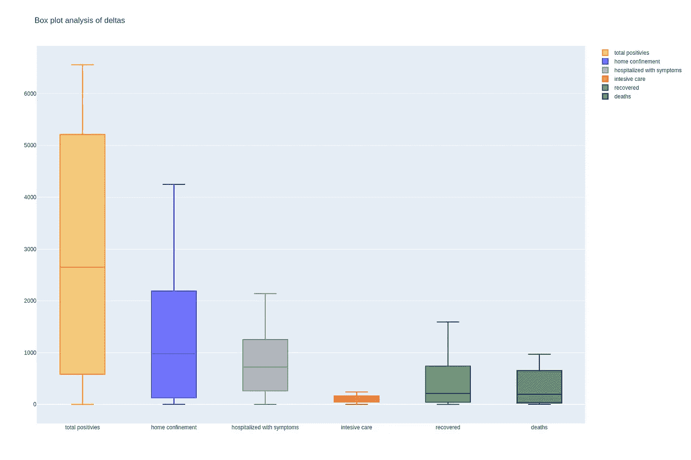
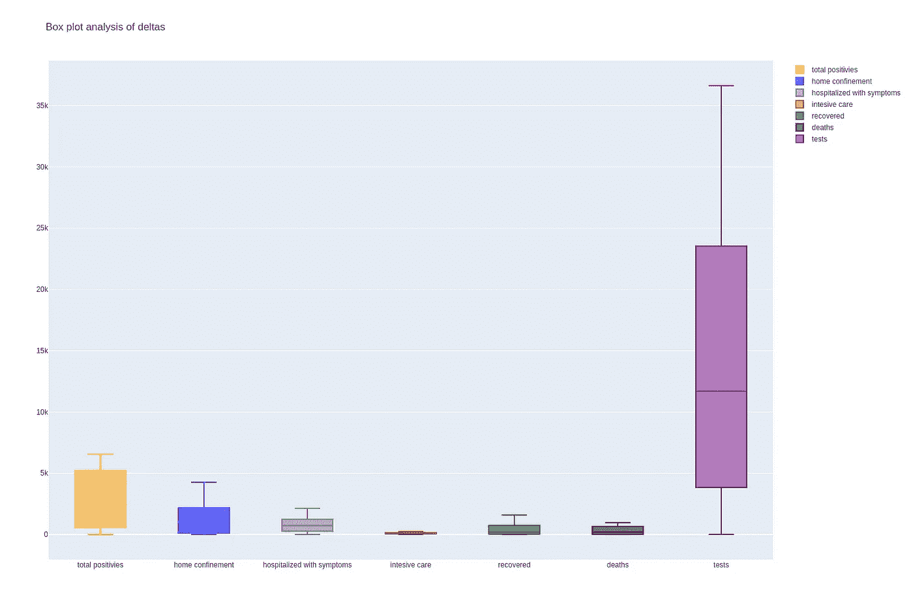

# 意大利新冠肺炎数据的探索性数据分析

> 原文：<https://towardsdatascience.com/explorative-data-analysis-of-covid-19-data-in-italy-d5665cb62c5a?source=collection_archive---------46----------------------->

在 [Unsplash](https://unsplash.com?utm_source=medium&utm_medium=referral) 上 [Caleb Stokes](https://unsplash.com/@yoitscalebb?utm_source=medium&utm_medium=referral) 拍摄的照片

不幸的是，意大利是受疫情病影响最严重的国家之一，所以我试图在现有的数据中找到一些见解。

我使用的数据来自每天更新的官方 git 库“Protezione Civile”，可在[这里](https://github.com/pcm-dpc/COVID-19)获得。

用于执行该分析的代码可以在[这里](https://gitlab.com/acalax/covid-19-eda-italy/-/tree/master/)找到。

如果你想直接运行笔记本只需点击这个链接:[https://my binder . org/v2/GL/acalax % 2f covid-19-EDA-Italy/master？filepath=eda_italy.ipynb](https://mybinder.org/v2/gl/acalax%2Fcovid-19-eda-italy/master?filepath=eda_italy.ipynb)

笔记本会下载数据，所以你可以随时更新图表！

免责声明:我没有试图预测或模拟任何事情，只是看着数据，并相应地建立一些图表。

分析覆盖了整个国家，但也可以很容易地扩展到地区和省份，只需修改代码。

我们开始吧。

## 数据

关于数据的所有信息都可以在存储库的 README.md 中找到，但是可以帮助澄清一些特性是相关的

有些是其他值的和，几乎所有的值都是日复一日累积的。

在代码中，我使用了意大利语的特性名称，而没有翻译它们

我们来详细看看:

被发现呈阳性的人可能处于以下情况之一:

*   *ricoverati _ con _ sintomi***(有症状住院患者)**
*   ***terapia_intensiva* (重症监护)**

**他们的总数是住院病人总数**

*   ***isolamento_domiciliare* (居家隔离)**

**总和为 totale_positivi(当前阳性病例总数)**

**结果可能是:**

*   ***地美西 _ 瓜里提*(已恢复)**
*   ***deceduti* (死亡)**

**所有阳性和结果的总和是 total_casi(阳性病例总数)**

**测试的计数器**

*   ***棉塞*(已进行测试)**

**昨天增加了一个新的字段“nuovi_positivi ”,每天都有新的案例，但我直接通过移动和减去数据得出所有的差异**

**让我们从显示所有案例总体情况的两个图表开始。**

**这些图像与 4 月 1 日更新的数据有关。**

****

**总阳性病例的总累积计数**

**并且结果尊重正面的案例**

****

**阳性、死亡和恢复的总累积计数**

**这就是疫情的样子，阳性病例和相关结果大幅增加，幸运的是死亡人数低于痊愈人数。**

**现在，让我们来看一下阳性病例的累计计数**

****

**阳性条件的累积计数明细**

**3 月 20 日以后，家庭分娩超过住院分娩，而重症监护增加。**

**让我们看看测试和阳性是如何联系的**

****

**测试和阳性的总累积计数**

**测试和阳性反应越来越多，希望阳性反应会“稳定下来”**

**现在让我们推导出几个新的特征，死亡与总病例数之间的比率(死亡/总阳性)以及恢复与总阳性之间的比率(恢复/总阳性)**

****

**死亡/总阳性比率和康复/总阳性比率**

**这是最“奇怪”的趋势之一，因为死亡和康复非常接近，而在其他国家，差距更大。**

**现在，我们来分析每天的增量，即一天与前一天的差值。这让我们更好地了解发生了什么和当前的趋势。**

****

**每天新增阳性病例**

**但愿下降趋势正在发生**

**案件总数的细目**

****

**增量阳性分解**

**家庭分娩在 3 月 20 日达到高峰，住院分娩在同一天达到最低点**

**这是 delta outcomes 的细分**

****

**Delta 结果分解**

**回收的价值很高，趋势似乎不错。**

**让我们看看测试和住院的趋势**

****

**重症监护是很小的一部分，让我们来看更多细节**

****

**趋势似乎不错，希望是因为没那么必要了。**

**最后，对所有相关增量进行统计分析。**

****

**三角洲的箱线图分析**

**这是对所发生事情的最好描述。**

**添加测试缩小了其他数据，但给出了所执行的努力的概念，在一天内执行了超过 35K 个测试，作为最大数量(26/03)**

****

**三角洲的箱线图分析**

# **结论**

**这些只是可能的报道的简单例子，希望可以帮助更容易理解正在发生的事情的规模。**

**就我个人而言，我没有一个清晰的见解，即使是因为数据的收集方式可能会影响结果，也因为在这个数据集中，目前有一些缺失的功能可能会有所帮助，如关于阳性、康复和死亡的年龄间隔的统计数据。**

**但是我也在想，使用可用的东西总比什么都没有好，尤其是当我们只是使用“原样”而不猜测任何东西的时候。**

**最后一个想法:数字可能是不可思议的无菌，但我们不能忘记它们涉及到生命，医院里遭受痛苦的人，哀悼亲人的家庭，处于严格封锁中等待知道自己是否生病的人。**

**然后还有其他人，包括我自己，没有被任何数据捕获，但仍然经历着这一切。我们真的是同舟共济，齐心协力才能克服这种局面。**

**注意安全！**

*****编者按:*** [*走向数据科学*](http://towardsdatascience.com/) *是一份以数据科学和机器学习研究为主的中型刊物。我们不是健康专家或流行病学家，本文的观点不应被解释为专业建议。想了解更多关于疫情冠状病毒的信息，可以点击* [*这里*](https://www.who.int/emergencies/diseases/novel-coronavirus-2019/situation-reports) *。***