# 对 1959 年至 2016 年美国宇航局宇航员的探索性分析

> 原文：<https://towardsdatascience.com/exploratory-analysis-of-nasa-astronauts-from-1959-2016-778aba6775a8?source=collection_archive---------30----------------------->

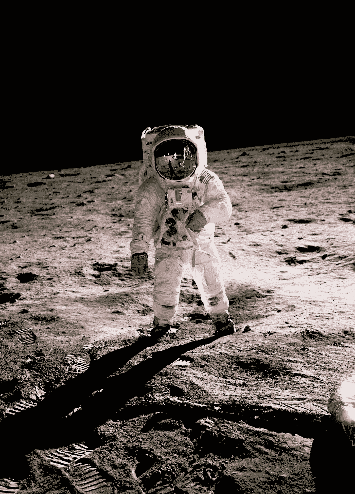

在 [Unsplash](https://unsplash.com?utm_source=medium&utm_medium=referral) 上用高清拍摄的[历史照片](https://unsplash.com/@historyhd?utm_source=medium&utm_medium=referral)

当我们还是孩子的时候，这个世界似乎充满了无限、无尽和奇妙的可能性，我们被问及长大后想做什么。虽然有许多不同的反应，如医生，消防队员，警察，或美国总统，其他人想成为宇航员，为美国航天局工作。虽然成为一名宇航员不是一件容易的事，但这篇文章将探索那些已经成为宇航员的人，并希望鼓励那些正在努力实现他们太空雄心的人。

我们会看母校的，军衔，军兵种，军种分布，性别分布，最致命的任务，最多的太空飞行，在太空呆的时间最多。

# 宇航员的性别分布是怎样的？

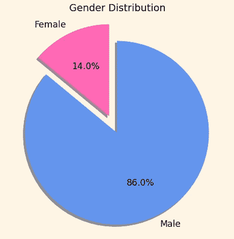

作者图片

大多数是男性，但女性不要气馁！

# 哪些学校培养了最多的宇航员？

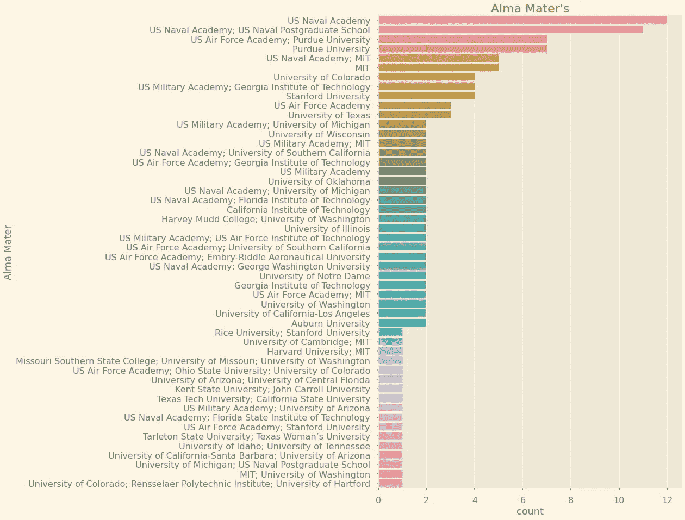

作者图片

我们可以看到[美国海军学院](https://www.usna.edu/homepage.php)&[美国空军学院](https://www.usafa.edu/)培养了最多的宇航员。[普渡大学](https://www.purdue.edu/)和[麻省理工学院](https://web.mit.edu/)紧随其后。

# 宇航员的本科学位是什么？

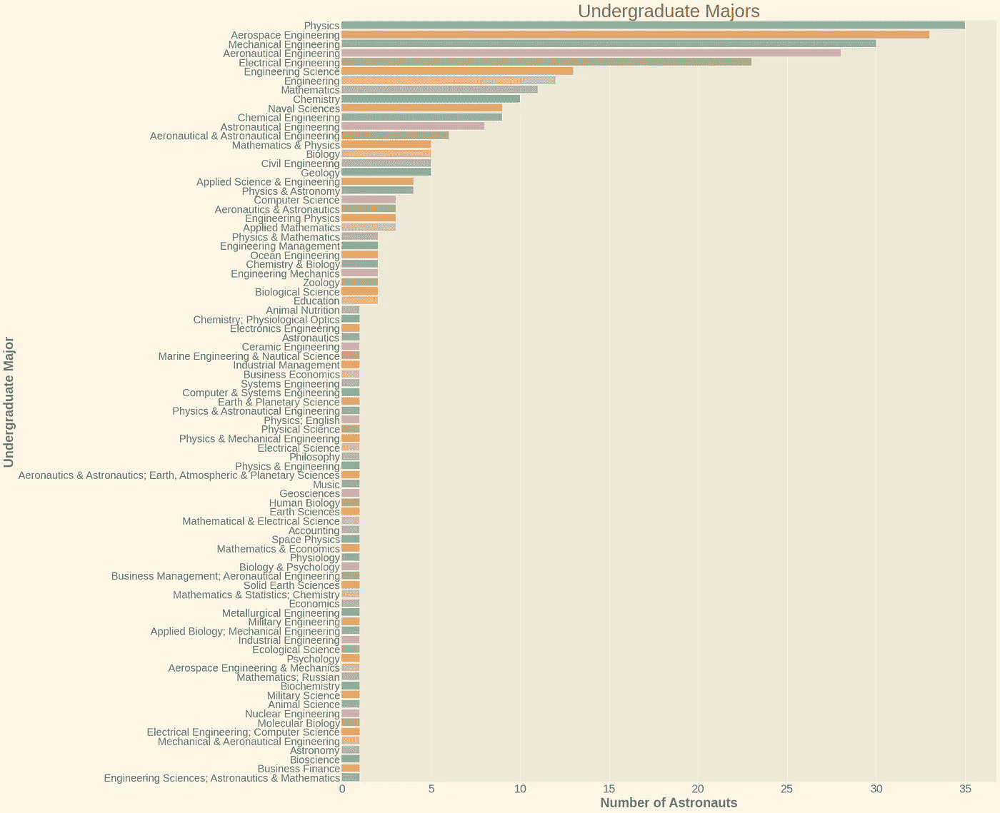

作者图片

许多宇航员拥有不止一个本科学位。

# 他们的研究生学位呢？

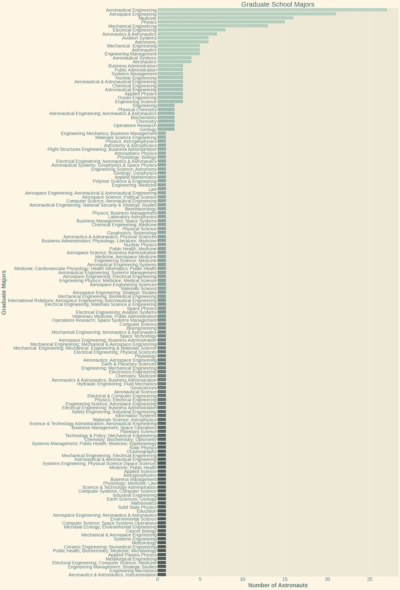

作者图片

许多宇航员也有不止一个研究生学位。

# 宇航员中有百分之多少是军人？

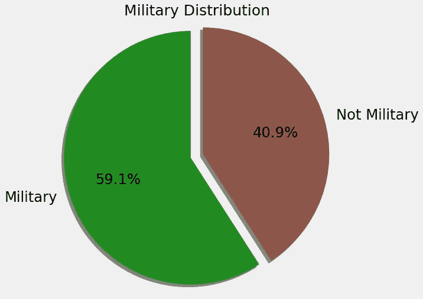

作者图片

大多数是军人，但也有许多不是军人。

# 哪些军种？

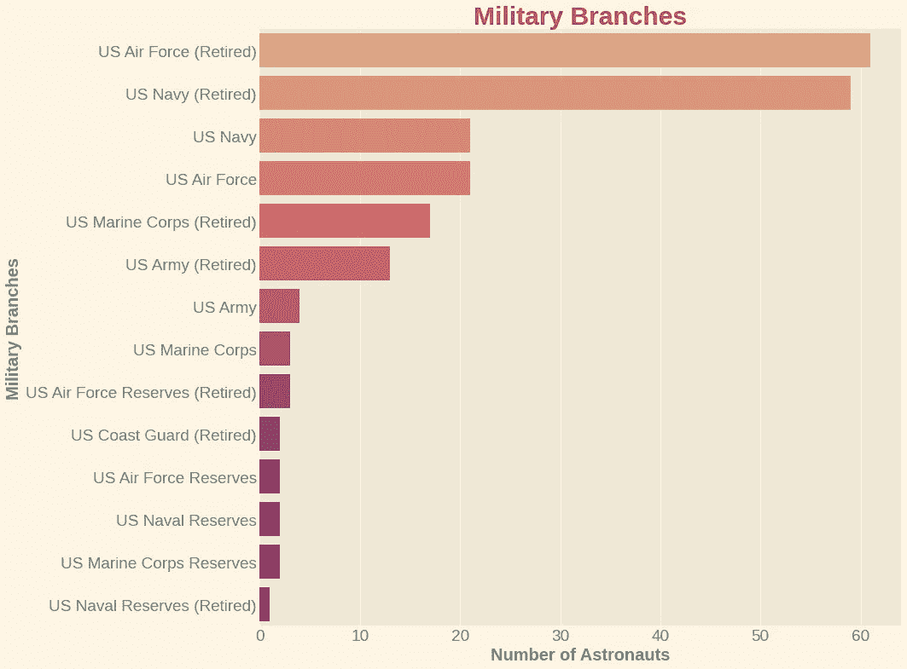

作者图片

似乎美国空军和美国海军生产的宇航员最多。

# 军衔？

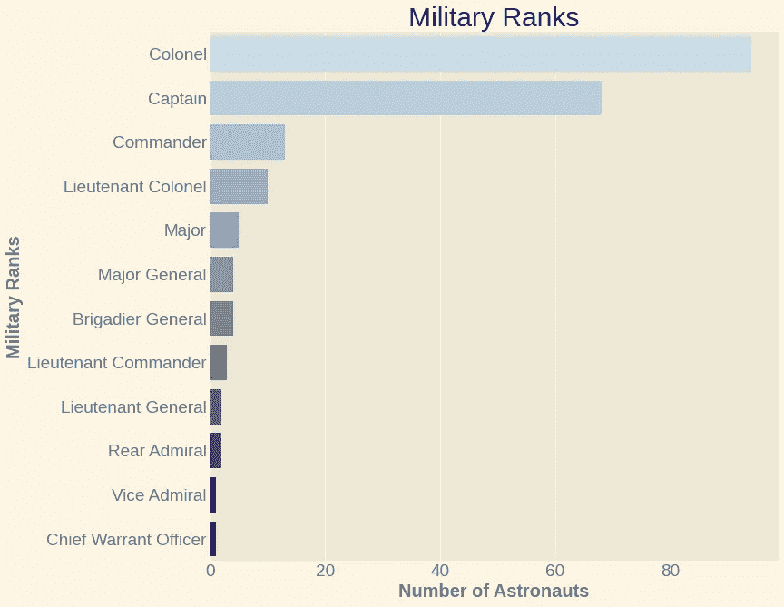

作者图片

他们中的许多人过去/现在都是军队中的高级成员。

# 五次或更多次太空飞行的宇航员。

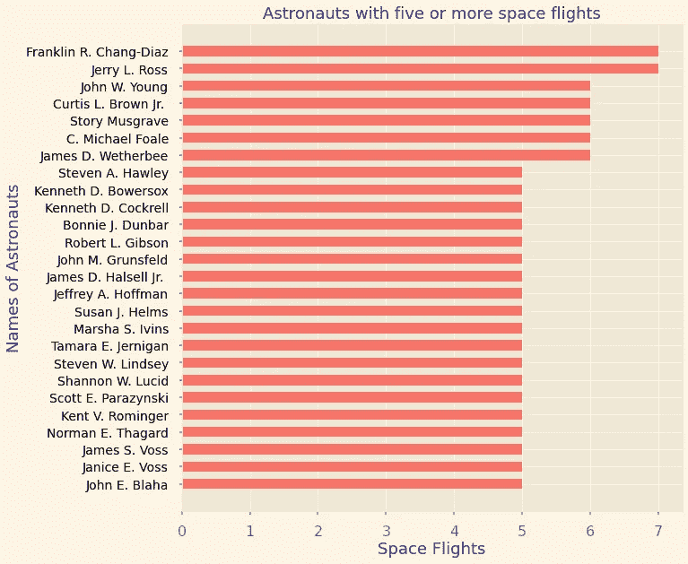

作者图片

[富兰克林·r·张-迪亚兹](https://www.nasa.gov/sites/default/files/atoms/files/chang-diaz_franklin_0.pdf) & [杰里·l·罗斯](https://www.nasa.gov/sites/default/files/atoms/files/ross_jerry.pdf)并列第一。

# 太空飞行时间最多的前 20 名宇航员。

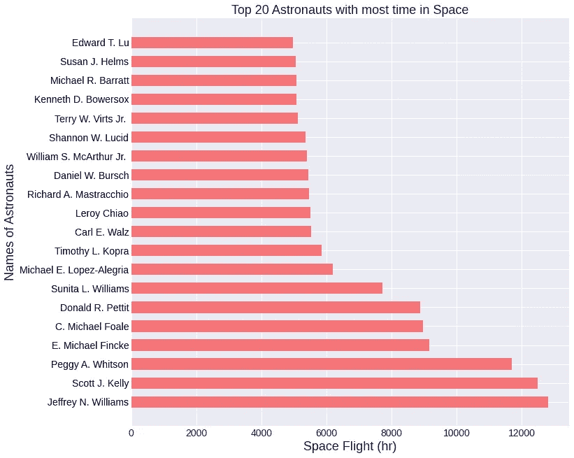

作者图片

[杰弗里·n·威廉姆斯](https://www.nasa.gov/astronauts/biographies/jeffrey-n-williams)赢得最多太空飞行小时。

# 最后，哪个任务是最致命的？

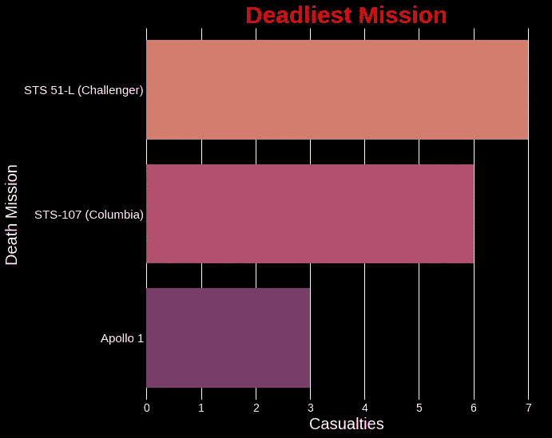

作者图片

1986 年 1 月 28 日，STS-51L 上的挑战者号及其七名宇航员失踪。他们的名字分别是[格雷戈里·b·贾维斯](https://www.nasa.gov/sites/default/files/atoms/files/jarvis.pdf)，[s·克丽斯塔·麦考利夫](https://www.nasa.gov/sites/default/files/atoms/files/mcauliffe.pdf)，[罗纳德·e·麦克奈尔](https://www.nasa.gov/sites/default/files/atoms/files/mcnair_ronald.pdf)，[埃里森·s·奥尼祖卡](https://www.nasa.gov/sites/default/files/atoms/files/onizuka_ellison.pdf)，[朱迪思·a·雷斯尼克](https://www.nasa.gov/sites/default/files/atoms/files/resnik_judith.pdf)，[弗朗西斯·r·斯科比](https://www.nasa.gov/sites/default/files/atoms/files/scobee_francis.pdf)，[迈克尔·j·史密斯](https://www.nasa.gov/sites/default/files/atoms/files/smith_michael.pdf)。愿所有在任务中丧生的宇航员安息。

# 总之，

根据我的发现，如果你正在考虑成为一名宇航员，这可能会增加你的机会，加入军队并真正将自己融入高等教育是明智的。虽然工程、数学和科学主要是在宇航员中发现的，但我相信 NASA 可以找到许多对他们的任务有用的不同领域。

这个数据集来源于[Kaggle.com](https://www.kaggle.com/nasa/astronaut-yearbook)的[美国宇航局宇航员年鉴](https://www.kaggle.com/)。