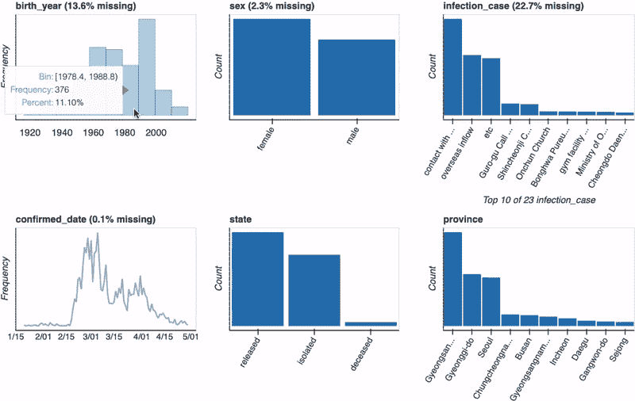
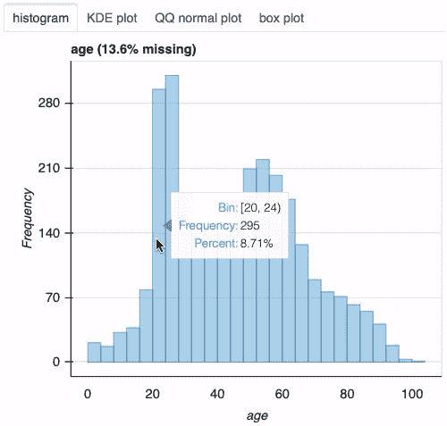
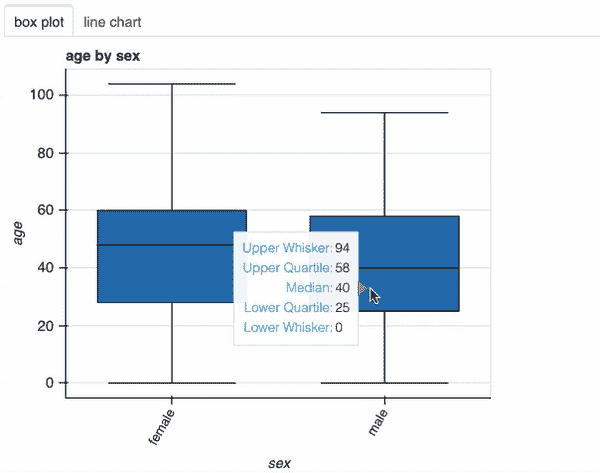
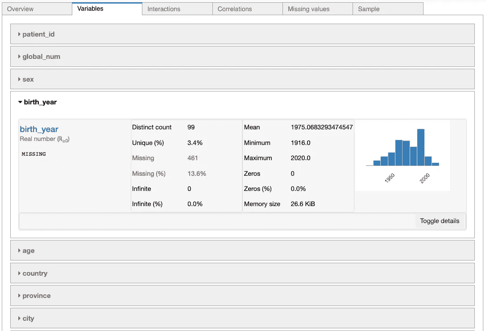
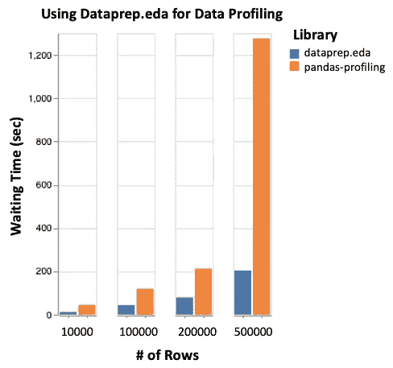
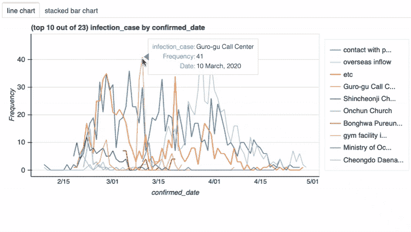

# 探索性数据分析:DataPrep.eda 与 Pandas-Profiling

> 原文：<https://towardsdatascience.com/exploratory-data-analysis-dataprep-eda-vs-pandas-profiling-7137683fe47f?source=collection_archive---------14----------------------->

## 使用正确的工具进行探索性数据分析(EDA)


探索性数据分析(EDA)是每个数据科学项目的重要组成部分。EDA 的目的是实现对数据的理解，并获得关于数据所代表的现象的见解。

[Pandas-profiling](https://github.com/pandas-profiling/pandas-profiling) (2016)被誉为进行 EDA 的典范工具[1，2，3]。然而，pandas-profiling 的一个显著缺点是它给出了数据集的轮廓！EDA 是一个 ***迭代*** 过程，数据科学家将在其中质疑、理解、处理、转换数据，并重复[4、5、6]。pandas-profiling 的僵化结构与当前的 EDA 最佳实践相悖。


[DataPrep.eda](https://sfu-db.github.io/dataprep/eda/introduction.html) (2020)是由 [SFU 的数据科学研究小组](https://data.cs.sfu.ca/index.html)制作的用于做 eda 的 Python 库。DataPrep.eda 支持迭代和以任务为中心的分析——这是 eda 应该做的。(关于 DataPrep.eda 的全面介绍，请参见本文

## 在这篇文章中，我们将分析 DataPrep.eda 比 pandas-profiling 更适合做 eda 的四个原因:

1.  [更好的 API 设计](#b976)
2.  [快 100 倍](#630b)
3.  [智能可视化](#ad58)
4.  [处理大数据](#bd13)

> “‘探索性数据分析’是一种态度，一种灵活的状态，一种寻找我们认为不存在的东西以及我们认为存在的东西的意愿。”
> 
> —《探索性数据分析》的作者约翰·图基

# 1.更好的 API 设计

我们将使用 DataPrep.eda 中的`plot()`函数。为了理解如何使用该函数有效地执行 eda，下面给出了数据科学家意图的函数调用的语法:

*   `plot(df)`:“我想要数据集的概览”
*   `plot(df, “col_1”)`:“我想了解栏目`col_1`”
*   `plot(df, “col_1”, “col_2”)`:“我想了解`col_1`和`col_2`列的关系。”

为了了解这一点，我们将使用一个包含南韩新冠肺炎患者记录的数据集[。让我们从数据集的概述开始:](https://www.kaggle.com/kimjihoo/coronavirusdataset)

```
from dataprep.eda import plot
import pandas as pddf = pd.read_csv("PatientInfo.csv")
df["confirmed_date"] = pd.to_datetime(df["confirmed_date"])
plot(df)
```



每列的频率分布

请注意列`birth_year`似乎具有双峰分布，让我们了解一下该列的更多信息:

```
# transform birth_year to age in 2020 for simplicity
df["age"] = 2020 - df["birth_year"]
plot(df, "age", bins=26)
```



以多种方式绘制的一列分布图

使用工具提示，我们可以检查模式的边界，并使用各种图来全面了解这种分布。

接下来，让我们调查一下新冠肺炎男性和女性的年龄分布。为此，我们只需将列`sex`添加到前面的函数调用中:

```
plot(df, "age", "sex", bins=26)
```



按性别比较年龄分布的图表

我们看到在感染新冠肺炎病毒的男性和女性中，年龄分布有很大的差异——所有的差异都来自一行简单的代码！

这说明了 EDA 应该如何进行——提问、想象、理解、重复。用不到 0.5 秒的时间**完成上述每个命令，DataPrep.eda 是一个高效的 eda 工具。**

## pandas-profiling 能支持这个简单的 EDA 任务吗？

我们运行以下代码，其中 pandas-profiling **花费了 50 秒**来生成报告:

```
from pandas_profiling import ProfileReport
ProfileReport(df).to_widgets()
```

为了分析单变量分布，pandas-profiling 具有以下输出:



熊猫 Jupyter 笔记本中的剖析 API

用户需要切换每一列来查看它的信息。虽然我们可以发现`birth_year`的双峰分布，但是 pandas-profilin *g* 不支持对这一见解的进一步研究，也不支持分析`age`和`sex`之间的关系。

对于这个简单的 EDA 场景，DataPrep.eda 能够发现重要的见解，但是 pandas-profiling 是不够的。

## 交互式功能—工具提示

用户与数据的交互对于有效理解数据是必不可少的[7]。DataPrep.eda 使用交互式可视化库 [Bokeh](https://docs.bokeh.org/en/latest/index.html) 创建所有图，并包含工具提示，可准确读取可视化的每个组件。然而，熊猫烧香不支持工具提示。

# 2.速度快 100 倍

## DataPrep.eda 比 pandas 快 100 倍——针对 eda 的分析

回想一下，在第 1 部分的[中，完成每项任务需要不到 0.5 秒的时间，而 pandas-profiling 需要 50 多秒才能生成一份报告。](#b976)

DataPrep.eda 比 pandas 更快，原因有二:

1.  DataPrep.eda 使用 [Dask](https://dask.org/) ，一个并行计算库，用于所有的数据处理。然而，熊猫简介使用了[熊猫](https://pandas.pydata.org/)。
2.  DataPrep.eda 通过创建与当前 eda 任务相关的可视化来避免不必要的计算，而 pandas-profiling 只分析整个数据集。

## DataPrep.eda 比 pandas 快 5 倍以上——即使对于数据分析也是如此

DataPrep.eda 可用于生成 pandas-profiling 报告的组件，从而实现直接的性能比较。下图显示了针对 DataPrep.eda 的三个组件运行 pandas-profiling 的`ProfileReport`的结果:单变量分析(`plot(df)`)、相关矩阵(`plot_correlation(df)`)和缺失值图(`plot_missing(df)`)。



DataPrep.eda 与 pandas-profiling 的等待时间(使用[汽车数据集](https://archive.ics.uci.edu/ml/datasets/Automobile)，通过复制放大)

使用 Dask 代替 Pandas 是 DataPrep.eda 比 pandas-profiling 更快的主要原因。影响性能的更具体的因素是

1.  DataPrep.eda 并行处理单变量分析，而 pandas-profiling 顺序计算单变量统计。
2.  使用 Dask 的 DataPrep.eda 支持逐块计算，而 Pandas-profiling 在整个数据集上执行计算(对于大型数据集很重要)。

# 3.智能可视化

DataPrep.eda 的一些智能特性包括

*   选择正确的图来可视化每个 EDA 任务的数据；
*   列类型推断(数字、分类和日期时间)；
*   为每个图找到合适的时间单位(用户也可以指定)；
*   输出具有最高计数的分类值，以便视觉清晰(用户也可以指定)。

为了看到这些功能的作用，让我们理解人们是如何随着时间的推移收缩新冠肺炎的，即列`confirmed_date`和`infection_case`之间的关系。我们跑

```
plot(df, "confirmed_date", "infection_case")
```



描绘日期时间和分类列之间关系的图

我们可以很容易地看到哪些收缩方法是重要的，在哪些时期！

## 我们可以用熊猫轮廓来完成这项任务吗？

不要！Pandas-profiling 只支持相关矩阵形式的交互(也受 DataPrep.eda 支持)和用于两个连续变量的双变量分析的热图。在数据集分析框架中，有效的双变量分析代价太高，因为必须对每一对列进行计算，即使用户可能只对一小部分关系感兴趣。

# 4.处理大量数据

使用 Dask 的 DataPrep.eda 适用于大于内存的数据集。Dask 支持核外并行处理，因此可以高效地评估大型数据集上的计算。

使用 Pandas 的 Pandas-profiling 只有用于内存分析的数据结构；在大型数据集上，pandas-profiling 的性能会显著下降。

# 结论

探索性数据分析是一个迭代循环，其步骤包括

1.  质疑数据
2.  通过处理和可视化数据来回答问题
3.  在获得新的理解后提炼之前的问题，或者提出新的问题

没有适合全面 EDA 的通用数据配置文件。

与 pandas-profiling 相比，DataPrep.eda 是更好的 eda 工具，原因有四:

1.  **更好的 API 设计**
    DataPrep.eda 的 API 是为 eda 设计的，而不是为数据剖析设计的
2.  **快 100 倍**
    DataPrep.eda 并行执行计算
3.  **智能可视化**
    DataPrep.eda 将自动选择合适的图来可视化数据
4.  **处理大数据**
    DataPrep.eda 支持核外处理

是时候从生成数据概要文件开始，以 DataPrep.eda 的方式执行 EDA 了。

*一个笔记本的代码从这篇文章中可以找到* [*这里*](https://github.com/sfu-db/dataprep/blob/develop/examples/EDA_COVID19_SouthKorea.ipynb) *。要安装 DataPrep.eda，并了解有关参与该项目的信息，请访问* [*此处*](https://github.com/sfu-db/dataprep#dataprep) *。一个 DataPrep.eda 教程视频可以在* [*这里*](https://www.youtube.com/watch?v=0UxY17ps8qs) *。别忘了给 GitHub 上的* [*项目*](https://github.com/sfu-db/dataprep/stargazers) *上星★。*

# 参考

[1] M. Deep，[快速探索性数据分析:熊猫简介](https://medium.com/analytics-vidhya/quick-exploratory-data-analysis-pandas-profiling-421cd3ec5a50) (2020)，中等

[2] L. Frei，[使用 Pandas-Profiling](/speed-up-your-exploratory-data-analysis-with-pandas-profiling-88b33dc53625) (2019)加速您的探索性数据分析，走向数据科学

[3] R. Rei， [EDA 使用 Panda 的剖析](/eda-using-pandas-profiling-3291d6e856bb) (2020)，走向数据科学

[4] D. Bourke，[探索性数据分析的温和介绍](/a-gentle-introduction-to-exploratory-data-analysis-f11d843b8184) (2019)，走向数据科学

[5] J. Wei，[探索性数据分析:结构化数据实用指南和模板](/exploratory-data-analysis-eda-a-practical-guide-and-template-for-structured-data-abfbf3ee3bd9) (2019)，走向数据科学

[6] G. Grolemund 和 H. Wickham 著，[R for Data Science](https://r4ds.had.co.nz/exploratory-data-analysis.html)*(2016 年 12 月)，在线图书*

*[7] W. Koehrsen，[Python 中数据可视化的下一个级别](/the-next-level-of-data-visualization-in-python-dd6e99039d5e) (2019)，走向数据科学*