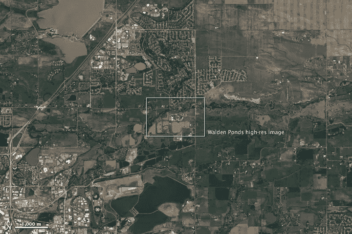
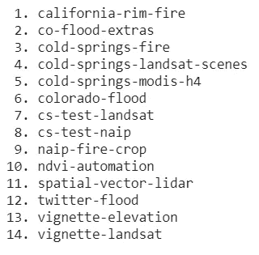
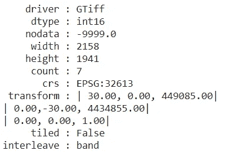
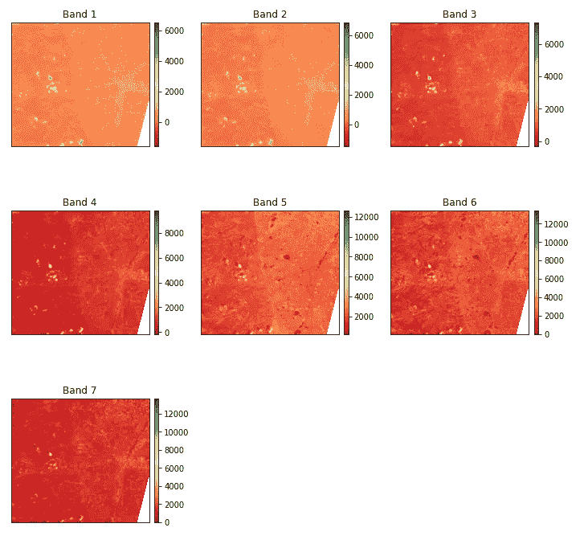
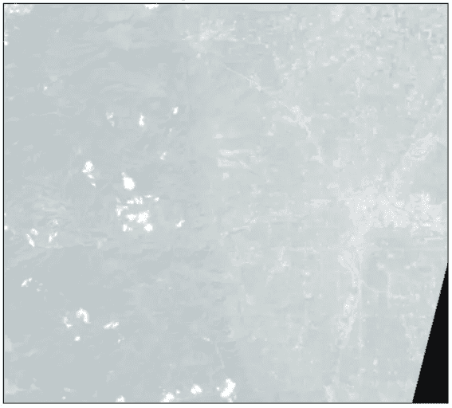
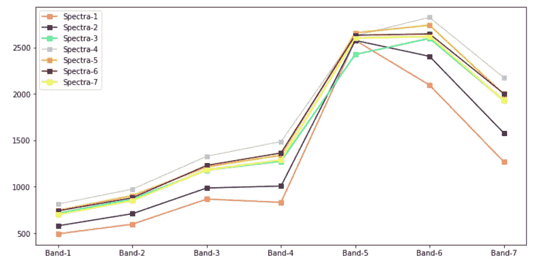
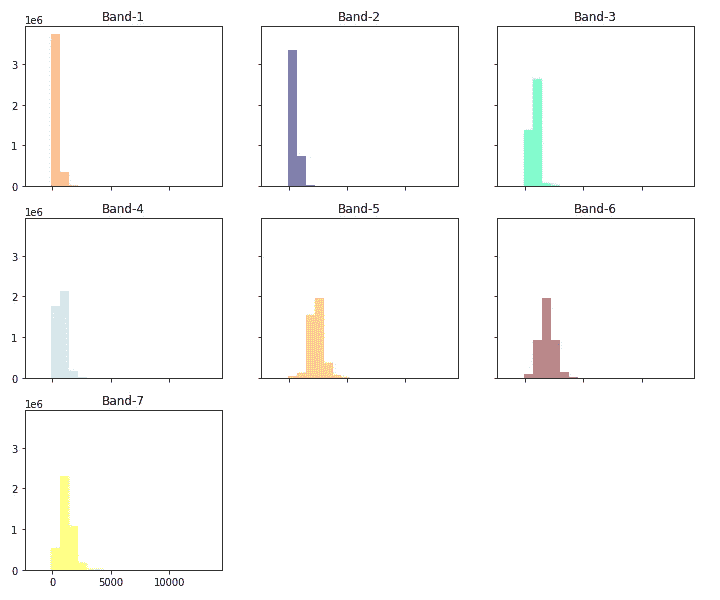
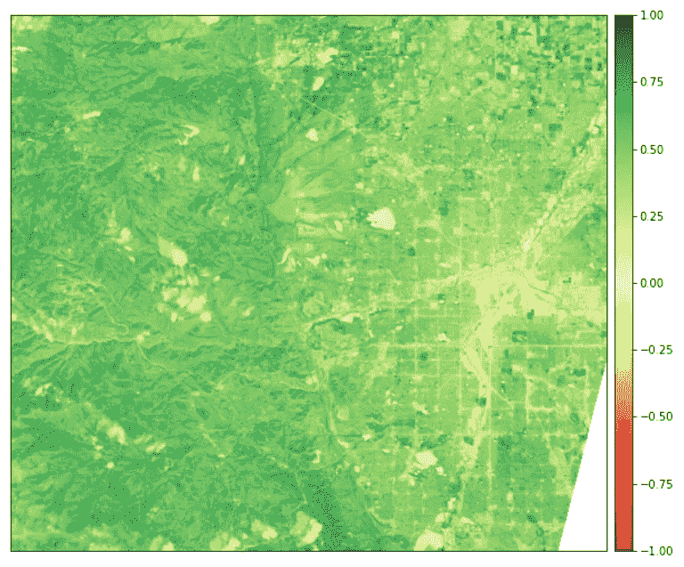
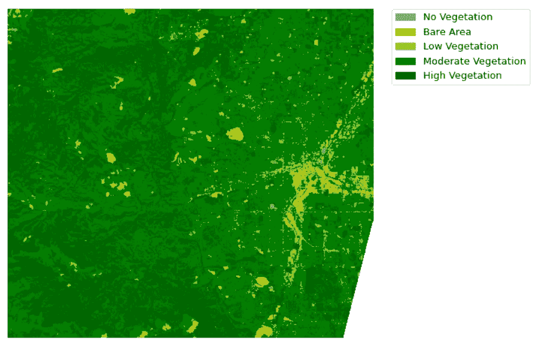

# 使用 EarthPy 对卫星图像进行探索性数据分析

> 原文：<https://towardsdatascience.com/exploratory-data-analysis-eda-on-satellite-imagery-using-earthpy-c0e186fe4293?source=collection_archive---------16----------------------->

## 中间导轨

## 在本文中，我们将使用 EarthPy 来处理卫星图像，并有效地进行探索性数据分析(EDA)

杰西·艾伦和罗伯特·西蒙利用美国地质调查局[地球探测器的数据拍摄的陆地卫星图像。](http://earthexplorer.usgs.gov/)

# 目录

*   **卫星图像介绍**
*   **安装**
*   **如何下载卫星图片**
*   **卫星图像上的探索性数据分析(EDA)**
*   **最终想法**
*   **参考文献**

让我们开始吧，✨

# 卫星图像介绍

卫星图像有着广泛的应用，它融入了人类生活的方方面面。特别是*遥感*经过多年的发展，已经解决了不同领域的很多问题。在*遥感*中，高光谱遥感器以其高光谱分辨率被广泛用于监测地球表面。

**高光谱图像(HSI)** 数据通常包含同一空间区域内的数百个光谱带，这些光谱带为识别各种材料提供了有价值的信息。在 HSI 中，每个**像素**可以被视为一个高维向量，其条目对应于从可见光到红外的光谱反射率。

遥感的一些最佳应用是矿物勘探、国防研究、生物化学组成、森林健康状况、农业等。使用下面的研究论文可以更直观地了解高光谱遥感的应用。

 [## 超光谱遥感应用简介

### 植被指数叶面积指数高光谱数据悬浮泥沙含量土地类这些…

link.springer.com](https://link.springer.com/chapter/10.1007/978-3-662-47456-3_9) 

使用下面的文章获得使用 python 进行高光谱影像分析的实践经验。

 [## 超光谱图像分析—入门

### 使用 Python 进行高光谱图像分析的演练。

towardsdatascience.com](/hyperspectral-image-analysis-getting-started-74758c12f2e9) 

# 装置

让我们看看 *EarthPy* ，它是一个开源 python 包，使用开源工具可以更容易地绘制和处理空间栅格和矢量数据。Earthpy 依赖于 geopandas，后者侧重于矢量数据，而 rasterio 则有助于栅格数据文件的输入和输出。它还需要 matplotlib 进行绘图操作。使用以下命令安装 *EarthPy。*

# 如何下载卫星图像

EarthpPy 包中有 14 个可用的数据集，让我们看看可供下载的数据集。

数据集-按作者分类的图像

让我们看看如何下载可用的数据集。“get_data”方法用于使用数据集的名称下载数据。

输出将是:

图片 bt 作者

# 卫星图像上的 EDA

在本文中，我们使用了' *vignette Landsat'* 数据集。该数据集包含 2017 年 2 月 21 日的 Landsat 8 数据，用于科罗拉多州尼德兰附近冷泉火边界周围的区域。它还包含 GeoMAC 提供的冷泉火边界。Landsat 波段已被裁剪为覆盖冷泉火边界，并且不包括原始图像东南边缘的数据值以及云层。

让我们来看看如何读取数据集:

使用 *EarthPy 的*空间*模块中的“*堆叠*”方法选择并堆叠条带。*上面的代码读取数据并打印元数据。输出如下所示。

Landsat8 数据集的元数据-作者提供的图像

数据集的形状为(2158，1941)，有 7 个波段，包含 41，88，678 个像素。

## 绘图区带

正如我们所讨论的，Landsat8 数据集有 7 个波段。让我们使用 earthpy 包中的内置方法' *plot_bands* '来绘制波段。plot_bands 方法采用带和图的堆栈以及自定义标题，这可以通过使用`title=`参数将每个图像的唯一标题作为标题列表传递来完成。

让我们看看绘制 Landsat8 数据集波段的代码。

结果图如下所示:

landsat8 数据集中所有波段的图-作者提供的图像

## RGB 合成图像

这些超光谱图像有多个波段，包含从可见光到红外的数据。所以对人类来说很难将数据可视化。因此，创建 RGB 合成图像可以更容易有效地理解数据。为了绘制 RGB 合成影像，您将绘制红色、绿色和蓝色波段，分别是我们根据 Landsat8 数据创建的影像堆栈中的波段 4、3 和 2。Python 使用从零开始的索引系统，所以你需要从每个索引中减去值 1。因此，红色波段的指数为 3，绿色为 2，蓝色为 1。让我们看看绘制 RGB 合成图像的代码。

生成的 RGB 合成图像如下所示。

作者图片

## 拉伸合成图像

如果像素亮度值偏向零值，我们创建的合成图像有时会很暗。这种类型的问题可以通过拉伸图像中的像素亮度值来解决，使用自变量`stretch=True`将这些值扩展到潜在值的整个 0-255 范围，以增加图像的视觉对比度。此外，`str_clip`参数允许您指定想要剪掉多少数据尾部。数字越大，数据将被拉伸或变亮的越多。

让我们看看如何起诉 earthpy。

应用*拉伸*后的 RGB 合成图像如下所示:

应用 Strech 后的 Landsat8 数据集 RGB 合成图像-作者提供的图像

## 绘制光谱

让我们看看如何绘制光谱，这有助于我们理解像素的性质。以下代码用于绘制 Landsast8 数据集第一行的 7 个光谱。

输出如下所示:

光谱图—图片由作者提供

## 直方图

可视化高光谱图像数据集的波段有助于我们理解波段值的分布。“eathpy.plot”中的`hist`方法通过为我们之前创建的数据集/堆栈的波段绘制直方图来完成工作。我们还可以修改单个直方图的*列大小*，标题，*颜色*。让我们看看绘制直方图的代码。

产生的图是

波段直方图-按作者分类的图像

## 归一化差异植被指数(NDVI)

为了确定一块土地上的绿色密度，研究人员必须观察植物反射的可见光(VIS)和近红外(NIR)阳光的不同颜色(波长)。归一化差异植被指数(NDVI)通过测量植被强烈反射的近红外和植被吸收的红光之间的差异来量化植被。NDVI 的范围总是从-1 到+1。

NDVI =(近红外-可见光)/(近红外+可见光)

例如，当你有负值时，很可能是水。另一方面，如果 NDVI 值接近+1，则很有可能是浓密的绿叶。但是当 NDVI 接近零度时，就没有绿叶，甚至可能成为城市化地区。

以上代码用于计算归一化差异植被指数(NDVI)并显示生成的图像。

NDVI 陆地卫星 8 号—作者提供的图像

## NDVI 的分类

基于高光谱图像数据，归一化差异植被指数(NDVI)结果被分类为有用的类别。0 以下的值将一起归类为无植被。将为*裸露区域*和*低*、*中等*和*高*植被区域创建附加类别。让我们看看代码:

上述代码对 NDVI 进行分类，并绘制结果数据。分类后的结果图像如下所示。

归一化差异植被指数(NDVI)类别-图片由作者提供

*不是但不是最不重要的*，我在博客中写的代码可以从下面的 GitHub 链接或使用 google collaboratory 笔记本访问。

 [## syamkakarla 98/超光谱 _ 图像 _ 分析 _ 简化

### permalink dissolve GitHub 是超过 5000 万开发人员的家园，他们一起工作来托管和审查代码，管理…

github.com](https://github.com/syamkakarla98/Hyperspectral_Image_Analysis_Simplified/blob/master/Articles/Exploratory_Data_Analysis%28EDA%29_on_Satellite_Imagery_Using%C2%A0EarthPy.ipynb)  [## 使用 EarthPy 对卫星图像进行探索性数据分析

colab.research.google.com](https://colab.research.google.com/drive/1kpG7Vp_gg5uXUEP0BO3GwN1hMDpPIJKR?usp=sharing) 

# 最后的想法

本文涵盖了使用 *EarthPy* 分析卫星/高光谱图像的不同方法，但还有更多方法，如*降维(DR)* 和*分类*等。使用下面的文章进行详细解释并使用 *python 进行实际操作。*

 [## 利用 Python 实现高光谱图像的降维

### 高光谱图像的降维技术。

towardsdatascience.com](/dimensionality-reduction-in-hyperspectral-images-using-python-611b40b6accc)  [## 超光谱图像分析分类

### 使用 python 对高光谱图像(HSI)进行分类的演练。

towardsdatascience.com](/hyperspectral-image-analysis-classification-c41f69ac447f) 

# 参考

 [## 测量植被(NDVI 和 EVI)

### 为了监测植被的主要波动并了解它们如何影响环境，科学家们使用…

earthobservatory.nasa.gov](https://earthobservatory.nasa.gov/features/MeasuringVegetation/measuring_vegetation_2.php)  [## 地球引擎|地球引擎数据目录中的 Landsat 8 数据集

### 来自 Landsat 8 OLI/TIRS 传感器数据集的大气校正地表反射率可用性:2013 年 4 月…

developers.google.com](https://developers.google.com/earth-engine/datasets/catalog/landsat-8)