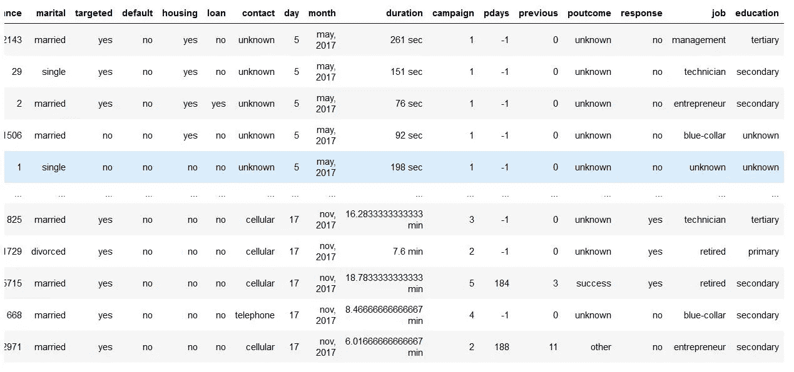

# 探索性数据分析(EDA): Python

> 原文：<https://towardsdatascience.com/exploratory-data-analysis-eda-python-87178e35b14?source=collection_archive---------0----------------------->

## 学习使用 Python 和 Numpy、Matplotlib 和 Pandas 进行探索性数据分析的基础知识。


照片由[UX](https://unsplash.com/@uxindo?utm_source=unsplash&utm_medium=referral&utm_content=creditCopyText)在 [Unsplash](https://unsplash.com/s/photos/analysis?utm_source=unsplash&utm_medium=referral&utm_content=creditCopyText) 上拍摄

## 什么是探索性数据分析(EDA)？

如果我们想用简单的术语解释 EDA，这意味着试图更好地理解给定的数据，以便我们可以从中获得一些意义。

我们可以在 [**维基**](https://en.wikipedia.org/wiki/Exploratory_data_analysis) **中找到更正式的定义。**

> 在统计学中，**探索性数据分析**是一种分析数据集以总结其主要特征的方法，通常采用可视化方法。可以使用或不使用统计模型，但 EDA 主要是为了查看数据可以告诉我们什么，而不仅仅是正式的建模或假设测试任务。

Python 中的 EDA 使用数据可视化来绘制有意义的模式和见解。它还包括通过消除数据中的不规则性来准备用于分析的数据集。

基于 EDA 的结果，公司也做出商业决策，这些决策会在以后产生影响。

*   如果 EDA 没有正确完成，那么它会妨碍机器学习模型构建过程中的进一步步骤。
*   如果做得好，可能会提高我们接下来做的一切事情的功效。

在本文中，我们将了解以下主题:

1.  数据来源
2.  数据清理
3.  单变量分析
4.  双变量分析
5.  多变量分析

## 1.数据来源

数据源是查找数据并将其加载到我们的系统中的过程。概括地说，我们有两种方法可以找到数据。

1.  私人数据
2.  公共数据

**私人数据**

顾名思义，私人数据是由私人机构给出的。它有一些安全和隐私问题。这种类型的数据主要用于组织内部分析。

**公开数据**

每个人都可以获得这种类型的数据。我们可以在政府网站和公共组织等找到这一点。任何人都可以访问这些数据，我们不需要任何特殊的许可或批准。

我们可以从以下网站获取公共数据。

*   [https://data.gov](https://data.gov)
*   [https://data.gov.uk](https://data.gov.uk)
*   [https://data.gov.in](https://data.gov.in)
*   【https://www.kaggle.com/ 
*   [https://archive.ics.uci.edu/ml/index.php](https://archive.ics.uci.edu/ml/index.php)
*   [https://github.com/awesomedata/awesome-public-datasets](https://github.com/awesomedata/awesome-public-datasets)

EDA 的第一步是数据源，我们已经了解了如何访问数据并加载到系统中。现在，下一步是如何清理数据。

## 2.数据清理

完成数据源后，EDA 过程的下一步是**数据清理**。在将数据输入我们的系统后，去除不规则性并清理数据是非常重要的。

不规则性是不同类型的数据。

*   缺少值
*   格式不正确
*   不正确的标题
*   异常/异常值

为了执行数据清理，我们使用一个样本数据集，它可以在 [**这里**](https://github.com/Kaushik-Varma/Marketing_Data_Analysis) 找到。

我们正在使用 **Jupyter 笔记本**进行分析。

首先，让我们导入必要的库并将数据存储在我们的系统中以供分析。

现在，数据集看起来像这样，


营销分析数据集

如果我们观察上面的数据集，前 2 行的列标题有一些差异。正确的数据来自索引号 1。因此，我们必须修复前两行。

这被称为**固定行和列。**让我们忽略前两行，再次加载数据。

现在，数据集看起来像这样，它更有意义。


修复行和列后的数据集

以下是在**固定行和列时要采取的步骤:**

1.  删除数据集中的汇总行和汇总列。
2.  删除每页上的页眉和页脚行。
3.  删除多余的行，如空行、页码等。
4.  如果有助于更好地理解数据，我们可以合并不同的列
5.  同样，我们也可以根据我们的需求或理解，将一个列拆分成多个列。
6.  添加列名，将列名添加到数据集中非常重要。

现在，如果我们观察上面的数据集，`customerid`列对我们的分析不重要，而且`jobedu`列同时包含了`job`和`education`的信息。

因此，我们要做的是，我们将删除`customerid`列，并将`jobedu`列拆分为另外两列`job`和`education`，之后，我们也将删除`jobedu`列。

现在，数据集看起来像这样，



删除`Customerid` 和 jobedu 列，添加 job 和 edu 列

**缺失值**

如果在进行任何统计分析之前数据集中有缺失值，我们需要处理这些缺失值。

缺失值主要有三种类型。

1.  MCAR(完全随机缺失):这些值不依赖于任何其他特征。
2.  MAR(随机缺失):这些值可能依赖于其他一些特征。
3.  MNAR(非随机缺失):这些缺失值有一些缺失的原因。

让我们看看数据集中哪些列缺少值。

```
# Checking the missing values
data.isnull().sum()
```

输出将是，


数据集中的空值

正如我们所看到的，有三列包含缺失值。让我们看看如何处理丢失的值。我们可以通过删除丢失的记录或输入值来处理丢失的值。

**删除丢失的值**

让我们处理`age`列中缺失的值。

现在让我们检查数据集中缺失的值。


处理年龄列后缺少值

让我们对 month 列的缺失值进行估算。

因为 month 列是一个对象类型，所以让我们计算该列的模式，并将这些值归入缺失值。

现在输出是，

```
# Mode of month is
**'may, 2017'**# Null values in month column after imputing with mode
**0**
```

处理**响应**列中的缺失值。因为我们的目标列是 Response 列，如果我们将值归入这个列，就会影响我们的分析。因此，最好从响应列中删除缺失的值。

```
#drop the records with response missing in data.
**data = data[~data.response.isnull()].copy()**# Calculate the missing values in each column of data frame
**data.isnull().sum()**
```

让我们检查数据集中缺失的值是否已被处理，


所有丢失的值都已被处理

我们还可以将缺失值填充为**‘NaN’**，这样在进行任何统计分析时，都不会影响结果。

**处理异常值**

我们已经看到了如何修复缺失值，现在让我们看看如何处理数据集中的异常值。

> **离群值是指远离下一个最近的数据点的值。**

有两种异常值:

1.  **单变量异常值:**单变量异常值是基于一个变量，其值位于期望值范围之外的数据点。
2.  **多元异常值:**在绘制数据时，一个变量的某些值可能不会超出预期范围，但当您绘制其他变量的数据时，这些值可能会远离预期值。


因此，在理解了这些异常值的原因之后，如果更有意义的话，我们可以通过丢弃那些记录或者用值进行估算或者让它们保持原样来处理它们。

**标准化值**

要对一组值执行数据分析，我们必须确保同一列中的值应该在相同的范围内。例如，如果数据包含不同公司汽车的最高速度值，那么整列应该以米/秒或英里/秒为单位。

现在，我们已经清楚了如何获取和清理数据，让我们看看如何分析数据。

## 3.单变量分析

如果我们对数据集中的单个变量/列进行分析，这就是所谓的单变量分析。

**分类无序单变量分析:**

无序变量是没有定义顺序的分类变量。以我们的数据为例，数据集中的**职位**列被分成许多子类别，如技术人员、蓝领、服务、管理等。“**作业**列中的任何值都没有权重或度量。

现在，让我们通过使用图来分析工作类别。由于 Job 是一个类别，我们将绘制条形图。

输出看起来像这样，


通过上面的柱状图，我们可以推断，与其他类别相比，数据集包含更多的蓝领工人。

**分类有序单变量分析:**

有序变量是那些具有自然排序的变量。我们数据集中分类有序变量的一些示例如下:

*   月份:一月，二月，三月……
*   教育:小学、中学……

现在，让我们从数据集中分析教育变量。既然我们已经看到了条形图，让我们看看饼图是什么样子的。

输出将是，


通过以上分析，我们可以推断出，该数据集有大量属于中等教育之后的那一级和下一级小学。此外，其中很小一部分不为人知。

这就是我们分析单变量分类分析的方法。如果列或变量是数值型的，那么我们将通过计算它的平均值、中值、标准差等来进行分析。我们可以通过使用 describe 函数获得这些值。

```
data.salary.describe()
```

输出将是，


## 4.双变量分析

如果我们从数据集中考虑两个变量/列来分析数据，这就是所谓的双变量分析。

**a)数值-数值分析:**

分析数据集中的两个数值变量称为数值-数值分析。我们可以从三个不同的角度来分析。

*   散点图
*   配对图
*   相关矩阵

**散点图**

让我们从我们的数据集中选取三列“余额”、“年龄”和“薪水”，看看我们可以通过绘制`salary` `balance`和`age` `balance`之间的散点图来推断什么

现在，散点图看起来像，


散点图

**配对图**

现在，让我们为我们在绘制散点图时使用的三列绘制成对图。我们将使用 seaborn 库来绘制 Pair 图。

结对图看起来像这样，


年龄、平衡、工资的配对图

**相关矩阵**

因为在散点图和配对图中，我们不能使用两个以上的变量作为 x 轴和 y 轴，所以很难在单个图形中看到三个数值变量之间的关系。在这些情况下，我们将使用相关矩阵。

首先，我们使用年龄、工资和余额创建了一个矩阵。之后，我们使用矩阵的 seaborn 库绘制热图。


**b)数值分类分析**

分析数据集中的一个数值变量和一个分类变量称为数值分类分析。我们主要使用均值图、中值图和箱线图来分析它们。

让我们从数据集中取出`salary`和`response`列。

首先使用`groupby`检查平均值

```
#groupby the response to find the mean of the salary with response no & yes separately.**data.groupby('response')['salary'].mean()**
```

输出将是，


使用平均值的响应和薪金

根据薪水的不同，回答“是”和“否”没有太大区别。

让我们计算一下中位数，

```
#groupby the response to find the median of the salary with response no & yes separately.**data.groupby('response')['salary'].median()**
```

输出将是，


无论是平均值还是中间值，我们都可以说，不管一个人的工资多少，回答“是”和“否”的答案都是一样的。但是，它真的是那样表现的吗，让我们画出它们的方框图，并检查它的表现。

```
#plot the box plot of salary for yes & no responses.**sns.boxplot(data.response, data.salary)
plt.show()**
```

箱形图看起来像这样，


正如我们所看到的，当我们绘制箱线图时，它描绘了一个与平均值和中值非常不同的画面。给予肯定回答的顾客的 IQR 偏高。

这就是我们分析数字分类变量的方法，我们使用均值、中值和箱线图来得出某种结论。

**c)分类—分类分析**

由于我们的目标变量/列是回复率，我们将看到不同的类别如教育、婚姻状况等。，与响应列相关联。因此，我们将把它们转换成“1”和“0”，而不是“是”和“否”，这样我们就可以得到“回应率”。

输出看起来像这样，


让我们来看看婚姻状况中不同类别的回复率是如何变化的。

图表看起来像这样，


通过上图，我们可以推断出，对于数据集中的单一状态成员，正面响应更多。类似地，我们可以绘制贷款对响应率、住房贷款对响应率等图表。

## 5.多变量分析

如果我们从一个数据集中考虑两个以上的变量/列来分析数据，这就是所谓的多元分析。

让我们看看“教育程度”、“婚姻状况”和“回应率”之间的差异。

首先，我们将创建一个包含三列的数据透视表，之后，我们将创建一个热图。

数据透视表和热图如下所示，


根据热图，我们可以推断，受过小学教育的已婚人士不太可能对调查做出积极回应，而受过高等教育的单身人士最有可能对调查做出积极回应。

类似地，我们可以绘制工作对婚姻对反应、教育对收入对反应等图表。

# 结论

这就是我们如何进行探索性数据分析。探索性数据分析(EDA)帮助我们透过数据看问题。我们对数据探索得越多，从中得出的见解就越多。作为一名数据分析师，我们几乎 80%的时间都会花在理解数据和通过 EDA 解决各种业务问题上。

**感谢您阅读**和**快乐编码！！！**

# 在这里查看我以前关于 Python 的文章

*   [**使用 Python 对熊猫数据帧进行索引**](/indexing-in-pandas-dataframe-using-python-63dcc6242323)
*   [**Seaborn: Python**](/seaborn-python-8563c3d0ad41)
*   [**熊猫:蟒蛇**](https://levelup.gitconnected.com/pandas-python-e69f4829fee1)
*   [**Matplotlib:Python**](https://levelup.gitconnected.com/matplotlib-python-ecc7ba303848)
*   [**NumPy: Python**](https://medium.com/coderbyte/numpy-python-f8c8f2bbd13e)
*   [**数据可视化及其重要性:Python**](https://levelup.gitconnected.com/data-visualization-and-its-importance-python-7599c1092a09)
*   [**Python 中的时间复杂度及其重要性**](https://medium.com/swlh/time-complexity-and-its-importance-in-python-2b2ba03c786b)
*   [**Python 中的递归或递归函数**](https://medium.com/python-in-plain-english/python-recursion-or-recursive-function-in-python-5802c74c1844)

# 参考

*   **探索性数据分析:**[https://en.wikipedia.org/wiki/Exploratory_data_analysis](https://en.wikipedia.org/wiki/Exploratory_data_analysis)
*   **Python 探索性数据分析:**[https://www . Data camp . com/community/tutorials/explorative-Data-Analysis-Python](https://www.datacamp.com/community/tutorials/exploratory-data-analysis-python)
*   **利用 Python 进行探索性数据分析:**[https://www . active state . com/blog/explorative-Data-Analysis-using-Python/](https://www.activestate.com/blog/exploratory-data-analysis-using-python/)
*   **单变量和多变量异常值:**[https://www . statistics solutions . com/Univariate-and-multi variable-Outliers/](https://www.statisticssolutions.com/univariate-and-multivariate-outliers/)