# 使用 Pandas 进行探索性数据分析(EDA)可视化

> 原文：<https://towardsdatascience.com/exploratory-data-analysis-eda-visualization-using-pandas-ca5a04271607?source=collection_archive---------1----------------------->

照片由[艾萨克·史密斯](https://unsplash.com/@isaacmsmith?utm_source=unsplash&utm_medium=referral&utm_content=creditCopyText)在 [Unsplash](https://unsplash.com/s/photos/analysis?utm_source=unsplash&utm_medium=referral&utm_content=creditCopyText) 上拍摄

原来你可以直接从你的数据帧中画出许多有用的图，而不需要调用`plt.show()`

Pandas 无疑是用 Python 执行数据分析的最受欢迎的包，这要归功于它丰富直观的功能，允许我们轻松地对数据执行无数次操作。难怪该软件包已经成为许多数据科学家/分析师处理日常任务的不可或缺的工具。

关于探索性数据分析(EDA)，Pandas 通常与另一个绘图包一起使用，如 Matplotlib、Seaborn、Plotly 等。在通过 Pandas 对所有数据进行预处理后，就可以使用手边选择的绘图包对其进行可视化。

但是，如果我告诉你 Pandas 也能够可视化你的数据，这意味着你可以直接从你使用的数据框架中生成 EDA 所需的(大部分)图，那会怎么样呢？不会很整齐吗？

这正是我想在这里与你分享的话题。

**快速总结**

以下是本文所涉及的内容:

1.  熊猫的`plot`方法一瞥
2.  如何使用熊猫的`plot`方法画一些基本的图，包括箱线图、散点图、饼图等等
3.  如何使用 Pandas 绘制相关矩阵(这是由`plot`方法生成的*而不是*，但是它在任何 EDA 中都是必不可少的，所以我也包括它)
4.  使用以下 pandas 功能绘制数据准备，以创建上述第 2 点中的一些图。

*   分组依据聚合(`pandas.DataFrame.groupby()`)
*   分位数切宁滨(`pandas.DataFrame.qcut()`)
*   应用方法转换(`pandas.DataFrame.apply()`)

**数据**

本文中使用的数据是一个电子商务数据集，可通过[这个链接](https://www.kaggle.com/carrie1/ecommerce-data)在 Kaggle 获得。该数据集是一个交易数据，包含 2011 年英国注册的无店铺在线零售的交易。这里要提到的是，数据已经过预处理，为本文的主要目标做好了准备，即可视化数据。

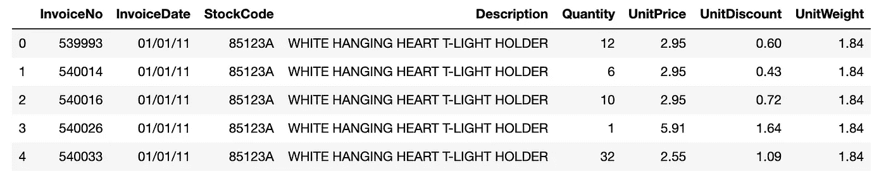

前五行数据

如我们所见，该数据有如下八列:

1.  `InvoiceNo`:发票号(表键)
2.  `InvoiceDate`:发票日期
3.  `StockCode`:物品编码
4.  `Description`:物品描述
5.  `Quantity`:物品售出数量
6.  `UnitPrice`:物品单价(英镑)
7.  `UnitDiscount`:单位商品折扣
8.  `UnitWeight`:物品单位重量(磅)

接下来，我们显示下面数字列的一些统计汇总，这是`data.describe()` 方法的输出。

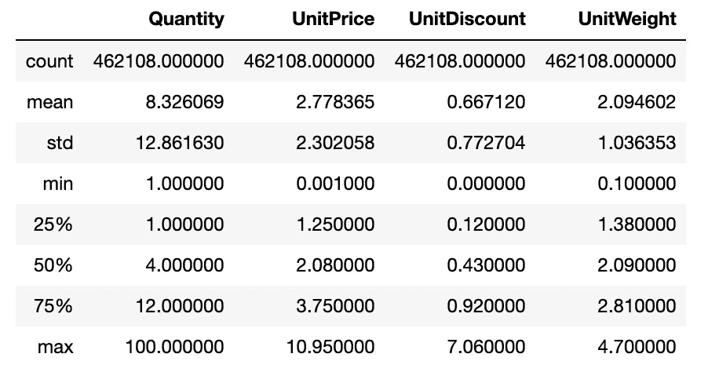

数字列的统计摘要

**熊猫可视化方法一瞥**

Pandas 以`plot`方法的名义提供了可视化其系列和数据帧的功能。该功能是对 **matplotlib** **包的** `plot`方法的简单包装，具有更高级别的实现。通过使用该方法，我们可以直接从我们的数据帧/序列中生成一些有用的(基本)图，而无需调用`plt.show()`，因为我们已经在笔记本的开头导入了包，即`import matplotlib.pyplot as plt`。

从数据帧`df`中提取`*type of plot*`的一般语法如下。

`df.plot.*type of plot*(*relevant-necessary parameters*)`

在下文中，我们将生成一些由 handy 方法支持的图，底线是在我们加载的数据帧`data`上执行 EDA。

**箱线图**

从上面的`data.describe()`生成的统计汇总中，我们知道`Quantity`列的数据范围比其他数值列大得多，所以这里我们只使用下面的一行代码在一个图中绘制`UnitPrice`、`UnitDiscount`和`UnitWeight`三个数值列的箱线图。我们用的方法是`plot.box`。

标准箱线图

如果我们想让盒状图变成水平的，而不是上面的垂直的，该怎么办？此外，我们希望有一个额外的绘图网格来帮助我们更精确地看到绘图的重要部分，如中间值、异常值边界等。没问题，我们可以通过设置参数`vert = False`和`grid = True`来实现。

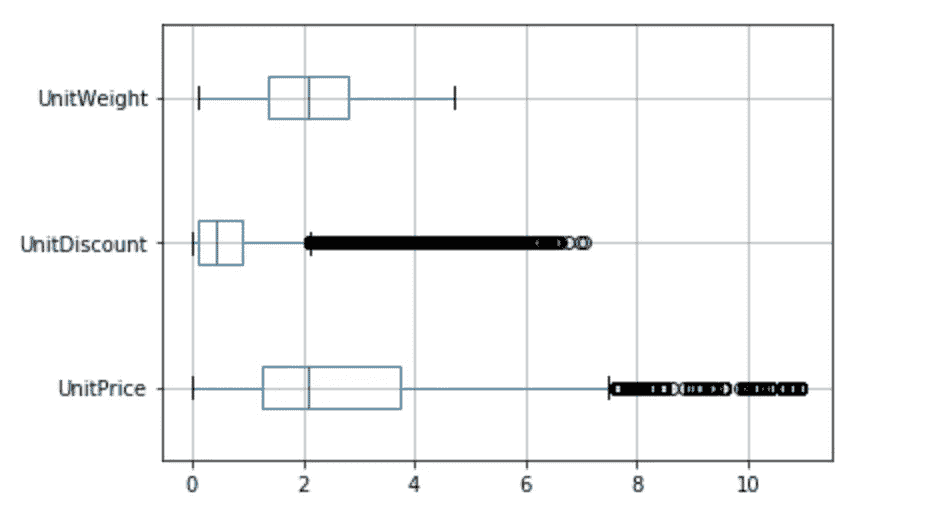

带网格的水平箱线图

根据上面的箱线图，我们知道虽然`UnitWeight`列不包含任何异常值，但其他两列确实包含许多大的异常值，对于`UnitPrice`和`UnitDiscount`，阈值分别为 7.5 和 2.1 左右。

**直方图**

我们为`Quantity`列绘制一个直方图。通过`plot.hist`，代码很简单，有一个必需的参数来表示我们想要在直方图中包含的仓的数量(这里我们选择 20)。

数量列的直方图

注意，我们使用了自己命名的参数(`title`)在直方图的顶部生成标题。

**相关矩阵**

正如本文开头的总结部分所述，这个不是由`plot`方法生成的。相反，它是由数据帧的`corr`对象的子功能`style.background_gradient`产生的。

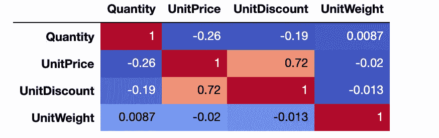

数字列的相关矩阵

在上面的代码中，我们设置了发散颜色贴图主题参数`cmap=’coolwarm’`(其他好的替代方案包括`‘RdBu_r’`和`‘BrBG’`)。去给他们一个尝试吧！

**散点图**

根据上面的相关矩阵，我们知道`UnitPrice`和`UnitDiscount`的相关性相当强(0.72)。因此，我们现在使用`plot.scatter`将它们绘制成散点图。注意，我们使用自己命名的参数`color`将颜色设置为`sandybrown`。

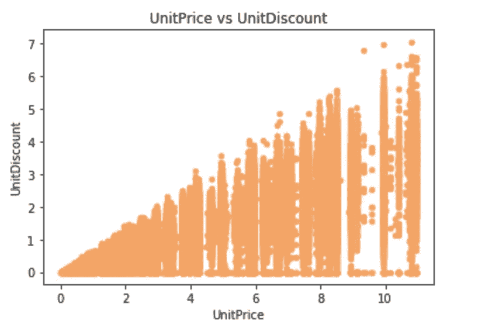

单价和`UnitDiscount`之间的散点图

我们可以清楚地看到正相关。此外，`UnitDiscount`对于每个`UnitPrice`是不同的。为了说服自己`UnitDiscount`永远不会超过`UnitPrice`，我们在散点图的顶部叠加了一个 y = x(即，单价=折扣)的线图。为此，我们利用`ax`参数。

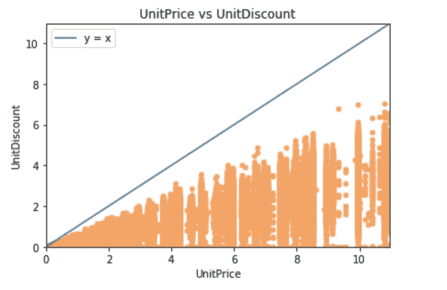

带附加线图的散点图

**条形图**

在下一张图中，我们将确定数据中销量最高的 10 种产品。因为我们还想知道产品描述，而不仅仅是产品代码，所以我们需要为产品描述和产品代码创建一个参考表。

为了获得整个数据中每种产品的销售总量，我们需要执行**分组聚合。**也就是说，我们按照产品代码(`StockCode`)对数据进行分组，然后对每组的`Quantity`求和。在熊猫身上，我们可以用`groupby`方法完成这类任务。一般形式如下。

`df.groupby([*columns to be grouping base*]).*aggregating function*()`

在我们的情况下，我们有

请注意，在上面的最后一行代码中，我们已经将聚合数量与其对应的产品描述进行了合并。最终结果(前五行)是如下所示的数据帧。

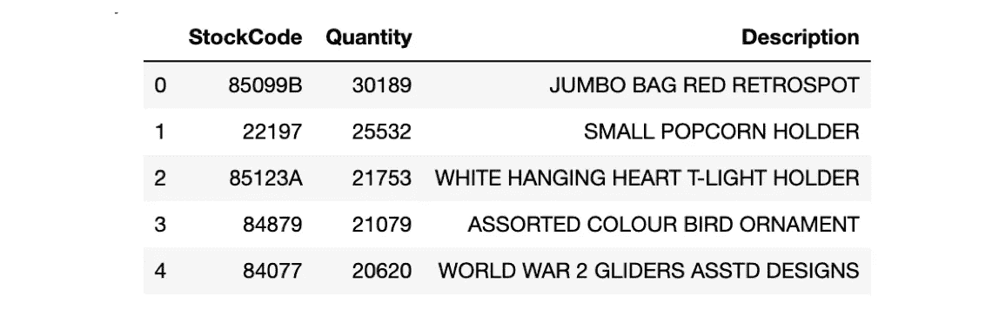

df_quant_sold.head()

现在我们已经准备好绘制条形图了！使用的方法是`plot.bar`，要设置的参数是`x`和`y`。

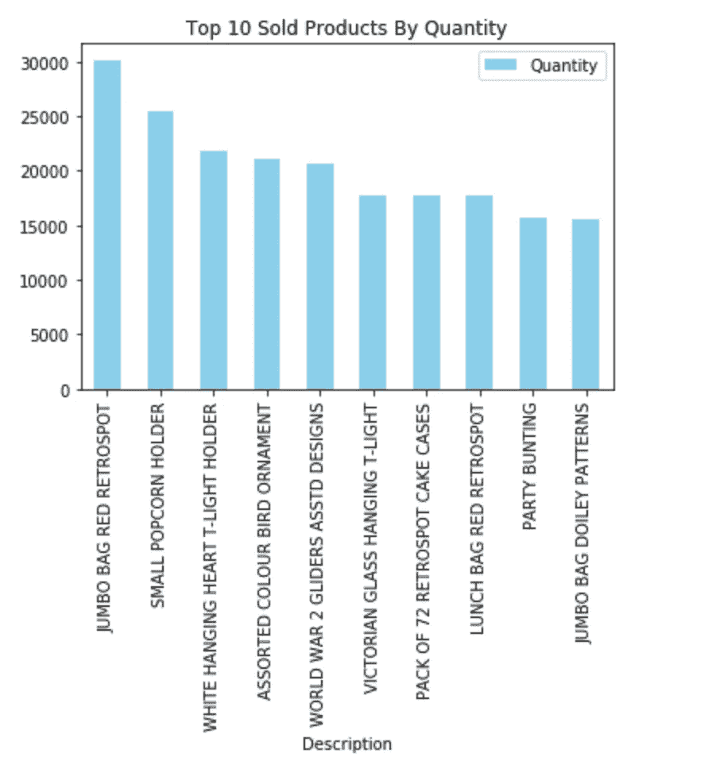

十大最畅销产品

**线条图**

在这里，我们想知道交易总收入的月度分布情况。为此，我们首先必须构建一个包含两列的 data frame:`InvoiceMonth`和`TransactionRevenue`。与生成上面的条形图类似，我们执行 sum 聚合，按`InvoiceMonth`列分组。

df _ 月度 _ 收入()

此外，我们为总折扣创建了一个类似的数据框架，这样我们就可以理解这两个变量在每月期间的进展情况。

我们通过在`plot.line`中指定参数`x`和`y` 绘制两个线图，在一个图中使用之前的`ax`参数。

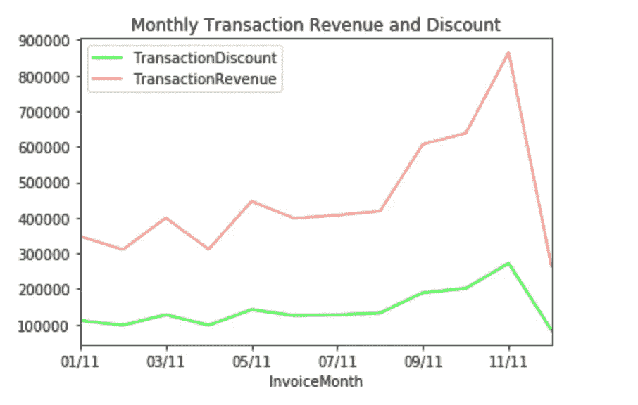

月收入和折扣的折线图

我们看到，直到 11 月，这两个变量的趋势都是积极的。这种趋势在 11 月达到顶峰，收入和折扣的价值分别接近 90 万英镑和 25 万英镑。然而，在 12 月的最后一个月突然下降。

**饼状图**

我们可以深入研究的另一个观点是季度对全年收入的贡献。饼图非常适合这个用例。为了实现这一点，我们需要在创建上面的折线图时对交易收入(`df_monthly_revenue`)再执行一步分组聚合。这是三个月(一个季度)每月交易总额。

df _ 季度 _ 收入

从 plot 方法制作饼图相当简单。我们只需要将参数`y`设置为我们想要在`plot.pie`中绘制其值的列。

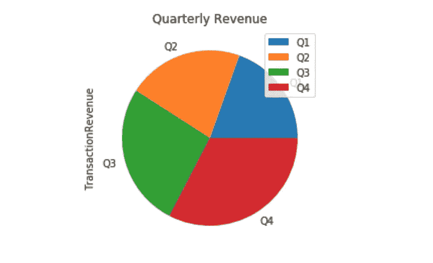

季度收入的标准饼图

我们发现传奇挡住了 Q1 的标签，这并不好。保持冷静，我们可以通过调整`startangle`参数(旋转饼图)来解决。此外，我们还可以利用`autopct`参数，通过提供每个饼图部分的百分比来增强细节。注意，我们也通过设置`figsize` 参数来放大下图中的图形尺寸。

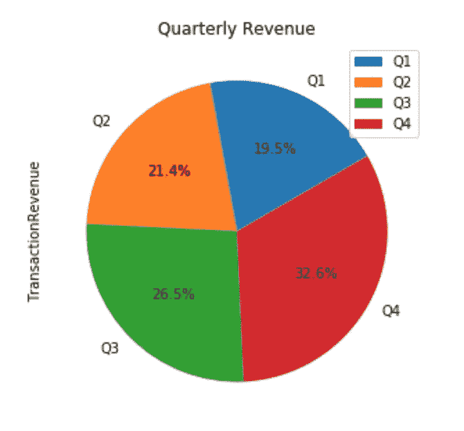

调整了饼图。好多了！

我们看到，尽管 12 月份大幅下滑，但第四季度仍贡献了 2011 年全年近三分之一的收入。

**堆积条形图**

这个是我最喜欢的。我们将创建一个堆积条形图，以分析不同时段的交易收入金额的构成，形成每个季度的交易总数。通过拥有一个，我们可能能够了解低收入桶的交易数量是否随着时间的推移而增长，因此我们可以相应地调整我们的策略(例如，我们可能希望重新标记网站，使其看起来更具排他性，以瞄准更多优质买家)。

为了画出我们的，我们必须做几个准备步骤。第一个是将`TransactionRevenue`列成 bucketize(宁滨)列。我们将创建三个存储桶:低(低于 25 个百分点)、中(介于 25 和 75 个百分点之间)和高(高于 75 个百分点)。我发现`pd.qcut`是完成这项任务的便利工具。

接下来，我们创建三个(代表存储桶的数量)counter(二进制值)列，这将帮助我们执行下一步的分组聚合，以计算每个存储桶中的事务数量。

我们通过使用`apply`方法来做到这一点，这基本上是一种允许我们传递函数并**将**应用于熊猫系列的每个值的功能。这里，我们想要应用的函数是一个简单的条件(if-else)赋值函数。

最后一个准备步骤包括分组聚合，随后是值规范化(使每个条形总和达到 100%)，如下所示。

下面是我们准备绘制的数据帧的最终结果。

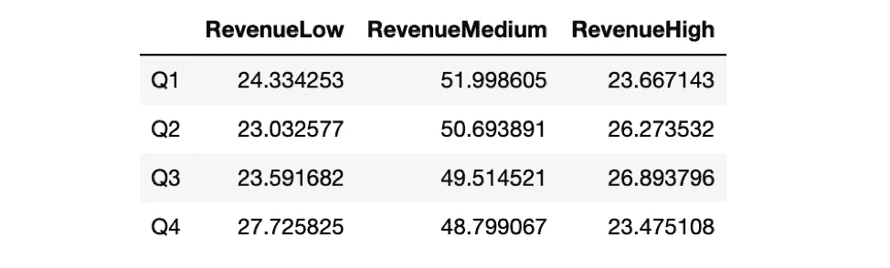

df _ percent(df _ quarterly _ revenue _ bucket 的规范化值)

最后，生成图的代码如下。通过在`plot.bar`内设置参数`stacked = True`实现条形图的堆叠形式。

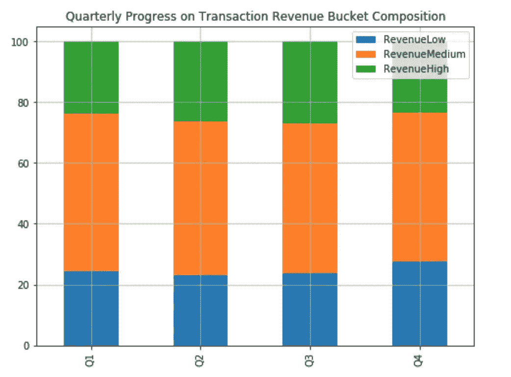

每个季度的交易时段细分

除其他外，上图告诉我们，高价值交易的比例趋向于积极的趋势(即，在各个季度中增加)，除了最后一个第四季度，每个季度中高价值交易的比例都有所增加。

**结束语**

在这篇文章中，我们已经能够使用 Pandas `plot`方法直接从我们的数据框架中生成各种各样的图，这些图对于进行典型的探索性数据分析(EDA)肯定是有用的。关于这一点，我需要说明的是，我们在这里生成的图的种类*并不详尽*代表了该方法支持的所有图(关于更完整的特性，请参考该方法的官方文档[这里](https://pandas.pydata.org/pandas-docs/version/0.23.4/generated/pandas.DataFrame.plot.html))。

话虽如此，但这并不意味着熊猫完全可以进行可视化。我们确实需要借助 Matplotlib 或其他绘图软件包来制作更精细的图，如蜂群图、小提琴图等。，以及调整我们在这里创建的情节中的高级细节(通过丰富的`plt`方法)。

但我相信，如果我们需要的大多数图表可以直接从我们的数据框架中产生，这仍然是很好的，这意味着我们可以减少执行数据分析和可视化的摩擦！

最后，感谢您的阅读，让我们在 https://www.linkedin.com/in/pararawendy-indarjo-5b87bab7[通过 LinkedIn 与我联系。](https://www.linkedin.com/in/pararawendy-indarjo-5b87bab7/?originalSubdomain=id)