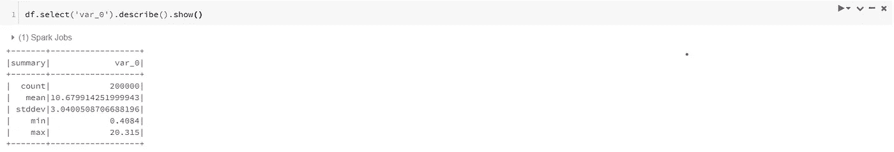
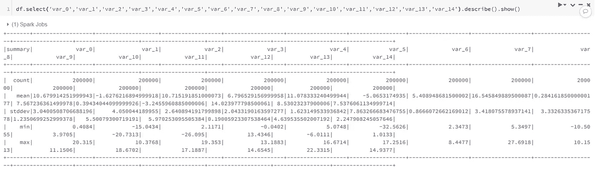
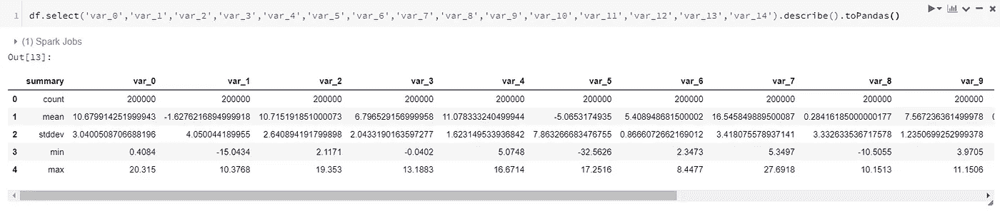
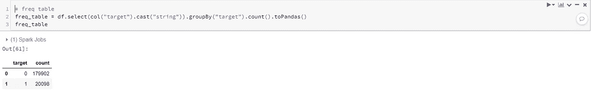
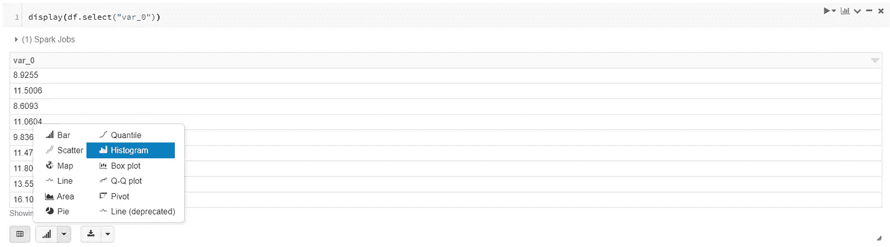
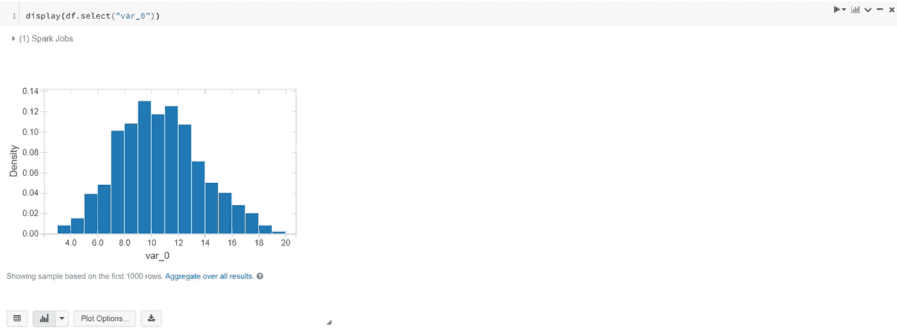
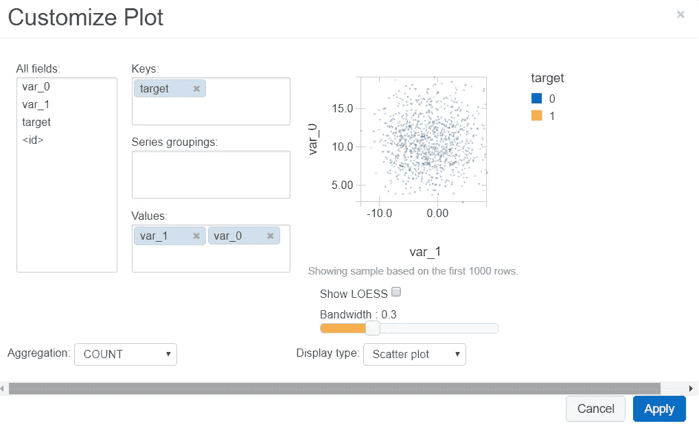

# 使用 PySpark 在数据块上进行探索性数据分析(EDA)

> 原文：<https://towardsdatascience.com/exploratory-data-analysis-eda-with-pyspark-on-databricks-e8d6529626b1?source=collection_archive---------9----------------------->

> 再见，熊猫们…


由 [Unsplash](https://unsplash.com?utm_source=medium&utm_medium=referral) 上的 [chuttersnap](https://unsplash.com/@chuttersnap?utm_source=medium&utm_medium=referral) 拍摄

EDA 加 spark 的意思是和熊猫说拜拜。由于数据规模大，每次计算都必须并行化，而不是 ***熊猫*** ，***pyspark . SQL . functions***才是你可以使用的合适工具。毫无疑问，它正在努力改变你争论数据的旧习惯。我希望这篇文章可以给你一个用 Spark 执行 EDA 的跳跃性开始。

有两种变量，连续变量和分类变量。每种技术都有不同的 EDA 要求:

连续变量 EDA 列表:

*   缺少值
*   统计值:平均值、最小值、最大值、标准差、分位数
*   宁滨和分销
*   相互关系

分类变量 EDA 列表:

*   缺少值
*   频率表

我还将展示如何在没有任何绘图库(如 seaborn 或 matplotlib)的情况下在 Databricks 上生成图表。

首先，让我们加载数据。我使用的数据来自一个 Kaggle 竞赛，桑坦德客户交易预测。

```
# It's always best to manually write the Schema, I am lazy heredf = (spark
  .read                                              
  .option("inferSchema","true")                 
  .option("header","true")                           
  .csv("/FileStore/tables/train.csv"))
```

# 连续变量的 EDA

内置函数 describe()非常有用。它计算选定变量的计数、平均值、标准偏差、最小值和最大值。例如:

```
df.select('var_0').describe().show()
```



但是，当您计算多个变量的统计值时，显示的数据框可能不便于检查，如下所示:



记得我们之前说过不要用熊猫来做计算。但是，我们仍然可以用它来显示结果。这里，spark 数据框架中内置的 describe()函数已经完成了统计值的计算。计算出的汇总表大小不大。所以我们可以用熊猫来展示它。

```
df.select('var_0','var_1','var_2','var_3','var_4','var_5','var_6','var_7','var_8','var_9','var_10','var_11','var_12','var_13','var_14').describe().toPandas()
```



***获取分位数:***

```
quantile = df.approxQuantile(['var_0'], [0.25, 0.5, 0.75], 0)
quantile_25 = quantile[0][0]
quantile_50 = quantile[0][1]
quantile_75 = quantile[0][2]
print('quantile_25: '+str(quantile_25))
print('quantile_50: '+str(quantile_50))
print('quantile_75: '+str(quantile_75))'''
quantile_25: 8.4537 
quantile_50: 10.5247 
quantile_75: 12.7582
'''
```

***检查缺失:***

引入两个函数来做过滤

```
# where
df.where(col("var_0").isNull()).count()
# filter
df.filter(col("var_0").isNull()).count()
```

这两个是一样的。根据 spark 文档，“where”是“filter”的别名。

*对于连续变量，有时我们希望对它们进行分类，并检查这些分类的分布。例如，在金融相关数据中，我们可以将 FICO 分数(通常范围为 650 到 850)归入不同的类别。每个桶有 25 的间隔。比如 650–675，675–700，700–725，…然后检查每个桶里有多少人。*

*现在让我们用“var_0”来举一个宁滨的例子。根据以前的统计值，我们知道“var_0”的范围是从 0.41 到 20.31。所以我们创建一个 0 到 21 的列表，间隔为 0.5。*

****关联:****

# *分类变量的 EDA*

*检查缺失值，和连续变量一样。*

*要查看频率表:*

```
*freq_table = df.select(col("target").cast("string")).groupBy("target").count().toPandas()*
```

**

# *数据块上的可视化*

*Databricks 实际上提供了一个“类似 Tableau”的可视化解决方案。display()函数为您提供了一个友好的用户界面来生成您喜欢的任何图形。*

*例如:*

**

*选择所需的图表类型。*

**

*您也可以创建包含多个变量的图表。点击“绘图选项”按钮。您可以根据需要修改图:*

**

**如果喜欢讨论更多，在* [*LinkedIn*](https://www.linkedin.com/in/yi-cao-data/) *上找我。**