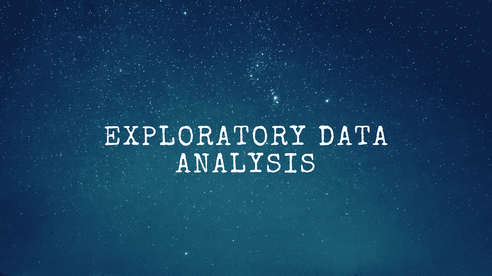
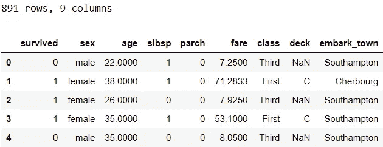
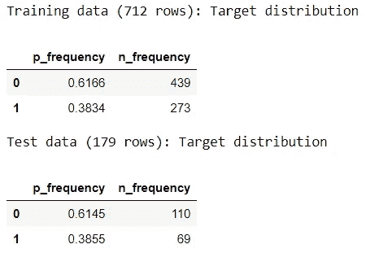
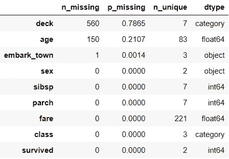
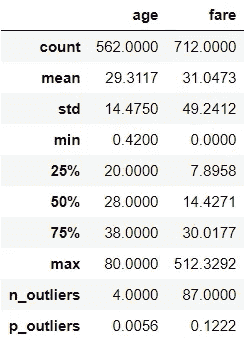
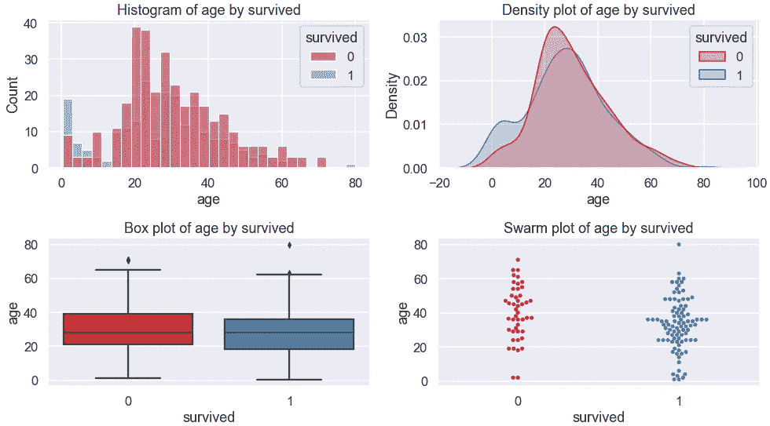
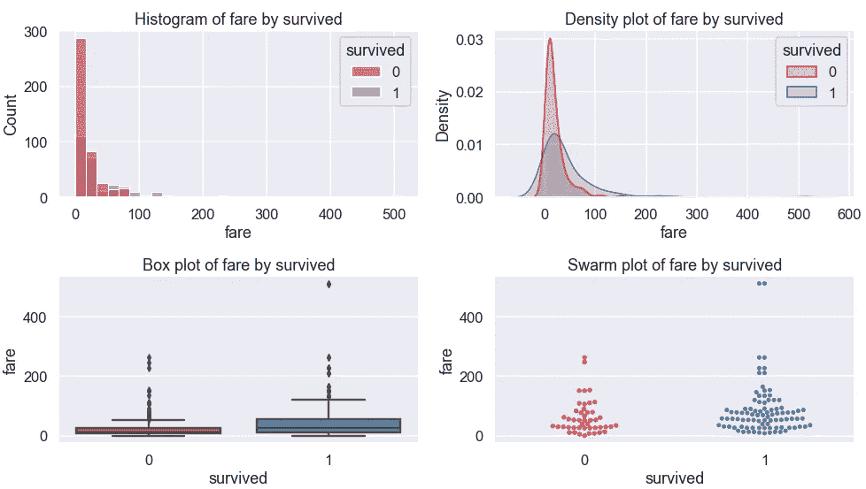
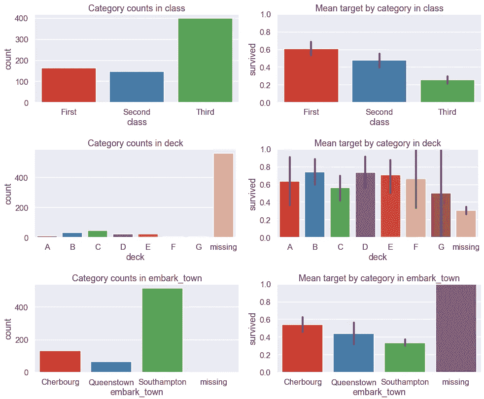
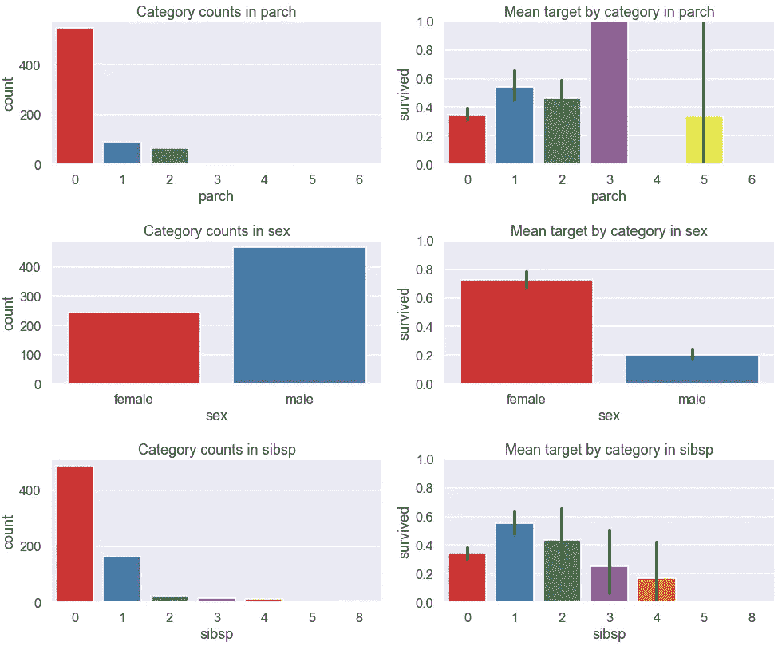

# 探索性数据分析指南

> 原文：<https://towardsdatascience.com/exploratory-data-analysis-guide-4f9367ab05e5?source=collection_archive---------25----------------------->

## [入门](https://towardsdatascience.com/tagged/getting-started)

## 关于如何组织和加速数据科学项目 EDA 的提示(Python)

*探索性数据分析* (EDA)是熟悉数据，更好地理解数据的重要步骤。在这篇文章中，我将展示一种构建 EDA 工作流的方法，并在处理*表格数据*(只是从这里开始的数据)时，以一种更有组织、更高效的方式进行。



作者图片

尽管 EDA 会因项目和数据的不同而不同，但对于大多数项目来说，我们必须做一些基本的探索。考虑到这一点，我们可以将 EDA 分为两步:

**步骤 1:基本探索:**大多数数据通用

**第二步:定制探索:**特定于手边的数据

通过使用模板简化第一步，我们可以加快整个过程。

# 0.数据📦

*如果你想跟随你电脑上的代码，确保你已经安装了*[*pandas*](https://pandas.pydata.org/pandas-docs/stable/getting_started/install.html)*，*[*pandas _ profiling*](https://pandas-profiling.github.io/pandas-profiling/docs/master/rtd/pages/installation.html)*，*[*matplotlib*](https://matplotlib.org/3.3.2/users/installing.html)*和*[*seaborn*](https://seaborn.pydata.org/installing.html)*。helpers 模块中的函数定义可以在本文末尾的附录中找到。*

让我们导入必要的包并更新默认设置:

```
# Import packages
import pandas as pd
from pandas_profiling import ProfileReport
import matplotlib.pyplot as plt
import seaborn as sns
import helpers # custom module# Update default settings
pd.options.display.float_format = '{:.4f}'.format
sns.set(style='darkgrid', context='talk', palette='Set1')
```

我们将使用从 titanic 数据集中选择的列作为示例:

```
# Import data
exclude = ['pclass', 'embarked', 'who', 'adult_male', 'alive', 
           'alone']
df = sns.load_dataset('titanic').drop(columns=exclude)# Inspect shape of the data and top rows
print(f"{df.shape[0]} rows, {df.shape[1]} columns")
df.head()
```



让我们定义目标和特性列。在代码的开头将 target 声明为变量，这样当目标名称从一个数据变为另一个数据时，更新代码会更容易。也就是说，您只需要在下面的一个地方更改代码，而不是在代码中的多个地方。

```
target = 'survived'
features = df.drop(columns=target).columns
```

在我们开始探索之前，让我们确保留出一些数据用于测试:

```
# Split data into train & test
X_train, X_test, y_train, y_test = helpers.partition(df, target)# Append target back using indices
train = pd.concat([X_train, y_train], axis=1)
test = pd.concat([X_test, y_test], axis=1)# Inspect training data
print(f"Training data ({train.shape[0]} rows): Target distribution")
display(helpers.find_frequency(y_train))print(f"Test data ({test.shape[0]} rows): Target distribution")
display(helpers.find_frequency(y_test))
```



我们已经准备好开始探索训练数据集了！🔎

# 第一步:基本探索🐇

对于基本探索，您可能还记得，我们指的是对大多数数据通用的任何探索。为了简化这一步骤，我们将利用自动化工具和定制功能来准备一个模板。因此，让我们将基本的探索步骤分成两个部分:

*   **第 1 部分:**利用自动化工具
*   **第 2 部分:**使用定制函数进行剩余的基本探索

模板背后的想法是，当我们有新的数据时，我们只需更新模板中的几个部分，就可以不费吹灰之力获得基本的探索。一旦基本探索完成，仔细分析所有图表和汇总统计数据，并创建关键发现的摘要是很重要的。这种分析将有助于形成探索的第二步。

## 第一部分。利用自动化工具

我们将使用[熊猫概况包](https://pandas-profiling.github.io/pandas-profiling/docs/master/index.html)来自动化部分的基本探索。我们可以在中创建熊猫概况报告(从此处开始报告)。像这样的 html 文件:

```
# Create profile report
profile_train = ProfileReport(train)# Export it to html file
profile_train.to_file("training_data_report.html")
```

只需 2 行代码，我们就可以得到一个非常棒的报告，其中包含数据概述、描述性统计、单变量和一些双变量分布、相关性和缺失值汇总。输出报告将类似于[这个](https://pandas-profiling.github.io/pandas-profiling/examples/master/titanic/titanic_report.html)。您会注意到，您可以使用右上角的*选项卡*跳转到各个部分，并通过点击*切换*按钮查看更多详细信息。

你可以用`title`改变出现在左上角的标题，用`dark_mode` 参数打开黑暗模式。例如，当创建一个报告时，将第一行扩展到下面将得到一个标题为“训练数据报告”的深色模式的报告(我觉得很好):

```
profile_train = ProfileReport(train, title="Training Data Report", 
                              dark_mode=True)
```

虽然我认为创建 html 报告是使用报告的最佳方式，但可以使用以下选项之一在 Jupyter Notebook 中访问它:

```
# Option 1
train.profile_report()# Option 2
profile = ProfileReport(train)
profile.to_widgets()# Option 3
profile = ProfileReport(train)
profile.to_notebook_iframe()
```

我建议尝试运行这些选项来找到您偏好。如果你想了解更多关于这个包的信息，请看他们的文档页面。

## 第二部分。使用自定义函数进行剩余的基本探索

像 Pandas Profiling 这样的自动化工具可能无法涵盖基本探索的所有部分。如果您发现自己在不同的项目中反复做相同的探索，并且它们没有包含在报告中，那么创建自定义函数或使用 pandas 内置函数或方法来迎合这种差距。

保持模板尽可能干净的一个关键技巧是将某些功能抽象成自定义函数，并保存在一个单独的模块中。这篇文章中的例子使用了自定义模块“帮助者”中的函数。每个函数的代码可以在这篇文章的末尾找到。

在这一节中，我们将看几个可以用来补充报告的示例探索。让我们从总结所有变量开始:

```
helpers.summarise(train)
```



虽然这个输出看起来像是报告显示内容的副本，但是并排查看所有变量的信息可能会很有用。从这个输出中，我们可以看到大约五分之四的记录中缺少 deck，大约五分之一的记录中缺少 age。让我们将特性分成两组:

```
# Define feature groups
continuous = train[features].select_dtypes(['float']).columns
discrete = train[features].columns.difference(continuous)# Convert to category dtype
train[discrete] = train[discrete].astype('category')
```

检查连续变量的汇总统计也很有用。以下函数扩展了 pandas DataFrame 的`.describe()`方法:

```
helpers.describe_more(train, continuous)
```



在这里，我们可以看到描述性统计和异常值的汇总。这里的异常值是用约翰·图基的规则定义的。12%的*票价*值是异常值。

可视化每个目标类的连续特征的分布可以让我们了解它们在区分目标类中的有用性:

```
for feature in continuous:
    helpers.plot_continuous(train, feature, target)
```



可以对离散值进行类似的汇总和可视化:

```
train.describe(exclude=['number'])
```


我们可以在前两行中看到非缺失值和唯一值的数量。在最后两行中，我们可以看到最频繁的值及其频率计数。

现在，让我们来想象一下离散的特征。通过使用“缺失”进行输入，我们可以看到，相对于要素中的其他类别，那些具有缺失值的记录更有可能或更少可能保留下来:

```
# Fill missing
for feature in discrete:
    if train[feature].isnull().sum()>0:
        train[feature] = train[feature].cat\
                                       .add_categories('missing')
        train[feature] = train[feature].fillna('missing')# Visualise
for feature in discrete:
    helpers.plot_discrete(train, feature, target)
```



在本节中，我们并排查看了特征的汇总统计数据，并可视化了特征与目标的关系，以获得关于它们在区分目标类别中的有用性的一些见解。我希望你将使用提到的一些或所有想法，并辅以你自己最喜欢的探索数据的方式，来创建你自己的基本探索模板。

一旦基本探索完成，仔细分析输出并创建关键发现的摘要是很重要的。这里有几个例子:

*   三等舱的乘客要多得多，他们的存活率要低得多。
*   男性乘客多得多，他们的存活率也低得多。

理解你试图用数据解决的问题的背景是很有价值的，可以帮助你感觉检查数据或解释发现。阅读问题或与相关的利益相关者谈论问题是获得理解的好方法。在泰坦尼克号的例子中，我们可以通过谷歌搜索信息来更好地理解这场灾难。读了一点书后，我们很快就会发现，在紧急情况下，有一个*‘妇女和儿童优先’*协议，它在决定谁更有可能幸存下来方面发挥了作用。以这种方式将数据置于背景中有助于理解数据探索的结果，并更好地理解问题。

# 第二步。习俗探索🐢

在完成基本探索并分析其结果后，下一步明智的做法是检查你的假设，并使用数据回答具体问题。在这里，您可以发挥创造力，对您的数据进行独特的探索。由于这一步的探索因数据而异，我们不会看很多例子。这里有一个例子，我们可以用数据来回答问题:

在每个班级中，女性和男性的存活率如何比较？

```
fig, ax = plt.subplots(1, 2, figsize=(11,3))
sns.heatmap(pd.crosstab(train['sex'], train['class']), 
            cmap='Greys', annot=True, fmt='g', ax=ax[0])
ax[0].set_title("Counts")
ax[0].set_yticklabels(ax[0].get_yticklabels(), rotation=0)sns.heatmap(train.pivot_table(target, 'sex', 'class'), 
            cmap='Greys', annot=True, fmt='.1f', ax=ax[1])
ax[1].set_title("Mean target")
ax[1].set_yticklabels(ax[1].get_yticklabels(), rotation=0)plt.tight_layout();
```


正如我们从热图中看到的，在每个班级内部和之间，女性比男性更有可能幸存下来。

*虽然我们已经看了一个分类的例子，但是这个想法也可以适用于回归或者无监督学习的问题。*


[杰瑞米·托马斯](https://unsplash.com/@jeremythomasphoto?utm_source=medium&utm_medium=referral)在 [Unsplash](https://unsplash.com?utm_source=medium&utm_medium=referral) 上拍照

*您想访问更多这样的内容吗？媒体会员可以无限制地访问媒体上的任何文章。如果您使用* [*我的推荐链接*](https://zluvsand.medium.com/membership) ，*成为会员，您的一部分会费将直接用于支持我。*

谢谢你看我的帖子。我希望这些例子将有助于创建您自己的模板，以加快和组织您的数据科学项目的探索性数据分析。

如果你感兴趣， 以下是我的一些帖子的链接:
◼️ [用这些技巧整理你的 Jupyter 笔记本](/organise-your-jupyter-notebook-with-these-tips-d164d5dcd51f)
◼️ [用 Python 实现简单的数据可视化，你会发现有用的](/simple-data-visualisations-in-python-that-you-will-find-useful-5e42c92df51e)
◼️ [6 个简单的技巧让 Seaborn (Python)中的情节更漂亮、更定制化](/6-simple-tips-for-prettier-and-customised-plots-in-seaborn-python-22f02ecc2393)
◼️ [用 Python 进行探索性文本分析](/exploratory-text-analysis-in-python-8cf42b758d9e)
◼️️ [给熊猫用户的 5 个技巧](/5-tips-for-pandas-users-e73681d16d17)
◼️️ [关于熊猫中数据聚合的 5 个技巧](/writing-5-common-sql-queries-in-pandas-90b52f17ad76)

再见🏃💨

# 附录:helpers.py