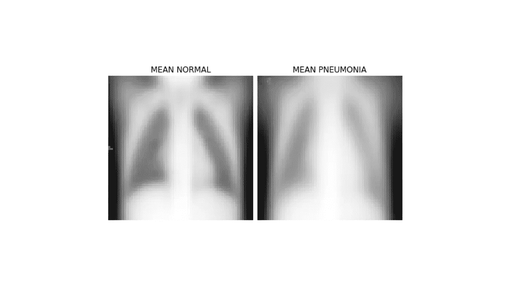
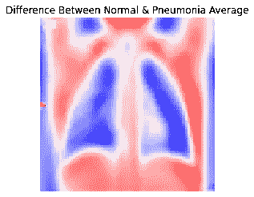
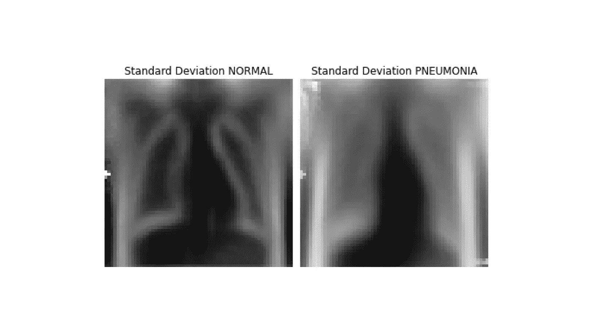
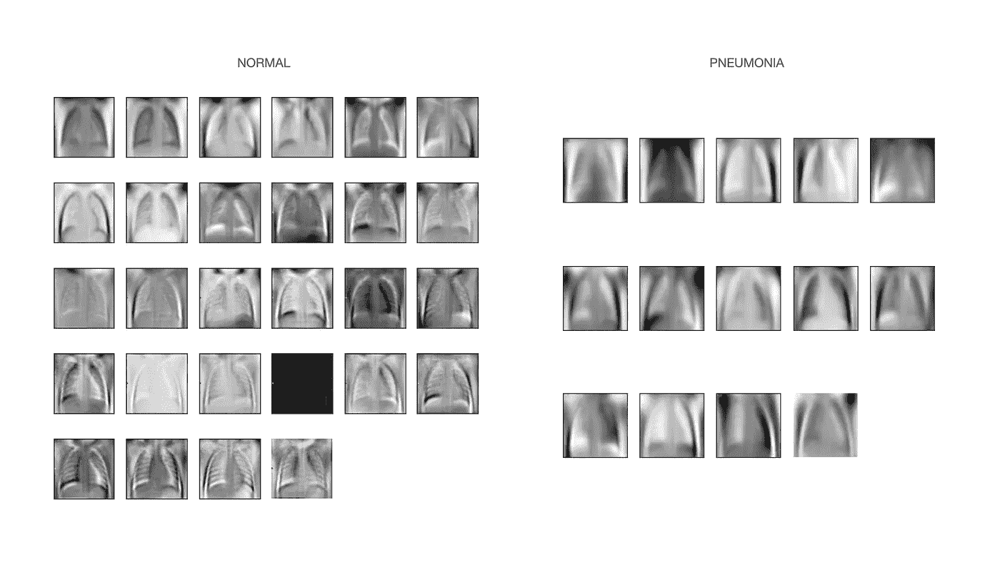

# 图像分类的探索性数据分析思路

> 原文：<https://towardsdatascience.com/exploratory-data-analysis-ideas-for-image-classification-d3fc6bbfb2d2?source=collection_archive---------14----------------------->

## 图像数据的可视化模式

[疾控中心](https://unsplash.com/@cdc?utm_source=medium&utm_medium=referral)在 [Unsplash](https://unsplash.com?utm_source=medium&utm_medium=referral) 拍摄的照片

探索性数据分析包括描述数据集的简要分析，以指导建模过程并回答初步问题。对于分类问题，这可能包括查看变量的分布或检查不同类别中任何有意义的预测模式。图像数据的分类也存在同样的问题。我们打算寻找简单操作能给我们的有意义的信息。在这里，我概述了一些方法，我们可以使用胸部 x 光数据来实现这个目标[ [来源](https://data.mendeley.com/datasets/rscbjbr9sj/3) ]。该数据集由肺炎患者和健康对照者的 X 射线图像组成。

# 原始比较

首先，我们可以从简单地查看一些随机采样的图像开始。

这一步将从每个子文件夹中随机抽取图像并显示出来。

# 图像作为矩阵

在接下来的几个步骤中，我们将直接处理每个图像的像素值，以便对它们进行操作。我们可以通过将图像转换成 Numpy 数组来实现这一点。

这个函数将遍历每个文件，并将它们转换成一个( *n，m* )矩阵，其中 *n* 是观察值的数量， *m* 是像素数。

# 平均图像

现在让我们看看每个类的平均图像是什么样的。为了计算平均图像，我们可以取所有观测中每个像素的平均值。

我们可以从平均图像中看到，肺炎 X 射线往往显示胸部周围有较高的阻塞。

# 平均图像之间的对比度

使用平均图像，我们也可以计算差异。

# 变化性

类似地，我们也可以通过计算方差或标准差而不是平均值来查看哪一个区域在这两类中变化最大。这里较亮的区域表示较高的可变性。我们可以再次看到，在肺炎 X 射线中，肺部有更多的可变性。

# 特征图像

最后，我们可以使用一种降维技术，如主成分分析(PCA ),来可视化描述每个类别的最佳成分。本质上是我们的图像矩阵的 PCA 的特征向量(分量)的特征图像可以被整形为矩阵并被绘制。它也被称为特征脸，因为这种方法最初用于面部识别研究。在这里，我们将把描述每一类 70%可变性的主要成分形象化。

您可以看到，与肺炎类相比，健康 X 射线图像的特征图像显示了更多关于胸腔和器官的边缘定义。

今天，我简要地展示了一些在简单的图像数据集中寻找模式的快速简单的方法。显然，这些方法在处理具有规则构图的图像时非常有用。除了上述方法之外，我们还可以查看鱼表面和像素间的相关矩阵，以便对图像数据进行探索性分析。

## 数据源

 [## 标记的光学相干断层扫描(OCT)和胸部 X 射线图像的大型数据集

### 确保下载该数据集的最新版本，以保持准确性。该数据集包含数千个…

data.mendeley.com](https://data.mendeley.com/datasets/rscbjbr9sj/3)