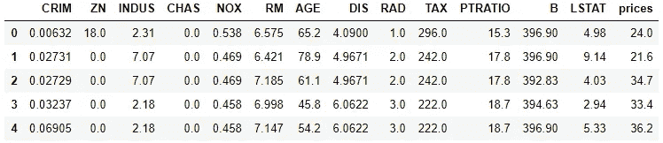
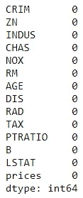
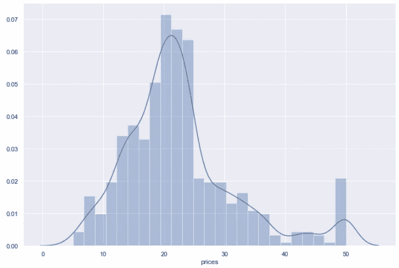
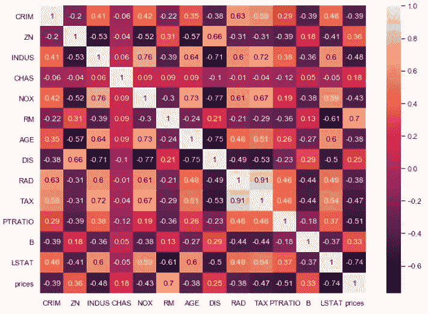
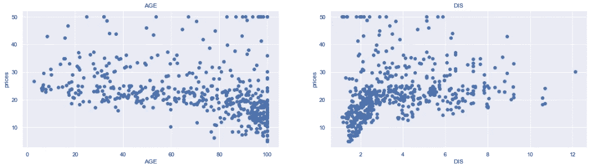
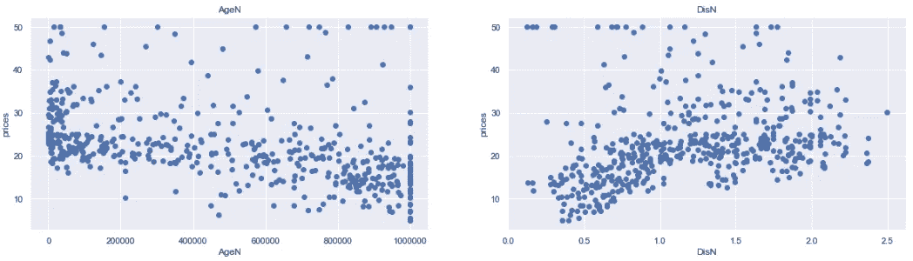

# 用于数据建模的探索性数据分析

> 原文：<https://towardsdatascience.com/exploratory-data-analysis-intro-for-data-modeling-8ff019362371?source=collection_archive---------45----------------------->

## 如何了解数据集、定义因变量和自变量、计算目标变量和预测变量之间的相关系数、数据转换

探索性数据分析(EDA)是一个广泛的话题。很难在一篇文章中涵盖这一点。探索性数据分析可用于了解数据以及数据集不同特征之间的关系。也可以通过了解要素来选择重要的要素并准备数据集，以便统计模型能够适合数据集。不管原因是什么，了解这些特性以及特性之间的关系是非常重要的。在本文中，我将重点介绍用于数据建模的探索性数据分析(EDA)。虽然我们不打算在这里做预测。我们将只关注 EDA 部分。

## 资料组

我使用的是 scikit-learn 库中已经存在的波士顿数据集。它包含有关波士顿房价的信息。首先，导入必要的包和数据集。

```
import numpy as np
import pandas as pd
import matplotlib.pyplot as plt
import seaborn as sns
%matplotlib inline
from sklearn.datasets import load_boston
boston_data = load_boston()
```

作为参考，波士顿数据集分为两部分。一个是包含特性的数据部分，另一个包含房屋的价格。我们将价格作为要素包含在同一个数据集中。

```
df = pd.DataFrame(data=boston_data.data, columns=boston_data.feature_names)df["prices"] = boston_data.target
```



找出有多少特征和多少观察值:

```
df.shape#Output:
(506, 14)
```

数据集的形状表示，数据集中有 14 个要素和 506 个观测值。现在，列出数据集中的所有列或要素:

```
df.columns#Output:
Index(['CRIM', 'ZN', 'INDUS', 'CHAS', 'NOX', 'RM', 'AGE', 'DIS', 'RAD', 'TAX', 'PTRATIO', 'B', 'LSTAT', 'prices'], dtype='object')
```

这些功能的名称可能看起来晦涩难懂。以下是对这些功能的解释:

各城镇的人均犯罪率

**ZN:** 面积超过 25，000 平方英尺的住宅用地比例。脚

**梧桐:**每个城镇非零售商业亩数比例

**CHAS:** 查尔斯河虚拟变量(= 1，如果区域边界为河流；否则为 0)

**NOX:** 一氧化氮浓度，以每千万份为单位

**RM:** 平均房间数

**楼龄:**1940 年前建成的自住单位比例

**DIS:** 到五个波士顿就业中心的加权距离

**RAD:** 放射状公路可达性指标

**税:**每万美元的财产税税率

各城镇学生与教师的比例

**B:** 1000(Bk — 0.63)2，其中 Bk 是各城镇非裔美国人的比例

LSTAT: 处于较低地位的人口所占的百分比

价格:千美元住宅的价格

现在，我们对数据集有了更清楚的了解。在开始任何数据探索之前，检查缺失的数据是很重要的:

```
df.isnull().sum()
```



幸运的是，这个数据集中没有缺失值。所以，我们可以进一步分析。

## 因变量和自变量

在这个数据集中，我们需要找出因变量和自变量。如果你注意到数据集中，人们可能会有兴趣根据其他特征来预测房价。因为他们不想支付高于公平市场价值的价格。根据经验，我们可以预计，根据数据集中的其他要素，房价可能会有所不同。所以，**在这个数据集中，房价是因变量**。

选择自变量或预测变量可能很棘手。它主要取决于变量与因变量的关系。我们可以从本能开始，然后测试它。我的直觉告诉我，这个数据集的预测变量可以是 RM、CRIM、DIS、Age 和 PTRATIO。如果我们想到细节:

RM(平均房间数)会影响平方英尺，影响房子的价格。与住房的关系预计将是积极的。这意味着如果房间数量越多，价格也越高。

犯罪率也可能影响价格。如果犯罪率更高，很可能房价更低。到五个波士顿就业中心(DIS)的加权距离也可能与房价负相关。师生比也可能与房价成负相关，因为孩子的教育对父母来说很重要。现在，检查一下我们的直觉是否正确。

## 探索性分析

从目标变量或因变量的分布开始:

```
sns.set(rc={'figure.figsize': (12, 8)})
sns.distplot(df["prices"], bins=25)
plt.show()
```



如上图所示，价格的分布几乎是正态的。在上分位数中有一些异常值。

一个非常重要的步骤是了解因变量和自变量之间的关系。预测变量之间的相关性对于选择正确的预测变量也很重要。以下是在数据集或部分数据集的所有要素之间绘制相关矩阵的方法。因为这个数据集不太大，所以我取整个数据集并绘制相关矩阵:

```
correlation_matrix = df.corr().round(2)sns.set(rc={'figure.figsize':(11, 8)})
sns.heatmap(data=correlation_matrix, annot=True)
plt.show()
```



来源:作者，相关矩阵

提醒你一下，相关系数的范围是-1 到 1。-1 表示有很强的负相关性，1 表示有很强的正相关性。如果相关系数为零，则没有相关性。

现在，从上面的相关矩阵中检查目标变量“价格”和我们选择的预测变量(RM、CRIM、DIS、AGE 和 PTRATIO)之间的相关性。

如图所示，价格与 RM 的相关系数为-0.7，为强正相关。价格和犯罪之间的相关系数是-0.39，这是一个显著的负相关。价格与 DIS、年龄和 PTRATIO 之间的相关系数分别为 0.25、-0.38 和-0.51，表明相关性非常显著。你可能认为除了 CHAS，所有的特征都与我们的因变量有很好的相关性，这是正确的。如果我用这个数据集写一个预测算法，**我将只排除 CHAS，把其余的特征作为预测变量或自变量。**

让我们进一步研究因变量和自变量之间的关系。这次我想看看个人关系。在本文中，我不打算检查所有预测变量与目标变量之间的关系。我根据 correlation_matrix 中的相关性选择两个预测变量。在这里，我采用了与“价格”有良好负相关关系的年龄和有良好正相关关系的 DIS。

要查看 RM 和 DIS 与目标变量之间的关系，散点图是最有帮助的。

```
plt.figure(figsize=(20, 5))features = ['RM', 'DIS']
target = df['prices']for i, col in enumerate(features):
    plt.subplot(1, len(features) , i+1)
    x = df[col]
    y = target
    plt.scatter(x, y, marker='o')
    plt.title(col)
    plt.xlabel(col)
    plt.ylabel('prices')
```



从上面的散点图中，我们可以看到年龄的分布是左偏的，DIS 的分布是右偏的。在年龄图中，上分位数有一个聚类，在 DIS 图中，下分位数有一个聚类。这种关系呈线性趋势。但如果我们想到的是线性模型，就要做一些数据操作，让关系成为更强的线性关系。当数据向左倾斜时，转换数据的一种方法是获取数据的立方体。当它向左倾斜时，用圆木会有帮助。有几种方法可以转换数据。我将在以后的文章中详细讨论这一点。

```
plt.figure(figsize=(20, 5))df['AgeN'] = df['AGE']**3
df['DisN'] = np.log(df['DIS'])features = ['AgeN', 'DisN']
target = df['prices']for i, col in enumerate(features):
    plt.subplot(1, len(features) , i+1)
    x = df[col]
    y = target
    plt.scatter(x, y, marker='o')
    plt.title(col)
    plt.xlabel(col)
    plt.ylabel('prices')
```



如果你注意到，集群消失了，线性更强了。这两个预测变量已准备好进行建模。请用其他预测变量进行练习。

从本文中，我们学习了如何检查空值、定义预测值和相关值、制作相关矩阵、转换数据以提高数据建模的质量。

更多阅读推荐:

[如何在 Python 中呈现多个变量之间的关系](/how-to-present-the-relationships-amongst-multiple-variables-in-python-fa1bdd4f368c)

[Python 中的基本线性回归算法，适合初学者](/basic-linear-regression-algorithm-in-python-for-beginners-c519a808b5f8)

[假设检验、特征和计算](/hypothesis-testing-characteristics-and-calculation-ba3bdf516ea5)

[掌握熊猫的分组情况，进行高效的数据汇总和分析](/master-pandas-groupby-for-efficient-data-summarizing-and-analysis-c6808e37c1cb)

[用 Python 中的单变量和多变量图表和绘图理解数据](/understand-the-data-with-univariate-and-multivariate-charts-and-plots-in-python-3b9fcd68cd8)

[用 Python 从零开始构建一个完整的神经网络](/build-a-complete-neural-network-from-scratch-in-python-308eaed23e06)