# Kaggle 数据集的探索性数据分析。

> 原文：<https://towardsdatascience.com/exploratory-data-analysis-of-kaggle-datasets-9a293886f644?source=collection_archive---------20----------------------->


弗兰基·查马基在 [Unsplash](https://unsplash.com?utm_source=medium&utm_medium=referral) 上拍摄的照片

# 简介:

探索性数据分析或 EDA 指的是更多地了解手头数据并为建模做准备的过程。坦率地说，EDA 和特征工程是一门艺术，你可以在预测过程之前摆弄数据并试图从中获得洞察力。大多数人认为机器学习只是关于模型和算法。但要让这些模型以高精度良好运行，EDA 是必不可少的。EDA 提供了很多非常容易被忽略的重要信息，这些信息从长远来看有助于分析。

# 背景:

关于如何执行 EDA，没有硬性规定。处理数据的每个人都必须找到自己执行 EDA 的方式，并相应地理解数据。在这篇文章中，我将解释我在 Kaggle 的房价数据集上做 EDA 的一步一步的方法。涉及的基本步骤是:

1.  导入数据集。
2.  获得基本的洞察力。
3.  分析不同的特征并将它们分成数字和类别。
4.  处理缺失值。
5.  处理相关特征。

最后，我将使用名为“Sweetviz”的库实现一种现代的 EDA 方法，我认为这可能会帮助我们节省大量时间和精力。

相反，我不会在文章中显示代码，我在这里给出了整个代码 的 [**链接。请浏览一遍以跟上解释。**](https://github.com/Gokul-S-Kumar/-Kaggle-House-Price-dataset/blob/master/EDA%20housing%20prices.ipynb)

# 正在加载数据集:

如上所述，我将使用 Kaggle 的房价数据集，其链接在这里给出[](https://www.kaggle.com/c/home-data-for-ml-course)**。**

**我们将把训练和测试数据集分别加载到 Pandas 数据帧中。**

# **初步分析:**

**包含训练和测试数据的数据帧将会。我们将尝试获得关于整个数据的一些基本见解。**

**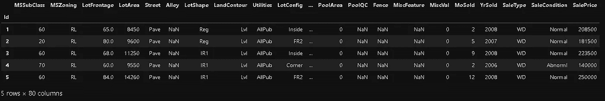**

**图一。列车数据帧**

**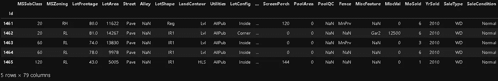**

**图二。测试数据帧**

**数据集附带了对这些功能的详细描述。获得简要信息。**

```
<class 'pandas.core.frame.DataFrame'>
Int64Index: 1460 entries, 1 to 1460
Data columns (total 80 columns):
 #   Column         Non-Null Count  Dtype  
---  ------         --------------  -----  
 0   MSSubClass     1460 non-null   int64  
 1   MSZoning       1460 non-null   object 
 2   LotFrontage    1201 non-null   float64
 3   LotArea        1460 non-null   int64  
 4   Street         1460 non-null   object 
 5   Alley          91 non-null     object 
 6   LotShape       1460 non-null   object 
 7   LandContour    1460 non-null   object 
 8   Utilities      1460 non-null   object 
 9   LotConfig      1460 non-null   object 
 10  LandSlope      1460 non-null   object 
 11  Neighborhood   1460 non-null   object 
 12  Condition1     1460 non-null   object 
 13  Condition2     1460 non-null   object 
 14  BldgType       1460 non-null   object 
 15  HouseStyle     1460 non-null   object 
 16  OverallQual    1460 non-null   int64  
 17  OverallCond    1460 non-null   int64  
 18  YearBuilt      1460 non-null   int64  
 19  YearRemodAdd   1460 non-null   int64  
 20  RoofStyle      1460 non-null   object 
 21  RoofMatl       1460 non-null   object 
 22  Exterior1st    1460 non-null   object 
 23  Exterior2nd    1460 non-null   object 
 24  MasVnrType     1452 non-null   object 
 25  MasVnrArea     1452 non-null   float64
 26  ExterQual      1460 non-null   object 
 27  ExterCond      1460 non-null   object 
 28  Foundation     1460 non-null   object 
 29  BsmtQual       1423 non-null   object 
 30  BsmtCond       1423 non-null   object 
 31  BsmtExposure   1422 non-null   object 
 32  BsmtFinType1   1423 non-null   object 
 33  BsmtFinSF1     1460 non-null   int64  
 34  BsmtFinType2   1422 non-null   object 
 35  BsmtFinSF2     1460 non-null   int64  
 36  BsmtUnfSF      1460 non-null   int64  
 37  TotalBsmtSF    1460 non-null   int64  
 38  Heating        1460 non-null   object 
 39  HeatingQC      1460 non-null   object 
 40  CentralAir     1460 non-null   object 
 41  Electrical     1459 non-null   object 
 42  1stFlrSF       1460 non-null   int64  
 43  2ndFlrSF       1460 non-null   int64  
 44  LowQualFinSF   1460 non-null   int64  
 45  GrLivArea      1460 non-null   int64  
 46  BsmtFullBath   1460 non-null   int64  
 47  BsmtHalfBath   1460 non-null   int64  
 48  FullBath       1460 non-null   int64  
 49  HalfBath       1460 non-null   int64  
 50  BedroomAbvGr   1460 non-null   int64  
 51  KitchenAbvGr   1460 non-null   int64  
 52  KitchenQual    1460 non-null   object 
 53  TotRmsAbvGrd   1460 non-null   int64  
 54  Functional     1460 non-null   object 
 55  Fireplaces     1460 non-null   int64  
 56  FireplaceQu    770 non-null    object 
 57  GarageType     1379 non-null   object 
 58  GarageYrBlt    1379 non-null   float64
 59  GarageFinish   1379 non-null   object 
 60  GarageCars     1460 non-null   int64  
 61  GarageArea     1460 non-null   int64  
 62  GarageQual     1379 non-null   object 
 63  GarageCond     1379 non-null   object 
 64  PavedDrive     1460 non-null   object 
 65  WoodDeckSF     1460 non-null   int64  
 66  OpenPorchSF    1460 non-null   int64  
 67  EnclosedPorch  1460 non-null   int64  
 68  3SsnPorch      1460 non-null   int64  
 69  ScreenPorch    1460 non-null   int64  
 70  PoolArea       1460 non-null   int64  
 71  PoolQC         7 non-null      object 
 72  Fence          281 non-null    object 
 73  MiscFeature    54 non-null     object 
 74  MiscVal        1460 non-null   int64  
 75  MoSold         1460 non-null   int64  
 76  YrSold         1460 non-null   int64  
 77  SaleType       1460 non-null   object 
 78  SaleCondition  1460 non-null   object 
 79  SalePrice      1460 non-null   int64  
dtypes: float64(3), int64(34), object(43)
memory usage: 923.9+ KB<class 'pandas.core.frame.DataFrame'>
Int64Index: 1459 entries, 1461 to 2919
Data columns (total 79 columns):
 #   Column         Non-Null Count  Dtype  
---  ------         --------------  -----  
 0   MSSubClass     1459 non-null   int64  
 1   MSZoning       1455 non-null   object 
 2   LotFrontage    1232 non-null   float64
 3   LotArea        1459 non-null   int64  
 4   Street         1459 non-null   object 
 5   Alley          107 non-null    object 
 6   LotShape       1459 non-null   object 
 7   LandContour    1459 non-null   object 
 8   Utilities      1457 non-null   object 
 9   LotConfig      1459 non-null   object 
 10  LandSlope      1459 non-null   object 
 11  Neighborhood   1459 non-null   object 
 12  Condition1     1459 non-null   object 
 13  Condition2     1459 non-null   object 
 14  BldgType       1459 non-null   object 
 15  HouseStyle     1459 non-null   object 
 16  OverallQual    1459 non-null   int64  
 17  OverallCond    1459 non-null   int64  
 18  YearBuilt      1459 non-null   int64  
 19  YearRemodAdd   1459 non-null   int64  
 20  RoofStyle      1459 non-null   object 
 21  RoofMatl       1459 non-null   object 
 22  Exterior1st    1458 non-null   object 
 23  Exterior2nd    1458 non-null   object 
 24  MasVnrType     1443 non-null   object 
 25  MasVnrArea     1444 non-null   float64
 26  ExterQual      1459 non-null   object 
 27  ExterCond      1459 non-null   object 
 28  Foundation     1459 non-null   object 
 29  BsmtQual       1415 non-null   object 
 30  BsmtCond       1414 non-null   object 
 31  BsmtExposure   1415 non-null   object 
 32  BsmtFinType1   1417 non-null   object 
 33  BsmtFinSF1     1458 non-null   float64
 34  BsmtFinType2   1417 non-null   object 
 35  BsmtFinSF2     1458 non-null   float64
 36  BsmtUnfSF      1458 non-null   float64
 37  TotalBsmtSF    1458 non-null   float64
 38  Heating        1459 non-null   object 
 39  HeatingQC      1459 non-null   object 
 40  CentralAir     1459 non-null   object 
 41  Electrical     1459 non-null   object 
 42  1stFlrSF       1459 non-null   int64  
 43  2ndFlrSF       1459 non-null   int64  
 44  LowQualFinSF   1459 non-null   int64  
 45  GrLivArea      1459 non-null   int64  
 46  BsmtFullBath   1457 non-null   float64
 47  BsmtHalfBath   1457 non-null   float64
 48  FullBath       1459 non-null   int64  
 49  HalfBath       1459 non-null   int64  
 50  BedroomAbvGr   1459 non-null   int64  
 51  KitchenAbvGr   1459 non-null   int64  
 52  KitchenQual    1458 non-null   object 
 53  TotRmsAbvGrd   1459 non-null   int64  
 54  Functional     1457 non-null   object 
 55  Fireplaces     1459 non-null   int64  
 56  FireplaceQu    729 non-null    object 
 57  GarageType     1383 non-null   object 
 58  GarageYrBlt    1381 non-null   float64
 59  GarageFinish   1381 non-null   object 
 60  GarageCars     1458 non-null   float64
 61  GarageArea     1458 non-null   float64
 62  GarageQual     1381 non-null   object 
 63  GarageCond     1381 non-null   object 
 64  PavedDrive     1459 non-null   object 
 65  WoodDeckSF     1459 non-null   int64  
 66  OpenPorchSF    1459 non-null   int64  
 67  EnclosedPorch  1459 non-null   int64  
 68  3SsnPorch      1459 non-null   int64  
 69  ScreenPorch    1459 non-null   int64  
 70  PoolArea       1459 non-null   int64  
 71  PoolQC         3 non-null      object 
 72  Fence          290 non-null    object 
 73  MiscFeature    51 non-null     object 
 74  MiscVal        1459 non-null   int64  
 75  MoSold         1459 non-null   int64  
 76  YrSold         1459 non-null   int64  
 77  SaleType       1458 non-null   object 
 78  SaleCondition  1459 non-null   object 
dtypes: float64(11), int64(25), object(43)
memory usage: 911.9+ KB(1460, 80)(1459, 79)
```

**我们可以看到，训练数据集总共由 80 个特征组成，包括目标变量 SalePrice 和 1460 个训练示例。测试或预测数据集由 79 个特征(要预测的销售价格)和 1459 个数据点组成。**

## **检查缺少的值:**

**任何数据集都会在其特征中包含某些缺失值，无论是数值特征还是分类特征。发生这种情况的原因有很多，如数据不可用、数据输入错误等。我们需要检查训练数据集中缺失的值。下面的可视化可以帮助我们做到这一点。**

**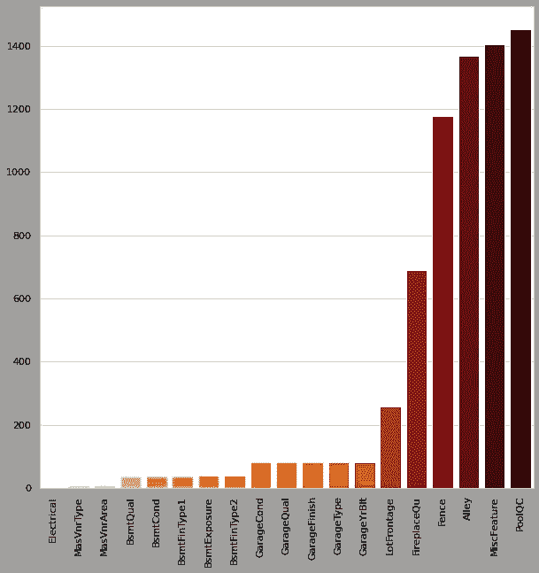**

**图三。缺少值**

**我们可以看到“PoolQC”和其他一些特性丢失了大约 90%的数据。我们稍后会处理它们。**

# **数据可视化:**

## **特征类型:**

**主要有两种类型的列，数字列和分类列。让我们将 train_df 中的特性分成每一个。**

**数字特征是:**

```
Index(['MSSubClass', 'LotFrontage', 'LotArea', 'OverallQual', 'OverallCond',
       'YearBuilt', 'YearRemodAdd', 'MasVnrArea', 'BsmtFinSF1', 'BsmtFinSF2',
       'BsmtUnfSF', 'TotalBsmtSF', '1stFlrSF', '2ndFlrSF', 'LowQualFinSF',
       'GrLivArea', 'BsmtFullBath', 'BsmtHalfBath', 'FullBath', 'HalfBath',
       'BedroomAbvGr', 'KitchenAbvGr', 'TotRmsAbvGrd', 'Fireplaces',
       'GarageYrBlt', 'GarageCars', 'GarageArea', 'WoodDeckSF', 'OpenPorchSF',
       'EnclosedPorch', '3SsnPorch', 'ScreenPorch', 'PoolArea', 'MiscVal',
       'MoSold', 'YrSold'],
      dtype='object')
```

**分类特征是:**

```
Index(['MSZoning', 'Street', 'Alley', 'LotShape', 'LandContour', 'Utilities',
       'LotConfig', 'LandSlope', 'Neighborhood', 'Condition1', 'Condition2',
       'BldgType', 'HouseStyle', 'RoofStyle', 'RoofMatl', 'Exterior1st',
       'Exterior2nd', 'MasVnrType', 'ExterQual', 'ExterCond', 'Foundation',
       'BsmtQual', 'BsmtCond', 'BsmtExposure', 'BsmtFinType1', 'BsmtFinType2',
       'Heating', 'HeatingQC', 'CentralAir', 'Electrical', 'KitchenQual',
       'Functional', 'FireplaceQu', 'GarageType', 'GarageFinish', 'GarageQual',
       'GarageCond', 'PavedDrive', 'PoolQC', 'Fence', 'MiscFeature',
       'SaleType', 'SaleCondition'],
      dtype='object')
```

## **特征分布:**

**让我们看看数字特征中的数据是如何分布的。distplot 给出了每个变量的单变量分布图，如下所示。这些图还有助于我们了解特征的偏斜度和异常值(如果有)。**

**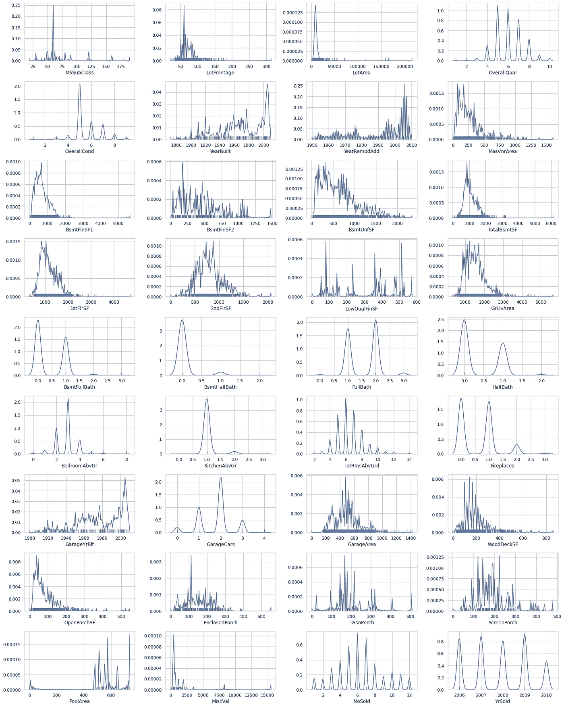**

**图 4。数字特征分布图**

## **单变量分析:**

**我们不能只根据分布图来决定异常值。箱线图有助于我们了解更多关于特征中异常值的信息。蓝框外的点描述了作为异常值的数据点。**

**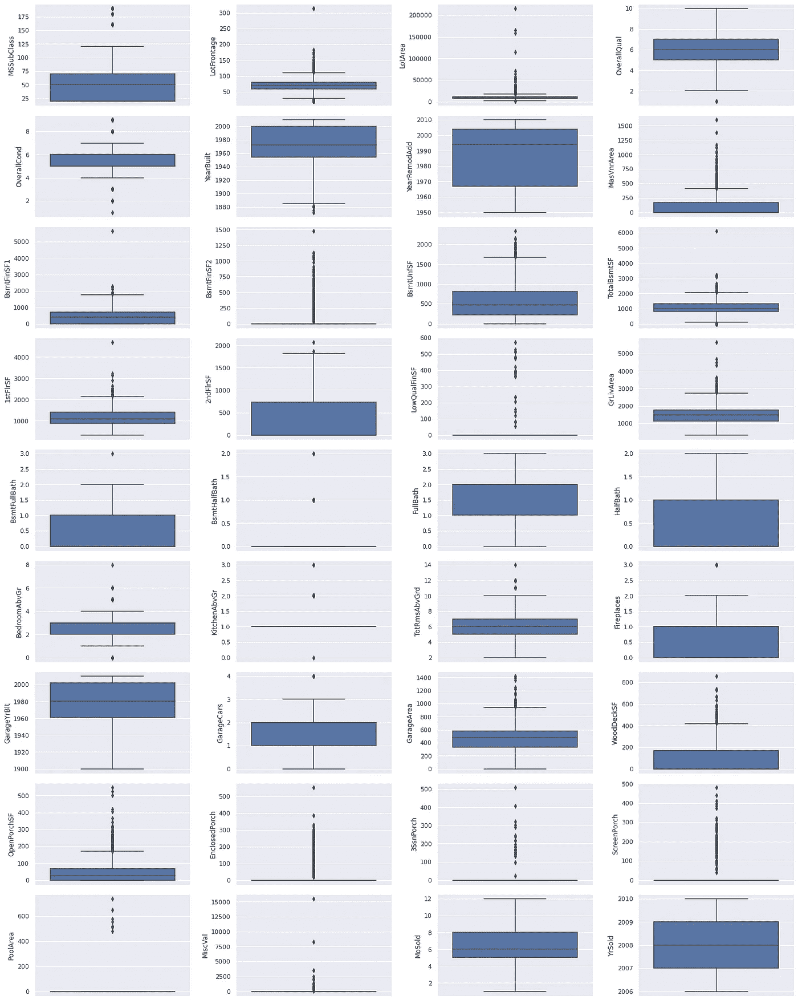**

**图五。数字特征的单变量分析**

## **双变量分析:**

**我们还可以绘制特征和目标变量，以进行双变量分析。散点图可以达到目的。**

**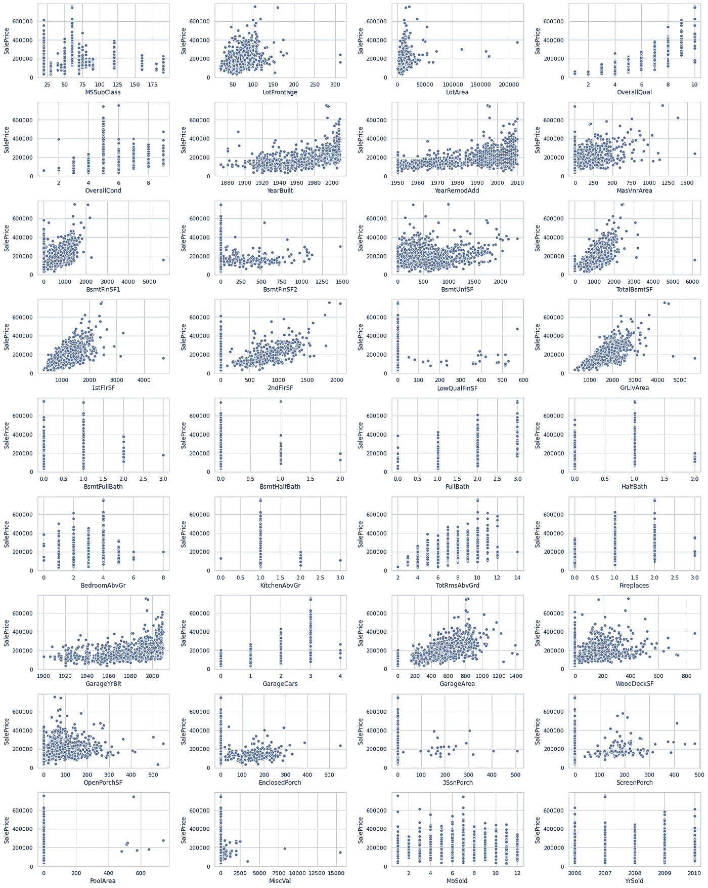**

**图六。数字特征的二元分析**

**所有这些图可用于检测异常值，并更好地了解特征的分布及其与目标变量的关系。**

# **数据处理:**

## **移除异常值:**

**通过仔细观察上述图，可以得出以下特征存在异常值的结论:**

1.  **停车场正面**
2.  **LotArea**
3.  **马斯夫纳雷亚**
4.  **BsmtFinSF1**
5.  **BsmtFinSF2**
6.  **总计 BsmtSF**
7.  **1stFlrSF**
8.  **低质量 FinSF**
9.  **格里瓦雷亚**
10.  **WoodDeckSF**
11.  **封闭的港口**
12.  **3SsnPorch**
13.  **纱窗门廊**
14.  **游泳池区**
15.  **误算**

**让我们通过绘制回归图来进一步了解这些特征。**

**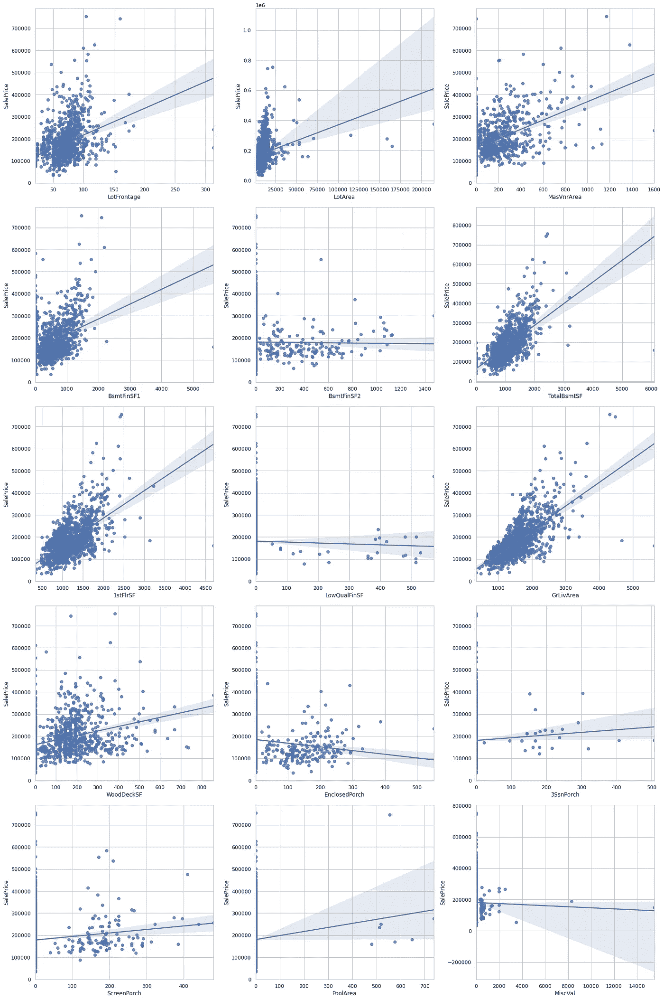**

**图七。具有异常值的要素的回归图**

**我们现在可以确认这些要素存在异常值。下一步将是删除它们。我们可以获得从箱线图和回归图中移除它们(从各自的特征中)的极限。**

## **移除不起作用的特征:**

**数据集中可能存在对目标变量贡献不大的特征。我们需要移除这些以获得更好的准确性。彼此高度相关的多个特征可能导致过度拟合。我们来找出高度相关的特征(相关性> 0.8)。这可以通过包含特征相关值的热图来完成。**

**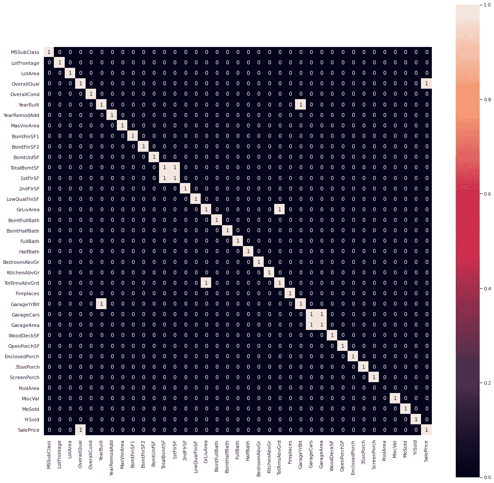**

**图八。具有特征相关值的热图**

**从图中，我们可以看到以下特征彼此高度相关:**

1.  **1stFlrSF & TotalBsmtSF**
2.  **TotRmsAbvGrd & GrdLivArea**
3.  **GarageYrBlt & YearBuilt**
4.  **车库区域和车库汽车**

**删除这四个集合中的任何一个特征就足够了。我们可以通过观察它对目标变量 SalePrice 的贡献来决定删除哪一个。这可以通过检查其与 SalePrice 的相关性来实现。**

```
SalePrice        1.000000
OverallQual      0.801493
GrLivArea        0.718996
GarageCars       0.647613
TotalBsmtSF      0.644541
GarageArea       0.634446
1stFlrSF         0.622300
FullBath         0.562614
YearBuilt        0.552223
YearRemodAdd     0.528484
TotRmsAbvGrd     0.524650
GarageYrBlt      0.508125
MasVnrArea       0.493222
Fireplaces       0.464076
BsmtFinSF1       0.392553
LotFrontage      0.360988
LotArea          0.332449
WoodDeckSF       0.329587
OpenPorchSF      0.322831
2ndFlrSF         0.296424
HalfBath         0.289755
BsmtUnfSF        0.230026
BsmtFullBath     0.220147
BedroomAbvGr     0.161515
ScreenPorch      0.069728
MoSold           0.051067
3SsnPorch        0.038210
BsmtHalfBath    -0.014339
YrSold          -0.023857
BsmtFinSF2      -0.038292
MiscVal         -0.048533
LowQualFinSF    -0.064357
OverallCond     -0.081193
MSSubClass      -0.085814
EnclosedPorch   -0.134095
KitchenAbvGr    -0.139927
PoolArea              NaN
Name: SalePrice, dtype: float64
```

**我们将删除与目标变量相关性较低的特征(在上面显示的对中)。**

**我们之前已经检查并可视化了特征中缺失值的数量。我们需要删除缺失值超过 90%的特征。**

```
PoolQC         1.000000
MiscFeature    0.966387
Alley          0.936975
Fence          0.809524
FireplaceQu    0.479692
dtype: float64
```

**正如我们在 PoolQC、MiscFeature、Alley 中所看到的，缺失值超过 90%。所以我们应该去掉这些特征。**

**我们可以再次绘制散点图，看看是否有更多无用的特征。**

**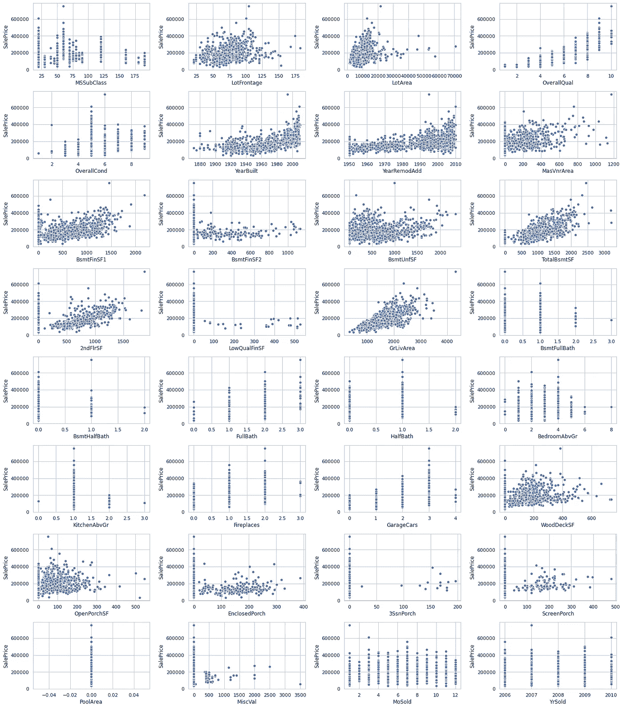**

**图 9。去除异常值后的散点图**

**正如我们所看到的，PoolArea 特性并不重要，因为它将所有培训示例的 pool area 报告为零，因此我们也可以放弃它。**

## **填充数字缺失值:**

**现在，我们必须处理具有缺失值的数字特征。**

```
LotFrontage    0.175070
MasVnrArea     0.005602
SalePrice      0.000000
YrSold         0.000000
LotArea        0.000000
dtype: float64
```

**我们可以看到正面和背面的特征缺少特征。我们可以使用 sklearn 内置的信誉函数用它们的平均值替换它们。**

**更换后，我们可以再次检查数字特征中的任何缺失值:**

```
SalePrice        0.0
YrSold           0.0
LotFrontage      0.0
LotArea          0.0
OverallQual      0.0
OverallCond      0.0
YearBuilt        0.0
YearRemodAdd     0.0
MasVnrArea       0.0
BsmtFinSF1       0.0
BsmtFinSF2       0.0
BsmtUnfSF        0.0
TotalBsmtSF      0.0
2ndFlrSF         0.0
LowQualFinSF     0.0
GrLivArea        0.0
BsmtFullBath     0.0
BsmtHalfBath     0.0
FullBath         0.0
HalfBath         0.0
BedroomAbvGr     0.0
KitchenAbvGr     0.0
Fireplaces       0.0
GarageCars       0.0
WoodDeckSF       0.0
OpenPorchSF      0.0
EnclosedPorch    0.0
3SsnPorch        0.0
ScreenPorch      0.0
MiscVal          0.0
MoSold           0.0
MSSubClass       0.0
dtype: float64
```

**正如我们所看到的，我们已经处理了训练数据中数字特征的所有缺失值。检查测试数据**

```
LotFrontage      0.155586
MasVnrArea       0.010281
BsmtFullBath     0.001371
BsmtHalfBath     0.001371
GarageCars       0.000685
BsmtFinSF1       0.000685
BsmtFinSF2       0.000685
BsmtUnfSF        0.000685
TotalBsmtSF      0.000685
LowQualFinSF     0.000000
LotArea          0.000000
OverallQual      0.000000
OverallCond      0.000000
YearBuilt        0.000000
YearRemodAdd     0.000000
2ndFlrSF         0.000000
YrSold           0.000000
GrLivArea        0.000000
MoSold           0.000000
FullBath         0.000000
HalfBath         0.000000
BedroomAbvGr     0.000000
KitchenAbvGr     0.000000
Fireplaces       0.000000
WoodDeckSF       0.000000
OpenPorchSF      0.000000
EnclosedPorch    0.000000
3SsnPorch        0.000000
ScreenPorch      0.000000
MiscVal          0.000000
MSSubClass       0.000000
dtype: float64
```

**大约有九个要素缺少值。我们可以使用训练集中使用的相同方法，用它们各自的平均值替换它们。**

**更换后再次检查是否有任何缺失值:**

```
YrSold           0.0
GrLivArea        0.0
LotFrontage      0.0
LotArea          0.0
OverallQual      0.0
OverallCond      0.0
YearBuilt        0.0
YearRemodAdd     0.0
MasVnrArea       0.0
BsmtFinSF1       0.0
BsmtFinSF2       0.0
BsmtUnfSF        0.0
TotalBsmtSF      0.0
2ndFlrSF         0.0
LowQualFinSF     0.0
BsmtFullBath     0.0
MoSold           0.0
BsmtHalfBath     0.0
FullBath         0.0
HalfBath         0.0
BedroomAbvGr     0.0
KitchenAbvGr     0.0
Fireplaces       0.0
GarageCars       0.0
WoodDeckSF       0.0
OpenPorchSF      0.0
EnclosedPorch    0.0
3SsnPorch        0.0
ScreenPorch      0.0
MiscVal          0.0
MSSubClass       0.0
dtype: float64
```

**因此，我们已经处理完了训练和测试数据集中数字特征的所有缺失值。**

## **填充分类缺失值:**

**现在让我们看看分类特征的分布。**

**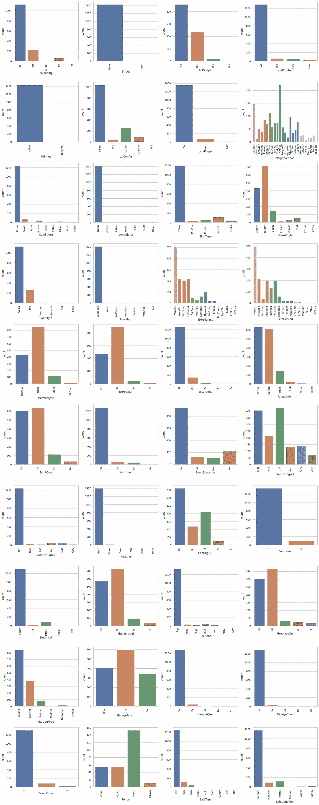**

**图 10。分类变量的分布**

**我们可以看到一些特征是完全扭曲的。我们可以通过检查特征的最高出现类别的频率来验证。**

```
Utilities        1427
Street           1423
Condition2       1415
RoofMatl         1407
Heating          1397
LandSlope        1356
CentralAir       1333
Functional       1329
PavedDrive       1309
Electrical       1302
GarageCond       1295
LandContour      1289
GarageQual       1282
BsmtCond         1279
ExterCond        1256
SaleType         1240
Condition1       1238
BsmtFinType2     1233
BldgType         1190
SaleCondition    1174
RoofStyle        1126
MSZoning         1121
LotConfig        1035
BsmtExposure      940
LotShape          916
ExterQual         893
MasVnrType        849
GarageType        846
KitchenQual       726
HeatingQC         721
HouseStyle        713
BsmtQual          638
Foundation        634
GarageFinish      599
Exterior1st       508
Exterior2nd       497
BsmtFinType1      426
FireplaceQu       366
Neighborhood      221
Fence             153
Name: freq, dtype: object
```

**如上所示，功能“公用事业”、“街道”、“条件 2”、“屋顶材料”、“供暖”是高度倾斜的(因为在 1428 个例子中，它们有大约 1400 次出现在一个条目中)。我们最好删除这些功能。**

**现在，我们将填充分类变量中缺失的值。我们将为分类特征中缺失的值填写一个新的类别“无”。**

**替换后再次检查列车数据集中的缺失值。**

```
SaleCondition    0.0
SaleType         0.0
Foundation       0.0
ExterCond        0.0
ExterQual        0.0
MasVnrType       0.0
Exterior2nd      0.0
Exterior1st      0.0
RoofStyle        0.0
HouseStyle       0.0
BldgType         0.0
Condition1       0.0
Neighborhood     0.0
LandSlope        0.0
LotConfig        0.0
LandContour      0.0
LotShape         0.0
BsmtQual         0.0
BsmtCond         0.0
BsmtExposure     0.0
FireplaceQu      0.0
Fence            0.0
PavedDrive       0.0
GarageCond       0.0
GarageQual       0.0
GarageFinish     0.0
GarageType       0.0
Functional       0.0
BsmtFinType1     0.0
KitchenQual      0.0
Electrical       0.0
CentralAir       0.0
HeatingQC        0.0
Heating          0.0
BsmtFinType2     0.0
MSZoning         0.0
dtype: float64
```

**现在检查测试数据集的分类特征是否缺少值。**

```
Fence            0.801234
FireplaceQu      0.500343
GarageCond       0.053461
GarageQual       0.053461
GarageFinish     0.053461
GarageType       0.052090
BsmtCond         0.030843
BsmtQual         0.030158
BsmtExposure     0.030158
BsmtFinType2     0.028787
BsmtFinType1     0.028787
MasVnrType       0.010966
MSZoning         0.002742
Functional       0.001371
Exterior2nd      0.000685
KitchenQual      0.000685
SaleType         0.000685
Exterior1st      0.000685
HouseStyle       0.000000
LotShape         0.000000
LandContour      0.000000
LotConfig        0.000000
LandSlope        0.000000
Neighborhood     0.000000
Condition1       0.000000
BldgType         0.000000
HeatingQC        0.000000
RoofStyle        0.000000
Heating          0.000000
PavedDrive       0.000000
ExterQual        0.000000
ExterCond        0.000000
Foundation       0.000000
Electrical       0.000000
CentralAir       0.000000
SaleCondition    0.000000
dtype: float64
```

**我们将再次用新的类别“无”替换所有缺失的值，就像在训练数据集中所做的那样。**

**现在在替换后再次检查 test_df 中的缺失值。**

```
SaleCondition    0.0
SaleType         0.0
Foundation       0.0
ExterCond        0.0
ExterQual        0.0
MasVnrType       0.0
Exterior2nd      0.0
Exterior1st      0.0
RoofStyle        0.0
HouseStyle       0.0
BldgType         0.0
Condition1       0.0
Neighborhood     0.0
LandSlope        0.0
LotConfig        0.0
LandContour      0.0
LotShape         0.0
BsmtQual         0.0
BsmtCond         0.0
BsmtExposure     0.0
FireplaceQu      0.0
Fence            0.0
PavedDrive       0.0
GarageCond       0.0
GarageQual       0.0
GarageFinish     0.0
GarageType       0.0
Functional       0.0
BsmtFinType1     0.0
KitchenQual      0.0
Electrical       0.0
CentralAir       0.0
HeatingQC        0.0
Heating          0.0
BsmtFinType2     0.0
MSZoning         0.0
dtype: float64
```

**我们已经替换了训练和测试数据集中所有要素的所有缺失值。我们的电子设计自动化和数据清理到此结束。**

# **使用 Sweetviz 库进行电子设计自动化:**

**正如我们在上述章节中看到的，执行 EDA 是一项非常累人的任务，因为它需要花费大量的时间和精力来可视化数据、执行不同类型的分析并得出有关数据的结论。所有这些工作都可以通过使用一个新的非常有用的库来简化，这个库叫做 [**Sweetviz**](https://github.com/fbdesignpro/sweetviz.git) 。它获取一个熊猫数据帧并创建一个自包含的 HTML 报告。而这一切只需 2 行代码就可以完成！**

**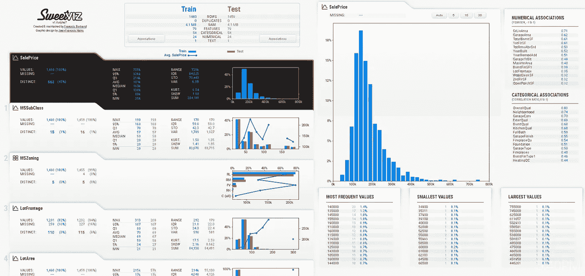**

**图 11。Sweetviz 报告**

**这里有一个 [**链接**](https://drive.google.com/file/d/1zpwSOasaPPGBTLQztwvY1b1_6KZfQXnv/view?usp=sharing) 到包含训练和测试数据集报告的 HTML 文件。我们可以得到所有类型的可视化，如分布图和相关图。我们还提供了数字细节，如缺失值的数量、频繁出现的条目、偏斜度、峰度等。这个库是熊猫轮廓和更酷的可视化的更好版本。**

# **结论:**

**在本文中，我们已经看到了 EDA 过程中涉及的不同步骤。我们看到了如何在各种图中可视化数据，以执行不同类型的分析。我们学习了如何使用这些图来检测异常值，以及如何消除它们。我们通过使用适合特征类型的方法来处理缺失值。然后我们看到了如何使用 Sweetviz 在几行代码中完成所有的分析部分。**

# **推论:**

**[](https://www.kaggle.com/c/home-data-for-ml-course/notebooks) [## Kaggle Learn 用户的房价竞争

### 将你在 Kaggle Learn 上的机器学习课程中学到的东西与课程中的其他人一起应用。

www.kaggle.com](https://www.kaggle.com/c/home-data-for-ml-course/notebooks) 

Kaggle 竞赛中的创作者提交的公共笔记本包含了许多关于处理 EDA 过程中遇到的不同类型问题的信息。如果你有时间，我会推荐你浏览多个笔记本，并在你自己的笔记本上实现这些方法。我从 Kaggle 的公共笔记本上了解了很多关于 EDA 和房价数据集建模的知识。

[](/powerful-eda-exploratory-data-analysis-in-just-two-lines-of-code-using-sweetviz-6c943d32f34) [## 使用 Sweetviz，仅两行代码即可实现强大的 EDA(探索性数据分析)

### 使用这个新的 Python 库，可以更快地了解您的数据

towardsdatascience.com](/powerful-eda-exploratory-data-analysis-in-just-two-lines-of-code-using-sweetviz-6c943d32f34) 

TDS 中的这篇文章引导我将 Sweetviz 用于 EDA。向 Francois Bertrand 和其他贡献者致敬！即使可视化和推论是不言自明的，请参考文章的细节。**